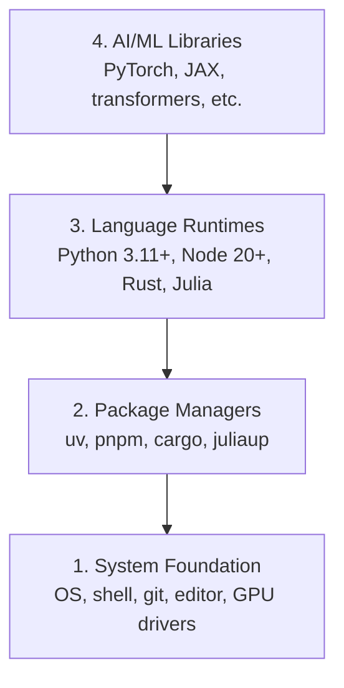

# Środowisko deweloperskie

> Twoje narzędzia kształtują Twoje myślenie. Skonfiguruj je raz, skonfiguruj je dobrze.

**Typ:** Kompilacja
**Języki:** Python, Node.js, Rust
**Wymagania:** Brak
**Czas:** ~45 minut

## Cele nauczania

- Skonfiguruj od podstaw łańcuchy narzędzi Python 3.11+, Node.js 20+ i Rust
- Skonfiguruj środowiska wirtualne i menedżery pakietów w celu uzyskania powtarzalnych kompilacji
- Sprawdź dostęp do GPU za pomocą CUDA/MPS i uruchom operację testową tensora
- Zrozumienie stosu czterowarstwowego: system, pakiety, środowiska wykonawcze, biblioteki AI

## Problem

Za chwilę nauczysz się inżynierii AI na ponad 200 lekcjach z użyciem Pythona, TypeScript, Rust i Julii. Jeśli Twoje środowisko jest zepsute, każda lekcja staje się walką z narzędziami, a nie nauką.

Większość ludzi pomija konfigurację środowiska. Następnie spędzają godziny na debugowaniu błędów importu, konfliktów wersji i brakujących sterowników CUDA. Zrobimy to raz, właściwie.

## Koncepcja

Środowisko inżynieryjne AI składa się z czterech warstw:



Montujemy od dołu do góry. Każda warstwa zależy od warstwy znajdującej się pod nią.

## Zbuduj to

### Krok 1: Podstawa systemu

Sprawdź swój system i zainstaluj podstawy.

```bash
# macOS
xcode-select --install
brew install git curl wget

# Ubuntu/Debian
sudo apt update && sudo apt install -y build-essential git curl wget

# Windows (use WSL2)
wsl --install -d Ubuntu-24.04
```

### Krok 2: Python z uv

Używamy `uv` — jest 10-100 razy szybszy niż pip i automatycznie obsługuje środowiska wirtualne.

```bash
curl -LsSf https://astral.sh/uv/install.sh | sh

uv python install 3.12

uv venv
source .venv/bin/activate  # or .venv\Scripts\activate on Windows

uv pip install numpy matplotlib jupyter
```

Zweryfikuj:

```python
import sys
print(f"Python {sys.version}")

import numpy as np
print(f"NumPy {np.__version__}")
a = np.array([1, 2, 3])
print(f"Vector: {a}, dot product with itself: {np.dot(a, a)}")
```

### Krok 3: Node.js z pnpm

Do lekcji TypeScript (agenci, serwery MCP, aplikacje internetowe).

```bash
curl -fsSL https://fnm.vercel.app/install | bash
fnm install 22
fnm use 22

npm install -g pnpm

node -e "console.log('Node', process.version)"
```

### Krok 4: Rdza

Do lekcji o krytycznym znaczeniu dla wydajności (wnioskowanie, systemy).

```bash
curl --proto '=https' --tlsv1.2 -sSf https://sh.rustup.rs | sh

rustc --version
cargo --version
```

### Krok 5: Julia (opcjonalnie)

Na ciężkie lekcje matematyki, na których Julia błyszczy.

```bash
curl -fsSL https://install.julialang.org | sh

julia -e 'println("Julia ", VERSION)'
```

### Krok 6: Konfiguracja procesora graficznego (jeśli go posiadasz)

```bash
# NVIDIA
nvidia-smi

# Install PyTorch with CUDA
uv pip install torch torchvision torchaudio --index-url https://download.pytorch.org/whl/cu124
```

```python
import torch
print(f"CUDA available: {torch.cuda.is_available()}")
if torch.cuda.is_available():
    print(f"GPU: {torch.cuda.get_device_name(0)}")
```

Brak procesora graficznego? Bez problemu. Większość lekcji działa na procesorze. W przypadku lekcji wymagających intensywnego szkolenia korzystaj z Google Colab lub procesorów graficznych w chmurze.

### Krok 7: Sprawdź wszystko

Uruchom skrypt weryfikacyjny:

```bash
python phases/00-setup-and-tooling/01-dev-environment/code/verify.py
```

## Użyj tego

Twoje środowisko jest teraz gotowe na każdą lekcję w tym kursie. Oto, czego użyjesz gdzie:

| Język | Używany w | Menedżer pakietów |
|---------|---------|--------------------------------|
| Pythona | Fazy ​​1-12 (ML, DL, NLP, wizja, audio, LLM) | UV |
| TypeScript | Fazy ​​13-17 (Narzędzia, Agenci, Roje, Infra) | pnpm |
| Rdza | Fazy ​​12, 15-17 (Systemy o krytycznym znaczeniu dla wydajności) | ładunek |
| Julia | Faza 1 (podstawy matematyki) | Op. |

## Wyślij to

W tej lekcji zostanie utworzony skrypt weryfikacyjny, który każdy może uruchomić w celu sprawdzenia swojej konfiguracji.

Zobacz `outputs/prompt-env-check.md`, aby zobaczyć monit, który pomaga asystentom AI diagnozować problemy ze środowiskiem.

## Ćwiczenia

1. Uruchom skrypt weryfikacyjny i napraw wszelkie błędy
2. Utwórz wirtualne środowisko Python dla tego kursu i zainstaluj PyTorch
3. Napisz „hello world” we wszystkich czterech językach i uruchom każdy z nich