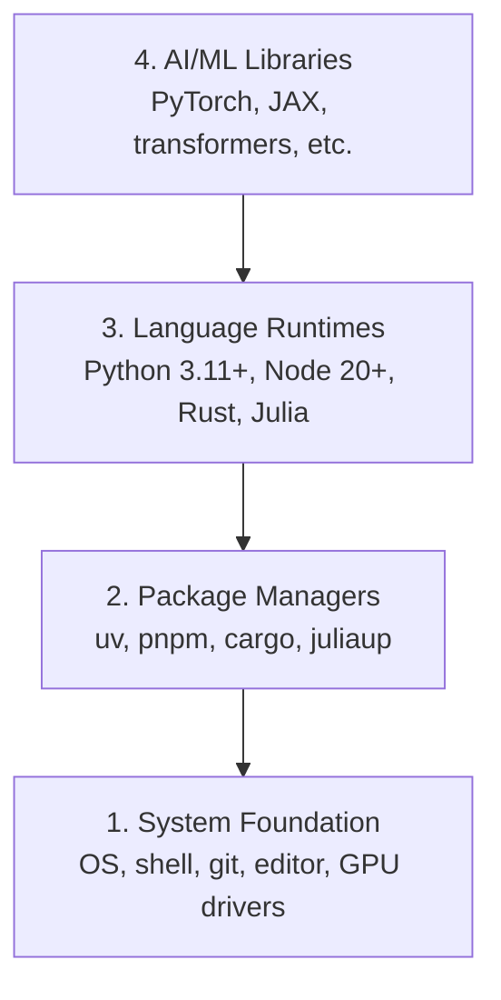

# Środowisko deweloperskie

> Twoje narzędzia kształtują sposób myślenia. Skonfiguruj je raz, zrób to porządnie.

**Typ:** Build
**Języki:** Python, Node.js, Rust
**Wymagania wstępne:** Brak
**Czas:** ~45 minut

## Cele nauki

- Skonfiguruj od podstaw zestawy narzędzi Python 3.11+, Node.js 20+ oraz Rust
- Skonfiguruj środowiska wirtualne i menedżery pakietów dla powtarzalnych buildów
- Zweryfikuj dostęp do GPU za pomocą CUDA/MPS i uruchom testową operację na tensorze
- Zrozum czterowarstwowy stos: system, pakiety, runtime'y, biblioteki AI

## Problem

Za chwilę zaczniesz uczyć się inżynierii AI w ramach ponad 200 lekcji wykorzystujących Python, TypeScript, Rust i Julia. Jeśli Twoje środowisko jest niesprawne, każda pojedyncza lekcja zamienia się w walkę z narzędziami zamiast w naukę.

Większość ludzi pomija konfigurację środowiska. Potem spędza godziny na debugowaniu błędów importu, konfliktów wersji i brakujących sterowników CUDA. My zrobimy to raz, porządnie.

## Koncepcja

Środowisko inżynierii AI składa się z czterech warstw:



Instalujemy od dołu do góry. Każda warstwa zależy od tej poniżej.

## Zbuduj to

### Krok 1: Fundament systemowy

Sprawdź swój system i zainstaluj podstawy.

```bash
# macOS
xcode-select --install
brew install git curl wget

# Ubuntu/Debian
sudo apt update && sudo apt install -y build-essential git curl wget

# Windows (użyj WSL2)
wsl --install -d Ubuntu-24.04
```

### Krok 2: Python z uv

Używamy `uv` — jest 10-100 razy szybszy niż pip i automatycznie obsługuje środowiska wirtualne.

```bash
curl -LsSf https://astral.sh/uv/install.sh | sh

uv python install 3.12

uv venv
source .venv/bin/activate  # or .venv\Scripts\activate on Windows

uv pip install numpy matplotlib jupyter
```

Zweryfikuj:

```python
import sys
print(f"Python {sys.version}")

import numpy as np
print(f"NumPy {np.__version__}")
a = np.array([1, 2, 3])
print(f"Vector: {a}, dot product with itself: {np.dot(a, a)}")
```

### Krok 3: Node.js z pnpm

Do lekcji TypeScript (agenci, serwery MCP, aplikacje webowe).

```bash
curl -fsSL https://fnm.vercel.app/install | bash
fnm install 22
fnm use 22

npm install -g pnpm

node -e "console.log('Node', process.version)"
```

### Krok 4: Rust

Do lekcji wymagających wysokiej wydajności (inferencja, systemy).

```bash
curl --proto '=https' --tlsv1.2 -sSf https://sh.rustup.rs | sh

rustc --version
cargo --version
```

### Krok 5: Julia (opcjonalnie)

Do lekcji intensywnie wykorzystujących matematykę, w których Julia błyszczy.

```bash
curl -fsSL https://install.julialang.org | sh

julia -e 'println("Julia ", VERSION)'
```

### Krok 6: Konfiguracja GPU (jeśli je posiadasz)

```bash
# NVIDIA
nvidia-smi

# Install PyTorch with CUDA
uv pip install torch torchvision torchaudio --index-url https://download.pytorch.org/whl/cu124
```

```python
import torch
print(f"CUDA available: {torch.cuda.is_available()}")
if torch.cuda.is_available():
    print(f"GPU: {torch.cuda.get_device_name(0)}")
```

Nie masz GPU? Żaden problem. Większość lekcji działa na CPU. W przypadku lekcji intensywnie wykorzystujących trening, użyj Google Colab lub GPU w chmurze.

### Krok 7: Zweryfikuj wszystko

Uruchom skrypt weryfikacyjny:

```bash
python phases/00-setup-and-tooling/01-dev-environment/code/verify.py
```

## Wykorzystaj to

Twoje środowisko jest teraz gotowe na każdą lekcję w tym kursie. Oto, czego i gdzie użyjesz:

| Język | Używany w | Menedżer pakietów |
|----------|---------|-----------------|
| Python | Fazy 1-12 (ML, DL, NLP, Vision, Audio, LLM) | uv |
| TypeScript | Fazy 13-17 (Narzędzia, Agenci, Roje, Infrastruktura) | pnpm |
| Rust | Fazy 12, 15-17 (Systemy krytyczne pod względem wydajności) | cargo |
| Julia | Faza 1 (Podstawy matematyczne) | Pkg |

## Dostarcz to

Ta lekcja tworzy skrypt weryfikacyjny, który każdy może uruchomić, aby sprawdzić swoją konfigurację.

Zobacz `outputs/prompt-env-check.md` — prompt, który pomaga asystentom AI diagnozować problemy ze środowiskiem.

## Ćwiczenia

1. Uruchom skrypt weryfikacyjny i napraw wszelkie błędy
2. Utwórz środowisko wirtualne Pythona dla tego kursu i zainstaluj PyTorch
3. Napisz „hello world” we wszystkich czterech językach i uruchom każdy z nich
