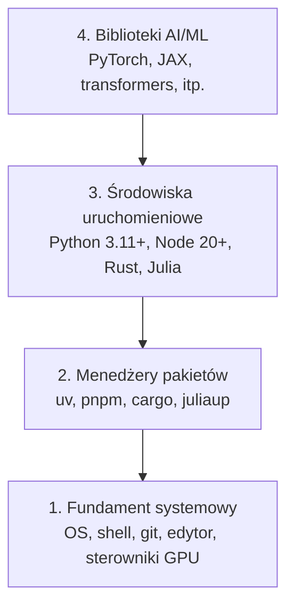

# Środowisko programistyczne

> Twoje narzędzia kształtują Twoje myślenie. Skonfiguruj je raz, a dobrze.

**Typ:** Konfiguracja (Build)
**Języki:** Python, Node.js, Rust
**Wymagania:** Brak
**Czas:** ~45 minut

## Cele nauczania

- Skonfigurujesz od podstaw łańcuchy narzędzi dla Python 3.11+, Node.js 20+ oraz Rust.
- Przygotujesz środowiska wirtualne i menedżery pakietów, aby zapewnić powtarzalność środowisk.
- Zweryfikujesz dostęp do GPU przy pomocy CUDA/MPS i uruchomisz testowe operacje na tensorach.
- Zrozumiesz czterowarstwowy stos technologiczny: system, pakiety, środowiska uruchomieniowe (runtimes), biblioteki AI.

## Problem

Wkrótce zaczniesz uczyć się inżynierii AI, przechodząc przez ponad 200 lekcji z wykorzystaniem języków Python, TypeScript, Rust i Julia. Jeśli Twoje środowisko będzie źle skonfigurowane, każda lekcja zamieni się w walkę z narzędziami, zamiast w proces nauki.

Większość ludzi ignoruje odpowiednią konfigurację środowiska. Potem spędzają godziny na debugowaniu błędów importu, konfliktach wersji czy brakujących sterownikach CUDA. Zrobimy to raz, a porządnie.

## Koncepcja

Środowisko inżynierii AI składa się z czterech warstw:



Budujemy je od dołu do góry. Każda warstwa zależy od tej, która znajduje się pod nią.

## Konfiguracja (Zbuduj to)

### Krok 1: Fundament systemowy

Sprawdź swój system i zainstaluj podstawowe narzędzia.

```bash
# macOS
xcode-select --install
brew install git curl wget

# Ubuntu/Debian
sudo apt update && sudo apt install -y build-essential git curl wget

# Windows (użyj WSL2)
wsl --install -d Ubuntu-24.04
```

### Krok 2: Python z uv

Będziemy używać `uv` – jest od 10 do 100 razy szybszy niż `pip` i automatycznie zarządza środowiskami wirtualnymi.

```bash
curl -LsSf https://astral.sh/uv/install.sh | sh

uv python install 3.12

uv venv
source .venv/bin/activate  # lub .venv\Scripts\activate w systemie Windows

uv pip install numpy matplotlib jupyter
```

Weryfikacja:

```python
import sys
print(f"Python {sys.version}")

import numpy as np
print(f"NumPy {np.__version__}")
a = np.array([1, 2, 3])
print(f"Wektor: {a}, iloczyn skalarny z samym sobą: {np.dot(a, a)}")
```

### Krok 3: Node.js z pnpm

Będzie potrzebny do lekcji o TypeScript (agenci, serwery MCP, aplikacje webowe).

```bash
curl -fsSL https://fnm.vercel.app/install | bash
fnm install 22
fnm use 22

npm install -g pnpm

node -e "console.log('Node', process.version)"
```

### Krok 4: Rust

Używany w lekcjach krytycznych pod względem wydajności (inferencja, systemy niskopoziomowe).

```bash
curl --proto '=https' --tlsv1.2 -sSf https://sh.rustup.rs | sh

rustc --version
cargo --version
```

### Krok 5: Julia (opcjonalnie)

Idealna do lekcji wymagających zaawansowanej matematyki, w czym Julia radzi sobie doskonale.

```bash
curl -fsSL https://install.julialang.org | sh

julia -e 'println("Julia ", VERSION)'
```

### Krok 6: Konfiguracja GPU (jeśli posiadasz)

```bash
# NVIDIA
nvidia-smi

# Instalacja PyTorch z obsługą CUDA
uv pip install torch torchvision torchaudio --index-url https://download.pytorch.org/whl/cu124
```

```python
import torch
print(f"Dostępność CUDA: {torch.cuda.is_available()}")
if torch.cuda.is_available():
    print(f"GPU: {torch.cuda.get_device_name(0)}")
```

Brak GPU? Żaden problem. Większość lekcji działa na CPU. Do lekcji wymagających intensywnego trenowania modeli korzystaj z Google Colab lub maszyn z GPU w chmurze.

### Krok 7: Sprawdź wszystko

Uruchom skrypt weryfikacyjny:

```bash
python phases/00-setup-and-tooling/01-dev-environment/code/verify.py
```

## Użycie w praktyce

Twoje środowisko jest teraz gotowe na każdą lekcję w tym kursie. Oto zestawienie, co i gdzie będzie wykorzystywane:

| Język | Wykorzystywany w | Menedżer pakietów |
|---------|--------------------|-------------------|
| Python | Fazy 1-12 (ML, DL, NLP, wizja, audio, LLM) | uv |
| TypeScript | Fazy 13-17 (Narzędzia, Agenci, Rój, Infrastruktura) | pnpm |
| Rust | Fazy 12, 15-17 (Systemy o krytycznej wydajności) | cargo |
| Julia | Faza 1 (Podstawy matematyki) | Pkg |

## Rezultat (Wyślij to)

W tej lekcji dowiedziałeś się, jak uruchomić skrypt weryfikacyjny, który każdy może wykorzystać do przetestowania własnej konfiguracji.

Zajrzyj do `outputs/prompt-env-check.md`, aby zobaczyć prompt (zapytanie), który pomaga asystentom AI w diagnozowaniu problemów ze środowiskiem.

## Ćwiczenia

1. Uruchom skrypt weryfikacyjny i napraw wszelkie błędy.
2. Utwórz wirtualne środowisko Python dla tego kursu i zainstaluj PyTorch.
3. Napisz program „Hello World” we wszystkich czterech językach i uruchom każdy z nich.
