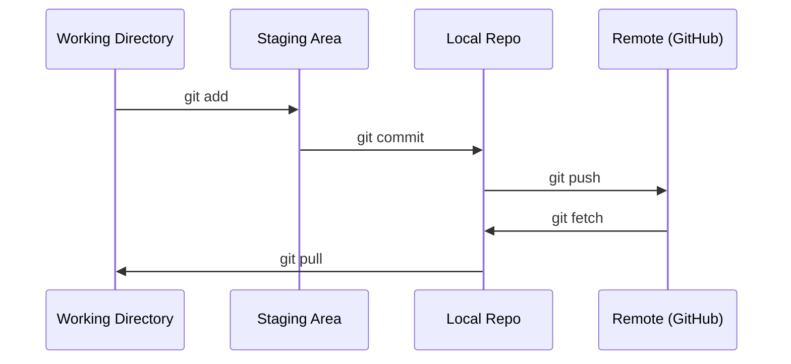

# Git i współpraca

> Kontrola wersji nie jest opcjonalna. Każdy eksperyment, każdy model i każda lekcja, którą tu zbudujesz, są śledzone.

**Typ:** Ucz się
**Języki:** --
**Wymagania:** Faza 0, Lekcja 01
**Czas:** ~30 minut

## Cele nauczania

- Skonfiguruj tożsamość git i korzystaj z codziennego przepływu pracy polegającego na dodawaniu, zatwierdzaniu i wypychaniu
- Twórz i łącz gałęzie dla izolowanych eksperymentów bez przerywania głównego
- Napisz `.gitignore`, który wyklucza punkty kontrolne modelu i duże pliki binarne
- Nawiguj po historii zatwierdzeń za pomocą `git log`, aby zrozumieć ewolucję projektu

## Problem

Za chwilę napiszesz setki plików kodu w 20 fazach. Bez kontroli wersji stracisz pracę, zepsujesz rzeczy, których nie można cofnąć, i nie będziesz mieć możliwości współpracy z innymi.

Git jest narzędziem. GitHub to miejsce, w którym znajduje się kod. Ta lekcja obejmuje wszystko, czego potrzebujesz do tego kursu i nic więcej.

## Koncepcja



Trzy rzeczy do zapamiętania:
1. Często zapisuj (`git commit`)
2. Prześlij do pilota (`git push`)
3. Oddział eksperymentów (`git checkout -b experiment`)

## Zbuduj to

### Krok 1: Skonfiguruj git

```bash
git config --global user.name "Your Name"
git config --global user.email "you@example.com"
```

### Krok 2: Codzienny przepływ pracy

```bash
git status
git add file.py
git commit -m "Add perceptron implementation"
git push origin main
```

### Krok 3: Rozgałęzianie eksperymentów

```bash
git checkout -b experiment/new-optimizer

# ... make changes, commit ...

git checkout main
git merge experiment/new-optimizer
```

### Krok 4: Praca z repozytorium kursu

```bash
git clone https://github.com/rohitg00/ai-engineering-from-scratch.git
cd ai-engineering-from-scratch

git checkout -b my-progress
# work through lessons, commit your code
git push origin my-progress
```

## Użyj tego

Do tego kursu potrzebne będą dokładnie te polecenia:

| Polecenie | Kiedy |
|--------|------|
| `git clone` | Pobierz repozytorium kursu |
| `git add` + `git commit` | Zapisz swoją pracę |
| `git push` | Utwórz kopię zapasową w GitHub |
| `git checkout -b` | Spróbuj czegoś bez przerywania głównego |
| `git log --oneline` | Zobacz co zrobiłeś |

To wszystko. Do tego kursu nie potrzebujesz rebase, cherry-pick ani submodułów.

## Ćwiczenia

1. Sklonuj to repozytorium, utwórz gałąź o nazwie `my-progress`, utwórz plik, zatwierdź go, wypchnij
2. Utwórz `.gitignore`, który wyklucza pliki punktów kontrolnych modelu (`.pt`, `.pth`, `.safetensors`)
3. Przejrzyj historię zatwierdzeń tego repozytorium za pomocą `git log --oneline` i przeczytaj, jak dodano lekcje

## Kluczowe terminy

| Termin | Co ludzie mówią | Co to właściwie oznacza |
|------|----------------|----------------------|
| Zobowiąż się | „Oszczędzanie” | Migawka całego projektu w danym momencie |
| Oddział | „Kopia” | Wskaźnik do zatwierdzenia, który postępuje w miarę pracy |
| Połącz | „Łączenie kodu” | Pobieranie zmian z jednej gałęzi i stosowanie ich w innej |
| Zdalny | „Chmura” | Kopia Twojego repozytorium hostowana gdzie indziej (GitHub, GitLab) |