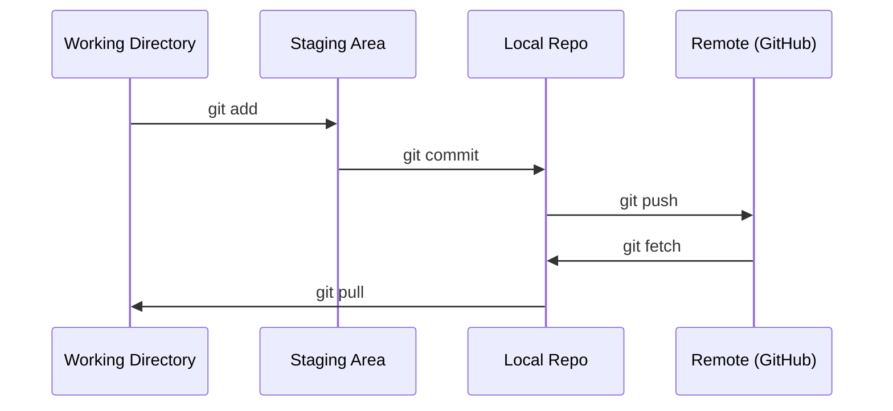

# Git i współpraca

> Kontrola wersji nie jest opcjonalna. Każdy eksperyment, każdy model, każda lekcja, którą tu zbudujesz, jest śledzona.

**Typ:** Nauka
**Języki:** --
**Wymagania wstępne:** Faza 0, Lekcja 01
**Czas:** ~30 minut

## Cele nauki

- Skonfiguruj tożsamość git i poznaj codzienny workflow add, commit i push
- Twórz i scalaj branche dla izolowanych eksperymentów bez psucia main
- Napisz `.gitignore`, który wyklucza checkpointy modeli i duże pliki binarne
- Poruszaj się po historii commitów za pomocą `git log`, aby zrozumieć ewolucję projektu

## Problem

Za chwilę napiszesz setki plików kodu w 20 fazach. Bez kontroli wersji stracisz pracę, zepsujesz coś, czego nie da się cofnąć, i nie będziesz mieć możliwości współpracy z innymi.

Git to narzędzie. GitHub to miejsce, gdzie żyje kod. Ta lekcja obejmuje to, czego potrzebujesz na potrzeby tego kursu, i nic więcej.

## Koncepcja



Trzy rzeczy do zapamiętania:
1. Zapisuj często (`git commit`)
2. Wypychaj do zdalnego repozytorium (`git push`)
3. Twórz branche dla eksperymentów (`git checkout -b experiment`)

## Zbuduj to

### Krok 1: Skonfiguruj git

```bash
git config --global user.name "Your Name"
git config --global user.email "you@example.com"
```

### Krok 2: Codzienny workflow

```bash
git status
git add file.py
git commit -m "Add perceptron implementation"
git push origin main
```

### Krok 3: Branchowanie do eksperymentów

```bash
git checkout -b experiment/new-optimizer

# ... wprowadź zmiany, zrób commit ...

git checkout main
git merge experiment/new-optimizer
```

### Krok 4: Praca z repozytorium tego kursu

```bash
git clone https://github.com/rohitg00/ai-engineering-from-scratch.git
cd ai-engineering-from-scratch

git checkout -b my-progress
# przerabiaj lekcje, commituj swój kod
git push origin my-progress
```

## Zastosowanie

Na potrzeby tego kursu potrzebujesz dokładnie tych poleceń:

| Polecenie | Kiedy |
|---------|------|
| `git clone` | Pobranie repozytorium kursu |
| `git add` + `git commit` | Zapisanie swojej pracy |
| `git push` | Zrobienie kopii zapasowej na GitHub |
| `git checkout -b` | Wypróbowanie czegoś bez psucia main |
| `git log --oneline` | Sprawdzenie, co już zrobiłeś |

To wszystko. Nie potrzebujesz rebase, cherry-pick ani submodułów na potrzeby tego kursu.

## Ćwiczenia

1. Sklonuj to repozytorium, utwórz branch o nazwie `my-progress`, stwórz plik, zrób commit i wypchnij go (push)
2. Stwórz `.gitignore`, który wyklucza pliki checkpointów modeli (`.pt`, `.pth`, `.safetensors`)
3. Przejrzyj historię commitów tego repozytorium za pomocą `git log --oneline` i zobacz, jak dodawane były lekcje

## Kluczowe pojęcia

| Termin | Co mówią ludzie | Co to faktycznie oznacza |
|------|----------------|----------------------|
| Commit | „Zapisywanie" | Migawka (snapshot) całego projektu w danym momencie |
| Branch (gałąź) | „Kopia" | Wskaźnik na commit, który przesuwa się do przodu w miarę pracy |
| Merge (scalenie) | „Łączenie kodu" | Przeniesienie zmian z jednego brancha i zastosowanie ich na innym |
| Remote (zdalne repozytorium) | „Chmura" | Kopia twojego repozytorium hostowana gdzie indziej (GitHub, GitLab) |
