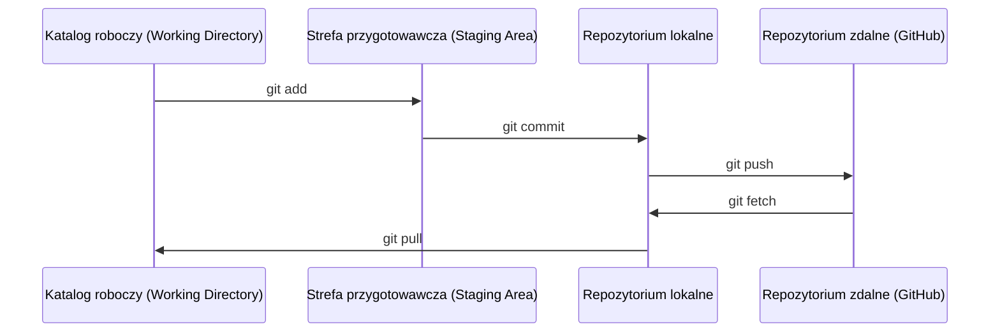

# Git i praca zespołowa

> System kontroli wersji nie jest opcjonalny. Każdy eksperyment, każdy model i każda zrealizowana lekcja w tym kursie będą dzięki niemu śledzone.

**Typ:** Teoria / Praktyka
**Języki:** --
**Wymagania:** Faza 0, Lekcja 01
**Czas:** ~30 minut

## Cele nauczania

- Skonfigurujesz swoją tożsamość w Git i poznasz codzienny przepływ pracy (workflow): `add`, `commit` oraz `push`.
- Zdobędziesz umiejętność tworzenia i łączenia gałęzi (branches), aby izolować eksperymenty bez ryzyka zepsucia gałęzi `main`.
- Napiszesz plik `.gitignore`, który wykluczy z repozytorium punkty kontrolne modeli (checkpoints) i duże pliki binarne.
- Nauczysz się nawigować po historii zmian za pomocą `git log`, co ułatwi zrozumienie ewolucji projektu.

## Problem

W ramach 20 faz kursu stworzysz setki plików z kodem. Bez systemu kontroli wersji prędzej czy później stracisz postępy, zepsujesz coś, czego nie da się łatwo cofnąć, a praca z innymi stanie się wręcz niemożliwa.

Git to potężne narzędzie, z kolei GitHub to platforma, w której przechowywany jest kod. W tej lekcji nauczysz się dokładnie tego, co jest niezbędne w tym kursie – i niczego poza tym.

## Koncepcja



Trzy najważniejsze rzeczy do zapamiętania:
1. Często zapisuj zmiany (`git commit`).
2. Wypychaj zmiany na serwer (`git push`).
3. Twórz osobne gałęzie do eksperymentów (`git checkout -b experiment`).

## Praktyka (Zbuduj to)

### Krok 1: Skonfiguruj Gita

```bash
git config --global user.name "Twoje Imię i Nazwisko"
git config --global user.email "ty@example.com"
```

### Krok 2: Codzienny cykl pracy

```bash
git status
git add file.py
git commit -m "Dodaj implementację perceptronu"
git push origin main
```

### Krok 3: Tworzenie gałęzi dla eksperymentów

```bash
git checkout -b experiment/new-optimizer

# ... wprowadzaj zmiany, rób commity ...

git checkout main
git merge experiment/new-optimizer
```

### Krok 4: Praca z repozytorium kursu

```bash
git clone https://github.com/rohitg00/ai-engineering-from-scratch.git
cd ai-engineering-from-scratch

git checkout -b my-progress
# przerabiaj lekcje, zapisuj (commit) swój kod
git push origin my-progress
```

## Użycie w praktyce

Podczas tego kursu będziesz potrzebować wyłącznie tych poleceń:

| Polecenie | Zastosowanie |
|--------|------|
| `git clone` | Pobranie repozytorium kursu. |
| `git add` + `git commit` | Zapisywanie Twojej pracy w historii. |
| `git push` | Utworzenie kopii zapasowej na GitHubie. |
| `git checkout -b` | Testowanie nowych rozwiązań bez psucia głównej gałęzi (`main`). |
| `git log --oneline` | Przegląd dotychczasowej pracy i historii zmian. |

To naprawdę wszystko. Do tego kursu nie musisz znać `rebase`, `cherry-pick` ani submodułów.

## Ćwiczenia

1. Sklonuj to repozytorium, utwórz gałąź o nazwie `my-progress`, stwórz nowy plik, zatwierdź go (commit) i wypchnij (push).
2. Utwórz plik `.gitignore`, który upewni się, że pliki punktów kontrolnych modeli (`.pt`, `.pth`, `.safetensors`) nie trafią do repozytorium.
3. Przejrzyj historię commitów w tym repozytorium za pomocą `git log --oneline` i zobacz, jak były dodawane kolejne lekcje.

## Kluczowe pojęcia

| Termin | Potoczne określenie | Rzeczywiste znaczenie |
|------|----------------|----------------------|
| Commit / Zatwierdzenie | „Zapisywanie” | Zrzut (migawka) całego projektu w konkretnym punkcie w czasie. |
| Branch / Gałąź | „Kopia robocza” | Wskaźnik na konkretny commit, który przesuwa się do przodu w miarę Twojej pracy. |
| Merge / Scalanie | „Łączenie kodu” | Pobranie zmian z jednej gałęzi i nałożenie ich na inną. |
| Remote / Repozytorium zdalne | „Chmura” | Kopia Twojego repozytorium utrzymywana na zewnętrznym serwerze (np. GitHub, GitLab). |
