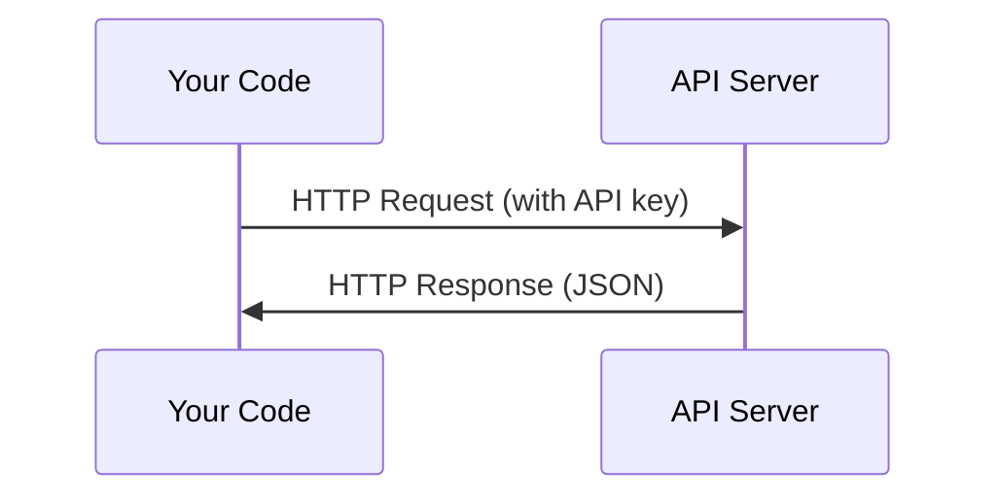

# API i klucze

> Każde API AI działa w ten sam sposób: wyślij żądanie, uzyskaj odpowiedź. Szczegóły się zmieniają, wzór nie.

**Typ:** Kompilacja
**Języki:** Python, TypeScript
**Wymagania:** Faza 0, Lekcja 01
**Czas:** ~30 minut

## Cele nauczania

- Bezpiecznie przechowuj klucze API przy użyciu zmiennych środowiskowych i plików `.env`
- Wykonaj wywołanie API LLM, używając zarówno zestawu Anthropic Python SDK, jak i surowego protokołu HTTP
- Porównaj formaty żądań/odpowiedzi oparte na SDK i surowym HTTP na potrzeby debugowania
- Identyfikuj i obsługuj typowe błędy API, w tym ograniczenia uwierzytelniania i szybkości

## Problem

Począwszy od fazy 11, będziesz wywoływać interfejsy API LLM (Anthropic, OpenAI, Google). W fazach 13–16 zbudujesz agentów korzystających z tych interfejsów API w pętlach. Musisz wiedzieć, jak działają klucze API, jak je bezpiecznie przechowywać i jak wykonać pierwsze wywołanie API.

## Koncepcja



Każde wywołanie API ma:
1. Punkt końcowy (URL)
2. Klucz API (uwierzytelnienie)
3. Treść żądania (co chcesz)
4. Treść odpowiedzi (co otrzymasz w zamian)

## Zbuduj to

### Krok 1: Bezpiecznie przechowuj klucze API

Nigdy nie umieszczaj kluczy API w kodzie. Użyj zmiennych środowiskowych.

```bash
export ANTHROPIC_API_KEY="sk-ant-..."
export OPENAI_API_KEY="sk-..."
```

Lub użyj pliku `.env` (dodaj go do `.gitignore`):

```
ANTHROPIC_API_KEY=sk-ant-...
OPENAI_API_KEY=sk-...
```

### Krok 2: Pierwsze wywołanie API (Python)

```python
import anthropic

client = anthropic.Anthropic()

response = client.messages.create(
    model="claude-sonnet-4-20250514",
    max_tokens=256,
    messages=[{"role": "user", "content": "What is a neural network in one sentence?"}]
)

print(response.content[0].text)
```

### Krok 3: Pierwsze wywołanie API (TypeScript)

```typescript
import Anthropic from "@anthropic-ai/sdk";

const client = new Anthropic();

const response = await client.messages.create({
  model: "claude-sonnet-4-20250514",
  max_tokens: 256,
  messages: [{ role: "user", content: "What is a neural network in one sentence?" }],
});

console.log(response.content[0].text);
```

### Krok 4: Surowy HTTP (bez SDK)

```python
import os
import urllib.request
import json

url = "https://api.anthropic.com/v1/messages"
headers = {
    "Content-Type": "application/json",
    "x-api-key": os.environ["ANTHROPIC_API_KEY"],
    "anthropic-version": "2023-06-01",
}
body = json.dumps({
    "model": "claude-sonnet-4-20250514",
    "max_tokens": 256,
    "messages": [{"role": "user", "content": "What is a neural network in one sentence?"}],
}).encode()

req = urllib.request.Request(url, data=body, headers=headers, method="POST")
with urllib.request.urlopen(req) as resp:
    result = json.loads(resp.read())
    print(result["content"][0]["text"])
```

To właśnie robią SDK pod maską. Zrozumienie surowego wywołania HTTP pomaga podczas debugowania.

## Użyj tego

Dla tego kursu:

| API | Kiedy tego potrzebujesz | Poziom bezpłatny |
|-----|-----------------|----------|
| Antropiczny (Claude) | Fazy ​​11-16 (agenci, narzędzia) | 5 dolarów kredytu przy rejestracji |
| OpenAI | Faza 11 (porównanie) | 5 dolarów kredytu przy rejestracji |
| Przytulanie twarzy | Fazy ​​4-10 (modele, zbiory danych) | Bezpłatne |

Nie potrzebujesz ich wszystkich teraz. Ustaw je, gdy wymaga tego lekcja.

## Wyślij to

Ta lekcja daje:
- `outputs/prompt-api-troubleshooter.md` - diagnozuj typowe błędy API

## Ćwiczenia

1. Zdobądź klucz Anthropic API i wykonaj pierwsze wywołanie API
2. Wypróbuj surową wersję HTTP i porównaj format odpowiedzi z wersją SDK
3. Celowo użyj nieprawidłowego klucza API i przeczytaj komunikat o błędzie

## Kluczowe terminy

| Termin | Co ludzie mówią | Co to właściwie oznacza |
|------|----------------|----------------------|
| Klucz API | „Hasło do API” | Unikalny ciąg znaków identyfikujący Twoje konto i autoryzujący żądania |
| Limit stawki | „Duszają mnie” | Maksymalna liczba żądań na minutę/godzinę, aby zapobiec nadużyciom i zapewnić uczciwe wykorzystanie |
| Znak | „Słowo” (w kontekście API) | Jednostka rozliczeniowa: żetony wejściowe i wyjściowe są liczone i pobierane oddzielnie |
| Transmisja | „Odpowiedzi w czasie rzeczywistym” | Uzyskiwanie odpowiedzi słowo po słowie zamiast czekania na pełną odpowiedź |