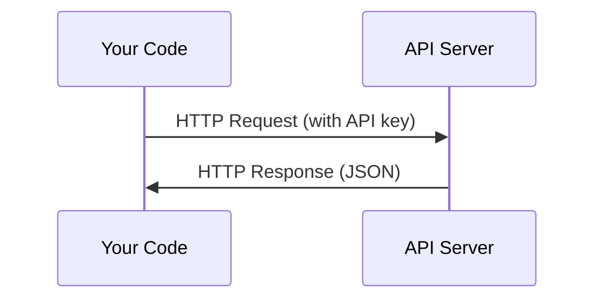

# API i klucze

> Każde API AI działa tak samo: wysyłasz zapytanie, otrzymujesz odpowiedź. Szczegóły się zmieniają, schemat nie.

**Typ:** Build
**Języki:** Python, TypeScript
**Wymagania wstępne:** Faza 0, Lekcja 01
**Czas:** ~30 minut

## Cele nauki

- Bezpieczne przechowywanie kluczy API przy użyciu zmiennych środowiskowych i plików `.env`
- Wykonanie zapytania do API LLM zarówno za pomocą Anthropic Python SDK, jak i surowego HTTP
- Porównanie formatów zapytań/odpowiedzi opartych na SDK i surowym HTTP pod kątem debugowania
- Identyfikacja i obsługa typowych błędów API, w tym błędów uwierzytelniania i limitów żądań (rate limits)

## Problem

Począwszy od Fazy 11, będziesz wywoływać API LLM (Anthropic, OpenAI, Google). W Fazach 13-16 zbudujesz agenty, które używają tych API w pętlach. Musisz wiedzieć, jak działają klucze API, jak je bezpiecznie przechowywać i jak wykonać swoje pierwsze zapytanie do API.

## Koncepcja



Każde wywołanie API składa się z:
1. Endpointu (URL)
2. Klucza API (uwierzytelnienie)
3. Treści zapytania (czego chcesz)
4. Treści odpowiedzi (co otrzymujesz)

## Zbuduj to

### Krok 1: Bezpieczne przechowywanie kluczy API

Nigdy nie umieszczaj kluczy API w kodzie. Używaj zmiennych środowiskowych.

```bash
export ANTHROPIC_API_KEY="sk-ant-..."
export OPENAI_API_KEY="sk-..."
```

Albo użyj pliku `.env` (dodaj go do `.gitignore`):

```
ANTHROPIC_API_KEY=sk-ant-...
OPENAI_API_KEY=sk-...
```

### Krok 2: Pierwsze zapytanie do API (Python)

```python
import anthropic

client = anthropic.Anthropic()

response = client.messages.create(
    model="claude-sonnet-4-20250514",
    max_tokens=256,
    messages=[{"role": "user", "content": "What is a neural network in one sentence?"}]
)

print(response.content[0].text)
```

### Krok 3: Pierwsze zapytanie do API (TypeScript)

```typescript
import Anthropic from "@anthropic-ai/sdk";

const client = new Anthropic();

const response = await client.messages.create({
  model: "claude-sonnet-4-20250514",
  max_tokens: 256,
  messages: [{ role: "user", content: "What is a neural network in one sentence?" }],
});

console.log(response.content[0].text);
```

### Krok 4: Surowy HTTP (bez SDK)

```python
import os
import urllib.request
import json

url = "https://api.anthropic.com/v1/messages"
headers = {
    "Content-Type": "application/json",
    "x-api-key": os.environ["ANTHROPIC_API_KEY"],
    "anthropic-version": "2023-06-01",
}
body = json.dumps({
    "model": "claude-sonnet-4-20250514",
    "max_tokens": 256,
    "messages": [{"role": "user", "content": "What is a neural network in one sentence?"}],
}).encode()

req = urllib.request.Request(url, data=body, headers=headers, method="POST")
with urllib.request.urlopen(req) as resp:
    result = json.loads(resp.read())
    print(result["content"][0]["text"])
```

To właśnie robią SDK pod spodem. Zrozumienie surowego zapytania HTTP pomaga przy debugowaniu.

## Zastosuj to

Na potrzeby tego kursu:

| API | Kiedy będzie potrzebne | Darmowy pakiet |
|-----|-----------------|-----------|
| Anthropic (Claude) | Fazy 11-16 (agenty, narzędzia) | 5$ kredytu przy rejestracji |
| OpenAI | Faza 11 (porównanie) | 5$ kredytu przy rejestracji |
| Hugging Face | Fazy 4-10 (modele, datasety) | Darmowe |

Nie potrzebujesz wszystkich tych API od razu. Skonfiguruj je, gdy wymaga tego dana lekcja.

## Dostarcz efekt końcowy

Ta lekcja prowadzi do powstania:
- `outputs/prompt-api-troubleshooter.md` - diagnozowanie typowych błędów API

## Ćwiczenia

1. Uzyskaj klucz API Anthropic i wykonaj swoje pierwsze zapytanie do API
2. Wypróbuj wersję z surowym HTTP i porównaj format odpowiedzi z wersją SDK
3. Celowo użyj błędnego klucza API i przeczytaj komunikat błędu

## Kluczowe pojęcia

| Pojęcie | Co mówią ludzie | Co to faktycznie oznacza |
|------|----------------|----------------------|
| Klucz API | "Hasło do API" | Unikalny ciąg znaków identyfikujący Twoje konto i autoryzujący zapytania |
| Rate limit | "Ograniczają mi przepustowość" | Maksymalna liczba zapytań na minutę/godzinę, mająca zapobiegać nadużyciom i zapewniać sprawiedliwe korzystanie |
| Token | "Słowo" (w kontekście API) | Jednostka rozliczeniowa: tokeny wejściowe i wyjściowe są liczone i rozliczane osobno |
| Streaming | "Odpowiedzi w czasie rzeczywistym" | Otrzymywanie odpowiedzi słowo po słowie zamiast czekania na pełną odpowiedź |
