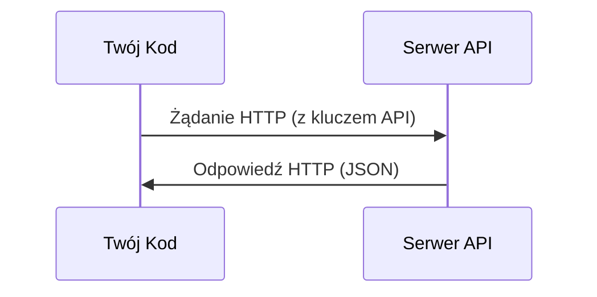

# API i klucze

> Każde API AI działa w ten sam sposób: wyślij żądanie, uzyskaj odpowiedź. Szczegóły się zmieniają, wzór pozostaje.

**Typ:** Konfiguracja (Build)
**Języki:** Python, TypeScript
**Wymagania:** Faza 0, Lekcja 01
**Czas:** ~30 minut

## Cele nauczania

- Bezpiecznie przechowuj klucze API przy użyciu zmiennych środowiskowych i plików `.env`.
- Wykonuj wywołania do API modeli LLM, korzystając z oficjalnego SDK w Pythonie oraz surowych zapytań HTTP.
- Porównuj formaty żądań i odpowiedzi pomiędzy pakietem SDK a czystym HTTP w celu skuteczniejszego debugowania.
- Rozpoznawaj i obsługuj typowe błędy API, w tym problemy z autoryzacją i limity zapytań (rate limits).

## Problem

Począwszy od fazy 11, będziesz odpytywać API różnych modeli LLM (Anthropic, OpenAI, Google). W fazach 13–16 stworzysz agentów, którzy będą cyklicznie korzystać z tych interfejsów w pętlach. Musisz wiedzieć, jak działają klucze API, jak bezpiecznie nimi zarządzać oraz w jaki sposób wykonać pierwsze zapytanie do API.

## Koncepcja



Każde zapytanie (wywołanie) API składa się z:
1. Endpointu (adresu URL).
2. Klucza API (autoryzacja).
3. Treści żądania (body) — tego, o co prosisz.
4. Treści odpowiedzi (response) — tego, co otrzymujesz w zamian.

## Praktyka (Zbuduj to)

### Krok 1: Bezpieczne przechowywanie kluczy API

Nigdy nie wpisuj na twardo kluczy API (hardcode) bezpośrednio do kodu źródłowego. Korzystaj ze zmiennych środowiskowych.

```bash
export ANTHROPIC_API_KEY="sk-ant-..."
export OPENAI_API_KEY="sk-..."
```

Ewentualnie użyj pliku `.env` (upewnij się, że dodałeś go do `.gitignore`!):

```
ANTHROPIC_API_KEY=sk-ant-...
OPENAI_API_KEY=sk-...
```

### Krok 2: Pierwsze zapytanie do API (Python)

```python
import anthropic

client = anthropic.Anthropic()

response = client.messages.create(
    model="claude-sonnet-4-20250514",
    max_tokens=256,
    messages=[{"role": "user", "content": "Czym jest sieć neuronowa w jednym zdaniu?"}]
)

print(response.content[0].text)
```

### Krok 3: Pierwsze zapytanie do API (TypeScript)

```typescript
import Anthropic from "@anthropic-ai/sdk";

const client = new Anthropic();

const response = await client.messages.create({
  model: "claude-sonnet-4-20250514",
  max_tokens: 256,
  messages: [{ role: "user", content: "Czym jest sieć neuronowa w jednym zdaniu?" }],
});

console.log(response.content[0].text);
```

### Krok 4: Surowe wywołanie HTTP (bez użycia SDK)

```python
import os
import urllib.request
import json

url = "https://api.anthropic.com/v1/messages"
headers = {
    "Content-Type": "application/json",
    "x-api-key": os.environ["ANTHROPIC_API_KEY"],
    "anthropic-version": "2023-06-01",
}
body = json.dumps({
    "model": "claude-sonnet-4-20250514",
    "max_tokens": 256,
    "messages": [{"role": "user", "content": "Czym jest sieć neuronowa w jednym zdaniu?"}],
}).encode()

req = urllib.request.Request(url, data=body, headers=headers, method="POST")
with urllib.request.urlopen(req) as resp:
    result = json.loads(resp.read())
    print(result["content"][0]["text"])
```

Pod maską właśnie to robi każdy SDK. Zrozumienie, jak wygląda wywołanie na poziomie protokołu HTTP, bywa bardzo przydatne podczas debugowania.

## Użycie w praktyce

W tym kursie zastosowanie będą miały:

| Dostawca API | Zastosowanie | Darmowy poziom (Free tier) |
|-----|-----------------|----------|
| Anthropic (Claude) | Fazy 11-16 (agenci, narzędzia) | Drobny kredyt startowy po rejestracji (często 5 USD) |
| OpenAI | Faza 11 (na potrzeby porównań) | Drobny kredyt startowy po rejestracji (często 5 USD) |
| Hugging Face | Fazy 4-10 (modele open-source, zbiory danych) | Zupełnie darmowe API |

Nie musisz teraz odblokowywać wszystkich. Skonfiguruj je w momencie, gdy będą potrzebne w konkretnej lekcji.

## Rezultat (Wyślij to)

Ta lekcja udostępnia Ci:
- `outputs/prompt-api-troubleshooter.md` — narzędzie/prompt, który pomoże Ci w diagnozowaniu najpopularniejszych błędów z API.

## Ćwiczenia

1. Zarejestruj się, wygeneruj klucz API z platformy Anthropic i wykonaj swoje pierwsze poprawne zapytanie z poziomu Pythona.
2. Przetestuj surową metodę po HTTP i porównaj otrzymany format JSON z wynikiem zwracanym przez obiekt z SDK.
3. Celowo podmień znak w swoim kluczu API, aby wywołać błąd `401 Unauthorized`. Zobacz i przeanalizuj otrzymany komunikat o błędzie.

## Kluczowe pojęcia

| Termin | Potoczne określenie | Rzeczywiste znaczenie |
|------|----------------|----------------------|
| Klucz API (API Key) | „Hasło do API” | Unikalny identyfikator uwierzytelniający, który identyfikuje Twoje konto i pozwala na autoryzowanie zapytań. |
| Limit zapytań (Rate limit) | „Odcięcie” / „Blokada” | Ograniczenie maksymalnej liczby żądań na minutę (RPM) lub tokenów na minutę (TPM), wprowadzone przez serwer w celu uniknięcia nadużyć (DDoS, przeciążenia serwerów). |
| Token | „Słowo” (w świecie LLM) | Podstawowa jednostka rozliczeniowa. Interfejsy API naliczają osobne opłaty za tokeny przesłane w prompcie (input) i wygenerowane w odpowiedzi (output). |
| Strumieniowanie (Streaming) | „Odpowiedzi na żywo” | Stopniowe odsyłanie wygenerowanych słów (tokenów) natychmiast po ich utworzeniu przez model, w przeciwieństwie do czekania w zawieszeniu na kompletny wywód. |
