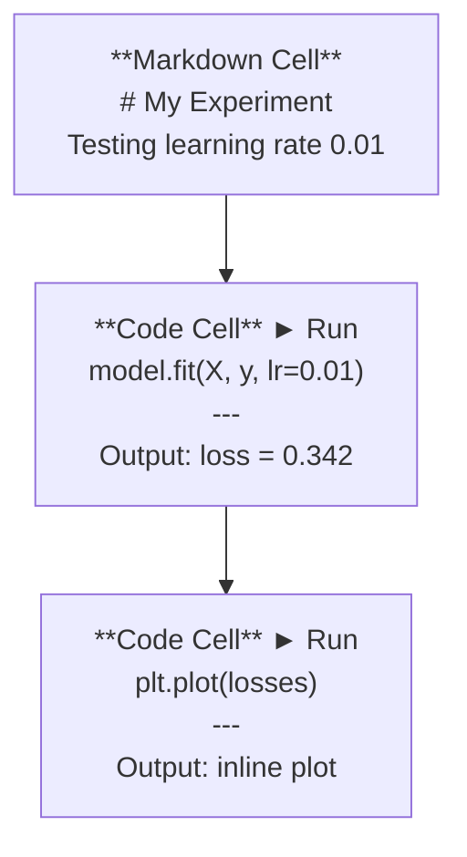
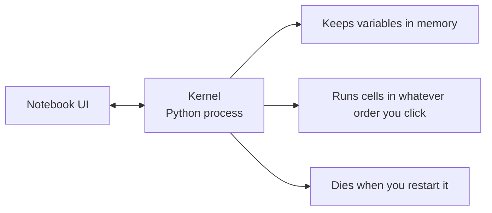

# Notatniki Jupyter

> Notatniki to stół laboratoryjny inżyniera AI. Tutaj prototypujesz, a to, co działa, przenosicie do produkcji.

**Typ:** Build
**Języki:** Python
**Wymagania wstępne:** Faza 0, Lekcja 01
**Czas:** ~30 minut

## Cele nauki

- Zainstalować i uruchomić JupyterLab, Jupyter Notebook lub VS Code z rozszerzeniem Jupyter
- Używać poleceń magicznych (`%timeit`, `%%time`, `%matplotlib inline`) do mierzenia wydajności i wizualizacji w locie
- Rozróżniać, kiedy używać notatników, a kiedy skryptów, i stosować podejście "eksploruj w notatnikach, wysyłaj w skryptach"
- Rozpoznawać i unikać typowych pułapek notatników: wykonania w nieprawidłowej kolejności, ukrytego stanu i wycieków pamięci

## Problem

Każdy artykuł naukowy o AI, tutorial i konkurs na Kaggle korzysta z notatników Jupyter. Pozwalają one uruchamiać kod we fragmentach, widzieć wyniki w linii, łączyć kod z wyjaśnieniami i szybko iterować. Jeśli próbujesz uczyć się AI bez notatników, to tak jakbyś robił zadanie z matematyki bez brudnopisu.

Ale notatniki mają swoje pułapki. Ludzie używają ich do wszystkiego, w tym do rzeczy, w których są fatalne. Wiedza o tym, kiedy użyć notatnika, a kiedy skryptu, oszczędzi ci później koszmaru debugowania.

## Koncepcja

Notatnik to lista komórek (cells). Każda komórka jest albo komórką kodu, albo komórką tekstową.



Kernel to proces Pythona działający w tle. Gdy uruchamiasz komórkę, jej kod zostaje wysłany do kernela, który go wykonuje i odsyła wynik. Wszystkie komórki dzielą ten sam kernel, więc zmienne zachowują się między komórkami.



Ta część "w dowolnej kolejności, w jakiej klikasz" to zarówno supermoc, jak i strzał w stopę.

## Zbuduj to

### Krok 1: Wybierz swój interfejs

Trzy opcje, jeden format:

| Interfejs | Instalacja | Najlepszy do |
|-----------|---------|----------|
| JupyterLab | `pip install jupyterlab` a następnie `jupyter lab` | Pełne doświadczenie IDE, wiele zakładek, przeglądarka plików, terminal |
| Jupyter Notebook | `pip install notebook` a następnie `jupyter notebook` | Prosty, lekki, jeden notatnik na raz |
| VS Code | Zainstaluj rozszerzenie "Jupyter" | Już w twoim edytorze, integracja z gitem, debugowanie |

Wszystkie trzy odczytują i zapisują ten sam plik `.ipynb`. Wybierz to, co lubisz. JupyterLab jest najczęściej spotykany w pracy z AI.

```bash
pip install jupyterlab
jupyter lab
```

### Krok 2: Skróty klawiszowe, które mają znaczenie

Działasz w dwóch trybach. Naciśnij `Escape`, aby przejść do trybu poleceń (niebieski pasek po lewej stronie), `Enter` dla trybu edycji (zielony pasek).

**Tryb poleceń (najczęściej używany):**

| Klawisz | Akcja |
|-----|--------|
| `Shift+Enter` | Uruchom komórkę, przejdź do następnej |
| `A` | Wstaw komórkę powyżej |
| `B` | Wstaw komórkę poniżej |
| `DD` | Usuń komórkę |
| `M` | Konwertuj na markdown |
| `Y` | Konwertuj na kod |
| `Z` | Cofnij operację na komórce |
| `Ctrl+Shift+H` | Pokaż wszystkie skróty |

**Tryb edycji:**

| Klawisz | Akcja |
|-----|--------|
| `Tab` | Autouzupełnianie |
| `Shift+Tab` | Pokaż sygnaturę funkcji |
| `Ctrl+/` | Przełącz komentarz |

`Shift+Enter` to skrót, którego użyjesz tysiąc razy dziennie. Naucz się go jako pierwszego.

### Krok 3: Typy komórek

**Komórki kodu** uruchamiają Pythona i pokazują wynik:

```python
import numpy as np
data = np.random.randn(1000)
data.mean(), data.std()
```

Wynik: `(0.0032, 0.9987)`

**Komórki markdown** renderują sformatowany tekst. Używaj ich, aby dokumentować, co robisz i dlaczego. Obsługują nagłówki, pogrubienie, kursywę, matematykę LaTeX (`$E = mc^2$`), tabele i obrazy.

### Krok 4: Polecenia magiczne

To nie jest Python. To specyficzne dla Jupytera polecenia, które zaczynają się od `%` (magia liniowa) lub `%%` (magia komórki).

**Zmierz czas wykonania kodu:**

```python
%timeit np.random.randn(10000)
```

Wynik: `45.2 us +/- 1.3 us per loop`

```python
%%time
model.fit(X_train, y_train, epochs=10)
```

Wynik: `Wall time: 2.34 s`

`%timeit` uruchamia kod wiele razy i uśrednia wynik. `%%time` uruchamia go raz. Używaj `%timeit` do mikrobenchmarków, a `%%time` do przebiegów treningowych.

**Włącz wykresy w linii:**

```python
%matplotlib inline
```

Każde `plt.plot()` lub `plt.show()` renderuje się teraz bezpośrednio w notatniku.

**Instaluj pakiety bez opuszczania notatnika:**

```python
!pip install scikit-learn
```

Prefiks `!` uruchamia dowolne polecenie powłoki.

**Sprawdź zmienne środowiskowe:**

```python
%env CUDA_VISIBLE_DEVICES
```

### Krok 5: Wyświetlanie bogatych wyników w linii

Notatniki automatycznie wyświetlają ostatnie wyrażenie w komórce. Ale możesz to kontrolować:

```python
import pandas as pd

df = pd.DataFrame({
    "model": ["Linear", "Random Forest", "Neural Net"],
    "accuracy": [0.72, 0.89, 0.94],
    "training_time": [0.1, 2.3, 45.6]
})
df
```

To renderuje sformatowaną tabelę HTML, a nie zrzut tekstu. Podobnie z wykresami:

```python
import matplotlib.pyplot as plt

plt.figure(figsize=(8, 4))
plt.plot([1, 2, 3, 4], [1, 4, 2, 3])
plt.title("Inline Plot")
plt.show()
```

Wykres pojawia się tuż pod komórką. Dlatego notatniki dominują w pracy z AI. Widzisz dane, wykres i kod razem.

Dla obrazów:

```python
from IPython.display import Image, display
display(Image(filename="architecture.png"))
```

### Krok 6: Google Colab

Colab to darmowy notatnik Jupyter w chmurze. Daje ci GPU, wstępnie zainstalowane biblioteki i integrację z Google Drive. Bez konfiguracji.

1. Przejdź do [colab.research.google.com](https://colab.research.google.com)
2. Wgraj dowolny plik `.ipynb` z tego kursu
3. Runtime > Change runtime type > T4 GPU (darmowe)

Różnice Colab w stosunku do lokalnego Jupytera:
- Pliki nie są zachowywane między sesjami (zapisz na Drive lub pobierz)
- Wstępnie zainstalowane: numpy, pandas, matplotlib, torch, tensorflow, sklearn
- `from google.colab import files` do wgrywania/pobierania plików
- `from google.colab import drive; drive.mount('/content/drive')` dla trwałego przechowywania danych
- Sesje wygasają po 90 minutach bezczynności (darmowy plan)

## Wykorzystaj to

### Notatniki vs skrypty: kiedy czego używać

| Używaj notatników do | Używaj skryptów do |
|-------------------|-----------------|
| Eksploracji datasetu | Pipeline'ów treningowych |
| Prototypowania modelu | Wielokrotnie używanych narzędzi (utilities) |
| Wizualizacji wyników | Wszystkiego z `if __name__` |
| Wyjaśniania swojej pracy | Kodu uruchamianego harmonogramowo |
| Szybkich eksperymentów | Kodu produkcyjnego |
| Ćwiczeń z kursu | Pakietów i bibliotek |

Zasada: **eksploruj w notatnikach, wysyłaj w skryptach**.

Typowy workflow w AI:
1. Eksploruj dane w notatniku
2. Prototypuj swój model w notatniku
3. Gdy zadziała, przenieś kod do plików `.py`
4. Importuj te pliki `.py` z powrotem do notatnika do dalszych eksperymentów

### Typowe pułapki

**Wykonanie w nieprawidłowej kolejności.** Uruchamiasz komórkę 5, potem 2, potem 7. Notatnik działa na twoim komputerze, ale psuje się, gdy ktoś uruchomi go od góry do dołu. Rozwiązanie: Kernel > Restart & Run All przed udostępnieniem.

**Ukryty stan.** Usuwasz komórkę, ale zmienna, którą utworzyła, nadal jest w pamięci. Notatnik wygląda na czysty, ale zależy od komórki-widma. Rozwiązanie: regularnie restartuj kernel.

**Wycieki pamięci.** Wczytanie datasetu o rozmiarze 4GB, trening modelu, wczytanie kolejnego datasetu. Nic nie zostaje zwolnione. Rozwiązanie: `del nazwa_zmiennej` i `gc.collect()`, lub restart kernela.

## Wyślij to

Ta lekcja tworzy:
- `outputs/prompt-notebook-helper.md` do debugowania problemów z notatnikami

## Ćwiczenia

1. Otwórz JupyterLab, utwórz notatnik i użyj `%timeit`, aby porównać list comprehension z numpy przy tworzeniu tablicy 100 000 losowych liczb
2. Utwórz notatnik z komórkami markdown i kodu, który wczytuje plik CSV, wyświetla dataframe i rysuje wykres. Następnie uruchom Kernel > Restart & Run All, aby sprawdzić, czy działa od góry do dołu
3. Weź kod z `code/notebook_tips.py`, wklej go do notatnika Colab i uruchom z darmowym GPU

## Kluczowe pojęcia

| Pojęcie | Co mówią ludzie | Co to faktycznie znaczy |
|------|----------------|----------------------|
| Kernel | "To, co uruchamia mój kod" | Osobny proces Pythona, który wykonuje komórki i przechowuje zmienne w pamięci |
| Cell (komórka) | "Blok kodu" | Niezależnie uruchamiana jednostka w notatniku, kodu lub markdown |
| Magic command (polecenie magiczne) | "Sztuczki Jupytera" | Specjalne polecenia z prefiksem `%` lub `%%`, które kontrolują środowisko notatnika |
| `.ipynb` | "Plik notatnika" | Plik JSON zawierający komórki, wyniki i metadane. Skrót od IPython Notebook |

## Dalsza lektura

- [JupyterLab Docs](https://jupyterlab.readthedocs.io/) - pełny zestaw funkcji
- [Google Colab FAQ](https://research.google.com/colaboratory/faq.html) - limity i funkcje specyficzne dla Colab
- [28 Jupyter Notebook Tips](https://www.dataquest.io/blog/jupyter-notebook-tips-tricks-shortcuts/) - skróty dla zaawansowanych użytkowników
