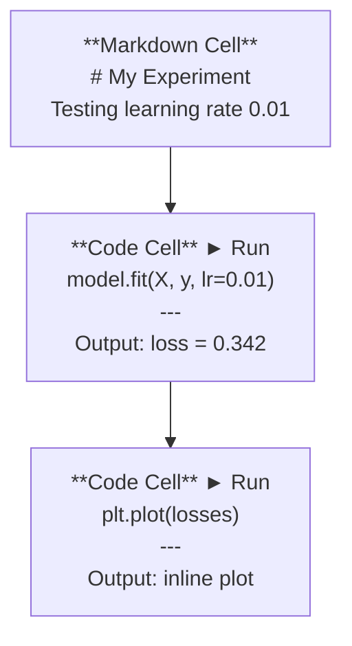
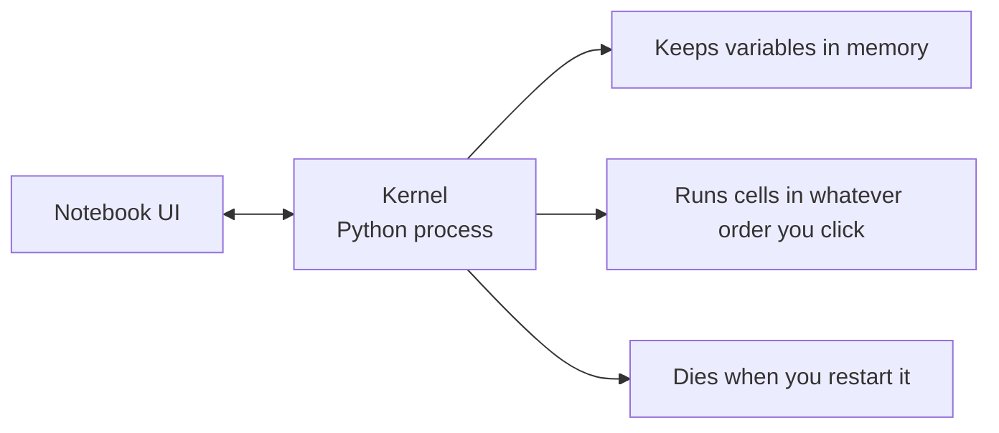

# Notatniki Jupytera

> Notebooki to laboratorium inżynierii AI. Tutaj tworzysz prototyp, a następnie przenosisz to, co działa, do produkcji.

**Typ:** Kompilacja
**Języki:** Python
**Wymagania:** Faza 0, Lekcja 01
**Czas:** ~30 minut

## Cele nauczania

- Zainstaluj i uruchom JupyterLab, Jupyter Notebook lub VS Code z rozszerzeniem Jupyter
- Use magic commands (`%timeit`, `%%time`, `%matplotlib inline`) to benchmark and visualize inline
- Rozróżnij, kiedy używać notatników, a kiedy skryptów i zastosuj przepływ pracy „eksploruj w notatnikach, wysyłaj w skryptach”
- Identyfikuj i unikaj typowych pułapek na notebooki: wykonywanie w niewłaściwej kolejności, stan ukryty i wycieki pamięci

## Problem

W każdej pracy, samouczku i konkursie Kaggle dotyczącym sztucznej inteligencji wykorzystywane są notatniki Jupyter. Umożliwiają uruchamianie kodu w fragmentach, wyświetlanie wyników w tekście, mieszanie kodu z objaśnieniami i szybką iterację. Jeśli próbujesz uczyć się sztucznej inteligencji bez zeszytów, odrabiasz pracę domową z matematyki bez kartek.

Ale notebooki skrywają prawdziwe pułapki. Ludzie używają ich do wszystkiego, łącznie z rzeczami, w których są okropni. Knowing when to use a notebook and when to use a script will save you from debugging nightmares later.

## Koncepcja

Notatnik to lista komórek. Każda komórka to kod lub tekst.



Jądro to proces Pythona działający w tle. Kiedy uruchamiasz komórkę, wysyła ona kod do jądra, które wykonuje go i odsyła wynik. Wszystkie komórki mają to samo jądro, więc zmienne pozostają między komórkami.



Ta część „w dowolnej kolejności, w której klikniesz” to zarówno supermoc, jak i broń palna.

## Zbuduj to

### Krok 1: Wybierz swój interfejs

Trzy opcje, jeden format:

| Interfejs | Zainstaluj | Najlepsze dla |
|----------|---------|---------|
| JupyterLab | `pip install jupyterlab` następnie `jupyter lab` | Pełne doświadczenie IDE, wiele zakładek, przeglądarka plików, terminal |
| Notatnik Jupytera | `pip install notebook` następnie `jupyter notebook` | Prosty, lekki, jeden notatnik na raz |
| Kod VS | Zainstaluj rozszerzenie „Jupyter” | Już w Twoim edytorze integracja git, debugowanie |

Wszyscy trzej odczytują i zapisują ten sam plik `.ipynb`. Wybierz, co lubisz. JupyterLab jest najbardziej powszechny w pracy AI.

```bash
pip install jupyterlab
jupyter lab
```

### Krok 2: Skróty klawiaturowe, które mają znaczenie

Działasz w dwóch trybach. Press `Escape` for command mode (blue bar on the left), `Enter` for edit mode (green bar).

**Tryb poleceń (najczęściej używany):**

| Klucz | Akcja |
|-----|--------|
| `Shift+Enter` | Uruchom komórkę, przejdź do następnej |
| `A` | Wstaw komórkę powyżej |
| `B` | Wstaw komórkę poniżej |
| `DD` | Usuń komórkę |
| `M` | Konwertuj na przecenę |
| `Y` | Konwertuj na kod |
| `Z` | Cofnij operację na komórce |
| `Ctrl+Shift+H` | Pokaż wszystkie skróty |

**Tryb edycji:**

| Klucz | Akcja |
|-----|--------|
| `Tab` | Autouzupełnianie |
| `Shift+Tab` | Pokaż podpis funkcji |
| `Ctrl+/` | Przełącz komentarz |

`Shift+Enter` to ten, którego będziesz używać tysiąc razy dziennie. Najpierw się tego naucz.

### Krok 3: Typy komórek

**Komórki kodu** uruchamiają Pythona i pokazują wynik:

```python
import numpy as np
data = np.random.randn(1000)
data.mean(), data.std()
```

Dane wyjściowe: `(0.0032, 0.9987)`

**Komórki Markdown** renderują sformatowany tekst. Używaj ich do dokumentowania tego, co robisz i dlaczego. Obsługuje nagłówki, pogrubienie, kursywę, matematykę LaTeX (`$E = mc^2$`), tabele i obrazy.

### Krok 4: Magiczne polecenia

To nie są Pythony. They're Jupyter-specific commands that start with `%` (line magic) or `%%` (cell magic).

**Zmierz czas na kod:**

```python
%timeit np.random.randn(10000)
```

Dane wyjściowe: `45.2 us +/- 1.3 us per loop`

```python
%%time
model.fit(X_train, y_train, epochs=10)
```

Dane wyjściowe: `Wall time: 2.34 s`

`%timeit` uruchamia kod wiele razy i oblicza średnią. `%%time` uruchamia go raz. Użyj `%timeit` do mikrobenchmarków, `%%time` do przebiegów treningowych.

**Włącz wykresy wbudowane:**

```python
%matplotlib inline
```

Każdy `plt.plot()` lub `plt.show()` jest teraz renderowany bezpośrednio w notatniku.

**Instaluj pakiety bez wychodzenia z notebooka:**

```python
!pip install scikit-learn
```

Przedrostek `!` uruchamia dowolne polecenie powłoki.

**Sprawdź zmienne środowiskowe:**

```python
%env CUDA_VISIBLE_DEVICES
```

### Krok 5: Wyświetl bogate wyjście w tekście

Notatniki automatycznie wyświetlają ostatnie wyrażenie w komórce. Ale możesz to kontrolować:

```python
import pandas as pd

df = pd.DataFrame({
    "model": ["Linear", "Random Forest", "Neural Net"],
    "accuracy": [0.72, 0.89, 0.94],
    "training_time": [0.1, 2.3, 45.6]
})
df
```

Renderuje to sformatowaną tabelę HTML, a nie zrzut tekstu. To samo z działkami:

```python
import matplotlib.pyplot as plt

plt.figure(figsize=(8, 4))
plt.plot([1, 2, 3, 4], [1, 4, 2, 3])
plt.title("Inline Plot")
plt.show()
```

Wykres pojawi się tuż pod komórką. Właśnie dlatego notebooki dominują w pracy ze sztuczną inteligencją. Widzisz dane, wykres i kod razem.

Dla obrazów:

```python
from IPython.display import Image, display
display(Image(filename="architecture.png"))
```

### Krok 6: Google Colab

Colab to darmowy notatnik Jupyter w chmurze. Zapewnia procesor graficzny, wstępnie zainstalowane biblioteki i integrację z Dyskiem Google. Nie wymaga konfiguracji.

1. Przejdź do [colab.research.google.com](https://colab.research.google.com)
2. Prześlij dowolny `.ipynb` plik z tego kursu
3. Środowisko wykonawcze > Zmień typ środowiska wykonawczego > Karta graficzna T4 (bezpłatna)

Różnice Colab od lokalnego Jupytera:
- Pliki nie są zachowywane pomiędzy sesjami (zapisz na Dysku lub pobierz)
- Preinstalowane: numpy, pandas, matplotlib, torch, tensorflow, sklearn
- `from google.colab import files`, aby przesyłać/pobierać pliki
- `from google.colab import drive; drive.mount('/content/drive')` do przechowywania trwałego
- Limit czasu sesji po 90 minutach bezczynności (poziom bezpłatny)

## Użyj tego

### Notatniki a skrypty: kiedy którego używać

| Używaj notatników do | Użyj skryptów dla |
|--------------------------------|--------------------------------|
| Eksploracja zbioru danych | Rurociągi szkoleniowe |
| Prototypowanie modelu | Narzędzia wielokrotnego użytku |
| Wizualizacja wyników | Wszystko z `if __name__` |
| Wyjaśnianie swojej pracy | Kod działający zgodnie z harmonogramem |
| Szybkie eksperymenty | Kod produkcyjny |
| Ćwiczenia kursu | Pakiety i biblioteki |

Zasada: **przeglądaj w zeszytach, wysyłaj w skryptach**.

Typowy przepływ pracy w AI:
1. Eksploruj dane w notatniku
2. Stwórz prototyp swojego modelu w notatniku
3. Gdy wszystko zadziała, przenieś kod do plików `.py`
4. Zaimportuj te pliki `.py` z powrotem do notatnika w celu dalszych eksperymentów

### Typowe pułapki

**Out-of-order execution.** You run cell 5, then cell 2, then cell 7. The notebook works on your machine but breaks when someone runs it top to bottom. Poprawka: Jądro> Uruchom ponownie i uruchom wszystko przed udostępnieniem.

**Stan ukryty.** Usuwasz komórkę, ale utworzona przez nią zmienna nadal znajduje się w pamięci. Notatnik wygląda na czysty, ale zależy od komórki widma. Poprawka: regularnie uruchamiaj ponownie jądro.

**Wycieki pamięci.** Ładowanie zestawu danych o wielkości 4 GB, trenowanie modelu, ładowanie innego zestawu danych. Nic nie zostaje uwolnione. Poprawka: `del variable_name` i `gc.collect()` lub zrestartuj jądro.

## Wyślij to

Ta lekcja daje:
- `outputs/prompt-notebook-helper.md` do debugowania problemów z notebookiem

## Ćwiczenia

1. Open JupyterLab, create a notebook, and use `%timeit` to compare list comprehension vs numpy for creating an array of 100,000 random numbers
2. Utwórz notatnik zawierający zarówno komórki przeceny, jak i komórki kodu, który ładuje plik CSV, wyświetla ramkę danych i rysuje wykres. Następnie uruchom Jądro > Uruchom ponownie i uruchom wszystko, aby sprawdzić, czy działa od góry do dołu
3. Weź kod z `code/notebook_tips.py`, wklej go do notatnika Colab i uruchom go z bezpłatnym procesorem graficznym

## Kluczowe terminy

| Termin | Co ludzie mówią | Co to właściwie oznacza |
|------|----------------|----------------------|
| Jądro | „To, co uruchamia mój kod” | Oddzielny proces Pythona, który wykonuje komórki i przechowuje zmienne w pamięci |
| Komórka | „Blok kodu” | Niezależnie uruchamialna jednostka w notatniku, albo kod, albo przecena |
| Magiczne polecenie | „Sztuczki Jupitera” | Special commands prefixed with `%` or `%%` that control the notebook environment |
| `.ipynb` | „Plik notatnika” | Plik JSON zawierający komórki, dane wyjściowe i metadane. Oznacza Notatnik IPython |

## Dalsze czytanie

- [JupyterLab Docs](https://jupyterlab.readthedocs.io/), aby zapoznać się z pełnym zestawem funkcji
– [Najczęstsze pytania dotyczące Google Colab](https://research.google.com/colaboratory/faq.html), aby poznać ograniczenia i funkcje specyficzne dla Colab
– [28 wskazówek dotyczących notatnika Jupyter](https://www.dataquest.io/blog/jupyter-notebook-tips-tricks-shortcuts/) dotyczące skrótów dla zaawansowanych użytkowników