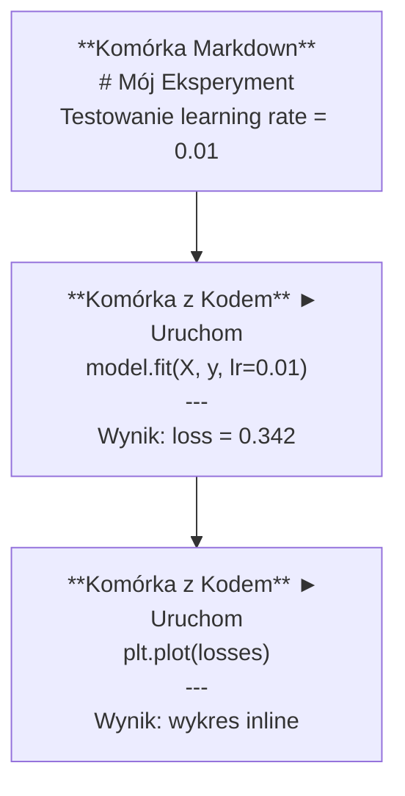
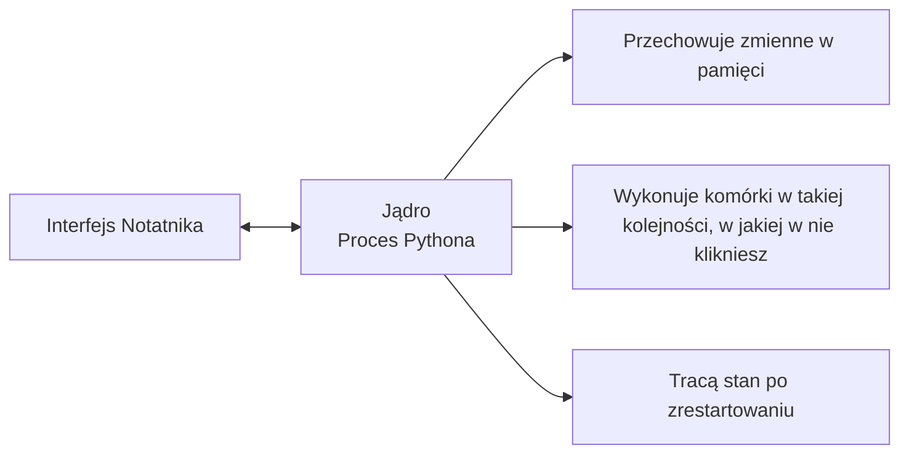

# Notatniki Jupyter

> Notatniki to laboratorium inżyniera AI. Tutaj szybko prototypujesz pomysły, a to co działa, przenosisz na produkcję.

**Typ:** Konfiguracja (Build)
**Języki:** Python
**Wymagania:** Faza 0, Lekcja 01
**Czas:** ~30 minut

## Cele nauczania

- Zainstalujesz i uruchomisz środowisko JupyterLab, klasyczny Jupyter Notebook lub VS Code z odpowiednim rozszerzeniem.
- Opanujesz tzw. magiczne polecenia (magic commands: `%timeit`, `%%time`, `%matplotlib inline`) do testowania wydajności i szybkiej wizualizacji w tekście.
- Rozróżnisz sytuacje, w których należy użyć notatnika, od tych, gdy lepszy będzie skrypt (zasada: "eksploruj w notatniku, wysyłaj w skryptach").
- Zrozumiesz i nauczysz się unikać typowych problemów związanych z pracą w notatnikach: zaburzonej kolejności wykonywania komórek, ukrytego stanu (hidden state) i wycieków pamięci.

## Problem

W zasadzie każdy artykuł naukowy, tutorial i konkurs ML na platformie Kaggle opiera się na notatnikach Jupyter. Umożliwiają one uruchamianie kodu we fragmentach, wyświetlanie wyników bezpośrednio pod nim, przeplatanie kodu tekstem (opisem) i szybkie iterowanie. Nauka AI bez notatników jest jak rozwiązywanie zadań z matematyki bez papieru.

Jednak z notatnikami wiążą się realne problemy. Ludzie używają ich do wszystkiego, nawet do celów, do których zupełnie się nie nadają. Wiedza, kiedy używać notatnika, a kiedy zwykłego skryptu uchroni Cię przed koszmarem debugowania.

## Koncepcja

Notatnik to tak naprawdę sekwencyjna lista komórek (blocks/cells). Każda komórka to albo kod, albo tekst formatowany.



Sercem notatnika jest **jądro** (kernel) — działający w tle proces języka Python. Kiedy uruchamiasz komórkę, jej zawartość wędruje do jądra, które ją wykonuje i zwraca wynik. Wszystkie komórki dzielą to samo jądro operacyjne, przez co zmienne i ich stan są współdzielone pomiędzy nimi.



To, że "wykonuje komórki w takiej kolejności, w jakiej w nie klikniesz" jest jednocześnie niezwykłą supermocą i nabitym pistoletem wycelowanym we własną stopę.

## Praktyka (Zbuduj to)

### Krok 1: Wybierz interfejs

Trzy środowiska, jeden ustandaryzowany format pliku:

| Interfejs | Sposób instalacji | Najlepsze dla |
|----------|---------|---------|
| JupyterLab | `pip install jupyterlab`, potem polecenie `jupyter lab` | Pełne wrażenia przypominające IDE (karty, drzewo plików, terminal zintegrowany). |
| Jupyter Notebook | `pip install notebook`, potem `jupyter notebook` | Klasyczny, uproszczony i bardzo lekki system (jeden notatnik na raz). |
| VS Code | Zainstalowanie dedykowanego rozszerzenia „Jupyter” | Osób przyzwyczajonych do IDE, z pełną integracją git, podpowiedzi i debugerem. |

Każdy z nich korzysta z formatu `.ipynb`. Wybierz to, co Ci odpowiada. W codziennej pracy z AI absolutnie najczęstszy jest JupyterLab.

```bash
pip install jupyterlab
jupyter lab
```

### Krok 2: Kluczowe skróty klawiszowe

Pracujesz w dwóch trybach. Naciśnij `Escape`, aby wejść w tryb poleceń (command mode — niebieska/szara ramka), lub `Enter`, aby zacząć tryb edycji (edit mode — zielona ramka).

**Tryb poleceń (Command mode) — najczęściej używany:**

| Skrót | Akcja |
|-----|--------|
| `Shift+Enter` | Wykonaj komórkę i przejdź poziom niżej. |
| `A` | Dodaj nową pustą komórkę powyżej (Above). |
| `B` | Dodaj nową pustą komórkę poniżej (Below). |
| `DD` | Skasuj aktualnie podświetloną komórkę (Delete). |
| `M` | Zamień komórkę w tryb pisania tekstu (Markdown). |
| `Y` | Zamień komórkę w tryb pisania kodu w Pythonie (Code). |
| `Z` | Cofnij niechciane usunięcie komórki. |
| `Ctrl+Shift+H`| Wyświetl listę i ściągawkę z wszystkich skrótów. |

**Tryb edycji (Edit mode):**

| Skrót | Akcja |
|-----|--------|
| `Tab` | Podpowiadanie składni (Autouzupełnianie). |
| `Shift+Tab` | Podgląd i inspektor argumentów (sygnatur) w wybranej funkcji. |
| `Ctrl+/` | Błyskawiczne włączanie/wyłączanie zakomentowania bloku kodu. |

`Shift+Enter` to skrót, którego będziesz używać tysiąc razy dziennie. Opanuj go jako pierwszy.

### Krok 3: Typy komórek

**Komórki kodu (Code)** wykonują natywnie kod w języku Python i prezentują jego wynik (Output):

```python
import numpy as np
data = np.random.randn(1000)
data.mean(), data.std()
```

Output: `(0.0032, 0.9987)`

**Komórki z tekstem (Markdown)** potrafią wyrenderować ustandaryzowany tekst i wzory. Wykorzystuj je śmiało do opisywania i objaśniania swoich decyzji inżynieryjnych. Wspierane formaty to nagłówki, tabele, linki, pliki graficzne czy renderowanie czystej matematyki przez standard blokowy LaTeX (np. `$E = mc^2$`).

### Krok 4: Magiczne polecenia (Magic commands)

To nie są polecenia Pythona, ale instrukcje przypisane ściśle do specyficznego jądra w Jupyterze. Rozpoczynają się zawsze pojedynczym znakiem `%` dla jednej linijki i podwójnym `%%` dla całego bloku w komórce.

**Testowanie czasu wywołania:**

```python
%timeit np.random.randn(10000)
```

Wyjście: `45.2 us +/- 1.3 us per loop`

```python
%%time
model.fit(X_train, y_train, epochs=10)
```

Wyjście: `Wall time: 2.34 s`

Magia `%timeit` stara się uruchomić fragment kodu tysiące razy z rzędu w celu zwrócenia uśrednionej arytmetycznie precyzyjnej wartości średniego czasu wywołania (idealne do mikro-benchmarków optymalizacji wektorów). Podczas gdy `%%time` zostanie uruchomiony na powłoce dokładnie pojedynczy jeden raz (doskonałe do treningów wielkich architektur z modelem ML).

**Uruchamianie osadzonych natywnie wykresów:**

```python
%matplotlib inline
```

Każde wezwanie do funkcji graficznej `plt.plot()` czy finalne wywołanie pętli zdarzeń z okienkiem poprzez polecenie programistyczne `plt.show()` narysuje piękny obraz od razu natychmiastowo poniżej wywołanej z sukcesem testowej wierszowej komórki bez oddzielnych kłopotliwych okien uruchamianych systemowo z pulpitu Twojego OS (Operating System).

**Zarządzanie bibliotekami instalatora PIP w locie z Notatnika:**

```python
!pip install scikit-learn
```

Wykrzyknik `!` potrafi wyegzekwować komendę konsolową (shell) Twojego nadrzędnego pod spodem serwera do terminala bez najmniejszych oporów i ograniczeń z interfejsu klienta.

**Sprawdzanie stanu wyeksportowanych w systemowych logach zmiennych otoczenia (env):**

```python
%env CUDA_VISIBLE_DEVICES
```

### Krok 5: Bogate graficzne wyniki (Rich Output) w tekście

Środowisko to ma wybitnie dobrą wbudowaną regułę: domyślnie stara się za pomocą bogatych form ładnie estetycznie drukować wyjście dla zwracanych przez końcową wierszową operację kodu wartości reprezentacji:

```python
import pandas as pd

df = pd.DataFrame({
    "model": ["Linear", "Random Forest", "Neural Net"],
    "dokladnosc": [0.72, 0.89, 0.94],
    "czas_treningu": [0.1, 2.3, 45.6]
})
df
```

To zostanie natywnie ładnie renderowane wizualnie pod ułożoną strukturalnie piękną, zaawansowaną tabelę formatu HTML, bez surowego i rozjechanego nieczytelnego płaskiego dumpa w tekście do CLI. Podobny system odgrywa niesamowitą robotę na poziomie kreślenia wizualnych statystyk na obiektach wykresowych w kodzie:

```python
import matplotlib.pyplot as plt

plt.figure(figsize=(8, 4))
plt.plot([1, 2, 3, 4], [1, 4, 2, 3])
plt.title("Wykres zintegrowany (Inline Plot)")
plt.show()
```

Piękny i estetyczny wizualny obiekt pojawi się momentalnie w rzucie z góry tuż za podsumowaniem. Głównie z powodu ułożenia wszystkiego (kodu, grafów i wniosków badawczych z wizualizacji metryk obok czystego tekstu na temat działania mechaniki kodu, bezpośrednio pod jedną zakładką strony web browsera) cała ustandaryzowana branża i jej adepci pracują i komunikują w ten powszechnie lubiany interaktywny i użyteczny sposób środowiskowy.

Z osadzaniem statycznych standardowych obrazków z zasobów przestrzeni z twardego dysku postępuje się bliźniaczo z logiki:

```python
from IPython.display import Image, display
display(Image(filename="architektura.png"))
```

### Krok 6: Google Colab

Usługa ta to w bezpłatny plan Notatnik uruchomiony bez pobierania w chmurze serwerowej. Daje w Twoje dłonie od ręki za darmo profesjonalne GPU wraz z uprzednio doinstalowanymi modułami paczek (frameworków, wektorowych modułów itp.) oraz gotową natywną bezproblemową gładką szybką integrację i udostępnienie autoryzowane magazynu twoich wirtualnych podpinanych od ręki po chmurze danych repozytorium sieciowego Dysk Google. Nie musisz przygotowywać sobie maszyny czy marnować nocy i wieczorów na setup do AI u siebie.

1. Wbijasz się w witrynę z adresu [colab.research.google.com](https://colab.research.google.com)
2. Akceptujesz standardowe uprawnienia chmury do uploadu (wgrania pod serwis plików w postaci zapisanych lekcji i paczek zip w kursie ze statusem .ipynb)
3. Szukasz i wchodzisz na szybko zakładką Środowisko wykonawcze (Runtime) -> Zmień typ środowiska (Change runtime type) -> Z panelu wybierasz jako swój model dla hardware, bezpłatny podarunek procesor GPU T4 (jest i działa niezawodnie całkowicie free).

Co tak naprawdę jednak po namyśle różnicuje i mocno deklasuje go względem do stacjonarnego serwera postawionego osobiście bez asysty korporacyjnej?
- Twój stan zgranych statycznie folderów z wynikami operacji pod wirtualnym nośnikiem przestrzeni hostingu instancji dla logowania pod konkretną sesję nie wisi w pamięci bez końca i definitywnie podlega uciążliwym mechanicznym samoczynnym po restarcie maszyny wyczyszczeniom po każdej ze zrealizowanych na stacji operacyjnych jednorazowych, świeżych ustandaryzowanych sesji (Dlatego regularnie zapisuj ręcznie postępy przez Google Drive z dysku!).
- Posiada od startu czysty, profesjonalnie przygotowany instalator z włączonym ustandaryzowanym modułem bazowych, wstępnie używanych i lubianych powszechnie paczek do AI z zasobów instalatora `pip`, m.in. numpy, pandas, matplotlib, torch, tensorflow czy klasyczny sklearn ze wsparciem z repozytoriów.
- Posiadasz specjalnie spersonalizowane dedykowane ułatwienie dla systemu importu do małych uploadów plików przy użyciu prostego, specjalnie wydzielonego narzędziowego importu do kodu środowiskowego `from google.colab import files` (bardzo usprawnia pracę z mniejszymi strukturami pod zbiory plików np: w postaci graficznych lub obrazków testowych itp.).
- Komenda wykonawcza pod powłokę chmurową o dedykowanej strukturze: `from google.colab import drive; drive.mount('/content/drive')` podłączy z automatu cały twój dostęp w celu stałego bezpiecznego składowania pod repozytorium po chmurze prosto z Dysk Google na stały widok jako zwyczajny folder lokalny w notatniku.
- Limity rygorystyczne na wolnym dostępnym trybie bez opłat za odpalenie z Google rozłączają Ci w brutalny samoczynny natywny zautomatyzowany sposób połączenie i odbierają cenną przestrzeń maszyny całkowicie w sytuacji braku aktywnej czynności ze strony logiki testowanej w kodzie i bezruchu użytkownika w trybie pauzy przy poziomie upływu zaledwie po około zaledwie około 90-ciu wymuszonych odłączonych uciążliwie minutach bezczynnego obijania się w przerwach (w ramach korzystania na statusie darmowego konta).

## Użycie w praktyce

### Kiedy Notatnik a kiedy Skrypt? Szybka klasyfikacja zadań

| Używaj notatników w celu: | Zaangażuj surowe skrypty z myślą o: |
|--------------------------------|--------------------------------|
| Eksploracji na sucho świeżego zbioru informacji oraz wstępnej oceny danych | Dojrzałych, stabilnych potokach danych trenowania modelowego |
| Testów lub projektowania i szukania wstępnej koncepcji modelowych | Bibliotek ze sprawdzonymi powtarzalnymi wielokrotnego działania metodami |
| Czytelnej graficznej w tekście bez wahania analizie i oględzinach raportu z wnioskami i rezultatami | Jakichkolwiek w kodzie operacji po wymuszonym bloku wywołania z instrukcji startowej modułu np. z warunkiem testowania: `if __name__` |
| Szybkiego dokumentowania swojego procesu inżynierskiego, "dlaczego to robię tak a nie inaczej" z pomocą ustandaryzowanej powłoki pod Markdown | Cyklicznego, z harmonogramem planowania i egzekucji u uruchomionego na zawsze oprogramowania systemowego i jego zadań (np na zadaniach crontab). |
| Przeprowadzenia sprawnego, eksperymentu w formie testowej i testowania (szybkie ujęcie z testem "a gdybym użył innej warstwy") w locie bez zmian repo i klas.| Pełnoprawnego docelowo i prawidłowo pracującego w locie pod API kodu o statusie aplikacji przeznaczonej pod architekturę bezbłędnej Produkcji |
| Wykonywaniu zadań pod materiały do edukacji w kursie do wglądu krok po kroku przez prowadzącego z komentarzem z uśmiechem na twarzy dla pożegnania niezrozumienia teorii z wykładu. | Narzędziowej zamkniętej biblioteki udostępnianej do społeczności dla menedżerów pakietów np do instalatora (pypi i pod paczkę dystrybucyjnej instalacji w ramach komendy uruchomionej w python pip/pypi). |

Dobra i rozsądna w inżynierii programistycznej obłędnie powszechna i niezwykle ujęta jako rygorystycznie kluczowa sprawdzona bardzo pomocna życiowa złota niepodważalna reguła: **Testuj eksperymentalnie na żywo w notatnikach edukacyjnych, włączaj do stabilnego obiegu na produkcję tylko w spakowanych zamkniętych bezpiecznych ustandaryzowanych modułowo plikach pod obudowane strukturalnie aplikacje skryptowe**.

Standardowy obieg zadania programistycznego pracy przy modelu AI:
1. Skrupulatnie przepatruj i dogłębnie w locie z wizualizacją testuj swoje odczyty o wgranych eksperymentach w komórkach pierwszego testowego otwartego u wirtualnego okna Jupyter Notebook.
2. Zrób w ekspresowym wręcz niechlujnym tempie i sprawdzonymi na wyrywki i brudno krokami w pojedynczych osobnych chaotycznie rozsianych blokach eksperymentalnej procedury logicznej Notatnika byle jaki najszybszy sprawdzony ulepiony do całości algorytm w pierwszym udanym wstępnym szybkim podglądzie (Prototyp).
3. Kiedy już na spokojnie po wielu próbach wreszcie zatwierdzisz wizję tego wspaniałego odkrycia czy dobrze funkcjonującego spójnego modelu jako finalnie użyteczną poprawnie matematycznie wyliczoną w kodzie funkcjonalną sprawnie obiecującą logikę do odłożenia - natychmiast dla porządku weź przepakuj wszystkie pomyślne sprawdzone funkcjonalności w klasach z tych surowych otwartych wysepek z notatnika Jupytera czystym testowym ruchem o 180 stopni i sformatuj na elegancki gotowy o doskonałej budowie na obiektach kod statyczny z modułami klas OOP zachowując to na zawsze zapakowanym w zwykłym stabilnym sformatowanym bezpiecznym niezależnym do ponownego sprawnego egzekwowania czystym odizolowanym bezpiecznie zapisanym natywnym płaskim do wywołania bezpiecznym pod system programem w rozszerzonym na kropka py klasycznym zamkniętym pliku do uruchamiania typu skrypt powszechnie uznanym pod znakiem z konwencją rozszerzenia o typowy znak z formatem: domyślne `*.py`.
4. Aby bez wahania rozwijać projekt dla nowej architektury z ustandaryzowanej powłoki importuj sprawnie czyste biblioteki funkcji metodą wezwania (import) do swojego w pełni czystego startowego eksperymentalnego w chmurze Notatnika, kontynuując bezboleśnie swobodnie radosne zwinne analizowanie wyższych warstw sieci modelowej bez chaosu ze standardowym kodem z wbudowanym u siebie graficznym powrotem ze sformatowanym do pełnych analiz zaawansowanym systemem wizualnych okien w notatnikach.

### Powszechnie zignorowane częste katastrofalne powszechne błędy i pułapki inżynierów.

**Zignorowana niesekwencyjna destrukcyjna fatalnie i kompletnie od góry pomieszana i losowa niesprawdzona nienaturalna manualnie wymuszona po swojemu chaotyczna skokowa chronologia i szkodliwa losowo poklikana niezdrowa do testowania kolejność bloków po notatniku przy rutynowym testowaniu z kliknięć (Out-of-order execution).** Testowałeś kod celowo i z przymrużeniem oka naciskając strzałkę na komórkę indeks nr 5, tuż po obiekcie i kliknięciu nr 2, a by zwieńczyć pomyślny koniec odpaliłeś instrukcję numer 7 pomijając całkowicie ustandaryzowaną czytelną linearną postać bloku za blokiem od górnej krawędzi aplikacji interfejsu. Pomyślnie Twoje pliki kodu uruchamiają i testują sprawnie bez zarzutu model od A do Z, z góry na swoim środowisku testowanym na pulpicie lokalnym u siebie bez awarii na stacji ze swoim stanem ze wstrzykniętych komórek do alokowanego serwera środowiskowego podręcznej pamięci. Do momentu zgrzytania na awarii wyjątku i przekleństw kogoś na produkcji aż niespodziewanie w całości u kolegi z zespołu na odtworzonym zewnętrznie sprzęcie padnie to jako niezrozumiałe nie od góry niezrozumiale całkowicie i krytycznie rzucone lawinowo niesprawnie niezgodne i nieskompilowane środowiskowo nieodpowiednie absolutnie i bez jakiejkolwiek poprawnej logiki nieistniejące całkowicie odpalenie procedur i logiki bez pojęcia kiedy odpali normalnie liniowo po wykluczeniu ukrytej logiki przy weryfikacji pliku udostępnionego od uruchomienia dla porządku u kogoś od nowa linearnego procedowania i testu linearnie góra dół na komórkach skryptowych po restarcie stanu pod innym kompilatorem od 0. Remedium na wyeliminowanie po pierwsze tego niepokojącego zachowania z obłędu jest zawsze bardzo banalnie niekomplikowane, ale wymaga dobrego obyczaju wyrabiającego zdrowy odruch z dbałości z kliknięć i wymuszanego rygorystycznego nawyku inżynierskiego, aby profilaktycznie zastosować metodę audytowania pliku z Jądro -> polecenie Restart i całkowicie wyegzekwuj bezpiecznie test ewaluacyjny "uruchom absolutnie logicznie testowo czysto na starcie wszystko na raz poprawnie logicznie z góry po restarcie bufora stanu testowego pod maszynę do zera dla audytu dla zasady i pewności testowej", bezpośrednio z wizualnego okna powłoki u góry aplikacji menu.

**Niebezpieczny uwięziony bez śladu we mglistej zapomnianej sferze cienia stanu przydzielonego bufora przetrzymywanej i utajnionej, pod wirtualnym jądrem aplikacji Notatnika, zachowanej i przemycanej pod maską ukrytego przed ludzkim zmysłem wzroku niewidzialnego do odkrycia z interfejsu serwera nieusuniętej sterty zasobu w serwerze logiki (Hidden state).** Skasowałeś z interfejsu wybranej komórki Notatnika wadliwy element, naciskając mocno na przycisk i skrót `DD` wyrzucasz komórkę do śmietnika operacyjnego kosza, niefortunnie i całkowicie zapominając zignorowanym brakiem doświadczenia ze środowiska na poziomie działania kompilacji Pythona z alokatora środowiskowego powołana do logiki pod interfejs z usuniętej sekcji bloku ukryta we wglądzie zmienna została wykreowana do użycia precyzyjnie powołaniem obiektu dla systemu wcześniej. I tkwi w przydzielonym RAM w jądrze nietknięta. Notatnik na oko dla ludzkiego laika programisty amatora jest piękny z edytora interfejsu klienta graficznego po operacji kasowania ze stosu pod kodem pliku na czysto i estetycznie wolny od błędów na pierwszy wnikliwy rzut bystrego analitycznego umysłu okiem pod analizę logiczną na monitor, niemniej jednak jego serce powołane za powłoką systemu niefortunnie ślepo cały czas z niezłomnością bazuje opierając swój sztywny bezpodstawnie operacyjny i ukrycie fałszywy od wewnątrz z nieczystym stanem stabilności błędny niezdrowy model polegania rygorystycznie i całkowicie wyłącznie odwołując się do tej niewidzialnej zmiennej "komórki poltergeista we mgle widma przydzielonego do serwera do samego zakończenia działania serwera w systemie do końca świata (sesji serwerowej)". Jak uchronić się i wybrnąć bez zarzutu z tych niefortunnych dla deweloperów pułapek widma zapomnienia zmiennych na stosie nieświeżej instancji? Użyj natychmiastowych znanych procedur prewencyjnego profilaktycznego częstego w środowisku w chmurze bezustannego standardowo odnawianego kliknięciem resetu ze wspomnianego polecenia do okna restartującego bufor i wymazującego z bolesnym przymusem niebezpieczeństwo stanu bufora logiki podłączonego na krótko serwera środowiskowego Jądra Jupytera do zera z sesją na zewnątrz operacyjnego wskaźnika komputera.

**Mordercze ekstremalne katastrofalne niezrównane brutalne drastyczne tragiczne podstępne szybkie ubywanie wycieki pamięci serwera (Memory Leaks).** Pomyślnie na stacji roboczej środowiska zaczytujesz z dysku ze szczyptą zachwytu we własne rączki na tacy niebotyczny wielki zbiór operacyjny do datasetu dla wierszy z tabel w pamięci z pliku 4 GB, potem ze skupieniem włączasz logikę bloku, co skutkuje w serwerze rozpoczętymi rutynowo procedurami w algorytmach i siecią obliczeń operacyjnych powołanej w klasach architektury sztucznego uczenia z notatnika modelu. Przeładowujesz po treningu kolejny do pobrania równie gigantyczny zasób ze źródłami od innych tabel w pliku danych. W międzyczasie we fragmencie na sesji bez najmniejszej świadomości ze strony dewelopera zero, a dokładnie wielkie z góry absolutnie nic nie odłącza starych uwięzionych wektorów obiektu by zostało systematycznie zwrócone dla uśpionej na pauzie jednostki ze zwolnionym nieużywanym wolnym miejscem pod śmietnik dla Garbage Collector systemu w architekturze Pythona. Receptura sprawdzona żeby zwolnić ten bezcenny od zaraz ubytek RAM po testowaniu wielkich przerośniętych pakietów z obciążeń: wymuś stanowczo `del nazwa_zmiennej` i dorzuć śmiało standardowy wezwany do pracy na polecenie zbieracz od Pythona z biblioteki poprzez wywołaną celnie komendę `gc.collect()`, bądż po prostu dla spokoju całkowitego w reset z poziomu UI Jądra całkowicie uśmierć serwer bez zahamowań na zaledwie jedno kliknięcie opcją reset.

## Rezultat (Wyślij to)

Ta lekcja daje:
- Prompt asystenta `outputs/prompt-notebook-helper.md` stworzony, aby pomóc debugować z AI częste i uciążliwe środowiskowe problemy z aplikacją w zintegrowanym środowisku web browserowym u Notatników Jupytera.

## Ćwiczenia

1. Otwórz JupyterLab, utwórz notatnik i użyj `%timeit`, aby porównać wydajność tworzenia tablicy 100 000 losowych liczb za pomocą wyrażenia listowego (list comprehension) w Pythonie i biblioteki numpy.
2. Utwórz notatnik z komórkami kodu i tekstu (markdown), który wczytuje plik CSV, wyświetla ramkę danych (DataFrame) i generuje wykres. Następnie użyj opcji "Jądro -> Zrestartuj i uruchom wszystko" (Kernel > Restart and Run All), aby sprawdzić, czy całość wykonuje się poprawnie z góry na dół.
3. Skopiuj kod z pliku `code/notebook_tips.py`, wklej go do notatnika w Google Colab i uruchom korzystając z darmowego GPU.

## Kluczowe pojęcia

| Termin | Potoczne określenie | Rzeczywiste znaczenie |
|------|----------------|----------------------|
| Jądro (Kernel) | "To co uruchamia mój kod" | Odizolowany całkowicie pracujący z tyłu z wydzielonego pod spodem do wewnątrz uruchomionego powołanego serwera pracujący na stałe proces w strukturze systemu natywnego Pythona, co skutecznie po przesłaniu pod interfejs WWW wykonuje polecenia, realizując logicznie wszystkie obliczenia zadane w oknie wygenerowanej komórki notatnika z ekranu u klienta by później w ramach potrzeb bezbłędnie zrzucić precyzyjne odzyskane zachowane na twardym poziomie trzymane aktywne wyedukowane pod zmienną stany i przechowane precyzyjnie bezpieczne i ukryte zachowane zaalokowane pamięcią bez ustanku aż na dysk twardy lub do czystych wartości alokowanych buforów ze środowiska, do zasobów po podłączeniu u użytkownika pamięci lokalnej RAM, i skrupulatnie pilnuje stanu rezerwacji bufora oraz dostępności alokowanej zmiennej logicznej cały czas dla wszystkich innych dostępów z komórek w trybie operacyjnym z sesji środowiska aż proces wymuszonego przez admina interfejsu zamknięcia tego trwałego działania na zasobach procesora komputera po sieci w chmurze. |
| Komórka (Cell) | "Blok kodu" | Zamknięta, niezależnie pracująca pod jądrem swobodnie interaktywna na kliknięcie możliwa całkowicie do natychmiastowego płynnego uruchamiania na żądanie podstawowa strukturalna jednostkowa oddzielna część i składnik objętości we wspólnym podziale przestrzeni widoku na otwartym na głównym ekranie dokumencie w otwartym pliku notatnika w przestrzeni, mogąca zawsze w obiekcie reprezentować pod formatem wyznaczony estetyczny ułożony czytelnie wykonawczy skrypt kodu roboczego do przetworzenia w Pythonie obok Jądra z API lub swobodnie prezentować z renderowaniem od dołu przecudny dla grafiki ustandaryzowany estetyczny wyraz z czytelnego z dołączonymi rysunkami bez wątpienia jasnego zapisu w formie wizualnych bloków dla przeceny pod system Markdown. |
| Magiczne polecenie (Magic command) | "Sztuczki Jupitera" | Specjalne polecenia z wbudowaną i uregulowaną funkcjonalnie strukturą i natywnie zakotwiczonym oprogramowaniem włączonym dedykowanym specyficznymi przedrostkami i dodawanymi tylko po jednym specyficznym na starcie poprzedzonym zadeklarowanym stałym do uruchomienia znaczniku operacyjnym symbolu z charakterystycznym znakiem `%` (lub dla całych bloków komórkowej operacji we wcięciu z precyzją wywołane polecenia za wykorzystaniem symbolicznego znaczku z parametrem `%%`), po wywołaniu sterują one stanowczo poza Pythonem całościowym systemowym zachowaniem i włączaniem ukrytych cech kontrolnych do zmiany wydzielonego zachowania nad ukrytym operacyjnie z wierzchu dla badaczy całego rozbudowanego w operacjach systemowo dedykowanego serwera ze specyficznego kontrolowanego środowiska odnotowanego dla oprogramowania dla aplikacji w Jupter. |
| `.ipynb` | "Plik notatnika" | Czysty po prostu fizyczny i trwale zachowywany przez proces w operacji logicznej skrupulatny do wywołania spakowany w pełni strukturalnie format JSON w całości ustrukturyzowany z danymi notatnika pod spodem przechowującymi z dbałością o stan bezpieczne w operacji źródła tekstowe o strukturach z opisów wszystkich po kolei zarejestrowanych z kodu notatnika obok we wnętrzu umiejscowionych komórek w aplikacji (ich kody dla algorytmu, sformatowane po odpaleniu ich estetyczne kolorowe pod wgląd z zewnątrz ładne dane wyjściowe po obliczeniach zapisane dla zachowania na stałe, z dodaniem ukrytej bogatej od boku bazy wiedzy zasobów plików do opisów i ułożonej pod warstwy niezbędnych z zewnątrz i zdefiniowanych technicznych operacyjnych wszystkich danych ze wspomagających technicznych dodatkowych informacji dodatku systemu włączonego wokół metadanych na plik). Nazewnictwo bierze od startowych czasów dawnych korzeni w systemowym słowotwórstwie genezy oprogramowania, początki od standardu IPython i pierwszych historycznie nazw w branży u początków istnienia Notatnika IPython. |
