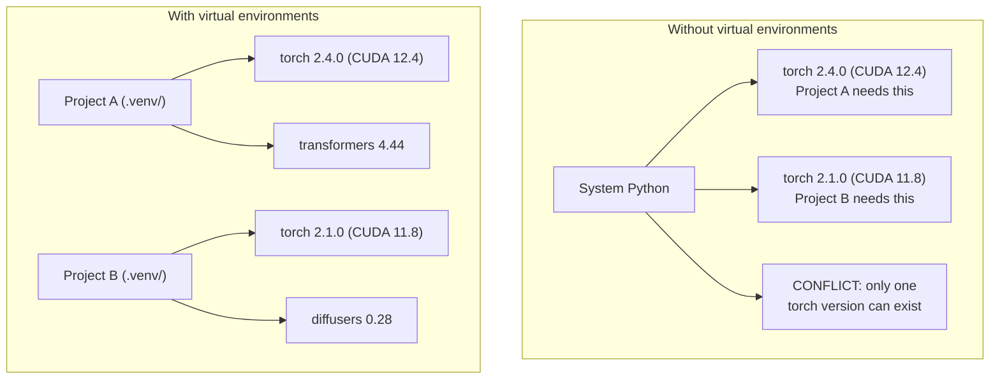

# Środowiska Pythona

> Piekło zależności jest realne. Wirtualne środowiska są lekarstwem.

**Typ:** Kompilacja
**Języki:** Shell
**Wymagania:** Faza 0, Lekcja 01
**Czas:** ~30 minut

## Cele nauczania

- Twórz izolowane środowiska wirtualne za pomocą `uv`, `venv` lub `conda`
- Napisz `pyproject.toml` z opcjonalnymi grupami zależności i wygeneruj pliki blokujące w celu zapewnienia powtarzalności
- Diagnozuj i napraw typowe pułapki: instalacje globalne, mieszanie pip/conda, niedopasowania wersji CUDA
- Wdrażaj strategię środowiskową dla poszczególnych faz dla projektów ze sprzecznymi zależnościami

## Problem

Instalujesz PyTorch 2.4 w celu dostrojenia projektu. W przyszłym tygodniu inny projekt będzie potrzebował PyTorch 2.1, ponieważ jego kompilacja CUDA jest przypięta. Aktualizujesz globalnie, a pierwszy projekt się psuje. Zmniejszasz wersję, a druga się psuje.

To jest piekło zależności. Dzieje się tak stale w pracy AI/ML, ponieważ:

— PyTorch, JAX i TensorFlow dostarczają własne powiązania CUDA
- Biblioteki modeli przypinają określone wersje frameworka
- Globalny `pip install` nadpisuje wszystko, co było wcześniej
- Kompilacje CUDA 11.8 nie działają ze sterownikami CUDA 12.x (i odwrotnie)

Poprawka: każdy projekt otrzymuje własne izolowane środowisko z własnymi pakietami.

## Koncepcja



## Zbuduj to

### Opcja 1: uv venv (zalecane)

`uv` to najszybszy menedżer pakietów w języku Python (10–100 razy szybszy niż pip). Obsługuje środowiska wirtualne, wersje Pythona i rozwiązywanie zależności w jednym narzędziu.

```bash
curl -LsSf https://astral.sh/uv/install.sh | sh

uv python install 3.12

cd your-project
uv venv
source .venv/bin/activate
```

Zainstaluj pakiety:

```bash
uv pip install torch numpy
```

Utwórz projekt z `pyproject.toml` w jednym kroku:

```bash
uv init my-ai-project
cd my-ai-project
uv add torch numpy matplotlib
```

### Opcja 2: venv (wbudowany)

Jeśli nie możesz zainstalować `uv`, Python jest dostarczany z `venv`:

```bash
python3 -m venv .venv
source .venv/bin/activate  # Linux/macOS
.venv\Scripts\activate     # Windows

pip install torch numpy
```

Wolniejszy niż `uv`, ale działa wszędzie tam, gdzie jest zainstalowany Python.

### Opcja 3: conda (kiedy jej potrzebujesz)

Conda zarządza zależnościami innymi niż Python, takimi jak zestawy narzędzi CUDA, cuDNN i biblioteki C. Użyj go, gdy:

- Potrzebujesz określonej wersji zestawu narzędzi CUDA bez konieczności instalowania jej w całym systemie
- Znajdujesz się w klastrze współdzielonym, w którym nie możesz instalować pakietów systemowych
- Instrukcje instalacji biblioteki mówią „użyj conda”

```bash
# Install miniconda (not the full Anaconda)
curl -LsSf https://repo.anaconda.com/miniconda/Miniconda3-latest-Linux-x86_64.sh -o miniconda.sh
bash miniconda.sh -b

conda create -n myproject python=3.12
conda activate myproject

conda install pytorch torchvision torchaudio pytorch-cuda=12.4 -c pytorch -c nvidia
```

Jedna zasada: jeśli używasz conda dla środowiska, używaj conda dla wszystkich pakietów w tym środowisku. Mieszanie `pip install` w conda env powoduje konflikty zależności, których debugowanie jest bolesne.

### Dla tego kursu: Strategia na fazę

Można stworzyć jedno środowisko dla całego kursu. Nie. Różne fazy wymagają różnych (czasami sprzecznych) zależności.

Strategia:

```
ai-engineering-from-scratch/
├── .venv/                    <-- shared lightweight env for phases 0-3
├── phases/
│   ├── 04-neural-networks/
│   │   └── .venv/            <-- PyTorch env
│   ├── 05-cnns/
│   │   └── .venv/            <-- same PyTorch env (symlink or shared)
│   ├── 08-transformers/
│   │   └── .venv/            <-- might need different transformer versions
│   └── 11-llm-apis/
│       └── .venv/            <-- API SDKs, no torch needed
```

Skrypt w `code/env_setup.sh` tworzy podstawowe środowisko dla tego kursu.

## Podstawy pyproject.toml

Każdy projekt w Pythonie powinien mieć `pyproject.toml`. Zastępuje `setup.py`, `setup.cfg` i `requirements.txt` w jednym pliku.

```toml
[project]
name = "ai-engineering-from-scratch"
version = "0.1.0"
requires-python = ">=3.11"
dependencies = [
    "numpy>=1.26",
    "matplotlib>=3.8",
    "jupyter>=1.0",
    "scikit-learn>=1.4",
]

[project.optional-dependencies]
torch = ["torch>=2.3", "torchvision>=0.18"]
llm = ["anthropic>=0.39", "openai>=1.50"]
```

Następnie zainstaluj:

```bash
uv pip install -e ".[torch]"    # base + PyTorch
uv pip install -e ".[llm]"     # base + LLM SDKs
uv pip install -e ".[torch,llm]" # everything
```

## Pliki blokujące

Plik blokujący przypina każdą zależność (w tym przechodnią) do dokładnych wersji. Gwarantuje to powtarzalność: każdy, kto zainstaluje z pliku blokującego, otrzyma dokładnie te same pakiety.

```bash
# uv generates uv.lock automatically when using uv add
uv add numpy

# pip-tools approach
uv pip compile pyproject.toml -o requirements.lock
uv pip install -r requirements.lock
```

Zatwierdź swój plik blokujący w git. Kiedy ktoś klonuje repozytorium, instaluje z pliku blokującego i otrzymuje identyczne wersje.

## Typowe błędy

### 1. Instalacja globalna

```bash
pip install torch  # BAD: installs to system Python

source .venv/bin/activate
pip install torch  # GOOD: installs to virtual environment
```

Sprawdź dokąd trafiają Twoje paczki:

```bash
which python       # should show .venv/bin/python, not /usr/bin/python
which pip           # should show .venv/bin/pip
```

### 2. Mieszanie pipa i condy

```bash
conda create -n myenv python=3.12
conda activate myenv
conda install pytorch -c pytorch
pip install some-other-package   # BAD: can break conda's dependency tracking
conda install some-other-package # GOOD: let conda manage everything
```

Jeśli musisz użyć pip wewnątrz conda (niektóre pakiety obsługują tylko pip), najpierw zainstaluj wszystkie pakiety conda, a następnie pakiety pip na końcu.

### 3. Zapominanie o aktywacji

```bash
python train.py           # uses system Python, missing packages
source .venv/bin/activate
python train.py           # uses project Python, packages found
```

Twój monit powłoki powinien pokazywać nazwę środowiska:

```
(.venv) $ python train.py
```

### 4. Zatwierdzenie .venv w git

```bash
echo ".venv/" >> .gitignore
```

Środowiska wirtualne zajmują 200 MB–2 GB. Są lokalne i nie można ich przenosić między maszynami. Zamiast tego zatwierdź `pyproject.toml` i plik blokady.

### 5. Niezgodność wersji CUDA

```bash
nvidia-smi                # shows driver CUDA version (e.g., 12.4)
python -c "import torch; print(torch.version.cuda)"  # shows PyTorch CUDA version

# These must be compatible.
# PyTorch CUDA version must be <= driver CUDA version.
```

## Użyj tego

Uruchom skrypt instalacyjny, aby utworzyć środowisko kursu:

```bash
bash phases/00-setup-and-tooling/06-python-environments/code/env_setup.sh
```

Spowoduje to utworzenie `.venv` w katalogu głównym repozytorium z zainstalowanymi i zweryfikowanymi podstawowymi zależnościami.

## Ćwiczenia

1. Uruchom `env_setup.sh` i sprawdź, czy wszystkie kontrole poszły pomyślnie
2. Utwórz drugie środowisko wirtualne, zainstaluj w nim inną wersję numpy i potwierdź, że oba środowiska są izolowane
3. Napisz `pyproject.toml` dla projektu, który wymaga zarówno PyTorch, jak i Anthropic SDK
4. Celowo zainstaluj pakiet globalnie (bez aktywowania venv), zwróć uwagę, dokąd zmierza, a następnie odinstaluj go

## Kluczowe terminy

| Termin | Co ludzie mówią | Co to właściwie oznacza |
|------|----------------|----------------------|
| Środowisko wirtualne | "Wenv" | Izolowany katalog zawierający interpreter języka Python i pakiety, niezależny od systemu Python |
| Plik blokady | „Przypięte zależności” | Plik zawierający listę każdego pakietu i jego dokładną wersję, gwarantujący identyczną instalację na różnych komputerach |
| pyproject.toml | „Nowy setup.py” | Standardowy plik konfiguracyjny projektu w języku Python, zastępujący plik setup.py/setup.cfg/requirements.txt |
| Zależność przechodnia | „Zależność zależności” | Pakiet B zależy od C; jeśli zainstalujesz A, które zależy od B, C jest przechodnią zależnością A |
| Niedopasowanie CUDA | „Mój procesor graficzny nie działa” | PyTorch został skompilowany dla innej wersji CUDA niż obsługiwana przez sterownik GPU |