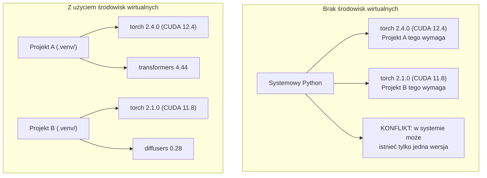

# Środowiska w języku Python

> Piekło zależności to rzeczywistość. Środowiska wirtualne to niezawodne lekarstwo.

**Typ:** Konfiguracja (Build)
**Języki:** Shell / Bash
**Wymagania:** Faza 0, Lekcja 01
**Czas:** ~30 minut

## Cele nauczania

- Tworzenie izolowanych środowisk wirtualnych za pomocą narzędzi `uv`, `venv` oraz `conda`.
- Pisanie konfiguracji `pyproject.toml` z opcjonalnymi grupami zależności oraz generowanie plików blokady (lockfiles) dla odtwarzalnych instalacji.
- Diagnozowanie i unikanie typowych pułapek: instalacji globalnych, mieszania paczek `pip` i `conda`, czy konfliktów z wersjami CUDA.
- Wdrażanie strategii środowisk z podziałem na fazy kursu do zarządzania sprzecznymi zależnościami.

## Problem

Instalujesz nową wersję PyTorch 2.4, żeby precyzyjnie dotrenować swój projekt (fine-tuning). Tydzień później w innym projekcie potrzebujesz PyTorch 2.1, ponieważ jego zależności silnie wiążą się z określoną wersją CUDA. Aktualizujesz pakiety globalnie i pierwszy projekt przestaje działać. Obniżasz wersję (downgrade) i psuje się ten drugi.

Na tym właśnie polega piekło zależności (dependency hell). W projektach AI/ML jest to codzienność, ponieważ:

- Biblioteki takie jak PyTorch, JAX czy TensorFlow dostarczają własne powiązania z CUDA (bindings).
- Różne narzędzia i frameworki modelowe rygorystycznie "przypinają" (pin) konkretne wersje swoich zależności.
- Globalna instalacja `pip install` nadpisuje wszystko, co było wcześniej dostępne w systemie.
- Pakiety skompilowane dla CUDA 11.8 mogą nie działać prawidłowo ze sterownikami z rodziny CUDA 12.x (i odwrotnie).

Rozwiązanie jest proste: każdy projekt otrzymuje na wyłączność własne, odizolowane środowisko ze swoimi pakietami.

## Koncepcja



## Praktyka (Zbuduj to)

### Opcja 1: `uv venv` (metoda zalecana)

Narzędzie `uv` to ekstremalnie szybki (10-100 razy szybszy niż `pip`) menedżer pakietów napisany w języku Rust. Zarządza środowiskami wirtualnymi, instalacją samego Pythona i rozwiązywaniem drzew zależności (dependency resolution) w ramach jednego spójnego narzędzia.

```bash
curl -LsSf https://astral.sh/uv/install.sh | sh

uv python install 3.12

cd twoj-projekt
uv venv
source .venv/bin/activate
```

Instalacja paczek odbywa się bardzo podobnie:

```bash
uv pip install torch numpy
```

Możesz też utworzyć projekt wraz z plikiem `pyproject.toml` jednym poleceniem:

```bash
uv init my-ai-project
cd my-ai-project
uv add torch numpy matplotlib
```

### Opcja 2: `venv` (wbudowany w Pythona)

Jeśli nie możesz z jakiegoś powodu zainstalować `uv`, standardowy Python posiada wbudowany moduł `venv`:

```bash
python3 -m venv .venv
source .venv/bin/activate  # Linux/macOS
.venv\Scripts\activate     # Windows

pip install torch numpy
```

Działa wszędzie tam, gdzie zainstalowany jest Python, jednak proces rozwiązywania i pobierania pakietów przez `pip` jest znacznie wolniejszy.

### Opcja 3: `conda` (tylko kiedy naprawdę jej potrzebujesz)

Conda pozwala na bezproblemowe instalowanie i zarządzanie zależnościami innymi niż sam kod Pythona, np. narzędziami toolkit CUDA, bibliotekami takimi jak cuDNN, oraz binariami napisanymi w C. Używaj środowiska Conda gdy:

- Potrzebujesz bardzo specyficznej wersji narzędzi CUDA Toolkit i nie chcesz/nie możesz instalować ich na poziomie systemu operacyjnego.
- Pracujesz na klastrze HPC / klastrze współdzielonym z innymi użytkownikami, gdzie nie masz dostępu do polecenia `sudo` ani uprawnień do modyfikowania pakietów systemowych.
- W oficjalnej instrukcji biblioteki wyraźnie napisano: „wymaga instalacji za pomocą conda”.

```bash
# Instalacja minicondy (lekka wersja Anaconda)
curl -LsSf https://repo.anaconda.com/miniconda/Miniconda3-latest-Linux-x86_64.sh -o miniconda.sh
bash miniconda.sh -b

conda create -n myproject python=3.12
conda activate myproject

conda install pytorch torchvision torchaudio pytorch-cuda=12.4 -c pytorch -c nvidia
```

Złota zasada w ekosystemie conda: jeśli wybrałeś ten model, używaj jej do instalacji **wszystkich** pakietów w danym środowisku. Przeplatanie `pip install` z procesami menedżera `conda` nieuchronnie prowadzi do głębokich konfliktów zależności, które bardzo trudno się debuguje.

### Strategia dla faz w naszym kursie

Moglibyśmy założyć tylko jedno "wielkie" środowisko do obsługi całego kursu od A do Z, ale w praktyce odradzamy takie podejście. Poszczególne sekcje z czasem będą wymagały innych, często sprzecznych ze sobą, zależności.

Rekomendowana struktura repozytorium:

```
ai-engineering-from-scratch/
├── .venv/                    <-- współdzielone bazowe środowisko dla faz 0-3
├── phases/
│   ├── 04-neural-networks/
│   │   └── .venv/            <-- dedykowane środowisko dla PyTorch
│   ├── 05-cnns/
│   │   └── .venv/            <-- to samo środowisko (korzystamy z linku symbolicznego symlink)
│   ├── 08-transformers/
│   │   └── .venv/            <-- tu możemy potrzebować mocno specyficznych nowszych wersji transformersów
│   └── 11-llm-apis/
│       └── .venv/            <-- tu zainstalujemy same SDK dla API, bez ciężkiego balastu torch
```

Plik skryptu `code/env_setup.sh` utworzy Twoje pierwsze podstawowe środowisko dla tego kursu.

## Podstawy konfiguracji w `pyproject.toml`

Każdy z projektów Pythonowych powinien być w dzisiejszych czasach konfigurowany na bazie `pyproject.toml`. To absolutny standard, który łączy stare i problematyczne pliki `setup.py`, `setup.cfg` oraz `requirements.txt` w jeden plik konfiguracyjny.

```toml
[project]
name = "ai-engineering-from-scratch"
version = "0.1.0"
requires-python = ">=3.11"
dependencies = [
    "numpy>=1.26",
    "matplotlib>=3.8",
    "jupyter>=1.0",
    "scikit-learn>=1.4",
]

[project.optional-dependencies]
torch = ["torch>=2.3", "torchvision>=0.18"]
llm = ["anthropic>=0.39", "openai>=1.50"]
```

Na podstawie takiego pliku wywołujesz stosowną instalację w konsoli:

```bash
uv pip install -e ".[torch]"     # baza + opcjonalne zależności PyTorch
uv pip install -e ".[llm]"       # baza + opcjonalne zależności SDK do obsługi LLM
uv pip install -e ".[torch,llm]" # instalacja absolutnie całości konfiguracji
```

## Pliki blokady (Lockfiles)

Plik blokady to bardzo skrupulatny wykaz, który sprzęga absolutnie każdą paczkę i jej pakiety powiązane (zależności przechodnie) ze ściśle przypiętymi wersjami na dany dzień. Taki mechanizm daje gwarancję 100% powtarzalności.

```bash
# Narzędzie `uv` potrafi wygenerować z automatu własny plik `uv.lock` gdy używasz instrukcji `uv add`
uv add numpy

# Klasyczne podejście narzędzia `pip-tools` (uruchomione z `uv`)
uv pip compile pyproject.toml -o requirements.lock
uv pip install -r requirements.lock
```

Zawsze i bez wahania rób commit dla pliku `.lock` we własnym repozytorium Git. Gdy współpracownik sklonuje repozytorium z gita na swoje urządzenie, zbuduje środowisko operujące absolutnie na tym samym zestawie dokładnie przypiętych wersji poszczególnych pakietów co u ciebie.

## Powszechne błędy, których należy unikać

### 1. Instalacja paczek na poziomie systemu operacyjnego

```bash
pip install torch  # ŹLE: ładuje ciężką paczkę Torch do instalatora głównego systemu operacyjnego w systemowym Pythonie

source .venv/bin/activate
pip install torch  # DOBRZE: instaluje tylko bezpiecznie wewnątrz folderu środowiska wirtualnego
```

Sprawdzaj dokąd "lecą" Twoje zainstalowane programy, za pomocą komend diagnostycznych w terminalu:

```bash
which python       # Poprawny objaw to wyświetlenie na monitorze lokalizacji: .venv/bin/python, a w żadnym razie nie: /usr/bin/python
which pip          # Poprawny objaw dla instalatora: powinen wskazać .venv/bin/pip
```

### 2. Mieszanie środowiska Conda i Pip

```bash
conda create -n myenv python=3.12
conda activate myenv
conda install pytorch -c pytorch
pip install jakas-inna-paczka   # ŹLE: nadmierne używanie pip uszkodzi wewnętrzny system monitorowania zależności (dependency tracking) wewnątrz menedżera pakietów condy
conda install jakas-inna-paczka # DOBRZE: pozwól aby tylko jeden system zarządzał środowiskiem w tym projekcie
```

Jeśli natrafisz na sytuację, gdzie kategorycznie wymuszone jest użycie instalatora z `pip` u boku z repozytoriami `conda` (często ze względu na brak udostępnionych pakietów dewelopera od strony kanałów w Anaconda), najpierw upewnij się co do poprawności instalacji całej infrastruktury pakietów Condy, a dopiero na samym końcu dopnij w to brakujące elementy instalując w powłoce z poleceniem polecenia z programu powłoki Pip.

### 3. Pominięcie aktywacji `source .venv` w terminalu

```bash
python train.py           # Korzysta z czystego systemowego pythona z domyślnego zasobu OS; efekt: błyskawiczny błąd z brakiem pakietu i "ModuleNotFoundError"
source .venv/bin/activate
python train.py           # Używa pythona i logiki skonfigurowanej pod wymogi z projektu w wirtualce, efekt: znajduje pakiety i realizuje skrypt pomyślnie
```

Twoja konsola powinna z automatu wizualnie informować w prefiksie promptu o obecnie załączonym środowisku pod aktywnym procesem powłoki:

```
(.venv) $ python train.py
```

### 4. Błędny commit ciężkich folderów venv (.venv) do repozytorium gita

```bash
echo ".venv/" >> .gitignore
```

Środowiska potrafią ważyć gigantyczne ilości megabajtów (przeciętnie to rzędu od 200 MB na lekkie pakiety do ponad 2 GB z pełnym wyposażeniem do uczenia sieci z modelami pod PyTorch z obsługą graficzną kart od zera ze sterownikami CUDA). Są one stricte powiązane i mocno dostosowane do specyfiki u ciebie skonfigurowanego środowiska roboczego systemu Windows/MacOS/Linux (nie są przenośne, nie są tak zwane "portowalne" na obce lokalne inne maszyny). Od zarania czasów wrzucaj i zabezpieczaj commitami jedynie i wyłącznie same proste i lekkie instrukcje `pyproject.toml` ze skonfigurowanym plikiem blokującym `requirements.txt` lub `uv.lock`.

### 5. Niedopasowanie CUDA dla instalatora karty w sterownikach pod wersję CUDA toolkit z pobranych z PyTorch paczek.

```bash
nvidia-smi                # pokazuje ogólnosystemową na karcie od NVIDIA bazową referencyjną najwyższą obsługiwaną sterownikiem pod Linuxie wersję systemu i wsparcie dla CUDA (np., v12.4)
python -c "import torch; print(torch.version.cuda)"  # Zwróci dokładną referencyjną i stałą na sztywno, uprzednio już prekompilowaną wersję kodu dla CUDA jaka przypina powołana do instalatora pobrana instancja modułu pakietu i binariów od PyTorch

# Tych dwoje musi grać w zgodzie w architekturze.
# Wersja wsparcia u dostarczonego prekompilowanego PyTorch CUDA nie ma prawa być wyższa niż Twoja najwyższa udostępniona sterownikom GPU globalna od komputera wersja systemowa z oprogramowaniem i architekturą CUDA. (Wzór Pytorch_Cuda <= Driver_Cuda)
```

## Użycie w praktyce

Skorzystaj z gotowego i sprawdzonego instalatora kursu, który przygotuje Ci podstawowe warunki działania w tej platformie:

```bash
bash phases/00-setup-and-tooling/06-python-environments/code/env_setup.sh
```

Wdroży na bieżąco, upewni się o poprawnej walidacji bazy oraz ostatecznie zostawi u ciebie powołany folder roboczy dla izolowanego modułu konfiguracji venv u progu ścieżki i lokalizacji źródłowego folderu kursu.

## Ćwiczenia

1. Uruchom polecenie `env_setup.sh` i sprawdź na koniec konsoli u siebie czy wyświetli poprawny status dla testowych weryfikacji.
2. Z inicjatywy ręcznej utwórz u boku dla odizolowanego eksperymentu kompletnie czyste od zera drugie inne puste środowisko i użyj tam w instalacji innej (starej lub nowej) obcej testowej z palca wpisanej wersji numpy (np w powłoce wgraj `numpy==1.25`) testując tym zabiegiem od razu od ręki swobodnie z logiki że tak podłączone zasoby się do niczego nie psują w dwóch środowiskach niezależnie.
3. Postaraj się stworzyć poprawy i bezawaryjny logiczny plik specyfikacji `pyproject.toml` dedykowany i wyskalowany w powłokach pod swój wirtualny projekt potrzebujący obydwu wielkich technologii: od wsparcia z włączonym środowiskiem dla SDK Anthropic po PyTorch w obudowanych systemach.
4. Celowo dla edukacyjnych testów przeprowadź złamanie reguł, bez aktywnego uruchomionego lokalnego `source .venv`, wywołaj odważnie z pełną intencją testowego zachowania instrukcje z pip na globalne systemowe wgrywanie małego testowego pod projekt moduł pakietu. Odpal wiersz skryptu u siebie z uwagą obserwatora w ujęciu lokalizacji docelowych gdzie ten mały element bez żenady ląduje u Ciebie zainstalowany i zweryfikuj czy bez wirtualnego wyizolowania poleci by zanieczyścić czyste pliki operacyjne z przestrzeni globalnego katalogu dla twojego nadrzędnego pod system głównego silnika z powłoką Python. Na koniec wyczyść to komendą `pip uninstall`.

## Kluczowe pojęcia

| Termin | Potoczne określenie | Rzeczywiste znaczenie |
|------|----------------|----------------------|
| Środowisko wirtualne (Virtual environment) | "Wirtualka" (venv) | Zamknięty w obrębie folderu roboczego, całkowicie izolowany z uciętym odgórnie oddzieleniem od struktury drzewa systemu lokalny dedykowany katalog zawierający spersonalizowany interpreter poleceń w powłoce Pythona. Posiada całkowicie nieprzypiętą paczkę wolną z dala do swobodnego wglądu instalowanych od zera bez wpływania na proces globalnych systemowych zmiennych. |
| Plik blokady (Lockfile) | "Przypięte zależności" | Obiekt przechowujący niezmienne konkretne parametry określające w ustandaryzowanej sformatowanej precyzyjnie strukturze przypisaną żelaznie statyczną i pewną informację z rozmiarem wersji do identycznej odtworzonej w ciemno instalacji poszczególnego każdego z kolei użytego pakietu od A do Z, co pozwala zbudować nie budzące wątpliwości 1 na 1 idealnie odtworzone i dopasowane lustrzane konfiguracje u współpracowników lub chmurze u testerów do ewaluacji oprogramowania od środowiska lokalnego bez ryzyka naruszeń przy instalacji nowszych patchów na serwerach PIP do wywołań w chmurze bez zablokowania w logice starszych działających na start po instalacji u twórcy wygenerowanych w pełni poprawnych paczek z poprawnymi logikami wersji. |
| pyproject.toml | "Nowoczesny plik setup.py" | Ogólny uznany od zarania wprowadzony po PEP i zestandaryzowany do bólu na przestrzeni ubiegłych generacji powłoki plik informacyjno-konfiguracyjny (toml formacie) powszechny, czytelny dla instalacji zarządzającej skryptami pod systemami dla całego środowiska ekosystemu Pythona pod pakiet ustrukturyzowanej infrastruktury dla menedżerów pakietów z założenia udostępniony, do wygryzienia całego natłoku dawnych małych zbędnych do obsługi pliczków jak `setup.cfg`, `requirements.txt`. |
| Zależność przechodnia (Transitive dependency) | "Zależność paczki mojej paczki" | Pakiet A instaluje Twoja komenda. Instalator po sieci dowiaduje się od struktury pliku z chmury twórców na repo z platformy PIP, że ten pakiet potrzebuje do prawidłowego życia pod systemem z powłoki i wymusza pobranie pakietu z biblioteki o nazwie roboczej C. Z twojej winy przy włączeniu procesu uświadomisz od razu sobie iż Twój ułożony i zorganizowany instalowany na spokojnie lokalnie Pakiet instalacyjny A pociągnął sobie dodatkowo na plecach i przytargał na swój projekt potężne oprogramowanie od narzędzi z C bo jest on po prostu jego konieczną przechodnią wymaganą z logiki zależnościową składową u dewelopera. |
| Niedopasowanie wersji CUDA | "Mój sprzętowy procesor pod grafiką mi tu chyba do zera po złości na awarii całkowicie bez sensu i przyczyny w instalacji nie współpracuje" | Narzędzie toolkit z powłoką dla środowiska podłączanej platformy do CUDA dla wgranego u Ciebie odinstalowanego na siłę czy źle wgranego binarnego elementu z modułem kodu np od modelu biblioteki z obsługi tensorów frameworku w narzędziach PyTorch prekompilowało się w swojej zamkniętej instancji bezwzględnie przy pomocy obcych od zewnątrz niedopasowanych środowisk z wyższą wersją narzędzi operacyjnych pod zestaw API, czego w żaden rozsądny znany z obsługi przez sterownik starszy model karty graficznej i soft ze sterownika karty na stacji komputerowej u CIebie niestety totalnie nie rozpozna lub z góry zablokuje. |
