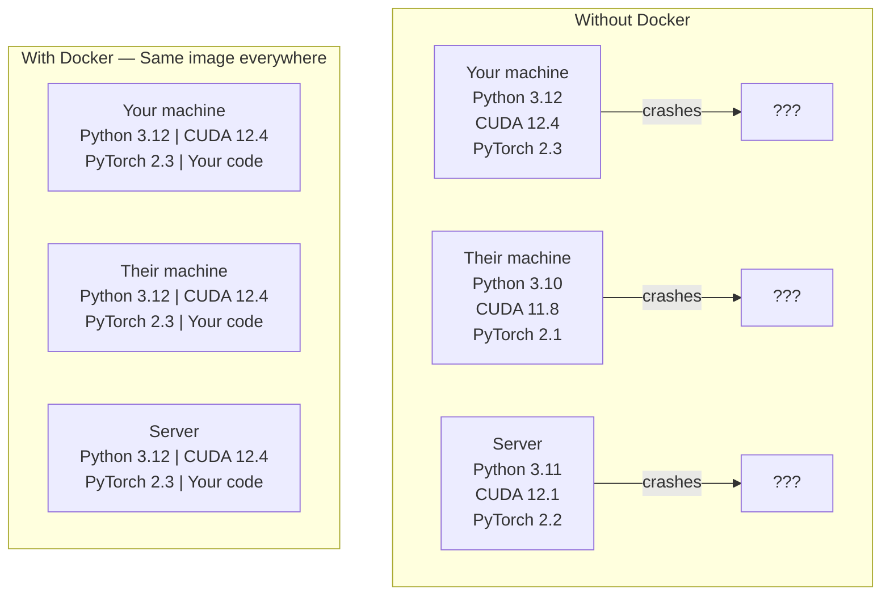

# Docker dla AI

> Kontenery sprawiają, że „praca na mojej maszynie” należy już do przeszłości.

**Typ:** Kompilacja
**Języki:** Docker
**Wymagania wstępne:** Faza 0, lekcje 01 i 03
**Czas:** ~60 minut

## Cele nauczania

- Zbuduj obraz Dockera z obsługą GPU za pomocą bibliotek CUDA, PyTorch i AI z pliku Dockerfile
- Montuj katalogi hostów jako woluminy, aby utrwalać modele, zestawy danych i kod podczas przebudowy kontenerów
- Skonfiguruj zestaw narzędzi NVIDIA Container Toolkit, aby odsłonić procesory graficzne wewnątrz kontenerów
- Organizuj wielousługowe aplikacje AI (serwer wnioskowania + baza danych wektorowych) za pomocą Docker Compose

## Problem

Trenowałeś model na swoim laptopie za pomocą PyTorch 2.3, CUDA 12.4 i Python 3.12. Twój kolega ma PyTorch 2.1, CUDA 11.8 i Python 3.10. Twój model ulega awarii na swoim komputerze. Twój plik Dockerfile działa na obu.

Projekty AI to koszmary zależności. Typowy stos zawiera sterowniki Python, PyTorch, CUDA, cuDNN, biblioteki C na poziomie systemu i wyspecjalizowane pakiety, takie jak flash-attn, które wymagają dokładnych wersji kompilatora. Docker pakuje to wszystko w jeden obraz, który działa wszędzie identycznie.

## Koncepcja

Docker pakuje kod, środowisko wykonawcze, biblioteki i narzędzia systemowe w izolowaną jednostkę zwaną kontenerem. Pomyśl o niej jak o lekkiej maszynie wirtualnej, z tą różnicą, że udostępnia jądro systemu operacyjnego hosta, zamiast uruchamiać własne, więc uruchamia się w ciągu kilku sekund, a nie minut.



### Dlaczego projekty AI potrzebują Dockera bardziej niż większość

1. **Sterowniki GPU są delikatne.** Kod CUDA 12.4 nie działa na CUDA 11.8. Docker izoluje zestaw narzędzi CUDA wewnątrz kontenera, jednocześnie udostępniając sterownik procesora graficznego hosta za pośrednictwem zestawu narzędzi NVIDIA Container Toolkit.

2. **Waga modeli jest duża.** Model z parametrami 7B ma 14 GB w FP16. Nie chcesz go ponownie pobierać za każdym razem, gdy odbudowujesz. Woluminy Dockera umożliwiają zamontowanie katalogu modeli z hosta.

3. **Architektury wielousługowe są powszechne.** Prawdziwa aplikacja AI to nie tylko skrypt w języku Python. Jest to serwer wnioskowania, wektorowa baza danych dla RAG, być może nakładka internetowa. Docker Compose koordynuje to wszystko za pomocą jednego polecenia.

### Kluczowe słownictwo

| Termin | Co to znaczy |
|------|----------------------------|
| Obraz | Szablon tylko do odczytu. Twój przepis. Zbudowany z pliku Dockerfile. |
| Pojemnik | Działająca instancja obrazu. Twoja kuchnia. |
| Plik Dockera | Instrukcje budowania wizerunku. Warstwa po warstwie. |
| Tom | Pamięć trwała, która przetrwa ponowne uruchomienie kontenera. |
| tworzenie dokera | Narzędzie do definiowania aplikacji wielokontenerowych w YAML. |

### Typowe wzorce kontenerów w AI

```
Dev Container
  Full toolkit. Editor support. Jupyter. Debugging tools.
  Used during development and experimentation.

Training Container
  Minimal. Just the training script and dependencies.
  Runs on GPU clusters. No editor, no Jupyter.

Inference Container
  Optimized for serving. Small image. Fast cold start.
  Runs behind a load balancer in production.
```

## Zbuduj to

### Krok 1: Zainstaluj Dockera

```bash
# macOS
brew install --cask docker
open /Applications/Docker.app

# Ubuntu
curl -fsSL https://get.docker.com | sh
sudo usermod -aG docker $USER
# Log out and back in for group change to take effect
```

Zweryfikuj:

```bash
docker --version
docker run hello-world
```

### Krok 2: Zainstaluj zestaw narzędzi kontenerowych NVIDIA (Linux z procesorem graficznym NVIDIA)

Dzięki temu kontenery Docker mają dostęp do procesora graficznego. Użytkownicy macOS i Windows (WSL2) mogą to pominąć; Docker Desktop obsługuje przekazywanie GPU w różny sposób na tych platformach.

```bash
distribution=$(. /etc/os-release;echo $ID$VERSION_ID)
curl -fsSL https://nvidia.github.io/libnvidia-container/gpgkey | sudo gpg --dearmor -o /usr/share/keyrings/nvidia-container-toolkit-keyring.gpg
curl -s -L https://nvidia.github.io/libnvidia-container/$distribution/libnvidia-container.list | \
    sed 's#deb https://#deb [signed-by=/usr/share/keyrings/nvidia-container-toolkit-keyring.gpg] https://#g' | \
    sudo tee /etc/apt/sources.list.d/nvidia-container-toolkit.list

sudo apt-get update
sudo apt-get install -y nvidia-container-toolkit
sudo nvidia-ctk runtime configure --runtime=docker
sudo systemctl restart docker
```

Przetestuj dostęp do procesora graficznego w kontenerze:

```bash
docker run --rm --gpus all nvidia/cuda:12.4.1-base-ubuntu22.04 nvidia-smi
```

Jeśli widzisz informacje o GPU, zestaw narzędzi działa.

### Krok 3: Poznaj obrazy podstawowe

Wybór odpowiedniego obrazu podstawowego pozwala zaoszczędzić wiele godzin debugowania.

```
nvidia/cuda:12.4.1-devel-ubuntu22.04
  Full CUDA toolkit. Compilers included.
  Use for: building packages that need nvcc (flash-attn, bitsandbytes)
  Size: ~4 GB

nvidia/cuda:12.4.1-runtime-ubuntu22.04
  CUDA runtime only. No compilers.
  Use for: running pre-built code
  Size: ~1.5 GB

pytorch/pytorch:2.3.1-cuda12.4-cudnn9-runtime
  PyTorch pre-installed on top of CUDA.
  Use for: skipping the PyTorch install step
  Size: ~6 GB

python:3.12-slim
  No CUDA. CPU only.
  Use for: inference on CPU, lightweight tools
  Size: ~150 MB
```

### Krok 4: Napisz plik Dockerfile na potrzeby rozwoju sztucznej inteligencji

Oto plik Dockerfile w `code/Dockerfile`. Przejdź przez to:

```dockerfile
FROM nvidia/cuda:12.4.1-devel-ubuntu22.04

ENV DEBIAN_FRONTEND=noninteractive
ENV PYTHONUNBUFFERED=1

RUN apt-get update && apt-get install -y --no-install-recommends \
    python3.12 \
    python3.12-venv \
    python3.12-dev \
    python3-pip \
    git \
    curl \
    build-essential \
    && rm -rf /var/lib/apt/lists/*

RUN update-alternatives --install /usr/bin/python python /usr/bin/python3.12 1

RUN python -m pip install --no-cache-dir --upgrade pip setuptools wheel

RUN python -m pip install --no-cache-dir \
    torch==2.3.1 \
    torchvision==0.18.1 \
    torchaudio==2.3.1 \
    --index-url https://download.pytorch.org/whl/cu124

RUN python -m pip install --no-cache-dir \
    numpy \
    pandas \
    scikit-learn \
    matplotlib \
    jupyter \
    transformers \
    datasets \
    accelerate \
    safetensors

WORKDIR /workspace

VOLUME ["/workspace", "/models"]

EXPOSE 8888

CMD ["python"]
```

Zbuduj to:

```bash
docker build -t ai-dev -f phases/00-setup-and-tooling/07-docker-for-ai/code/Dockerfile .
```

Za pierwszym razem zajmuje to trochę czasu (pobieranie obrazu podstawowego CUDA + PyTorch). Kolejne kompilacje korzystają z warstw buforowanych.

Uruchom to:

```bash
docker run --rm -it --gpus all \
    -v $(pwd):/workspace \
    -v ~/models:/models \
    ai-dev python -c "import torch; print(f'PyTorch {torch.__version__}, CUDA: {torch.cuda.is_available()}')"
```

Uruchom Jupytera w kontenerze:

```bash
docker run --rm -it --gpus all \
    -v $(pwd):/workspace \
    -v ~/models:/models \
    -p 8888:8888 \
    ai-dev jupyter notebook --ip=0.0.0.0 --port=8888 --no-browser --allow-root
```

### Krok 5: montowanie woluminów danych i modeli

Zwiększanie głośności ma kluczowe znaczenie dla pracy AI. Bez nich pobrane pliki modelu 14 GB znikają po zatrzymaniu kontenera.

```bash
# Mount your code
-v $(pwd):/workspace

# Mount a shared models directory
-v ~/models:/models

# Mount datasets
-v ~/datasets:/data
```

Wewnątrz skryptu szkoleniowego załaduj z zamontowanej ścieżki:

```python
from transformers import AutoModel

model = AutoModel.from_pretrained("/models/llama-7b")
```

Model znajduje się w systemie plików hosta. Odbuduj kontener tak często, jak chcesz, bez ponownego pobierania.

### Krok 6: Docker Compose dla wielousługowych aplikacji AI

Prawdziwa aplikacja RAG wymaga serwera wnioskowania i bazy danych wektorów. Docker Compose uruchamia oba za pomocą jednego polecenia.

Zobacz `code/docker-compose.yml`:

```yaml
services:
  ai-dev:
    build:
      context: .
      dockerfile: Dockerfile
    deploy:
      resources:
        reservations:
          devices:
            - driver: nvidia
              count: all
              capabilities: [gpu]
    volumes:
      - ../../../:/workspace
      - ~/models:/models
      - ~/datasets:/data
    ports:
      - "8888:8888"
    stdin_open: true
    tty: true
    command: jupyter notebook --ip=0.0.0.0 --port=8888 --no-browser --allow-root

  qdrant:
    image: qdrant/qdrant:v1.12.5
    ports:
      - "6333:6333"
      - "6334:6334"
    volumes:
      - qdrant_data:/qdrant/storage

volumes:
  qdrant_data:
```

Zacznij wszystko:

```bash
cd phases/00-setup-and-tooling/07-docker-for-ai/code
docker compose up -d
```

Teraz Twój kontener AI może dotrzeć do bazy danych wektorów pod adresem `http://qdrant:6333` według nazwy usługi. Docker Compose automatycznie tworzy udostępnioną sieć.

Przetestuj połączenie z wnętrza kontenera AI:

```python
from qdrant_client import QdrantClient

client = QdrantClient(host="qdrant", port=6333)
print(client.get_collections())
```

Zatrzymaj wszystko:

```bash
docker compose down
```

Dodaj `-v`, aby również usunąć wolumin qdrant:

```bash
docker compose down -v
```

### Krok 7: Przydatne polecenia Dockera w pracy AI

```bash
# List running containers
docker ps

# List all images and their sizes
docker images

# Remove unused images (reclaim disk space)
docker system prune -a

# Check GPU usage inside a running container
docker exec -it <container_id> nvidia-smi

# Copy a file from container to host
docker cp <container_id>:/workspace/results.csv ./results.csv

# View container logs
docker logs -f <container_id>
```

## Użyj tego

Masz teraz powtarzalne środowisko programistyczne AI. Pozostała część kursu:

- Użyj `docker compose up`, aby razem uruchomić środowisko programistyczne i bazę danych wektorowych
- Montuj swój kod, modele i dane jako woluminy, aby nic nie zostało utracone pomiędzy przebudowami
- Kiedy lekcja wymaga nowego pakietu Pythona, dodaj go do pliku Dockerfile i odbuduj
- Udostępnij swój plik Dockerfile członkom zespołu. Dostają dokładnie to samo środowisko.

### Brak procesora graficznego?

Usuń flagę `--gpus all` i blokadę wdrażania NVIDIA. Kontener nadal działa w przypadku lekcji opartych na procesorze. PyTorch wykrywa brak CUDA i automatycznie wraca do procesora.

## Ćwiczenia

1. Zbuduj plik Dockerfile i uruchom `python -c "import torch; print(torch.__version__)"` wewnątrz kontenera
2. Uruchom stos dokowania i sprawdź, czy Qdrant jest dostępny z kontenera AI pod adresem `http://qdrant:6333/collections`
3. Dodaj `flask` do pliku Dockerfile, przebuduj i uruchom prosty serwer API na porcie 5000. Zamapuj port za pomocą `-p 5000:5000`
4. Zmierz rozmiar obrazu za pomocą `docker images`. Spróbuj zmienić obraz podstawowy z `devel` na `runtime` i porównaj rozmiary

## Kluczowe terminy

| Termin | Co ludzie mówią | Co to właściwie oznacza |
|------|----------------|----------------------|
| Pojemnik | „Lekka maszyna wirtualna” | Izolowany proces korzystający z jądra hosta, z własnym systemem plików i siecią |
| Warstwa obrazu | „Krok w pamięci podręcznej” | Każda instrukcja Dockerfile tworzy warstwę. Niezmienione warstwy są buforowane, więc przebudowa jest szybka. |
| Zestaw narzędzi kontenerowych NVIDIA | „GPU w Dockerze” | Hak środowiska wykonawczego, który udostępnia procesory graficzne hosta kontenerom za pośrednictwem flagi `--gpus` |
| Mocowanie głośności | „Folder udostępniony” | Katalog na hoście zamapowany na kontener. Zmiany utrzymują się po zatrzymaniu kontenera. |
| Obraz podstawowy | „Punkt wyjścia” | Obraz `FROM`, na którym opiera się Twój plik Dockerfile. Określa, co jest wstępnie zainstalowane. |