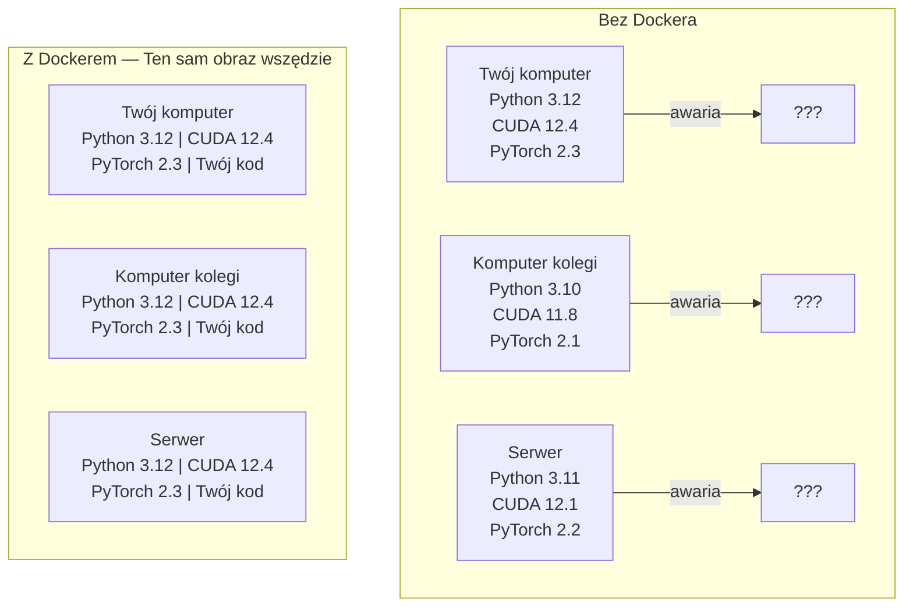

# Docker dla AI

> Dzięki kontenerom wymówka „u mnie działa” przechodzi do historii.

**Typ:** Środowisko
**Języki:** Docker
**Wymagania wstępne:** Faza 0, lekcje 01 i 03
**Czas:** ~60 minut

## Cele nauki

- Tworzenie obrazu Docker z obsługą GPU, bibliotekami CUDA, PyTorch oraz narzędziami AI za pomocą pliku Dockerfile.
- Montowanie katalogów hosta jako wolumenów w celu zachowania modeli, zbiorów danych i kodu pomiędzy przebudowami kontenerów.
- Konfiguracja NVIDIA Container Toolkit w celu udostępnienia zasobów GPU wewnątrz kontenerów.
- Orkiestracja wielousługowych aplikacji AI (serwer inferencyjny + wektorowa baza danych) za pomocą narzędzia Docker Compose.

## Problem

Wytrenowałeś model na swoim laptopie, używając PyTorch 2.3, CUDA 12.4 i Pythona 3.12. Twój kolega ma zainstalowanego PyTorcha 2.1, CUDA 11.8 i Pythona 3.10. Twój kod nie działa na jego komputerze. Twój plik Dockerfile działa na obu.

Projekty związane ze sztuczną inteligencją to często koszmar zależności. Typowy stos technologiczny obejmuje wersję Pythona, framework PyTorch, sterowniki CUDA, cuDNN, biblioteki systemowe w C oraz wyspecjalizowane pakiety (np. flash-attn), które wymagają bardzo konkretnych wersji kompilatora. Docker pakuje to wszystko w jeden obraz, który działa identycznie w każdym środowisku.

## Koncepcja

Docker pakuje kod, środowisko uruchomieniowe, biblioteki i narzędzia systemowe w odizolowaną jednostkę zwaną kontenerem. Możesz myśleć o nim jak o lekkiej maszynie wirtualnej, z tą różnicą, że współdzieli on jądro (kernel) systemu operacyjnego hosta, zamiast uruchamiać własne. Dzięki temu startuje w kilka sekund, a nie minut.



### Dlaczego projekty AI potrzebują Dockera bardziej niż inne?

1. **Sterowniki GPU są problematyczne.** Kod wykorzystujący CUDA 12.4 nie zadziała na środowisku z CUDA 11.8. Docker pozwala zamknąć konkretną wersję narzędzi CUDA wewnątrz kontenera, udostępniając mu jednocześnie sterownik karty graficznej hosta poprzez NVIDIA Container Toolkit.

2. **Modele zajmują dużo miejsca.** Model o rozmiarze 7 mld parametrów (7B) to około 14 GB w formacie FP16. Nie chcesz pobierać go ponownie za każdym razem, gdy przebudowujesz środowisko. Wolumeny w Dockerze umożliwiają podmontowanie lokalnego katalogu z modelami bezpośrednio z hosta.

3. **Architektury wielousługowe są standardem.** Wdrożona na produkcję aplikacja AI to nie tylko pojedynczy skrypt w Pythonie. To serwer inferencyjny, wektorowa baza danych dla systemu RAG, a często także interfejs webowy. Docker Compose pozwala na zarządzanie i uruchamianie całej tej infrastruktury za pomocą jednego polecenia.

### Kluczowe pojęcia

| Termin | Co to oznacza |
|------|----------------------------|
| Obraz (Image) | Szablon tylko do odczytu. Twój przepis. Budowany na podstawie pliku Dockerfile. |
| Kontener (Container) | Uruchomiona instancja obrazu. Twoja kuchnia. |
| Dockerfile | Instrukcje budowania obrazu. Krok po kroku, warstwa po warstwie. |
| Wolumen (Volume) | Trwałe miejsce na dane, które nie znika po zresetowaniu lub usunięciu kontenera. |
| Docker Compose | Narzędzie do definiowania i uruchamiania wielokontenerowych aplikacji za pomocą pliku YAML. |

### Typowe wzorce kontenerów w projektach AI

```
Kontener deweloperski (Dev Container)
  Pełen zestaw narzędzi. Wsparcie dla edytorów, Jupyter, narzędzia do debugowania.
  Wykorzystywany podczas tworzenia kodu i eksperymentowania.

Kontener treningowy (Training Container)
  Minimalistyczny. Tylko skrypt treningowy i jego zależności.
  Uruchamiany na klastrach GPU. Brak edytorów, brak Jupytera.

Kontener inferencyjny (Inference Container)
  Zoptymalizowany pod kątem serwowania modelu. Mały rozmiar obrazu, szybki start.
  Uruchamiany na produkcji, zazwyczaj za load balancerem.
```

## Zbuduj to

### Krok 1: Zainstaluj Dockera

```bash
# macOS
brew install --cask docker
open /Applications/Docker.app

# Ubuntu
curl -fsSL https://get.docker.com | sh
sudo usermod -aG docker $USER
# Wyloguj się i zaloguj ponownie, aby zmiany w grupach zaczęły obowiązywać
```

Weryfikacja:

```bash
docker --version
docker run hello-world
```

### Krok 2: Zainstaluj NVIDIA Container Toolkit (Linux z układami GPU NVIDIA)

To narzędzie zapewnia kontenerom Docker dostęp do procesora graficznego. Użytkownicy macOS oraz Windows (z WSL2) mogą pominąć ten krok; Docker Desktop obsługuje przekazywanie zasobów GPU na tych platformach w inny sposób.

```bash
distribution=$(. /etc/os-release;echo $ID$VERSION_ID)
curl -fsSL https://nvidia.github.io/libnvidia-container/gpgkey | sudo gpg --dearmor -o /usr/share/keyrings/nvidia-container-toolkit-keyring.gpg
curl -s -L https://nvidia.github.io/libnvidia-container/$distribution/libnvidia-container.list | \
    sed 's#deb https://#deb [signed-by=/usr/share/keyrings/nvidia-container-toolkit-keyring.gpg] https://#g' | \
    sudo tee /etc/apt/sources.list.d/nvidia-container-toolkit.list

sudo apt-get update
sudo apt-get install -y nvidia-container-toolkit
sudo nvidia-ctk runtime configure --runtime=docker
sudo systemctl restart docker
```

Przetestuj dostęp do GPU wewnątrz kontenera:

```bash
docker run --rm --gpus all nvidia/cuda:12.4.1-base-ubuntu22.04 nvidia-smi
```

Jeśli widzisz informacje o swojej karcie graficznej, narzędzie działa poprawnie.

### Krok 3: Poznaj obrazy bazowe

Wybór odpowiedniego obrazu bazowego pozwoli zaoszczędzić godziny spędzone na debugowaniu.

```
nvidia/cuda:12.4.1-devel-ubuntu22.04
  Pełny zestaw narzędzi CUDA. Zawiera kompilatory.
  Używaj do: budowania pakietów wymagających nvcc (np. flash-attn, bitsandbytes).
  Rozmiar: ~4 GB

nvidia/cuda:12.4.1-runtime-ubuntu22.04
  Tylko środowisko uruchomieniowe CUDA. Brak kompilatorów.
  Używaj do: uruchamiania już skompilowanego kodu.
  Rozmiar: ~1.5 GB

pytorch/pytorch:2.3.1-cuda12.4-cudnn9-runtime
  Wstępnie zainstalowany PyTorch ze środowiskiem CUDA.
  Używaj do: pominięcia kroku instalacji PyTorcha.
  Rozmiar: ~6 GB

python:3.12-slim
  Brak CUDA. Obsługa wyłącznie procesora (CPU).
  Używaj do: inferencji na CPU, lekkich narzędzi i aplikacji.
  Rozmiar: ~150 MB
```

### Krok 4: Napisz plik Dockerfile dla rozwoju AI

Oto przykładowy plik Dockerfile, który znajduje się w `code/Dockerfile`. Przeanalizujmy go:

```dockerfile
FROM nvidia/cuda:12.4.1-devel-ubuntu22.04

ENV DEBIAN_FRONTEND=noninteractive
ENV PYTHONUNBUFFERED=1

RUN apt-get update && apt-get install -y --no-install-recommends \
    python3.12 \
    python3.12-venv \
    python3.12-dev \
    python3-pip \
    git \
    curl \
    build-essential \
    && rm -rf /var/lib/apt/lists/*

RUN update-alternatives --install /usr/bin/python python /usr/bin/python3.12 1

RUN python -m pip install --no-cache-dir --upgrade pip setuptools wheel

RUN python -m pip install --no-cache-dir \
    torch==2.3.1 \
    torchvision==0.18.1 \
    torchaudio==2.3.1 \
    --index-url https://download.pytorch.org/whl/cu124

RUN python -m pip install --no-cache-dir \
    numpy \
    pandas \
    scikit-learn \
    matplotlib \
    jupyter \
    transformers \
    datasets \
    accelerate \
    safetensors

WORKDIR /workspace

VOLUME ["/workspace", "/models"]

EXPOSE 8888

CMD ["python"]
```

Zbuduj obraz:

```bash
docker build -t ai-dev -f phases/00-setup-and-tooling/07-docker-for-ai/code/Dockerfile .
```

Za pierwszym razem proces może potrwać nieco dłużej (pobieranie obrazu bazowego CUDA oraz instalacja PyTorcha). Kolejne kompilacje będą o wiele szybsze dzięki wykorzystaniu pamięci podręcznej dla warstw.

Uruchom kontener:

```bash
docker run --rm -it --gpus all \
    -v $(pwd):/workspace \
    -v ~/models:/models \
    ai-dev python -c "import torch; print(f'PyTorch {torch.__version__}, CUDA: {torch.cuda.is_available()}')"
```

Uruchom Jupyter Notebook wewnątrz kontenera:

```bash
docker run --rm -it --gpus all \
    -v $(pwd):/workspace \
    -v ~/models:/models \
    -p 8888:8888 \
    ai-dev jupyter notebook --ip=0.0.0.0 --port=8888 --no-browser --allow-root
```

### Krok 5: Montowanie wolumenów na dane i modele

Montowanie wolumenów jest niezbędne w pracy z AI. Bez nich 14-gigabajtowy model zniknie z dysku w momencie zatrzymania kontenera.

```bash
# Montowanie kodu
-v $(pwd):/workspace

# Montowanie wspólnego katalogu z modelami
-v ~/models:/models

# Montowanie zbiorów danych
-v ~/datasets:/data
```

W skrypcie treningowym wczytuj modele i dane z zamontowanych ścieżek:

```python
from transformers import AutoModel

model = AutoModel.from_pretrained("/models/llama-7b")
```

Pliki modeli pozostaną nietknięte w systemie plików hosta. Możesz przebudowywać kontener do woli, bez konieczności ponownego pobierania gigabajtów danych.

### Krok 6: Docker Compose dla wielousługowych aplikacji AI

Prawdziwa aplikacja oparta na RAG potrzebuje zarówno serwera wnioskującego (inferencji), jak i wektorowej bazy danych. Docker Compose pozwala uruchomić obie usługi za pomocą jednego polecenia.

Spójrz na plik `code/docker-compose.yml`:

```yaml
services:
  ai-dev:
    build:
      context: .
      dockerfile: Dockerfile
    deploy:
      resources:
        reservations:
          devices:
            - driver: nvidia
               count: all
               capabilities: [gpu]
    volumes:
      - ../../../:/workspace
      - ~/models:/models
      - ~/datasets:/data
    ports:
      - "8888:8888"
    stdin_open: true
    tty: true
    command: jupyter notebook --ip=0.0.0.0 --port=8888 --no-browser --allow-root

  qdrant:
    image: qdrant/qdrant:v1.12.5
    ports:
      - "6333:6333"
      - "6334:6334"
    volumes:
      - qdrant_data:/qdrant/storage

volumes:
  qdrant_data:
```

Uruchom całe środowisko:

```bash
cd phases/00-setup-and-tooling/07-docker-for-ai/code
docker compose up -d
```

Teraz Twój kontener z AI może komunikować się z wektorową bazą danych pod adresem `http://qdrant:6333`, wykorzystując nazwę usługi. Docker Compose samodzielnie skonfiguruje wspólną sieć dla obu kontenerów.

Przetestuj połączenie z poziomu kontenera AI:

```python
from qdrant_client import QdrantClient

client = QdrantClient(host="qdrant", port=6333)
print(client.get_collections())
```

Zatrzymaj wszystko:

```bash
docker compose down
```

Dodaj opcję `-v`, aby usunąć również zadeklarowany wolumen dla bazy Qdrant:

```bash
docker compose down -v
```

### Krok 7: Przydatne polecenia Dockera w projektach AI

```bash
# Wyświetl listę działających kontenerów
docker ps

# Wyświetl listę wszystkich obrazów oraz ich rozmiar
docker images

# Usuń nieużywane obrazy (aby odzyskać miejsce na dysku)
docker system prune -a

# Sprawdź obciążenie GPU wewnątrz działającego kontenera
docker exec -it <id_kontenera> nvidia-smi

# Skopiuj plik z kontenera na komputer hosta
docker cp <id_kontenera>:/workspace/results.csv ./results.csv

# Podgląd logów kontenera (na żywo)
docker logs -f <id_kontenera>
```

## Praktyczne zastosowanie

Zbudowałeś właśnie powtarzalne środowisko programistyczne dla projektów AI. W dalszej części kursu:

- Używaj `docker compose up`, aby równocześnie uruchamiać środowisko deweloperskie i wektorową bazę danych.
- Montuj swój kod, modele i dane jako wolumeny, by niczego nie stracić pomiędzy przebudowami kontenerów.
- Kiedy lekcja wymaga zainstalowania nowej biblioteki Pythona, dodaj ją do pliku Dockerfile i zbuduj obraz ponownie.
- Dziel się swoim plikiem Dockerfile z członkami zespołu, by zapewnić, że wszyscy pracują w dokładnie tym samym środowisku.

### Brak GPU na komputerze?

Po prostu usuń flagę `--gpus all` i konfigurację `deploy` odnoszącą się do NVIDIA. Kontener wciąż będzie działał i idealnie sprawdzi się na lekcjach, w których do uruchomienia potrzebny jest tylko procesor (CPU). PyTorch z łatwością wykryje brak CUDA i automatycznie przełączy się na tryb CPU.

## Ćwiczenia

1. Zbuduj obraz na podstawie pliku Dockerfile, a następnie uruchom polecenie `python -c "import torch; print(torch.__version__)"` wewnątrz utworzonego kontenera.
2. Uruchom aplikację za pomocą Docker Compose i zweryfikuj, czy Qdrant jest dostępny dla Twojego kontenera AI pod adresem `http://qdrant:6333/collections`.
3. Dodaj bibliotekę `flask` do pliku Dockerfile, zbuduj obraz ponownie i uruchom prosty serwer API nasłuchujący na porcie 5000. Zmapuj ten port używając opcji `-p 5000:5000`.
4. Sprawdź i porównaj rozmiary swoich obrazów korzystając z polecenia `docker images`. Spróbuj zmienić obraz bazowy z wersji `devel` na `runtime` i zauważ różnicę w wadze obrazu.

## Kluczowe terminy

| Termin | Potoczne określenie | Co to faktycznie oznacza |
|------|----------------|----------------------|
| Kontener (Container) | „Lekka maszyna wirtualna” | Izolowany proces współdzielący jądro hosta, z własnym systemem plików i podsiecią. |
| Warstwa obrazu (Image Layer) | „Zbuforowany krok” | Każda instrukcja w pliku Dockerfile tworzy warstwę. Niezmienione warstwy trafiają do pamięci podręcznej, znacznie przyspieszając proces budowania. |
| NVIDIA Container Toolkit | „GPU w Dockerze” | Narzędzie uruchomieniowe pozwalające przekazać zasoby GPU hosta do kontenera za pomocą flagi `--gpus`. |
| Montowanie wolumenu (Volume Mount) | „Katalog współdzielony” | Lokalny katalog zmapowany bezpośrednio do kontenera. Wszelkie zmiany pozostają zapisane po zakończeniu działania kontenera. |
| Obraz bazowy (Base Image) | „Punkt startowy” | Obraz zdefiniowany poleceniem `FROM`, na którym bazuje Twój plik Dockerfile. Decyduje o preinstalowanym oprogramowaniu. |
