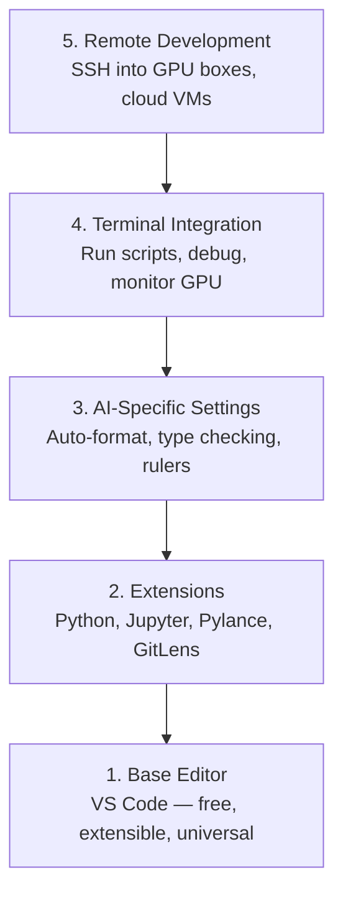

# Konfiguracja edytora

> Twój redaktor jest Twoim drugim pilotem. Skonfiguruj go raz, aby nie przeszkadzał i zaczął ciągnąć swój ciężar.

**Typ:** Kompilacja
**Języki:** --
**Wymagania:** Faza 0, Lekcja 01
**Czas:** ~20 minut

## Cele nauczania

- Zainstaluj VS Code z niezbędnymi rozszerzeniami dla Pythona, Jupytera, lintinga i zdalnego SSH
- Skonfiguruj formatowanie przy zapisywaniu, sprawdzanie typu i przewijanie danych wyjściowych notatnika dla przepływów pracy AI
- Skonfiguruj zdalny SSH, aby edytować i debugować kod na zdalnych maszynach GPU, tak jakby były lokalne
- Oceń alternatywne edytory (Cursor, Windsurf, Neovim) i ich kompromisy w zakresie pracy AI

## Problem

Spędzisz tysiące godzin w swoim edytorze, pisząc w Pythonie, uruchamiając notatniki, debugując pętle szkoleniowe i łącząc się przez SSH z urządzeniami GPU. Źle skonfigurowany edytor powoduje problemy w każdej sesji: brak autouzupełniania, brak wskazówek dotyczących typu, brak błędów wbudowanych, ręczne formatowanie i nieporęczny przepływ pracy w terminalu.

Właściwa konfiguracja zajmuje 20 minut. Pominięcie tego kosztuje Cię 20 minut każdego dnia.

## Koncepcja

Konfiguracja edytora inżynieryjnego AI wymaga pięciu rzeczy:



## Zbuduj to

### Krok 1: Zainstaluj kod VS

Zalecanym edytorem jest VS Code. Jest bezpłatny, działa na każdym systemie operacyjnym, obsługuje najwyższej klasy notebooki Jupyter, a ekosystem rozszerzeń obejmuje wszystko, czego potrzebujesz do pracy ze sztuczną inteligencją.

Pobierz go z [code.visualstudio.com](https://code.visualstudio.com/).

Sprawdź na terminalu:

```bash
code --version
```

Jeśli `code` nie zostanie znaleziony w systemie macOS, otwórz VS Code, naciśnij `Cmd+Shift+P`, wpisz „Polecenie powłoki” i wybierz „Zainstaluj polecenie „kod” w PATH”.

### Krok 2: Zainstaluj niezbędne rozszerzenia

Otwórz zintegrowany terminal w kodzie VS (`Ctrl+`` ` lub `` Cmd+` ``) i zainstaluj rozszerzenia istotne dla pracy AI:

```bash
code --install-extension ms-python.python
code --install-extension ms-python.vscode-pylance
code --install-extension ms-toolsai.jupyter
code --install-extension eamodio.gitlens
code --install-extension ms-vscode-remote.remote-ssh
code --install-extension ms-python.debugpy
code --install-extension ms-python.black-formatter
code --install-extension charliermarsh.ruff
```

Co każdy z nich robi:

| Rozszerzenie | Dlaczego |
|----------|-----|
| Pythona | Obsługa języków, wykrywanie środowiska wirtualnego, uruchamianie/debugowanie |
| Pylance | Szybkie sprawdzanie typu, autouzupełnianie, rozdzielczość importu |
| Jowisz | Uruchom notesy w VS Code, eksplorator zmiennych |
| GitLens | Zobacz, kto co zmienił, wbudowane git obwinianie |
| Zdalny SSH | Otwórz folder na zdalnym urządzeniu GPU, tak jakby był lokalny |
| Debugowanie | Debugowanie krokowe dla języka Python |
| Czarny formater | Automatyczne formatowanie przy zapisywaniu, spójny styl |
| Kryza | Szybkie linting, wyłapuje typowe błędy |

Plik `code/.vscode/extensions.json` zawarty w tej lekcji zawiera pełną listę rekomendacji. Po otwarciu folderu projektu VS Code wyświetli monit o ich zainstalowanie.

### Krok 3: Skonfiguruj ustawienia

Skopiuj ustawienia z `code/.vscode/settings.json` z tej lekcji lub zastosuj je ręcznie za pomocą `Settings > Open Settings (JSON)`.

Kluczowe ustawienia pracy AI:

```jsonc
{
    "python.analysis.typeCheckingMode": "basic",
    "editor.formatOnSave": true,
    "editor.rulers": [88, 120],
    "notebook.output.scrolling": true,
    "files.autoSave": "afterDelay"
}
```

Dlaczego te kwestie mają znaczenie:

- **Sprawdzanie typów w trybie podstawowym**: Wychwytuje nieprawidłowe typy argumentów przed uruchomieniem. Oszczędza czas debugowania w przypadku niedopasowań kształtu tensora i błędnych parametrów API.
- **Formatuj po zapisaniu**: Nigdy więcej nie myśl o formatowaniu. Czarny sobie z tym radzi.
- **Linijki na 88 i 120**: Czarne okłady na 88. Znacznik 120 pokazuje, kiedy dokumenty i komentarze stają się zbyt długie.
- **Przewijanie wyjścia notebooka**: Pętle treningowe drukują tysiące linii. Bez przewijania panel wyjściowy eksploduje.
- **Automatyczny zapis**: Zapomnisz zapisać. Twój skrypt szkoleniowy będzie uruchamiał nieaktualny kod. Automatyczne zapisywanie zapobiega temu.

### Krok 4: Integracja terminala

Zintegrowany terminal VS Code umożliwia uruchamianie skryptów szkoleniowych, monitorowanie procesorów graficznych i zarządzanie środowiskami.

Skonfiguruj to poprawnie:

```jsonc
{
    "terminal.integrated.defaultProfile.osx": "zsh",
    "terminal.integrated.defaultProfile.linux": "bash",
    "terminal.integrated.fontSize": 13,
    "terminal.integrated.scrollback": 10000
}
```

Przydatne skróty:

| Akcja | macOS | Linux/Windows |
|------------|-------|--------------|
| Przełącz terminal | `` Ctrl+` `` | `` Ctrl+` `` |
| Nowy terminal | `Ctrl+Shift+`` ` | `Ctrl+Shift+`` ` |
| Podzielony terminal | `Cmd+\` | `Ctrl+\` |

Dzielone terminale są przydatne: jeden do uruchamiania skryptu, drugi do monitorowania GPU za pomocą `nvidia-smi -l 1` lub `watch -n 1 nvidia-smi`.

### Krok 5: Zdalny rozwój (SSH do modułów GPU)

To najważniejsze rozszerzenie pracy AI. Szkolenia przeprowadzisz na zdalnych maszynach (maszyny wirtualne w chmurze, serwery laboratoryjne, Lambda, Vast.ai). Zdalny SSH pozwala otwierać zdalny system plików, edytować pliki, uruchamiać terminale i debugować tak, jakby wszystko było lokalne.

Konfiguracja:

1. Zainstaluj rozszerzenie Remote SSH (wykonane w kroku 2).
2. Naciśnij `Ctrl+Shift+P` (lub `Cmd+Shift+P`), wpisz „Remote-SSH: Connect to Host”.
3. Wpisz `user@your-gpu-box-ip`.
4. VS Code automatycznie instaluje komponent serwera na zdalnym komputerze.

Aby uzyskać dostęp bez hasła, skonfiguruj klucze SSH:

```bash
ssh-keygen -t ed25519 -C "your-email@example.com"
ssh-copy-id user@your-gpu-box-ip
```

Dla wygody dodaj hosta do `~/.ssh/config`:

```
Host gpu-box
    HostName 203.0.113.50
    User ubuntu
    IdentityFile ~/.ssh/id_ed25519
    ForwardAgent yes
```

Teraz `Remote-SSH: Connect to Host > gpu-box` łączy się natychmiast.

## Alternatywy

### Kursor

[cursor.com](https://cursor.com) to fork VS Code z wbudowaną funkcją generowania kodu AI. Wykorzystuje ten sam ekosystem rozszerzeń i format ustawień. Jeśli używasz Kursora, wszystko, co opisano w tej lekcji, nadal ma zastosowanie. Zaimportuj te same `settings.json` i `extensions.json`.

### Windsurfing

[windsurf.com](https://windsurf.com) to kolejny fork VS Code, w którym zastosowano sztuczną inteligencję. Ta sama historia: te same rozszerzenia, ten sam format ustawień, ta sama zdalna obsługa SSH.

### Vima/Neovima

Jeśli już używasz Vima lub Neovima i jesteś w nim produktywny, zostań tam. Minimalna konfiguracja do pracy AI Python:

- **pyright** lub **pylsp** do sprawdzania typu (poprzez Mason lub instalację ręczną)
- **nvim-lspconfig** do integracji z serwerem językowym
- **jupyter-vim** lub **molten-nvim** do wykonania przypominającego notatnik
- **telescope.nvim** do wyszukiwania plików/symboli
- **none-ls.nvim** z czernią i kryzą do formatowania/lintingu

Jeśli jeszcze nie używasz Vima, nie zaczynaj teraz. Krzywa uczenia się będzie konkurować z nauką inżynierii AI. Użyj kodu VS.

## Użyj tego

Dzięki tej konfiguracji Twój codzienny przepływ pracy wygląda następująco:

1. Otwórz folder projektu w VS Code (lub połącz się poprzez Remote SSH z GPU).
2. Napisz Python w edytorze z autouzupełnianiem, podpowiedziami i błędami wbudowanymi.
3. Uruchom notatniki Jupyter wbudowane w rozszerzenie Jupyter.
4. Użyj zintegrowanego terminala do skryptów szkoleniowych, `uv pip install` i monitorowania GPU.
5. Przed zatwierdzeniem przejrzyj zmiany za pomocą GitLens.

## Ćwiczenia

1. Zainstaluj VS Code i wszystkie rozszerzenia wymienione w kroku 2
2. Skopiuj `settings.json` z tej lekcji do konfiguracji VS Code
3. Otwórz plik Pythona i sprawdź, czy podczas zapisywania Pylance wyświetla wskazówki dotyczące typów i formaty Black
4. Jeśli masz dostęp do komputera zdalnego, skonfiguruj zdalny SSH i otwórz na nim folder

## Kluczowe terminy

| Termin | Co ludzie mówią | Co to właściwie oznacza |
|------|----------------|----------------------|
| LSP | „Silnik autouzupełniania” | Protokół serwera językowego: standard umożliwiający redaktorom uzyskiwanie informacji o typach, uzupełnieniach i diagnostyce z serwera specyficznego dla języka |
| Pylance | „Wtyczka Pythona” | Serwer języka Python firmy Microsoft wykorzystujący Pyright do sprawdzania typu i IntelliSense |
| Zdalny SSH | "Praca na serwerze" | Rozszerzenie VS Code, które uruchamia lekki serwer na zdalnym komputerze i przesyła strumieniowo interfejs użytkownika do lokalnego edytora |
| Formatuj przy zapisie | „Auto-ładniejszy” | Edytor uruchamia program formatujący (Black, Ruff) przy każdym zapisie, więc styl kodu jest zawsze spójny |