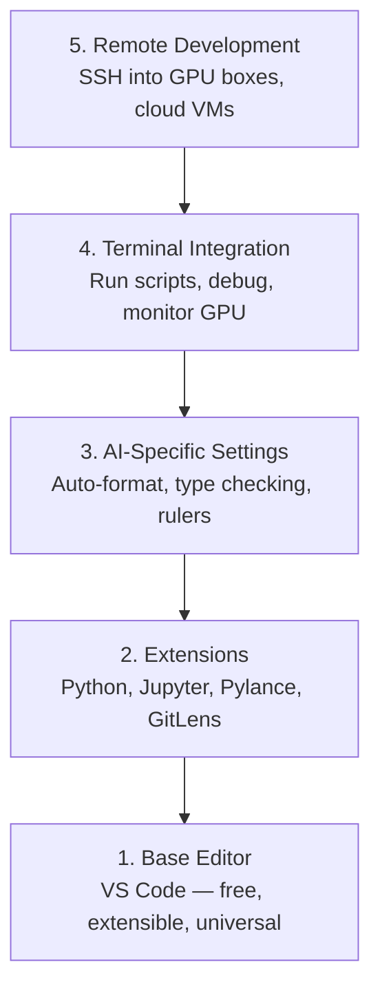

# Konfiguracja edytora

> Twój edytor jest twoim kopilotem. Skonfiguruj go raz, aby nie stał ci na drodze i zaczął pracować na twoją korzyść.

**Typ:** Build
**Języki:** --
**Wymagania wstępne:** Faza 0, Lekcja 01
**Czas:** ~20 minut

## Cele nauki

- Zainstaluj VS Code z niezbędnymi rozszerzeniami do Pythona, Jupyter, lintingu i zdalnego SSH
- Skonfiguruj formatowanie przy zapisie, sprawdzanie typów i przewijanie wyjścia notebooków na potrzeby pracy z AI
- Skonfiguruj Remote SSH, aby edytować i debugować kod na zdalnych maszynach z GPU tak, jakby były lokalne
- Oceń alternatywy edytorów (Cursor, Windsurf, Neovim) i ich kompromisy w pracy z AI

## Problem

Spędzisz tysiące godzin w swoim edytorze, pisząc kod w Pythonie, uruchamiając notebooki, debugując pętle treningowe i łącząc się przez SSH z maszynami GPU. Źle skonfigurowany edytor zamienia każdą sesję w utrudnienie: brak autouzupełniania, brak podpowiedzi typów, brak błędów wyświetlanych w miejscu, ręczne formatowanie i niewygodny przepływ pracy w terminalu.

Odpowiednia konfiguracja zajmuje 20 minut. Pominięcie jej kosztuje cię 20 minut każdego dnia.

## Koncepcja

Konfiguracja edytora dla inżynierii AI wymaga pięciu elementów:



## Zbuduj to

### Krok 1: Zainstaluj VS Code

VS Code to rekomendowany edytor. Jest darmowy, działa na każdym systemie operacyjnym, ma pierwszorzędne wsparcie dla notebooków Jupyter, a ekosystem rozszerzeń pokrywa wszystko, czego potrzebujesz do pracy z AI.

Pobierz go z [code.visualstudio.com](https://code.visualstudio.com/).

Zweryfikuj instalację z poziomu terminala:

```bash
code --version
```

Jeśli polecenie `code` nie zostanie znalezione na macOS, otwórz VS Code, naciśnij `Cmd+Shift+P`, wpisz "Shell Command" i wybierz "Install 'code' command in PATH".

### Krok 2: Zainstaluj niezbędne rozszerzenia

Otwórz zintegrowany terminal w VS Code (`Ctrl+`` ` lub `` Cmd+` ``) i zainstaluj rozszerzenia istotne dla pracy z AI:

```bash
code --install-extension ms-python.python
code --install-extension ms-python.vscode-pylance
code --install-extension ms-toolsai.jupyter
code --install-extension eamodio.gitlens
code --install-extension ms-vscode-remote.remote-ssh
code --install-extension ms-python.debugpy
code --install-extension ms-python.black-formatter
code --install-extension charliermarsh.ruff
```

Co robi każde z nich:

| Extension | Po co |
|-----------|-----|
| Python | Wsparcie dla języka, wykrywanie środowisk wirtualnych, uruchamianie/debugowanie |
| Pylance | Szybkie sprawdzanie typów, autouzupełnianie, rozwiązywanie importów |
| Jupyter | Uruchamianie notebooków wewnątrz VS Code, eksplorator zmiennych |
| GitLens | Sprawdzanie, kto co zmienił, blame w miejscu kodu |
| Remote SSH | Otwieranie folderu na zdalnej maszynie GPU tak, jakby był lokalny |
| Debugpy | Debugowanie krokowe dla Pythona |
| Black Formatter | Automatyczne formatowanie przy zapisie, spójny styl |
| Ruff | Szybki linting, wykrywa typowe błędy |

Plik `code/.vscode/extensions.json` w tej lekcji zawiera pełną listę rekomendacji. Gdy otworzysz folder projektu, VS Code zaproponuje ich instalację.

### Krok 3: Skonfiguruj ustawienia

Skopiuj ustawienia z pliku `code/.vscode/settings.json` w tej lekcji lub zastosuj je ręcznie przez `Settings > Open Settings (JSON)`.

Kluczowe ustawienia dla pracy z AI:

```jsonc
{
    "python.analysis.typeCheckingMode": "basic",
    "editor.formatOnSave": true,
    "editor.rulers": [88, 120],
    "notebook.output.scrolling": true,
    "files.autoSave": "afterDelay"
}
```

Dlaczego to ma znaczenie:

- **Sprawdzanie typów na poziomie basic**: Wyłapuje błędne typy argumentów, zanim uruchomisz kod. Oszczędza czas debugowania przy niezgodnościach kształtów tensorów i błędnych parametrach API.
- **Formatowanie przy zapisie**: Nigdy więcej nie musisz myśleć o formatowaniu. Black zajmuje się tym za ciebie.
- **Linijki pomocnicze na 88 i 120**: Black zawija kod na 88 znakach. Znacznik 120 pokazuje, kiedy docstringi i komentarze stają się zbyt długie.
- **Przewijanie wyjścia notebooka**: Pętle treningowe drukują tysiące linii. Bez przewijania panel wyjścia eksploduje.
- **Automatyczny zapis**: Zapomnisz zapisać plik. Twój skrypt treningowy uruchomi nieaktualny kod. Auto-save temu zapobiega.

### Krok 4: Integracja z terminalem

Zintegrowany terminal VS Code to miejsce, w którym uruchamiasz skrypty treningowe, monitorujesz GPU i zarządzasz środowiskami.

Skonfiguruj go poprawnie:

```jsonc
{
    "terminal.integrated.defaultProfile.osx": "zsh",
    "terminal.integrated.defaultProfile.linux": "bash",
    "terminal.integrated.fontSize": 13,
    "terminal.integrated.scrollback": 10000
}
```

Przydatne skróty:

| Akcja | macOS | Linux/Windows |
|--------|-------|---------------|
| Przełącz terminal | `` Ctrl+` `` | `` Ctrl+` `` |
| Nowy terminal | `Ctrl+Shift+`` ` | `Ctrl+Shift+`` ` |
| Podziel terminal | `Cmd+\` | `Ctrl+\` |

Podzielone terminale są przydatne: jeden do uruchamiania skryptu, drugi do monitorowania GPU za pomocą `nvidia-smi -l 1` lub `watch -n 1 nvidia-smi`.

### Krok 5: Praca zdalna (SSH na maszyny GPU)

To najważniejsze rozszerzenie do pracy z AI. Będziesz uruchamiać trening na zdalnych maszynach (VM w chmurze, serwery laboratoryjne, Lambda, Vast.ai). Remote SSH pozwala otworzyć zdalny system plików, edytować pliki, uruchamiać terminale i debugować tak, jakby wszystko działo się lokalnie.

Konfiguracja:

1. Zainstaluj rozszerzenie Remote SSH (zrobione w Kroku 2).
2. Naciśnij `Ctrl+Shift+P` (lub `Cmd+Shift+P`), wpisz "Remote-SSH: Connect to Host".
3. Wpisz `user@your-gpu-box-ip`.
4. VS Code automatycznie zainstaluje swój komponent serwerowy na zdalnej maszynie.

Aby uzyskać dostęp bez hasła, skonfiguruj klucze SSH:

```bash
ssh-keygen -t ed25519 -C "your-email@example.com"
ssh-copy-id user@your-gpu-box-ip
```

Dodaj host do `~/.ssh/config` dla wygody:

```
Host gpu-box
    HostName 203.0.113.50
    User ubuntu
    IdentityFile ~/.ssh/id_ed25519
    ForwardAgent yes
```

Teraz `Remote-SSH: Connect to Host > gpu-box` połączy się natychmiast.

## Alternatywy

### Cursor

[cursor.com](https://cursor.com) to fork VS Code z wbudowanym generowaniem kodu przez AI. Korzysta z tego samego ekosystemu rozszerzeń i formatu ustawień. Jeśli używasz Cursora, wszystko z tej lekcji nadal obowiązuje. Zaimportuj te same pliki `settings.json` i `extensions.json`.

### Windsurf

[windsurf.com](https://windsurf.com) to kolejny fork VS Code zorientowany na AI. Ta sama historia: te same rozszerzenia, ten sam format ustawień, to samo wsparcie dla Remote SSH.

### Vim/Neovim

Jeśli już używasz Vima lub Neovima i jesteś w nim produktywny, zostań przy nim. Minimalna konfiguracja do pracy z Pythonem na potrzeby AI:

- **pyright** lub **pylsp** do sprawdzania typów (przez Mason lub instalację ręczną)
- **nvim-lspconfig** do integracji z language server
- **jupyter-vim** lub **molten-nvim** do wykonywania kodu w stylu notebooka
- **telescope.nvim** do wyszukiwania plików/symboli
- **none-ls.nvim** z black i ruff do formatowania/lintingu

Jeśli nie używasz jeszcze Vima, nie zaczynaj teraz. Krzywa uczenia się będzie konkurować z nauką inżynierii AI. Używaj VS Code.

## Użyj tego

Z tą konfiguracją twój codzienny przepływ pracy wygląda tak:

1. Otwórz folder projektu w VS Code (lub połącz się przez Remote SSH z maszyną GPU).
2. Pisz kod Python w edytorze z autouzupełnianiem, podpowiedziami typów i błędami wyświetlanymi w miejscu.
3. Uruchamiaj notebooki Jupyter w trybie inline za pomocą rozszerzenia Jupyter.
4. Korzystaj ze zintegrowanego terminala do skryptów treningowych, `uv pip install` i monitorowania GPU.
5. Przeglądaj zmiany za pomocą GitLens przed commitem.

## Ćwiczenia

1. Zainstaluj VS Code i wszystkie rozszerzenia wymienione w Kroku 2
2. Skopiuj plik `settings.json` z tej lekcji do swojej konfiguracji VS Code
3. Otwórz plik Python i zweryfikuj, że Pylance pokazuje podpowiedzi typów, a Black formatuje przy zapisie
4. Jeśli masz dostęp do zdalnej maszyny, skonfiguruj Remote SSH i otwórz na niej folder

## Kluczowe pojęcia

| Term | Co mówią ludzie | Co to faktycznie oznacza |
|------|----------------|----------------------|
| LSP | "Silnik autouzupełniania" | Language Server Protocol: standard pozwalający edytorom uzyskiwać informacje o typach, podpowiedzi i diagnostykę od serwera specyficznego dla danego języka |
| Pylance | "Wtyczka do Pythona" | Language server Microsoftu dla Pythona, wykorzystujący Pyright do sprawdzania typów i IntelliSense |
| Remote SSH | "Praca na serwerze" | Rozszerzenie VS Code, które uruchamia lekki serwer na zdalnej maszynie i przesyła strumieniowo interfejs do twojego lokalnego edytora |
| Format on save | "Auto-prettier" | Edytor uruchamia formatter (Black, Ruff) przy każdym zapisie, dzięki czemu styl kodu jest zawsze spójny |
</content>
