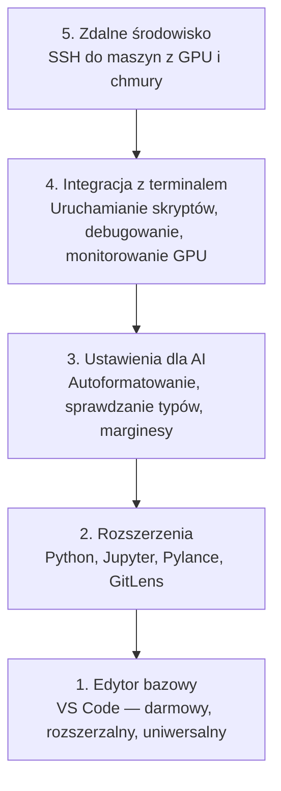

# Konfiguracja edytora

> Twój edytor to Twój drugi pilot. Skonfiguruj go raz, by nie przeszkadzał i zaczął odwalać kawał dobrej roboty.

**Typ:** Środowisko
**Języki:** --
**Wymagania wstępne:** Faza 0, Lekcja 01
**Czas:** ~20 minut

## Cele nauki

- Instalacja VS Code z niezbędnymi rozszerzeniami dla Pythona, Jupytera, lintingu i Remote SSH.
- Konfiguracja formatowania przy zapisie, sprawdzania typów i przewijania wyników z notatników dla zadań związanych z AI.
- Skonfigurowanie Remote SSH, aby edytować i debugować kod na zdalnych serwerach z GPU tak, jakby znajdowały się lokalnie.
- Ocena alternatywnych edytorów (Cursor, Windsurf, Neovim) i ich wad oraz zalet w pracy z AI.

## Problem

Spędzisz tysiące godzin w swoim edytorze, pisząc kod w Pythonie, uruchamiając notatniki Jupyter, debugując pętle treningowe i łącząc się przez SSH z maszynami wyposażonymi w GPU. Źle skonfigurowany edytor to ciągłe problemy w każdej sesji: brak autouzupełniania, brak podpowiedzi typów, brak wskazywania błędów w kodzie (inline), ręczne formatowanie i nieporęczna praca w terminalu.

Właściwa konfiguracja zajmuje tylko 20 minut. Pominięcie tego kroku będzie Cię kosztować 20 minut każdego dnia.

## Koncepcja

Konfiguracja edytora dla inżyniera AI wymaga pięciu elementów:



## Instalacja i konfiguracja

### Krok 1: Zainstaluj VS Code

Zalecanym edytorem jest VS Code. Jest bezpłatny, działa na każdym systemie operacyjnym, ma doskonałą obsługę notatników Jupyter, a jego ekosystem rozszerzeń obejmuje wszystko, czego potrzebujesz do pracy ze sztuczną inteligencją.

Pobierz go z [code.visualstudio.com](https://code.visualstudio.com/).

Sprawdź w terminalu:

```bash
code --version
```

Jeśli polecenie `code` nie zostanie znalezione w systemie macOS, otwórz VS Code, naciśnij `Cmd+Shift+P`, wpisz „Shell Command” i wybierz „Install 'code' command in PATH”.

### Krok 2: Zainstaluj niezbędne rozszerzenia

Otwórz zintegrowany terminal w VS Code (`Ctrl+`` ` lub `` Cmd+` ``) i zainstaluj rozszerzenia kluczowe dla pracy z AI:

```bash
code --install-extension ms-python.python
code --install-extension ms-python.vscode-pylance
code --install-extension ms-toolsai.jupyter
code --install-extension eamodio.gitlens
code --install-extension ms-vscode-remote.remote-ssh
code --install-extension ms-python.debugpy
code --install-extension ms-python.black-formatter
code --install-extension charliermarsh.ruff
```

Do czego służy każde z nich:

| Rozszerzenie | Dlaczego warto |
|----------|-----|
| Python | Obsługa języka, wykrywanie środowisk wirtualnych, uruchamianie/debugowanie |
| Pylance | Szybkie sprawdzanie typów, autouzupełnianie, rozwiązywanie importów |
| Jupyter | Uruchamianie notatników w VS Code, eksplorator zmiennych |
| GitLens | Sprawdzanie autorów zmian, wbudowane narzędzie git blame |
| Remote SSH | Otwieranie folderów na zdalnej maszynie GPU tak, jakby były lokalne |
| Debugpy | Debugowanie krokowe dla języka Python |
| Black Formatter | Automatyczne formatowanie przy zapisie, spójny styl kodu |
| Ruff | Błyskawiczny linting, wyłapywanie typowych błędów |

Plik `code/.vscode/extensions.json` dołączony do tej lekcji zawiera pełną listę rekomendacji. Po otwarciu folderu projektu, VS Code automatycznie zaproponuje ich instalację.

### Krok 3: Skonfiguruj ustawienia

Skopiuj ustawienia z pliku `code/.vscode/settings.json` dołączonego do tej lekcji lub zastosuj je ręcznie, przechodząc do `Settings > Open Settings (JSON)`.

Kluczowe ustawienia dla AI:

```jsonc
{
    "python.analysis.typeCheckingMode": "basic",
    "editor.formatOnSave": true,
    "editor.rulers": [88, 120],
    "notebook.output.scrolling": true,
    "files.autoSave": "afterDelay"
}
```

Dlaczego te ustawienia mają znaczenie:

- **Sprawdzanie typów w trybie podstawowym (basic)**: Wyłapuje nieprawidłowe typy argumentów przed uruchomieniem kodu. Oszczędza czas na debugowaniu niezgodności kształtów tensorów czy błędnych parametrów API.
- **Formatuj przy zapisie**: Nigdy więcej nie myśl o formatowaniu kodu. Narzędzie Black zajmie się tym automatycznie.
- **Marginesy (rulers) na 88 i 120 znaków**: Black domyślnie zawija linie przy 88 znakach. Znacznik na 120 znakach pokazuje, kiedy komentarze i docstringi stają się zbyt długie.
- **Przewijanie wyników notatnika**: Pętle treningowe wypisują tysiące linii logów. Bez włączonego przewijania panel z wynikami staje się nieczytelny.
- **Automatyczny zapis**: Często zapominasz zapisać plik, przez co skrypt treningowy uruchamia nieaktualny kod. Automatyczny zapis eliminuje ten problem.

### Krok 4: Integracja z terminalem

Zintegrowany terminal w VS Code umożliwia uruchamianie skryptów treningowych, monitorowanie GPU i zarządzanie środowiskami z jednego miejsca.

Skonfiguruj go odpowiednio:

```jsonc
{
    "terminal.integrated.defaultProfile.osx": "zsh",
    "terminal.integrated.defaultProfile.linux": "bash",
    "terminal.integrated.fontSize": 13,
    "terminal.integrated.scrollback": 10000
}
```

Przydatne skróty klawiszowe:

| Akcja | macOS | Linux/Windows |
|------------|-------|--------------|
| Przełącz terminal | `` Cmd+` `` | `` Ctrl+` `` |
| Nowy terminal | `` Ctrl+Shift+` `` | `` Ctrl+Shift+` `` |
| Podzielony terminal | `Cmd+\` | `Ctrl+\` |

Podzielone terminale są niezwykle użyteczne: jeden może służyć do uruchamiania skryptu, a drugi do monitorowania użycia GPU za pomocą polecenia `nvidia-smi -l 1` lub `watch -n 1 nvidia-smi`.

### Krok 5: Zdalne środowisko deweloperskie (SSH do maszyn z GPU)

To absolutnie najważniejsze rozszerzenie w pracy ze sztuczną inteligencją. Trening modeli będziesz przeprowadzać na zdalnych maszynach (wirtualnych w chmurze, serwerach laboratoryjnych, usługach jak Lambda czy Vast.ai). Remote SSH pozwala otworzyć zdalny system plików, edytować pliki, używać terminala i debugować kod w taki sam sposób, jakbyś pracował na własnym komputerze.

Konfiguracja:

1. Zainstaluj rozszerzenie Remote SSH (zrobione w Kroku 2).
2. Naciśnij `Ctrl+Shift+P` (lub `Cmd+Shift+P`) i wpisz „Remote-SSH: Connect to Host”.
3. Wpisz `uzytkownik@ip-twojej-maszyny-gpu`.
4. VS Code automatycznie zainstaluje niezbędne komponenty serwerowe na zdalnej maszynie.

Dla wygody i logowania bez hasła skonfiguruj klucze SSH:

```bash
ssh-keygen -t ed25519 -C "twoj-email@example.com"
ssh-copy-id uzytkownik@ip-twojej-maszyny-gpu
```

Możesz też dodać hosta do pliku `~/.ssh/config`:

```
Host gpu-box
    HostName 203.0.113.50
    User ubuntu
    IdentityFile ~/.ssh/id_ed25519
    ForwardAgent yes
```

Teraz opcja `Remote-SSH: Connect to Host > gpu-box` pozwoli Ci połączyć się natychmiast.

## Alternatywy

### Cursor

[Cursor](https://cursor.com) to fork VS Code z wbudowaną i bardzo zaawansowaną integracją sztucznej inteligencji do generowania kodu. Korzysta z tego samego ekosystemu rozszerzeń i formatu ustawień. Jeśli używasz Cursora, wszystko, co opisano w tej lekcji, nadal ma zastosowanie. Możesz zaimportować te same pliki `settings.json` oraz `extensions.json`.

### Windsurf

[Windsurf](https://windsurf.com) to kolejny fork VS Code wyposażony w narzędzia AI. Sytuacja wygląda analogicznie: te same rozszerzenia, format ustawień i obsługa Remote SSH.

### Vim / Neovim

Jeśli już używasz Vima lub Neovima i jesteś w tym produktywny – zostań przy nich. Minimalna konfiguracja do pracy z AI w Pythonie to:

- **pyright** lub **pylsp** do sprawdzania typów (przez Mason lub instalację ręczną)
- **nvim-lspconfig** do integracji z serwerem językowym
- **jupyter-vim** lub **molten-nvim** do obsługi notatników
- **telescope.nvim** do szybkiego wyszukiwania plików i symboli
- **none-ls.nvim** z Black i Ruff do formatowania i lintingu

Jeśli jednak do tej pory nie używałeś Vima, nie zaczynaj teraz. Stroma krzywa uczenia się tego edytora będzie konkurować z czasem potrzebnym na naukę inżynierii AI. Zostań przy VS Code.

## W praktyce

Dzięki tej konfiguracji Twój codzienny przepływ pracy wygląda następująco:

1. Otwierasz folder projektu w VS Code (lub łączysz się przez Remote SSH z serwerem GPU).
2. Piszesz kod w Pythonie, korzystając z autouzupełniania, podpowiedzi typów i podświetlania błędów.
3. Uruchamiasz notatniki Jupyter bezpośrednio w edytorze.
4. Używasz zintegrowanego terminala do uruchamiania skryptów treningowych, instalacji pakietów (`uv pip install`) i monitorowania GPU.
5. Przed zatwierdzeniem zmian w repozytorium przeglądasz je za pomocą GitLens.

## Ćwiczenia

1. Zainstaluj VS Code i wszystkie rozszerzenia wymienione w Kroku 2.
2. Skopiuj ustawienia z pliku `settings.json` do swojej konfiguracji VS Code.
3. Otwórz dowolny plik w języku Python i sprawdź, czy Pylance wyświetla podpowiedzi typów, a Black automatycznie formatuje kod przy zapisie.
4. Jeśli masz dostęp do zdalnej maszyny, skonfiguruj połączenie Remote SSH i otwórz na niej folder roboczy.

## Kluczowe terminy

| Termin | Potoczne określenie | Co to faktycznie oznacza |
|------|----------------|----------------------|
| LSP | „Silnik autouzupełniania” | Language Server Protocol: standard, który pozwala edytorom na pobieranie informacji o typach, podpowiedziach i błędach z zewnętrznego serwera dedykowanego danemu językowi. |
| Pylance | „Wtyczka do Pythona” | Stworzony przez Microsoft serwer językowy dla Pythona, używający pod spodem Pyright do sprawdzania typów i obsługi IntelliSense. |
| Remote SSH | „Praca na serwerze” | Rozszerzenie VS Code, które uruchamia lekki serwer na zdalnej maszynie i przesyła interfejs użytkownika bezpośrednio do Twojego lokalnego edytora. |
| Formatuj przy zapisie | „Auto-formatter” | Funkcja edytora, która uruchamia narzędzie formatujące (np. Black, Ruff) przy każdym zapisie pliku, dzięki czemu styl kodu pozostaje zawsze spójny. |
