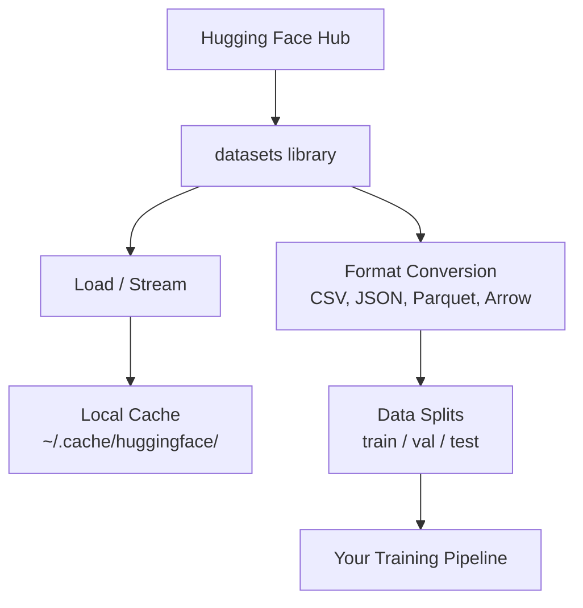

# Zarządzanie danymi

> Dane są paliwem. To, jak nimi zarządzasz, decyduje o tym, jak szybko będziesz się poruszać.

**Typ:** Build
**Język:** Python
**Wymagania wstępne:** Faza 0, Lekcja 01
**Czas:** ~45 minut

## Cele nauki

- Wczytywanie, streamowanie i cache'owanie zbiorów danych za pomocą biblioteki `datasets` Hugging Face
- Konwersja między formatami CSV, JSON, Parquet i Arrow oraz omówienie ich kompromisów
- Tworzenie powtarzalnych podziałów train/validation/test z ustalonymi ziarnami losowości (random seeds)
- Zarządzanie dużymi plikami modeli i zbiorów danych za pomocą `.gitignore`, Git LFS lub DVC

## Problem

Każdy projekt AI zaczyna się od danych. Musisz znaleźć zbiory danych, pobrać je, przekonwertować między formatami, podzielić na potrzeby treningu i ewaluacji oraz wersjonować je tak, aby eksperymenty były powtarzalne. Robienie tego ręcznie za każdym razem jest powolne i podatne na błędy. Potrzebujesz powtarzalnego workflow.

## Koncepcja



Biblioteka `datasets` Hugging Face to standardowy sposób wczytywania danych do pracy z AI. Domyślnie obsługuje pobieranie, cache'owanie, konwersję formatów i streaming.

## Zbuduj to

### Krok 1: Zainstaluj bibliotekę datasets

```bash
pip install datasets huggingface_hub
```

### Krok 2: Wczytaj zbiór danych

```python
from datasets import load_dataset

dataset = load_dataset("imdb")
print(dataset)
print(dataset["train"][0])
```

To pobiera zbiór recenzji filmowych IMDB. Po pierwszym pobraniu dane są wczytywane z cache'a w `~/.cache/huggingface/datasets/`.

### Krok 3: Streamuj duże zbiory danych

Niektóre zbiory danych są zbyt duże, aby zmieścić się na dysku. Streaming wczytuje je wiersz po wierszu bez pobierania całości.

```python
dataset = load_dataset("wikimedia/wikipedia", "20220301.en", split="train", streaming=True)

for i, example in enumerate(dataset):
    print(example["title"])
    if i >= 4:
        break
```

Streaming zwraca obiekt `IterableDataset`. Przetwarzasz wiersze w miarę ich napływania. Zużycie pamięci pozostaje stałe niezależnie od rozmiaru zbioru danych.

### Krok 4: Formaty zbiorów danych

Biblioteka `datasets` pod spodem wykorzystuje Apache Arrow. Możesz konwertować do innych formatów w zależności od potrzeb swojego pipeline'u.

```python
dataset = load_dataset("imdb", split="train")

dataset.to_csv("imdb_train.csv")
dataset.to_json("imdb_train.json")
dataset.to_parquet("imdb_train.parquet")
```

Porównanie formatów:

| Format | Rozmiar | Szybkość odczytu | Najlepszy do |
|--------|------|-----------|----------|
| CSV | Duży | Wolna | Czytelność dla człowieka, arkusze kalkulacyjne |
| JSON | Duży | Wolna | API, dane zagnieżdżone |
| Parquet | Mały | Szybka | Analityka, zapytania kolumnowe |
| Arrow | Mały | Najszybsza | Przetwarzanie w pamięci (to, czego `datasets` używa wewnętrznie) |

W pracy z AI Parquet jest najlepszym formatem do przechowywania danych. Arrow to format, na którym pracujesz w pamięci. CSV i JSON służą do wymiany danych.

### Krok 5: Podziały danych

Każdy projekt ML potrzebuje trzech podziałów:

- **Train**: na tym model się uczy (zazwyczaj 80%)
- **Validation**: sprawdzasz na tym postępy podczas treningu (zazwyczaj 10%)
- **Test**: ostateczna ewaluacja po zakończeniu treningu (zazwyczaj 10%)

Niektóre zbiory danych są już wstępnie podzielone. Gdy nie są, podziel je samodzielnie:

```python
dataset = load_dataset("imdb", split="train")

split = dataset.train_test_split(test_size=0.2, seed=42)
train_val = split["train"].train_test_split(test_size=0.125, seed=42)

train_ds = train_val["train"]
val_ds = train_val["test"]
test_ds = split["test"]

print(f"Train: {len(train_ds)}, Val: {len(val_ds)}, Test: {len(test_ds)}")
```

Zawsze ustawiaj ziarno losowości (seed) dla powtarzalności. To samo ziarno za każdym razem daje ten sam podział.

### Krok 6: Pobieranie i cache'owanie modeli

Modele to duże pliki. Biblioteka `huggingface_hub` zajmuje się ich pobieraniem i cache'owaniem.

```python
from huggingface_hub import hf_hub_download, snapshot_download

model_path = hf_hub_download(
    repo_id="sentence-transformers/all-MiniLM-L6-v2",
    filename="config.json"
)
print(f"Cached at: {model_path}")

model_dir = snapshot_download("sentence-transformers/all-MiniLM-L6-v2")
print(f"Full model at: {model_dir}")
```

Modele są cache'owane w `~/.cache/huggingface/hub/`. Po pobraniu wczytują się natychmiast przy kolejnych uruchomieniach.

### Krok 7: Obsługa dużych plików

Wagi modeli i duże zbiory danych nie powinny trafiać do gita. Trzy opcje:

**Opcja A: .gitignore (najprostsza)**

```
*.bin
*.safetensors
*.pt
*.onnx
data/*.parquet
data/*.csv
models/
```

**Opcja B: Git LFS (śledzenie dużych plików w git)**

```bash
git lfs install
git lfs track "*.bin"
git lfs track "*.safetensors"
git add .gitattributes
```

Git LFS przechowuje w repozytorium wskaźniki (pointers), a same pliki na osobnym serwerze. GitHub daje 1 GB za darmo.

**Opcja C: DVC (data version control)**

```bash
pip install dvc
dvc init
dvc add data/training_set.parquet
git add data/training_set.parquet.dvc data/.gitignore
git commit -m "Track training data with DVC"
```

DVC tworzy małe pliki `.dvc`, które wskazują na Twoje dane. Same dane znajdują się w S3, GCS lub innym zdalnym backendzie pamięci masowej.

| Podejście | Złożoność | Najlepsze dla |
|----------|-----------|----------|
| .gitignore | Niska | Projekty osobiste, pobrane dane, które można ponownie pobrać |
| Git LFS | Średnia | Zespoły dzielące się wagami modeli przez git |
| DVC | Wysoka | Powtarzalne eksperymenty, duże zbiory danych, zespoły |

Na potrzeby tego kursu `.gitignore` wystarczy. Używaj DVC, gdy potrzebujesz odtwarzać dokładnie te same eksperymenty na różnych maszynach.

### Krok 8: Wzorce przechowywania danych

**Pamięć lokalna** sprawdza się dla zbiorów danych poniżej ~10 GB. Cache HF obsługuje to automatycznie.

**Pamięć w chmurze** jest przeznaczona dla wszystkiego, co większe lub współdzielone między maszynami:

```python
import os

local_path = os.path.expanduser("~/.cache/huggingface/datasets/")

# s3_path = "s3://my-bucket/datasets/"
# gcs_path = "gs://my-bucket/datasets/"
```

DVC integruje się bezpośrednio z S3 i GCS:

```bash
dvc remote add -d myremote s3://my-bucket/dvc-store
dvc push
```

Na potrzeby tego kursu pamięć lokalna jest wystarczająca. Pamięć w chmurze staje się istotna, gdy fine-tunujesz modele na zdalnych instancjach GPU.

## Zbiory danych używane w tym kursie

| Zbiór danych | Lekcje | Rozmiar | Czego uczy |
|---------|---------|------|----------------|
| IMDB | Tokenizacja, klasyfikacja | 84 MB | Podstawy klasyfikacji tekstu |
| WikiText | Modelowanie języka | 181 MB | Przewidywanie kolejnego tokenu |
| SQuAD | Systemy QA | 35 MB | Odpowiadanie na pytania, spany |
| Common Crawl (podzbiór) | Embeddingi | Zmienny | Przetwarzanie tekstu na dużą skalę |
| MNIST | Podstawy wizji | 21 MB | Podstawy klasyfikacji obrazów |
| COCO (podzbiór) | Multimodalność | Zmienny | Pary obraz-tekst |

Nie musisz teraz pobierać wszystkich tych zbiorów. Każda lekcja określa, czego potrzebuje.

## Użyj tego

Uruchom skrypt narzędziowy, aby sprawdzić, czy wszystko działa:

```bash
python code/data_utils.py
```

Skrypt pobiera mały zbiór danych, konwertuje go, dzieli i wypisuje podsumowanie.

## Dostarcz to

Ta lekcja tworzy:
- `code/data_utils.py` - wielokrotnego użytku narzędzie do wczytywania i cache'owania danych
- `outputs/prompt-data-helper.md` - prompt do znajdowania odpowiedniego zbioru danych dla danego zadania

## Ćwiczenia

1. Wczytaj zbiór danych `glue` z konfiguracją `mrpc` i zbadaj pierwsze 5 przykładów
2. Streamuj zbiór danych `c4` i policz, ile przykładów jesteś w stanie przetworzyć w 10 sekund
3. Przekonwertuj zbiór danych do formatu Parquet i porównaj rozmiar pliku z CSV
4. Stwórz podział train/val/test 70/15/15 z ustalonym ziarnem losowości i zweryfikuj rozmiary

## Kluczowe pojęcia

| Pojęcie | Co mówią ludzie | Co to faktycznie oznacza |
|------|----------------|----------------------|
| Dataset split | "Dane treningowe" | Nazwany podzbiór (train/val/test) używany na różnych etapach cyklu życia ML |
| Streaming | "Wczytaj to leniwie" | Przetwarzanie danych wiersz po wierszu ze zdalnego źródła bez pobierania całego zbioru danych |
| Parquet | "Skompresowany CSV" | Kolumnowy format pliku zoptymalizowany pod kątem zapytań analitycznych i efektywności przechowywania |
| Arrow | "Szybki dataframe" | Kolumnowy format w pamięci, używany wewnętrznie przez bibliotekę datasets do odczytów bez kopiowania (zero-copy) |
| Git LFS | "Git dla dużych plików" | Rozszerzenie, które przechowuje duże pliki poza repozytorium git, zachowując wskaźniki w systemie kontroli wersji |
| DVC | "Git dla danych" | System kontroli wersji dla zbiorów danych i modeli, integrujący się z pamięcią w chmurze |
| Cache | "Już pobrane" | Lokalna kopia wcześniej pobranych danych, domyślnie przechowywana w ~/.cache/huggingface/ |
