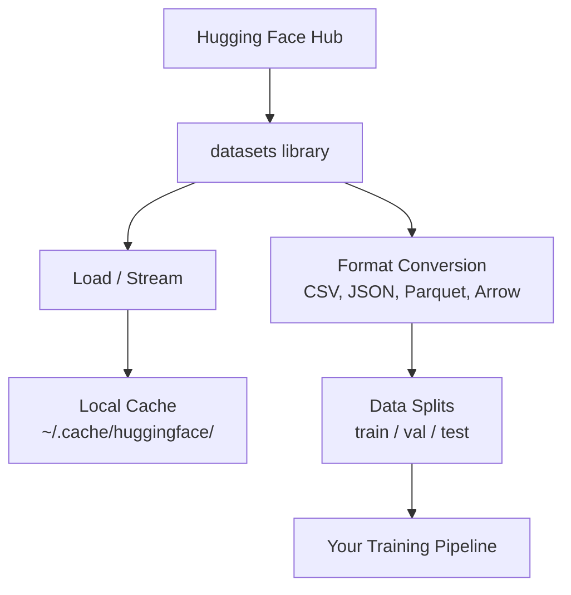

# Zarządzanie danymi

> Dane to paliwo. Sposób, w jaki sobie z tym poradzisz, określa, jak szybko jedziesz.

**Typ:** Kompilacja
**Język:** Python
**Wymagania:** Faza 0, Lekcja 01
**Czas:** ~45 minut

## Cele nauczania

- Ładuj, przesyłaj strumieniowo i buforuj zbiory danych przy użyciu biblioteki Hugging Face `datasets`
- Konwertuj między formatami CSV, JSON, Parquet i Arrow i wyjaśniaj ich kompromisy
- Twórz powtarzalne podziały pociągów/walidacji/testów ze stałymi losowymi nasionami
- Zarządzaj dużymi plikami modeli i zestawów danych za pomocą `.gitignore`, Git LFS lub DVC

## Problem

Każdy projekt AI zaczyna się od danych. Musisz znaleźć zbiory danych, pobrać je, przekonwertować między formatami, podzielić je na potrzeby szkolenia i oceny oraz wersjonować je, aby eksperymenty były powtarzalne. Wykonywanie tej czynności ręcznie za każdym razem jest powolne i podatne na błędy. Potrzebujesz powtarzalnego przepływu pracy.

## Koncepcja



Biblioteka Hugging Face `datasets` to standardowy sposób ładowania danych do pracy ze sztuczną inteligencją. Obsługuje pobieranie, buforowanie, konwersję formatu i przesyłanie strumieniowe od razu po wyjęciu z pudełka.

## Zbuduj to

### Krok 1: Zainstaluj bibliotekę zestawów danych

```bash
pip install datasets huggingface_hub
```

### Krok 2: Załaduj zbiór danych

```python
from datasets import load_dataset

dataset = load_dataset("imdb")
print(dataset)
print(dataset["train"][0])
```

Spowoduje to pobranie zestawu danych recenzji filmów IMDB. Po pierwszym pobraniu ładuje się z pamięci podręcznej pod adresem `~/.cache/huggingface/datasets/`.

### Krok 3: przesyłaj strumieniowo duże zbiory danych

Niektóre zbiory danych są zbyt duże, aby zmieścić się na dysku. Przesyłanie strumieniowe ładuje je wiersz po wierszu bez pobierania całości.

```python
dataset = load_dataset("wikimedia/wikipedia", "20220301.en", split="train", streaming=True)

for i, example in enumerate(dataset):
    print(example["title"])
    if i >= 4:
        break
```

Przesyłanie strumieniowe zapewnia `IterableDataset`. Przetwarzasz wiersze w miarę ich nadejścia. Użycie pamięci pozostaje stałe niezależnie od rozmiaru zestawu danych.

### Krok 4: Formaty zbiorów danych

Biblioteka `datasets` wykorzystuje pod maską Apache Arrow. Możesz konwertować do innych formatów, w zależności od potrzeb Twojego potoku.

```python
dataset = load_dataset("imdb", split="train")

dataset.to_csv("imdb_train.csv")
dataset.to_json("imdb_train.json")
dataset.to_parquet("imdb_train.parquet")
```

Porównanie formatów:

| Formatuj | Rozmiar | Przeczytaj Prędkość | Najlepsze dla |
|------------|------|-----------|--------------|
| CSV | Duży | Powolny | Czytelność dla człowieka, arkusze kalkulacyjne |
| JSON | Duży | Powolny | API, dane zagnieżdżone |
| Parkiet | Mały | Szybki | Analityka, zapytania kolumnowe |
| Strzałka | Mały | Najszybszy | Przetwarzanie w pamięci (czego `datasets` używa wewnętrznie) |

Do pracy ze sztuczną inteligencją najlepszym formatem przechowywania jest parkiet. Strzałka jest tym, z czym pracujesz w pamięci. CSV i JSON służą do wymiany.

### Krok 5: Podział danych

Każdy projekt ML wymaga trzech podziałów:

- **Pociąg**: Model uczy się na tym (zwykle 80%)
- **Walidacja**: Sprawdzasz postępy podczas treningu (zwykle 10%)
- **Test**: Ocena końcowa po zakończeniu szkolenia (zwykle 10%)

Niektóre zbiory danych są wstępnie podzielone. Jeśli tak się nie stanie, podziel je samodzielnie:

```python
dataset = load_dataset("imdb", split="train")

split = dataset.train_test_split(test_size=0.2, seed=42)
train_val = split["train"].train_test_split(test_size=0.125, seed=42)

train_ds = train_val["train"]
val_ds = train_val["test"]
test_ds = split["test"]

print(f"Train: {len(train_ds)}, Val: {len(val_ds)}, Test: {len(test_ds)}")
```

Zawsze ustawiaj materiał siewny pod kątem powtarzalności. To samo ziarno daje za każdym razem taki sam podział.

### Krok 6: Pobierz i przechowuj modele w pamięci podręcznej

Modele to duże pliki. Biblioteka `huggingface_hub` obsługuje pobieranie i buforowanie.

```python
from huggingface_hub import hf_hub_download, snapshot_download

model_path = hf_hub_download(
    repo_id="sentence-transformers/all-MiniLM-L6-v2",
    filename="config.json"
)
print(f"Cached at: {model_path}")

model_dir = snapshot_download("sentence-transformers/all-MiniLM-L6-v2")
print(f"Full model at: {model_dir}")
```

Modele buforują do `~/.cache/huggingface/hub/`. Po pobraniu ładują się natychmiast przy kolejnych uruchomieniach.

### Krok 7: Obsługuj duże pliki

Wagi modeli i duże zbiory danych nie powinny trafiać do gita. Trzy opcje:

**Opcja A: .gitignore (najprostsza)**

```
*.bin
*.safetensors
*.pt
*.onnx
data/*.parquet
data/*.csv
models/
```

**Opcja B: Git LFS (śledzenie dużych plików w git)**

```bash
git lfs install
git lfs track "*.bin"
git lfs track "*.safetensors"
git add .gitattributes
```

Git LFS przechowuje wskaźniki w twoim repozytorium, a rzeczywiste pliki na oddzielnym serwerze. GitHub daje Ci 1 GB za darmo.

**Opcja C: DVC (kontrola wersji danych)**

```bash
pip install dvc
dvc init
dvc add data/training_set.parquet
git add data/training_set.parquet.dvc data/.gitignore
git commit -m "Track training data with DVC"
```

DVC tworzy małe `.dvc` pliki wskazujące Twoje dane. Same dane znajdują się w S3, GCS lub innym zdalnym magazynie.

| Podejście | Złożoność | Najlepsze dla |
|---------|-----------|---------|
| .gitignore | Niski | Projekty osobiste, pobrane dane, które możesz pobrać ponownie |
| Git LFS | Średni | Zespoły udostępniają wagi modeli za pośrednictwem git |
| DVC | Wysoki | Powtarzalne eksperymenty, duże zbiory danych, zespoły |

Do tego kursu wystarczy `.gitignore`. Użyj DVC, jeśli chcesz odtworzyć dokładne eksperymenty na różnych maszynach.

### Krok 8: Wzorce przechowywania

**Pamięć lokalna** działa w przypadku zestawów danych mniejszych niż ~10 GB. Pamięć podręczna HF obsługuje to automatycznie.

**Przechowywanie w chmurze** jest przeznaczone dla wszystkiego, co jest większe lub współdzielone między komputerami:

```python
import os

local_path = os.path.expanduser("~/.cache/huggingface/datasets/")

# s3_path = "s3://my-bucket/datasets/"
# gcs_path = "gs://my-bucket/datasets/"
```

DVC integruje się bezpośrednio z S3 i GCS:

```bash
dvc remote add -d myremote s3://my-bucket/dvc-store
dvc push
```

W przypadku tego kursu wystarczająca jest pamięć lokalna. Przechowywanie w chmurze staje się istotne, gdy dostrajasz zdalne instancje GPU.

## Zbiory danych używane w tym kursie

| Zbiór danych | Lekcje | Rozmiar | Czego uczy |
|--------|---------|------|----------------|
| IMDB | Tokenizacja, klasyfikacja | 84 MB | Podstawy klasyfikacji tekstu |
| Wikitekst | Modelowanie języka | 181 MB | Przewidywanie następnego tokenu |
| SKŁAD | Systemy kontroli jakości | 35 MB | Odpowiedzi na pytania, rozpiętości |
| Wspólne indeksowanie (podzbiór) | Osadzenia | Różnie | Przetwarzanie tekstu na dużą skalę |
| MNIST | Podstawy wizji | 21 MB | Podstawy klasyfikacji obrazów |
| COCO (podzbiór) | Multimodalny | Różnie | Pary obraz-tekst |

Nie musisz teraz pobierać tego wszystkiego. Każda lekcja określa, czego potrzebuje.

## Użyj tego

Uruchom skrypt narzędzia, aby sprawdzić, czy wszystko działa:

```bash
python code/data_utils.py
```

Spowoduje to pobranie małego zestawu danych, jego konwersję, podzielenie i wydrukowanie podsumowania.

## Wyślij to

Ta lekcja daje:
- `code/data_utils.py` – narzędzie do ładowania i buforowania danych wielokrotnego użytku
- `outputs/prompt-data-helper.md` - monit o znalezienie odpowiedniego zbioru danych do zadania

## Ćwiczenia

1. Załaduj zbiór danych `glue` z konfiguracją `mrpc` i sprawdź pierwsze 5 przykładów
2. Przesyłaj strumieniowo zbiór danych `c4` i policz, ile przykładów możesz przetworzyć w 10 sekund
3. Przekonwertuj zbiór danych na Parquet i porównaj rozmiar pliku z CSV
4. Utwórz podział pociągu/wartości/testu 70/15/15 ze stałym materiałem siewnym i sprawdź rozmiary

## Kluczowe terminy

| Termin | Co ludzie mówią | Co to właściwie oznacza |
|------|----------------|----------------------|
| Podział zbioru danych | „Dane treningowe” | Nazwany podzbiór (pociąg/wartość/test) używany na różnych etapach cyklu życia uczenia maszynowego |
| Transmisja | „Ładuj leniwie” | Przetwarzanie danych wiersz po wierszu ze zdalnego źródła bez pobierania pełnego zbioru danych |
| Parkiet | „Skompresowany plik CSV” | Kolumnowy format pliku zoptymalizowany pod kątem zapytań analitycznych i wydajności przechowywania |
| Strzałka | „Szybka ramka danych” | Format kolumnowy znajdujący się w pamięci, używany wewnętrznie przez bibliotekę zbiorów danych do odczytów z kopią zerową |
| Git LFS | „Git dla dużych plików” | Rozszerzenie przechowujące duże pliki poza repozytorium git, zachowując jednocześnie wskaźniki w kontroli wersji |
| DVC | „Git dla danych” | System kontroli wersji zbiorów danych i modeli integrujący się z przechowywaniem w chmurze |
| Pamięć podręczna | „Już pobrane” | Lokalna kopia wcześniej pobranych danych, domyślnie przechowywana w ~/.cache/huggingface/ |