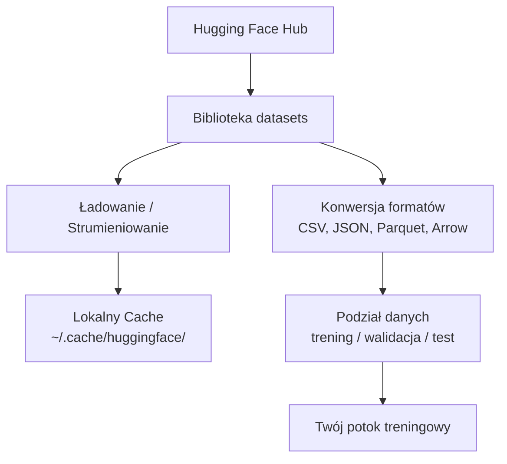

# Zarządzanie danymi

> Dane to paliwo. To, jak nimi zarządzasz, decyduje o tym, jak szybko będziesz posuwać się naprzód.

**Typ:** Środowisko / Budowa
**Język:** Python
**Wymagania wstępne:** Faza 0, Lekcja 01
**Czas:** ~45 minut

## Cele nauki

- Ładowanie, strumieniowanie i buforowanie (cache) zbiorów danych przy użyciu biblioteki Hugging Face `datasets`.
- Konwersja formatów takich jak CSV, JSON, Parquet i Arrow ze zrozumieniem ich wad i zalet.
- Tworzenie powtarzalnych podziałów na zbiór treningowy, walidacyjny i testowy z użyciem stałego ziarna losowości (seed).
- Zarządzanie dużymi plikami modeli i danych za pomocą `.gitignore`, Git LFS lub DVC.

## Problem

Każdy projekt AI zaczyna się od danych. Musisz znaleźć odpowiednie zbiory, pobrać je, przekonwertować na pożądany format, podzielić do celów treningu i ewaluacji oraz wersjonować, aby eksperymenty były powtarzalne. Ręczne wykonywanie tych czynności za każdym razem jest powolne i podatne na błędy. Potrzebujesz powtarzalnego procesu (workflow).

## Koncepcja



Biblioteka Hugging Face `datasets` to standardowy sposób ładowania danych w projektach AI. Natychmiast po wyjęciu z pudełka obsługuje pobieranie, buforowanie, konwersję formatów i strumieniowanie.

## Instalacja i konfiguracja

### Krok 1: Zainstaluj bibliotekę datasets

```bash
pip install datasets huggingface_hub
```

### Krok 2: Załaduj zbiór danych

```python
from datasets import load_dataset

dataset = load_dataset("imdb")
print(dataset)
print(dataset["train"][0])
```

Powyższy kod pobierze zbiór recenzji filmowych IMDB. Po pierwszym pobraniu dane są wczytywane bezpośrednio z lokalnej pamięci podręcznej zlokalizowanej w `~/.cache/huggingface/datasets/`.

### Krok 3: Strumieniowanie dużych zbiorów danych

Niektóre zbiory są zbyt ogromne, by zmieścić się na Twoim dysku. Strumieniowanie (streaming) pozwala na pobieranie i ładowanie ich wiersz po wierszu bez konieczności zapisywania całości lokalnie.

```python
dataset = load_dataset("wikimedia/wikipedia", "20220301.en", split="train", streaming=True)

for i, example in enumerate(dataset):
    print(example["title"])
    if i >= 4:
        break
```

Strumieniowanie zwraca obiekt `IterableDataset`. Przetwarzasz poszczególne wiersze na bieżąco, w miarę ich napływania. Zużycie pamięci operacyjnej pozostaje stałe niezależnie od rozmiaru całkowitego zbioru danych.

### Krok 4: Formaty plików i zbiorów danych

Pod maską biblioteka `datasets` wykorzystuje silnik Apache Arrow. W zależności od potrzeb Twojego potoku (pipeline) możesz swobodnie konwertować dane na inne formaty.

```python
dataset = load_dataset("imdb", split="train")

dataset.to_csv("imdb_train.csv")
dataset.to_json("imdb_train.json")
dataset.to_parquet("imdb_train.parquet")
```

Porównanie formatów:

| Format | Rozmiar | Szybkość odczytu | Najlepsze dla |
|------------|------|-----------|--------------|
| CSV | Duży | Wolna | Czytelność dla człowieka, arkusze kalkulacyjne |
| JSON | Duży | Wolna | Interfejsy API, dane zagnieżdżone |
| Parquet | Mały | Szybka | Analityka, zapytania kolumnowe, przechowywanie |
| Arrow | Mały | Najszybsza | Przetwarzanie w pamięci RAM (tego `datasets` używa wewnętrznie) |

W pracy z AI najlepszym formatem do przechowywania danych na dysku jest Parquet. W pamięci RAM natomiast korzysta się z formatu Arrow. CSV i JSON służą głównie do wymiany informacji z innymi systemami.

### Krok 5: Podział danych

Każdy projekt uczenia maszynowego (ML) wymaga trzech podziałów zbioru:

- **Treningowy (Train)**: Model uczy się na nim (zwykle ok. 80%).
- **Walidacyjny (Validation/Val)**: Sprawdzasz postępy podczas samego treningu, by unikać przetrenowania (zwykle ok. 10%).
- **Testowy (Test)**: Ocena końcowa po całkowitym zakończeniu procesu treningowego (zwykle ok. 10%).

Niektóre zbiory są wstępnie podzielone. Jeśli nie, podziel je samodzielnie:

```python
dataset = load_dataset("imdb", split="train")

split = dataset.train_test_split(test_size=0.2, seed=42)
train_val = split["train"].train_test_split(test_size=0.125, seed=42)

train_ds = train_val["train"]
val_ds = train_val["test"]
test_ds = split["test"]

print(f"Trening: {len(train_ds)}, Walidacja: {len(val_ds)}, Test: {len(test_ds)}")
```

Zawsze ustawiaj ziarno losowości (seed) dla zachowania powtarzalności. To samo ziarno zapewnia za każdym razem dokładnie taki sam podział.

### Krok 6: Pobieranie i buforowanie modeli

Pliki modeli bywają ogromne. Biblioteka `huggingface_hub` obsługuje ich inteligentne pobieranie i buforowanie (cache).

```python
from huggingface_hub import hf_hub_download, snapshot_download

model_path = hf_hub_download(
    repo_id="sentence-transformers/all-MiniLM-L6-v2",
    filename="config.json"
)
print(f"Ścieżka cache: {model_path}")

model_dir = snapshot_download("sentence-transformers/all-MiniLM-L6-v2")
print(f"Pełny katalog z modelem: {model_dir}")
```

Modele są buforowane w folderze `~/.cache/huggingface/hub/`. Raz pobrane, są błyskawicznie wczytywane przy kolejnych uruchomieniach.

### Krok 7: Praca z bardzo dużymi plikami

Wagi modeli i ogromne zbiory danych nigdy nie powinny trafiać bezpośrednio do repozytorium Git. Istnieją trzy główne opcje radzenia sobie z tym:

**Opcja A: .gitignore (najprostsza)**

```
*.bin
*.safetensors
*.pt
*.onnx
data/*.parquet
data/*.csv
models/
```

**Opcja B: Git LFS (śledzenie dużych plików przez Gita)**

```bash
git lfs install
git lfs track "*.bin"
git lfs track "*.safetensors"
git add .gitattributes
```

Git LFS przechowuje w repozytorium jedynie lekkie wskaźniki, a same pliki wrzuca na oddzielny serwer. GitHub oferuje darmowe 1 GB na pliki LFS.

**Opcja C: DVC (Data Version Control - system kontroli wersji dla danych)**

```bash
pip install dvc
dvc init
dvc add data/training_set.parquet
git add data/training_set.parquet.dvc data/.gitignore
git commit -m "Śledzenie zbioru treningowego za pomocą DVC"
```

DVC tworzy w repozytorium małe pliki `.dvc` działające jak wskaźniki do danych właściwych. Główne dane są trzymane zdalnie w S3, Google Cloud Storage (GCS) lub na własnym serwerze.

| Podejście | Złożoność | Kiedy używać |
|---------|-----------|---------|
| .gitignore | Niska | Projekty osobiste, powszechnie dostępne zbiory, które łatwo pobrać ponownie. |
| Git LFS | Średnia | Zespoły udostępniające wagi modeli za pośrednictwem systemu git. |
| DVC | Wysoka | Zapewnienie pełnej odtwarzalności eksperymentów, potężne zbiory danych, współpraca w dużych zespołach. |

Na potrzeby tego kursu w pełni wystarczy odpowiednio skonfigurowany plik `.gitignore`.

### Krok 8: Wzorce przechowywania

**Pamięć lokalna (Local Storage)** świetnie sprawdza się w przypadku zestawów mniejszych niż ~10 GB. Pamięć podręczna Hugging Face ogarnie to w pełni automatycznie.

**Przechowywanie w chmurze (Cloud Storage)** jest niezbędne do pracy z zasobami, które są gigantyczne lub współdzielone między wieloma maszynami obliczeniowymi.

```python
import os

local_path = os.path.expanduser("~/.cache/huggingface/datasets/")

# s3_path = "s3://my-bucket/datasets/"
# gcs_path = "gs://my-bucket/datasets/"
```

Narzędzie DVC można zintegrować bezpośrednio z chmurami AWS (S3) lub GCP:

```bash
dvc remote add -d myremote s3://my-bucket/dvc-store
dvc push
```

Dla kursu lokalne środowisko jest całkowicie wystarczające. Magazyny chmurowe zyskują znaczenie, kiedy zaczniesz precyzyjne dostrajanie (fine-tuning) modeli w oparciu o zdalne instancje GPU.

## Zbiory danych używane w tym kursie

| Zbiór | Lekcje | Rozmiar | Czego uczy |
|--------|---------|------|----------------|
| IMDB | Tokenizacja, klasyfikacja tekstu | 84 MB | Podstawy klasyfikacji |
| Wikitext | Modelowanie języka | 181 MB | Przewidywanie następnego tokenu (next-token prediction) |
| SQuAD | Systemy Q&A | 35 MB | Odpowiadanie na pytania, detekcja przedziałów (spans) |
| Common Crawl | Wektoryzacja (Embeddings) | Różny | Przetwarzanie tekstów na ogromną skalę |
| MNIST | Podstawy Computer Vision | 21 MB | Podstawy klasyfikacji obrazów |
| COCO (podzbiór) | Modele multimodalne | Różny | Praca z parami obraz-tekst |

Nie musisz teraz pobierać żadnego z powyższych. W każdej lekcji będzie jasno określone, jakiego zbioru potrzebujesz.

## W praktyce

Uruchom poniższy skrypt, by zweryfikować czy Twoje środowisko i biblioteki działają prawidłowo:

```bash
python code/data_utils.py
```

Kod ten pobierze niewielki zbiór danych, wykona konwersję formatu, dokona podziału, a na koniec wypisze proste podsumowanie.

## Podsumowanie / Wyniki

Po tej lekcji masz do dyspozycji:
- Skrypt `code/data_utils.py` zawierający przydatne i reużywalne narzędzia do pobierania oraz buforowania danych.
- Plik z promptem `outputs/prompt-data-helper.md` mający pomóc w dobieraniu odpowiedniego zbioru pod konkretne zadanie AI.

## Ćwiczenia

1. Załaduj zbiór danych `glue` wybierając konfigurację `mrpc` i wypisz na ekran pierwsze 5 wpisów (przykładów).
2. Przesyłaj strumieniowo gigantyczny zbiór danych `c4` i policz, ile przykładów wierszy Twój komputer zdoła przetworzyć w równe 10 sekund.
3. Przekonwertuj pobrany mały zbiór danych do formatu Parquet i porównaj jego finalny rozmiar z rozmiarem eksportu do CSV.
4. Wygeneruj podział zbioru na treningowy, walidacyjny i testowy w proporcji 70/15/15 przy użyciu stałego ziarna losowości i wyświetl rozmiar każdej z części.

## Kluczowe terminy

| Termin | Potoczne określenie | Co to faktycznie oznacza |
|------|----------------|----------------------|
| Podział zbioru danych (Data Splits) | „Dane treningowe” | Wyznaczony podzbiór (treningowy, walidacyjny, testowy), wykorzystywany na konkretnym etapie cyklu życia modelu. |
| Strumieniowanie (Streaming) | „Leniwe ładowanie” (Lazy load) | Pobieranie i przetwarzanie wiersz po wierszu bezpośrednio ze zdalnego zasobu zamiast pobierania całego pliku naraz. |
| Parquet | „Skompresowany CSV” | Wydajny, kolumnowy format zapisu danych silnie zoptymalizowany pod kątem systemów analitycznych. |
| Arrow | „Szybki DataFrame” | In-memory format pamięciowy gwarantujący niesamowitą prędkość przetwarzania i kopiowanie bez opóźnień (zero-copy), podstawa biblioteki datasets. |
| Git LFS | „Git dla dużych plików” | Mechanizm śledzenia zmian w potężnych plikach; pozwala zachować w repozytorium tylko wskaźniki, przechowując dane binarne zdalnie. |
| DVC | „Git dla danych” | Zaawansowany system kontroli wersji stworzony specjalnie dla modeli uczenia maszynowego i petabajtów danych, z opcją integracji z chmurą. |
| Cache (pamięć podręczna) | „To już jest pobrane” | Twoja lokalna kopia danych pobranych z Hugging Face, chroniąca Cię przed ponownym użyciem przepustowości (domyślnie w `~/.cache/huggingface/`). |
