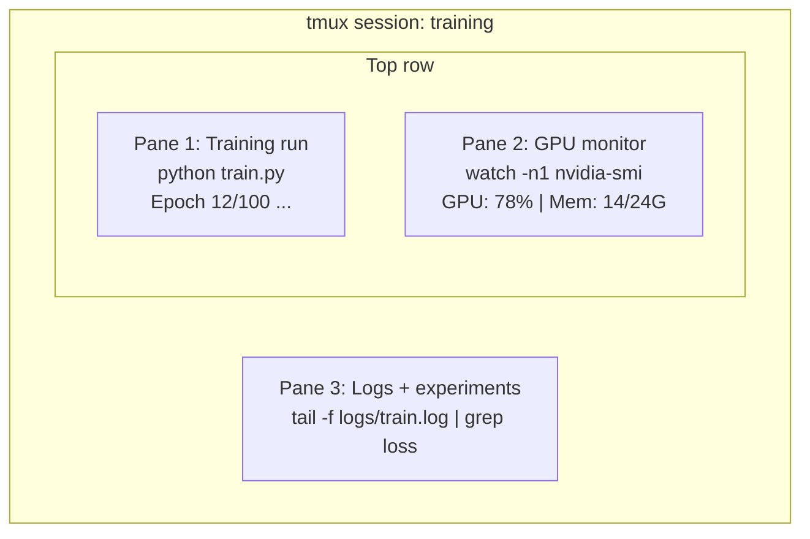

# Terminal i powłoka

> Terminal to miejsce, w którym mieszkają inżynierowie AI. Rozsiądź się tutaj wygodnie.

**Typ:** Ucz się
**Języki:** --
**Wymagania:** Faza 0, Lekcja 01
**Czas:** ~35 minut

## Cele nauczania

- Użyj potoków, przekierowań i `grep` do filtrowania i przetwarzania dzienników szkoleniowych z wiersza poleceń
- Twórz trwałe sesje tmux z wieloma okienkami do jednoczesnego szkolenia i monitorowania procesora graficznego
- Monitoruj zasoby systemu i procesora graficznego za pomocą `htop`, `nvtop` i `nvidia-smi`
- Przesyłaj pliki między maszynami lokalnymi i zdalnymi za pomocą SSH, `scp` i `rsync`

## Problem

W terminalu spędzisz więcej czasu niż w jakimkolwiek edytorze. Przebiegi szkoleniowe, monitorowanie GPU, śledzenie logów, zdalne sesje SSH, zarządzanie środowiskiem. Każdy przepływ pracy AI dotyka powłoki. Jeśli jesteś wolny tutaj, jesteś wolny wszędzie.

W tej lekcji omówione zostaną umiejętności końcowe, które mają znaczenie w pracy ze sztuczną inteligencją. Żadnej historii Uniksa. Żadnego zagłębiania się w skrypty Bash. Tylko to, czego potrzebujesz.

## Koncepcja



Trzy rzeczy działające na raz. Jeden terminal. Możesz odłączyć, wrócić do domu, ponownie podłączyć SSH i podłączyć ponownie. Trening trwa.

## Zbuduj to

### Krok 1: Poznaj swoją powłokę

Sprawdź, z której powłoki korzystasz:

```bash
echo $SHELL
```

Większość systemów używa `bash` lub `zsh`. Obydwa działają dobrze. Polecenia zawarte w tym kursie działają w obu przypadkach.

Najważniejsze rzeczy, które warto wiedzieć:

```bash
# Move around
cd ~/projects/ai-engineering-from-scratch
pwd
ls -la

# History search (most useful shortcut you'll learn)
# Ctrl+R then type part of a previous command
# Press Ctrl+R again to cycle through matches

# Clear terminal
clear   # or Ctrl+L

# Cancel a running command
# Ctrl+C

# Suspend a running command (resume with fg)
# Ctrl+Z
```

### Krok 2: Potokowanie i przekierowania

Potoki łączą ze sobą polecenia. W ten sposób przetwarzasz dzienniki, wyniki filtrowania i narzędzia łańcuchowe. Będziesz z tego korzystał stale.

```bash
# Count how many times "loss" appears in a log
cat train.log | grep "loss" | wc -l

# Extract just the loss values from training output
grep "loss:" train.log | awk '{print $NF}' > losses.txt

# Watch a log file update in real time, filtering for errors
tail -f train.log | grep --line-buffered "ERROR"

# Sort experiments by final accuracy
grep "final_accuracy" results/*.log | sort -t= -k2 -n -r

# Redirect stdout and stderr to separate files
python train.py > output.log 2> errors.log

# Redirect both to the same file
python train.py > train_full.log 2>&1
```

Trzy przekierowania, których potrzebujesz:

| Symbol | Co to robi |
|------------|------------|
| `>` | Zapisz standardowe wyjście do pliku (nadpisz) |
| `>>` | Dołącz standardowe wyjście do pliku |
| `2>` | Zapisz stderr do pliku |
| `2>&1` | Wyślij stderr do tego samego miejsca co stdout |
| `\|` | Wyślij standardowe wyjście jednego polecenia jako standardowe do następnego |

### Krok 3: Procesy w tle

Treningi trwają godzinami. Nie chcesz, aby terminal był cały czas otwarty.

```bash
# Run in background (output still goes to terminal)
python train.py &

# Run in background, immune to hangup (closing terminal won't kill it)
nohup python train.py > train.log 2>&1 &

# Check what's running in background
jobs
ps aux | grep train.py

# Bring a background job to foreground
fg %1

# Kill a background process
kill %1
# or find its PID and kill that
kill $(pgrep -f "train.py")
```

Różnica między `&`, `nohup` i `screen`/`tmux`:

| Metoda | Przetrwa blisko terminalu? | Czy można ponownie podłączyć? |
|------------|------------------------------|-------------|
| `command &` | Nie | Nie |
| `nohup command &` | Tak | Nie (sprawdź plik dziennika) |
| `screen` / `tmux` | Tak | Tak |

Na dłużej niż kilka minut użyj tmux.

### Krok 4: tmux

tmux umożliwia tworzenie trwałych sesji terminalowych z wieloma panelami. Jest to najbardziej przydatne narzędzie do zarządzania przebiegami treningowymi.

```bash
# Install
# macOS
brew install tmux
# Ubuntu
sudo apt install tmux

# Start a named session
tmux new -s training

# Split horizontally
# Ctrl+B then "

# Split vertically
# Ctrl+B then %

# Navigate between panes
# Ctrl+B then arrow keys

# Detach (session keeps running)
# Ctrl+B then d

# Reattach
tmux attach -t training

# List sessions
tmux ls

# Kill a session
tmux kill-session -t training
```

Typowa sesja przepływu pracy AI:

```bash
tmux new -s train

# Pane 1: start training
python train.py --epochs 100 --lr 1e-4

# Ctrl+B, " to split, then run GPU monitor
watch -n1 nvidia-smi

# Ctrl+B, % to split vertically, tail the logs
tail -f logs/experiment.log

# Now detach with Ctrl+B, d
# SSH out, go get coffee, come back
# tmux attach -t train
```

### Krok 5: Monitorowanie za pomocą htop i nvtop

```bash
# System processes (better than top)
htop

# GPU processes (if you have NVIDIA GPU)
# Install: sudo apt install nvtop (Ubuntu) or brew install nvtop (macOS)
nvtop

# Quick GPU check without nvtop
nvidia-smi

# Watch GPU usage update every second
watch -n1 nvidia-smi

# See which processes are using the GPU
nvidia-smi --query-compute-apps=pid,name,used_memory --format=csv
```

`htop` skróty klawiszowe, których będziesz używać:
- `F6` lub `>` do sortowania według kolumn (sortowanie według pamięci w celu znalezienia wycieków pamięci)
- `F5`, aby przełączyć widok drzewa (zobacz procesy potomne)
- `F9`, aby zakończyć proces
- `/`, aby wyszukać nazwę procesu

### Krok 6: SSH dla zdalnych urządzeń GPU

Wynajmując procesor graficzny w chmurze (Lambda, RunPod, Vast.ai), łączysz się przez SSH.

```bash
# Basic connection
ssh user@gpu-box-ip

# With a specific key
ssh -i ~/.ssh/my_gpu_key user@gpu-box-ip

# Copy files to remote
scp model.pt user@gpu-box-ip:~/models/

# Copy files from remote
scp user@gpu-box-ip:~/results/metrics.json ./

# Sync a whole directory (faster for many files)
rsync -avz ./data/ user@gpu-box-ip:~/data/

# Port forward (access remote Jupyter/TensorBoard locally)
ssh -L 8888:localhost:8888 user@gpu-box-ip
# Now open localhost:8888 in your browser

# SSH config for convenience
# Add to ~/.ssh/config:
# Host gpu
#     HostName 192.168.1.100
#     User ubuntu
#     IdentityFile ~/.ssh/gpu_key
#
# Then just:
# ssh gpu
```

### Krok 7: Przydatne aliasy w pracy AI

Dodaj je do swojego `~/.bashrc` lub `~/.zshrc`:

```bash
source phases/00-setup-and-tooling/10-terminal-and-shell/code/shell_aliases.sh
```

Lub skopiuj te, które chcesz. Kluczowe aliasy:

```bash
# GPU status at a glance
alias gpu='nvidia-smi --query-gpu=index,name,utilization.gpu,memory.used,memory.total,temperature.gpu --format=csv,noheader'

# Kill all Python training processes
alias killtraining='pkill -f "python.*train"'

# Quick virtual environment activate
alias ae='source .venv/bin/activate'

# Watch training loss
alias watchloss='tail -f logs/*.log | grep --line-buffered "loss"'
```

Pełen zestaw znajdziesz w `code/shell_aliases.sh`.

### Krok 8: Typowe wzorce terminali AI

W praktyce pojawiają się one wielokrotnie:

```bash
# Run training, log everything, notify when done
python train.py 2>&1 | tee train.log; echo "DONE" | mail -s "Training complete" you@email.com

# Compare two experiment logs side by side
diff <(grep "accuracy" exp1.log) <(grep "accuracy" exp2.log)

# Find the largest model files (clean up disk space)
find . -name "*.pt" -o -name "*.safetensors" | xargs du -h | sort -rh | head -20

# Download a model from Hugging Face
wget https://huggingface.co/model/resolve/main/model.safetensors

# Untar a dataset
tar xzf dataset.tar.gz -C ./data/

# Count lines in all Python files (see how big your project is)
find . -name "*.py" | xargs wc -l | tail -1

# Check disk space (training data fills disks fast)
df -h
du -sh ./data/*

# Environment variable check before training
env | grep -i cuda
env | grep -i torch
```

## Użyj tego

Oto, kiedy każde narzędzie wchodzi w grę podczas tego kursu:

| Narzędzie | Kiedy go użyjesz |
|------|----------------|
| tmux | Każdy bieg treningowy (faza 3+) |
| `tail -f` + `grep` | Monitorowanie dzienników treningowych |
| `nohup` / `&` | Szybkie zadania w tle |
| `htop` / `nvtop` | Debugowanie powolnego szkolenia, błędy OOM |
| SSH + `rsync` | Praca nad procesorami graficznymi w chmurze |
| Rurociągi + przekierowania | Przetwarzanie wyników eksperymentu |
| Aliasy | Oszczędność czasu na powtarzalnych poleceniach |

## Ćwiczenia

1. Zainstaluj tmux, utwórz sesję z trzema panelami i uruchom `htop` w jednym, `watch -n1 date` w drugim i skrypt Pythona w trzecim. Odłącz i podłącz ponownie.
2. Dodaj aliasy z `code/shell_aliases.sh` do konfiguracji powłoki i załaduj ponownie za pomocą `source ~/.zshrc` (lub `~/.bashrc`).
3. Utwórz fałszywy dziennik treningowy za pomocą `for i in $(seq 1 100); do echo "epoch $i loss: $(echo "scale=4; 1/$i" | bc)"; sleep 0.1; done > fake_train.log`, a następnie użyj `grep`, `tail` i `awk`, aby wyodrębnić tylko wartości strat.
4. Skonfiguruj wpis konfiguracyjny SSH dla serwera, do którego masz dostęp (lub użyj `localhost`, aby przećwiczyć składnię).

## Kluczowe terminy

| Termin | Co ludzie mówią | Co to właściwie oznacza |
|------|----------------|----------------------|
| Powłoka | „Terminal” | Program interpretujący Twoje polecenia (bash, zsh, fish) |
| tmux | „Multiplekser terminali” | Program, który umożliwia uruchamianie wielu sesji terminalowych w jednym oknie i odłączanie/ponowne podłączanie |
| Rura | „Sprawa w barze” | Operator `\|`, który wysyła dane wyjściowe jednego polecenia jako dane wejściowe do innego |
| PID | „Identyfikator procesu” | Unikalny numer przypisany do każdego działającego procesu, używany do jego monitorowania lub zakończenia |
| nieee | „Brak rozłączania się” | Uruchamia polecenie odporne na sygnał rozłączenia, więc zamknięcie terminala go nie zabije |
| SSH | „Łączenie z serwerem” | Secure Shell, szyfrowany protokół do uruchamiania poleceń na zdalnym komputerze |