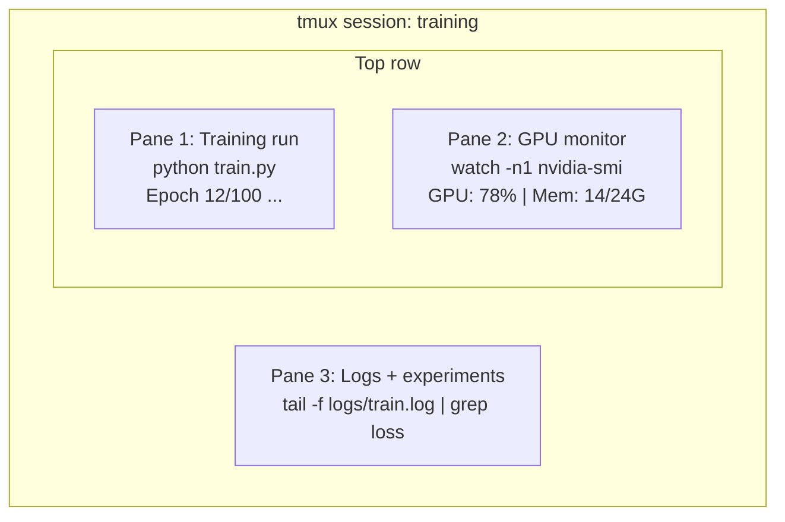

# Terminal i Shell

> Terminal to miejsce, w którym żyją inżynierowie AI. Poczuj się tu komfortowo.

**Typ:** Nauka
**Języki:** --
**Wymagania wstępne:** Faza 0, Lekcja 01
**Czas:** ~35 minut

## Cele nauki

- Użycie pipingu, przekierowań i `grep` do filtrowania i przetwarzania logów treningowych z poziomu wiersza poleceń
- Tworzenie trwałych sesji tmux z wieloma panelami do równoległego treningu i monitorowania GPU
- Monitorowanie zasobów systemu i GPU za pomocą `htop`, `nvtop` i `nvidia-smi`
- Przesyłanie plików między maszyną lokalną a zdalną za pomocą SSH, `scp` i `rsync`

## Problem

W terminalu spędzisz więcej czasu niż w jakimkolwiek edytorze. Treningi, monitorowanie GPU, śledzenie logów, zdalne sesje SSH, zarządzanie środowiskiem. Każdy workflow związany z AI dotyka shella. Jeśli jesteś tu wolny, jesteś wolny wszędzie.

Ta lekcja obejmuje umiejętności terminalowe, które mają znaczenie w pracy z AI. Bez historii Uniksa. Bez głębokiego nurkowania w skryptowanie Bash. Tylko to, czego potrzebujesz.

## Koncepcja



Trzy rzeczy działające naraz. Jeden terminal. Możesz się odłączyć (detach), wyjść do domu, połączyć się ponownie przez SSH i przyłączyć z powrotem (reattach). Trening dalej działa.

## Zbuduj to

### Krok 1: Poznaj swój shell

Sprawdź, jakiego shella używasz:

```bash
echo $SHELL
```

Większość systemów używa `bash` lub `zsh`. Oba działają dobrze. Polecenia w tym kursie działają w obu.

Kluczowe rzeczy do zapamiętania:

```bash
# Poruszanie się
cd ~/projects/ai-engineering-from-scratch
pwd
ls -la

# Wyszukiwanie w historii (najbardziej przydatny skrót, jakiego się nauczysz)
# Ctrl+R, a następnie wpisz fragment wcześniejszego polecenia
# Naciśnij Ctrl+R ponownie, aby przechodzić między dopasowaniami

# Czyszczenie terminala
clear   # lub Ctrl+L

# Anulowanie działającego polecenia
# Ctrl+C

# Zawieszenie działającego polecenia (wznowienie poleceniem fg)
# Ctrl+Z
```

### Krok 2: Piping i przekierowania

Piping łączy polecenia ze sobą. W ten sposób przetwarza się logi, filtruje wyjście i łączy narzędzia w łańcuchy. Będziesz tego używać nieustannie.

```bash
# Policz, ile razy "loss" pojawia się w logu
cat train.log | grep "loss" | wc -l

# Wyciągnij same wartości loss z wyjścia treningu
grep "loss:" train.log | awk '{print $NF}' > losses.txt

# Obserwuj plik logu w czasie rzeczywistym, filtrując błędy
tail -f train.log | grep --line-buffered "ERROR"

# Posortuj eksperymenty według końcowej dokładności
grep "final_accuracy" results/*.log | sort -t= -k2 -n -r

# Przekieruj stdout i stderr do osobnych plików
python train.py > output.log 2> errors.log

# Przekieruj oba do tego samego pliku
python train.py > train_full.log 2>&1
```

Trzy przekierowania, których potrzebujesz:

| Symbol | Co robi |
|--------|-------------|
| `>` | Zapisuje stdout do pliku (nadpisuje) |
| `>>` | Dopisuje stdout do pliku |
| `2>` | Zapisuje stderr do pliku |
| `2>&1` | Wysyła stderr w to samo miejsce co stdout |
| `\|` | Przekazuje stdout jednego polecenia jako stdin do następnego |

### Krok 3: Procesy w tle

Treningi trwają godzinami. Nie chcesz trzymać terminala otwartego przez cały ten czas.

```bash
# Uruchom w tle (wyjście nadal trafia do terminala)
python train.py &

# Uruchom w tle, odporne na rozłączenie (zamknięcie terminala go nie zabije)
nohup python train.py > train.log 2>&1 &

# Sprawdź, co działa w tle
jobs
ps aux | grep train.py

# Przenieś zadanie z tła na pierwszy plan
fg %1

# Zabij proces działający w tle
kill %1
# albo znajdź jego PID i zabij ten
kill $(pgrep -f "train.py")
```

Różnica między `&`, `nohup` i `screen`/`tmux`:

| Metoda | Przetrwa zamknięcie terminala? | Można się przyłączyć ponownie? |
|--------|-------------------------|---------------|
| `command &` | Nie | Nie |
| `nohup command &` | Tak | Nie (sprawdź plik logu) |
| `screen` / `tmux` | Tak | Tak |

Do wszystkiego, co trwa dłużej niż kilka minut, używaj tmux.

### Krok 4: tmux

tmux pozwala tworzyć trwałe sesje terminala z wieloma panelami. To pojedyncze najbardziej przydatne narzędzie do zarządzania treningami.

```bash
# Instalacja
# macOS
brew install tmux
# Ubuntu
sudo apt install tmux

# Uruchom nazwaną sesję
tmux new -s training

# Podziel poziomo
# Ctrl+B, a potem "

# Podziel pionowo
# Ctrl+B, a potem %

# Nawigacja między panelami
# Ctrl+B, a potem klawisze strzałek

# Odłącz (sesja nadal działa)
# Ctrl+B, a potem d

# Przyłącz ponownie
tmux attach -t training

# Lista sesji
tmux ls

# Zakończ sesję
tmux kill-session -t training
```

Typowa sesja workflow AI:

```bash
tmux new -s train

# Panel 1: uruchom trening
python train.py --epochs 100 --lr 1e-4

# Ctrl+B, " aby podzielić, następnie uruchom monitor GPU
watch -n1 nvidia-smi

# Ctrl+B, % aby podzielić pionowo, śledź logi
tail -f logs/experiment.log

# Teraz odłącz się Ctrl+B, d
# Wyloguj się przez SSH, idź na kawę, wróć
# tmux attach -t train
```

### Krok 5: Monitorowanie za pomocą htop i nvtop

```bash
# Procesy systemowe (lepsze niż top)
htop

# Procesy GPU (jeśli masz GPU NVIDIA)
# Instalacja: sudo apt install nvtop (Ubuntu) lub brew install nvtop (macOS)
nvtop

# Szybkie sprawdzenie GPU bez nvtop
nvidia-smi

# Obserwuj wykorzystanie GPU aktualizowane co sekundę
watch -n1 nvidia-smi

# Zobacz, które procesy korzystają z GPU
nvidia-smi --query-compute-apps=pid,name,used_memory --format=csv
```

Skróty klawiszowe `htop`, których będziesz używać:
- `F6` lub `>`, aby sortować według kolumny (sortuj według pamięci, by znaleźć wycieki pamięci)
- `F5`, aby przełączyć widok drzewa (zobacz procesy potomne)
- `F9`, aby zabić proces
- `/`, aby wyszukać nazwę procesu

### Krok 6: SSH dla zdalnych maszyn z GPU

Gdy wynajmujesz GPU w chmurze (Lambda, RunPod, Vast.ai), łączysz się przez SSH.

```bash
# Podstawowe połączenie
ssh user@gpu-box-ip

# Z konkretnym kluczem
ssh -i ~/.ssh/my_gpu_key user@gpu-box-ip

# Skopiuj pliki na zdalną maszynę
scp model.pt user@gpu-box-ip:~/models/

# Skopiuj pliki ze zdalnej maszyny
scp user@gpu-box-ip:~/results/metrics.json ./

# Synchronizuj cały katalog (szybsze przy wielu plikach)
rsync -avz ./data/ user@gpu-box-ip:~/data/

# Przekierowanie portu (dostęp do zdalnego Jupyter/TensorBoard lokalnie)
ssh -L 8888:localhost:8888 user@gpu-box-ip
# Teraz otwórz localhost:8888 w przeglądarce

# Konfiguracja SSH dla wygody
# Dodaj do ~/.ssh/config:
# Host gpu
#     HostName 192.168.1.100
#     User ubuntu
#     IdentityFile ~/.ssh/gpu_key
#
# Następnie po prostu:
# ssh gpu
```

### Krok 7: Przydatne aliasy do pracy z AI

Dodaj je do swojego `~/.bashrc` lub `~/.zshrc`:

```bash
source phases/00-setup-and-tooling/10-terminal-and-shell/code/shell_aliases.sh
```

Albo skopiuj te, które chcesz. Kluczowe aliasy:

```bash
# Status GPU na pierwszy rzut oka
alias gpu='nvidia-smi --query-gpu=index,name,utilization.gpu,memory.used,memory.total,temperature.gpu --format=csv,noheader'

# Zabij wszystkie procesy treningowe Pythona
alias killtraining='pkill -f "python.*train"'

# Szybka aktywacja środowiska wirtualnego
alias ae='source .venv/bin/activate'

# Obserwuj loss treningu
alias watchloss='tail -f logs/*.log | grep --line-buffered "loss"'
```

Pełny zestaw znajdziesz w `code/shell_aliases.sh`.

### Krok 8: Typowe wzorce terminalowe w AI

Pojawiają się wielokrotnie w praktyce:

```bash
# Uruchom trening, zaloguj wszystko, powiadom po zakończeniu
python train.py 2>&1 | tee train.log; echo "DONE" | mail -s "Training complete" you@email.com

# Porównaj dwa logi eksperymentów obok siebie
diff <(grep "accuracy" exp1.log) <(grep "accuracy" exp2.log)

# Znajdź największe pliki modeli (zwolnij miejsce na dysku)
find . -name "*.pt" -o -name "*.safetensors" | xargs du -h | sort -rh | head -20

# Pobierz model z Hugging Face
wget https://huggingface.co/model/resolve/main/model.safetensors

# Rozpakuj dataset
tar xzf dataset.tar.gz -C ./data/

# Policz linie we wszystkich plikach Python (zobacz, jak duży jest projekt)
find . -name "*.py" | xargs wc -l | tail -1

# Sprawdź miejsce na dysku (dane treningowe szybko zapełniają dyski)
df -h
du -sh ./data/*

# Sprawdzenie zmiennych środowiskowych przed treningiem
env | grep -i cuda
env | grep -i torch
```

## Zastosowanie

Oto, kiedy każde narzędzie wchodzi w grę podczas tego kursu:

| Narzędzie | Kiedy go używasz |
|------|----------------|
| tmux | Każdy trening (Fazy 3+) |
| `tail -f` + `grep` | Monitorowanie logów treningowych |
| `nohup` / `&` | Szybkie zadania w tle |
| `htop` / `nvtop` | Diagnozowanie wolnego treningu, błędów OOM |
| SSH + `rsync` | Praca na GPU w chmurze |
| Piping i przekierowania | Przetwarzanie wyników eksperymentów |
| Aliasy | Oszczędność czasu przy powtarzalnych poleceniach |

## Ćwiczenia

1. Zainstaluj tmux, utwórz sesję z trzema panelami i uruchom `htop` w jednym, `watch -n1 date` w drugim oraz skrypt Pythona w trzecim. Odłącz się i przyłącz ponownie.
2. Dodaj aliasy z `code/shell_aliases.sh` do konfiguracji swojego shella i przeładuj ją poleceniem `source ~/.zshrc` (lub `~/.bashrc`).
3. Stwórz fałszywy log treningowy poleceniem `for i in $(seq 1 100); do echo "epoch $i loss: $(echo "scale=4; 1/$i" | bc)"; sleep 0.1; done > fake_train.log`, a następnie użyj `grep`, `tail` i `awk`, aby wyciągnąć same wartości loss.
4. Skonfiguruj wpis SSH dla serwera, do którego masz dostęp (lub użyj `localhost`, aby przećwiczyć składnię).

## Kluczowe pojęcia

| Pojęcie | Co mówią ludzie | Co to naprawdę oznacza |
|------|----------------|----------------------|
| Shell | "Terminal" | Program interpretujący twoje polecenia (bash, zsh, fish) |
| tmux | "Terminal multiplexer" | Program, który pozwala uruchamiać wiele sesji terminala w jednym oknie oraz odłączać/przyłączać je |
| Pipe | "Ten kreseczka" | Operator `\|`, który wysyła wyjście jednego polecenia jako wejście do drugiego |
| PID | "Process ID" | Unikalny numer przypisany każdemu działającemu procesowi, używany do jego monitorowania lub zabicia |
| nohup | "No hangup" | Uruchamia polecenie odporne na sygnał rozłączenia, więc zamknięcie terminala go nie zabije |
| SSH | "Łączenie się z serwerem" | Secure Shell, szyfrowany protokół do uruchamiania poleceń na zdalnej maszynie |
