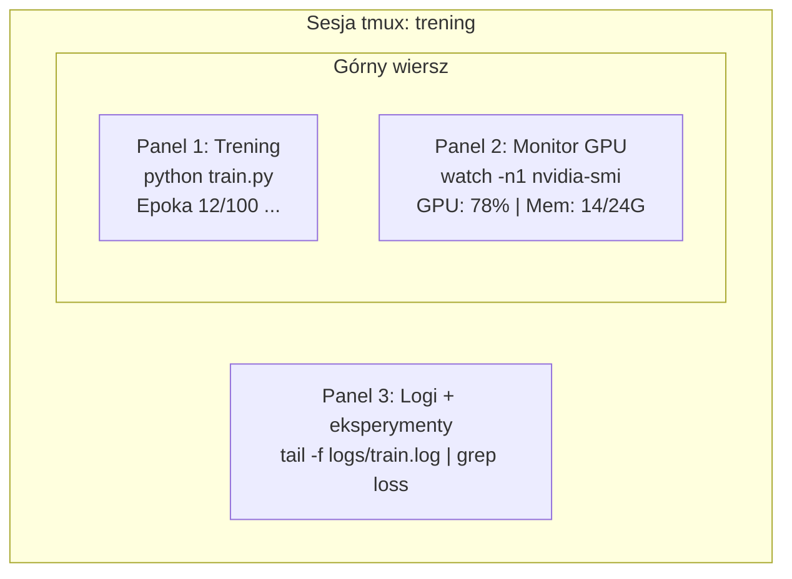

# Terminal i powłoka

> Terminal to naturalne środowisko każdego inżyniera AI. Rozsiądź się tu wygodnie.

**Typ:** Nauka
**Języki:** --
**Wymagania wstępne:** Faza 0, Lekcja 01
**Czas:** ~35 minut

## Cele nauki

- Wykorzystywanie potoków (pipes), przekierowań i polecenia `grep` do filtrowania i analizy logów treningowych prosto z wiersza poleceń.
- Tworzenie trwałych sesji `tmux` z wieloma panelami do równoczesnego uruchamiania treningów i monitorowania GPU.
- Monitorowanie zasobów systemowych i kart graficznych za pomocą narzędzi `htop`, `nvtop` oraz `nvidia-smi`.
- Sprawne przesyłanie plików między środowiskiem lokalnym a zdalnymi serwerami przy użyciu SSH, `scp` oraz `rsync`.

## Problem

W terminalu spędzisz znacznie więcej czasu niż w jakimkolwiek edytorze kodu. Uruchamianie treningów, monitorowanie użycia GPU, śledzenie logów (tailing), sesje zdalne przez SSH, zarządzanie środowiskiem – absolutnie każdy element pracy ze sztuczną inteligencją ma punkt styku z powłoką (shellem). Jeśli jesteś tu powolny, będziesz powolny wszędzie.

W tej lekcji skupiamy się wyłącznie na tych umiejętnościach terminalowych, które mają faktyczne znaczenie w inżynierii AI. Żadnej historii systemów Unix. Żadnego głębokiego zanurzania się w skrypty bashowe. Tylko to, co jest Ci realnie potrzebne.

## Koncepcja



Trzy rzeczy dziejące się na raz. Jeden terminal. Możesz odłączyć sesję (detach), zamknąć komputer, wrócić do domu, połączyć się ponownie przez SSH, podłączyć do sesji (attach), a trening wciąż trwa.

## Praktyka i konfiguracja

### Krok 1: Poznaj swoją powłokę

Sprawdź, z jakiej powłoki aktualnie korzystasz:

```bash
echo $SHELL
```

Większość systemów domyślnie korzysta z `bash` lub `zsh`. Obie są świetne. Wszystkie polecenia w tym kursie zadziałają w obydwu z nich.

Najważniejsze rzeczy na początek:

```bash
# Nawigacja i poruszanie się po systemie
cd ~/projects/ai-engineering-from-scratch
pwd
ls -la

# Przeszukiwanie historii (najbardziej użyteczny skrót, jaki poznasz)
# Wciśnij Ctrl+R, a następnie zacznij wpisywać fragment poprzedniego polecenia
# Wciskaj Ctrl+R wielokrotnie, by przełączać się między pasującymi wynikami

# Czyszczenie ekranu terminala
clear   # lub skrót Ctrl+L

# Anulowanie (ubijanie) uruchomionego polecenia
# Ctrl+C

# Wstrzymanie uruchomionego polecenia (wznów wpisując: fg)
# Ctrl+Z
```

### Krok 2: Potoki (Pipes) i przekierowania

Potoki łączą ze sobą kilka poleceń, przekazując wyniki jednego jako dane wejściowe dla drugiego. Dzięki temu możesz przetwarzać logi, filtrować wyniki i łączyć narzędzia w ciągi (łańcuchy). Będziesz tego używać codziennie.

```bash
# Policz, ile razy słowo "loss" pojawia się w logu
cat train.log | grep "loss" | wc -l

# Wyciągnij same wartości błędu (loss) z wyjścia procesu treningowego
grep "loss:" train.log | awk '{print $NF}' > losses.txt

# Śledź na bieżąco zmiany w pliku logów, filtrując je pod kątem błędów ("ERROR")
tail -f train.log | grep --line-buffered "ERROR"

# Posortuj eksperymenty bazując na ostatecznej trafności (accuracy)
grep "final_accuracy" results/*.log | sort -t= -k2 -n -r

# Przekieruj standardowe wyjście (stdout) i wyjście błędów (stderr) do osobnych plików
python train.py > output.log 2> errors.log

# Przekieruj oba wyjścia do tego samego pliku
python train.py > train_full.log 2>&1
```

Trzy najważniejsze przekierowania, które musisz znać:

| Symbol | Co robi |
|------------|------------|
| `>` | Zapisuje wynik do pliku (nadpisuje istniejącą zawartość) |
| `>>` | Dopisuje wynik na końcu istniejącego pliku |
| `2>` | Przekierowuje wyjście błędów (stderr) do pliku |
| `2>&1` | Kieruje błędy tam, gdzie standardowe wyjście (stdout) |
| `\|` | Przekazuje wynik jednego polecenia jako wejście do kolejnego |

### Krok 3: Procesy w tle

Trening modelu potrafi trwać godzinami. Nie chcesz w tym czasie mieć zablokowanego terminala lub, co gorsza, przerwać procesu przez przypadek zamykając okno.

```bash
# Uruchom w tle (wynik nadal będzie wypisywany w terminalu)
python train.py &

# Uruchom w tle w sposób odporny na rozłączenie (zamknięcie okna go nie zabije)
nohup python train.py > train.log 2>&1 &

# Sprawdź zadania działające w tle
jobs
ps aux | grep train.py

# Przywróć zadanie z tła na pierwszy plan
fg %1

# Zabij (zatrzymaj) proces działający w tle
kill %1
# lub znajdź jego numer PID i zabij go
kill $(pgrep -f "train.py")
```

Różnice między `&`, `nohup` a `screen`/`tmux`:

| Metoda | Przetrwa zamknięcie terminala? | Czy można się ponownie podłączyć? |
|------------|------------------------------|-------------|
| `polecenie &` | Nie | Nie |
| `nohup polecenie &` | Tak | Nie (można jedynie czytać plik logu) |
| `screen` / `tmux` | Tak | Tak |

Do każdego zadania trwającego dłużej niż parę minut używaj po prostu `tmux`.

### Krok 4: tmux

Narządzie `tmux` pozwala tworzyć trwałe sesje w terminalu, podzielone na wiele osobnych paneli. To absolutnie najlepsze narzędzie do zarządzania czasochłonnymi przebiegami treningowymi.

```bash
# Instalacja
# macOS
brew install tmux
# Ubuntu
sudo apt install tmux

# Rozpocznij nową, nazwaną sesję
tmux new -s training

# Podziel ekran w poziomie
# Wciśnij Ctrl+B, następnie " (cudzysłów)

# Podziel ekran w pionie
# Wciśnij Ctrl+B, następnie %

# Przełączanie się między panelami
# Wciśnij Ctrl+B, a następnie strzałkę

# Odłącz sesję (działa w tle)
# Wciśnij Ctrl+B, następnie d

# Podłącz ponownie
tmux attach -t training

# Wyświetl listę dostępnych sesji
tmux ls

# Zakończ sesję na stałe
tmux kill-session -t training
```

Typowy przepływ pracy inżyniera AI z użyciem tmuxa:

```bash
tmux new -s train

# Panel 1: rozpoczęcie treningu
python train.py --epochs 100 --lr 1e-4

# Wciśnij Ctrl+B, ", aby podzielić w poziomie. Następnie uruchom podgląd GPU:
watch -n1 nvidia-smi

# Wciśnij Ctrl+B, %, aby podzielić w pionie i śledzić logi:
tail -f logs/experiment.log

# Teraz odłącz się za pomocą Ctrl+B, d
# Możesz przerwać SSH, iść na kawę, wrócić za godzinę
# Wpisz: tmux attach -t train, a zobaczysz wszystko tak, jak zostawiłeś
```

### Krok 5: Monitorowanie zasobów z htop i nvtop

```bash
# Podgląd procesów systemowych (dużo lepszy niż systemowy 'top')
htop

# Podgląd procesów korzystających z GPU (wymaga karty NVIDIA)
# Instalacja: sudo apt install nvtop (Ubuntu) lub brew install nvtop (macOS)
nvtop

# Szybkie sprawdzenie statusu GPU bez użycia nvtop
nvidia-smi

# Śledź użycie GPU na żywo z aktualizacją co sekundę
watch -n1 nvidia-smi

# Sprawdź, które konkretnie procesy zajmują pamięć na karcie
nvidia-smi --query-compute-apps=pid,name,used_memory --format=csv
```

Przydatne skróty klawiszowe w `htop`:
- `F6` lub `>` do sortowania względem konkretnej kolumny (np. po pamięci, aby znaleźć wycieki pamięci).
- `F5` aby przełączyć widok w tryb drzewa (ukazuje zależności i procesy podrzędne).
- `F9` aby ubić (kill) proces.
- `/` aby wyszukać proces po nazwie.

### Krok 6: Praca przez SSH na zdalnych maszynach z GPU

Gdy wynajmujesz serwer z kartami graficznymi (Lambda, RunPod, Vast.ai), dostęp uzyskujesz właśnie przez protokół SSH.

```bash
# Podstawowe połączenie
ssh uzytkownik@ip-maszyny-gpu

# Połączenie ze wskazaniem konkretnego klucza uwierzytelniającego
ssh -i ~/.ssh/my_gpu_key uzytkownik@ip-maszyny-gpu

# Kopiowanie pojedynczych plików z komputera lokalnego na zdalny
scp model.pt uzytkownik@ip-maszyny-gpu:~/models/

# Kopiowanie ze zdalnego serwera do lokalnego
scp uzytkownik@ip-maszyny-gpu:~/results/metrics.json ./

# Synchronizowanie całych katalogów (znacznie szybsze przy wielu plikach)
rsync -avz ./data/ uzytkownik@ip-maszyny-gpu:~/data/

# Tunelowanie (przekierowywanie) portów (dostęp do zdalnego Jupytera na własnym PC)
ssh -L 8888:localhost:8888 uzytkownik@ip-maszyny-gpu
# Teraz po prostu otwórz w przeglądarce adres localhost:8888

# Wygodna konfiguracja SSH
# Dodaj do pliku ~/.ssh/config:
# Host gpu
#     HostName 192.168.1.100
#     User ubuntu
#     IdentityFile ~/.ssh/gpu_key
#
# Od teraz wystarczy wpisać:
# ssh gpu
```

### Krok 7: Przydatne aliasy do skracania poleceń

Zalecamy dodanie ich do pliku konfiguracyjnego `~/.bashrc` lub `~/.zshrc`:

```bash
source phases/00-setup-and-tooling/10-terminal-and-shell/code/shell_aliases.sh
```

Lub skopiuj tylko te, które Ci odpowiadają. Najciekawsze z nich to:

```bash
# Krótkie podsumowanie stanu GPU
alias gpu='nvidia-smi --query-gpu=index,name,utilization.gpu,memory.used,memory.total,temperature.gpu --format=csv,noheader'

# Zabij wszystkie zadania treningowe Pythona
alias killtraining='pkill -f "python.*train"'

# Szybka aktywacja środowiska wirtualnego
alias ae='source .venv/bin/activate'

# Obserwuj logi pod kątem ubytku błędu (loss)
alias watchloss='tail -f logs/*.log | grep --line-buffered "loss"'
```

Pełną listę znajdziesz w pliku `code/shell_aliases.sh`.

### Krok 8: Typowe scenariusze (wzorce) w terminalu AI

W praktyce będziesz z nich korzystać nieustannie:

```bash
# Uruchom trening, loguj wszystko do pliku, wyślij powiadomienie e-mail, gdy się zakończy
python train.py 2>&1 | tee train.log; echo "GOTOWE" | mail -s "Trening zakończony" you@email.com

# Porównaj rezultaty (accuracy) z dwóch eksperymentów obok siebie
diff <(grep "accuracy" exp1.log) <(grep "accuracy" exp2.log)

# Znajdź największe modele w folderze (np. aby zrobić miejsce na dysku)
find . -name "*.pt" -o -name "*.safetensors" | xargs du -h | sort -rh | head -20

# Pobierz model bezpośrednio z Hugging Face
wget https://huggingface.co/model/resolve/main/model.safetensors

# Wypakuj pobrany zbiór danych
tar xzf dataset.tar.gz -C ./data/

# Policz ilość linii we wszystkich plikach Pythonowych w projekcie (zobacz jak urósł projekt)
find . -name "*.py" | xargs wc -l | tail -1

# Sprawdź dostępne miejsce na dysku (wielkie modele i zbiory potrafią szybko je wyczerpać)
df -h
du -sh ./data/*

# Szybkie sprawdzenie zmiennych środowiskowych pod kątem CUDA lub PyTorch
env | grep -i cuda
env | grep -i torch
```

## Praktyczne zastosowanie

Poniżej zestawienie pokazujące, gdzie i kiedy użyjesz danych narzędzi w dalszej części kursu:

| Narzędzie | Kiedy będzie niezbędne |
|------|----------------|
| tmux | Każdy proces treningowy od fazy 3 wzwyż |
| `tail -f` + `grep` | Śledzenie wyników uczenia w logach |
| `nohup` / `&` | Uruchamianie mało znaczących lub krótkich zadań w tle |
| `htop` / `nvtop` | Debugowanie wąskich gardeł wydajnościowych lub błędów braku pamięci (OOM) |
| SSH + `rsync` | Praca ze zdalnymi instancjami chmurowymi z kartami GPU |
| Potoki + przekierowania | Analiza wyników wielu eksperymentów |
| Aliasy | Redukcja czasu traconego na mozolne wpisywanie tych samych, długich komend |

## Ćwiczenia

1. Zainstaluj `tmux`, stwórz nową sesję i podziel ją na trzy panele. W jednym uruchom `htop`, w drugim wpisz `watch -n1 date`, a w trzecim odpal jakikolwiek skrypt w Pythonie. Następnie odłącz sesję, zwiń terminal i podłącz się z powrotem.
2. Dodaj przydatne aliasy z pliku `code/shell_aliases.sh` do swojej konfiguracji i przeładuj ją (np. poprzez polecenie `source ~/.zshrc` lub `~/.bashrc`).
3. Wygeneruj sztuczny plik logu treningowego poleceniem `for i in $(seq 1 100); do echo "epoch $i loss: $(echo "scale=4; 1/$i" | bc)"; sleep 0.1; done > fake_train.log`, a następnie połącz komendy `grep`, `tail` oraz `awk`, aby na żywo odfiltrowywać z niego same wyliczane wartości `loss`.
4. Skonfiguruj skrót `Host` w swoim pliku konfiguracyjnym SSH dla wybranego serwera, do którego masz dostęp (lub użyj wpisu na lokalny komputer `localhost`, by potrenować poprawną składnię).

## Kluczowe terminy

| Termin | Potoczne określenie | Co to faktycznie oznacza |
|------|----------------|----------------------|
| Powłoka (Shell) | „Terminal” | Interpreter poleceń uruchamiający to, co wpiszesz (np. bash, zsh). |
| tmux | „Multiplekser terminala” | Program dający możliwość odpalania i zarządzania dziesiątkami "okien" terminala w jednej sesji, z opcją ich odpinania i powrotu. |
| Potok (Pipe) | „Kreska pionowa / bar” | Znak `\|` (pipe), działający jak rura, przekierowujący wyjście pierwszego z poleceń bezpośrednio jako wejście do kolejnego polecenia. |
| PID | „ID procesu” | Unikalny dla systemu identyfikator cyfrowy przypisany do zadania, umożliwiający podgląd lub uśmiercenie danego procesu. |
| nohup | „Uruchom w tle na stałe” | Komenda ignorująca sygnał SIGHUP (hangup), gwarantująca, że nawet jak zamkniesz okno powłoki, zadanie będzie kontynuowane. |
| SSH | „Połączenie z serwerem” | Secure Shell - szyfrowany w pełni protokół komunikacyjny służący do bezpiecznego sterowania zdalną maszyną. |
