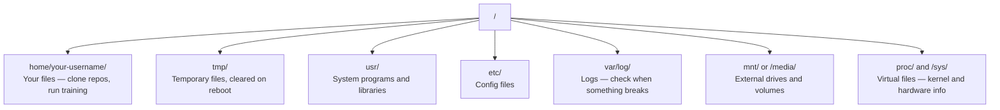

# Linux dla AI

> Większość AI działa na Linuksie. Musisz wiedzieć wystarczająco dużo, żeby się nie zaciąć.

**Typ:** Nauka
**Języki:** --
**Wymagania wstępne:** Faza 0, Lekcja 01
**Czas:** ~30 minut

## Cele nauki

- Poruszanie się po systemie plików Linuksa i wykonywanie podstawowych operacji na plikach z poziomu wiersza poleceń
- Zarządzanie uprawnieniami plików za pomocą `chmod` i `chown`, aby rozwiązywać błędy „Permission denied"
- Instalowanie pakietów systemowych za pomocą `apt` i konfigurowanie nowej maszyny GPU do pracy z AI
- Rozpoznawanie różnic między macOS a Linuksem, które często sprawiają problemy programistom pracującym na zdalnych maszynach

## Problem

Programujesz na macOS lub Windows. Ale w momencie, gdy łączysz się przez SSH z chmurową maszyną GPU, wynajmujesz instancję Lambda lub uruchamiasz maszynę EC2, lądujesz w Ubuntu. Terminal jest twoim jedynym interfejsem. Nie ma Findera, nie ma Eksploratora, nie ma GUI. Jeśli nie potrafisz poruszać się po systemie plików, instalować pakietów i zarządzać procesami z wiersza poleceń, utkniesz, płacąc za bezczynne godziny GPU, gugluiąc „jak rozpakować plik w Linuksie".

To jest przewodnik przetrwania. Obejmuje dokładnie to, czego potrzebujesz, żeby pracować na zdalnej maszynie z Linuksem przy zadaniach związanych z AI. Nic więcej.

## Struktura systemu plików

Linux organizuje wszystko pod jednym katalogiem głównym `/`. Nie ma `C:\` ani `/Volumes`. Katalogi, z którymi faktycznie będziesz mieć do czynienia:



Twój katalog domowy to `~` lub `/home/your-username`. Niemal wszystko, co robisz, dzieje się tutaj.

## Podstawowe polecenia

To 15 poleceń, które pokrywają 95% tego, co będziesz robić na zdalnej maszynie GPU.

### Poruszanie się

```bash
pwd                         # Gdzie jestem?
ls                          # Co tu jest?
ls -la                      # Co tu jest, łącznie z ukrytymi plikami i szczegółami?
cd /sciezka/do/katalogu      # Idź tam
cd ~                        # Idź do katalogu domowego
cd ..                       # Idź o jeden poziom wyżej
```

### Pliki i katalogi

```bash
mkdir moj-projekt           # Utwórz katalog
mkdir -p a/b/c               # Utwórz zagnieżdżone katalogi za jednym razem

cp plik.txt kopia.txt       # Skopiuj plik
cp -r src/ src-backup/      # Skopiuj katalog (rekurencyjnie)

mv stary.txt nowy.txt       # Zmień nazwę pliku
mv plik.txt /tmp/           # Przenieś plik

rm plik.txt                 # Usuń plik (bez kosza, znika na zawsze)
rm -rf moj-katalog/          # Usuń katalog wraz z całą zawartością
```

`rm -rf` jest nieodwracalne. Nie ma cofnięcia. Sprawdź dwa razy ścieżkę przed naciśnięciem enter.

### Czytanie plików

```bash
cat plik.txt                # Wyświetl cały plik
head -20 plik.txt           # Pierwsze 20 linii
tail -20 plik.txt           # Ostatnie 20 linii
tail -f log.txt             # Śledź plik logu w czasie rzeczywistym (Ctrl+C, aby zatrzymać)
less plik.txt               # Przewijaj plik (q, aby wyjść)
```

### Wyszukiwanie

```bash
grep "error" training.log           # Znajdź linie zawierające "error"
grep -r "learning_rate" .           # Przeszukaj wszystkie pliki w bieżącym katalogu
grep -i "cuda" config.yaml          # Wyszukiwanie bez rozróżniania wielkości liter

find . -name "*.py"                 # Znajdź wszystkie pliki Python w bieżącym katalogu
find . -name "*.ckpt" -size +1G     # Znajdź pliki checkpoint większe niż 1GB
```

## Uprawnienia

Każdy plik w Linuksie ma właściciela i bity uprawnień. Spotkasz się z tym, gdy skrypty nie będą się uruchamiać albo gdy nie będziesz mógł zapisywać do katalogu.

```bash
ls -l train.py
# -rwxr-xr-- 1 user group 2048 Mar 19 10:00 train.py
#  ^^^             uprawnienia właściciela: odczyt, zapis, wykonanie
#     ^^^          uprawnienia grupy: odczyt, wykonanie
#        ^^        pozostali: tylko odczyt
```

Typowe poprawki:

```bash
chmod +x train.sh           # Nadaj skryptowi prawo wykonywania
chmod 755 deploy.sh         # Właściciel: pełne prawa, pozostali: odczyt+wykonanie
chmod 644 config.yaml       # Właściciel: odczyt+zapis, pozostali: tylko odczyt

chown user:group plik.txt   # Zmień właściciela pliku (wymaga sudo)
```

Gdy pojawia się komunikat „Permission denied", to niemal zawsze problem z uprawnieniami. `chmod +x` lub `sudo` rozwiąże większość przypadków.

## Zarządzanie pakietami (apt)

Ubuntu używa `apt`. Tak instaluje się oprogramowanie na poziomie systemu.

```bash
sudo apt update             # Odśwież listę pakietów (zawsze rób to najpierw)
sudo apt install -y htop    # Zainstaluj pakiet (-y pomija potwierdzenie)
sudo apt install -y build-essential  # Kompilator C, make itd. Potrzebne przez wiele pakietów Python
sudo apt install -y tmux    # Multiplekser terminala (utrzymuje sesje przy życiu po rozłączeniu)

apt list --installed        # Co jest zainstalowane?
sudo apt remove htop        # Odinstaluj
```

Typowe pakiety, które zainstalujesz na nowej maszynie GPU:

```bash
sudo apt update && sudo apt install -y \
    build-essential \
    git \
    curl \
    wget \
    tmux \
    htop \
    unzip \
    python3-venv
```

## Użytkownicy i sudo

Zazwyczaj jesteś zalogowany jako zwykły użytkownik. Niektóre operacje wymagają dostępu root (administratora).

```bash
whoami                      # Jakim jestem użytkownikiem?
sudo polecenie              # Uruchom pojedyncze polecenie jako root
sudo su                     # Stań się rootem (exit, aby wrócić, używaj oszczędnie)
```

Na chmurowych instancjach GPU zazwyczaj jesteś jedynym użytkownikiem i już masz dostęp sudo. Nie uruchamiaj wszystkiego jako root. Używaj sudo tylko wtedy, gdy jest to konieczne.

## Procesy i systemd

Gdy twój trening się zawiesi lub musisz sprawdzić, co działa:

```bash
htop                        # Interaktywny podgląd procesów (q, aby wyjść)
ps aux | grep python        # Znajdź uruchomione procesy Python
kill 12345                  # Zakończ łagodnie proces o PID 12345
kill -9 12345               # Wymuś zakończenie (gdy łagodne nie działa)
nvidia-smi                  # Procesy GPU i wykorzystanie pamięci
```

systemd zarządza usługami (demonami działającymi w tle). Użyjesz go, jeśli uruchamiasz serwery do inferencji:

```bash
sudo systemctl start nginx          # Uruchom usługę
sudo systemctl stop nginx           # Zatrzymaj ją
sudo systemctl restart nginx        # Zrestartuj ją
sudo systemctl status nginx         # Sprawdź, czy działa
sudo systemctl enable nginx         # Uruchamiaj automatycznie przy starcie systemu
```

## Przestrzeń dyskowa

Maszyny GPU często mają ograniczoną przestrzeń dyskową. Modele i datasety szybko ją zapełniają.

```bash
df -h                       # Wykorzystanie dysku dla wszystkich zamontowanych dysków
df -h /home                 # Wykorzystanie dysku konkretnie dla /home

du -sh *                    # Rozmiar każdego elementu w bieżącym katalogu
du -sh ~/.cache             # Rozmiar twojego cache (tu lądują modele pip, huggingface)
du -sh /data/checkpoints/   # Sprawdź, jak duże są twoje checkpointy

# Znajdź największych pożeraczy miejsca
du -h --max-depth=1 / 2>/dev/null | sort -hr | head -20
```

Typowe sposoby na oszczędzanie miejsca:

```bash
# Wyczyść cache pip
pip cache purge

# Wyczyść cache apt
sudo apt clean

# Usuń stare checkpointy, których już nie potrzebujesz
rm -rf checkpoints/epoch_01/ checkpoints/epoch_02/
```

## Sieć

Będziesz pobierać modele, przesyłać pliki i odpytywać API z poziomu wiersza poleceń.

```bash
# Pobieranie plików
wget https://example.com/model.bin                   # Pobierz plik
curl -O https://example.com/data.tar.gz              # To samo za pomocą curl
curl -s https://api.example.com/health | python3 -m json.tool  # Odpytaj API, sformatuj JSON

# Przesyłanie plików między maszynami
scp model.bin user@remote:/data/                     # Skopiuj plik na zdalną maszynę
scp user@remote:/data/results.csv .                  # Skopiuj plik ze zdalnej maszyny lokalnie
scp -r user@remote:/data/checkpoints/ ./local-dir/   # Skopiuj katalog

# Synchronizacja katalogów (szybsze niż scp przy dużych transferach, wznawia po awarii)
rsync -avz --progress ./data/ user@remote:/data/
rsync -avz --progress user@remote:/results/ ./results/
```

Używaj `rsync` zamiast `scp` przy wszystkim, co jest duże. Przesyła tylko zmienione bajty i radzi sobie z przerwanymi połączeniami.

## tmux: utrzymywanie sesji przy życiu

Gdy łączysz się przez SSH ze zdalną maszyną, zamknięcie laptopa zabija twój trening. tmux temu zapobiega.

```bash
tmux new -s train           # Uruchom nową sesję o nazwie "train"
# ... uruchom swój trening, a następnie:
# Ctrl+B, potem D            # Odłącz się (trening dalej działa)

tmux ls                     # Wyświetl listę sesji
tmux attach -t train        # Połącz się ponownie z sesją

# Wewnątrz tmux:
# Ctrl+B, potem %            # Podziel panel pionowo
# Ctrl+B, potem "            # Podziel panel poziomo
# Ctrl+B, potem strzałki     # Przełączaj się między panelami
```

Zawsze uruchamiaj długie zadania treningowe wewnątrz tmux. Zawsze.

## WSL2 dla użytkowników Windows

Jeśli pracujesz na Windows, WSL2 daje ci prawdziwe środowisko Linux bez konieczności dual-boota.

```bash
# W PowerShell (jako administrator)
wsl --install -d Ubuntu-24.04

# Po restarcie otwórz Ubuntu z menu Start
sudo apt update && sudo apt upgrade -y
```

WSL2 uruchamia prawdziwe jądro Linuksa. Wszystko z tej lekcji działa wewnątrz niego. Twoje pliki Windows znajdują się w `/mnt/c/Users/TwojaNazwa/` z poziomu WSL.

Przekazywanie GPU (passthrough) działa, gdy sterowniki NVIDIA są zainstalowane po stronie Windows. Zainstaluj sterownik NVIDIA dla Windows (nie dla Linuksa), a CUDA będzie dostępna wewnątrz WSL2.

## Pułapki: macOS vs Linux

Rzeczy, które mogą cię zaskoczyć, jeśli przychodzisz z macOS:

| macOS | Linux | Uwagi |
|-------|-------|-------|
| `brew install` | `sudo apt install` | Czasem inne nazwy pakietów. `brew install htop` vs `sudo apt install htop` działa tak samo, ale `brew install readline` vs `sudo apt install libreadline-dev` już nie. |
| `open file.txt` | `xdg-open file.txt` | Ale na zdalnej maszynie nie będziesz mieć GUI. Użyj `cat` lub `less`. |
| `pbcopy` / `pbpaste` | Niedostępne | Przekierowanie do/ze schowka nie istnieje przez SSH. |
| `~/.zshrc` | `~/.bashrc` | macOS domyślnie używa zsh. Większość serwerów Linux używa bash. |
| `/opt/homebrew/` | `/usr/bin/`, `/usr/local/bin/` | Pliki binarne znajdują się w innych miejscach. |
| `sed -i '' 's/a/b/' file` | `sed -i 's/a/b/' file` | macOS sed wymaga pustego ciągu po `-i`. Linux nie. |
| System plików nierozróżniający wielkości liter | System plików rozróżniający wielkość liter | `Model.py` i `model.py` to dwa różne pliki w Linuksie. |
| Końce linii `\n` | Końce linii `\n` | To samo. Ale Windows używa `\r\n`, co psuje skrypty bash. Uruchom `dos2unix`, aby to naprawić. |

## Karta szybkiego odniesienia

```
Nawigacja:      pwd, ls, cd, find
Pliki:          cp, mv, rm, mkdir, cat, head, tail, less
Wyszukiwanie:   grep, find
Uprawnienia:    chmod, chown, sudo
Pakiety:        apt update, apt install
Procesy:        htop, ps, kill, nvidia-smi
Usługi:         systemctl start/stop/restart/status
Dysk:           df -h, du -sh
Sieć:           curl, wget, scp, rsync
Sesje:          tmux new/attach/detach
```

## Ćwiczenia

1. Połącz się przez SSH z dowolną maszyną Linux (lub otwórz WSL2) i przejdź do swojego katalogu domowego. Utwórz folder projektu, utwórz w nim trzy puste pliki za pomocą `touch`, a następnie wylistuj je za pomocą `ls -la`.
2. Zainstaluj `htop` za pomocą apt, uruchom go i zidentyfikuj, który proces zużywa najwięcej pamięci.
3. Uruchom sesję tmux, wykonaj w niej `sleep 300`, odłącz się, wylistuj sesje i połącz się ponownie.
4. Użyj `df -h`, aby sprawdzić dostępną przestrzeń dyskową, a następnie użyj `du -sh ~/.cache/*`, aby znaleźć, co zajmuje miejsce w twoim cache.
5. Prześlij plik z lokalnej maszyny na zdalną za pomocą `scp`, a następnie wykonaj ten sam transfer za pomocą `rsync` i porównaj doświadczenia.
