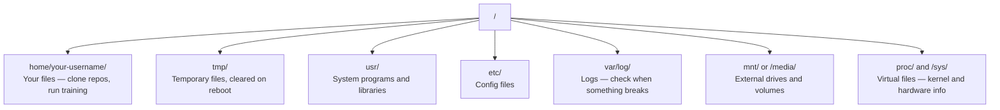

# Linux dla sztucznej inteligencji

> Większość sztucznej inteligencji działa na Linuksie. Musisz wiedzieć wystarczająco dużo, aby nie utknąć.

**Typ:** Ucz się
**Języki:** --
**Wymagania:** Faza 0, Lekcja 01
**Czas:** ~30 minut

## Cele nauczania

- Poruszaj się po systemie plików Linux i wykonuj podstawowe operacje na plikach z wiersza poleceń
- Zarządzaj uprawnieniami do plików za pomocą `chmod` i `chown`, aby rozwiązać błędy „Odmowa uprawnień”
- Zainstaluj pakiety systemowe za pomocą `apt` i skonfiguruj nowy moduł GPU do pracy AI
- Zidentyfikuj różnice między systemami macOS i Linux, które często napotykają programistów pracujących na zdalnych komputerach

## Problem

Programujesz na macOS lub Windows. Ale w momencie, gdy połączysz się z SSH w chmurze GPU, wynajmiesz instancję Lambda lub uruchomisz maszynę EC2, wylądujesz w Ubuntu. Terminal jest Twoim jedynym interfejsem. Nie ma Findera, Eksploratora ani GUI. Jeśli nie możesz poruszać się po systemie plików, instalować pakietów i zarządzać procesami z wiersza poleceń, utkniesz w płaceniu za godziny bezczynności procesora graficznego, wyszukując w Google „jak rozpakować plik w systemie Linux”.

To jest poradnik przetrwania. Obejmuje dokładnie to, czego potrzebujesz do pracy na zdalnym komputerze z systemem Linux do pracy AI. Nic więcej.

## Układ systemu plików

Linux organizuje wszystko w jednym katalogu głównym `/`. Nie ma `C:\` ani `/Volumes`. Katalogi, które faktycznie dotkniesz:



Twój katalog domowy to `~` lub `/home/your-username`. Prawie wszystko, co robisz, dzieje się tutaj.

## Podstawowe polecenia

Oto 15 poleceń, które obejmują 95% czynności, które wykonasz na zdalnym urządzeniu GPU.

### Poruszanie się

```bash
pwd                         # Where am I?
ls                          # What's here?
ls -la                      # What's here, including hidden files with details?
cd /path/to/dir             # Go there
cd ~                        # Go home
cd ..                       # Go up one level
```

### Pliki i katalogi

```bash
mkdir my-project            # Create a directory
mkdir -p a/b/c              # Create nested directories in one shot

cp file.txt backup.txt      # Copy a file
cp -r src/ src-backup/      # Copy a directory (recursive)

mv old.txt new.txt          # Rename a file
mv file.txt /tmp/           # Move a file

rm file.txt                 # Delete a file (no trash, it's gone)
rm -rf my-dir/              # Delete a directory and everything inside
```

`rm -rf` jest trwałe. Nie ma możliwości cofnięcia. Sprawdź dwukrotnie ścieżkę przed naciśnięciem Enter.

### Odczytywanie plików

```bash
cat file.txt                # Print entire file
head -20 file.txt           # First 20 lines
tail -20 file.txt           # Last 20 lines
tail -f log.txt             # Follow a log file in real time (Ctrl+C to stop)
less file.txt               # Scroll through a file (q to quit)
```

### Wyszukiwanie

```bash
grep "error" training.log           # Find lines containing "error"
grep -r "learning_rate" .           # Search all files in current directory
grep -i "cuda" config.yaml          # Case-insensitive search

find . -name "*.py"                 # Find all Python files under current dir
find . -name "*.ckpt" -size +1G     # Find checkpoint files larger than 1GB
```

## Uprawnienia

Każdy plik w systemie Linux ma właściciela i bity uprawnień. Natkniesz się na to, gdy skrypty nie zostaną wykonane lub nie będziesz mógł pisać do katalogu.

```bash
ls -l train.py
# -rwxr-xr-- 1 user group 2048 Mar 19 10:00 train.py
#  ^^^             owner permissions: read, write, execute
#     ^^^          group permissions: read, execute
#        ^^        everyone else: read only
```

Typowe poprawki:

```bash
chmod +x train.sh           # Make a script executable
chmod 755 deploy.sh         # Owner: full, others: read+execute
chmod 644 config.yaml       # Owner: read+write, others: read only

chown user:group file.txt   # Change who owns a file (needs sudo)
```

Kiedy pojawia się komunikat „Odmowa uprawnień”, prawie zawsze jest to problem z uprawnieniami. `chmod +x` lub `sudo` rozwiąże większość przypadków.

## Zarządzanie pakietami (apt)

Ubuntu używa `apt`. W ten sposób instalujesz oprogramowanie na poziomie systemu.

```bash
sudo apt update             # Refresh the package list (always do this first)
sudo apt install -y htop    # Install a package (-y skips confirmation)
sudo apt install -y build-essential  # C compiler, make, etc. Needed by many Python packages
sudo apt install -y tmux    # Terminal multiplexer (keep sessions alive after disconnect)

apt list --installed        # What's installed?
sudo apt remove htop        # Uninstall
```

Typowe pakiety, które zainstalujesz na nowym urządzeniu GPU:

```bash
sudo apt update && sudo apt install -y \
    build-essential \
    git \
    curl \
    wget \
    tmux \
    htop \
    unzip \
    python3-venv
```

## Użytkownicy i sudo

Zwykle jesteś zalogowany jako zwykły użytkownik. Niektóre operacje wymagają dostępu root (administratora).

```bash
whoami                      # What user am I?
sudo command                # Run a single command as root
sudo su                     # Become root (exit to go back, use sparingly)
```

W instancjach GPU w chmurze jesteś zazwyczaj jedynym użytkownikiem i masz już dostęp do sudo. Nie uruchamiaj wszystkiego jako root. Używaj sudo tylko wtedy, gdy jest to konieczne.

## Procesy i systemd

Gdy trening się zawiesza lub chcesz sprawdzić, co działa:

```bash
htop                        # Interactive process viewer (q to quit)
ps aux | grep python        # Find running Python processes
kill 12345                  # Gracefully stop process with PID 12345
kill -9 12345               # Force kill (use when graceful doesn't work)
nvidia-smi                  # GPU processes and memory usage
```

systemd zarządza usługami (demonami działającymi w tle). Użyjesz go, jeśli uruchomisz serwery wnioskowania:

```bash
sudo systemctl start nginx          # Start a service
sudo systemctl stop nginx           # Stop it
sudo systemctl restart nginx        # Restart it
sudo systemctl status nginx         # Check if it's running
sudo systemctl enable nginx         # Start automatically on boot
```

## Miejsce na dysku

Skrzynki GPU często mają ograniczoną przestrzeń dyskową. Modele i zbiory danych szybko je wypełniają.

```bash
df -h                       # Disk usage for all mounted drives
df -h /home                 # Disk usage for /home specifically

du -sh *                    # Size of each item in current directory
du -sh ~/.cache             # Size of your cache (pip, huggingface models land here)
du -sh /data/checkpoints/   # Check how big your checkpoints are

# Find the biggest space hogs
du -h --max-depth=1 / 2>/dev/null | sort -hr | head -20
```

Typowe oszczędzacze miejsca:

```bash
# Clear pip cache
pip cache purge

# Clear apt cache
sudo apt clean

# Remove old checkpoints you don't need
rm -rf checkpoints/epoch_01/ checkpoints/epoch_02/
```

## Sieć

Będziesz pobierać modele, przesyłać pliki i uruchamiać interfejsy API z wiersza poleceń.

```bash
# Download files
wget https://example.com/model.bin                   # Download a file
curl -O https://example.com/data.tar.gz              # Same thing with curl
curl -s https://api.example.com/health | python3 -m json.tool  # Hit an API, pretty-print JSON

# Transfer files between machines
scp model.bin user@remote:/data/                     # Copy file to remote machine
scp user@remote:/data/results.csv .                  # Copy file from remote to local
scp -r user@remote:/data/checkpoints/ ./local-dir/   # Copy directory

# Sync directories (faster than scp for large transfers, resumes on failure)
rsync -avz --progress ./data/ user@remote:/data/
rsync -avz --progress user@remote:/results/ ./results/
```

Użyj `rsync` zamiast `scp` w przypadku dużych obiektów. Przesyła tylko zmienione bajty i obsługuje przerwane połączenia.

## tmux: Utrzymuj sesje przy życiu

Kiedy łączysz się przez SSH ze zdalnym urządzeniem, zamknięcie laptopa przerywa bieg treningowy. tmux temu zapobiega.

```bash
tmux new -s train           # Start a new session named "train"
# ... start your training, then:
# Ctrl+B, then D            # Detach (training keeps running)

tmux ls                     # List sessions
tmux attach -t train        # Reattach to session

# Inside tmux:
# Ctrl+B, then %            # Split pane vertically
# Ctrl+B, then "            # Split pane horizontally
# Ctrl+B, then arrow keys   # Switch between panes
```

Zawsze wykonuj długie zadania szkoleniowe w tmux. Zawsze.

## WSL2 dla użytkowników Windows

Jeśli korzystasz z systemu Windows, WSL2 zapewnia prawdziwe środowisko Linux bez konieczności podwójnego uruchamiania.

```bash
# In PowerShell (admin)
wsl --install -d Ubuntu-24.04

# After restart, open Ubuntu from Start menu
sudo apt update && sudo apt upgrade -y
```

WSL2 obsługuje prawdziwe jądro Linuksa. Wszystko w tej lekcji działa w nim. Twoje pliki Windows znajdują się w `/mnt/c/Users/YourName/` z poziomu WSL.

Przekazywanie GPU działa ze sterownikami NVIDIA zainstalowanymi po stronie systemu Windows. Zainstaluj sterownik NVIDIA dla systemu Windows (nie Linux), a CUDA będzie dostępna w WSL2.

## Gotchas: macOS na Linux

Rzeczy, które Cię zaskoczą, jeśli przechodzisz z systemu macOS:

| macOS | Linux | Notatki |
|-------|-------|------|
| `brew install` | `sudo apt install` | Czasami różne nazwy pakietów. `brew install htop` vs `sudo apt install htop` działa tak samo, ale `brew install readline` vs `sudo apt install libreadline-dev` nie. |
| `open file.txt` | `xdg-open file.txt` | Ale nie będziesz mieć GUI na zdalnym urządzeniu. Użyj `cat` lub `less`. |
| `pbcopy` / `pbpaste` | Niedostępne | Potok do/ze schowka nie istnieje przez SSH. |
| `~/.zshrc` | `~/.bashrc` | macOS domyślnie używa Zsh. Większość serwerów Linux używa basha. |
| `/opt/homebrew/` | `/usr/bin/`, `/usr/local/bin/` | Binary żyją w różnych miejscach. |
| `sed -i '' 's/a/b/' file` | `sed -i 's/a/b/' file` | macOS sed potrzebuje pustego ciągu po `-i`. Linux nie. |
| System plików niewrażliwy na wielkość liter | System plików uwzględniający wielkość liter | `Model.py` i `model.py` to dwa różne pliki w systemie Linux. |
| Zakończenia linii `\n` | Zakończenia linii `\n` | To samo. Ale system Windows używa `\r\n`, który psuje skrypty bash. Uruchom `dos2unix`, aby naprawić. |

## Skrócona karta referencyjna

```
Navigation:     pwd, ls, cd, find
Files:          cp, mv, rm, mkdir, cat, head, tail, less
Search:         grep, find
Permissions:    chmod, chown, sudo
Packages:       apt update, apt install
Processes:      htop, ps, kill, nvidia-smi
Services:       systemctl start/stop/restart/status
Disk:           df -h, du -sh
Network:        curl, wget, scp, rsync
Sessions:       tmux new/attach/detach
```

## Ćwiczenia

1. SSH na dowolnym komputerze z systemem Linux (lub otwórz WSL2) i przejdź do swojego katalogu domowego. Utwórz folder projektu, utwórz w nim trzy puste pliki za pomocą `touch`, a następnie wypisz je za pomocą `ls -la`.
2. Zainstaluj `htop` z apt, uruchom go i sprawdź, który proces zużywa najwięcej pamięci.
3. Rozpocznij sesję tmux, uruchom w niej `sleep 300`, odłącz, wyświetl listę sesji i podłącz ponownie.
4. Użyj `df -h`, aby sprawdzić dostępne miejsce na dysku, a następnie użyj `du -sh ~/.cache/*`, aby sprawdzić, co zajmuje miejsce w pamięci podręcznej.
5. Prześlij plik z komputera lokalnego na zdalny za pomocą `scp`, a następnie wykonaj ten sam transfer za pomocą `rsync` i porównaj wrażenia.