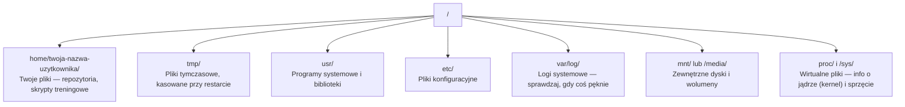

# Linux dla sztucznej inteligencji

> Większość rozwiązań AI działa na Linuksie. Musisz wiedzieć o nim wystarczająco dużo, żeby zawsze umieć sobie poradzić.

**Typ:** Nauka
**Języki:** --
**Wymagania wstępne:** Faza 0, Lekcja 01
**Czas:** ~30 minut

## Cele nauki

- Sprawne poruszanie się po systemie plików Linux i wykonywanie podstawowych operacji na plikach bezpośrednio z wiersza poleceń.
- Zarządzanie uprawnieniami do plików za pomocą `chmod` i `chown`, aby błyskawicznie rozwiązywać błędy typu „Odmowa dostępu” (Permission denied).
- Instalacja pakietów systemowych za pomocą `apt` i konfigurowanie nowej instancji GPU do pracy z AI.
- Zrozumienie kluczowych różnic między systemami macOS a Linux, które często zaskakują programistów pracujących na zdalnych maszynach.

## Problem

Zapewne programujesz na macOS lub Windowsie. Jednak w momencie, gdy łączysz się przez SSH z maszyną chmurową GPU, wynajętą instancją na Lambdzie czy AWS EC2 – lądujesz w Ubuntu. Terminal staje się Twoim jedynym interfejsem. Nie ma Findera, nie ma Eksploratora Windows ani żadnego graficznego interfejsu użytkownika (GUI). Jeśli nie potrafisz swobodnie poruszać się po plikach, instalować pakietów i zarządzać procesami w linii komend, skończysz płacąc za bezcenne godziny bezczynnego drogiego GPU, podczas gdy sam będziesz gorączkowo wpisywać w Google: „jak rozpakować plik na Linuksie”.

To jest Twój poradnik przetrwania. Obejmuje absolutne minimum niezbędne do płynnej pracy ze zdalnymi serwerami Linuksowymi pod kątem inżynierii AI. Nic ponadto.

## Struktura systemu plików

Linux organizuje wszystko począwszy od jednego głównego katalogu (katalogu root) oznaczonego jako `/`. Nie uświadczysz tutaj dysków `C:\` ani `/Volumes`. Katalogi, do których faktycznie będziesz zaglądać, to:



Twój katalog domowy jest oznaczony jako `~` (tylda) lub pełną ścieżką np. `/home/twoja-nazwa-uzytkownika`. Niemal 100% Twojej pracy odbywa się właśnie tam.

## Podstawowe polecenia

Oto zestaw 15 poleceń, które pokrywają 95% rzeczy, które wykonasz logując się na serwer z GPU.

### Poruszanie się

```bash
pwd                         # Gdzie jestem? (Print Working Directory)
ls                          # Co tu jest? (List)
ls -la                      # Co tu jest? (W tym ukryte pliki ze szczegółami)
cd /sciezka/do/katalogu     # Idź do wskazanego katalogu (Change Directory)
cd ~                        # Wróć do katalogu domowego
cd ..                       # Wyjdź jeden poziom wyżej (do folderu nadrzędnego)
```

### Pliki i katalogi

```bash
mkdir moj-projekt           # Utwórz nowy katalog (Make Directory)
mkdir -p a/b/c              # Utwórz zagnieżdżone katalogi za jednym zamachem

cp plik.txt kopia.txt       # Skopiuj plik (Copy)
cp -r src/ src-kopia/       # Skopiuj katalog ze wszystkim co w środku (rekursywnie)

mv stary.txt nowy.txt       # Zmień nazwę pliku (Move/Rename)
mv plik.txt /tmp/           # Przenieś plik

rm plik.txt                 # Usuń plik (Uwaga: nie ma kosza, znika bezpowrotnie)
rm -rf moj-katalog/         # Usuń katalog i całą jego zawartość (rekursywnie, bez pytania)
```

`rm -rf` to broń masowego rażenia. Nie ma opcji "Cofnij". Zawsze sprawdź dwukrotnie ścieżkę, zanim wciśniesz Enter.

### Odczytywanie plików

```bash
cat plik.txt                # Wyświetl w terminalu całą zawartość pliku
head -20 plik.txt           # Pokaż tylko pierwsze 20 linii
tail -20 plik.txt           # Pokaż tylko ostatnie 20 linii
tail -f log.txt             # Śledź plik logów na żywo (użyj Ctrl+C aby przerwać)
less plik.txt               # Pozwala płynnie przewijać plik góra/dół (wciśnij 'q' aby wyjść)
```

### Wyszukiwanie

```bash
grep "error" training.log           # Znajdź wszystkie linie zawierające słowo "error"
grep -r "learning_rate" .           # Szukaj tekstu we wszystkich plikach w aktualnym katalogu
grep -i "cuda" config.yaml          # Szukaj nie zwracając uwagi na wielkość liter

find . -name "*.py"                 # Znajdź wszystkie pliki Pythona w bieżącym katalogu i niżej
find . -name "*.ckpt" -size +1G     # Znajdź pliki z rozszerzeniem .ckpt cięższe niż 1GB
```

## Uprawnienia

Każdy plik w Linuksie ma swojego właściciela oraz przypisane bity uprawnień. Zderzysz się z tym w momencie, gdy twój skrypt nagle odmówi wykonania, albo gdy spróbujesz coś zapisać w nieswoim katalogu.

```bash
ls -l train.py
# -rwxr-xr-- 1 user group 2048 Mar 19 10:00 train.py
#  ^^^             uprawnienia właściciela: odczyt, zapis, wykonanie (read, write, execute)
#     ^^^          uprawnienia grupy: odczyt, wykonanie
#        ^^        uprawnienia wszystkich innych: tylko odczyt
```

Typowe polecenia naprawiające uprawnienia:

```bash
chmod +x train.sh           # Zezwól na uruchamianie (wykonywanie) skryptu
chmod 755 deploy.sh         # Właściciel: pełne, inni: odczyt i wykonanie
chmod 644 config.yaml       # Właściciel: odczyt i zapis, inni: tylko odczyt

chown user:group plik.txt   # Zmień właściciela i grupę pliku (wymaga uprawnień sudo)
```

Kiedy system krzyczy „Odmowa dostępu” (Permission denied), niemal zawsze jest to problem z uprawnieniami. Dodanie `chmod +x` do skryptu lub odpalenie komendy z użyciem `sudo` zazwyczaj załatwia sprawę.

## Zarządzanie pakietami (apt)

Większość serwerów Ubuntu do zarządzania oprogramowaniem globalnym wykorzystuje narzędzie `apt`.

```bash
sudo apt update             # Odśwież listę dostępnych pakietów (zawsze rób to jako pierwsze!)
sudo apt install -y htop    # Zainstaluj pakiet (flaga -y automatycznie akceptuje pytanie o zgodę)
sudo apt install -y build-essential  # Kompilatory C, make itp. Niezbędne do budowy wielu bibliotek w Pythonie
sudo apt install -y tmux    # Multiplekser terminala (utrzymuje sesje po rozłączeniu z serwerem)

apt list --installed        # Co właściwie jest na serwerze zainstalowane?
sudo apt remove htop        # Odinstaluj pakiet
```

Gotowy zestaw podstawowych narzędzi, które zawsze warto zainstalować na nowej maszynie z GPU:

```bash
sudo apt update && sudo apt install -y \
    build-essential \
    git \
    curl \
    wget \
    tmux \
    htop \
    unzip \
    python3-venv
```

## Użytkownicy i sudo

Standardowo jesteś zalogowany jako zwykły użytkownik z ograniczonymi prawami. Operacje systemowe takie jak instalacja globalnych programów czy edycja ustawień sieciowych wymagają konta root (administratora).

```bash
whoami                      # Kim jestem w systemie?
sudo polecenie              # Uruchom pojedyncze polecenie z uprawnieniami root
sudo su                     # Przełącz się w pełni na konto root (wpisz 'exit' aby powrócić)
```

W przypadku instancji chmurowych GPU najczęściej jesteś ich jedynym właścicielem i domyślnie posiadasz uprawnienia do `sudo`. Używaj go jednak rozsądnie. Nie uruchamiaj treningów modeli ani codziennych skryptów z prawami root!

## Procesy i systemd

Gdy proces trenowania się zawiesi lub gdy po prostu chcesz sprawdzić co pochłania zasoby komputera:

```bash
htop                        # Interaktywny podgląd procesów i zużycia pamięci (q aby wyjść)
ps aux | grep python        # Wylistuj działające w tle procesy Pythona
kill 12345                  # "Miękko" zamknij proces o podanym PID (w tym wypadku 12345)
kill -9 12345               # Brutalnie "ubij" proces (używaj gdy zwykłe kill zawiedzie)
nvidia-smi                  # Pokaż użycie procesorów GPU oraz ich pamięci VRAM
```

Narzędzie `systemd` odpowiada z kolei za zarządzanie usługami systemowymi i demonami. Zaprzyjaźnisz się z nim przy wdrażaniu serwerów inferencyjnych:

```bash
sudo systemctl start nginx          # Uruchom usługę
sudo systemctl stop nginx           # Zatrzymaj ją
sudo systemctl restart nginx        # Zrestartuj usługę
sudo systemctl status nginx         # Sprawdź jej aktualny stan
sudo systemctl enable nginx         # Włącz usługę automatycznie po starcie systemu
```

## Miejsce na dysku

Serwery GPU miewają zaskakująco mało przestrzeni dyskowej. Potężne modele wagowe i zbiory danych zapełnią ją w mgnieniu oka.

```bash
df -h                       # Pokaż wykorzystanie dysku dla wszystkich podpiętych wolumenów
df -h /home                 # Sprawdź miejsce specjalnie dla katalogu domowego /home

du -sh *                    # Sprawdź rozmiar każdego elementu w aktualnym katalogu
du -sh ~/.cache             # Sprawdź wagę katalogu cache (tu ląduje pip i modele pobrane z HuggingFace)
du -sh /data/checkpoints/   # Zobacz jak ciężkie są twoje zapisane checkpointy modelu

# Znajdź największe obiekty pożerające przestrzeń dyskową
du -h --max-depth=1 / 2>/dev/null | sort -hr | head -20
```

Jak szybko odzyskać miejsce:

```bash
# Wyczyść pamięć podręczną menadżera pakietów pip
pip cache purge

# Wyczyść pobrane archiwa pakietów systemowych
sudo apt clean

# Usuń stare, niepotrzebne już checkpointy z treningu
rm -rf checkpoints/epoch_01/ checkpoints/epoch_02/
```

## Sieć

Często musisz pobierać zewnętrzne modele z sieci, przesyłać własne pliki lokalne lub odpytywać API bezpośrednio w wierszu poleceń.

```bash
# Pobieranie plików
wget https://example.com/model.bin                   # Pobierz plik bezpośrednio na dysk
curl -O https://example.com/data.tar.gz              # To samo, tylko przy użyciu curl
curl -s https://api.example.com/health | python3 -m json.tool  # Uderz w API i sformatuj wynik JSON dla lepszej czytelności

# Transfery pomiędzy własnym komputerem a zdalnym serwerem
scp model.bin uzytkownik@serwer:/data/                     # Skopiuj plik z PC na serwer
scp uzytkownik@serwer:/data/results.csv .                  # Z serwera na lokalny PC
scp -r uzytkownik@serwer:/data/checkpoints/ ./local-dir/   # Skopiuj z serwera cały folder (rekursywnie)

# Synchronizacja katalogów (szybsza niż scp, doskonała przy zerwaniu połączenia)
rsync -avz --progress ./data/ uzytkownik@serwer:/data/
rsync -avz --progress uzytkownik@serwer:/results/ ./results/
```

Przy przesyłaniu dużych folderów wyrób sobie nawyk używania `rsync` zamiast `scp`. Transferuje tylko faktycznie zmienione bajty i potrafi bezproblemowo wznowić upload po chwilowej utracie połączenia.

## tmux: Utrzymaj procesy przy życiu

Zamykając klapę laptopa podczas aktywnego połączenia przez SSH, natychmiastowo ubijasz trwający na serwerze proces treningowy. Aplikacja `tmux` zdejmuje Ci ten problem z głowy.

```bash
tmux new -s train           # Otwórz nową sesję o nazwie "train"
# ... zacznij trening modelu, po czym:
# Wciśnij Ctrl+B, następnie klawisz D   # Odłączasz się od sesji (trening działa nienaruszony w tle)

tmux ls                     # Wyświetl listę ukrytych sesji
tmux attach -t train        # Podepnij się z powrotem do pracującej w tle sesji "train"

# Wewnątrz środowiska tmux:
# Wciśnij Ctrl+B, następnie %            # Podziel bieżący panel pionowo
# Wciśnij Ctrl+B, następnie "            # Podziel bieżący panel poziomo
# Wciśnij Ctrl+B, następnie strzałki     # Przemieszczaj się pomiędzy panelami
```

Złota zasada: Każdy wielogodzinny trening odpalaj zawsze i wyłącznie wewnątrz tmuxa. Bez wyjątków.

## WSL2 dla użytkowników systemu Windows

Jeśli na co dzień pracujesz na systemie Windows, funkcja WSL2 odda w Twoje ręce pełnoprawne środowisko Linuksowe bez potrzeby tworzenia skomplikowanych opcji dual-boot.

```bash
# Uruchom terminal PowerShell jako Administrator
wsl --install -d Ubuntu-24.04

# Po wymaganym restarcie systemu, uruchom aplikację Ubuntu z Menu Start
sudo apt update && sudo apt upgrade -y
```

WSL2 korzysta z prawdziwego jądra Linuxa, a nie protezy. Każde pojedyncze polecenie poznane na tej lekcji będzie w nim działać perfekcyjnie. Pliki twojego systemu Windows będą w pełni widoczne ze ścieżki `/mnt/c/Users/TwojeImie/`.

Co najważniejsze – Windows świetnie obsługuje w WSL2 bezpośrednie przekazywanie zasobów układów graficznych do kontenerów i powłoki! Wystarczy, że zainstalujesz sterownik NVIDIA naturalnie po stronie systemu Windows. Żadnych specjalnych linuksowych sterowników nie instaluj z poziomu WSL! Moduły i biblioteki CUDA będą od razu dostępne.

## Pułapki: Przejście z macOS na Linuxa

Kilka rzeczy, na które musisz uważać, jeśli twój domyślny OS to masOS:

| macOS | Linux | Uwagi |
|-------|-------|------|
| `brew install` | `sudo apt install` | Inne systemy zarządzania oprogramowaniem. Często nazwy są te same np. `htop`, lecz instalując pakiety developerskie spodziewaj się różnic (np. macOS użyje `readline`, podczas gdy Ubuntu wymusi użycie np. `libreadline-dev`). |
| `open plik.txt` | `xdg-open plik.txt` | Na zdalnych serwerach brakuje interfejsów graficznych, polecenie to będzie często bezużyteczne. Do poglądu pliku użyj `cat` lub `less`. |
| `pbcopy` / `pbpaste` | Niedostępne | Wbudowany po protokole SSH mechanizm schowka tekstu (copy/paste) nie istnieje w standardowej formie. |
| `~/.zshrc` | `~/.bashrc` | macOS preferuje ulepszoną powłokę Zsh. Większość systemów Linux na start wita Cię uboższą, choć uniwersalną powłoką bash. |
| `/opt/homebrew/` | `/usr/bin/`, `/usr/local/bin/` | Pliki binarne instalowanych programów rozkładane są w kompletnie innych rejonach dysku. |
| `sed -i '' 's/a/b/' plik` | `sed -i 's/a/b/' plik` | Kłopotliwe narzędzie manipulacji ciągiem znaków. W macOS `sed` po dodaniu flagi `-i` wymaga przekazania pustego łańcucha, Linux nie. |
| System plików nie rozróżniający liter | Case-sensitive system | W Linuksie wielkość liter MA gigantyczne znaczenie. Plik `Model.py` oraz plik `model.py` to dla Linuksa dwa kompletnie, fizycznie różne twory. |
| Zakończenia linii `\n` | Zakończenia linii `\n` | Na szczęście te same. Jeśli jednak kopiujesz pliki z Windowsa i masz z nimi zgrzyty (`\r\n`), musisz użyć i odpalić skrypt `dos2unix`, by zamienić kłopotliwe znaki nowej linii. |

## Skrócona ściągawka poleceń

```
Nawigacja:      pwd, ls, cd, find
Pliki:          cp, mv, rm, mkdir, cat, head, tail, less
Szukanie:       grep, find
Uprawnienia:    chmod, chown, sudo
Pakiety:        apt update, apt install
Procesy:        htop, ps, kill, nvidia-smi
Usługi/Demonty: systemctl start/stop/restart/status
Dyski:          df -h, du -sh
Sieć:           curl, wget, scp, rsync
Sesje:          tmux new/attach/detach
```

## Ćwiczenia

1. Połącz się po SSH z jakimś serwerem Linuxowym (lub po prostu uruchom WSL2) i wejdź do głównego domowego katalogu. Zbuduj w nim katalog projektowy, następnie korzystając z narzędzia `touch` utwórz w nim 3 losowe pliki, by finalnie przyjrzeć się im stosując rozwinięte polecenie `ls -la`.
2. Przy użyciu `apt` zainstaluj `htop`. Uruchom aplikację i postaraj się w niej wyśledzić to zadanie w tle systemu, które jest w danej chwili najbardziej łase na konsumpcję zasobów pamięci RAM.
3. Utwórz stabilną sesję `tmux`, puść w ruch testowe zadanie `sleep 300`, całkowicie zrzuć z siebie sesję do tła (odłącz się). Korzystając z listowania udowodnij, że wciąż działa, by w finale wpiąć się w nią ponownie na pierwszy plan.
4. Zbadaj status swojego miejsca na wbudowanym dysku wykonując `df -h`, a następnie spenetruj katalog powszechnej pamięci podręcznej Hugging Face/pip robiąc skan dyskowy `du -sh ~/.cache/*`, żeby dowiedzieć się co faktycznie pochłania twoje cenne gigabajty.
5. Zrzuć przykładowy lekki plik z własnego, prywatnego komputera na maszynę serwerową z Linuxem posiłkując się technologią `scp`. Powtórz ten sam przebieg i sukces z lepszym odpowiednikiem, mianowicie z `rsync` i wyciągnij własne spostrzeżenia, z którym z nich czujesz się swobodniej.
