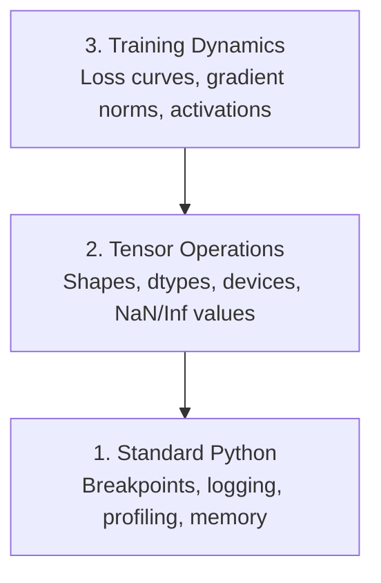

# Debugowanie i profilowanie

> Najgorsze błędy AI nie ulegają awarii. Trenują po cichu na śmieciach i zgłaszają piękną krzywą strat.

**Typ:** Kompilacja
**Język:** Python
**Wymagania wstępne:** Lekcja 1 (Środowisko deweloperskie), podstawowa znajomość PyTorch
**Czas:** ~60 minut

## Cele nauczania

- Użyj warunkowego `breakpoint()` i `debug_print`, aby sprawdzić kształty tensora, typy d i wartości NaN w trakcie szkolenia
- Pętle szkoleniowe profili z `cProfile`, `line_profiler` i `tracemalloc` do wyszukiwania wąskich gardeł
- Wykrywaj typowe błędy AI: niedopasowanie kształtu, utratę NaN, wyciek danych i tensory nieprawidłowego urządzenia
- Skonfiguruj TensorBoard, aby wizualizować krzywe strat, histogramy wag i rozkłady gradientów

## Problem

Kod AI zawodzi inaczej niż zwykły kod. Aplikacja internetowa ulega awarii z powodu śledzenia stosu. Źle skonfigurowana pętla treningowa działa przez 8 godzin, pochłania 200 dolarów czasu procesora graficznego i tworzy model, który przewiduje średnią każdego sygnału wejściowego. Kod nigdy nie zawierał błędów. Błąd polegał na tensorze na niewłaściwym urządzeniu, zapomnianym `.detach()` lub etykietach wyciekających do funkcji.

Potrzebujesz narzędzi do debugowania, które wyłapią te ciche awarie, zanim zmarnują Twój czas i obliczenia.

## Koncepcja

Debugowanie AI działa na trzech poziomach:



Większość ludzi od razu przechodzi na poziom 3 (wpatrując się w TensorBoard). Ale 80% błędów AI żyje na poziomach 1 i 2.

## Zbuduj to

### Część 1: Debugowanie wydruku (tak, to działa)

Debugowanie drukowania zostaje odrzucone. Nie powinno. W przypadku kodu tensorowego ukierunkowana instrukcja print jest lepsza od przechodzenia przez debuger, ponieważ trzeba jednocześnie zobaczyć kształty, typy i zakresy wartości.

```python
def debug_print(name, tensor):
    print(f"{name}: shape={tensor.shape}, dtype={tensor.dtype}, "
          f"device={tensor.device}, "
          f"min={tensor.min().item():.4f}, max={tensor.max().item():.4f}, "
          f"mean={tensor.mean().item():.4f}, "
          f"has_nan={tensor.isnan().any().item()}")
```

Nazwij to po każdej podejrzanej operacji. Po znalezieniu błędu usuń odciski. Prosty.

### Część 2: Debuger Pythona (pdb i punkt przerwania)

Wbudowany debuger jest niedoceniany w pracy z AI. Wrzuć `breakpoint()` do swojej pętli treningowej i interaktywnie sprawdź tensory.

```python
def training_step(model, batch, criterion, optimizer):
    inputs, labels = batch
    outputs = model(inputs)
    loss = criterion(outputs, labels)

    if loss.item() > 100 or torch.isnan(loss):
        breakpoint()

    loss.backward()
    optimizer.step()
```

Kiedy debuger cię wrzuci, przydatne polecenia:

- `p outputs.shape`, aby sprawdzić kształty
- `p loss.item()`, aby zobaczyć wartość straty
- `p torch.isnan(outputs).sum()` do zliczania NaN
- `p model.fc1.weight.grad`, aby sprawdzić gradienty
- `c`, aby kontynuować, `q`, aby zakończyć

To jest debugowanie warunkowe. Zatrzymujesz się tylko wtedy, gdy coś wygląda nie tak. Ma to znaczenie w przypadku biegu treningowego obejmującego 10 000 kroków.

### Część 3: Rejestrowanie w Pythonie

Zastąp instrukcje drukowania logowaniem, gdy debugowanie wykracza poza szybkie sprawdzenie.

```python
import logging

logging.basicConfig(
    level=logging.INFO,
    format="%(asctime)s [%(levelname)s] %(message)s",
    handlers=[
        logging.FileHandler("training.log"),
        logging.StreamHandler()
    ]
)
logger = logging.getLogger(__name__)

logger.info("Starting training: lr=%.4f, batch_size=%d", lr, batch_size)
logger.warning("Loss spike detected: %.4f at step %d", loss.item(), step)
logger.error("NaN loss at step %d, stopping", step)
```

Rejestrowanie udostępnia znaczniki czasu, poziomy ważności i dane wyjściowe w plikach. Gdy przebieg treningowy nie powiedzie się o 3 nad ranem, potrzebujesz pliku dziennika, a nie danych wyjściowych terminala, które przewijały się poza ekranem.

### Część 4: Sekcje kodu synchronizacji

Wiedza o tym, gdzie płynie czas, jest pierwszym krokiem do optymalizacji.

```python
import time

class Timer:
    def __init__(self, name=""):
        self.name = name

    def __enter__(self):
        self.start = time.perf_counter()
        return self

    def __exit__(self, *args):
        elapsed = time.perf_counter() - self.start
        print(f"[{self.name}] {elapsed:.4f}s")

with Timer("data loading"):
    batch = next(dataloader_iter)

with Timer("forward pass"):
    outputs = model(batch)

with Timer("backward pass"):
    loss.backward()
```

Powszechny wniosek: ładowanie danych zajmuje 60% czasu szkolenia. Rozwiązaniem jest `num_workers > 0` w programie DataLoader, a nie szybszy procesor graficzny.

### Część 5: cProfile i line_profiler

Kiedy potrzebujesz czegoś więcej niż ręczne timery:

```bash
python -m cProfile -s cumtime train.py
```

To pokazuje każde wywołanie funkcji posortowane według skumulowanego czasu. W przypadku profilowania linia po linii:

```bash
pip install line_profiler
```

```python
@profile
def train_step(model, data, target):
    output = model(data)
    loss = F.cross_entropy(output, target)
    loss.backward()
    return loss

# Run with: kernprof -l -v train.py
```

### Część 6: Profilowanie pamięci

#### Pamięć procesora z funkcją śledzenia

```python
import tracemalloc

tracemalloc.start()

# your code here
model = build_model()
data = load_dataset()

snapshot = tracemalloc.take_snapshot()
top_stats = snapshot.statistics("lineno")
for stat in top_stats[:10]:
    print(stat)
```

#### Pamięć procesora z profilem pamięci

```bash
pip install memory_profiler
```

```python
from memory_profiler import profile

@profile
def load_data():
    raw = read_csv("data.csv")       # watch memory jump here
    processed = preprocess(raw)       # and here
    return processed
```

Uruchom z `python -m memory_profiler your_script.py`, aby zobaczyć użycie pamięci linia po linii.

#### Pamięć GPU z PyTorch

```python
import torch

if torch.cuda.is_available():
    print(torch.cuda.memory_summary())

    print(f"Allocated: {torch.cuda.memory_allocated() / 1e9:.2f} GB")
    print(f"Cached: {torch.cuda.memory_reserved() / 1e9:.2f} GB")
```

Kiedy naciśniesz OOM (brak pamięci):

1. Zmniejsz wielkość partii (zawsze należy spróbować jako pierwsza)
2. Użyj `torch.cuda.empty_cache()`, aby zwolnić pamięć podręczną
3. Użyj `del tensor`, a następnie `torch.cuda.empty_cache()` w przypadku dużych półproduktów
4. Użyj mieszanej precyzji (`torch.cuda.amp`), aby zmniejszyć o połowę zużycie pamięci
5. Używaj punktów kontrolnych gradientu w przypadku bardzo głębokich modeli

### Część 7: Typowe błędy AI i jak je wyłapać

#### Niedopasowanie kształtu

Najczęstszy błąd. Tensor ma kształt `[batch, features]`, gdy model oczekuje `[batch, channels, height, width]`.

```python
def check_shapes(model, sample_input):
    print(f"Input: {sample_input.shape}")
    hooks = []

    def make_hook(name):
        def hook(module, inp, out):
            in_shape = inp[0].shape if isinstance(inp, tuple) else inp.shape
            out_shape = out.shape if hasattr(out, "shape") else type(out)
            print(f"  {name}: {in_shape} -> {out_shape}")
        return hook

    for name, module in model.named_modules():
        hooks.append(module.register_forward_hook(make_hook(name)))

    with torch.no_grad():
        model(sample_input)

    for h in hooks:
        h.remove()
```

Uruchom to raz z partią próbną. Odwzorowuje każdą transformację kształtu w Twoim modelu.

#### Strata NaN

Utrata NaN oznacza, że coś eksplodowało. Najczęstsze przyczyny:

- Tempo uczenia się jest zbyt wysokie
- Dzielenie przez zero straty celnej
- Log zera lub liczby ujemnej
- Eksplodujące gradienty w RNN

```python
def detect_nan(model, loss, step):
    if torch.isnan(loss):
        print(f"NaN loss at step {step}")
        for name, param in model.named_parameters():
            if param.grad is not None:
                if torch.isnan(param.grad).any():
                    print(f"  NaN gradient in {name}")
                if torch.isinf(param.grad).any():
                    print(f"  Inf gradient in {name}")
        return True
    return False
```

#### Wyciek danych

Twój model uzyskuje 99% dokładności na zestawie testowym. Brzmi świetnie. To błąd.

```python
def check_data_leakage(train_set, test_set, id_column="id"):
    train_ids = set(train_set[id_column].tolist())
    test_ids = set(test_set[id_column].tolist())
    overlap = train_ids & test_ids
    if overlap:
        print(f"DATA LEAKAGE: {len(overlap)} samples in both train and test")
        return True
    return False
```

Sprawdź także, czy nie ma wycieków czasowych: wykorzystanie przyszłych danych do przewidywania przeszłości. Sortuj według sygnatury czasowej przed podziałem.

#### Złe urządzenie

Tensory na różnych urządzeniach (CPU i GPU) powodują błędy w czasie wykonywania. Czasami jednak tensor po cichu pozostaje na procesorze, podczas gdy wszystko inne jest na GPU, a trening przebiega powoli.

```python
def check_devices(model, *tensors):
    model_device = next(model.parameters()).device
    print(f"Model device: {model_device}")
    for i, t in enumerate(tensors):
        if t.device != model_device:
            print(f"  WARNING: tensor {i} on {t.device}, model on {model_device}")
```

### Część 8: Podstawy TensorBoard

TensorBoard pokazuje, co dzieje się w czasie treningu.

```bash
pip install tensorboard
```

```python
from torch.utils.tensorboard import SummaryWriter

writer = SummaryWriter("runs/experiment_1")

for step in range(num_steps):
    loss = train_step(model, batch)

    writer.add_scalar("loss/train", loss.item(), step)
    writer.add_scalar("lr", optimizer.param_groups[0]["lr"], step)

    if step % 100 == 0:
        for name, param in model.named_parameters():
            writer.add_histogram(f"weights/{name}", param, step)
            if param.grad is not None:
                writer.add_histogram(f"grads/{name}", param.grad, step)

writer.close()
```

Uruchom to:

```bash
tensorboard --logdir=runs
```

Czego szukać:

- **Strata nie maleje**: Szybkość uczenia się jest zbyt niska lub problem z architekturą modelu
- **Strata gwałtownie oscyluje**: Szybkość uczenia się jest zbyt wysoka
- **Strata dotyczy NaN**: Niestabilność numeryczna (patrz sekcja NaN powyżej)
- **Maleje strata pociągu, rośnie strata wartości**: Przeuczenie
- **Histogramy wagowe zapadające się do zera**: Zanikające gradienty
- **Histogramy gradientu eksplodują**: Wymagane jest przycięcie gradientu

### Część 9: Debuger kodu VS

Do interaktywnego debugowania skonfiguruj kod VS za pomocą `launch.json`:

```json
{
    "version": "0.2.0",
    "configurations": [
        {
            "name": "Debug Training",
            "type": "debugpy",
            "request": "launch",
            "program": "${file}",
            "console": "integratedTerminal",
            "justMyCode": false
        }
    ]
}
```

Ustaw punkty przerwania, klikając rynnę. Użyj panelu Zmienne, aby sprawdzić właściwości tensora. Konsola debugowania umożliwia uruchamianie dowolnych wyrażeń języka Python w trakcie wykonywania.

Przydatne do przechodzenia przez potoki wstępnego przetwarzania danych, w których chcesz zobaczyć każdą transformację.

## Użyj tego

Oto przepływ pracy debugowania, który wyłapuje większość błędów AI:

1. **Przed treningiem**: Uruchom `check_shapes` z partią próbną. Sprawdź, czy wymiary wejściowe i wyjściowe odpowiadają oczekiwaniom.
2. **Pierwsze 10 kroków**: Użyj `debug_print` w przypadku strat, wyjść i gradientów. Upewnij się, że nic nie jest NaN, a wartości mieszczą się w rozsądnych zakresach.
3. **Podczas treningu**: Utrata logu, szybkość uczenia się i normy gradientu. Do wizualizacji użyj TensorBoard.
4. **Kiedy coś się zepsuje**: Upuść `breakpoint()` w miejscu awarii. Interaktywne sprawdzanie tensorów.
5. **Dla wydajności**: Czas ładowania danych w porównaniu do przejścia do przodu i do tyłu. Pamięć profilu, jeśli jesteś w pobliżu OOM.

## Wyślij to

Uruchom skrypt zestawu narzędzi do debugowania:

```bash
python phases/00-setup-and-tooling/12-debugging-and-profiling/code/debug_tools.py
```

Zobacz `outputs/prompt-debug-ai-code.md`, aby zapoznać się z monitem pomagającym zdiagnozować błędy specyficzne dla sztucznej inteligencji.

## Ćwiczenia

1. Uruchom `debug_tools.py` i przeczytaj wyniki każdej sekcji. Zmodyfikuj model fikcyjny, aby wprowadzić NaN (wskazówka: podziel przez zero w przebiegu do przodu) i obserwuj, jak detektor go wychwytuje.
2. Sprofiluj pętlę treningową za pomocą `cProfile` i zidentyfikuj najwolniejszą funkcję.
3. Użyj `tracemalloc`, aby dowiedzieć się, która linia w potoku ładowania danych przydziela najwięcej pamięci.
4. Skonfiguruj TensorBoard do prostego przebiegu treningowego i sprawdź, czy model nie jest nadmiernie dopasowany.
5. Użyj `breakpoint()` w pętli treningowej. Przećwicz sprawdzanie kształtów tensorów, urządzeń i wartości gradientu w wierszu poleceń debugera.