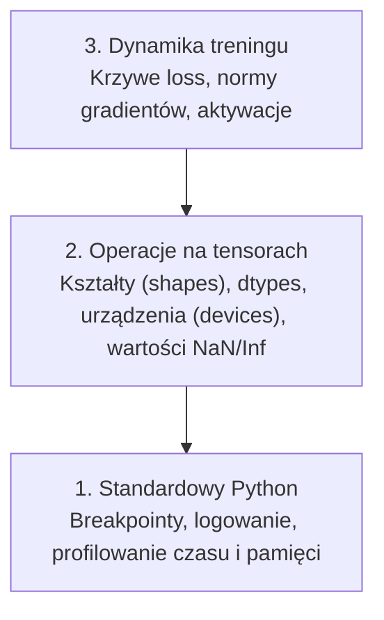

# Debugowanie i profilowanie

> Najgorsze błędy w AI nie wyrzucają wyjątków. Model trenuje po cichu na śmieciowych danych i rysuje piękną, fałszywą krzywą spadku błędu (loss).

**Typ:** Środowisko / Nauka
**Język:** Python
**Wymagania wstępne:** Lekcja 1 (Środowisko deweloperskie), podstawowa znajomość PyTorch
**Czas:** ~60 minut

## Cele nauki

- Wykorzystanie warunkowego `breakpoint()` oraz funkcji `debug_print` do weryfikacji kształtów tensorów (shapes), typów danych (dtypes) i wartości NaN podczas treningu.
- Profilowanie pętli treningowych za pomocą `cProfile`, `line_profiler` i `tracemalloc` w celu identyfikacji wąskich gardeł wydajnościowych.
- Wykrywanie typowych cichych błędów w modelach AI: niedopasowanie kształtów, loss o wartości NaN, wyciek danych (data leakage) oraz tensory ulokowane na niewłaściwym urządzeniu (device).
- Konfiguracja TensorBoard w celu poprawnej wizualizacji krzywych uczenia, histogramów wag oraz rozkładów gradientów.

## Problem

Błędy w kodzie AI objawiają się zupełnie inaczej niż w standardowym oprogramowaniu. Zwykła aplikacja webowa wyrzuca błąd (crash) i wypluwa czytelny stack trace. Źle skonfigurowana pętla treningowa potrafi działać bez zająknięcia przez 8 godzin, spalając przy okazji 200 dolarów za czas pracy GPU, by na koniec wypluć model, który dla każdego możliwego wejścia po prostu przewiduje średnią. Kod źródłowy z technicznego punktu widzenia mógł być bezbłędny. Faktycznym błędem mógł być jeden tensor przebywający na niewłaściwym urządzeniu, brakujący `.detach()`, czy etykiety (labels) przenikające niejawnie do danych wejściowych.

Potrzebujesz zestawu narzędzi do debugowania, które wyłapią te ciche awarie na wczesnym etapie, zanim zmarnują Twój bezcenny czas i zasoby obliczeniowe.

## Koncepcja

Debugowanie modeli AI przebiega na trzech odrębnych poziomach:



Większość początkujących od razu skacze na poziom 3 (bezradnie wpatrując się w wykresy w TensorBoard). Tymczasem 80% realnych błędów w kodzie ML ukrywa się na poziomach 1 i 2.

## Praktyka i narzędzia

### Część 1: Debugowanie przez Printowanie (tak, to ma sens!)

Debugowanie poprzez `print()` bywa powszechnie wyszydzane przez programistów, ale w obszarze AI jest nieocenione. W przypadku skomplikowanych operacji na tensorach, inteligentnie ułożona instrukcja `print` jest nierzadko skuteczniejsza od powolnego krokowania w debugerze, ponieważ musisz mieć jednoczesny wgląd w kształty, typy danych i ekstremalne wartości na każdym etapie.

```python
def debug_print(name, tensor):
    print(f"{name}: shape={tensor.shape}, dtype={tensor.dtype}, "
          f"device={tensor.device}, "
          f"min={tensor.min().item():.4f}, max={tensor.max().item():.4f}, "
          f"mean={tensor.mean().item():.4f}, "
          f"has_nan={tensor.isnan().any().item()}")
```

Wywołaj tę funkcję zaraz po jakiejkolwiek podejrzanej operacji matematycznej. Gdy tylko znajdziesz winnego, usuń ją. Proste i niezwykle skuteczne.

### Część 2: Wbudowany debugger (pdb i breakpoint)

Wbudowany w Pythona interaktywny debugger jest zdecydowanie niedoceniany w AI. Wstaw `breakpoint()` bezpośrednio w pętlę treningową, aby w locie badać stan tensorów.

```python
def training_step(model, batch, criterion, optimizer):
    inputs, labels = batch
    outputs = model(inputs)
    loss = criterion(outputs, labels)

    # Zatrzymanie warunkowe
    if loss.item() > 100 or torch.isnan(loss):
        breakpoint()

    loss.backward()
    optimizer.step()
```

Kiedy zostaniesz wrzucony do konsoli debuggera (PDB), użyj tych poleceń:

- `p outputs.shape` - by zweryfikować kształty (wymiary).
- `p loss.item()` - by odczytać surową wartość straty.
- `p torch.isnan(outputs).sum()` - by policzyć ilość wartości NaN w tensorze.
- `p model.fc1.weight.grad` - by sprawdzić stan gradientów w warstwie.
- `c` (continue), aby kontynuować wykonywanie kodu; `q` (quit), by zakończyć program.

Powyższy schemat to debugowanie warunkowe. Zatrzymujesz wykonanie programu *tylko* wtedy, gdy wiesz, że stało się coś złego. Jest to absolutnie niezbędne przy pętlach trenujących wykonujących po kilkanaście tysięcy kroków (krok po kroku zabiłoby Cię z nudów).

### Część 3: Logowanie (Logging)

Zastąp instrukcje `print` pełnoprawnym logowaniem w momencie, gdy z fazy testów przechodzisz do dłuższego treningu w tle.

```python
import logging

logging.basicConfig(
    level=logging.INFO,
    format="%(asctime)s [%(levelname)s] %(message)s",
    handlers=[
        logging.FileHandler("training.log"),
        logging.StreamHandler()
    ]
)
logger = logging.getLogger(__name__)

logger.info("Rozpoczęcie treningu: lr=%.4f, batch_size=%d", lr, batch_size)
logger.warning("Wykryto skok wartości loss: %.4f w kroku %d", loss.item(), step)
logger.error("Wartość NaN w funkcji loss w kroku %d, przerywam", step)
```

System logowania zapewnia wgląd w dokładne czasy, wspiera rangi ważności (info/warning/error) i podwójny zapis (do konsoli i do pliku). Kiedy Twój model spektakularnie zawiesi się o 3 nad ranem, będziesz wniebowzięty mając do dyspozycji plik logu, a nie czysty ekran po zamkniętym terminalu.

### Część 4: Mierzenie czasu wykonania

Wiedza o tym, *gdzie ucieka Twój czas*, to absolutnie pierwszy krok w stronę jakiejkolwiek optymalizacji.

```python
import time

class Timer:
    def __init__(self, name=""):
        self.name = name

    def __enter__(self):
        self.start = time.perf_counter()
        return self

    def __exit__(self, *args):
        elapsed = time.perf_counter() - self.start
        print(f"[{self.name}] {elapsed:.4f}s")

with Timer("ładowanie danych"):
    batch = next(dataloader_iter)

with Timer("forward pass"):
    outputs = model(batch)

with Timer("backward pass"):
    loss.backward()
```

Klasyczny i częsty wniosek: zauważysz, że ładowanie i przygotowanie samych danych spowalnia trening, pożerając 60% całego czasu operacji. Rozwiązaniem nie jest wynajęcie mocniejszego i droższego GPU, lecz ustawienie parametru `num_workers > 0` (oraz `pin_memory=True`) w instancji `DataLoader`.

### Część 5: cProfile i line_profiler

Kiedy Twoje proste timery to za mało:

```bash
python -m cProfile -s cumtime train.py
```

To polecenie wylistuje wywołania każdej pojedynczej funkcji, posortowane według skumulowanego czasu wykonania.

W przypadku profilowania szczegółowego (linijka po linijce):

```bash
pip install line_profiler
```

```python
@profile
def train_step(model, data, target):
    output = model(data)
    loss = F.cross_entropy(output, target)
    loss.backward()
    return loss

# Uruchom poleceniem w terminalu: kernprof -l -v train.py
```

### Część 6: Profilowanie zużycia pamięci

#### Śledzenie wycieków pamięci RAM z tracemalloc

```python
import tracemalloc

tracemalloc.start()

# miejsce na twój kod
model = build_model()
data = load_dataset()

snapshot = tracemalloc.take_snapshot()
top_stats = snapshot.statistics("lineno")
for stat in top_stats[:10]:
    print(stat)
```

#### Monitorowanie RAM-u na poziomie linii

```bash
pip install memory_profiler
```

```python
from memory_profiler import profile

@profile
def load_data():
    raw = read_csv("data.csv")       # obserwuj jak skacze tu zużycie RAM
    processed = preprocess(raw)       # i jak rośnie tutaj
    return processed
```

Uruchom za pomocą `python -m memory_profiler twoj_skrypt.py`, aby podejrzeć dokładne wartości zaalokowanej pamięci.

#### Pamięć VRAM na układach GPU z PyTorch

```python
import torch

if torch.cuda.is_available():
    print(torch.cuda.memory_summary())

    print(f"Zaalokowane: {torch.cuda.memory_allocated() / 1e9:.2f} GB")
    print(f"Pamięć podręczna (Cache): {torch.cuda.memory_reserved() / 1e9:.2f} GB")
```

Co robić, gdy powita Cię legendarny błąd OOM (Out Of Memory):

1. **Zmniejsz wielkość partii (`batch_size`)**. To zawsze powinieneś wypróbować jako pierwsze rozwiązanie.
2. Spróbuj wywołać `torch.cuda.empty_cache()` w odpowiednich miejscach, by zrzucić nadmiarową pamięć podręczną.
3. Wymuś usunięcie ogromnych, tymczasowych tensorów poleceniem `del tensor`, a następnie odpal `empty_cache()`.
4. Przejdź na trening z mieszaną precyzją (Mixed Precision z `torch.cuda.amp`), co niemal o połowę zmniejszy zużycie VRAM-u.
5. Przy bardzo głębokich i dużych modelach zastosuj technikę Gradient Checkpointing.

### Część 7: Ciche błędy AI i jak je wyłapywać

#### Niedopasowanie kształtów (Shape Mismatch)

Zdecydowanie najczęstszy błąd poczatkujących. Tensor wejściowy ma kształt `[batch, features]`, podczas gdy dany model w architekturze ślepo zakłada `[batch, channels, height, width]`. PyTorch może czasami pod maską użyć operacji *broadcasting*, psując wynik, ale nie zgłaszając absolutnie żadnego błędu.

```python
def check_shapes(model, sample_input):
    print(f"Input: {sample_input.shape}")
    hooks = []

    def make_hook(name):
        def hook(module, inp, out):
            in_shape = inp[0].shape if isinstance(inp, tuple) else inp.shape
            out_shape = out.shape if hasattr(out, "shape") else type(out)
            print(f"  {name}: {in_shape} -> {out_shape}")
        return hook

    # Podpinamy hook'a do każdej warstwy
    for name, module in model.named_modules():
        hooks.append(module.register_forward_hook(make_hook(name)))

    # Przepuszczamy raz próbkę bez zbierania gradientów
    with torch.no_grad():
        model(sample_input)

    # Zdejmujemy hooki
    for h in hooks:
        h.remove()
```

Wywołaj ten potężny zestaw raz z próbną partią wejściową. Wypisze dokładnie jak przepływały i transformowały się dane i wymiary z każdym krokiem przez model.

#### Loss o wartości NaN

Jeśli funkcja `loss` zgłasza błąd `NaN` (Not a Number), to znaczy, że coś w modelu matematycznie eksplodowało. Główne przyczyny to:

- Za wysoki parametr szybkości uczenia (learning rate).
- Dzielenie przez zero w autorskiej funkcji loss.
- Próba zlogarytmowania zera (log(0)) lub liczby ujemnej.
- Problem eksplodujących gradientów we wczesnych sieciach RNN.

```python
def detect_nan(model, loss, step):
    if torch.isnan(loss):
        print(f"Wartość NaN w losie wykryta na kroku {step}")
        for name, param in model.named_parameters():
            if param.grad is not None:
                if torch.isnan(param.grad).any():
                    print(f"  Gradient NaN w warstwie {name}")
                if torch.isinf(param.grad).any():
                    print(f"  Nieskończony (Inf) gradient w warstwie {name}")
        return True
    return False
```

#### Wyciek danych (Data Leakage)

Twój nowiutki model osiąga spektakularne 99% celności na zbiorze testowym? Świetna robota! I oczywiście masz błąd.

```python
def check_data_leakage(train_set, test_set, id_column="id"):
    train_ids = set(train_set[id_column].tolist())
    test_ids = set(test_set[id_column].tolist())
    overlap = train_ids & test_ids
    if overlap:
        print(f"WYCIEK DANYCH: znaleziono {len(overlap)} pokrywających się próbek między zbiorem trenującym a testowym")
        return True
    return False
```

Zwracaj także niezwykłą uwagę na wyciek w czasie (time leakage) w danych ułożonych chronologicznie. Niedopuszczalnym jest uczenie modelu za pomocą wskaźników z "przyszłości", aby próbował on przewidzieć stany z "przeszłości". Przed podziałem bezwzględnie posortuj po znacznikach czasu (timestamps).

#### Niewłaściwe urządzenie (Device Mismatch)

Tensory znajdujące się fizycznie na odrębnych jednostkach (np. macierz 'A' na CPU a wektor 'B' na GPU) i wchodzące ze sobą w interakcje zawsze wyrzucą głośny błąd wykonania. Ale potrafi też wystąpić błąd cichy: Twój wielki tensor milcząco leży w systemowej pamięci RAM (CPU) podczas gdy reszta modelu działa na potężnym GPU, dławiąc cały sprzęt dramatycznie powolnym przesyłem PCIe.

```python
def check_devices(model, *tensors):
    model_device = next(model.parameters()).device
    print(f"Urządzenie przypisane do modelu: {model_device}")
    for i, t in enumerate(tensors):
        if t.device != model_device:
            print(f"  OSTRZEŻENIE: tensor nr {i} leży na {t.device}, a model docelowo rezyduje na {model_device}")
```

### Część 8: Podstawy TensorBoard

Narzędzie TensorBoard to wciąż lider wizualizacji uczenia na żywo, który obrazowo podsumowuje całą ewolucję treningu.

```bash
pip install tensorboard
```

```python
from torch.utils.tensorboard import SummaryWriter

writer = SummaryWriter("runs/experiment_1")

for step in range(num_steps):
    loss = train_step(model, batch)

    # Zapis skalarnych (pojedynczych) wartości
    writer.add_scalar("loss/train", loss.item(), step)
    writer.add_scalar("lr", optimizer.param_groups[0]["lr"], step)

    # Kosztowne operacje wykonuj rzadziej (np. co 100 kroków)
    if step % 100 == 0:
        for name, param in model.named_parameters():
            writer.add_histogram(f"weights/{name}", param, step)
            if param.grad is not None:
                writer.add_histogram(f"grads/{name}", param.grad, step)

writer.close()
```

Aby uruchomić serwer wizualizacji, wywołaj w konsoli:

```bash
tensorboard --logdir=runs
```

Sygnały i alarmy, których wypatruj na pulpitach:

- **Błąd loss nie maleje**: Współczynnik uczenia jest zdecydowanie zbyt niski, lub zaprojektowana architektura nie potrafi "chwycić" problemu.
- **Wykres loss przypomina postrzępioną, gwałtowną piłę**: Zbyt agresywny i zawyżony współczynnik uczenia.
- **Krzywa loss ucina się i widnieje jako NaN**: Wystąpiła brutalna niestabilność numeryczna (przejrzyj sekcję "Loss o wartości NaN" powyżej).
- **Strata w zbiorze treningowym spada, a na walidacyjnym rośnie**: Klasyczny objaw nadmiernego dopasowania (Overfitting) – model zaczyna "uczyć się na pamięć".
- **Histogramy wartości wag kurczą się do zera na wszystkich osiach**: Zjawisko zanikającego gradientu (Vanishing gradients).
- **Wykresy normy gradientu nieskończenie eksplodują**: Wymagane pilne ucięcie gradientu (Gradient Clipping).

### Część 9: Integrowany Debugger w VS Code

Wizualne debugowanie staje się pestką, jeśli dobrze przygotujesz konfigurację VS Code w pliku środowiskowym `launch.json`:

```json
{
    "version": "0.2.0",
    "configurations": [
        {
            "name": "Debugowanie Treningu",
            "type": "debugpy",
            "request": "launch",
            "program": "${file}",
            "console": "integratedTerminal",
            "justMyCode": false
        }
    ]
}
```

Ustaw punkty wstrzymania programu poprzez kliknięcie lewym przyciskiem muszy po lewej stronie numeru linii w kodzie. Panel **Zmienne** ukaże i przedstawi całą listę tensorów i ich wartości obok. Znajdująca się tuż pod spodem **Konsola Debugowania (Debug Console)** pozwoli Ci natomiast w pełni dowolnie strzelać każdym wyrażeniem języka Python, prosto w zawieszone żywe środowisko. Wycenisz tak rozmiary, wartości min/max i rzędy macierzy w połowie iteracji algorytmu!

Idealnie nada się to w trakcie rzeźbienia pierwszego etapu przetwarzania wstępnego (data preprocessing) – w momentach gdy usilnie chcesz zobaczyć i potwierdzić każdy dokonywany rzut, przekształcenie, zmianę wymiaru.

## Praktyczne zastosowanie

Poniżej przygotowano ustrukturyzowany przebieg poszukiwania błędu (debugging workflow), który sam jeden skutecznie udusi zdecydowaną większość problematycznych i uciążliwych błędów przed, w trakcie i w finale pisania potoku w PyTorch.

1. **Tuż przed rozpoczęciem masowego treningu:** Odpal skrypt w asyście funkcji `check_shapes` posługując się syntetycznie załadowaną, małą, próbną "paczką" danych wyciągniętą prosto ze zbioru trenującego. Upewnij się, że ostateczne wygenerowane przez sieć wymiary dokładnie pasują do etykiet wyjściowych bez chowania drobnych niejasności.
2. **Kluczowe 10 pierwszych kroków w fazie startu uczącego się błędu loss:** Umieść loger z zaimplementowanym `debug_print` żeby podejrzeć pierwsze straty, wektory gradientu oraz ich zachowanie. Przestudiuj je, by utwierdzić się, czy gdzieś pod spodem na wczesnym etapie nie odłożyło się żadne NaN. Upewnij się również w tym miejscu, że startowe, losowo wygenerowane wartości min/max są znośnie utrzymane w sensownych normach ułamkowych w przedziałach ~ [-3.0, 3.0].
3. **Właściwy przebieg długotrwałego treningu nad modelem:** Całość straty modelu (loss), spadek czy wzrost wypracowanego współczynnika rzędu stopy uczenia oraz normę ułamków gradientu przerzuć prosto i bezpośrednio jako wizualizację na łamy uformowanego interfejsu w narzędziu wbudowanego wykresu TensorBoard.
4. **W przypadku awarii, utknięcia loss lub nagłego załamania wyniku (crashes):** Wstaw precyzyjnie w wyznaczoną strefę załamania `breakpoint()` lub użyj panelu debugowania. Zatrzymując tam przebieg interaktywnie przepytaj poszczególne kluczowe moduły z ukrytych pod nimi tensorycznych struktur poprzez konsolę.
5. **Dla zapewnienia szybkości i wydajnego wykorzystywania czasu na obliczeniach:** Przeprowadź sprawdzian porównawczy czasu trwania ładowania pakietu wejść na procesor / przesyłu do karty GPU z czasem przebiegu funkcji uczenia i wstecznego różniczkowania na samym akceleratorze. Zbadaj dokładnie rozłożenie pamięci, w momencie gdy niebezpiecznie ocierasz się stale z czerwoną, ostrzegawczą linią informującą z poziomu `nvidia-smi` o braku pojemności VRAM pod ostrzałem uderzeń błędów klasy OOM.

## Podsumowanie / Wyniki

Z tej lekcji wynosisz:
Skrypt posiadający gotowe narzędzia, który możesz wykonać od razu testowo w celu walidacji ich działania:
```bash
python phases/00-setup-and-tooling/12-debugging-and-profiling/code/debug_tools.py
```

Spójrz również koniecznie do sekcji i pliku `outputs/prompt-debug-ai-code.md` po wspaniale zaprojektowany szablon i prompt ułatwiający automatyczne wspomaganie rozpoznawania błędów przez duże asystujące sieci AI.

## Ćwiczenia

1. Uruchom odgórnie dołączony skrypt `debug_tools.py` po kolei przyglądając się raportom oraz wynikom wyplutym pod spodem każdej osobnej sekcji debugowania w nim osadzonej. Po zakończeniu wprowadź sztuczny błąd rzędu NaN (Wskazówka: wymuś po prostu jawne, niedozwolone dzielenie przez wartość zerową w klasie metody forward propagacji), a następnie zaobserwuj z fascynacją błyskawiczność jego udanego i łatwego schwytania przez zaimplementowane funkcje wykrywające detekcji.
2. Spróbuj obłożyć i okleić podstawową pętlę przepływającą przez model ustrukturyzowanym programem z modułu profilującego narzędzia `cProfile`. Odkryj po jej wykonaniu jedną konkretną, odgrywającą główną spowalniającą skrzypce funkcję wyłaniającą się jako dominującą czasowo.
3. Posłuż się z zapałem potężnym biblioteką modułu badawczego jakim jest klasa pod nazwą `tracemalloc`, wyłuskując z czeluści dokładną z najdrobniejszych linijkę w skomplikowanym labiryncie funkcji przygotowania oraz przetworzenia struktur pobranego wsadu ładowanego do modelu, który zajmuje szczyt miejsca pod względami zagarniętej objętości przestrzeni z alokowanej pamięci.
4. Spnij ostatecznie całe ramy pod wizualizację do serwisu programu TensorBoard. Sprawdź organoleptycznie przeprowadzając bardzo luźny i krótki trening, sprawdzając z bacznym okiem od którego kroku na grafice wizualizacji ujawni Ci z wielką przejrzystością, ewidentny wzrost odbicia na stracie zbiorów walidacyjnych oznaczających rychłe i głośne nadejście zgubnego widma uosabiającego definicję powszechnego zjawiska zwanego szerzej mianem overfittingu.
5. Zamroź w wybranym miejscu `breakpoint()` wrzucając proces wykonywania pętli treningu w tryb interaktywny. Pospaceruj następnie płynnie powłoką, wykonując polecenia odczytu sprawdzania zawartości tablic wektorowych, umiejscowienia ich urządzeń domyślnych, form kształtów do upewnienia się, na co możesz pozwalać, i jak bardzo elastyczny w rzeczywistości jest sam debuger i konsola na zatrzymanym biegu pracy.
