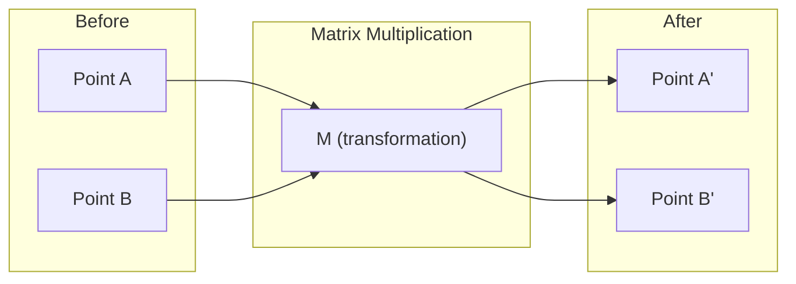
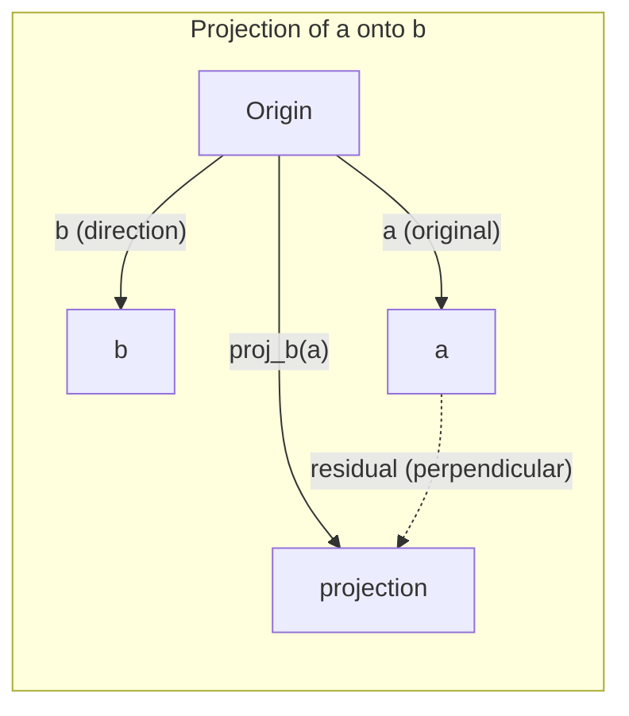

# Intuicja algebry liniowej

> Każdy model sztucznej inteligencji to po prostu matematyka macierzowa w fantazyjnym kapeluszu.

**Typ:** Ucz się
**Języki:** Python, Julia
**Wymagania:** Faza 0
**Czas:** ~60 minut

## Cele nauczania

- Implementuj operacje na wektorach i macierzach (dodawanie, iloczyn skalarny, mnożenie macierzy) od podstaw w Pythonie
- Wyjaśnij geometrycznie, na czym polega iloczyn skalarny, projekcja i proces Grama-Schmidta
- Wyznaczanie liniowej niezależności, rangi i podstawy zbioru wektorów za pomocą redukcji wierszy
- Połącz koncepcje algebry liniowej z ich zastosowaniami AI: osadzanie, wyniki uwagi i LoRA

## Problem

Otwórz dowolny papier ML. Na pierwszej stronie zobaczysz wektory, macierze, iloczyny skalarne i transformacje. Bez intuicji algebry liniowej są to tylko symbole. Dzięki niemu możesz zobaczyć, co faktycznie robi sieć neuronowa – przesuwając punkty w przestrzeni.

Nie musisz być matematykiem. Musisz zobaczyć, co te operacje oznaczają geometrycznie, a następnie samodzielnie je zakodować.

## Koncepcja

### Wektory to punkty (i kierunki)

Wektor to po prostu lista liczb. Ale te liczby coś znaczą – są to współrzędne w przestrzeni.

**Wektor 2D [3, 2]:**

| x | y | Punkt |
|---|---|-------|
| 3 | 2 | Wektor wskazuje początek (0,0) do (3, 2) na płaszczyźnie |

Wektor ma wielkość sqrt(3^2 + 2^2) = sqrt(13) i jest skierowany w górę i w prawo.

W AI wektory reprezentują wszystko:
- Słowo → wektor 768 liczb (jego „znaczenie” w osadzającej się przestrzeni)
- Obraz → wektor wartości milionów pikseli
- Użytkownik → wektor preferencji

### Macierze są transformacjami

Macierz przekształca jeden wektor w drugi. Może obracać się, skalować, rozciągać lub wyświetlać.



W AI macierze SĄ modelem:
- Wagi sieci neuronowych → macierze przekształcające wejście na wyjście
- Wyniki uwagi → matryce decydujące, na czym się skupić
- Osadzenia → macierze odwzorowujące słowa na wektory

### Iloczyn skalarny mierzy podobieństwo

Iloczyn skalarny dwóch wektorów mówi, jak bardzo są one podobne.

```
a · b = a₁×b₁ + a₂×b₂ + ... + aₙ×bₙ

Same direction:      a · b > 0  (similar)
Perpendicular:       a · b = 0  (unrelated)
Opposite direction:  a · b < 0  (dissimilar)
```

Dosłownie tak działają wyszukiwarki, systemy rekomendacji i RAG — znajdź wektory z produktami o wysokiej kropce.

### Niezależność liniowa

Wektory są liniowo niezależne, jeśli żaden wektor w zbiorze nie może być zapisany jako kombinacja pozostałych. Jeśli v1, v2, v3 są niezależne, obejmują przestrzeń 3D. Jeśli jeden jest kombinacją pozostałych, obejmują one tylko płaszczyznę.

Dlaczego ma to znaczenie dla sztucznej inteligencji: macierz funkcji powinna mieć liniowo niezależne kolumny. Jeśli dwie cechy są doskonale skorelowane (liniowo zależne), model nie jest w stanie rozróżnić ich efektów. Powoduje to wielowspółliniowość w regresji — macierz wag staje się niestabilna, a niewielkie zmiany wejściowe powodują gwałtowne wahania wyników.

**Konkretny przykład:**

```
v1 = [1, 0, 0]
v2 = [0, 1, 0]
v3 = [2, 1, 0]   # v3 = 2*v1 + v2
```

v1 i v2 są niezależne - żadne z nich nie jest wielokrotnością skalarną ani kombinacją drugiego. Ale v3 = 2*v1 + v2, więc {v1, v2, v3} jest zbiorem zależnym. Wszystkie te trzy wektory leżą w płaszczyźnie xy. Bez względu na to, jak je połączysz, nie możesz osiągnąć [0, 0, 1]. Masz trzy wektory, ale tylko dwa wymiary wolności.

W zbiorze danych: jeśli cecha_3 = 2*cecha_1 + cecha_2, dodanie cechy_3 daje modelowi zero nowych informacji. Co gorsza, równania normalne stają się osobliwe – nie ma unikalnego rozwiązania dla wag.

### Podstawa i ranga

Baza to minimalny zbiór liniowo niezależnych wektorów rozciągających się na całą przestrzeń. Liczba wektorów bazowych jest wymiarem przestrzeni.

Standardową podstawą przestrzeni 3D jest {[1,0,0], [0,1,0], [0,0,1]}. Ale dowolne trzy niezależne wektory w 3D stanowią ważną podstawę. Wybór podstawy jest wyborem układu współrzędnych.

Ranga macierzy = liczba liniowo niezależnych kolumn = liczba liniowo niezależnych wierszy. Jeśli ranga < min(wiersze, kolumny), macierz nie ma rang. To oznacza:
- Układ ma nieskończenie wiele rozwiązań (lub nie ma ich wcale)
- Informacje są tracone w procesie transformacji
- Macierzy nie można odwrócić

| Sytuacja | Ranga | Co to oznacza dla ML |
|----------|------|----------|
| Pełna ranga (ranga = min(m, n)) | Maksymalnie możliwe | Istnieje unikalne rozwiązanie metodą najmniejszych kwadratów. Model jest w dobrym stanie. |
| Brak rangi (ranga < min(m, n)) | Poniżej maksimum | Funkcje są zbędne. Nieskończenie wiele rozwiązań wagowych. Potrzebna regularyzacja. |
| Miejsce 1 | 1 | Każda kolumna jest skalowaną kopią jednego wektora. Wszystkie dane leżą na jednej linii. |
| Prawie brak rangi (małe wartości pojedyncze) | Liczbowo niskie | Matryca jest źle uwarunkowana. Niewielki szum wejściowy powoduje duże zmiany wyjściowe. Użyj obcięcia SVD lub regresji grzbietu. |

### Projekcja

Rzutowanie wektora **a** na wektor **b** daje składową **a** w kierunku **b**:

```
proj_b(a) = (a dot b / b dot b) * b
```

Reszta (a - proj_b(a)) jest prostopadła do b. Ten rozkład ortogonalny jest podstawą dopasowania metodą najmniejszych kwadratów.

Projekcja jest wszędzie w ML:
- Regresja liniowa minimalizuje odległość obserwacji od przestrzeni kolumn - rozwiązaniem JEST rzut
- PCA rzutuje dane na kierunki maksymalnej wariancji
- Uwaga w transformatorach oblicza projekcje zapytań na klucze



**Przykład:** a = [3, 4], b = [1, 0]

proj_b(a) = (3*1 + 4*0) / (1*1 + 0*0) * [1, 0] = 3 * [1, 0] = [3, 0]

Rzut opuszcza składnik y. Jest to redukcja wymiarowości w najprostszej formie – wyrzuć kierunki, na których ci nie zależy.

### Proces Grama-Schmidta

Konwersja dowolnego zbioru niezależnych wektorów na bazę ortonormalną. Ortonormalny oznacza, że ​​każdy wektor ma długość 1, a każda para jest prostopadła.

Algorytm:
1. Weź pierwszy wektor, znormalizuj go
2. Weź drugi wektor, odejmij jego rzut na pierwszy, znormalizuj
3. Weź trzeci wektor, odejmij jego rzuty na wszystkie poprzednie wektory, normalizuj
4. Powtórz dla pozostałych wektorów

```
Input:  v1, v2, v3, ... (linearly independent)

u1 = v1 / |v1|

w2 = v2 - (v2 dot u1) * u1
u2 = w2 / |w2|

w3 = v3 - (v3 dot u1) * u1 - (v3 dot u2) * u2
u3 = w3 / |w3|

Output: u1, u2, u3, ... (orthonormal basis)
```

Tak działa rozkład QR wewnętrznie. Q jest bazą ortonormalną, R oznacza współczynniki projekcji. Rozkład QR jest stosowany w:
- Rozwiązywanie układów liniowych (bardziej stabilne niż eliminacja Gaussa)
- Obliczanie wartości własnych (algorytm QR)
- Regresja metodą najmniejszych kwadratów (standardowa metoda numeryczna)

## Zbuduj to

### Krok 1: Wektory od podstaw (Python)

```python
class Vector:
    def __init__(self, components):
        self.components = list(components)
        self.dim = len(self.components)

    def __add__(self, other):
        return Vector([a + b for a, b in zip(self.components, other.components)])

    def __sub__(self, other):
        return Vector([a - b for a, b in zip(self.components, other.components)])

    def dot(self, other):
        return sum(a * b for a, b in zip(self.components, other.components))

    def magnitude(self):
        return sum(x**2 for x in self.components) ** 0.5

    def normalize(self):
        mag = self.magnitude()
        return Vector([x / mag for x in self.components])

    def cosine_similarity(self, other):
        return self.dot(other) / (self.magnitude() * other.magnitude())

    def __repr__(self):
        return f"Vector({self.components})"

a = Vector([1, 2, 3])
b = Vector([4, 5, 6])

print(f"a + b = {a + b}")
print(f"a · b = {a.dot(b)}")
print(f"|a| = {a.magnitude():.4f}")
print(f"cosine similarity = {a.cosine_similarity(b):.4f}")
```

### Krok 2: Macierze od podstaw (Python)

```python
class Matrix:
    def __init__(self, rows):
        self.rows = [list(row) for row in rows]
        self.shape = (len(self.rows), len(self.rows[0]))

    def __matmul__(self, other):
        if isinstance(other, Vector):
            return Vector([
                sum(self.rows[i][j] * other.components[j] for j in range(self.shape[1]))
                for i in range(self.shape[0])
            ])
        rows = []
        for i in range(self.shape[0]):
            row = []
            for j in range(other.shape[1]):
                row.append(sum(
                    self.rows[i][k] * other.rows[k][j]
                    for k in range(self.shape[1])
                ))
            rows.append(row)
        return Matrix(rows)

    def transpose(self):
        return Matrix([
            [self.rows[j][i] for j in range(self.shape[0])]
            for i in range(self.shape[1])
        ])

    def __repr__(self):
        return f"Matrix({self.rows})"

rotation_90 = Matrix([[0, -1], [1, 0]])
point = Vector([3, 1])

rotated = rotation_90 @ point
print(f"Original: {point}")
print(f"Rotated 90°: {rotated}")
```

### Krok 3: Dlaczego ma to znaczenie dla sztucznej inteligencji

```python
import random

random.seed(42)
weights = Matrix([[random.gauss(0, 0.1) for _ in range(3)] for _ in range(2)])
input_vector = Vector([1.0, 0.5, -0.3])

output = weights @ input_vector
print(f"Input (3D): {input_vector}")
print(f"Output (2D): {output}")
print("This is what a neural network layer does -- matrix multiplication.")
```

### Krok 4: Wersja dla Julii

```julia
a = [1.0, 2.0, 3.0]
b = [4.0, 5.0, 6.0]

println("a + b = ", a + b)
println("a · b = ", a ⋅ b)       # Julia supports unicode operators
println("|a| = ", √(a ⋅ a))
println("cosine = ", (a ⋅ b) / (√(a ⋅ a) * √(b ⋅ b)))

# Matrix-vector multiplication
W = [0.1 -0.2 0.3; 0.4 0.5 -0.1]
x = [1.0, 0.5, -0.3]
println("Wx = ", W * x)
println("This is a neural network layer.")
```

### Krok 5: Niezależność liniowa i projekcja od podstaw (Python)

```python
def is_linearly_independent(vectors):
    n = len(vectors)
    dim = len(vectors[0].components)
    mat = Matrix([v.components[:] for v in vectors])
    rows = [row[:] for row in mat.rows]
    rank = 0
    for col in range(dim):
        pivot = None
        for row in range(rank, len(rows)):
            if abs(rows[row][col]) > 1e-10:
                pivot = row
                break
        if pivot is None:
            continue
        rows[rank], rows[pivot] = rows[pivot], rows[rank]
        scale = rows[rank][col]
        rows[rank] = [x / scale for x in rows[rank]]
        for row in range(len(rows)):
            if row != rank and abs(rows[row][col]) > 1e-10:
                factor = rows[row][col]
                rows[row] = [rows[row][j] - factor * rows[rank][j] for j in range(dim)]
        rank += 1
    return rank == n

def project(a, b):
    scalar = a.dot(b) / b.dot(b)
    return Vector([scalar * x for x in b.components])

def gram_schmidt(vectors):
    orthonormal = []
    for v in vectors:
        w = v
        for u in orthonormal:
            proj = project(w, u)
            w = w - proj
        if w.magnitude() < 1e-10:
            continue
        orthonormal.append(w.normalize())
    return orthonormal

v1 = Vector([1, 0, 0])
v2 = Vector([1, 1, 0])
v3 = Vector([1, 1, 1])
basis = gram_schmidt([v1, v2, v3])
for i, u in enumerate(basis):
    print(f"u{i+1} = {u}")
    print(f"  |u{i+1}| = {u.magnitude():.6f}")

print(f"u1 · u2 = {basis[0].dot(basis[1]):.6f}")
print(f"u1 · u3 = {basis[0].dot(basis[2]):.6f}")
print(f"u2 · u3 = {basis[1].dot(basis[2]):.6f}")
```

## Użyj tego

Teraz to samo z NumPy - czego będziesz używać w praktyce:

```python
import numpy as np

a = np.array([1, 2, 3], dtype=float)
b = np.array([4, 5, 6], dtype=float)

print(f"a + b = {a + b}")
print(f"a · b = {np.dot(a, b)}")
print(f"|a| = {np.linalg.norm(a):.4f}")
print(f"cosine = {np.dot(a, b) / (np.linalg.norm(a) * np.linalg.norm(b)):.4f}")

W = np.random.randn(2, 3) * 0.1
x = np.array([1.0, 0.5, -0.3])
print(f"Wx = {W @ x}")
```

### Ranga, projekcja i QR za pomocą NumPy

```python
import numpy as np

A = np.array([[1, 2], [2, 4]])
print(f"Rank: {np.linalg.matrix_rank(A)}")

a = np.array([3, 4])
b = np.array([1, 0])
proj = (np.dot(a, b) / np.dot(b, b)) * b
print(f"Projection of {a} onto {b}: {proj}")

Q, R = np.linalg.qr(np.random.randn(3, 3))
print(f"Q is orthogonal: {np.allclose(Q @ Q.T, np.eye(3))}")
print(f"R is upper triangular: {np.allclose(R, np.triu(R))}")
```

### PyTorch — Tensory to wektory z funkcją automatycznego różnicowania

```python
import torch

x = torch.randn(3, requires_grad=True)
y = torch.tensor([1.0, 0.0, 0.0])

similarity = torch.dot(x, y)
similarity.backward()

print(f"x = {x.data}")
print(f"y = {y.data}")
print(f"dot product = {similarity.item():.4f}")
print(f"d(dot)/dx = {x.grad}")
```

Gradient iloczynu skalarnego względem x wynosi po prostu y. PyTorch obliczył to automatycznie. Każda operacja w sieci neuronowej składa się z takich operacji – mnożenia macierzy, iloczynów skalarnych, rzutów – a funkcja automatycznego porównywania śledzi gradienty w nich wszystkich.

Właśnie zbudowałeś od zera to, co robi NumPy w jednej linii. Teraz już wiesz, co dzieje się pod maską.

## Wyślij to

Ta lekcja daje:
- `outputs/prompt-linear-algebra-tutor.md` – zachęta dla asystentów AI, aby uczyli algebry liniowej poprzez intuicję geometryczną

## Połączenia

Wszystko w tej lekcji łączy się z konkretnymi częściami współczesnej sztucznej inteligencji:

| Koncepcja | Gdzie się pojawia |
|--------|--------------------------------|
| Produkt kropkowy | Wyniki uwagi w transformatorach, podobieństwo cosinus w RAG |
| Pomnóż macierz | Każda warstwa sieci neuronowej, każda transformacja liniowa |
| Niezależność liniowa | Wybór cech, unikanie współliniowości |
| Ranga | Ustalanie, czy system jest rozwiązywalny, LoRA (adaptacja niskiego rzędu) |
| Projekcja | Regresja liniowa (rzutowanie na przestrzeń kolumn), PCA |
| Gram-Schmidt / QR | Solwery numeryczne, obliczanie wartości własnych |
| Baza ortonormalna | Stabilne obliczenia numeryczne, transformacje wybielające |

Na szczególną uwagę zasługuje LoRA. Dostraja duże modele językowe, rozkładając aktualizacje wag na macierze niskiej rangi. Zamiast aktualizować macierz wag 4096x4096 (parametry 16M), LoRA aktualizuje dwie macierze o rozmiarach 4096x16 i 16x4096 (parametry 131K). Ograniczenie rangi 16 oznacza, że ​​LoRA zakłada, że ​​aktualizacja wagi znajduje się w 16-wymiarowej podprzestrzeni pełnej 4096-wymiarowej przestrzeni. To jest algebra liniowa wykonująca prawdziwą pracę.

## Ćwiczenia

1. Zaimplementuj `Vector.angle_between(other)`, który zwraca kąt w stopniach pomiędzy dwoma wektorami
2. Utwórz macierz skalowania 2D, która podwoi współrzędną x i potroi współrzędną y, a następnie zastosuj ją do wektora [1, 1]
3. Biorąc pod uwagę 5 losowych wektorów słów (wymiar 50), znajdź dwa najbardziej podobne, korzystając z podobieństwa cosinus
4. Sprawdź, czy wynik Grama-Schmidta jest naprawdę ortonormalny: sprawdź, czy każda para ma iloczyn skalarny 0, a każdy wektor ma wielkość 1
5. Utwórz macierz 3x3 o randze 2. Zweryfikuj za pomocą metody `rank()`. Następnie wyjaśnij, jaki obiekt geometryczny rozciągają się na kolumny.
6. Rzuć wektor [1, 2, 3] na [1, 1, 1]. Co wynik reprezentuje geometrycznie?

## Kluczowe terminy

| Termin | Co ludzie mówią | Co to właściwie oznacza |
|------|----------------|----------------------|
| wektor | „Strzałka” | Lista liczb reprezentujących punkt lub kierunek w przestrzeni n-wymiarowej |
| Matryca | „Tabela liczb” | Transformacja odwzorowująca wektory z jednej przestrzeni do drugiej |
| Produkt kropkowy | „Mnożyć i sumować” | Miara tego, jak wyrównane są dwa wektory – rdzeń wyszukiwania podobieństwa |
| Osadzanie | „Trochę magii AI” | Wektor reprezentujący znaczenie czegoś (słowa, obrazu, użytkownika) |
| Niezależność liniowa | „Nie pokrywają się” | Żaden wektor w zestawie nie może zostać zapisany jako kombinacja pozostałych |
| Ranga | „Ile wymiarów” | Liczba liniowo niezależnych kolumn (lub wierszy) w macierzy |
| Projekcja | „Cień” | Składowa jednego wektora w kierunku innego |
| Podstawa | „Osie współrzędnych” | Minimalny zbiór niezależnych wektorów rozciągających się na przestrzeń |
| Ortonormalny | „Prostopadłe wektory jednostkowe” | Wektory, które są wzajemnie prostopadłe i każdy ma długość 1 |