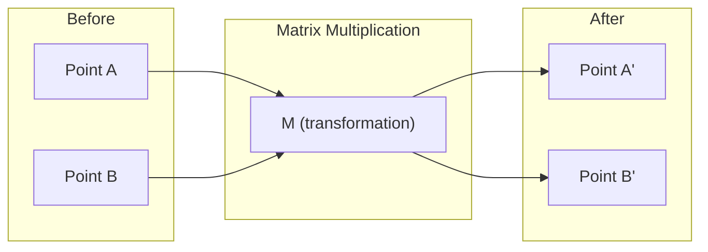
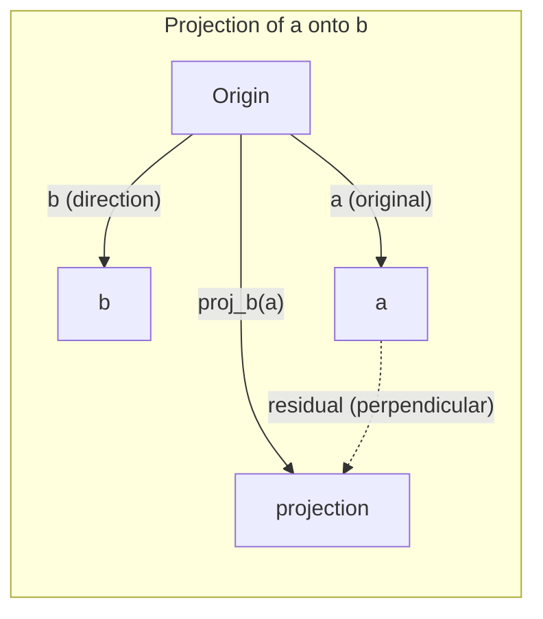

# Intuicja algebry liniowej

> Każdy model AI to po prostu matematyka macierzowa w eleganckim przebraniu.

**Typ:** Nauka
**Języki:** Python, Julia
**Wymagania wstępne:** Faza 0
**Czas:** ~60 minut

## Cele nauki

- Zaimplementować operacje na wektorach i macierzach (dodawanie, iloczyn skalarny, mnożenie macierzy) od podstaw w Pythonie
- Wyjaśnić geometrycznie, na czym polegają iloczyn skalarny, rzut (projekcja) i proces Grama-Schmidta
- Określić liniową niezależność, rząd i bazę zbioru wektorów za pomocą eliminacji wierszowej
- Połączyć pojęcia algebry liniowej z ich zastosowaniami w AI: embeddingami, wynikami uwagi (attention) i LoRA

## Problem

Otwórz dowolny artykuł naukowy o ML. Już na pierwszej stronie zobaczysz wektory, macierze, iloczyny skalarne i transformacje. Bez intuicji algebry liniowej są to tylko symbole. Z nią widzisz, co naprawdę robi sieć neuronowa -- przesuwa punkty w przestrzeni.

Nie musisz być matematykiem. Musisz zobaczyć, co te operacje oznaczają geometrycznie, a następnie zaimplementować je samodzielnie.

## Koncepcja

### Wektory to punkty (i kierunki)

Wektor to po prostu lista liczb. Ale te liczby coś oznaczają -- są współrzędnymi w przestrzeni.

**Wektor 2D [3, 2]:**

| x | y | Punkt |
|---|---|-------|
| 3 | 2 | Wektor wskazuje od początku układu współrzędnych (0,0) do punktu (3, 2) na płaszczyźnie |

Wektor ma długość sqrt(3^2 + 2^2) = sqrt(13) i wskazuje w górę i w prawo.

W AI wektory reprezentują wszystko:
- Słowo → wektor 768 liczb (jego "znaczenie" w przestrzeni embeddingów)
- Obraz → wektor milionów wartości pikseli
- Użytkownik → wektor preferencji

### Macierze to transformacje

Macierz przekształca jeden wektor w inny. Może obracać, skalować, rozciągać lub rzutować.



W AI macierze SĄ modelem:
- Wagi sieci neuronowej → macierze przekształcające wejście w wyjście
- Wyniki uwagi (attention scores) → macierze decydujące, na czym się skupić
- Embeddingi → macierze mapujące słowa na wektory

### Iloczyn skalarny mierzy podobieństwo

Iloczyn skalarny dwóch wektorów mówi, jak bardzo są do siebie podobne.

```
a · b = a₁×b₁ + a₂×b₂ + ... + aₙ×bₙ

Ten sam kierunek:        a · b > 0  (podobne)
Prostopadłe:              a · b = 0  (niepowiązane)
Przeciwny kierunek:       a · b < 0  (różne)
```

Dokładnie tak działają wyszukiwarki, systemy rekomendacji i RAG -- znajdują wektory o wysokim iloczynie skalarnym.

### Liniowa niezależność

Wektory są liniowo niezależne, jeśli żaden wektor ze zbioru nie może być zapisany jako kombinacja pozostałych. Jeśli v1, v2, v3 są niezależne, rozpinają przestrzeń 3D. Jeśli jeden z nich jest kombinacją pozostałych, rozpinają tylko płaszczyznę.

Dlaczego ma to znaczenie dla AI: macierz cech powinna mieć liniowo niezależne kolumny. Jeśli dwie cechy są ze sobą idealnie skorelowane (liniowo zależne), model nie jest w stanie odróżnić ich wpływu. Powoduje to współliniowość (multicollinearity) w regresji -- macierz wag staje się niestabilna, a małe zmiany na wejściu powodują gwałtowne zmiany na wyjściu.

**Konkretny przykład:**

```
v1 = [1, 0, 0]
v2 = [0, 1, 0]
v3 = [2, 1, 0]   # v3 = 2*v1 + v2
```

v1 i v2 są niezależne -- żaden z nich nie jest wielokrotnością skalarną ani kombinacją drugiego. Ale v3 = 2*v1 + v2, więc {v1, v2, v3} jest zbiorem zależnym. Te trzy wektory leżą na płaszczyźnie xy. Bez względu na to, jak je połączysz, nie da się otrzymać [0, 0, 1]. Masz trzy wektory, ale tylko dwa wymiary swobody.

W zbiorze danych: jeśli feature_3 = 2*feature_1 + feature_2, dodanie feature_3 nie wnosi do modelu żadnej nowej informacji. Co gorsza, sprawia, że równania normalne stają się osobliwe -- nie istnieje jednoznaczne rozwiązanie dla wag.

### Baza i rząd

Baza to minimalny zbiór liniowo niezależnych wektorów rozpinających całą przestrzeń. Liczba wektorów bazowych to wymiar przestrzeni.

Bazą standardową dla przestrzeni 3D jest {[1,0,0], [0,1,0], [0,0,1]}. Ale dowolne trzy niezależne wektory w 3D tworzą poprawną bazę. Wybór bazy to wybór układu współrzędnych.

Rząd macierzy = liczba liniowo niezależnych kolumn = liczba liniowo niezależnych wierszy. Jeśli rząd < min(wiersze, kolumny), macierz ma niepełny rząd (rank-deficient). Oznacza to, że:
- Układ ma nieskończenie wiele rozwiązań (lub żadnego)
- Informacja jest tracona w transformacji
- Macierzy nie da się odwrócić

| Sytuacja | Rząd | Co to oznacza dla ML |
|-----------|------|---------------------|
| Pełny rząd (rząd = min(m, n)) | Maksymalny możliwy | Istnieje jednoznaczne rozwiązanie najmniejszych kwadratów. Model jest dobrze uwarunkowany. |
| Niepełny rząd (rząd < min(m, n)) | Poniżej maksymalnego | Cechy są nadmiarowe (redundantne). Nieskończenie wiele rozwiązań dla wag. Potrzebna regularyzacja. |
| Rząd 1 | 1 | Każda kolumna jest przeskalowaną kopią jednego wektora. Wszystkie dane leżą na linii. |
| Bliski niepełnemu rzędowi (małe wartości osobliwe) | Numerycznie niski | Macierz jest źle uwarunkowana. Niewielki szum na wejściu powoduje duże zmiany na wyjściu. Użyj obcięcia SVD lub regresji grzbietowej (ridge). |

### Rzut (projekcja)

Rzutowanie wektora **a** na wektor **b** daje składową **a** w kierunku **b**:

```
proj_b(a) = (a dot b / b dot b) * b
```

Reszta (a - proj_b(a)) jest prostopadła do b. Ten ortogonalny rozkład jest podstawą dopasowania metodą najmniejszych kwadratów.

Rzutowanie jest wszędzie w ML:
- Regresja liniowa minimalizuje odległość obserwacji od przestrzeni kolumnowej -- rozwiązanie JEST rzutem
- PCA rzutuje dane na kierunki maksymalnej wariancji
- Mechanizm uwagi (attention) w transformerach oblicza rzuty zapytań (queries) na klucze (keys)



**Przykład:** a = [3, 4], b = [1, 0]

proj_b(a) = (3*1 + 4*0) / (1*1 + 0*0) * [1, 0] = 3 * [1, 0] = [3, 0]

Rzut odrzuca składową y. To redukcja wymiarowości w najprostszej postaci -- wyrzucamy kierunki, które nas nie interesują.

### Proces Grama-Schmidta

Przekształcanie dowolnego zbioru niezależnych wektorów w bazę ortonormalną. Ortonormalna oznacza, że każdy wektor ma długość 1, a każda para jest prostopadła.

Algorytm:
1. Weź pierwszy wektor, znormalizuj go
2. Weź drugi wektor, odejmij jego rzut na pierwszy, znormalizuj
3. Weź trzeci wektor, odejmij jego rzuty na wszystkie poprzednie wektory, znormalizuj
4. Powtórz dla pozostałych wektorów

```
Wejście:  v1, v2, v3, ... (liniowo niezależne)

u1 = v1 / |v1|

w2 = v2 - (v2 dot u1) * u1
u2 = w2 / |w2|

w3 = v3 - (v3 dot u1) * u1 - (v3 dot u2) * u2
u3 = w3 / |w3|

Wyjście: u1, u2, u3, ... (baza ortonormalna)
```

Tak właśnie działa wewnętrznie rozkład QR. Q to baza ortonormalna, R przechowuje współczynniki rzutów. Rozkład QR jest wykorzystywany do:
- Rozwiązywania układów liniowych (bardziej stabilne niż eliminacja Gaussa)
- Obliczania wartości własnych (algorytm QR)
- Regresji metodą najmniejszych kwadratów (standardowa metoda numeryczna)

## Zbuduj to

### Krok 1: Wektory od podstaw (Python)

```python
class Vector:
    def __init__(self, components):
        self.components = list(components)
        self.dim = len(self.components)

    def __add__(self, other):
        return Vector([a + b for a, b in zip(self.components, other.components)])

    def __sub__(self, other):
        return Vector([a - b for a, b in zip(self.components, other.components)])

    def dot(self, other):
        return sum(a * b for a, b in zip(self.components, other.components))

    def magnitude(self):
        return sum(x**2 for x in self.components) ** 0.5

    def normalize(self):
        mag = self.magnitude()
        return Vector([x / mag for x in self.components])

    def cosine_similarity(self, other):
        return self.dot(other) / (self.magnitude() * other.magnitude())

    def __repr__(self):
        return f"Vector({self.components})"


a = Vector([1, 2, 3])
b = Vector([4, 5, 6])

print(f"a + b = {a + b}")
print(f"a · b = {a.dot(b)}")
print(f"|a| = {a.magnitude():.4f}")
print(f"cosine similarity = {a.cosine_similarity(b):.4f}")
```

### Krok 2: Macierze od podstaw (Python)

```python
class Matrix:
    def __init__(self, rows):
        self.rows = [list(row) for row in rows]
        self.shape = (len(self.rows), len(self.rows[0]))

    def __matmul__(self, other):
        if isinstance(other, Vector):
            return Vector([
                sum(self.rows[i][j] * other.components[j] for j in range(self.shape[1]))
                for i in range(self.shape[0])
            ])
        rows = []
        for i in range(self.shape[0]):
            row = []
            for j in range(other.shape[1]):
                row.append(sum(
                    self.rows[i][k] * other.rows[k][j]
                    for k in range(self.shape[1])
                ))
            rows.append(row)
        return Matrix(rows)

    def transpose(self):
        return Matrix([
            [self.rows[j][i] for j in range(self.shape[0])]
            for i in range(self.shape[1])
        ])

    def __repr__(self):
        return f"Matrix({self.rows})"


rotation_90 = Matrix([[0, -1], [1, 0]])
point = Vector([3, 1])

rotated = rotation_90 @ point
print(f"Original: {point}")
print(f"Rotated 90°: {rotated}")
```

### Krok 3: Dlaczego ma to znaczenie dla AI

```python
import random

random.seed(42)
weights = Matrix([[random.gauss(0, 0.1) for _ in range(3)] for _ in range(2)])
input_vector = Vector([1.0, 0.5, -0.3])

output = weights @ input_vector
print(f"Input (3D): {input_vector}")
print(f"Output (2D): {output}")
print("This is what a neural network layer does -- matrix multiplication.")
```

### Krok 4: Wersja w Julii

```julia
a = [1.0, 2.0, 3.0]
b = [4.0, 5.0, 6.0]

println("a + b = ", a + b)
println("a · b = ", a ⋅ b)       # Julia supports unicode operators
println("|a| = ", √(a ⋅ a))
println("cosine = ", (a ⋅ b) / (√(a ⋅ a) * √(b ⋅ b)))

# Matrix-vector multiplication
W = [0.1 -0.2 0.3; 0.4 0.5 -0.1]
x = [1.0, 0.5, -0.3]
println("Wx = ", W * x)
println("This is a neural network layer.")
```

### Krok 5: Liniowa niezależność i rzutowanie od podstaw (Python)

```python
def is_linearly_independent(vectors):
    n = len(vectors)
    dim = len(vectors[0].components)
    mat = Matrix([v.components[:] for v in vectors])
    rows = [row[:] for row in mat.rows]
    rank = 0
    for col in range(dim):
        pivot = None
        for row in range(rank, len(rows)):
            if abs(rows[row][col]) > 1e-10:
                pivot = row
                break
        if pivot is None:
            continue
        rows[rank], rows[pivot] = rows[pivot], rows[rank]
        scale = rows[rank][col]
        rows[rank] = [x / scale for x in rows[rank]]
        for row in range(len(rows)):
            if row != rank and abs(rows[row][col]) > 1e-10:
                factor = rows[row][col]
                rows[row] = [rows[row][j] - factor * rows[rank][j] for j in range(dim)]
        rank += 1
    return rank == n


def project(a, b):
    scalar = a.dot(b) / b.dot(b)
    return Vector([scalar * x for x in b.components])


def gram_schmidt(vectors):
    orthonormal = []
    for v in vectors:
        w = v
        for u in orthonormal:
            proj = project(w, u)
            w = w - proj
        if w.magnitude() < 1e-10:
            continue
        orthonormal.append(w.normalize())
    return orthonormal


v1 = Vector([1, 0, 0])
v2 = Vector([1, 1, 0])
v3 = Vector([1, 1, 1])
basis = gram_schmidt([v1, v2, v3])
for i, u in enumerate(basis):
    print(f"u{i+1} = {u}")
    print(f"  |u{i+1}| = {u.magnitude():.6f}")

print(f"u1 · u2 = {basis[0].dot(basis[1]):.6f}")
print(f"u1 · u3 = {basis[0].dot(basis[2]):.6f}")
print(f"u2 · u3 = {basis[1].dot(basis[2]):.6f}")
```

## Zastosuj to

Teraz to samo z NumPy -- czyli to, czego naprawdę będziesz używać w praktyce:

```python
import numpy as np

a = np.array([1, 2, 3], dtype=float)
b = np.array([4, 5, 6], dtype=float)

print(f"a + b = {a + b}")
print(f"a · b = {np.dot(a, b)}")
print(f"|a| = {np.linalg.norm(a):.4f}")
print(f"cosine = {np.dot(a, b) / (np.linalg.norm(a) * np.linalg.norm(b)):.4f}")

W = np.random.randn(2, 3) * 0.1
x = np.array([1.0, 0.5, -0.3])
print(f"Wx = {W @ x}")
```

### Rząd, rzut i QR z NumPy

```python
import numpy as np

A = np.array([[1, 2], [2, 4]])
print(f"Rank: {np.linalg.matrix_rank(A)}")

a = np.array([3, 4])
b = np.array([1, 0])
proj = (np.dot(a, b) / np.dot(b, b)) * b
print(f"Projection of {a} onto {b}: {proj}")

Q, R = np.linalg.qr(np.random.randn(3, 3))
print(f"Q is orthogonal: {np.allclose(Q @ Q.T, np.eye(3))}")
print(f"R is upper triangular: {np.allclose(R, np.triu(R))}")
```

### PyTorch -- tensory to wektory z autodiff

```python
import torch

x = torch.randn(3, requires_grad=True)
y = torch.tensor([1.0, 0.0, 0.0])

similarity = torch.dot(x, y)
similarity.backward()

print(f"x = {x.data}")
print(f"y = {y.data}")
print(f"dot product = {similarity.item():.4f}")
print(f"d(dot)/dx = {x.grad}")
```

Gradient iloczynu skalarnego względem x to po prostu y. PyTorch obliczył to automatycznie. Każda operacja w sieci neuronowej jest zbudowana z operacji takich jak ta -- mnożenia macierzy, iloczyny skalarne, rzuty -- a autodiff śledzi gradienty przez wszystkie z nich.

Właśnie zbudowałeś od podstaw to, co NumPy robi w jednej linii. Teraz wiesz, co dzieje się "pod maską".

## Wdróż to

Ta lekcja tworzy:
- `outputs/prompt-linear-algebra-tutor.md` -- prompt dla asystentów AI, uczący algebry liniowej poprzez intuicję geometryczną

## Powiązania

Wszystko w tej lekcji łączy się z konkretnymi elementami współczesnej AI:

| Pojęcie | Gdzie się pojawia |
|---------|------------------|
| Iloczyn skalarny | Wyniki uwagi (attention) w transformerach, podobieństwo kosinusowe w RAG |
| Mnożenie macierzy | Każda warstwa sieci neuronowej, każda transformacja liniowa |
| Liniowa niezależność | Selekcja cech, unikanie współliniowości |
| Rząd | Określanie, czy układ jest rozwiązywalny, LoRA (low-rank adaptation) |
| Rzut | Regresja liniowa (rzutowanie na przestrzeń kolumnową), PCA |
| Gram-Schmidt / QR | Solwery numeryczne, obliczanie wartości własnych |
| Baza ortonormalna | Stabilne obliczenia numeryczne, transformacje wybielające (whitening) |

LoRA zasługuje na szczególną wzmiankę. Dostraja duże modele językowe poprzez dekompozycję aktualizacji wag na macierze niskiego rzędu. Zamiast aktualizować macierz wag o wymiarach 4096x4096 (16M parametrów), LoRA aktualizuje dwie macierze o rozmiarach 4096x16 i 16x4096 (131K parametrów). Ograniczenie do rzędu 16 oznacza, że LoRA zakłada, iż aktualizacja wag mieści się w 16-wymiarowej podprzestrzeni pełnej przestrzeni 4096-wymiarowej. To algebra liniowa wykonująca realną pracę.

## Ćwiczenia

1. Zaimplementuj `Vector.angle_between(other)`, zwracającą kąt w stopniach między dwoma wektorami
2. Stwórz dwuwymiarową macierz skalującą, która podwaja współrzędną x i potraja współrzędną y, a następnie zastosuj ją do wektora [1, 1]
3. Mając 5 losowych wektorów przypominających słowa (wymiar 50), znajdź dwa najbardziej podobne za pomocą podobieństwa kosinusowego
4. Sprawdź, czy wynik procesu Grama-Schmidta jest naprawdę ortonormalny: zweryfikuj, że każda para ma iloczyn skalarny 0, a każdy wektor ma długość 1
5. Stwórz macierz 3x3 o rzędzie 2. Zweryfikuj to za pomocą metody `rank()`. Następnie wyjaśnij, jaki obiekt geometryczny rozpinają kolumny.
6. Zrzutuj wektor [1, 2, 3] na [1, 1, 1]. Co reprezentuje wynik geometrycznie?

## Kluczowe pojęcia

| Pojęcie | Co mówią ludzie | Co to naprawdę oznacza |
|------|----------------|----------------------|
| Wektor | "Strzałka" | Lista liczb reprezentująca punkt lub kierunek w przestrzeni n-wymiarowej |
| Macierz | "Tabela liczb" | Transformacja mapująca wektory z jednej przestrzeni do drugiej |
| Iloczyn skalarny | "Pomnóż i zsumuj" | Miara tego, jak bardzo dwa wektory są zgodne kierunkowo -- rdzeń wyszukiwania podobieństwa |
| Embedding | "Jakaś magia AI" | Wektor reprezentujący znaczenie czegoś (słowa, obrazu, użytkownika) |
| Liniowa niezależność | "Nie nakładają się na siebie" | Żaden wektor ze zbioru nie może być zapisany jako kombinacja pozostałych |
| Rząd | "Ile jest wymiarów" | Liczba liniowo niezależnych kolumn (lub wierszy) macierzy |
| Rzut | "Cień" | Składowa jednego wektora w kierunku drugiego |
| Baza | "Osie układu współrzędnych" | Minimalny zbiór niezależnych wektorów rozpinających przestrzeń |
| Ortonormalny | "Prostopadłe wektory jednostkowe" | Wektory wzajemnie prostopadłe, każdy o długości 1 |
