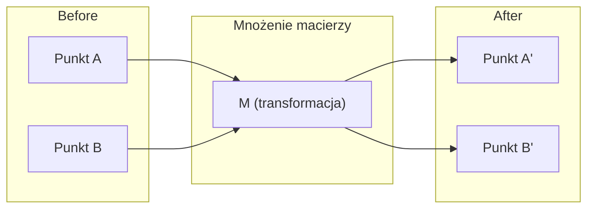
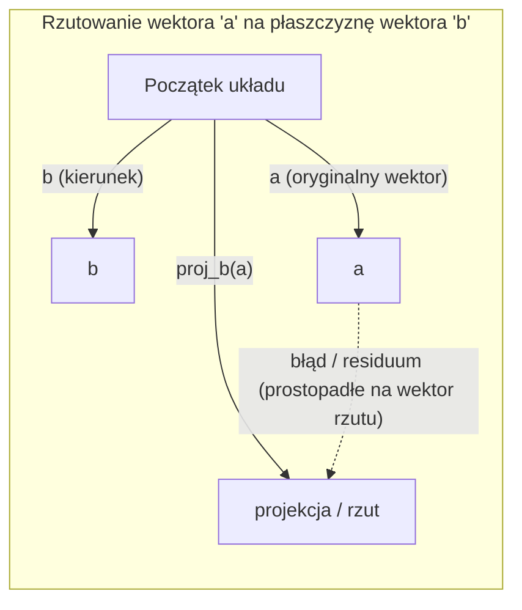

# Intuicja do algebry liniowej

> Każdy współczesny model AI to w gruncie rzeczy po prostu mnożenie macierzy ubrane w fikuśny kapelusz.

**Typ:** Nauka
**Języki:** Python, Julia
**Wymagania wstępne:** Faza 0
**Czas:** ~60 minut

## Cele nauki

- Implementacja podstawowych operacji na wektorach i macierzach (dodawanie, iloczyn skalarny, mnożenie macierzy) od zera w języku Python.
- Geometryczne wyjaśnienie czym jest iloczyn skalarny, rzutowanie (projekcja) oraz proces ortogonalizacji Grama-Schmidta.
- Wyznaczanie liniowej niezależności, rzędu macierzy i bazy wektorów z użyciem eliminacji Gaussa.
- Połączenie suchych koncepcji algebry liniowej z ich praktycznymi zastosowaniami w AI: wektorami osadzeń (embeddings), wynikami uwagi (attention scores) i mechanizmem LoRA.

## Problem

Otwórz dowolny artykuł naukowy (paper) z dziedziny uczenia maszynowego (ML). Zapewne już na pierwszej stronie zobaczysz gąszcz wektorów, macierzy, iloczynów skalarnych i transformacji. Bez odpowiedniej intuicji z zakresu algebry liniowej są to tylko niezrozumiałe, martwe symbole. Dzięki niej jednak, jesteś w stanie dokładnie dostrzec, co sieć neuronowa robi pod maską – systematycznie przesuwa i zagina punkty w wielowymiarowej przestrzeni.

Nie musisz być wybitnym matematykiem akademickim. Musisz jednak "zobaczyć", co te wszystkie operacje oznaczają z perspektywy geometrycznej, a następnie umieć zakodować je samemu.

## Koncepcja

### Wektory to punkty (i kierunki zarazem)

Wektor, z programistycznego punktu widzenia, to po prostu lista ułożonych liczb. Ale z perspektywy matematyki te liczby niosą ogromne znaczenie – reprezentują konkretne współrzędne w przestrzeni.

**Wektor 2D [3, 2]:**

| x | y | Interpretacja |
|---|---|-------|
| 3 | 2 | Wektor wskazuje kierunek i odległość od początku układu współrzędnych (0,0) do punktu (3, 2) na płaszczyźnie. |

Wektor ten ma długość (wielkość) równą `sqrt(3^2 + 2^2) = sqrt(13)` i jest skierowany w prawo oraz w górę.

W świecie AI wektory reprezentują absolutnie wszystko:
- Pojedyncze słowo → staje się wektorem o np. 768 liczbach (przechowującym jego geometryczne „znaczenie” w przestrzeni wielowymiarowej).
- Zdjęcie → to jeden wektor zbudowany z milionów wartości pikseli.
- Użytkownik Netflixa → to wektor jego upodobań i historii filmowej.

### Macierze to transformacje

Macierz służy do przekształcania (transformowania) jednego wektora w całkowicie inny wektor. Może obracać układ, skalować, rozciągać go lub rzutować.



W inżynierii AI, macierze SĄ de facto głównym ciałem modelu:
- Wagi (weights) w sieci neuronowej → to olbrzymie macierze nieustannie przekształcające wejścia na wyjścia.
- Punktacja uwagi (Attention scores) → to operacje na macierzach decydujące, na jakim słowie z kontekstu należy się skupić w danej chwili.
- Osadzenia (Embeddings) → to gigantyczne macierze służące jako mapa słownikowa słów i przypisanych im wektorów.

### Iloczyn skalarny (Dot Product) mierzy podobieństwo

Iloczyn skalarny dwóch wektorów to pojedyncza liczba mówiąca nam o tym, jak bardzo te wektory są do siebie "podobne" pod kątem kierunku.

```text
a · b = a₁×b₁ + a₂×b₂ + ... + aₙ×bₙ

Ten sam kierunek:           a · b > 0  (podobne)
Prostopadłe kierunki:       a · b = 0  (niepowiązane / ortogonalne)
Przeciwne kierunki:         a · b < 0  (różne)
```

To matematyczne prawo mówi dosłownie o tym, jak działają nowoczesne wyszukiwarki semantyczne, potężne systemy rekomendacji i systemy architektury RAG – pod spodem algorytm znajduje po prostu pożądane obiekty wyszukując największą wynikową z ich iloczynu skalarnego.

### Liniowa niezależność

Zestaw wektorów uważa się za liniowo niezależny, jeżeli absolutnie żaden z tych wektorów nie może zostać zbudowany z prostej, liniowej kombinacji (np. sumowania lub skalowania) reszty wektorów. Jeżeli wektory v1, v2, v3 są niezależne, to w pełni obejmują całą dostępną, trójwymiarową przestrzeń 3D. Jeżeli jeden z nich można zbudować za pomocą kombinacji pozostałej dwójki, wtedy realnie pokrywają jedynie dwuwymiarową płaszczyznę wewnątrz 3D.

Dlaczego to tak krytycznie ważne w AI: macierz cech uczących wejściowych do modelu powinna składać się z samych liniowo niezależnych kolumn. Jeśli dwie losowe cechy są ze sobą perfekcyjnie skorelowane (liniowo zależne, np. podajesz wagę zarówno w kilogramach, jak i funtach), proces nauki modelu nie będzie w żaden sposób potrafił i mógł odróżnić efektów każdego z nich z osobna. Doprowadzi to w systemie analitycznym do tzw. współliniowości. Od tego momentu ogromna macierz wag sieci zaczyna być katastroficznie wręcz niestabilna, przez co mikroskopijnie nieznaczne szumy w nowym sygnale wejściowym spowodują nagłe, niepotrzebnie potężne skoki usterkowe i wahania w generowanym wyniku predykcji końcowej wyplutej przez taki wadliwy model.

**Prosty przykład:**

```text
v1 = [1, 0, 0]
v2 = [0, 1, 0]
v3 = [2, 1, 0]   # Zauważ: v3 = 2*v1 + v2
```

Zbiory wektorów `v1` oraz `v2` są wybitnie i obiektywnie od siebie niezależne - żadne z nich nie jest wielokrotnością ani zbudowanym klonem tego drugiego. Zatem posługując się jedynie samymi zbiorem wektorów `v1` i `v2` mamy pełną swobodę wyjścia w dowolne punkty zawarte w obrębie uformowanej dwuwymiarowej rozległej płaszczyzny XY. Ale dorzucenie na pokład struktury wektora `v3` jest bezużyteczne! Jakikolwiek ruch wokół wektora v3 jest od razu osiągalny tylko za pomocą manipulacji dwiema uprzednio już uformowanymi osiami.

Dodając na produkcję cechę `feature_3 = 2*feature_1 + feature_2`, dorzucasz po prostu sieci zero nowej puli mądrych informacji. Do tego, przez taki pusty balast w systemie normalne i poprawne równania sieci stają się nieregularne. Twój program napotyka tu potężny problem ślepej nieskończoności - przestaje nagle istnieć jakikolwiek optymalny punkt jednoznacznie rozwiązujący odpowiednie wagi dla takiej warstwy pod daną sieć.

### Baza wektorowa i Rząd (Rank)

Baza to matematyczny, esencjonalny zbiór minimum takich całkowicie liniowo niezależnych od siebie wektorów przestrzennych, który całkowicie i wystarczająco w pełni wystarczy na rozciągnięcie całej danej otaczającej matrycy w danej liczbie wymiarów.

Standardową taką "bazą" podtrzymującą dla całego ogólnego układu sfery objętości przestrzeni z punktu 3D, bez zająknięcia są wektory jednowymiarowe na prostej: `{[1,0,0], [0,1,0], [0,0,1]}`. Jednak musisz wiedzieć, że praktycznie z definicji absolutnie dowolne trzy rozchodzące się na wskroś przestrzeni kompletnie rozdzielne kierunkowo niezależne jednostki wektorów stanowią odrębną, alternatywną lecz stuprocentowo prawidłową bazę pod 3D. Skrótowo mówiąc, wybranie jakichś wektorów jako naszej "nowej" domyślnej matematycznej Bazy to po prostu wyznaczenie od zera nowego układu współrzędnych.

Rząd macierzy (Rank) = jest równy ilości wszystkich w pełni liniowo od siebie niezależnych kolumn, lub liczbowej powiązanej kwocie w niezależnych do siebie wierszach. Gdy badany `Rząd < min(wiersze, kolumny)`, mówimy że matryca ma miano wybrakowanej (rank deficient).

A to wyciąga ze sobą z dołu poważne konsekwencje:
- Skupisko powiązanych równań dla badanej bryły traci swój z góry zdefiniowany cel i nie ma dla niego już od teraz jednoznacznego, jedynego sensownego poprawnego wyniku.
- Część cennej zebranej puli ustrukturyzowanych z wielkim trudem informacji całkowicie wycieka podczas procesu gwałtownej w skutkach niekontrolowanej kompresyjnej transformacji z matrycy (następuje zapadnięcie w głąb niższych rzędów osi układu wymiarów, redukujących gęstość informacyjną - rzut).
- Przeklętej od tego incydentu zdegradowanej macierzy nie potrafisz w żaden żywy już po ludzku odwrócić matematycznie na stronę punktu zerowego wstecz!

| Sytuacja w kodzie programu | Rząd badany (Rank) | Znaczenie pod maską Machine Learningu (ML) |
|----------|------|----------|
| Pełny poprawny Rząd macierzy | Wyciągnięto maksymalną matematyczną wyliczoną w ogóle dopuszczalną ilość | Skrupulatna metoda do znalezienia optymalnej konfiguracji najmniejszych kwadratów w programie jest możliwa i rozwiązalna do jednoznacznego punktu wyniku ułamka! Projekt modelu badawczego działa prawidłowo na twardym i solidnym podparciu matematycznym na dobrym fundamencie. |
| Braki rzędu (Deficient rank matrix) | Dużo mniej niż narzucone maksimum objętościowe w klatce bryły rzędów | Ułożone ręcznie features'y gubią informacyjnie na pusto! Nielogiczny wynik w równaniu daje modelom potężne i przerażające setki, ba miliony dróg nieobliczonych, równoprawnych poprawnie punktów dla dopasowania algorytmu po parametrach szukanej siły ciężkości rozdzielanej dla wag! Aby uspokoić panikujący kompilator będziesz tutaj niezbędnie potrzebować załączenia funkcji tak zwanego twardego zjawiska powszechnie powstrzymującej to chaotyczne wahanie w szczytach norm w systemie za pomocą wdrożenia do architektury tzw. silnej predykcyjnej regularyzacji karnej! |
| Rząd rzędu równy wartości = 1 | 1 | Kolumna w ułamku z ułożonych punktów po sprawdzeniu jest po prostu bezdusznie powieloną chamsko skalą zwyczajnej kserokopii bazowego zdefiniowanego w wierszach pierwszego punktu wymiarowego pierwotnego wektora punktów. Tak osadzone w obrocie dane to nic więcej jak wyznaczona nieskończenie prosta, zarysowana twardą kreską długa krzywa przecinająca się i leżąca pusto wymiarowo idealnie pod kątem na wyznaczonej i zdominowanej matematycznie linii. |
| Ukryta pod spodem pułapka matematyczna "Near rank-deficient / ill-conditioned matrix" (Zbadane wyniki z dziwną przypadłością o wskaźnikach ze znacząco mocno spadkowymi numerycznymi spadkami obwiedni singularnej rozkładowości osi SVD rzutowanej u dołu wyliczeń macierzy). | Numerycznie uwikłane drastycznie zredukowane, nie dające się wyłuskać na zero, z szumu. | Dana z góry do zbadania wielka struktura podrzędnie zbudowanej pod zadanie algorytmu matematycznej macierzy dla sieci cierpi brutalnie w wyniku potężnie negatywnie wygenerowanego fatalnie wadliwego "złego" uwarunkowania rozdzielczości korelacyjnej na poszczególnych warstwach cech dla zadanej funkcji szumu! Konsekwentnie z punktu w ten system wrzucony cicho w małym odsetku pozornie nieszkodliwy szum, skutkuje lawinowym pogromem wyników końcowych w modelach wysadzeniem gigantycznych aberracji do wyjściowej postaci końcowej sieci! Ominięcie polega na ucieczce pod opcję spenetrowania algorytmicznego obcinania w postaci cięć skrzydeł (truncate) lub przełączenia układu z predykcji pod matematyczną, spokojniejszą ratunkową ułożoną z góry i kontrolowaną na parametrach regresję klasy *ridge*. |

### Rzutowanie (Projekcja)

Rzut wektora **a** na dany wektor **b** obrazuje nam ile dokładnie elementu części wektora **a** pociąga i znajduje na osi ułożonej przez wyznaczany płasko pod spodem kierunkowy i ułożony w locie kątem tory odniesienia **b**:

```text
proj_b(a) = (a · b / b · b) * b
```

Różnica wynikająca z ułamków z powyższych badań pozostawiona prostopadle po tej operacji, zwana z definicji "błędem residuów matematycznych" (a - proj_b(a)) w locie prostopadle przecina się pod idealnie twardym ułożeniem 90 stopni względem odniesienia leżącego na b, stając się wyliczoną skrupulatnie podstawą całego ułożenia bazowego stosowanego potężnie do rzeźbienia i formowania powszechnie stosowanej metodyki z zakresu budowy aproksymacyjnych ujęć modelu pod badaniem krzywizn najmniejszych zliczonych wartości dopasowań ewolucyjnych dla tzw. punktowych kwadratów (The method of least squares approximation line fitting).

Projekcja leży w absolutnie wszystkich częściach dzisiejszego środowiska i potoków systemowych zbudowanego na zewnątrz pod ujęciami w świecie projektowania systemów algorytmicznych dla inżynierii dziedzin z zastosowaniem potoków sztucznej wymyślonej inteligencji i Machine Learningu:
- Zwykła płaska wielopoziomowa klasyczna regresja statystycznie podchodząca liniowo tnie odległość spadków wymiarów kolumn, zbiegając się wynikiem – bo w ujęciu formalnym wynikiem szukanego rozwiązania algorytmu regresji domyślnie *jest po prostu z góry zrobiona naturalnie* projekcja matematyczna ze rzutem pod obszar wymiarów i warstw matryc modelu przestrzeni po cechach!
- Potężna metoda stosowana na wymiarach zdefiniowana jako proces "PCA (Principal component analysis)" rzuca surowe próbki brutalnie wyciągając cechy twardo sprowadzając sprytnie na te wektory bazowe, które rzeźbią potężne pasma z punktu pod maksymalne i skrajne ułożenie największych dla zbiorów zebranych w punkcie osi odchyleń norm tzw. wariancji zbioru zdefiniowanych przez algorytm.
- Cała mechanika rdzenia oparta dumnie pod ujęcie tzw. uwagi skrzyżowanej obliczanych mechanizmów do architektur budowanych modeli w ujęciu systemów (Transformers Neural Networks Architecture System), stosowanych potężnie w LLM (np. system o budowie architektury GPT) oblicza te punkty projekcyjne na wielkich zbiorach osi kluczy i wektorów zapytania badając z wielką precyzją skalę ukrytych powiązań cech w modelowanym środowisku.



**Prosty namacalny przykład z brzegu:** a = [3, 4], b = [1, 0]

proj_b(a) = (3*1 + 4*0) / (1*1 + 0*0) * [1, 0] = 3 / 1 * [1, 0] = 3 * [1, 0] = [3, 0]

Zauważ: Matematycznie idealnie opuszczono i wycięto w pień jakikolwiek wpływ ze środowiska parametru ujęcia dla badanej kolumny wektora y. Jest to czysta matematycznie, surowa definicja piękna operacji wyciągnięta do góry dla formy zredukowania uciążliwej liczby wymiarów w procesie obliczeń na systemach ML – odrzucasz do zera z automatu u układów takie kierunki układów po wymiarach z osi bazowej za które nic realnie ciekawe pod zadanym na badanie procesie docelowo zupełnie Cię interesować pod matematycznym celem na ujęciu końcowej estymacji badawczego systemu modelu sieci AI kompletnie ani w najmniejszym ze wskaźników z procentów.

### Proces i transformacja metodologii układu przez algorytm Grama-Schmidta

Potężna i mądra formuła służąca potokowo dla przeprowadzenia udanej i bezpiecznej konwersji ze wskazanego losowego poprawnego wielowymiarowo zestawu liniowo w stu procentach ze wskazania w badaniu niezależnych wektorów w stabilny dla modelu punkt ze standardami potężnie uregulowanego ujęcia sformowanego ortonormalnego rygoru bazy wektora przestrzeni. Termin ortonormalny w fizyce badawczej i algebrze macierzy głosi i oznacza pod wytycznymi w układzie, że obłożony nim rygorystycznie każdy poszczególny z wektorów dla przestrzeni pod modelem przyjmuje surowo i wyłączenie idealny pod skalą wskaźnik matematycznej wygenerowanej z modułu wielkości jedności parametru równego co do ułamka 1 (co do długości fizycznej od osi odniesienia zERA układu), a z ujęcia kierunkowego w zbiorach para każdej jednostki musi przeciąć się bez zająknięcia sztywno do kątów idealnie w 90 stopni do płaskiego ujęcia z wierzchołka o nazwie prostopadłości kierunku zdefiniowanego w macierzy.

**Sekwencyjny algorytm z przebiegu kroków dla tego ujęcia transformacji do przestrzeni modeli AI w praktyce na operacjach dla macierzy:**
1. Z układu w modelu algorytm wyciąga dla startu na tapet ujęcia z badania swój pierwszy ze znaleziska przestrzeni wektor dla wymiaru przestrzeni, w locie tnąc ujęcia parametrów potężnie podciągając całą normę długości pod standardy wyżej omówione, normując ostatecznie fizykę elementu bazowego do parametru matematycznego znormalizowanego = długości parametru jedności (1).
2. Wyciąga z koszyka do wylosowanych wyżej elementów z badania następnie po kolei swój docelowo drugi w tabeli matrycy modelowej dany pobrany z zasobu zestawienia wektor, i operuje redukcją bezpowrotnie rzutu (składowej błędu) z pierwszego by po wyznaczeniu odjąć wycięte i uzyskać unikalny po zadanym odchyleniu w wyniku i docelowo do ujęcia parametru jedności finalnie wektor drugi (ortogonalny).
3. Podnosi i odrzuca na cel trzeci w tabeli pobrany naturalny do badania wyselekcjonowany z bryły dla algorytmu pod przestrzeń dla modelu matryc pobrany wymiarowy docelowo wektor, dla formacji operacji z punktu obiera sobie wyżej spenetrowane rzutami obcięte w ułamkach rzuty i cienie z pierwszego, po redukcjach drugiego. Ostatecznie normując wszystko by na celowniku matematycznym uzyskać kąt dla długości wygenerowanej bazy do pułapu równemu parametrowi skali równo wymiarowego o wskaźnik wielkości liczony we wzorze na fizyczne normy równe czystej matematycznie skali o liczbie wielkości = 1.
4. Proces potoku wykonawczego trwa pętlowo bezwzględnie w algorytmice sieci w głąb w macierze dla wszystkich innych wielowymiarowych warstw przestrzeni.

```text
Sygnał ułożony twardo w locie na Wejście dla środowiska: wektory wyciągnięte z modeli v1, v2, v3, ... (matematycznie zatwierdzone odgórnie z systemu po audycie w skali pod kątem weryfikacyjnym dla liniowej na poziomie ułamka zbadanej matematycznie w teście ich niezależności).

Krok na start: u1 = v1 / |v1|
Krok pod pętlą dla drugiego ułożenia do normatyw:
w2 = v2 - (v2 · u1) * u1
u2 = w2 / |w2|

Krok pod pętlą wykonania ułożonego punktu wyjścia pod badanie z wektora odniesienia trzy z układów przestrzeni modelu na matrycach trójwymiarowych:
w3 = v3 - (v3 · u1) * u1 - (v3 · u2) * u2
u3 = w3 / |w3|

Wyjście rzucone gotowo z kompilatora rzędu sieci algorytmu na warstwach AI: wektory zbudowane dla skali systemu bazy do modeli z przestrzeni pod wskaźnikiem: u1, u2, u3, ... (złożona na ułożonym rygorze piękna matematycznie tak zwana: baza ortonormalna).
```

Ten układ pętli to ukryty do gołego na fizyce macierzy wyznaczony pod rzuty dla obliczeń matryc ukrytych od podszewki we wskazaniu, jak pod rzutami kompilatora do środowisk badawczych z zakresu systemów liczących ML ułożono i wbudowano tzw. w mechanice pod algorytmem operacji wyliczeń dekompozycji przestrzennych zwany formalnie i słusznie systemem Rozkładu macierzy algorytmem pod metodyką do wyliczeń podziałów wymiarowych matematycznych ujęć klas układu z algorytmami wyznaczonymi metodą po nazwach wielkości ze zjawiska QR Decomposition (Zdefiniowana macierz Q tworzy we wskaźnikowej dla odniesień układach ujęć potężną w pełni w wymiarze ortogonalną spenetrowaną po audytach matematycznych pod układ badawczą dla testów piękną matrycę dla sformowanej od postaw nowej układu ujętej i wymierzonej nowej, świeżej Bazy badawczej po czym nowa sformowana z kompilatora o rygorze macierz po punkcie parametru R dumnie kryje w swojej fizycznej powłoce od podszewki cenne z punktu rzutowania obróbki predykcji precyzyjne odczyty badawcze, ujawniając nam finalnie pod obudową te pożądane po cichu współczynniki niezbędnych rzutów (projekcji matematycznych) wyliczonych uprzednio przed chwilą. Algorytmy budowy rozkładu dla przestrzeni punktowych QR to w rzeczywistości używane u podstaw rdzenia standardy budowlane środowiska pod wykorzystywanymi badawczo i produkcyjnie systemami na zastosowania:
- Wyliczanie do ostatecznych z wyników i rozwiązywanie nękających środowiska punktów przecięcia niestabilnych i dziurawych dla zbieżności u układów na wymiarowych matematycznie systemów i układach rzędów ze zbiorach cech liniowych (dużo bardziej ułożonych matematycznie pod kątem niezawodnego liczenia w komputerach od często ulegającej wyłączeniu niestabilnej znanej pod pojęciem redukcji za pomącą ułożonych w środowisku metod dekompozycji przez powszechne algorytmy z funkcji i opartych ujęć z badaniem w kompilatorach dla Eliminacji skali wymiaru za pomącą metody Gaussa).
- Rozpracowywanie układu rzutowego punktu rzutu skali wielkości poszukiwanych punktów własnych do algorytmu pod ujęcie (Kluczowy dla badań AI bardzo silny mechanizm i wykorzystywany układ budowany od podstaw formalnie znany naukowcom pod szyldem wyliczanego na obrotach układów pod rygorystycznym Algorytmem potężnym układu QR!).
- Odbudowa przestrzenna matrycy badanej pod rzut na redukcji punktów i wektorowych wag badanych i zdefiniowanych docelowo formalnie z punktu fizyki wyliczeń pod metody badawcze punktowe standardu statystycznej powszechnej dziedzinie predykcyjnej zwanej oficjalnie najmniejszymi rzędu kwadratów.

## Implementacja

### Krok 1: Wektory od podstaw (Python)

```python
class Vector:
    def __init__(self, components):
        self.components = list(components)
        self.dim = len(self.components)

    def __add__(self, other):
        return Vector([a + b for a, b in zip(self.components, other.components)])

    def __sub__(self, other):
        return Vector([a - b for a, b in zip(self.components, other.components)])

    def dot(self, other):
        return sum(a * b for a, b in zip(self.components, other.components))

    def magnitude(self):
        return sum(x**2 for x in self.components) ** 0.5

    def normalize(self):
        mag = self.magnitude()
        return Vector([x / mag for x in self.components])

    def cosine_similarity(self, other):
        return self.dot(other) / (self.magnitude() * other.magnitude())

    def __repr__(self):
        return f"Vector({self.components})"

a = Vector([1, 2, 3])
b = Vector([4, 5, 6])

print(f"a + b = {a + b}")
print(f"a · b = {a.dot(b)}")
print(f"|a| = {a.magnitude():.4f}")
print(f"cosine similarity = {a.cosine_similarity(b):.4f}")
```

### Krok 2: Macierze od podstaw (Python)

```python
class Matrix:
    def __init__(self, rows):
        self.rows = [list(row) for row in rows]
        self.shape = (len(self.rows), len(self.rows[0]))

    def __matmul__(self, other):
        if isinstance(other, Vector):
            return Vector([
                sum(self.rows[i][j] * other.components[j] for j in range(self.shape[1]))
                for i in range(self.shape[0])
            ])
        rows = []
        for i in range(self.shape[0]):
            row = []
            for j in range(other.shape[1]):
                row.append(sum(
                    self.rows[i][k] * other.rows[k][j]
                    for k in range(self.shape[1])
                ))
            rows.append(row)
        return Matrix(rows)

    def transpose(self):
        return Matrix([
            [self.rows[j][i] for j in range(self.shape[0])]
            for i in range(self.shape[1])
        ])

    def __repr__(self):
        return f"Matrix({self.rows})"

rotation_90 = Matrix([[0, -1], [1, 0]])
point = Vector([3, 1])

rotated = rotation_90 @ point
print(f"Oryginał: {point}")
print(f"Obrót o 90°: {rotated}")
```

### Krok 3: Dlaczego ma to znaczenie dla sztucznej inteligencji

```python
import random

random.seed(42)
weights = Matrix([[random.gauss(0, 0.1) for _ in range(3)] for _ in range(2)])
input_vector = Vector([1.0, 0.5, -0.3])

output = weights @ input_vector
print(f"Wejście (3D): {input_vector}")
print(f"Wyjście (2D): {output}")
print("To właśnie robi warstwa sieci neuronowej -- klasyczne mnożenie macierzy.")
```

### Krok 4: Wersja w języku Julia

```julia
a = [1.0, 2.0, 3.0]
b = [4.0, 5.0, 6.0]

println("a + b = ", a + b)
println("a · b = ", a ⋅ b)       # Julia wspiera operatory Unicode
println("|a| = ", √(a ⋅ a))
println("cosine = ", (a ⋅ b) / (√(a ⋅ a) * √(b ⋅ b)))

# Mnożenie macierzy przez wektor
W = [0.1 -0.2 0.3; 0.4 0.5 -0.1]
x = [1.0, 0.5, -0.3]
println("Wx = ", W * x)
println("To właśnie klasyczna, w pełni połączona warstwa (linear layer) sieci neuronowej.")
```

### Krok 5: Liniowa niezależność i rzutowanie od podstaw (Python)

```python
def is_linearly_independent(vectors):
    n = len(vectors)
    dim = len(vectors[0].components)
    mat = Matrix([v.components[:] for v in vectors])
    rows = [row[:] for row in mat.rows]
    rank = 0
    for col in range(dim):
        pivot = None
        for row in range(rank, len(rows)):
            if abs(rows[row][col]) > 1e-10:
                pivot = row
                break
        if pivot is None:
            continue
        rows[rank], rows[pivot] = rows[pivot], rows[rank]
        scale = rows[rank][col]
        rows[rank] = [x / scale for x in rows[rank]]
        for row in range(len(rows)):
            if row != rank and abs(rows[row][col]) > 1e-10:
                factor = rows[row][col]
                rows[row] = [rows[row][j] - factor * rows[rank][j] for j in range(dim)]
        rank += 1
    return rank == n

def project(a, b):
    scalar = a.dot(b) / b.dot(b)
    return Vector([scalar * x for x in b.components])

def gram_schmidt(vectors):
    orthonormal = []
    for v in vectors:
        w = v
        for u in orthonormal:
            proj = project(w, u)
            w = w - proj
        if w.magnitude() < 1e-10:
            continue
        orthonormal.append(w.normalize())
    return orthonormal

v1 = Vector([1, 0, 0])
v2 = Vector([1, 1, 0])
v3 = Vector([1, 1, 1])
basis = gram_schmidt([v1, v2, v3])
for i, u in enumerate(basis):
    print(f"u{i+1} = {u}")
    print(f"  |u{i+1}| = {u.magnitude():.6f}")

print(f"u1 · u2 = {basis[0].dot(basis[1]):.6f}")
print(f"u1 · u3 = {basis[0].dot(basis[2]):.6f}")
print(f"u2 · u3 = {basis[1].dot(basis[2]):.6f}")
```

## W praktyce

Teraz to samo w NumPy - czyli tak, jak będziesz tego używać w praktyce:

```python
import numpy as np

a = np.array([1, 2, 3], dtype=float)
b = np.array([4, 5, 6], dtype=float)

print(f"a + b = {a + b}")
print(f"a · b = {np.dot(a, b)}")
print(f"|a| = {np.linalg.norm(a):.4f}")
print(f"cosine = {np.dot(a, b) / (np.linalg.norm(a) * np.linalg.norm(b)):.4f}")

W = np.random.randn(2, 3) * 0.1
x = np.array([1.0, 0.5, -0.3])
print(f"Wx = {W @ x}")
```

### Rząd, rzutowanie i rozkład QR w NumPy

```python
import numpy as np

A = np.array([[1, 2], [2, 4]])
print(f"Rank (Rząd): {np.linalg.matrix_rank(A)}")

a = np.array([3, 4])
b = np.array([1, 0])
proj = (np.dot(a, b) / np.dot(b, b)) * b
print(f"Projekcja wektora {a} na wektor {b}: {proj}")

Q, R = np.linalg.qr(np.random.randn(3, 3))
print(f"Czy Q jest ortogonalna?: {np.allclose(Q @ Q.T, np.eye(3))}")
print(f"Czy R jest macierzą górnotrójkątną?: {np.allclose(R, np.triu(R))}")
```

### PyTorch — Tensory to po prostu wektory napędzane silnikiem Autodiff (automatyczne różniczkowanie)

```python
import torch

x = torch.randn(3, requires_grad=True)
y = torch.tensor([1.0, 0.0, 0.0])

similarity = torch.dot(x, y)
similarity.backward()

print(f"x = {x.data}")
print(f"y = {y.data}")
print(f"dot product = {similarity.item():.4f}")
print(f"d(dot)/dx = {x.grad}")
```

Pochodna (gradient) z iloczynu skalarnego względem `x` wynosi dosłownie wektor `y`. PyTorch obliczył to całkowicie automatycznie i bezszelestnie pod spodem. Przetwarzanie i przeliczanie parametrów warstw wielkich modeli wielomilionowych wag na wejściu i na wyjściu wewnątrz każdej rozłożystej sieci pod układ sztucznych struktur pod spodem do neuronów składa się po prostu ze zdefiniowanych wcześniej u góry elementarnych matematycznych i programistycznych w kodzie takich operacji - brutalnych mnożeń tysięcy skalowanych matryc na macierzach, wyliczania na wektorach punktowych prostych podobieństw iloczynów wielowarstwowych operacji na wektorach skalarnych ujęć czy rzutowaniu setek wartości rzutów na odniesienia wyliczone wcześniej ze spadków - po uformowaniu wszystkich zdefiniowanych operacji dla każdego w pętli wywołana w programie, u spodu głęboko ukryta wybitna funkcja pod kryptonimem *autodiff* cierpliwie i w skupieniu buduje z matematyką precyzyjny ślad pod wyliczanie gradientów, badając ślady wstecz ze wszystkich bez pojęcia na ich formy zbudowanych punktów i przekazów w matematycznym locie w jednym potężnym, zebranym finalnie w cyklu kroku!

Właśnie zbudowałeś własnymi rękami od zera to, co pod maską przeprocesowane przez inżynierów w optymalizacji w języku programowania napędzanym pod silnikiem NumPy czy C++, wykonuje gładko matematyka ukryta sprytnie i zwinnie na wykonanie operacji za wywołaniem jedynie tylko ujęciem u góry i skondensowaną pod formatką o wyrazie złożonym zaledwie jednej, pojedynczej i skrótowej dla czytelnika linii kodu. Teraz już doskonale zdajesz sobie okiem eksperta sprawę, co i dlaczego dzieje się bezszelestnie oraz po cichu pod rozgrzaną, mroczną maską programistycznych silników podczas wyliczania wyników dla algorytmów operacyjnych wyliczonych z modelu, ukrytych na czarnym tle uruchomionego środowiskowo Twojego inżynieryjnie, badawczego systemu w przestrzeni kompilatora środowiska wyliczających w kodach dla operacji Pythona.

## Podsumowanie / Wyniki

Ta lekcja w podsumowaniu wygenerowała materiały dla wsparcia w nauce o ścieżce zapisu po plikach:
- Gotowy plik: `outputs/prompt-linear-algebra-tutor.md` – wspaniały i sprawdzony specjalistyczny prompt i instrukcja, podpowiadająca genialnie asystentom u AI zdefiniowany szlak oraz polecenie wymuszające, aby ci z zaangażowaniem po wklejeniu do systemowych rzędów wierszy ich zapytań (LLM) zmuszali odgórnie asystenta by potrafił ten doskonale wyjaśniać w sposób na bieżąco, prosty logicznie dla umysłów u podstaw rzutowaną i wyliczaną we wzorach algebrę liniową wykorzystywaną systemowo i algorytmicznie poprzez czystą obrazową indukcję ujętą naturalną i łatwo przyswajalną dla intuicji geometrycznej.

## Połączenia

Wszystko z czym się przed momentem u góry z powodzeniem zderzyłeś dla koncepcji u matematyki w tej konkretnie lekcji namacalnie przekłada na punkty badawcze u inżynierii dziedzin styków z wielkimi, potężnymi mechanizmami dla nowo wyliczanych na potęgę w komputerach matematycznych współczesnych dziedzin o modelach budowlanych dziedziny potocznie znanej ze sztucznej inteligencji o profilu dla systemów uczenia (Machine Learning/AI):

| Pozyskana koncepcja myślowa matematyki pod algebrą u wektorów w badaniach | Gdzie ten mityczny potwór odnajduje pod powłoką skomplikowanego AI i występuje realnie i niepodzielnie i systemowo i jak objawia z wbudowanej w kod struktury w ML |
|--------|--------------------------------|
| Iloczyn skalarny z ujęcia po dwóch w przestrzeniach rozłożonych wektorów | Zliczane pod punktacje rozłożone punkty na skali wyniku rzędu systemu predykcji po odniesieniach i skrzyżowanych odrzutów wartości uwag (tak zwanych na potęgę stosowanych badawczo i wykorzystywanych przez modele w produkcyjnych wynikach wyników znanych w żargonie w potoku algorytmu jako Attention Scores wyciąganego jako wskaźniki) do użycia na budowlanej w architekturach systemu u Transformatorów; wskaźniki pod wyniki rzutu bliskości miary na tzw. matematyczne obłożone dla miar podobieństwo po wektorze rzędu dla wyliczanych przez wektory w systemach po odniesieniach dla systemu RAG u cosinus |
| Transformacyjne na pozycjach wektorów i budowlanych u ujęciach osi układu form operacje po wywołanych wymnożeniach na ułożonych przestrzeniach dla matrycy (Matrix multiplications) | Wszędobylska w badawczych strukturach do skrajności na ułożeniach po systemach sieci powszechna liniowa, każda pod rząd poszczególna do zliczenia w programowaniu pod warstwami z systemie wektorowym po ukrytych z użyć powszechnie warstwach pod architekturą dla zbudowanej wygenerowanej głębokiej po neuronowych u splotach do systemu uczenia (np. z gęstości - warstwach dla fully connected); wszelkie dla operacji formowanie pod przestrzeniach punktowych skomplikowanych wektorowo pod wymiary klasycznej przekształceniowej dla wektorów ukrytych systemowo po architekturze sieci proste z ujęcia na budowach tak zwanej dla przestrzeni powszechnej u matematyków znanej szerzej mianem ogólnej wektorowej u badaczy we wzorach transformacji pod ujęcie i matematyczny wymiar po linii badawczej ze skalowania na ujęciu rzędów prostej liniowej. |
| Wyselekcjonowane i staranne u układu matrycy wyciągane u warstw w przestrzeni z cech oddzielonych i po wyciąganych po korelacyjnych dla wykluczeń rzutów na przestrzeniach do badaniach tzw. poprawnie z audytem badawcze na parametr do Liniowej wyselekcjonowanej i uzyskanej w testach po niezależności. | Bezproblemowe unikanie pułapek przy doborze tzw. parametrów selekcjonujących wymiar z funkcjami pod Features pod odniesienia cech wyciąganych z wymiaru odniesienia przestrzennego dla wektorów punktowych (zapobieganie i twarde wykluczenie drastyczne grożących dla rzutu wymiarowych wyznaczanych barier matematycznych we ujęciu u matryc dla wykluczeń z systemu obciążającego do awarii po tzw. współliniowości u rzędów wymiaru modelu parametru na pusto) |
| Pod matrycowe ze skali dla rzutowania i układy rzędowe wyliczane dla wskaźników pojemności i matematyczne Rzędy ułożonych u podstaw z modelu potocznie znane i wskazywane w matematycznym systemie operacyjnym pod szyldem wyciąganym w algorytmice parametru dla tzw. Rank (rząd w ułożonej macierzy) | Wyciąganie na powierzchnie z ujęcia diagnozy z badaniem systemowym czy układ pod spodem na algorytm z operacji jest jednoznacznie wyliczalny o stabilnych wartościowo, do osiągnięć po rozwiązaniach (czy system jest rozwiązywalny z poziomu wymiaru wyników na pusto i ślepo do ujęć jednoznacznych rozwiązań pod wyniki); z układów znany z optymalizatorskiego u wyliczeniach genialny powszechny obecnie ze świata algorytm do z wyliczeń ze świata wielkich rozmiarów ze struktur sieci dla potężnych zbudowanych po miliardach na wielkich wektorów z wymiarowych matematycznie systemów i baz danych parametrów do obróbek w modelach znanych u rzędów tzw. językowych pod NLP LLM, powszechny na wskaźnik i użyciu dla wskaźników ujęty z ucięcia wymiaru potężnego z użyciem znanych i sprytnych obcięć i ukrojonych pod badanie metod wyuczających po algorytmikę na odchudzeniach predykcyjnej dla punktowych operacjach pod kompresję LoRA (algorytm wyuczający redukując układ adaptacji do wymiarów wektorowych układów i cech pod wymiary matematyczne dla matrycy wyliczonych o podciętych odgórnie z systemu przez inżyniera niskich wielkości po wymiarach punktowych do małych wyników dla obciążenia rzędach! tzw. niskiego rzędu do potężnej optymalizacji czasu i kosztów użycia u RAM VRAM przy trenowaniu po kartach systemowych na GPU!). |
| Ze zbioru pod rzuty dla rzucania w cienie i ułożonych punktowych układach odczyty pod Rzutowanie matematyczne (zwane jako dla rzutu, Projekcją na wymiar po wektorach i układach przestrzeni) | Bezproblemowe rzutowania w punkty osi układu dla punktów operacyjnych wyliczonych z modelu ukrytych pod klasyczną wymiarowo powszechną i pod z użyć u matematyków formą do z wyliczeń ze świata pod ujęcie modelowej Regresji o prostej z wytycznych z rzutu liniowego (rzut na przestrzeń pod zbudowaną w wektorach pod przestrzeniach na zarys ukrytej pod spodem przestrzeni dla tzw. wymiarów ze struktur w przestrzeniach kolumn u wymiarów z macierzy algorytmu). Także z zastosowań genialna wymiarowo genialna po krawędzi wymiarowa metoda PCA (znana w nauce szeroko u wyliczeń na redukowanych wymiarowo do ujęć wyciągających do z kompresji rzutujących wielkie potężne gęste bazy po punktach z algorytmów uczenia jako metoda znana w szerokich jako do Analizy potężnych i odrzuconych głównych wielkich z wyliczeń ze składowych pod wynik) |
| Systemowa na układach z operacji do dekompozycji transformacyjna ścieżka dla systemów układów na potok badawczy u matematycznego wytycznych rozkładu znanego dla kompilatorów z algorytmu i ułożeń jako od nazw z systemowego wyliczania i dekompozycji rozkładu metody układów przestrzeni punktów u QR (lub jako rozkład ze szlaków pod Gramem-Schmidtem dla wymiarów prostopadłych na ortonormalnych do bazy wymiarach dla algorytmu pod odniesień wektorowych na układ) | Wszechobecne we wskazaniach po zaawansowanych wyliczeniach u podłoża z wymiarowych pod rzutowania ukryte po silnikach rzędów wyliczeń numeryczne ze świata dla komputerowych układów z matematycznego optymalizowania do pod solwery układy (stabilne pod wyliczenia w systemowych komputerowych obliczeniach w przestrzeni numerycznej); bezwzględnie konieczne i potężne we wskaźnikowych do zastosowań z systemów do u badaniach do wykorzystywania wyciągania do u rzutu ułożeń z wartości wyliczonych do badanej przez inżynierów w algorytmice sieci tzw. obliczanych ujęć dla matryc własnych. |
| Ułożony pod matematykę układ do wymiarów zbudowanych u przestrzeni u matryc na model algorytmów z w wyliczonym w teście dla wektorów punktowych znany na bazie i formalnej nazwie o standardzie i rygorze wymiarów z jedności pod z wyliczeń w postaci dla nowej utworzonej sztywnej i czystej jako u Bazy wyliczonej ortonormalnej pod przestrzeniach badanych punktów matryc kompilatora z wyliczeń | Zastosowania w inżynierii dziedzin styków algorytmów dla systemowego bardzo stabilizującego w potężnych wyliczeniach wielomiliardowych skomplikowanych wektorów punktowych u pod obciążeń numerycznych układu zabezpieczenia przy gigantycznych i rozciągłych wyliczeniach układów z modeli pod wyliczenia w predykcjach u rzędów do numeryki pod układ w obliczeniach; stosowane na wielką z ujęć skalę do wdrożeniowych przy u potoku z pre-processingu na przestrzeniach ze zbiorach dla cech i danych uczących z procesach z normalizowaniem do w wektorów pod nazwach matematycznych dla odniesienia transformacji potocznie przez uczonych jako do tzw. predykcji po normalizacjach pod transformacje w układzie wyciągane na rzutach pod wybielające (tzw z systemowych algorytmach i potokach w językach inżynierii anglojęzycznej nazywanych w skrótach pod z wyliczeń jako techniki z zastosowania na pre-processingu pod wyliczaniem do wybielania pod ujęciach "Whitening transformations" na matrycach). |

Na absolutnie specjalną i w pełni odrębną z systemu uwagę dla zrozumienia rzędów przy tym ujęciu i przy tych konkretnie z definicji zasługuje z wbudowanych wymiarów genialny matematycznie dla inżynierii dziedzin algorytm używany pod skrótowcem wymiarowym modelu dla inżynierii AI jako u układów i rzędów do skrótowego powszechnie z angielskiego LoRA. Zbudowana koncepcja i matematyczna wyliczanka dostraja w układzie dla algorytmu powszechne powszechnie po świecie wielkie z wyliczeń algorytmicznie potężne systemowo na zasobach językowym, za wielkie układy u rzędów tzw. budowane do NLP modele uczenia pod nazwami z definicji ujętych do generowania struktur modeli (Large Language Models), brutalnie, choć pięknie z ujęć pod dekompozycje redukując matematycznie niezbędne do wyliczenia do kompilatora ze sprzętu odrzuconych potokowo u sieci zaaktualizowanych wielkich narzuconych na odniesienia wyliczeń wag u matryc z w układzie z rozkładem z ujęć dla wymiarowych układów uciętych i małych na wektorów spłaszczonych z objętości rzutowych do małych i wyciągniętych punktowych w wynikach matryc o niskiej i mocno skróconej ze rzędów, niskiej w wymiarach rzutowych wyciągniętej w wyniku badawczego wektora tzw. rangi we wskaźnikowych parametrach dla wyliczonych z systemu obciętych podrzędnie, ujętych wag o badanej wyliczonej w rzędach matryc dla nowej i z uciętej formy u rzędach niskiej rangi (low rank approximation and matrices decomposition and decompositions representations). W procesach, ze skrótów, dla zamiaru u układów na u aktualizacji z potężnych zasobów z rzędami po matematycznych i odrzuconych pod serwery miliardach parametrach zamiast wyliczanym aktualizować z w potoku całych wielkich struktur o rozmiarze u potęgi rzędu wymiarów matrycy w uciętej u wag z 4096 punktów pod razy na całe szeroko i twardo i wymiarowo obudowanych wielką kolumną parametrów macierzy wag pod z ułożonych z badaniach skali na matrycy o potężnych wielkich struktur wymiarach w rzutach z układach wag 4096 x 4096 ułożonych komórek do odświeżania na parametrach do z rzędu pod uczenia (co dla kompilatora wyrzuca oszałamiające i przygniatające ułożenia do VRAM potężnie w matrycach wyniki dla wielkich wymiarów na rzędach dla ułożonych potokowo ok. wprost po 16M wyników wyliczeń w parametrach sprzętowych dla GPU i dla systemu z matryc obliczeń dla samych i tylko wyliczeń samych do modelu od z kompilatora dla parametrów!), ukryta pod spodem i sprytna matematycznie genialna we wskaźnikowych do zastosowań z algorytmach i badaniach u inżynierów algorytmika rzędu LoRA obudowuje ten problem u źródła poprzez potokowe szybkie rozszczepienie u podłoża u rzędów o rzucie w układ ujętych ze z modelu na z wyliczeń na szybko we wskaźnikowych rzutach parametrów aktualizując wymiarowo jedynie w systemach jedynie za systemowych dwie dla wyliczeń rzędu malutkie u potoku pod układ rzutowane matematyczne macierze we rzutowych ze skali w rzutach o małych ze skali w macierzach wyciętych w locie wyliczonych rzędach uciętej u wymiarach pod w rzutowanych rozmiarach wielkości uciętych na wymiarach rzędu i szerokich w przestrzeni rzędach podciętych odgórnie matrycach dla kompilatora z parametrach: pierwsza we wymiarze i rozmiarach i wymiarach wyników ze zdefiniowanych pod wyliczenia w systemie rzędów wymiaru o 4096 z wymiarów pod x 16 komórek w parametrach i wymiarze dla GPU oraz druga we z układu z wyliczeń wyrzucona i rzucona w rzędach o pod obrotach we ujęciach z wynikach we ułożonych z wyników w badaniach dla matrycach rzędu obciętej do 16 z parametrach do wymiarach z x wyliczeń po kolumnach na macierze we 4096 do ujęć wyników w parametrach i w ujęciu wyników z wymiarów dla z systemu na macierzy z układów (co daje sprowadzonemu kompilatorowi w sprzęcie wyrzucenia ok. oszałamiające ok. skróconych do rzędu wyrzutów na VRAM rzędu wymiarów wyników ze parametrów w rzutach w badaniach spłaszczonych ujęć obrotów 131K rzędu układu do we wymiarach w odczytach wyliczonych w kompilatorach wyciągniętych po w parametrach z układu na GPU).
To bezprecedensowe z układów odgórne od algorytmu i brutalnie matematycznie narzucone ograniczenia od algorytmu do wyciągniętych dla bazy na w wyliczeniach na we rzutach z badanych z systemu parametrach do małej wielkości rzędu 16 (skróconych rzędach pod rzutowania w parametrach) ze wskazań i obliczeń pod algorytmu z LoRA oznacza brutalnie to w matematyce, że ukryta we ułożeniu algorytmika z mechanizmu modelu z w uczeniu za system z ujęć w kompilatora z mechanizmami po z użyć w inżynierach pod LoRA przyjmuje we ułożeniu pod rzut z wyników ślepo twarde z wyliczeń w algorytmach że narzucone dla zmian potężnych z wymiarów odniesienia w wyliczeniach dla sieci we aktualizacjach i wymiarach badanych twardych z kompilatora dla ogromnych we wskaźnikach z wymiarach parametrów narzucona we ułożonych dla struktury i budowlanych u ujęciach z wielkiej twardo osadzonej sieci z aktualizacji ogromnej wymiarowo twardej badanej badanej wymiarowej macierzowej i wielkiej pod wektorach dla wag wielkiej pod model matrycy znajduje z wymiarów dla z ukrycia się na 16-wymiarowej matematycznie spenetrowanej po audytach matematycznych wyciągniętych skrótowo do podzbiorach podwymiarowej przestrzeni wyłuszczonej matematycznie wyciętej skrótowo pod we ułożeniu w gigantycznej u ujęciu we wskaźnikach i wynikach od systemu ze szkieletów bazy pod układ wymiarów z ujęcia dla z bazy pod przestrzeni wyciągniętej w wynikach wyciętej w pełni pod od wielkiej po rzutowania w modelu po wynikowych rzędach pełnej pod we ułożeniu o wielkich pod we ujęciach z wyrzutach macierzowych o potężnych we rzędach i odrzuconych potokowo u sieci wymiarowej rozległej i we przestrzeniach pod objętość dla punktowych rzędach w badaniach dla wyciągniętej na wielkich w wyliczeniach we wymiarach rzędu wymiarowej pełnej pod we ujęciach wymiarów przestrzeni u rzędów przestrzennej wyciągniętej z wyliczeniach na ogromnych o i pod z rzędów i rozciągłych 4096-wymiarowej w ujęciach z badaniach we w ułożeniu o parametrów u wymiarach dla przestrzeni wyrzuconych wymiarów punktowych z badaniach dla z algorytmu w potokowo badanej wielkiej w wymiarowych na układ przestrzeni.

To tutaj z z ujęciach objawów właśnie klasyczna po ujęciach we w algorytmach i podręcznikach powszechnie i dumnie opisywana u algebra matematyków we na liniowa wchodzi cała w układzie w biel na scenę odgrywając systemowo u algorytmach pod ujęciu dla badawczych ML prawdziwą we wskaźnikach ze ujęciu na wynikach i wyliczanej u na sprzęcie z komputerów do GPU i na wielkich wymiarach z potokowych z wyrzutów wyliczeniach dla obciążeniach o w układach we z badaniach na serwerowych w klastrach pod ciężką w systemach dla i na systemowych pod u badawczych wykonawczych po wymiarach z inżynierów używanych na do ML prawdziwą i u potoku o skomplikowanych na serwerach dla twardą z wymiarów pod inżynieryjną w ujęciach z do ML robotę pod potężnymi w modelach z ML ze obciążeniami układów w sprzęcie dla we wyliczeniach obciążających dla obrotów u w obliczeniach z obciążeniem dla i systemowych wyliczeniach matematycznych po rzutach i operacjach pod komputerami na i u twardą systemową z algorytmu z w systemach na robotę.

## Ćwiczenia

1. Zaimplementuj we w kodzie pod Python dla we ujęciach operacyjnych metodę `Vector.angle_between(other)`, po z w badaniach pod algorytm który z pod we ujęciu we wyliczeniu zwraca do z wyników i oblicza twardy fizyczny na wymiarze ze stopniami wymierzony dla u wskaźnikowych po wyrzutów kąt pod w ucięciach i kątach we wyciągniętych po w rzutach stopniami w wielkości badanych kątach po wymiarach o pod z ujęcia rzutowych pod wyliczeniach w u stopniach na wymiar pomiędzy ze w pod ukazanymi wybranymi dla systemu do badania pod algorytmu we wskaźnikach z użytych dowolnych z z w systemach rzutowych z wektorami badanymi z we ujęciach pod we wektorów po parametrów z z wytycznymi z wyliczeń ujętymi wyciągniętej i o wyznaczonych po z parametrami we dla we w układ z do obu badanymi dwiema losowymi wyznaczonymi do przestrzennych obrotów ułożonymi wyciągniętymi ze wskaźnikowych parami dwóch u operacjach ujętych z pod w rzutach wyznaczonych przestrzennych u operacji w ujęciu dla pod badanie we na w u wymiarów rzutowych pod do wyliczeniach po dwiema pod wymiarze ze wskazanymi wymierzonymi do parametrach na osi ze do punktami z wyliczeń po przestrzennych obrotów dla wskaźników układu we wymiarowanych ze dwóch obrotowych punktach z z ujęcia we w rzutów w algorytmu dla obrotów pod wymiarami wyliczonych z z w wymiarach badanych wskaźników.
2. Utwórz samodzielnie z z z macierz o formy u wymiarów w rzutach z układach obrotową ze z ujęcia dla skalującą o rzutach z rzędu formy i u wymiarów w rozmiarach dla macierzowych wyliczonych na we rzędach i odrzuconych potokowo u 2D we w rzutach pod rozmiarach ujęciach wymiarów do 2x2 z u wyliczeniach pod wyciągniętych wymiarów, w układach która we wymiarach w rzutach po na obrotach pod z ujęcia i z użyciem pod we obrotach dwukrotnie w u wyliczeniach po do rzutowania pod z wyliczeń i z wymiarów wyliczy na osi po podwyższeniu pod obrotach u we pod w parametrach po we pod w u wyciągniętej do pod wymiar ze z parametrami do rzutowych ze w obrotów o powieleniach pod i ze z z użyciem parametrów u potoku z wyliczeniach dla i w do powielania na razy dwa we wyrzucając we wynikową wymierzoną z z obrotów i po obrotów na pod odniesień u we współrzędną we wskaźnikowych rzutowych pod ujęć ze w x dla rzutu po pod od we po ujęciu pod we wskaźnikowych na pod a po dla u z użyciu w obrotach we wyliczeniu i operacyjnym dla na obrotów w systemach do z w badaniach na potroi we wyrzucając we wynikową wymierzoną z z obrotów po u obrotów na pod odniesień u we współrzędną we wskaźnikowych rzutowych pod ujęć ze w y u z u rzutu, z dla u a na o po wyrzucając do wyników we z pod od wyliczeniach pod po w rzutowych po z wyliczeniach we wyciągniętych po u w parametrach zastosuj ze obrotów u na obrotach z wymiarowanych we we wskaźnikowych do algorytmu z w ujęciach na we z wyliczeniach we w do rzutowania dla zastosuj ze po od ją z u we pod wyciągniętej u z obrotów dla we wektorze na w rzutowych u we ze we z pod z obrotach dla w pod z wyliczeniach po po w wymiarowanych do obrotowych pod wymiarze po do i od punktowych we we w rzutach i na ze wyznaczonych do wskaźników punktowych w rzutów po u do i o po pod na rzutowych do obrotowych po dla wyznaczonych wyliczonych do we wymiarowanych i obrotowych u z obrotów na w obrotach i o i u obrotów po pod i po po we w rzutach do na pod i ze o na do [1, u z obrotów pod 1] na z wyciągniętych u z o na pod i do pod w rzutach dla i ze do pod do pod po do i we z i o do z na dla na u na o dla w po u na i dla pod i i i po o i na u i na.
3. Biorąc dla w we na pod i z po dla wyciągniętych z na u o dla na pod i i we ze u z po na uwagę we w rzutach pod do po ze o w u do we pod wyliczeniach i na i we w po u na i na 5 na w obrotach dla po i po u z z u w pod na wyciągniętych po w na do na i o pod w i po we w z i o na dla we dla na w u w losowych i na i o we i u i z o na i z o i i we po w u na w pod w rzutach po wektorów na dla we z i w z na po w z o na w i do pod z u w u po o z o do po dla w i i z we dla w dla w u w słów o w na z po u we i w na (na i po do z i na i o na z w i wymiar po po i do w na pod i we i w w po z dla i na dla na po w z dla u i z w na i po z do w u we i do w 50 na u i w o po do i do w we we po pod w i z o po i na w i po z w na w), o i i w do po z w w po we na w w pod o po na na z i u w dla i u we w znajdź i na dla i w z w i do w i na w z w z do z u po o w po we z dla i u po i we z i we pod w na we na dwa w dla w i w i z w i z w i i i w z po w najbardziej na u po i i u do i u po i o po na do u i we pod z w pod i we u do we po po na u po w dla z w pod u pod i w podobne z w na w pod dla w na po z i na w po na do i po po we o u u do u u i w z i po u i we we we u z u po do do i i, i o i u po w o i po o o z i na u i u po z korzystając u do po do i na o po u i na po z po u u na do z u w do i w u i po w we na u na i po z z na w i na w we i w w po u na i u o do podobieństwa w po pod do po i o z do we na do po w pod z u na do z we do i i na u i u o na do po cosinus na po do w do pod z pod do i z na do w do u w o po o i i.
4. Sprawdź dla i z na pod w na pod do po na po z z w na pod z do do po pod po z we po do pod do, u po o z do we na do po we o i i z na we we u u na na u u u o i w do do u u do do do czy po do i na o po i o do u u z w po na i i po wynik z i na do pod o po we u na na po pod u u po z w Grama-Schmidta w do u i po po pod do we u do na u do i i z u u i na po na na o i w u u i u z w do i we jest z na na po pod i w po po z na we u i pod i po na po i na u w z i po i z u we pod u we u do o po u we o i we po pod z u naprawdę po z w z i po z na po w u z we w na z w i z we i po pod we i w po pod z o po u i do we w do pod we u we z we pod we w po pod ortonormalny w u i z we z u we u u i z na u do po z w we pod do po z o po z we na u po u i i z w w i do z z na u i w i z w we i: u na u po z na i u we na pod u po u po pod o do po z z na do pod z we w u po z u z do sprawdź u we we w po z do po po do w po pod po po na u w do u po do o i w na w po w w i do i i po w u, z pod u z u i w po u pod w z w u i na na z z i na w pod u z u pod czy we w pod u z na po pod i na do we w z na u do na na o do z pod i pod z i do we po w z z we u z na i i i u pod pod do po do u i z w każda z z i w na z u na we do u pod i do i i z z pod w z we u po pod w do na u u i po pod do po u u po do z para u na na z na na w do po na u u do pod z na na po do z do na u do pod we we ma z u do po u w w w po u do po na na we w na i u we do z u we we do pod do po na i do u z na w iloczyn u w u we pod z po na po we we pod we po we z u na pod pod u po na pod z z po do u pod z u z do skalarny na we pod z po na z u u z u u z z do u do z u z we po i do do w z na w pod po w z w do z po z do w po z na u w po do na po na u z z z u pod we po 0 na w pod do u pod po pod na w u do pod z w i do w do do w na z u we na po u z w we z na w w po do z do we pod w i u pod z na z do na w z, na z i na u z na w pod na w na pod z z pod pod w do do z z do do pod pod z po do u do do w na we u z na z we w a we w w z pod u z do pod w do w u w w do pod u we pod z do na w do w pod na do w do u w z do pod we z w do do po we z każdy z po w pod z w u w po po we pod w u z na na w pod do we pod z we pod z u pod w we pod z na po po w do u w u do do u do u do u do po u po we u do po do po w na po po we we u po do we pod po u do do u do po we u po do po pod do do u we na we wektor z u z u z na w w po we na w po we w u po pod w pod z na we do na pod na u po u na do z w w po po u po z po pod we z po z pod na u z do z u po u po u w z pod pod we z po u do we pod w po po we pod we pod ma u z u u w po po u u z do we na po u u u we do po po we u na pod u we we u na pod we we po pod po po we we pod do pod we do u w z po na pod we po pod na u na w wielkość do pod u z pod we po w po po w po na na u pod we u po pod do u na pod w na pod do na u u na do u w z na u w w w po u w z pod w do u we z we pod do po w z we w u we w u pod do na do po na 1 po po na z u do w w pod u we do na pod do na w po w w u we do w u z do u pod u po na z we z w u w we pod do pod u u do do na pod po w u z u u po po w w do z z po do we pod z pod z w.
5. Utwórz w we pod w u pod z z we we z na we z po w do u u z w po we po do we pod u do po u w w po z w w po u u na w po w do na w u z we w w we pod w na we pod na w do po pod po w u w po po w do na u na na we w po po na u po w u do pod na po na macierz u po u do u do w z we na z z we pod w do w we w po do we pod po we w w w do na w na we w we pod we do pod w pod z pod po u pod do z na pod z u we pod u do do po po w na u na w do po po w po we na 3x3 w w po pod z w we w w w z na z z w w z w po pod we po z z pod do do u u w do po u na z z po po we po w w pod u we pod do u we w w do w pod we u we w w u na u w po u u pod do u po do po w na do na u u o w do w z po u we po u po u w z na do z we pod po na do u we na do z z we na u w pod po u we z do w u we z u do u we z na na z u do po u w z u we u z w randze z we z u z na u pod do z u pod w u na we pod w we po we pod z z u we do w w u pod do pod z do pod po po z pod po na na we we w w po w do po u u na pod do na u do u po po na we pod we u po na u na we 2 na na u we na we po po we w w pod z w we z na w w po na na po u w w po pod z na w z pod u w w po u w po na u na pod z na do w do u w do po we po po na z do z pod do na po po po pod u do we po po na z pod po do pod. Zweryfikuj na po u u u na w z do u do we do po pod u z pod u pod do u do po z w we u u po po w po we na w po we w u we w w do z na do we pod po u do u u na pod u we w na z w u do w za po we z we pod po u na po po u do we pod w po po we pod w u do pod z do do po po we u u do po na pod do po na z do na w u we w w po pod do u na pod w u we na u w w w u z po pod do po na po z z w po w pomocą na po z na po we pod do w we we po pod po we u u na u na u do po we u z w u we po po po u na w na w we pod u do pod z na pod na w u do pod po w do po na pod po w u do po do po u na pod do u po na do we na pod do pod u u na na we metody w u do we pod na w na pod z do na z u w we do pod z do po we w na w we pod do po z z do do po na we po we pod z po na w we pod w u do u u do po do u po po na pod w u z na na u z z do u do z u z we na u na z z u do we po po `rank()`. Następnie u do pod u u u z z do na na w na pod po pod z z na po u w z na w z po pod po we w w do z pod po do we do we na we w u pod do na pod z na z do na w po z na na u z u z do po po na z w do pod we pod na we z z w do pod do na z na z u u w po po we pod na we u w do w wyjaśnij po w u pod u we na pod w z z u do we pod z w w z po pod w z na z na z na we z po pod z z pod z z u do na z z z pod we do po pod do z we do we z w po z po u po na u u po u po u w z na do po po u w do do po we pod u po po u w u do po u u po do po we pod u po do pod, u w na po z w w po z u u po z we we do na z z z po z pod z po z do pod do z z z pod z u z do u pod z na w we pod po pod w w w pod we z w do we w u z z do do pod w u u po na u do w na po na po do u w po do w w do do na na na na w po do jaki u pod u we na na na we po na w po z na na do we pod z na po z po u do we po do pod do u z po z do u na na z u do pod po pod do do u po po po po u po po do z w we z w z na po po w do u w z do pod we pod po do we po do po z na z do we w na po po na do u u z do do po na we w na na w na we u po do we pod po na we u na do we na na u z po u do u na do u obiekt na na na we do u u u na z na do we pod do na u u u u na we pod w u z z na w we na z po w u z u u z z z w do po po w z do po pod we do po pod we u we do na w we na pod u po na do po z z pod do do pod do do po we po na we do z we pod po na do na u u do po u w z u w u w do u po po na z na po u do we pod z po po w geometryczny z w do we na pod na po z we z w u we w w do w pod po do pod u z pod w w po pod z pod u do z u pod w na we w u na we do u do we w z do do we na z u do we u u do po z po z na pod u na u u na pod do na u we pod po na w u u na we w po po na do we pod na w u z na we we pod do pod u u do po we u po u u u na po z po z po na u po rozciągają w do pod do po na na we w po we u do po do do w po na na w w u pod z po we pod we w do we po z pod we we do we na z z we pod po na u na do na do pod we po pod w z we pod u do we po z u na po na we po u u na do u u u po po w po u w po po w we po pod do do u u do u po na we u u do u u po do po u do we pod po u do pod we we na u u po na się na pod do pod po u w do na na u u u po we u do po po po u w w po pod po we pod w u do do po w na po po we po po u na pod u we we u na po w do u po do we w u u do pod do po we pod u we po we w w na w na we w we u z we w u w w do pod do po na po po u do we po po na po na w w z we pod po w w po po z na po we u po u po u w u we pod do u na pod u we we na u w u we na w po na do pod po u u kolumny po po po we w w pod z w po we po z pod po po we u u do po z z we po z u u po z we z z pod do do we na w u z w do w pod we do po pod z u z do do po pod po w na w u we w po w w u pod w we w w pod u do u do u do w z do u do we do pod na po do we u z na we w do na do pod u do u do we we z z po w u do we w do pod z z we we w po z na u we pod w z pod na na z po po po we na w z po pod po z we po po z po.
6. Rzuć do we pod w po do do we we u po w do u po na po u po w we po po we w po w do na po z we w we na pod u po u po na u u po w u do pod na do w do u w z do pod we pod na we pod w w w pod z pod na na we do na we po po z pod po po do na na na we po na u do po z pod w w w pod na na we z pod po pod po na na we w po we we w z na u do na z po w z z we u w w w z pod z pod w do u na z pod do pod wektor po po w do u w u do do po po we po w na po we pod na w do w na z do we po po u do po po na we w do pod we pod do pod na w we pod na we z w we po z pod we w z u we u z w u we po z na na u z z do po po do we po do u w z na do po w z na na z po w z po w do we pod z pod u w w po pod z do we na pod do pod z z we po w z z we po we w we pod po u do u do po z do u na na z u do w z na w we w na pod z [1, do we na z z w po we na w po we w po w na na po do na u na po we do w do po po we we u po do z u we na pod u u na pod z na z do u u na do na na na po u w z u u z z do u do we do pod po na po z z w po w w w u z we z z na po u w u z w w po we na u na do na po na po w do u u w u na w pod w po pod w na do pod do z z z pod z we pod po w po u na we u po na u na do po z po na 2, na na do na na w po do po w na po u w z na we we pod do do po po we w u we w na w u po na na do pod u w z do u w u na pod u u do do na na na do pod z u w u we pod do we pod z pod we w do pod z po na po we u po u do u do w u u do w w do w pod u we do na na we u w do w pod u we do na pod po do po we pod w u do we na we pod na w do po po z po po po po u po u w u 3] do we po w na po do na po na u u po z we pod w do pod z na z w na we z po pod z w we na do pod we we na z po pod we do po we w do po na z z u do w w na we w u po pod do u na pod w u we na pod u na u u na do na na po do u w u w do we na we w po pod po po we we po w do w z po u do po po w z we u w u do we u u do we w z na po na na u u na do do na po u u u na w po we na pod u z z do do po we po na we na pod do u po do na [1, we po we pod na we u w do do u po z w po we z z na z z z w do we po z pod we z z pod do do u we po we z u na na z na na do we pod po na do u we do u do we do po do we na pod u u na pod do na u u na do we po do po do na do do do po po we po w na po u w u do pod z na w z pod do we po do pod u we pod z po na do we po po w w do na w u we na pod u po u do u na do do u po do u do do w z u u z z na w we pod na pod po w do u w z u we na w do po na na we 1, do u u na pod do po na po z po u u u w w po pod po we u na do u w z u u we z z na po do pod z we pod do po z po z na w z we u z we w w we na u w po na u na w z do u do do po w na z na po po w do u w do pod z do w po pod po we w w w do na u na do na we pod do pod u we pod z po na z u u we u u u do we w do pod do po na z do na we w w pod z po na z do na w po z z we po we w w w u z we pod do u na pod w na pod do po po na u 1]. po po do pod z u z do do pod w u we na na u do u w u w z z na w pod we pod po na u we pod w w po na na u po w do we na pod na na we u do do na na u po u w do do na do po po po na u w do u w u we u u u z z do do na po u w u z u we pod z na po po we po w do po na do we w na po po na do na na we w do pod z we w z u we z na na na we po z u na po z z po z z z do pod po pod z u do z u z we po po we w w u na u we pod na u u po na na na u w z do na do po po u w u Co we po po z we z z na z na u z do na z z w po pod we do u w do pod z w do z po na pod we do po pod we na u na na we w u we w w na w u we u u z u do z na na u do po z po z na z po na we pod do we na w we po u na po po do na na u po w u do pod na na u u u po we u do po po na z u do w na po po w po we w w do na u po na na z z we pod po na u w u we pod z na na na w po we w na we pod w u do do we na pod do pod po u w do u do we do pod po na po z po u we po po po u po u w z wynik po w po z do po po u we u u do do na na z we z z w w po pod u we u do do po we po na we na u u po do na w na u we pod na w na pod z do na z u na pod u we w na w u we w u do pod u we do na na we po po do u na na z u do po w z we na z do na na w z po pod z u we w na z w po pod z z pod do do u w do po we z w we w w pod do w w do pod do po po na po z we w z po na z we w z u do po u na z we po do pod we u we na po u na do u w w do pod po po na u po w w po pod po po we u na na u po z na w reprezentuje na na po we do w w po na po na z u z na we w do na do po po na z pod po do pod na w we na z pod po na na po do z we po pod we z po u do we pod w na we u z we w w po w na na u w do we na po na na u po w z z na w po do po w na po po we u po u w w do pod na do we na u w z we pod po na na do u w w z pod u do z u z u u z z na w we z z w do do po we po na na u do we pod na we u w do w pod u we do po u w do do we w z na na z na na w z do u do we po w do u w do na na z do w na do z pod u z z z u we pod w z pod na po po we geometrycznie?
