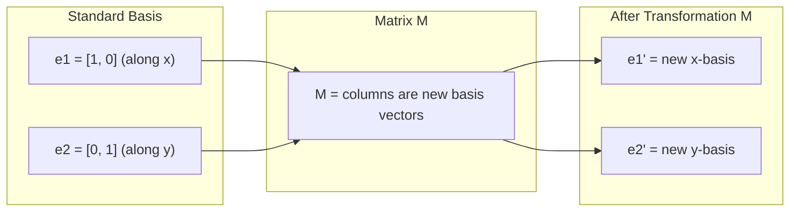
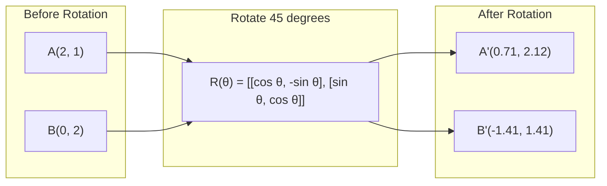
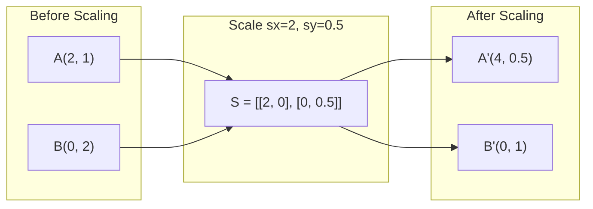
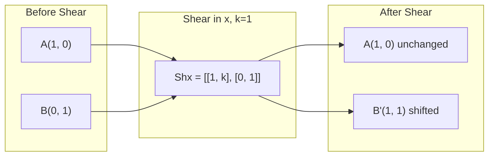
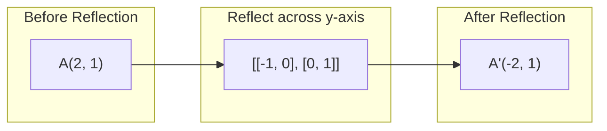
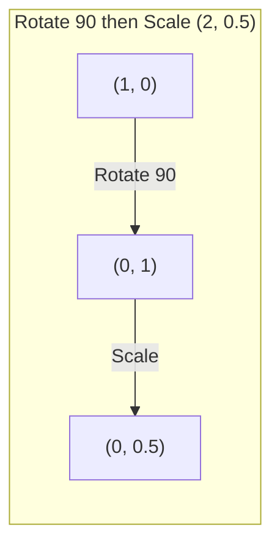
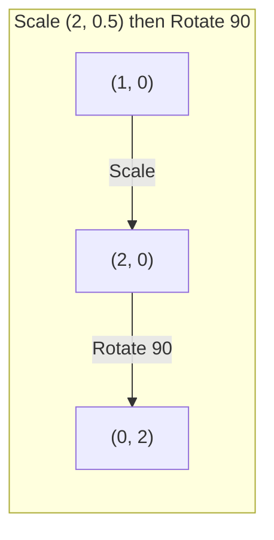

# Transformacje macierzowe

> Macierz to maszyna, która przekształca przestrzeń. Naucz się, co robi z każdym punktem, a zrozumiesz całą transformację.

**Typ:** Build
**Języki:** Python, Julia
**Wymagania wstępne:** Faza 1, Lekcje 01-02 (Intuicja algebry liniowej, Operacje na wektorach i macierzach)
**Czas:** ~75 minut

## Cele nauki

- Konstruowanie macierzy obrotu, skalowania, ścinania (shear) i odbicia oraz ich zastosowanie do punktów 2D i 3D
- Składanie wielu transformacji poprzez mnożenie macierzy i weryfikacja, że kolejność ma znaczenie
- Obliczanie wartości własnych i wektorów własnych macierzy 2x2 z równania charakterystycznego
- Wyjaśnienie, dlaczego wartości własne determinują kierunki PCA, stabilność RNN oraz zachowanie klasteryzacji spektralnej

## Problem

Czytasz o PCA i widzisz "znajdź wektory własne macierzy kowariancji". Czytasz o stabilności modeli i widzisz "sprawdź, czy wszystkie wartości własne mają moduł mniejszy niż 1". Czytasz o augmentacji danych i widzisz "zastosuj losowy obrót". Nic z tego nie ma sensu, dopóki nie zrozumiesz, co macierze robią z przestrzenią geometrycznie.

Macierze to nie tylko siatki liczb. To maszyny przestrzenne. Macierz obrotu obraca punkty. Macierz skalowania je rozciąga. Macierz ścinania je przechyla. Każda transformacja, jaką sieć neuronowa stosuje do danych, jest jedną z tych operacji lub ich złożeniem. Ta lekcja czyni te operacje konkretnymi.

## Koncepcja

### Transformacje jako macierze

Każdą transformację liniową w 2D można zapisać jako macierz 2x2. Macierz mówi dokładnie, gdzie trafiają wektory bazowe [1, 0] i [0, 1]. Wszystko inne wynika z tego.



### Obrót

Obrót 2D o kąt theta zachowuje odległości i kąty. Przesuwa każdy punkt po łuku okręgu.



W 3D obracasz wokół osi. Każda oś ma swoją własną macierz obrotu:

```
Rz(theta) = | cos  -sin  0 |     Rotate around z-axis
            | sin   cos  0 |     (x-y plane spins, z stays)
            |  0     0   1 |

Rx(theta) = | 1   0     0    |   Rotate around x-axis
            | 0  cos  -sin   |   (y-z plane spins, x stays)
            | 0  sin   cos   |

Ry(theta) = |  cos  0  sin |     Rotate around y-axis
            |   0   1   0  |     (x-z plane spins, y stays)
            | -sin  0  cos |
```

### Skalowanie

Skalowanie rozciąga lub kompresuje wzdłuż każdej osi niezależnie.



### Ścinanie (shear)

Ścinanie przechyla jedną oś, zachowując drugą bez zmian. Zamienia prostokąty w równoległoboki.



Macierze ścinania:
- `Shx = [[1, k], [0, 1]]` przesuwa x o k * y
- `Shy = [[1, 0], [k, 1]]` przesuwa y o k * x

### Odbicie

Odbicie tworzy lustrzane odwzorowanie punktów względem osi lub prostej.



Macierze odbicia:
- Odbicie względem osi y: `[[-1, 0], [0, 1]]`
- Odbicie względem osi x: `[[1, 0], [0, -1]]`

### Złożenie: łączenie transformacji

Zastosowanie transformacji A, a następnie B, jest tym samym co pomnożenie ich macierzy: `result = B @ A @ point`. Kolejność ma znaczenie. Obrót, a potem skalowanie, daje inny wynik niż skalowanie, a potem obrót.



Złożenie: `S @ R = [[0, -2], [0.5, 0]]`



Złożenie: `R @ S = [[0, -0.5], [2, 0]]`

Różne wyniki. Mnożenie macierzy nie jest przemienne.

### Wartości własne i wektory własne

Większość wektorów zmienia kierunek, gdy zostaną pomnożone przez macierz. Wektory własne są szczególne: macierz tylko je skaluje, nigdy nie obraca. Współczynnik skalowania to wartość własna.

```
A @ v = lambda * v

v is the eigenvector (direction that survives)
lambda is the eigenvalue (how much it stretches)

Example: A = | 2  1 |
             | 1  2 |

Eigenvector [1, 1] with eigenvalue 3:
  A @ [1,1] = [3, 3] = 3 * [1, 1]     (same direction, scaled by 3)

Eigenvector [1, -1] with eigenvalue 1:
  A @ [1,-1] = [1, -1] = 1 * [1, -1]  (same direction, unchanged)
```

Macierz rozciąga przestrzeń 3-krotnie wzdłuż [1, 1] i pozostawia [1, -1] bez zmian. Każdy inny kierunek jest mieszanką tych dwóch.

### Dekompozycja własna (eigendecomposition)

Jeśli macierz ma n liniowo niezależnych wektorów własnych, można ją rozłożyć:

```
A = V @ D @ V^(-1)

V = matrix whose columns are eigenvectors
D = diagonal matrix of eigenvalues
V^(-1) = inverse of V

This says: rotate into eigenvector coordinates, scale along each axis, rotate back.
```

### Dlaczego wartości własne mają znaczenie

**PCA.** Wektory własne macierzy kowariancji to główne składowe (principal components). Wartości własne mówią, ile wariancji ujmuje każda składowa. Posortuj według wartości własnej, zachowaj k najlepszych, a otrzymasz redukcję wymiarowości.

**Stabilność.** W sieciach rekurencyjnych i systemach dynamicznych wartości własne o module > 1 powodują eksplozję wyjść. Moduł < 1 powoduje ich zanikanie. To problem zanikającego/eksplodującego gradientu ujęty w jednym zdaniu.

**Metody spektralne.** Sieci grafowe (graph neural networks) wykorzystują wartości własne macierzy sąsiedztwa. Klasteryzacja spektralna wykorzystuje wartości własne macierzy Laplace'a. Wektory własne ujawniają strukturę grafu.

### Wyznacznik jako współczynnik skalowania objętości

Wyznacznik macierzy transformacji mówi, o ile skaluje ona pole powierzchni (2D) lub objętość (3D).

```
det = 1:   area preserved (rotation)
det = 2:   area doubled
det = 0:   space crushed to lower dimension (singular)
det = -1:  area preserved but orientation flipped (reflection)

| det(Rotation) | = 1        (always)
| det(Scale sx, sy) | = sx * sy
| det(Shear) | = 1           (area preserved)
| det(Reflection) | = -1     (orientation flipped)
```

## Zbuduj to

### Krok 1: Macierze transformacji od podstaw (Python)

```python
import math

def rotation_2d(theta):
    c, s = math.cos(theta), math.sin(theta)
    return [[c, -s], [s, c]]

def scaling_2d(sx, sy):
    return [[sx, 0], [0, sy]]

def shearing_2d(kx, ky):
    return [[1, kx], [ky, 1]]

def reflection_x():
    return [[1, 0], [0, -1]]

def reflection_y():
    return [[-1, 0], [0, 1]]

def mat_vec_mul(matrix, vector):
    return [
        sum(matrix[i][j] * vector[j] for j in range(len(vector)))
        for i in range(len(matrix))
    ]

def mat_mul(a, b):
    rows_a, cols_b = len(a), len(b[0])
    cols_a = len(a[0])
    return [
        [sum(a[i][k] * b[k][j] for k in range(cols_a)) for j in range(cols_b)]
        for i in range(rows_a)
    ]

point = [1.0, 0.0]
angle = math.pi / 4

rotated = mat_vec_mul(rotation_2d(angle), point)
print(f"Rotate (1,0) by 45 deg: ({rotated[0]:.4f}, {rotated[1]:.4f})")

scaled = mat_vec_mul(scaling_2d(2, 3), [1.0, 1.0])
print(f"Scale (1,1) by (2,3): ({scaled[0]:.1f}, {scaled[1]:.1f})")

sheared = mat_vec_mul(shearing_2d(1, 0), [1.0, 1.0])
print(f"Shear (1,1) kx=1: ({sheared[0]:.1f}, {sheared[1]:.1f})")

reflected = mat_vec_mul(reflection_y(), [2.0, 1.0])
print(f"Reflect (2,1) across y: ({reflected[0]:.1f}, {reflected[1]:.1f})")
```

### Krok 2: Złożenie transformacji

```python
R = rotation_2d(math.pi / 2)
S = scaling_2d(2, 0.5)

rotate_then_scale = mat_mul(S, R)
scale_then_rotate = mat_mul(R, S)

point = [1.0, 0.0]
result1 = mat_vec_mul(rotate_then_scale, point)
result2 = mat_vec_mul(scale_then_rotate, point)

print(f"Rotate 90 then scale: ({result1[0]:.2f}, {result1[1]:.2f})")
print(f"Scale then rotate 90: ({result2[0]:.2f}, {result2[1]:.2f})")
print(f"Same? {result1 == result2}")
```

### Krok 3: Wartości własne od podstaw (2x2)

Dla macierzy 2x2 `[[a, b], [c, d]]` wartości własne są rozwiązaniami równania charakterystycznego: `lambda^2 - (a+d)*lambda + (ad - bc) = 0`.

```python
def eigenvalues_2x2(matrix):
    a, b = matrix[0]
    c, d = matrix[1]
    trace = a + d
    det = a * d - b * c
    discriminant = trace ** 2 - 4 * det
    if discriminant < 0:
        real = trace / 2
        imag = (-discriminant) ** 0.5 / 2
        return (complex(real, imag), complex(real, -imag))
    sqrt_disc = discriminant ** 0.5
    return ((trace + sqrt_disc) / 2, (trace - sqrt_disc) / 2)

def eigenvector_2x2(matrix, eigenvalue):
    a, b = matrix[0]
    c, d = matrix[1]
    if abs(b) > 1e-10:
        v = [b, eigenvalue - a]
    elif abs(c) > 1e-10:
        v = [eigenvalue - d, c]
    else:
        if abs(a - eigenvalue) < 1e-10:
            v = [1, 0]
        else:
            v = [0, 1]
    mag = (v[0] ** 2 + v[1] ** 2) ** 0.5
    return [v[0] / mag, v[1] / mag]

A = [[2, 1], [1, 2]]
vals = eigenvalues_2x2(A)
print(f"Matrix: {A}")
print(f"Eigenvalues: {vals[0]:.4f}, {vals[1]:.4f}")

for val in vals:
    vec = eigenvector_2x2(A, val)
    result = mat_vec_mul(A, vec)
    scaled = [val * vec[0], val * vec[1]]
    print(f"  lambda={val:.1f}, v={[round(x,4) for x in vec]}")
    print(f"    A@v = {[round(x,4) for x in result]}")
    print(f"    l*v = {[round(x,4) for x in scaled]}")
```

### Krok 4: Wyznacznik jako współczynnik skalowania objętości

```python
def det_2x2(matrix):
    return matrix[0][0] * matrix[1][1] - matrix[0][1] * matrix[1][0]

print(f"det(rotation 45) = {det_2x2(rotation_2d(math.pi/4)):.4f}")
print(f"det(scale 2,3)   = {det_2x2(scaling_2d(2, 3)):.1f}")
print(f"det(shear kx=1)  = {det_2x2(shearing_2d(1, 0)):.1f}")
print(f"det(reflect y)   = {det_2x2(reflection_y()):.1f}")

singular = [[1, 2], [2, 4]]
print(f"det(singular)     = {det_2x2(singular):.1f}")
print("Singular: columns are proportional, space collapses to a line.")
```

## Zastosuj to

NumPy obsługuje to wszystko za pomocą zoptymalizowanych procedur.

```python
import numpy as np

theta = np.pi / 4
R = np.array([[np.cos(theta), -np.sin(theta)],
              [np.sin(theta),  np.cos(theta)]])

point = np.array([1.0, 0.0])
print(f"Rotate (1,0) by 45 deg: {R @ point}")

S = np.diag([2.0, 3.0])
composed = S @ R
print(f"Scale(2,3) after Rotate(45): {composed @ point}")

A = np.array([[2, 1], [1, 2]], dtype=float)
eigenvalues, eigenvectors = np.linalg.eig(A)
print(f"\nEigenvalues: {eigenvalues}")
print(f"Eigenvectors (columns):\n{eigenvectors}")

for i in range(len(eigenvalues)):
    v = eigenvectors[:, i]
    lam = eigenvalues[i]
    print(f"  A @ v{i} = {A @ v}, lambda * v{i} = {lam * v}")

print(f"\ndet(R) = {np.linalg.det(R):.4f}")
print(f"det(S) = {np.linalg.det(S):.1f}")

B = np.array([[3, 1], [0, 2]], dtype=float)
vals, vecs = np.linalg.eig(B)
D = np.diag(vals)
V = vecs
reconstructed = V @ D @ np.linalg.inv(V)
print(f"\nEigendecomposition A = V @ D @ V^-1:")
print(f"Original:\n{B}")
print(f"Reconstructed:\n{reconstructed}")
```

### Obroty 3D z NumPy

```python
def rotation_3d_z(theta):
    c, s = np.cos(theta), np.sin(theta)
    return np.array([[c, -s, 0], [s, c, 0], [0, 0, 1]])

def rotation_3d_x(theta):
    c, s = np.cos(theta), np.sin(theta)
    return np.array([[1, 0, 0], [0, c, -s], [0, s, c]])

point_3d = np.array([1.0, 0.0, 0.0])
rotated_z = rotation_3d_z(np.pi / 2) @ point_3d
rotated_x = rotation_3d_x(np.pi / 2) @ point_3d

print(f"\n3D point: {point_3d}")
print(f"Rotate 90 around z: {np.round(rotated_z, 4)}")
print(f"Rotate 90 around x: {np.round(rotated_x, 4)}")
```

## Wdroż to

Ta lekcja buduje geometryczne podstawy dla PCA (Faza 2) oraz analizy wag sieci neuronowych. Kod wartości własnych/wektorów własnych zbudowany tutaj to ten sam algorytm, który napędza redukcję wymiarowości, klasteryzację spektralną i analizę stabilności w produkcyjnych systemach ML.

## Ćwiczenia

1. Zastosuj obrót, skalowanie i ścinanie do kwadratu jednostkowego (wierzchołki w [0,0], [1,0], [1,1], [0,1]). Wypisz przekształcone wierzchołki dla każdej operacji. Zweryfikuj, że obrót zachowuje odległości między wierzchołkami.

2. Znajdź wartości własne macierzy [[4, 2], [1, 3]] ręcznie, korzystając z równania charakterystycznego. Następnie zweryfikuj wynik za pomocą swojej funkcji napisanej od podstaw oraz za pomocą NumPy.

3. Utwórz złożenie trzech transformacji (obrót o 30 stopni, skalowanie o [1.5, 0.8], ścinanie z kx=0.3) i zastosuj je do 8 punktów rozmieszczonych na okręgu. Wypisz współrzędne przed i po. Oblicz wyznacznik macierzy złożonej i zweryfikuj, że jest równy iloczynowi poszczególnych wyznaczników.

## Kluczowe pojęcia

| Pojęcie | Co się o nim mówi | Co naprawdę oznacza |
|------|----------------|----------------------|
| Macierz obrotu (rotation matrix) | "Obraca rzeczy" | Macierz ortogonalna, która przesuwa punkty po łukach okręgu, zachowując odległości i kąty. Wyznacznik zawsze równy 1. |
| Macierz skalowania (scaling matrix) | "Powiększa rzeczy" | Macierz diagonalna, która rozciąga lub kompresuje niezależnie wzdłuż każdej osi. Wyznacznik to iloczyn współczynników skalowania. |
| Macierz ścinania (shearing matrix) | "Przekrzywia rzeczy" | Macierz, która przesuwa jedną współrzędną proporcjonalnie do innej, zamieniając prostokąty w równoległoboki. Wyznacznik równy 1. |
| Odbicie (reflection) | "Odbija rzeczy lustrzanie" | Macierz, która odwraca przestrzeń względem osi lub płaszczyzny. Wyznacznik równy -1. |
| Złożenie (composition) | "Zrób dwie rzeczy" | Mnożenie macierzy transformacji w celu połączenia operacji. Kolejność ma znaczenie: B @ A oznacza najpierw zastosowanie A, a następnie B. |
| Wektor własny (eigenvector) | "Specjalny kierunek" | Kierunek, który macierz tylko skaluje, nigdy nie obraca. Odcisk palca transformacji. |
| Wartość własna (eigenvalue) | "O ile rozciąga" | Skalarny współczynnik, przez który macierz skaluje swój wektor własny. Może być ujemny (odwrócenie) lub zespolony (obrót). |
| Dekompozycja własna (eigendecomposition) | "Rozłóż macierz na czynniki" | Zapisanie macierzy jako V @ D @ V^(-1), rozdzielając ją na fundamentalne kierunki i wielkości skalowania. |
| Wyznacznik (determinant) | "Pojedyncza liczba z macierzy" | Współczynnik, przez który transformacja skaluje pole powierzchni (2D) lub objętość (3D). Zero oznacza, że transformacja jest nieodwracalna. |
| Równanie charakterystyczne (characteristic equation) | "Skąd biorą się wartości własne" | det(A - lambda * I) = 0. Wielomian, którego pierwiastki są wartościami własnymi. |

## Dalsza lektura

- [3Blue1Brown: Linear Transformations](https://www.3blue1brown.com/lessons/linear-transformations) -- wizualna intuicja dotycząca tego, jak macierze przekształcają przestrzeń
- [3Blue1Brown: Eigenvectors and Eigenvalues](https://www.3blue1brown.com/lessons/eigenvalues) -- najlepsze wizualne wyjaśnienie tego, czym są wektory własne geometrycznie
- [MIT 18.06 Lecture 21: Eigenvalues and Eigenvectors](https://ocw.mit.edu/courses/18-06-linear-algebra-spring-2010/) -- klasyczne ujęcie Gilberta Stranga
