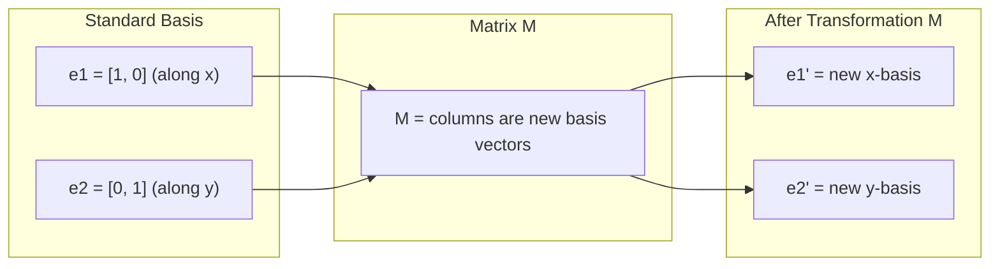
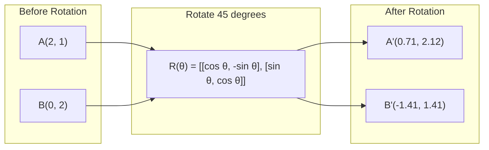
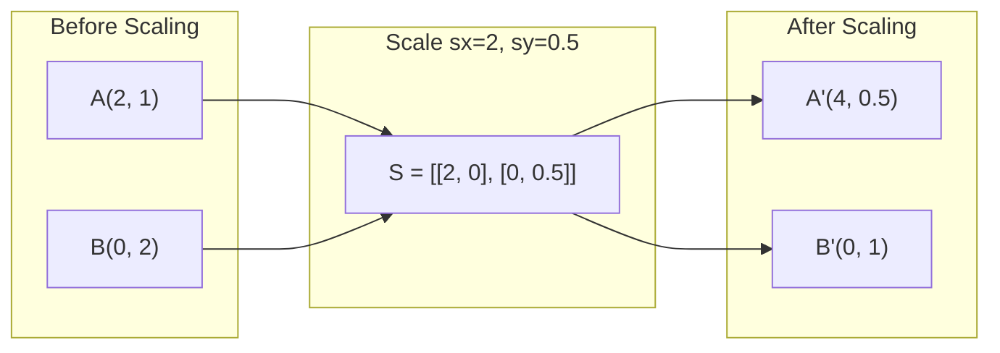
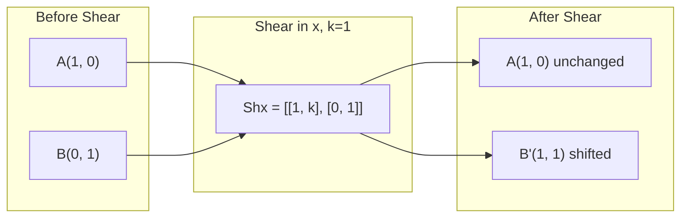
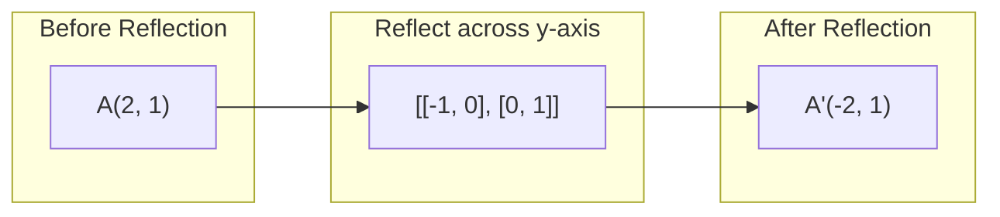
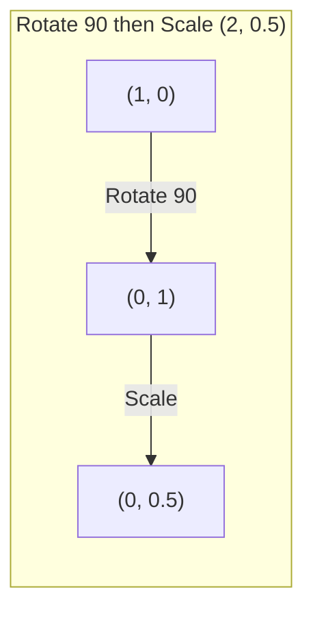
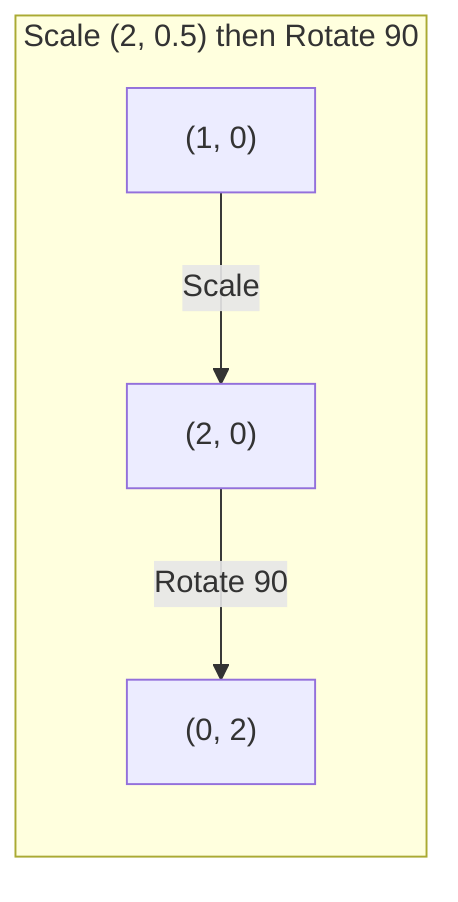

# Transformacje macierzy

> Matryca to maszyna przekształcająca przestrzeń. Dowiedz się, co robi w każdym punkcie, a zrozumiesz całą transformację.

**Typ:** Kompilacja
**Języki:** Python, Julia
**Wymagania wstępne:** Faza 1, lekcje 01-02 (Intuicja algebry liniowej, operacje na wektorach i macierzach)
**Czas:** ~75 minut

## Cele nauczania

- Konstruuj macierze rotacji, skalowania, ścinania i odbicia i stosuj je do punktów 2D i 3D
- Twórz wiele transformacji poprzez mnożenie macierzy i sprawdzaj, czy kolejność ma znaczenie
- Oblicz wartości własne i wektory własne macierzy 2x2 z równania charakterystycznego
- Wyjaśnij, dlaczego wartości własne determinują kierunki PCA, stabilność RNN i zachowanie skupień widmowych

## Problem

Czytasz o PCA i widzisz „znajdź wektory własne macierzy kowariancji”. Czytasz o stabilności modelu i widzisz „sprawdź, czy wszystkie wartości własne mają wielkość mniejszą niż 1”. Czytasz o powiększaniu danych i widzisz „zastosuj losową rotację”. Nic z tego nie ma sensu, dopóki nie zrozumiesz, jaki geometryczny wpływ macierze na przestrzeń.

Macierze to nie tylko siatki liczb. To maszyny przestrzenne. Macierz rotacji obraca punkty. Macierz skalowania je rozciąga. Matryca ścinania przechyla je. Każda transformacja danych, jaką sieć neuronowa stosuje, jest jedną z tych operacji lub ich kompozycją. Ta lekcja sprawia, że ​​te operacje stają się konkretne.

## Koncepcja

### Transformacje jako macierze

Każdą transformację liniową w 2D można zapisać jako macierz 2x2. Macierz informuje dokładnie, gdzie kończą się wektory bazowe [1, 0] i [0, 1]. Wszystko inne następuje.



### Obrót

Obrót 2D o kąt theta utrzymuje odległości i kąty niezmienione. Porusza każdy punkt po łuku kołowym.



W 3D obracasz się wokół osi. Każda oś ma własną macierz obrotu:

```
Rz(theta) = | cos  -sin  0 |     Rotate around z-axis
            | sin   cos  0 |     (x-y plane spins, z stays)
            |  0     0   1 |

Rx(theta) = | 1   0     0    |   Rotate around x-axis
            | 0  cos  -sin   |   (y-z plane spins, x stays)
            | 0  sin   cos   |

Ry(theta) = |  cos  0  sin |     Rotate around y-axis
            |   0   1   0  |     (x-z plane spins, y stays)
            | -sin  0  cos |
```

### Skalowanie

Skalowanie rozciąga lub ściska niezależnie wzdłuż każdej osi.



### Strzyżenie

Ścinanie przechyla jedną oś, utrzymując drugą nieruchomą. Zamienia prostokąty w równoległoboki.



Macierze ścinania:
- `Shx = [[1, k], [0, 1]]` przesuwa x o k * y
- `Shy = [[1, 0], [k, 1]]` przesuwa y o k * x

### Odbicie

Odbicie odzwierciedla punkty wzdłuż osi lub linii.



Matryce odbicia:
- Odbicie w poprzek osi Y: `[[-1, 0], [0, 1]]`
- Odbicie w poprzek osi X: `[[1, 0], [0, -1]]`

### Kompozycja: transformacje łańcuchowe

Zastosowanie transformacji A i B jest równoznaczne z pomnożeniem ich macierzy: `result = B @ A @ point`. Porządek ma znaczenie. Obróć, a następnie skaluj daje inne wyniki niż skalowanie, a następnie obróć.



Utworzono: `S @ R = [[0, -2], [0.5, 0]]`



Utworzono: `R @ S = [[0, -0.5], [2, 0]]`

Różne wyniki. Mnożenie macierzy nie jest przemienne.

### Wartości własne i wektory własne

Większość wektorów zmienia kierunek, gdy uderza w nie matryca. Wektory własne są wyjątkowe: macierz je tylko skaluje, nigdy ich nie obraca. Współczynnikiem skalującym jest wartość własna.

```
A @ v = lambda * v

v is the eigenvector (direction that survives)
lambda is the eigenvalue (how much it stretches)

Example: A = | 2  1 |
             | 1  2 |

Eigenvector [1, 1] with eigenvalue 3:
  A @ [1,1] = [3, 3] = 3 * [1, 1]     (same direction, scaled by 3)

Eigenvector [1, -1] with eigenvalue 1:
  A @ [1,-1] = [1, -1] = 1 * [1, -1]  (same direction, unchanged)
```

Macierz rozciąga przestrzeń 3x wzdłuż [1, 1] i utrzymuje [1, -1] bez zmian. Każdy inny kierunek jest mieszanką tych dwóch.

### Rozkład własny

Jeśli macierz ma n liniowo niezależnych wektorów własnych, można ją rozłożyć:

```
A = V @ D @ V^(-1)

V = matrix whose columns are eigenvectors
D = diagonal matrix of eigenvalues
V^(-1) = inverse of V

This says: rotate into eigenvector coordinates, scale along each axis, rotate back.
```

### Dlaczego wartości własne mają znaczenie

**PCA.** Głównymi składnikami są wektory własne macierzy kowariancji. Wartości własne mówią, ile wariancji wychwytuje każdy składnik. Sortuj według wartości własnej, zachowaj górne k, a uzyskasz redukcję wymiarowości.

**Stabilność.** W sieciach rekurencyjnych i układach dynamicznych wartości własne o wielkości > 1 powodują eksplozję wyników. Wielkość < 1 powoduje ich zanik. Jest to problem znikającego/eksplodującego gradientu określony w jednym zdaniu.

**Metody spektralne.** Graficzne sieci neuronowe wykorzystują wartości własne macierzy sąsiedztwa. Grupowanie widmowe wykorzystuje wartości własne Laplaciana. Wektory własne ujawniają strukturę wykresu.

### Wyznacznik jako współczynnik skalowania objętości

Wyznacznik macierzy transformacji informuje, w jakim stopniu skaluje ona obszar (2D) lub objętość (3D).

```
det = 1:   area preserved (rotation)
det = 2:   area doubled
det = 0:   space crushed to lower dimension (singular)
det = -1:  area preserved but orientation flipped (reflection)

| det(Rotation) | = 1        (always)
| det(Scale sx, sy) | = sx * sy
| det(Shear) | = 1           (area preserved)
| det(Reflection) | = -1     (orientation flipped)
```

## Zbuduj to

### Krok 1: Macierze transformacji od podstaw (Python)

```python
import math

def rotation_2d(theta):
    c, s = math.cos(theta), math.sin(theta)
    return [[c, -s], [s, c]]

def scaling_2d(sx, sy):
    return [[sx, 0], [0, sy]]

def shearing_2d(kx, ky):
    return [[1, kx], [ky, 1]]

def reflection_x():
    return [[1, 0], [0, -1]]

def reflection_y():
    return [[-1, 0], [0, 1]]

def mat_vec_mul(matrix, vector):
    return [
        sum(matrix[i][j] * vector[j] for j in range(len(vector)))
        for i in range(len(matrix))
    ]

def mat_mul(a, b):
    rows_a, cols_b = len(a), len(b[0])
    cols_a = len(a[0])
    return [
        [sum(a[i][k] * b[k][j] for k in range(cols_a)) for j in range(cols_b)]
        for i in range(rows_a)
    ]

point = [1.0, 0.0]
angle = math.pi / 4

rotated = mat_vec_mul(rotation_2d(angle), point)
print(f"Rotate (1,0) by 45 deg: ({rotated[0]:.4f}, {rotated[1]:.4f})")

scaled = mat_vec_mul(scaling_2d(2, 3), [1.0, 1.0])
print(f"Scale (1,1) by (2,3): ({scaled[0]:.1f}, {scaled[1]:.1f})")

sheared = mat_vec_mul(shearing_2d(1, 0), [1.0, 1.0])
print(f"Shear (1,1) kx=1: ({sheared[0]:.1f}, {sheared[1]:.1f})")

reflected = mat_vec_mul(reflection_y(), [2.0, 1.0])
print(f"Reflect (2,1) across y: ({reflected[0]:.1f}, {reflected[1]:.1f})")
```

### Krok 2: Kompozycja transformacji

```python
R = rotation_2d(math.pi / 2)
S = scaling_2d(2, 0.5)

rotate_then_scale = mat_mul(S, R)
scale_then_rotate = mat_mul(R, S)

point = [1.0, 0.0]
result1 = mat_vec_mul(rotate_then_scale, point)
result2 = mat_vec_mul(scale_then_rotate, point)

print(f"Rotate 90 then scale: ({result1[0]:.2f}, {result1[1]:.2f})")
print(f"Scale then rotate 90: ({result2[0]:.2f}, {result2[1]:.2f})")
print(f"Same? {result1 == result2}")
```

### Krok 3: Wartości własne od podstaw (2x2)

Dla macierzy 2x2 `[[a, b], [c, d]]` wartości własne rozwiązują równanie charakterystyczne: `lambda^2 - (a+d)*lambda + (ad - bc) = 0`.

```python
def eigenvalues_2x2(matrix):
    a, b = matrix[0]
    c, d = matrix[1]
    trace = a + d
    det = a * d - b * c
    discriminant = trace ** 2 - 4 * det
    if discriminant < 0:
        real = trace / 2
        imag = (-discriminant) ** 0.5 / 2
        return (complex(real, imag), complex(real, -imag))
    sqrt_disc = discriminant ** 0.5
    return ((trace + sqrt_disc) / 2, (trace - sqrt_disc) / 2)

def eigenvector_2x2(matrix, eigenvalue):
    a, b = matrix[0]
    c, d = matrix[1]
    if abs(b) > 1e-10:
        v = [b, eigenvalue - a]
    elif abs(c) > 1e-10:
        v = [eigenvalue - d, c]
    else:
        if abs(a - eigenvalue) < 1e-10:
            v = [1, 0]
        else:
            v = [0, 1]
    mag = (v[0] ** 2 + v[1] ** 2) ** 0.5
    return [v[0] / mag, v[1] / mag]

A = [[2, 1], [1, 2]]
vals = eigenvalues_2x2(A)
print(f"Matrix: {A}")
print(f"Eigenvalues: {vals[0]:.4f}, {vals[1]:.4f}")

for val in vals:
    vec = eigenvector_2x2(A, val)
    result = mat_vec_mul(A, vec)
    scaled = [val * vec[0], val * vec[1]]
    print(f"  lambda={val:.1f}, v={[round(x,4) for x in vec]}")
    print(f"    A@v = {[round(x,4) for x in result]}")
    print(f"    l*v = {[round(x,4) for x in scaled]}")
```

### Krok 4: Wyznacznik jako współczynnik skalowania objętości

```python
def det_2x2(matrix):
    return matrix[0][0] * matrix[1][1] - matrix[0][1] * matrix[1][0]

print(f"det(rotation 45) = {det_2x2(rotation_2d(math.pi/4)):.4f}")
print(f"det(scale 2,3)   = {det_2x2(scaling_2d(2, 3)):.1f}")
print(f"det(shear kx=1)  = {det_2x2(shearing_2d(1, 0)):.1f}")
print(f"det(reflect y)   = {det_2x2(reflection_y()):.1f}")

singular = [[1, 2], [2, 4]]
print(f"det(singular)     = {det_2x2(singular):.1f}")
print("Singular: columns are proportional, space collapses to a line.")
```

## Użyj tego

NumPy obsługuje to wszystko za pomocą zoptymalizowanych procedur.

```python
import numpy as np

theta = np.pi / 4
R = np.array([[np.cos(theta), -np.sin(theta)],
              [np.sin(theta),  np.cos(theta)]])

point = np.array([1.0, 0.0])
print(f"Rotate (1,0) by 45 deg: {R @ point}")

S = np.diag([2.0, 3.0])
composed = S @ R
print(f"Scale(2,3) after Rotate(45): {composed @ point}")

A = np.array([[2, 1], [1, 2]], dtype=float)
eigenvalues, eigenvectors = np.linalg.eig(A)
print(f"\nEigenvalues: {eigenvalues}")
print(f"Eigenvectors (columns):\n{eigenvectors}")

for i in range(len(eigenvalues)):
    v = eigenvectors[:, i]
    lam = eigenvalues[i]
    print(f"  A @ v{i} = {A @ v}, lambda * v{i} = {lam * v}")

print(f"\ndet(R) = {np.linalg.det(R):.4f}")
print(f"det(S) = {np.linalg.det(S):.1f}")

B = np.array([[3, 1], [0, 2]], dtype=float)
vals, vecs = np.linalg.eig(B)
D = np.diag(vals)
V = vecs
reconstructed = V @ D @ np.linalg.inv(V)
print(f"\nEigendecomposition A = V @ D @ V^-1:")
print(f"Original:\n{B}")
print(f"Reconstructed:\n{reconstructed}")
```

### Obroty 3D za pomocą NumPy

```python
def rotation_3d_z(theta):
    c, s = np.cos(theta), np.sin(theta)
    return np.array([[c, -s, 0], [s, c, 0], [0, 0, 1]])

def rotation_3d_x(theta):
    c, s = np.cos(theta), np.sin(theta)
    return np.array([[1, 0, 0], [0, c, -s], [0, s, c]])

point_3d = np.array([1.0, 0.0, 0.0])
rotated_z = rotation_3d_z(np.pi / 2) @ point_3d
rotated_x = rotation_3d_x(np.pi / 2) @ point_3d

print(f"\n3D point: {point_3d}")
print(f"Rotate 90 around z: {np.round(rotated_z, 4)}")
print(f"Rotate 90 around x: {np.round(rotated_x, 4)}")
```

## Wyślij to

Ta lekcja tworzy geometryczne podstawy analizy PCA (faza 2) i wagi sieci neuronowej. Zbudowany tutaj kod wartości własnej/wektora własnego jest tym samym algorytmem, który obsługuje redukcję wymiarowości, grupowanie widmowe i analizę stabilności w produkcyjnych systemach ML.

## Ćwiczenia

1. Zastosuj obrót, skalowanie i ścinanie do kwadratu jednostkowego (rogi w [0,0], [1,0], [1,1], [0,1]). Wydrukuj przekształcone rogi każdego z nich. Sprawdź, czy obrót zachowuje odległości pomiędzy narożnikami.

2. Znajdź ręcznie wartości własne macierzy [[4, 2], [1, 3]] korzystając z równania charakterystycznego. Następnie sprawdź swoją funkcję od podstaw i NumPy.

3. Utwórz kompozycję trzech przekształceń (obrót o 30 stopni, skala o [1,5, 0,8], ścinanie o kx=0,3) i zastosuj ją do 8 punktów rozmieszczonych na okręgu. Wydrukuj współrzędne przed i po. Oblicz wyznacznik złożonej macierzy i sprawdź, czy jest on równy iloczynowi poszczególnych wyznaczników.

## Kluczowe terminy

| Termin | Co ludzie mówią | Co to właściwie oznacza |
|------|----------------|----------------------|
| Macierz rotacji | „kręci rzeczy” | Macierz ortogonalna, która przesuwa punkty po łukach kołowych, zachowując jednocześnie odległości i kąty. Wyznacznik wynosi zawsze 1. |
| Skalowanie macierzy | „Robi rzeczy większe” | Matryca diagonalna, która rozciąga się lub ściska niezależnie wzdłuż każdej osi. Wyznacznik jest iloczynem współczynników skali. |
| Matryca ścinania | „Pochyla rzeczy” | Macierz, która przesuwa jedną współrzędną proporcjonalnie do drugiej, zamieniając prostokąty w równoległoboki. Wyznacznik wynosi 1. |
| Odbicie | „Odzwierciedla rzeczy” | Macierz odwracająca przestrzeń wokół osi lub płaszczyzny. Wyznacznik wynosi -1. |
| Skład | „Zrób dwie rzeczy” | Mnożenie macierzy transformacji do operacji łańcuchowych. Kolejność ma znaczenie: B @ A oznacza najpierw zastosowanie A, potem B. |
| Wektor własny | „Specjalny kierunek” | Kierunek, który matryca tylko skaluje, nigdy się nie obraca. Odcisk palca transformacji. |
| Wartość własna | „Jak bardzo się rozciąga” | Współczynnik skalarny, według którego macierz skaluje swój wektor własny. Może być ujemny (odwrócenie) lub złożony (obrót). |
| Rozkład własny | „Rozbić matrix” | Zapisanie macierzy jako V @ D @ V^(-1), dzieląc ją na podstawowe kierunki skalowania i wielkości. |
| Wyznacznik | „Pojedyncza liczba z macierzy” | Współczynnik, według którego transformacja skaluje powierzchnię (2D) lub objętość (3D). Zero oznacza, że ​​transformacja jest nieodwracalna. |
| Równanie charakterystyczne | „Skąd biorą się wartości własne” | det(A - lambda * I) = 0. Wielomian, którego pierwiastkami są wartości własne. |

## Dalsze czytanie

– [3Blue1Brown: Transformacje liniowe](https://www.3blue1brown.com/lessons/linear-transformations) – wizualna intuicja pokazująca, jak macierze przekształcają przestrzeń
- [3Blue1Brown: Wektory własne i wartości własne](https://www.3blue1brown.com/lessons/eigenvalues) — najlepsze wizualne wyjaśnienie znaczenia wektorów własnych w aspekcie geometrycznym
- [MIT 18.06 Wykład 21: Wartości własne i wektory własne](https://ocw.mit.edu/courses/18-06-linear-algebra-spring-2010/) - Klasyczne leczenie Gilberta Stranga