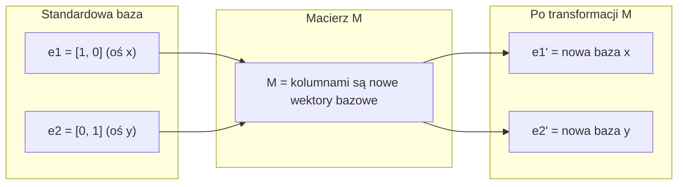
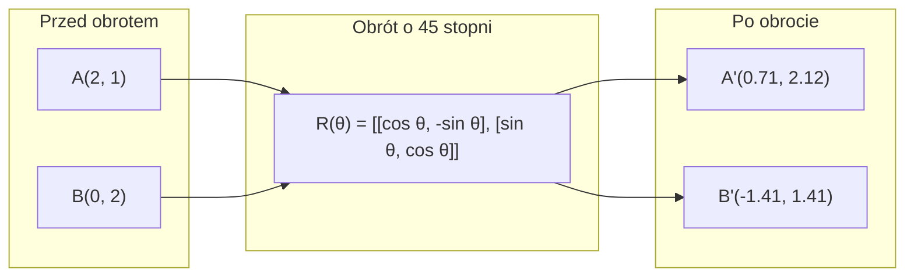
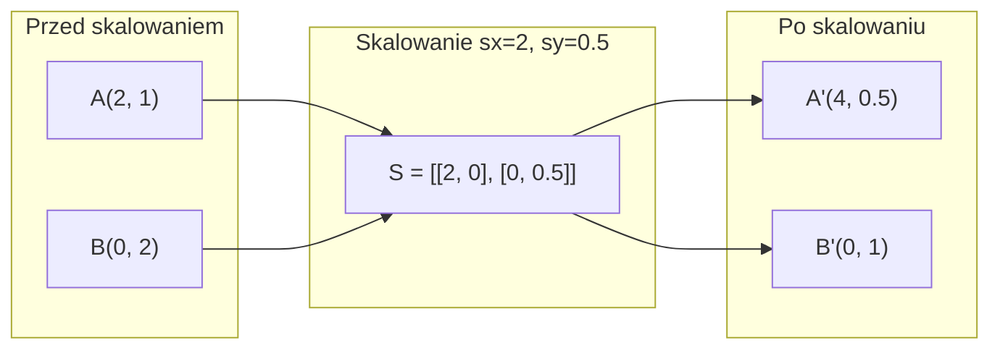
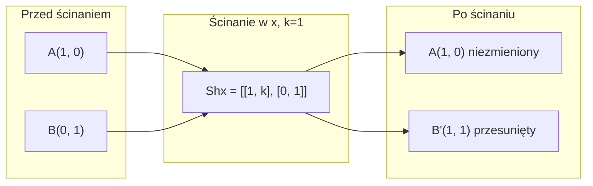
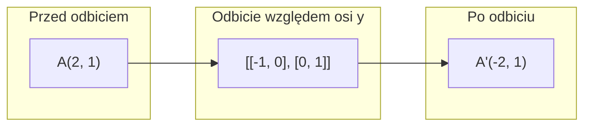
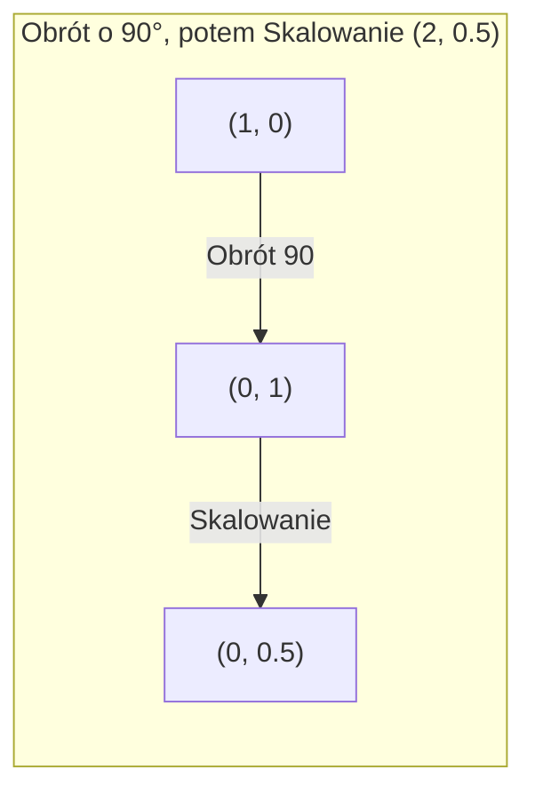
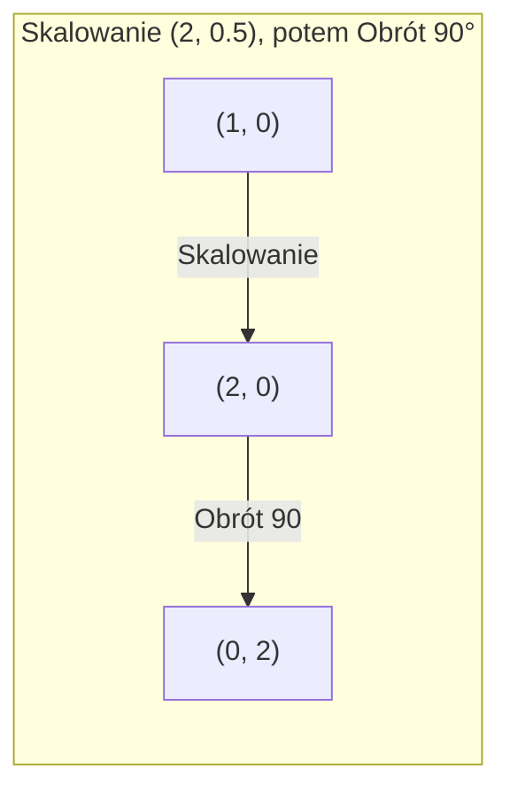

# Transformacje macierzowe

> Macierz to maszyna przekształcająca przestrzeń. Zrozum, co robi z pojedynczym punktem, a zrozumiesz całą transformację.

**Typ:** Kompilacja
**Języki:** Python, Julia
**Wymagania wstępne:** Faza 1, Lekcje 01-02 (Intuicja algebry liniowej, operacje na wektorach i macierzach)
**Czas:** ~75 minut

## Cele nauczania

- Konstruowanie macierzy obrotu, skalowania, ścinania oraz odbicia i stosowanie ich na punktach 2D i 3D.
- Tworzenie złożonych transformacji poprzez mnożenie macierzy i weryfikacja, dlaczego kolejność operacji ma znaczenie.
- Obliczanie wartości własnych i wektorów własnych macierzy 2x2 z równania charakterystycznego.
- Wyjaśnienie, dlaczego wartości własne determinują kierunki w PCA, stabilność w sieciach RNN oraz zachowanie algorytmów grupowania widmowego (spectral clustering).

## Problem

Czytasz o PCA i widzisz polecenie "znajdź wektory własne macierzy kowariancji". Czytasz o stabilności modelu i widzisz zalecenie "sprawdź, czy wszystkie wartości własne mają moduł mniejszy niż 1". Czytasz o augmentacji danych i trafiasz na "zastosuj losowy obrót". Nic z tego nie ma sensu, dopóki nie zrozumiesz, jaki jest geometryczny wpływ macierzy na przestrzeń.

Macierze to nie tylko siatki liczb. To przestrzenne transformatory. Macierz obrotu obraca punkty. Macierz skalowania je rozciąga. Macierz ścinania je pochyla. Każda transformacja danych, którą aplikuje sieć neuronowa, to jedna z tych operacji lub ich złożenie. Ta lekcja sprawia, że operacje te stają się bardzo namacalne.

## Koncepcja

### Transformacje jako macierze

Każdą transformację liniową w 2D można zapisać jako macierz 2x2. Macierz mówi dokładnie o tym, gdzie lądują wektory bazowe [1, 0] i [0, 1]. Cała reszta przestrzeni podąża za nimi.



### Obrót

Obrót w 2D o kąt theta zachowuje odległości i kąty. Przemieszcza każdy punkt po łuku okręgu.



W przestrzeni 3D obraca się względem konkretnej osi. Każda oś posiada własną macierz obrotu:

```
Rz(theta) = | cos  -sin  0 |     Obrót wokół osi z
            | sin   cos  0 |     (płaszczyzna x-y się obraca, z pozostaje)
            |  0     0   1 |

Rx(theta) = | 1   0     0    |   Obrót wokół osi x
            | 0  cos  -sin   |   (płaszczyzna y-z się obraca, x pozostaje)
            | 0  sin   cos   |

Ry(theta) = |  cos  0  sin |     Obrót wokół osi y
            |   0   1   0  |     (płaszczyzna x-z się obraca, y pozostaje)
            | -sin  0  cos |
```

### Skalowanie

Skalowanie rozciąga lub ściska przestrzeń niezależnie wzdłuż każdej osi.



### Ścinanie (Shear)

Ścinanie pochyla przestrzeń wzdłuż jednej osi, zachowując drugą w bezruchu. Przekształca prostokąty w równoległoboki.



Macierze ścinania:
- `Shx = [[1, k], [0, 1]]` przesuwa współrzędną x o k * y
- `Shy = [[1, 0], [k, 1]]` przesuwa współrzędną y o k * x

### Odbicie

Odbicie lustrzane punktów względem określonej osi lub prostej.



Macierze odbicia:
- Odbicie względem osi y: `[[-1, 0], [0, 1]]`
- Odbicie względem osi x: `[[1, 0], [0, -1]]`

### Złożenie transformacji (Kompozycja)

Zastosowanie transformacji A, a następnie transformacji B, jest równoważne pomnożeniu ich macierzy: `result = B @ A @ point`. Kolejność ma ogromne znaczenie. Obroty, a następnie skalowanie dają zupełnie inny wynik niż skalowanie, a następnie obrót.



Utworzone macierzowo: `S @ R = [[0, -2], [0.5, 0]]`



Utworzone macierzowo: `R @ S = [[0, -0.5], [2, 0]]`

Wyniki są różne, ponieważ mnożenie macierzy nie jest przemienne.

### Wartości własne i wektory własne

Większość wektorów zmienia swój kierunek podczas transformacji przez macierz. Wektory własne (eigenvectors) są wyjątkowe: macierz je jedynie skaluje, ale nigdy ich nie obraca. Współczynnikiem tego skalowania jest odpowiadająca im wartość własna (eigenvalue).

```
A @ v = lambda * v

v to wektor własny (kierunek, który "przetrwał" niezmieniony)
lambda to wartość własna (współczynnik rozciągnięcia)

Przykład: A = | 2  1 |
              | 1  2 |

Wektor własny [1, 1] o wartości własnej 3:
  A @ [1,1] = [3, 3] = 3 * [1, 1]     (ten sam kierunek, przeskalowany x3)

Wektor własny [1, -1] o wartości własnej 1:
  A @ [1,-1] = [1, -1] = 1 * [1, -1]  (ten sam kierunek, brak zmian w skali)
```

Macierz rozciąga przestrzeń trzykrotnie wzdłuż wektora [1, 1], a w kierunku [1, -1] pozostawia ją bez zmian. Każdy inny kierunek w przestrzeni będzie mieszanką tych dwóch przekształceń.

### Rozkład wektorów własnych (Rozkład spektralny/Eigendecomposition)

Jeśli macierz o rozmiarze n x n posiada n liniowo niezależnych wektorów własnych, można ją rozłożyć (zdekomponować) w następujący sposób:

```
A = V @ D @ V^(-1)

V = macierz, której kolumnami są wektory własne
D = macierz diagonalna wartości własnych
V^(-1) = macierz odwrotna do V

Geometrycznie oznacza to: obróć przestrzeń do współrzędnych wektorów własnych, wykonaj skalowanie wzdłuż każdej osi z osobna, a następnie obróć przestrzeń z powrotem.
```

### Dlaczego wartości własne są tak istotne

**PCA (Analiza Głównych Składowych).** Główne składowe to wektory własne macierzy kowariancji. Wartości własne określają, jak dużo wariancji jest wychwytywane przez każdą ze składowych. Sortując je względem największych wartości własnych i zachowując top-k wektorów, otrzymujesz efektywną redukcję wymiarowości.

**Stabilność.** W rekurencyjnych sieciach neuronowych (RNN) i układach dynamicznych, jeśli wartości własne mają moduł większy niż 1, sygnały wyjściowe w każdej iteracji rosną eksponencjalnie, prowadząc do tzw. "eksplodujących gradientów". Moduł mniejszy niż 1 z kolei powoduje, że sygnały z czasem wygasają ("zanikające gradienty"). 

**Metody spektralne.** Grafowe sieci neuronowe (GNN) wykorzystują wartości własne macierzy sąsiedztwa. Grupowanie widmowe bazuje na wartościach własnych macierzy grafu zwanej laplasjanem. Wektory własne ujawniają głęboką strukturę przestrzenną klastrów.

### Wyznacznik jako miara skalowania objętości

Wyznacznik macierzy transformacji określa, w jakim stopniu modyfikuje ona pole powierzchni (dla 2D) lub objętość (dla 3D).

```
det = 1:   pole zachowane (obrót)
det = 2:   pole podwojone
det = 0:   przestrzeń "zgnieciona" do mniejszego wymiaru (macierz osobliwa)
det = -1:  pole zachowane, ale orientacja odwrócona (odbicie lustrzane)

| det(Obrót) | = 1           (zawsze)
| det(Skalowanie sx, sy) | = sx * sy
| det(Ścinanie) | = 1        (pole powierzchni zachowane)
| det(Odbicie) | = -1        (zmiana orientacji osi)
```

## Implementacja

### Krok 1: Macierze transformacji od podstaw (w Pythonie)

```python
import math

def rotation_2d(theta):
    c, s = math.cos(theta), math.sin(theta)
    return [[c, -s], [s, c]]

def scaling_2d(sx, sy):
    return [[sx, 0], [0, sy]]

def shearing_2d(kx, ky):
    return [[1, kx], [ky, 1]]

def reflection_x():
    return [[1, 0], [0, -1]]

def reflection_y():
    return [[-1, 0], [0, 1]]

def mat_vec_mul(matrix, vector):
    return [
        sum(matrix[i][j] * vector[j] for j in range(len(vector)))
        for i in range(len(matrix))
    ]

def mat_mul(a, b):
    rows_a, cols_b = len(a), len(b[0])
    cols_a = len(a[0])
    return [
        [sum(a[i][k] * b[k][j] for k in range(cols_a)) for j in range(cols_b)]
        for i in range(rows_a)
    ]

point = [1.0, 0.0]
angle = math.pi / 4

rotated = mat_vec_mul(rotation_2d(angle), point)
print(f"Obrót punktu (1,0) o 45 st: ({rotated[0]:.4f}, {rotated[1]:.4f})")

scaled = mat_vec_mul(scaling_2d(2, 3), [1.0, 1.0])
print(f"Skalowanie punktu (1,1) przez wektor (2,3): ({scaled[0]:.1f}, {scaled[1]:.1f})")

sheared = mat_vec_mul(shearing_2d(1, 0), [1.0, 1.0])
print(f"Ścinanie (1,1) kx=1: ({sheared[0]:.1f}, {sheared[1]:.1f})")

reflected = mat_vec_mul(reflection_y(), [2.0, 1.0])
print(f"Odbicie (2,1) względem y: ({reflected[0]:.1f}, {reflected[1]:.1f})")
```

### Krok 2: Złożenie transformacji

```python
R = rotation_2d(math.pi / 2)
S = scaling_2d(2, 0.5)

rotate_then_scale = mat_mul(S, R)
scale_then_rotate = mat_mul(R, S)

point = [1.0, 0.0]
result1 = mat_vec_mul(rotate_then_scale, point)
result2 = mat_vec_mul(scale_then_rotate, point)

print(f"Obrót 90 st, potem skalowanie: ({result1[0]:.2f}, {result1[1]:.2f})")
print(f"Skalowanie, potem obrót 90 st: ({result2[0]:.2f}, {result2[1]:.2f})")
print(f"Czy dają to samo? {result1 == result2}")
```

### Krok 3: Wartości własne od podstaw (macierze 2x2)

Dla macierzy 2x2 `[[a, b], [c, d]]` wartości własne rozwiązują równanie charakterystyczne: `lambda^2 - (a+d)*lambda + (ad - bc) = 0`.

```python
def eigenvalues_2x2(matrix):
    a, b = matrix[0]
    c, d = matrix[1]
    trace = a + d
    det = a * d - b * c
    discriminant = trace ** 2 - 4 * det
    if discriminant < 0:
        real = trace / 2
        imag = (-discriminant) ** 0.5 / 2
        return (complex(real, imag), complex(real, -imag))
    sqrt_disc = discriminant ** 0.5
    return ((trace + sqrt_disc) / 2, (trace - sqrt_disc) / 2)

def eigenvector_2x2(matrix, eigenvalue):
    a, b = matrix[0]
    c, d = matrix[1]
    if abs(b) > 1e-10:
        v = [b, eigenvalue - a]
    elif abs(c) > 1e-10:
        v = [eigenvalue - d, c]
    else:
        if abs(a - eigenvalue) < 1e-10:
            v = [1, 0]
        else:
            v = [0, 1]
    mag = (v[0] ** 2 + v[1] ** 2) ** 0.5
    return [v[0] / mag, v[1] / mag]

A = [[2, 1], [1, 2]]
vals = eigenvalues_2x2(A)
print(f"Macierz: {A}")
print(f"Wartości własne: {vals[0]:.4f}, {vals[1]:.4f}")

for val in vals:
    vec = eigenvector_2x2(A, val)
    result = mat_vec_mul(A, vec)
    scaled = [val * vec[0], val * vec[1]]
    print(f"  lambda={val:.1f}, v={[round(x,4) for x in vec]}")
    print(f"    A@v = {[round(x,4) for x in result]}")
    print(f"    l*v = {[round(x,4) for x in scaled]}")
```

### Krok 4: Wyznacznik jako miernik skalowania objętości

```python
def det_2x2(matrix):
    return matrix[0][0] * matrix[1][1] - matrix[0][1] * matrix[1][0]

print(f"det(obrót 45 st) = {det_2x2(rotation_2d(math.pi/4)):.4f}")
print(f"det(skalowanie 2,3) = {det_2x2(scaling_2d(2, 3)):.1f}")
print(f"det(ścinanie kx=1) = {det_2x2(shearing_2d(1, 0)):.1f}")
print(f"det(odbicie y) = {det_2x2(reflection_y()):.1f}")

singular = [[1, 2], [2, 4]]
print(f"det(macierz osobliwa) = {det_2x2(singular):.1f}")
print("Macierz osobliwa: kolumny są proporcjonalne, wymiar przestrzeni zapada się do prostej.")
```

## Wykorzystanie w praktyce

NumPy obsługuje to wszystko za pomocą zoptymalizowanych operacji w backendzie.

```python
import numpy as np

theta = np.pi / 4
R = np.array([[np.cos(theta), -np.sin(theta)],
              [np.sin(theta),  np.cos(theta)]])

point = np.array([1.0, 0.0])
print(f"Obrót (1,0) o 45 st: {R @ point}")

S = np.diag([2.0, 3.0])
composed = S @ R
print(f"Skalowanie(2,3) po Obrocie(45 st): {composed @ point}")

A = np.array([[2, 1], [1, 2]], dtype=float)
eigenvalues, eigenvectors = np.linalg.eig(A)
print(f"\nWartości własne: {eigenvalues}")
print(f"Wektory własne (w kolumnach):\n{eigenvectors}")

for i in range(len(eigenvalues)):
    v = eigenvectors[:, i]
    lam = eigenvalues[i]
    print(f"  A @ v{i} = {A @ v}, lambda * v{i} = {lam * v}")

print(f"\ndet(R) = {np.linalg.det(R):.4f}")
print(f"det(S) = {np.linalg.det(S):.1f}")

B = np.array([[3, 1], [0, 2]], dtype=float)
vals, vecs = np.linalg.eig(B)
D = np.diag(vals)
V = vecs
reconstructed = V @ D @ np.linalg.inv(V)
print(f"\nEigendecomposition (Rozkład spektralny) A = V @ D @ V^-1:")
print(f"Oryginał:\n{B}")
print(f"Rekonstrukcja:\n{reconstructed}")
```

### Obroty 3D za pomocą NumPy

```python
def rotation_3d_z(theta):
    c, s = np.cos(theta), np.sin(theta)
    return np.array([[c, -s, 0], [s, c, 0], [0, 0, 1]])

def rotation_3d_x(theta):
    c, s = np.cos(theta), np.sin(theta)
    return np.array([[1, 0, 0], [0, c, -s], [0, s, c]])

point_3d = np.array([1.0, 0.0, 0.0])
rotated_z = rotation_3d_z(np.pi / 2) @ point_3d
rotated_x = rotation_3d_x(np.pi / 2) @ point_3d

print(f"\nPunkt 3D: {point_3d}")
print(f"Obrót o 90 wokół z: {np.round(rotated_z, 4)}")
print(f"Obrót o 90 wokół x: {np.round(rotated_x, 4)}")
```

## Podsumowanie

Ta lekcja buduje geometryczne podstawy do późniejszej nauki analizy głównych składowych (PCA - Faza 2) oraz do wizualizacji, jak warstwy sieci neuronowych zniekształcają i obracają przestrzeń wejściowych cech. Zaimplementowany powyżej algorytm wyliczania wartości i wektorów własnych to wstęp do potężnych narzędzi do redukcji wymiarowości, analizy stabilności i innych kluczowych systemów na produkcji ML.

## Ćwiczenia

1. Zastosuj macierze obrotu, skalowania oraz ścinania względem kwadratu jednostkowego (o wierzchołkach: [0,0], [1,0], [1,1], [0,1]). Wypisz współrzędne wierzchołków po przekształceniu. Upewnij się empirycznie, że obrót faktycznie zachował odległości pomiędzy wierzchołkami.

2. Oblicz ręcznie wartości własne dla macierzy `[[4, 2], [1, 3]]` z równania charakterystycznego. Następnie, porównaj ze swoją funkcją napisaną od zera oraz z wynikami wygenerowanymi przez NumPy.

3. Skomponuj (wymnóż) trzy transformacje (obrót o 30 stopni, skalowanie przez [1.5, 0.8], ścinanie kx = 0.3) i zastosuj je względem 8 punktów, równomiernie rozmieszczonych po obwodzie okręgu. Oblicz wyznacznik macierzy złożonej i sprawdź, czy jest on zgodny z iloczynem wyznaczników składowych transformacji.

## Kluczowe pojęcia

| Pojęcie | Jak to określamy potocznie | Co to właściwie oznacza |
|------|----------------|----------------------|
| Macierz obrotu | "Kręci punktami" | Macierz ortogonalna, która przesuwa punkty po okręgu, nie modyfikując odległości ani kątów. Jej wyznacznik to zawsze 1. |
| Macierz skalowania | "Powiększa/pomniejsza" | Macierz diagonalna, która rozciąga lub kurczy osie. Wyznacznik to iloczyn współczynników skali. |
| Macierz ścinania | "Pochyla przestrzeń" | Macierz, która przesuwa jedną współrzędną wprost proporcjonalnie do drugiej, deformując prostokąty na równoległoboki. Jej wyznacznik to 1. |
| Odbicie | "Lustro" | Macierz, która zmienia znak osi i tworzy odbicie lustrzane. Wyznacznik wynosi -1. |
| Złożenie transformacji | "Robienie kilku operacji naraz" | Mnożenie macierzy ze sobą. Ważne: B @ A to wykonanie transformacji A, a POTEM transformacji B. Kolejność jest krytyczna. |
| Wektor własny | "Wyjątkowy kierunek" | Wektor (kierunek w przestrzeni), którego macierz nie obraca (zmienia tylko jego skalę i to on wytycza kierunek deformacji). Odcisk palca macierzy. |
| Wartość własna | "Współczynnik naciągnięcia" | Wartość liczbowa (skalar), pokazująca ile dany wektor własny został przeskalowany. Może być ujemna (odbicie) albo urojona (świadczy o składowej rotacji). |
| Eigendecomposition | "Rozbicie macierzy na części pierwsze" | Rozkład do postaci V @ D @ V^(-1). Dzieli transformację wprost na jej główne osie i zdefiniowane na nich wartości skalujące. |
| Wyznacznik | "Tylko jedna liczba od macierzy" | Powierzchnia po transformacji (dla 2D) w relacji do powierzchni przed. Kiedy wynosi 0, oznacza to "zniszczoną" informację (utratę wymiarowości). |
| Równanie charakterystyczne | "Wzór na szukanie wartości własnych" | `det(A - lambda * I) = 0`. Wielomian, którego korzeniami (pierwiastkami) są szukane wartości własne. |

## Dodatkowe materiały

- [3Blue1Brown: Linear transformations and matrices](https://www.3blue1brown.com/lessons/linear-transformations) — genialna geometryczna intuicja na temat mapowania przestrzeni przez macierze.
- [3Blue1Brown: Eigenvectors and eigenvalues](https://www.3blue1brown.com/lessons/eigenvalues) — najlepsze wizualne wideo o wektorach własnych.
- [MIT 18.06 Wykład 21: Wartości i wektory własne](https://ocw.mit.edu/courses/18-06-linear-algebra-spring-2010/) — uniwersytecki klasyk w wykładzie profesora Gilberta Stranga.
