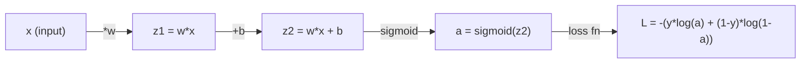
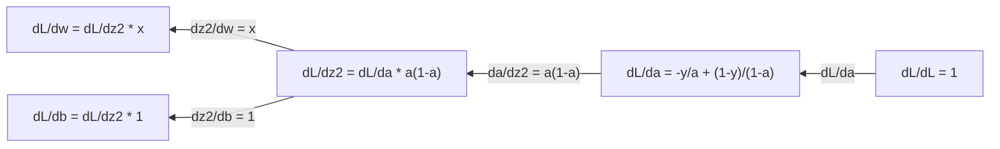
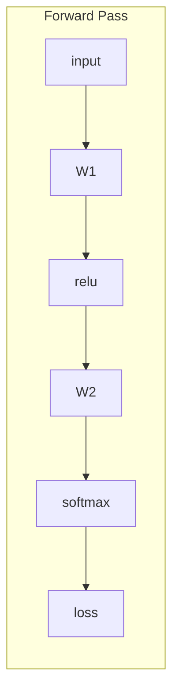
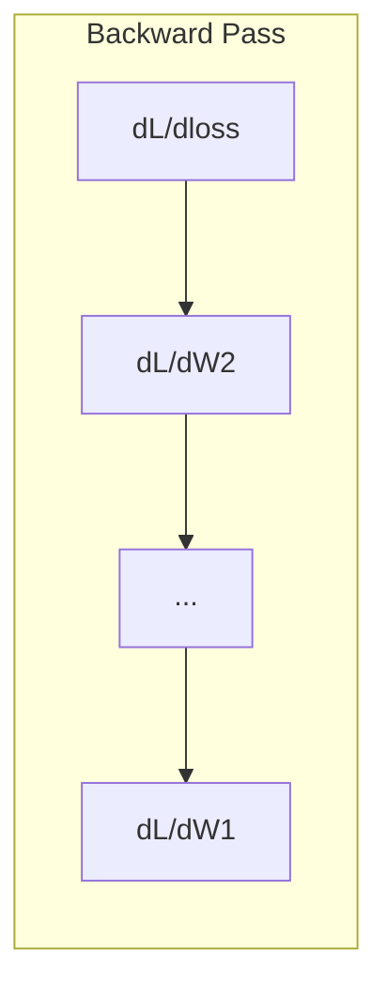

# Rachunek dla uczenia maszynowego

> Instrumenty pochodne mówią Ci, która droga prowadzi w dół. To wszystko, czego sieć neuronowa musi się nauczyć.

**Typ:** Ucz się
**Język:** Python
**Wymagania wstępne:** Faza 1, lekcje 01-03
**Czas:** ~60 minut

## Cele nauczania

- Oblicz pochodne numeryczne i analityczne dla typowych funkcji ML (x^2, sigmoida, entropia krzyżowa)
- Zaimplementuj opadanie gradientu od podstaw, aby zminimalizować funkcję strat w 1D i 2D
- Wyprowadź gradient modelu regresji liniowej i trenuj go za pomocą ręcznych aktualizacji wag
- Wyjaśnić macierz Hessego, przybliżenia szeregów Taylora i ich związek z metodami optymalizacyjnymi

## Problem

Masz sieć neuronową z milionami ciężarków. Każdy ciężarek jest gałką. Musisz dowiedzieć się, w którą stronę obrócić każde pojedyncze pokrętło, aby model był nieco mniej błędny. Rachunek różniczkowy daje ci ten kierunek.

Bez rachunku różniczkowego szkolenie sieci neuronowej oznaczałoby wypróbowywanie przypadkowych zmian i nadzieję na najlepsze. W przypadku instrumentów pochodnych wiesz dokładnie, jak każda waga wpływa na błąd. Za każdym razem przekręcasz każde pokrętło we właściwą stronę.

## Koncepcja

### Co to jest pochodna?

Instrument pochodny mierzy tempo zmian. Dla funkcji y = f(x) pochodna f'(x) mówi: jeśli poruszysz x o niewielką wartość, jak bardzo zmieni się y?

Geometrycznie pochodną jest nachylenie stycznej w punkcie.

**f(x) = x^2:**

| x | f(x) | f'(x) (nachylenie) |
|-------|------|--------------|
| 0 | 0 | 0 (płaski, na dole) |
| 1 | 1 | 2 |
| 2 | 4 | 4 (nachylenie linii stycznej w tym punkcie) |
| 3 | 9 | 6 |

Przy x=2 nachylenie wynosi 4. Jeśli przesuniesz x odrobinę w prawo, y wzrośnie około 4-krotnie. Przy x=0 nachylenie wynosi 0. Znajdujesz się na dnie miski.

Formalna definicja:

```
f'(x) = lim   f(x + h) - f(x)
        h->0  -----------------
                     h
```

W kodzie pomijasz limit i po prostu używasz bardzo małego h. To jest pochodna liczbowa.

### Pochodne cząstkowe: jedna zmienna na raz

Funkcje rzeczywiste mają wiele danych wejściowych. Strata sieci neuronowej zależy od tysięcy wag. Pochodna cząstkowa utrzymuje wszystkie zmienne na stałym poziomie z wyjątkiem jednej, a następnie oblicza pochodną względem tej zmiennej.

```
f(x, y) = x^2 + 3xy + y^2

df/dx = 2x + 3y     (treat y as a constant)
df/dy = 3x + 2y     (treat x as a constant)
```

Każda pochodna cząstkowa odpowiada: jeśli szturchnę tylko tę jedną wagę, jak zmieni się strata?

### Gradient: wektor wszystkich pochodnych cząstkowych

Gradient zbiera każdą pochodną cząstkową w jeden wektor. Dla funkcji f(x, y, z) gradient wynosi:

```
grad f = [ df/dx, df/dy, df/dz ]
```

Nachylenie wskazuje w kierunku najbardziej stromego wzniesienia. Aby zminimalizować funkcję, należy postępować w przeciwnym kierunku.

**Wykres konturowy f(x,y) = x^2 + y^2:**

Funkcja tworzy kształt misy z koncentrycznymi okręgami jako liniami konturowymi. Minimum wynosi (0, 0).

| Punkt | stopień f | -grad f (kierunek opadania) |
|-------|-------|----------------------------|
| (1, 1) | [2, 2] (punkty w górę, z dala od minimum) | [-2, -2] (wskazuje w dół, w kierunku minimum) |
| (0, 0) | [0, 0] (płasko, co najmniej) | [0, 0] |

To jest gradientowe opadanie na zdjęciu. Oblicz gradient, zaneguj go, zrób krok.

### Połączenie z optymalizacją

Uczenie sieci neuronowej to optymalizacja. Masz funkcję straty L(w1, w2, ..., wn), która mierzy, jak błędny jest model. Chcesz to zminimalizować.

```
Gradient descent update rule:

  w_new = w_old - learning_rate * dL/dw

For every weight:
  1. Compute the partial derivative of loss with respect to that weight
  2. Subtract a small multiple of it from the weight
  3. Repeat
```

Szybkość uczenia się kontroluje wielkość kroku. Za duży i przesadzisz. Za mały i czołgasz się.

**Krajobraz strat (wycinek 1D):**

Funkcja straty L(w) tworzy krzywą z wierzchołkami i dolinami w miarę zmiany ciężaru w.

| Funkcja | Opis |
|--------|------------|
| Globalne minimum | Najniższy punkt na całej krzywej – najlepsze rozwiązanie |
| Minimum lokalne | Dolina niższa od sąsiadów, ale ogólnie nie najniższa |
| Nachylenie | Zejście gradientowe następuje po zboczu w dół od dowolnego punktu początkowego |

Zejście gradientowe następuje po zboczu w dół. Może utknąć w lokalnych minimach, ale w przestrzeniach wielowymiarowych (miliony wag) rzadko jest to problem praktyczny.

### Pochodne numeryczne a analityczne

Istnieją dwa sposoby obliczania pochodnej.

Analityczny: ręcznie stosuj reguły rachunku różniczkowego. Dla f(x) = x^2 pochodną jest f'(x) = 2x. Dokładny. Szybko.

Numeryczne: przybliżone na podstawie definicji. Oblicz f(x+h) i f(x-h) dla małego h, a następnie wykorzystaj różnicę.

```
Numerical (central difference):

f'(x) ~= f(x + h) - f(x - h)
          -----------------------
                  2h

h = 0.0001 works well in practice
```

Pochodne numeryczne są wolniejsze, ale działają dla dowolnej funkcji. Pochodne analityczne są szybkie, ale wymagają wyprowadzenia wzoru. Struktury sieci neuronowych wykorzystują trzecie podejście: automatyczne różnicowanie, które mechanicznie oblicza dokładne pochodne. Zobaczysz to w fazie 3.

### Ręczne pochodne prostych funkcji

Są to instrumenty pochodne, które będziesz stale widzieć w ML.

```
Function        Derivative       Used in
--------        ----------       -------
f(x) = x^2     f'(x) = 2x      Loss functions (MSE)
f(x) = wx + b  f'(w) = x        Linear layer (gradient w.r.t. weight)
                f'(b) = 1        Linear layer (gradient w.r.t. bias)
                f'(x) = w        Linear layer (gradient w.r.t. input)
f(x) = e^x     f'(x) = e^x     Softmax, attention
f(x) = ln(x)   f'(x) = 1/x     Cross-entropy loss
f(x) = 1/(1+e^-x)  f'(x) = f(x)(1-f(x))   Sigmoid activation
```

Dla f(x) = x^2:

```
f(x) = x^2    f'(x) = 2x

  x    f(x)   f'(x)   meaning
  -2    4      -4      slope tilts left (decreasing)
  -1    1      -2      slope tilts left (decreasing)
   0    0       0      flat (minimum!)
   1    1       2      slope tilts right (increasing)
   2    4       4      slope tilts right (increasing)
```

Dla f(w) = wx + b przy x=3, b=1:

```
f(w) = 3w + 1    f'(w) = 3

The derivative with respect to w is just x.
If x is big, a small change in w causes a big change in output.
```

### Reguła łańcucha

Kiedy funkcje są złożone, reguła łańcuchowa mówi, jak różnicować.

```
If y = f(g(x)), then dy/dx = f'(g(x)) * g'(x)

Example: y = (3x + 1)^2
  outer: f(u) = u^2       f'(u) = 2u
  inner: g(x) = 3x + 1    g'(x) = 3
  dy/dx = 2(3x + 1) * 3 = 6(3x + 1)
```

Sieci neuronowe to łańcuchy funkcji: wejście -> liniowe -> aktywacja -> liniowe -> aktywacja -> strata. Propagacja wsteczna to reguła łańcuchowa stosowana wielokrotnie od wyjścia do wejścia. To jest cały algorytm.

### Macierz Hesji

Gradient informuje o nachyleniu. Hesjanin informuje Cię o krzywiźnie.

Hesjan jest macierzą pochodnych cząstkowych drugiego rzędu. Dla funkcji f(x1, x2, ..., xn) zapis (i, j) hesjanizmu ma postać:

```
H[i][j] = d^2f / (dx_i * dx_j)
```

Dla funkcji dwóch zmiennych f(x, y):

```
H = | d^2f/dx^2    d^2f/dxdy |
    | d^2f/dydx    d^2f/dy^2 |
```

**Co mówi Ci Hesjan w punkcie krytycznym (gdzie gradient = 0):**

| Własność Hesji | Znaczenie | Przykładowa powierzchnia |
|-----------------|--------|--------------------------------|
| Dodatnio określony (wszystkie wartości własne > 0) | Minimum lokalne | Miska skierowana w górę |
| Ujemnie określone (wszystkie wartości własne < 0) | Lokalne maksimum | Miska skierowana w dół |
| Nieokreślone (mieszane wartości własne) | Punkt siodłowy | Kształt siodła konia |

**Przykład:** f(x, y) = x^2 - y^2 (funkcja siodłowa)

```
df/dx = 2x       df/dy = -2y
d^2f/dx^2 = 2    d^2f/dy^2 = -2    d^2f/dxdy = 0

H = | 2   0 |
    | 0  -2 |

Eigenvalues: 2 and -2 (one positive, one negative)
--> Saddle point at (0, 0)
```

Porównaj z f(x, y) = x^2 + y^2 (miska):

```
H = | 2  0 |
    | 0  2 |

Eigenvalues: 2 and 2 (both positive)
--> Local minimum at (0, 0)
```

**Dlaczego Hesjan ma znaczenie w ML:**

Metoda Newtona wykorzystuje metodę Hesja do podjęcia lepszych kroków optymalizacyjnych niż opadanie gradientowe. Zamiast po prostu podążać za zboczem, uwzględnia krzywiznę:

```
Newton's update:    w_new = w_old - H^(-1) * gradient
Gradient descent:   w_new = w_old - lr * gradient
```

Metoda Newtona osiąga zbieżność szybciej, ponieważ Hesjan „przeskalowuje” gradient — strome kierunki wymagają mniejszych kroków, płaskie kierunki — większe kroki.

Haczyk: w przypadku sieci neuronowej z N parametrami hesjan to N x N. Model z 1 milionem parametrów wymagałby macierzy zawierającej 1 bilion wpisów. Dlatego używamy przybliżeń.

| Metoda | Czego używa | Koszt | Konwergencja |
|------------|------------|------|------------|
| Zejście gradientowe | Tylko pierwsze instrumenty pochodne | O(N) na krok | Powolny (liniowy) |
| Metoda Newtona | Pełny Heski | O(N^3) na krok | Szybki (kwadratowy) |
| L-BFGS | Przybliżony hesjan z historii gradientów | O(N) na krok | Średni (superliniowy) |
| Adama | Współczynniki adaptacyjne według parametrów (w przybliżeniu ukośna Hesja) | O(N) na krok | Średni |
| Naturalny gradient | Matryca informacji Fishera (statystyczna Hesja) | O(N^2) na krok | Szybki |

W praktyce Adam jest domyślnym optymalizatorem głębokiego uczenia się. Niedrogo aproksymuje informacje drugiego rzędu, śledząc średnią bieżącą i wariancję gradientów dla każdego parametru.

### Aproksymacja szeregu Taylora

Każdą gładką funkcję można aproksymować lokalnie wielomianem:

```
f(x + h) = f(x) + f'(x)*h + (1/2)*f''(x)*h^2 + (1/6)*f'''(x)*h^3 + ...
```

Im więcej terminów uwzględnisz, tym lepsze przybliżenie - ale tylko w pobliżu punktu x.

**Dlaczego szereg Taylora ma znaczenie dla ML:**

- **Taylor pierwszego rzędu = zejście gradientowe.** Używając f(x + h) ~ f(x) + f'(x)*h, dokonujesz przybliżenia liniowego. Zejście gradientowe minimalizuje ten model liniowy, aby wybrać h = -lr * f'(x).

- **Taylor drugiego rzędu = metoda Newtona.** Używając f(x + h) ~ f(x) + f'(x)*h + (1/2)*f''(x)*h^2, otrzymujesz model kwadratowy. Minimalizowanie daje h = -f'(x)/f''(x) -- krok Newtona.

- **Projekt funkcji straty.** MSE i entropia krzyżowa są gładkie, co oznacza, że ​​ich rozwinięcia Taylora zachowują się prawidłowo. To nie jest wypadek. Płynne straty sprawiają, że optymalizacja jest przewidywalna.

```
Approximation order    What it captures    Optimization method
-------------------    -----------------   -------------------
0th order (constant)   Just the value      Random search
1st order (linear)     Slope               Gradient descent
2nd order (quadratic)  Curvature           Newton's method
Higher orders          Finer structure     Rarely used in ML
```

Kluczowy spostrzeżenie: wszelka optymalizacja oparta na gradientach tak naprawdę polega na lokalnym przybliżeniu funkcji straty i przejściu do minimum tego przybliżenia.

### Całki w ML

Instrumenty pochodne informują o tempie zmian. Całki obliczają akumulacje – pole pod krzywą.

W ML rzadko oblicza się całki ręcznie, ale koncepcja jest wszędzie:

**Prawdopodobieństwo.** Dla ciągłej zmiennej losowej o gęstości p(x):

```
P(a < X < b) = integral from a to b of p(x) dx
```

Obszar pod krzywą gęstości prawdopodobieństwa pomiędzy a i b to prawdopodobieństwo lądowania w tym zakresie.

**Wartość oczekiwana.** Średni wynik ważony prawdopodobieństwem:

```
E[f(X)] = integral of f(x) * p(x) dx
```

Oczekiwana strata w wyniku dystrybucji danych jest całką. Trening minimalizuje empiryczne przybliżenie tego.

**Rozbieżność KL.** Mierzy różnicę pomiędzy dwoma rozkładami:

```
KL(p || q) = integral of p(x) * log(p(x) / q(x)) dx
```

Używany w VAE, destylacji wiedzy i wnioskowaniu bayesowskim.

**Stałe normalizacyjne.** We wnioskowaniu bayesowskim:

```
p(w | data) = p(data | w) * p(w) / integral of p(data | w) * p(w) dw
```

Mianownik jest całką po wszystkich możliwych wartościach parametrów. Często jest to trudne do rozwiązania, dlatego używamy przybliżeń, takich jak MCMC i wnioskowania wariacyjnego.

| Integralna koncepcja | Gdzie pojawia się w ML |
|----------------|----------------------|
| Powierzchnia pod krzywą | Prawdopodobieństwo z funkcji gęstości |
| Oczekiwana wartość | Funkcje straty, minimalizacja ryzyka |
| Rozbieżność KL | VAE, optymalizacja polityki, destylacja |
| Normalizacja | Tylne części Bayesa, mianownik softmax |
| Prawdopodobieństwo krańcowe | Porównanie modeli, dolna granica dowodów (ELBO) |

### Reguła łańcucha wielu zmiennych na wykresie obliczeniowym

Reguła łańcucha nie dotyczy tylko funkcji skalarnych w linii. W sieci neuronowej zmienne rozdzielają się i łączą. Oto jak instrumenty pochodne przepływają przez proste przejście w przód:



Przejście wstecz oblicza gradienty od prawej do lewej:



Każda strzałka mnoży przez lokalną pochodną. Gradient dowolnego parametru jest iloczynem wszystkich lokalnych pochodnych na ścieżce od straty do tego parametru. Kiedy ścieżki rozgałęziają się i łączą, sumuje się wkłady (reguła łańcucha wieloczynnikowego).

To wszystko jest propagacją wsteczną: reguła łańcucha stosowana systematycznie poprzez wykres obliczeniowy, od wyjścia do wejść.

### Macierz Jakobiana

Kiedy funkcja odwzorowuje wektor na wektor (jak warstwa sieci neuronowej), jej pochodną jest macierz. Jakobian zawiera każdą pochodną cząstkową każdego wyniku w odniesieniu do każdego wejścia.

Dla f: R^n -> R^m, jakobian J jest macierzą m x n:

| | x1 | x2 | ... | xn |
|---|---|---|---|---|
| f1 | df1/dx1 | df1/dx2 | ... | df1/dxn |
| f2 | df2/dx1 | df2/dx2 | ... | df2/dxn |
| ... | ... | ... | ... | ... |
| fm | dfm/dx1 | dfm/dx2 | ... | dfm/dxn |

Nie będziesz obliczać jakobianów ręcznie dla sieci neuronowych. PyTorch sobie z tym radzi. Ale wiedza o tym, że istnieje, pomaga zrozumieć kształty w propagacji wstecznej: jeśli warstwa odwzorowuje R^n na R^m, jej jakobian wynosi m x n. Gradient przepływa wstecz poprzez transpozycję tej macierzy.

### Dlaczego ma to znaczenie w przypadku sieci neuronowych

Każdy ciężar w sieci neuronowej otrzymuje gradient. Gradient informuje Cię, jak dostosować ciężar, aby zmniejszyć stratę.





Każda aktualizacja wagi:
- `W1 = W1 - lr * dL/dW1`
- `W2 = W2 - lr * dL/dW2`

Przejście do przodu oblicza przewidywanie i stratę. Przejście wstecz oblicza gradient straty w odniesieniu do każdego ciężaru. Wtedy każdy ciężar robi mały krok w dół. Powtarzaj dla milionów kroków. To jest głębokie uczenie się.

## Zbuduj to

### Krok 1: Pochodna numeryczna od podstaw

```python
def numerical_derivative(f, x, h=1e-7):
    return (f(x + h) - f(x - h)) / (2 * h)

def f(x):
    return x ** 2

for x in [-2, -1, 0, 1, 2]:
    numerical = numerical_derivative(f, x)
    analytical = 2 * x
    print(f"x={x:2d}  f'(x) numerical={numerical:.6f}  analytical={analytical:.1f}")
```

Pochodna liczbowa dopasowuje pochodną analityczną do wielu miejsc po przecinku.

### Krok 2: Pochodne cząstkowe i gradienty

```python
def numerical_gradient(f, point, h=1e-7):
    gradient = []
    for i in range(len(point)):
        point_plus = list(point)
        point_minus = list(point)
        point_plus[i] += h
        point_minus[i] -= h
        partial = (f(point_plus) - f(point_minus)) / (2 * h)
        gradient.append(partial)
    return gradient

def f_multi(point):
    x, y = point
    return x**2 + 3*x*y + y**2

grad = numerical_gradient(f_multi, [1.0, 2.0])
print(f"Numerical gradient at (1,2): {[f'{g:.4f}' for g in grad]}")
print(f"Analytical gradient at (1,2): [2*1+3*2, 3*1+2*2] = [{2*1+3*2}, {3*1+2*2}]")
```

### Krok 3: Zniżanie gradientowe w celu znalezienia minimum f(x) = x^2

```python
x = 5.0
lr = 0.1
for step in range(20):
    grad = 2 * x
    x = x - lr * grad
    print(f"step {step:2d}  x={x:8.4f}  f(x)={x**2:10.6f}")
```

Zaczynając od x=5, każdy krok zbliża się do x=0 (minimum).

### Krok 4: Zejście gradientowe w funkcji 2D

```python
def f_2d(point):
    x, y = point
    return x**2 + y**2

point = [4.0, 3.0]
lr = 0.1
for step in range(30):
    grad = numerical_gradient(f_2d, point)
    point = [p - lr * g for p, g in zip(point, grad)]
    loss = f_2d(point)
    if step % 5 == 0 or step == 29:
        print(f"step {step:2d}  point=({point[0]:7.4f}, {point[1]:7.4f})  f={loss:.6f}")
```

### Krok 5: Porównanie pochodnych numerycznych i analitycznych

```python
import math

test_functions = [
    ("x^2",      lambda x: x**2,          lambda x: 2*x),
    ("x^3",      lambda x: x**3,          lambda x: 3*x**2),
    ("sin(x)",   lambda x: math.sin(x),   lambda x: math.cos(x)),
    ("e^x",      lambda x: math.exp(x),   lambda x: math.exp(x)),
    ("1/x",      lambda x: 1/x,           lambda x: -1/x**2),
]

x = 2.0
print(f"{'Function':<12} {'Numerical':>12} {'Analytical':>12} {'Error':>12}")
print("-" * 50)
for name, f, df in test_functions:
    num = numerical_derivative(f, x)
    ana = df(x)
    err = abs(num - ana)
    print(f"{name:<12} {num:12.6f} {ana:12.6f} {err:12.2e}")
```

### Krok 6: Obliczanie liczbowe Hesja

```python
def hessian_2d(f, x, y, h=1e-5):
    fxx = (f(x + h, y) - 2 * f(x, y) + f(x - h, y)) / (h ** 2)
    fyy = (f(x, y + h) - 2 * f(x, y) + f(x, y - h)) / (h ** 2)
    fxy = (f(x + h, y + h) - f(x + h, y - h) - f(x - h, y + h) + f(x - h, y - h)) / (4 * h ** 2)
    return [[fxx, fxy], [fxy, fyy]]

def saddle(x, y):
    return x ** 2 - y ** 2

def bowl(x, y):
    return x ** 2 + y ** 2

H_saddle = hessian_2d(saddle, 0.0, 0.0)
H_bowl = hessian_2d(bowl, 0.0, 0.0)
print(f"Saddle Hessian: {H_saddle}")  # [[2, 0], [0, -2]] -- mixed signs
print(f"Bowl Hessian:   {H_bowl}")    # [[2, 0], [0, 2]]  -- both positive
```

Hesjan funkcji siodłowej ma wartości własne 2 i -2 (znaki mieszane, potwierdzające punkt siodłowy). Miska ma wartości własne 2 i 2 (obie dodatnie, potwierdzające minimum).

### Krok 7: Przybliżenie Taylora w działaniu

```python
import math

def taylor_approx(f, f_prime, f_double_prime, x0, h, order=2):
    result = f(x0)
    if order >= 1:
        result += f_prime(x0) * h
    if order >= 2:
        result += 0.5 * f_double_prime(x0) * h ** 2
    return result

x0 = 0.0
for h in [0.1, 0.5, 1.0, 2.0]:
    true_val = math.sin(h)
    t1 = taylor_approx(math.sin, math.cos, lambda x: -math.sin(x), x0, h, order=1)
    t2 = taylor_approx(math.sin, math.cos, lambda x: -math.sin(x), x0, h, order=2)
    print(f"h={h:.1f}  sin(h)={true_val:.4f}  order1={t1:.4f}  order2={t2:.4f}")
```

Blisko x0=0, sin(x) ~ x (Taylor pierwszego rzędu). Przybliżenie jest doskonałe dla małych h, ale załamuje się dla dużych h. Dlatego też opadanie gradientowe najlepiej sprawdza się przy małych szybkościach uczenia się — w każdym kroku zakłada się, że aproksymacja liniowa jest dokładna.

### Krok 8: Dlaczego ma to znaczenie dla sieci neuronowej

```python
import random

random.seed(42)

w = random.gauss(0, 1)
b = random.gauss(0, 1)
lr = 0.01

xs = [1.0, 2.0, 3.0, 4.0, 5.0]
ys = [3.0, 5.0, 7.0, 9.0, 11.0]

for epoch in range(200):
    total_loss = 0
    dw = 0
    db = 0
    for x, y in zip(xs, ys):
        pred = w * x + b
        error = pred - y
        total_loss += error ** 2
        dw += 2 * error * x
        db += 2 * error
    dw /= len(xs)
    db /= len(xs)
    total_loss /= len(xs)
    w -= lr * dw
    b -= lr * db
    if epoch % 40 == 0 or epoch == 199:
        print(f"epoch {epoch:3d}  w={w:.4f}  b={b:.4f}  loss={total_loss:.6f}")

print(f"\nLearned: y = {w:.2f}x + {b:.2f}")
print(f"Actual:  y = 2x + 1")
```

Każda pętla treningowa oparta na gradientach jest zgodna z tym wzorcem: przewidywanie, obliczanie strat, obliczanie gradientów, aktualizowanie wag.

## Użyj tego

Dzięki NumPy te same operacje są szybsze i bardziej zwięzłe:

```python
import numpy as np

x = np.array([1, 2, 3, 4, 5], dtype=float)
y = np.array([3, 5, 7, 9, 11], dtype=float)

w, b = np.random.randn(), np.random.randn()
lr = 0.01

for epoch in range(200):
    pred = w * x + b
    error = pred - y
    loss = np.mean(error ** 2)
    dw = np.mean(2 * error * x)
    db = np.mean(2 * error)
    w -= lr * dw
    b -= lr * db

print(f"Learned: y = {w:.2f}x + {b:.2f}")
```

Właśnie zbudowałeś gradientowe zejście od podstaw. PyTorch automatyzuje obliczenia gradientu, ale pętla aktualizacji jest identyczna.

## Ćwiczenia

1. Zaimplementuj `numerical_second_derivative(f, x)`, używając dwukrotnie wywołanego `numerical_derivative`. Sprawdź, że druga pochodna x^3 przy x=2 wynosi 12.
2. Użyj gradientu, aby znaleźć minimum f(x, y) = (x - 3)^2 + (y + 1)^2. Zacznij od (0, 0). Odpowiedź powinna zbiegać się do (3, -1).
3. Dodaj pęd do pętli opadania gradientu: utrzymuj wektor prędkości, który gromadzi przeszłe gradienty. Porównaj prędkość zbieżności z pędem i bez pędu na f(x) = x^4 - 3x^2.

## Kluczowe terminy

| Termin | Co ludzie mówią | Co to właściwie oznacza |
|------|----------------|----------------------|
| Pochodna | „Na zboczu” | Szybkość zmian funkcji w punkcie. Informuje, o ile zmienia się moc wyjściowa na jednostkę zmiany sygnału wejściowego. |
| Częściowa pochodna | „Pochodna jednej zmiennej” | Pochodna względem jednej zmiennej, podczas gdy wszystkie pozostałe pozostają stałe. |
| Gradient | „Kierunek najbardziej stromego wzniesienia” | Wektor wszystkich pochodnych cząstkowych. Wskazuje kierunek, który najszybciej zwiększa funkcję. |
| Zejście gradientowe | „Idź w dół” | Odejmij gradient (razy szybkość uczenia się) od parametrów, aby zmniejszyć straty. Istota treningu sieci neuronowych. |
| Szybkość uczenia się | „Rozmiar kroku” | Skalar kontrolujący wielkość każdego kroku opadania gradientu. Za duże: rozbieżne. Za mały: zbiegają się powoli. |
| Reguła łańcucha | „Pomnóż pochodne” | Zasada różniczkowania funkcji złożonych: df/dx = df/dg * dg/dx. Matematyczne podstawy propagacji wstecznej. |
| Jakobian | „Macierz instrumentów pochodnych” | Kiedy funkcja odwzorowuje wektory na wektory, jakobian jest macierzą wszystkich pochodnych cząstkowych wyników względem danych wejściowych. |
| Pochodna numeryczna | „Różnice skończone” | Przybliżanie pochodnej poprzez obliczenie funkcji w dwóch sąsiadujących punktach i obliczenie nachylenia między nimi. |
| Propagacja wsteczna | „Autodiff w trybie cofania” | Obliczanie gradientów warstwa po warstwie od wyjścia do wejścia przy użyciu reguły łańcucha. Jak uczą się sieci neuronowe. |
| Heski | „Macierz drugich pochodnych” | Macierz wszystkich pochodnych cząstkowych drugiego rzędu. Opisuje krzywiznę funkcji. Dodatni określony Hesjan w punkcie krytycznym oznacza minimum lokalne. |
| Seria Taylora | „Przybliżenie wielomianowe” | Aproksymacja funkcji w pobliżu punktu za pomocą jej pochodnych: f(x+h) ~ f(x) + f'(x)h + (1/2)f''(x)h^2 + ... Podstawa do zrozumienia, dlaczego działa zejście gradientowe i metoda Newtona. |
| Całka | „Pole pod krzywą” | Akumulacja ilości w pewnym zakresie. W ML całki definiują prawdopodobieństwa, wartości oczekiwane i rozbieżność KL. |

## Dalsze czytanie

- [3Blue1Brown: Istota rachunku różniczkowego](https://www.3blue1brown.com/topics/calculus) - intuicja wizualna dla pochodnych, całek i reguły łańcuchowej
- [Stanford CS231n: Propagacja wsteczna](https://cs231n.github.io/optimization-2/) - jak gradienty przepływają przez warstwy sieci neuronowej