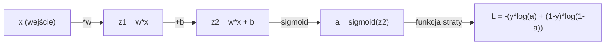
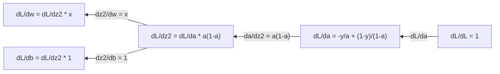
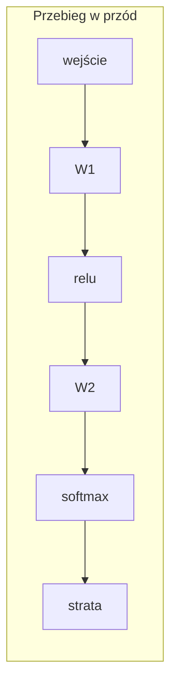
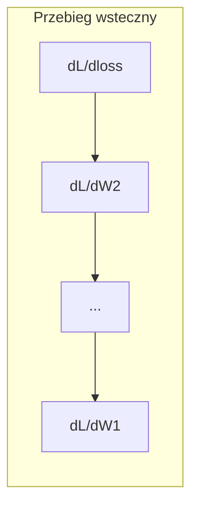

# Rachunek różniczkowy dla uczenia maszynowego

> Pochodne mówią, w którą stronę jest „w dół”. To wszystko, czego potrzebuje sieć neuronowa, żeby się uczyć.

**Typ:** Nauka
**Język:** Python
**Wymagania wstępne:** Faza 1, Lekcje 01-03
**Czas:** ~60 minut

## Cele nauki

- Obliczanie numerycznych i analitycznych pochodnych dla typowych funkcji w ML (x^2, sigmoid, cross-entropy)
- Implementacja gradientu prostego (gradient descent) od podstaw, aby zminimalizować funkcję straty w 1D i 2D
- Wyprowadzenie gradientu modelu regresji liniowej i wytrenowanie go poprzez ręczne aktualizacje wag
- Wyjaśnienie macierzy Hessego, przybliżeń szeregiem Taylora oraz ich powiązania z metodami optymalizacji

## Problem

Masz sieć neuronową z milionami wag. Każda waga to pokrętło. Musisz ustalić, w którą stronę przekręcić każde pojedyncze pokrętło, aby model był odrobinę mniej błędny. Rachunek różniczkowy daje ci ten kierunek.

Bez rachunku różniczkowego trenowanie sieci neuronowej oznaczałoby próbowanie losowych zmian i liczenie na to, że się powiedzie. Z pochodnymi wiesz dokładnie, jak każda waga wpływa na błąd. Przekręcasz każde pokrętło we właściwą stronę, za każdym razem.

## Koncepcja

### Czym jest pochodna?

Pochodna mierzy szybkość zmiany. Dla funkcji y = f(x) pochodna f'(x) mówi: jeśli zmienisz x o bardzo małą wartość, o ile zmieni się y?

Geometrycznie pochodna to nachylenie (slope) stycznej do wykresu w danym punkcie.

**f(x) = x^2:**

| x | f(x) | f'(x) (nachylenie) |
|---|------|---------------|
| 0 | 0    | 0 (płasko, na dnie) |
| 1 | 1    | 2 |
| 2 | 4    | 4 (nachylenie stycznej w tym punkcie) |
| 3 | 9    | 6 |

Przy x=2 nachylenie wynosi 4. Jeśli przesuniesz x o odrobinę w prawo, y zwiększy się o około 4-krotność tej zmiany. Przy x=0 nachylenie wynosi 0. Jesteś na dnie misy.

Formalna definicja:

```
f'(x) = lim   f(x + h) - f(x)
        h->0  -----------------
                     h
```

W kodzie pomijasz granicę i po prostu używasz bardzo małego h. To jest pochodna numeryczna.

### Pochodne cząstkowe: jedna zmienna na raz

Rzeczywiste funkcje mają wiele zmiennych wejściowych. Funkcja straty sieci neuronowej zależy od tysięcy wag. Pochodna cząstkowa traktuje wszystkie zmienne jako stałe poza jedną, a następnie liczy pochodną względem tej jednej.

```
f(x, y) = x^2 + 3xy + y^2

df/dx = 2x + 3y     (traktuj y jako stałą)
df/dy = 3x + 2y     (traktuj x jako stałą)
```

Każda pochodna cząstkowa odpowiada na pytanie: jeśli zmienię tylko tę jedną wagę, jak zmieni się strata?

### Gradient: wektor wszystkich pochodnych cząstkowych

Gradient zbiera wszystkie pochodne cząstkowe w jeden wektor. Dla funkcji f(x, y, z) gradient to:

```
grad f = [ df/dx, df/dy, df/dz ]
```

Gradient wskazuje kierunek najszybszego wzrostu funkcji. Aby zminimalizować funkcję, idź w przeciwnym kierunku.

**Wykres warstwicowy f(x,y) = x^2 + y^2:**

Funkcja tworzy kształt misy z koncentrycznymi okręgami jako liniami warstwicowymi. Minimum znajduje się w punkcie (0, 0).

| Punkt | grad f | -grad f (kierunek schodzenia) |
|-------|--------|----------------------------|
| (1, 1) | [2, 2] (wskazuje pod górę, w stronę przeciwną do minimum) | [-2, -2] (wskazuje w dół, w stronę minimum) |
| (0, 0) | [0, 0] (płasko, w minimum) | [0, 0] |

To właśnie gradient descent na obrazku. Oblicz gradient, odwróć jego znak, wykonaj krok.

### Powiązanie z optymalizacją

Trenowanie sieci neuronowej to optymalizacja. Masz funkcję straty L(w1, w2, ..., wn), która mierzy, jak bardzo model się myli. Chcesz ją zminimalizować.

```
Reguła aktualizacji w gradient descent:

  w_new = w_old - learning_rate * dL/dw

Dla każdej wagi:
  1. Oblicz pochodną cząstkową straty względem tej wagi
  2. Odejmij od wagi małą wielokrotność tej pochodnej
  3. Powtarzaj
```

Współczynnik uczenia (learning rate) kontroluje rozmiar kroku. Zbyt duży i przeskoczysz cel. Zbyt mały i będziesz się czołgać.

**Krajobraz straty (przekrój 1D):**

Funkcja straty L(w) tworzy krzywą z wzniesieniami i dolinami w miarę zmiany wagi w.

| Cecha | Opis |
|---------|-------------|
| Minimum globalne | Najniższy punkt na całej krzywej -- najlepsze rozwiązanie |
| Minimum lokalne | Dolina niższa niż jej sąsiedztwo, ale nie najniższa ogólnie |
| Nachylenie | Gradient descent podąża po nachyleniu w dół z dowolnego punktu startowego |

Gradient descent podąża po nachyleniu w dół. Może utknąć w minimach lokalnych, ale w przestrzeniach o wysokiej wymiarowości (miliony wag) jest to rzadko praktycznym problemem.

### Pochodne numeryczne a analityczne

Istnieją dwa sposoby obliczania pochodnej.

Analityczny: zastosuj reguły rachunku różniczkowego ręcznie. Dla f(x) = x^2 pochodna wynosi f'(x) = 2x. Dokładny. Szybki.

Numeryczny: przybliż za pomocą definicji. Oblicz f(x+h) i f(x-h) dla małego h, a następnie wykorzystaj różnicę.

```
Numeryczna (różnica centralna):

f'(x) ~= f(x + h) - f(x - h)
          -----------------------
                  2h

h = 0.0001 sprawdza się w praktyce
```

Pochodne numeryczne są wolniejsze, ale działają dla dowolnej funkcji. Pochodne analityczne są szybkie, ale wymagają wyprowadzenia wzoru. Frameworki do sieci neuronowych stosują trzecie podejście: różniczkowanie automatyczne (automatic differentiation), które oblicza dokładne pochodne mechanicznie. Zobaczysz to w Fazie 3.

### Pochodne ręczne dla prostych funkcji

To są pochodne, które będziesz widzieć w ML w kółko.

```
Funkcja        Pochodna       Zastosowanie
--------       ----------     -------
f(x) = x^2     f'(x) = 2x      Funkcje straty (MSE)
f(x) = wx + b  f'(w) = x        Warstwa liniowa (gradient względem wagi)
                f'(b) = 1        Warstwa liniowa (gradient względem biasu)
                f'(x) = w        Warstwa liniowa (gradient względem wejścia)
f(x) = e^x     f'(x) = e^x     Softmax, attention
f(x) = ln(x)   f'(x) = 1/x     Funkcja straty cross-entropy
f(x) = 1/(1+e^-x)  f'(x) = f(x)(1-f(x))   Funkcja aktywacji sigmoid
```

Dla f(x) = x^2:

```
f(x) = x^2    f'(x) = 2x

  x    f(x)   f'(x)   znaczenie
  -2    4      -4      nachylenie w lewo (malejące)
  -1    1      -2      nachylenie w lewo (malejące)
   0    0       0      płasko (minimum!)
   1    1       2      nachylenie w prawo (rosnące)
   2    4       4      nachylenie w prawo (rosnące)
```

Dla f(w) = wx + b z x=3, b=1:

```
f(w) = 3w + 1    f'(w) = 3

Pochodna względem w to po prostu x.
Jeśli x jest duże, mała zmiana w powoduje dużą zmianę wyjścia.
```

### Reguła łańcuchowa (chain rule)

Gdy funkcje są złożone, reguła łańcuchowa mówi, jak je różniczkować.

```
Jeśli y = f(g(x)), to dy/dx = f'(g(x)) * g'(x)

Przykład: y = (3x + 1)^2
  zewnętrzna: f(u) = u^2       f'(u) = 2u
  wewnętrzna: g(x) = 3x + 1    g'(x) = 3
  dy/dx = 2(3x + 1) * 3 = 6(3x + 1)
```

Sieci neuronowe to łańcuchy funkcji: wejście -> warstwa liniowa -> aktywacja -> warstwa liniowa -> aktywacja -> strata. Backpropagation to reguła łańcuchowa zastosowana wielokrotnie od wyjścia do wejścia. To cały algorytm.

### Macierz Hessego

Gradient mówi ci o nachyleniu. Hessian mówi ci o krzywiźnie.

Hessian to macierz pochodnych cząstkowych drugiego rzędu. Dla funkcji f(x1, x2, ..., xn) element (i, j) macierzy Hessego to:

```
H[i][j] = d^2f / (dx_i * dx_j)
```

Dla funkcji dwuzmiennowej f(x, y):

```
H = | d^2f/dx^2    d^2f/dxdy |
    | d^2f/dydx    d^2f/dy^2 |
```

**Co Hessian mówi ci w punkcie krytycznym (gdzie gradient = 0):**

| Właściwość Hessianu | Znaczenie | Przykładowa powierzchnia |
|-----------------|---------|-----------------|
| Dodatnio określony (wszystkie wartości własne > 0) | Minimum lokalne | Misa skierowana do góry |
| Ujemnie określony (wszystkie wartości własne < 0) | Maksimum lokalne | Misa skierowana do dołu |
| Nieokreślony (mieszane wartości własne) | Punkt siodłowy | Kształt siodła końskiego |

**Przykład:** f(x, y) = x^2 - y^2 (funkcja siodłowa)

```
df/dx = 2x       df/dy = -2y
d^2f/dx^2 = 2    d^2f/dy^2 = -2    d^2f/dxdy = 0

H = | 2   0 |
    | 0  -2 |

Wartości własne: 2 i -2 (jedna dodatnia, jedna ujemna)
--> Punkt siodłowy w (0, 0)
```

Porównaj z f(x, y) = x^2 + y^2 (misa):

```
H = | 2  0 |
    | 0  2 |

Wartości własne: 2 i 2 (obie dodatnie)
--> Minimum lokalne w (0, 0)
```

**Dlaczego Hessian ma znaczenie w ML:**

Metoda Newtona wykorzystuje Hessian do wykonywania lepszych kroków optymalizacji niż gradient descent. Zamiast po prostu podążać po nachyleniu, uwzględnia krzywiznę:

```
Aktualizacja Newtona:    w_new = w_old - H^(-1) * gradient
Gradient descent:        w_new = w_old - lr * gradient
```

Metoda Newtona zbiega szybciej, ponieważ Hessian "przeskalowuje" gradient -- strome kierunki dostają mniejsze kroki, płaskie kierunki dostają większe kroki.

Haczyk: dla sieci neuronowej z N parametrami Hessian ma rozmiar N x N. Model z 1 milionem parametrów wymagałby macierzy o 1 bilionie elementów. Dlatego stosujemy przybliżenia.

| Metoda | Co wykorzystuje | Koszt | Zbieżność |
|--------|-------------|------|-------------|
| Gradient descent | Tylko pochodne pierwszego rzędu | O(N) na krok | Wolna (liniowa) |
| Metoda Newtona | Pełny Hessian | O(N^3) na krok | Szybka (kwadratowa) |
| L-BFGS | Przybliżony Hessian na podstawie historii gradientów | O(N) na krok | Średnia (superliniowa) |
| Adam | Adaptacyjne tempo dla każdego parametru (przybliżenie diagonalnego Hessianu) | O(N) na krok | Średnia |
| Gradient naturalny | Macierz informacji Fishera (statystyczny Hessian) | O(N^2) na krok | Szybka |

W praktyce Adam jest domyślnym optymalizatorem dla głębokiego uczenia. Przybliża informacje drugiego rzędu tanim kosztem, śledząc bieżącą średnią i wariancję gradientów dla każdego parametru.

### Przybliżenie szeregiem Taylora

Każdą gładką funkcję można lokalnie przybliżyć wielomianem:

```
f(x + h) = f(x) + f'(x)*h + (1/2)*f''(x)*h^2 + (1/6)*f'''(x)*h^3 + ...
```

Im więcej wyrazów uwzględnisz, tym lepsze przybliżenie -- ale tylko w pobliżu punktu x.

**Dlaczego szereg Taylora ma znaczenie dla ML:**

- **Przybliżenie pierwszego rzędu = gradient descent.** Gdy używasz f(x + h) ~ f(x) + f'(x)*h, dokonujesz przybliżenia liniowego. Gradient descent minimalizuje ten model liniowy, wybierając h = -lr * f'(x).

- **Przybliżenie drugiego rzędu = metoda Newtona.** Używając f(x + h) ~ f(x) + f'(x)*h + (1/2)*f''(x)*h^2, otrzymujesz model kwadratowy. Jego minimalizacja daje h = -f'(x)/f''(x) -- krok Newtona.

- **Projektowanie funkcji straty.** MSE i cross-entropy są gładkie, co oznacza, że ich rozwinięcia Taylora są dobrze zachowane. To nie jest przypadek. Gładkie funkcje straty czynią optymalizację przewidywalną.

```
Rząd przybliżenia       Co opisuje          Metoda optymalizacji
-------------------     -----------------   -------------------
Rząd 0 (stała)          Tylko wartość       Przeszukiwanie losowe
Rząd 1 (liniowy)        Nachylenie          Gradient descent
Rząd 2 (kwadratowy)     Krzywizna           Metoda Newtona
Wyższe rzędy            Drobniejsza struktura  Rzadko używane w ML
```

Kluczowa obserwacja: cała optymalizacja oparta na gradiencie polega tak naprawdę na lokalnym przybliżaniu funkcji straty i wykonywaniu kroku do minimum tego przybliżenia.

### Całki w ML

Pochodne mówią o szybkości zmian. Całki obliczają akumulacje -- pole pod krzywą.

W ML rzadko liczy się całki ręcznie, ale ta koncepcja jest wszechobecna:

**Prawdopodobieństwo.** Dla ciągłej zmiennej losowej z gęstością p(x):
```
P(a < X < b) = całka od a do b z p(x) dx
```
Pole pod krzywą gęstości prawdopodobieństwa między a i b to prawdopodobieństwo trafienia w ten zakres.

**Wartość oczekiwana.** Średni wynik ważony prawdopodobieństwem:
```
E[f(X)] = całka z f(x) * p(x) dx
```
Oczekiwana strata na rozkładzie danych jest całką. Trenowanie minimalizuje empiryczne przybliżenie tej wartości.

**Dywergencja KL.** Mierzy, jak bardzo różnią się dwa rozkłady:
```
KL(p || q) = całka z p(x) * log(p(x) / q(x)) dx
```
Wykorzystywana w VAE, destylacji wiedzy (knowledge distillation) i wnioskowaniu bayesowskim.

**Stałe normalizacyjne.** We wnioskowaniu bayesowskim:
```
p(w | data) = p(data | w) * p(w) / całka z p(data | w) * p(w) dw
```
Mianownik to całka po wszystkich możliwych wartościach parametrów. Często jest nieobliczalna, dlatego stosujemy przybliżenia, takie jak MCMC i wnioskowanie wariacyjne.

| Pojęcie całkowe | Gdzie pojawia się w ML |
|-----------------|----------------------|
| Pole pod krzywą | Prawdopodobieństwo z funkcji gęstości |
| Wartość oczekiwana | Funkcje straty, minimalizacja ryzyka |
| Dywergencja KL | VAE, optymalizacja polityki, destylacja |
| Normalizacja | Rozkłady a posteriori w Bayesie, mianownik softmax |
| Wiarygodność brzegowa | Porównywanie modeli, evidence lower bound (ELBO) |

### Wielowymiarowa reguła łańcuchowa w grafie obliczeniowym

Reguła łańcuchowa nie dotyczy tylko funkcji skalarnych ułożonych liniowo. W sieci neuronowej zmienne się rozgałęziają i łączą. Oto jak pochodne przepływają przez prosty przebieg w przód:



Przebieg wsteczny oblicza gradienty od prawej do lewej:



Każda strzałka mnoży przez lokalną pochodną. Gradient dla dowolnego parametru to iloczyn wszystkich lokalnych pochodnych wzdłuż ścieżki od straty do tego parametru. Gdy ścieżki się rozgałęziają i łączą, sumujesz wkłady (wielowymiarowa reguła łańcuchowa).

To jest cała backpropagation: reguła łańcuchowa zastosowana systematycznie w grafie obliczeniowym, od wyjścia do wejść.

### Macierz Jacobiego

Gdy funkcja odwzorowuje wektor na wektor (jak warstwa sieci neuronowej), jej pochodna jest macierzą. Jacobian zawiera każdą pochodną cząstkową każdego wyjścia względem każdego wejścia.

Dla f: R^n -> R^m, Jacobian J jest macierzą m x n:

| | x1 | x2 | ... | xn |
|---|---|---|---|---|
| f1 | df1/dx1 | df1/dx2 | ... | df1/dxn |
| f2 | df2/dx1 | df2/dx2 | ... | df2/dxn |
| ... | ... | ... | ... | ... |
| fm | dfm/dx1 | dfm/dx2 | ... | dfm/dxn |

Nie będziesz ręcznie obliczać Jacobianów dla sieci neuronowych. PyTorch zajmuje się tym za ciebie. Ale wiedza, że istnieją, pomaga zrozumieć kształty (shapes) w backpropagation: jeśli warstwa odwzorowuje R^n na R^m, jej Jacobian ma rozmiar m x n. Gradient przepływa wstecz przez transpozycję tej macierzy.

### Dlaczego ma to znaczenie dla sieci neuronowych

Każda waga w sieci neuronowej otrzymuje gradient. Gradient mówi ci, jak dostosować tę wagę, aby zmniejszyć stratę.





Każda aktualizacja wag:
- `W1 = W1 - lr * dL/dW1`
- `W2 = W2 - lr * dL/dW2`

Przebieg w przód oblicza predykcję i stratę. Przebieg wsteczny oblicza gradient straty względem każdej wagi. Następnie każda waga wykonuje mały krok w dół. Powtórz to miliony razy. To jest deep learning.

## Zbuduj to

### Krok 1: Pochodna numeryczna od podstaw

```python
def numerical_derivative(f, x, h=1e-7):
    return (f(x + h) - f(x - h)) / (2 * h)

def f(x):
    return x ** 2

for x in [-2, -1, 0, 1, 2]:
    numerical = numerical_derivative(f, x)
    analytical = 2 * x
    print(f"x={x:2d}  f'(x) numerical={numerical:.6f}  analytical={analytical:.1f}")
```

Pochodna numeryczna pokrywa się z analityczną z dokładnością do wielu miejsc po przecinku.

### Krok 2: Pochodne cząstkowe i gradienty

```python
def numerical_gradient(f, point, h=1e-7):
    gradient = []
    for i in range(len(point)):
        point_plus = list(point)
        point_minus = list(point)
        point_plus[i] += h
        point_minus[i] -= h
        partial = (f(point_plus) - f(point_minus)) / (2 * h)
        gradient.append(partial)
    return gradient

def f_multi(point):
    x, y = point
    return x**2 + 3*x*y + y**2

grad = numerical_gradient(f_multi, [1.0, 2.0])
print(f"Numerical gradient at (1,2): {[f'{g:.4f}' for g in grad]}")
print(f"Analytical gradient at (1,2): [2*1+3*2, 3*1+2*2] = [{2*1+3*2}, {3*1+2*2}]")
```

### Krok 3: Gradient descent w celu znalezienia minimum f(x) = x^2

```python
x = 5.0
lr = 0.1
for step in range(20):
    grad = 2 * x
    x = x - lr * grad
    print(f"step {step:2d}  x={x:8.4f}  f(x)={x**2:10.6f}")
```

Zaczynając od x=5, każdy krok przybliża cię do x=0 (minimum).

### Krok 4: Gradient descent na funkcji 2D

```python
def f_2d(point):
    x, y = point
    return x**2 + y**2

point = [4.0, 3.0]
lr = 0.1
for step in range(30):
    grad = numerical_gradient(f_2d, point)
    point = [p - lr * g for p, g in zip(point, grad)]
    loss = f_2d(point)
    if step % 5 == 0 or step == 29:
        print(f"step {step:2d}  point=({point[0]:7.4f}, {point[1]:7.4f})  f={loss:.6f}")
```

### Krok 5: Porównanie pochodnych numerycznych i analitycznych

```python
import math

test_functions = [
    ("x^2",      lambda x: x**2,          lambda x: 2*x),
    ("x^3",      lambda x: x**3,          lambda x: 3*x**2),
    ("sin(x)",   lambda x: math.sin(x),   lambda x: math.cos(x)),
    ("e^x",      lambda x: math.exp(x),   lambda x: math.exp(x)),
    ("1/x",      lambda x: 1/x,           lambda x: -1/x**2),
]

x = 2.0
print(f"{'Function':<12} {'Numerical':>12} {'Analytical':>12} {'Error':>12}")
print("-" * 50)
for name, f, df in test_functions:
    num = numerical_derivative(f, x)
    ana = df(x)
    err = abs(num - ana)
    print(f"{name:<12} {num:12.6f} {ana:12.6f} {err:12.2e}")
```

### Krok 6: Numeryczne obliczanie Hessianu

```python
def hessian_2d(f, x, y, h=1e-5):
    fxx = (f(x + h, y) - 2 * f(x, y) + f(x - h, y)) / (h ** 2)
    fyy = (f(x, y + h) - 2 * f(x, y) + f(x, y - h)) / (h ** 2)
    fxy = (f(x + h, y + h) - f(x + h, y - h) - f(x - h, y + h) + f(x - h, y - h)) / (4 * h ** 2)
    return [[fxx, fxy], [fxy, fyy]]

def saddle(x, y):
    return x ** 2 - y ** 2

def bowl(x, y):
    return x ** 2 + y ** 2

H_saddle = hessian_2d(saddle, 0.0, 0.0)
H_bowl = hessian_2d(bowl, 0.0, 0.0)
print(f"Saddle Hessian: {H_saddle}")  # [[2, 0], [0, -2]] -- mixed signs
print(f"Bowl Hessian:   {H_bowl}")    # [[2, 0], [0, 2]]  -- both positive
```

Hessian funkcji siodłowej ma wartości własne 2 i -2 (mieszane znaki, co potwierdza punkt siodłowy). Misa ma wartości własne 2 i 2 (obie dodatnie, co potwierdza minimum).

### Krok 7: Przybliżenie Taylora w działaniu

```python
import math

def taylor_approx(f, f_prime, f_double_prime, x0, h, order=2):
    result = f(x0)
    if order >= 1:
        result += f_prime(x0) * h
    if order >= 2:
        result += 0.5 * f_double_prime(x0) * h ** 2
    return result

x0 = 0.0
for h in [0.1, 0.5, 1.0, 2.0]:
    true_val = math.sin(h)
    t1 = taylor_approx(math.sin, math.cos, lambda x: -math.sin(x), x0, h, order=1)
    t2 = taylor_approx(math.sin, math.cos, lambda x: -math.sin(x), x0, h, order=2)
    print(f"h={h:.1f}  sin(h)={true_val:.4f}  order1={t1:.4f}  order2={t2:.4f}")
```

W pobliżu x0=0, sin(x) ~ x (pierwszy rząd Taylora). Przybliżenie jest doskonałe dla małych h, ale traci sens dla dużych h. Dlatego gradient descent działa najlepiej z małymi współczynnikami uczenia -- każdy krok zakłada, że przybliżenie liniowe jest dokładne.

### Krok 8: Dlaczego ma to znaczenie dla sieci neuronowej

```python
import random

random.seed(42)

w = random.gauss(0, 1)
b = random.gauss(0, 1)
lr = 0.01

xs = [1.0, 2.0, 3.0, 4.0, 5.0]
ys = [3.0, 5.0, 7.0, 9.0, 11.0]

for epoch in range(200):
    total_loss = 0
    dw = 0
    db = 0
    for x, y in zip(xs, ys):
        pred = w * x + b
        error = pred - y
        total_loss += error ** 2
        dw += 2 * error * x
        db += 2 * error
    dw /= len(xs)
    db /= len(xs)
    total_loss /= len(xs)
    w -= lr * dw
    b -= lr * db
    if epoch % 40 == 0 or epoch == 199:
        print(f"epoch {epoch:3d}  w={w:.4f}  b={b:.4f}  loss={total_loss:.6f}")

print(f"\nLearned: y = {w:.2f}x + {b:.2f}")
print(f"Actual:  y = 2x + 1")
```

Każda pętla treningowa oparta na gradiencie podąża według tego wzorca: predykcja, obliczenie straty, obliczenie gradientów, aktualizacja wag.

## Zastosuj to

Z NumPy te same operacje są szybsze i bardziej zwięzłe:

```python
import numpy as np

x = np.array([1, 2, 3, 4, 5], dtype=float)
y = np.array([3, 5, 7, 9, 11], dtype=float)

w, b = np.random.randn(), np.random.randn()
lr = 0.01

for epoch in range(200):
    pred = w * x + b
    error = pred - y
    loss = np.mean(error ** 2)
    dw = np.mean(2 * error * x)
    db = np.mean(2 * error)
    w -= lr * dw
    b -= lr * db

print(f"Learned: y = {w:.2f}x + {b:.2f}")
```

Właśnie zbudowałeś gradient descent od podstaw. PyTorch automatyzuje obliczanie gradientów, ale pętla aktualizacji jest identyczna.

## Ćwiczenia

1. Zaimplementuj `numerical_second_derivative(f, x)`, wywołując `numerical_derivative` dwukrotnie. Sprawdź, że druga pochodna x^3 w x=2 wynosi 12.
2. Użyj gradient descent, aby znaleźć minimum f(x, y) = (x - 3)^2 + (y + 1)^2. Zacznij od (0, 0). Wynik powinien zbiec do (3, -1).
3. Dodaj momentum do pętli gradient descent: utrzymuj wektor prędkości (velocity), który akumuluje przeszłe gradienty. Porównaj szybkość zbieżności z momentum i bez niego dla f(x) = x^4 - 3x^2.

## Kluczowe pojęcia

| Pojęcie | Co się potocznie mówi | Co to faktycznie oznacza |
|------|----------------|----------------------|
| Pochodna | "Nachylenie" | Szybkość zmiany funkcji w punkcie. Mówi, o ile zmienia się wyjście na jednostkę zmiany wejścia. |
| Pochodna cząstkowa | "Pochodna jednej zmiennej" | Pochodna względem jednej zmiennej, przy pozostałych traktowanych jako stałe. |
| Gradient | "Kierunek najszybszego wzrostu" | Wektor wszystkich pochodnych cząstkowych. Wskazuje kierunek, w którym funkcja rośnie najszybciej. |
| Gradient descent | "Idź w dół" | Odejmij gradient (pomnożony przez współczynnik uczenia) od parametrów, aby zmniejszyć stratę. Podstawa trenowania sieci neuronowych. |
| Współczynnik uczenia (learning rate) | "Rozmiar kroku" | Skalar kontrolujący wielkość każdego kroku gradient descent. Zbyt duży: rozbieżność. Zbyt mały: wolna zbieżność. |
| Reguła łańcuchowa | "Mnożenie pochodnych" | Reguła różniczkowania funkcji złożonych: df/dx = df/dg * dg/dx. Matematyczna podstawa backpropagation. |
| Jacobian | "Macierz pochodnych" | Gdy funkcja odwzorowuje wektory na wektory, Jacobian to macierz wszystkich pochodnych cząstkowych wyjść względem wejść. |
| Pochodna numeryczna | "Różnice skończone" | Przybliżanie pochodnej poprzez obliczenie wartości funkcji w dwóch bliskich punktach i policzenie nachylenia między nimi. |
| Backpropagation | "Reverse-mode autodiff" | Obliczanie gradientów warstwa po warstwie od wyjścia do wejścia za pomocą reguły łańcuchowej. Sposób, w jaki uczą się sieci neuronowe. |
| Hessian | "Macierz drugich pochodnych" | Macierz wszystkich pochodnych cząstkowych drugiego rzędu. Opisuje krzywiznę funkcji. Dodatnio określony Hessian w punkcie krytycznym oznacza minimum lokalne. |
| Szereg Taylora | "Przybliżenie wielomianowe" | Przybliżanie funkcji w pobliżu punktu za pomocą jej pochodnych: f(x+h) ~ f(x) + f'(x)h + (1/2)f''(x)h^2 + ... Podstawa zrozumienia, dlaczego działają gradient descent i metoda Newtona. |
| Całka | "Pole pod krzywą" | Akumulacja wielkości w danym zakresie. W ML całki definiują prawdopodobieństwa, wartości oczekiwane i dywergencję KL. |

## Dalsza lektura

- [3Blue1Brown: Essence of Calculus](https://www.3blue1brown.com/topics/calculus) - wizualna intuicja dla pochodnych, całek i reguły łańcuchowej
- [Stanford CS231n: Backpropagation](https://cs231n.github.io/optimization-2/) - jak gradienty przepływają przez warstwy sieci neuronowej
