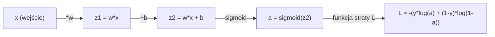
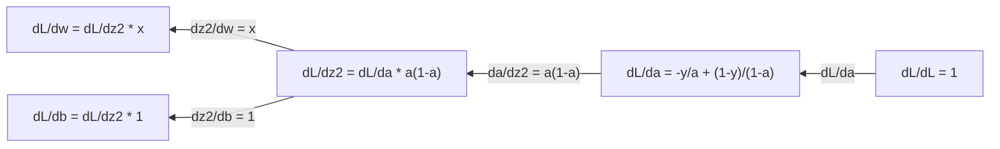
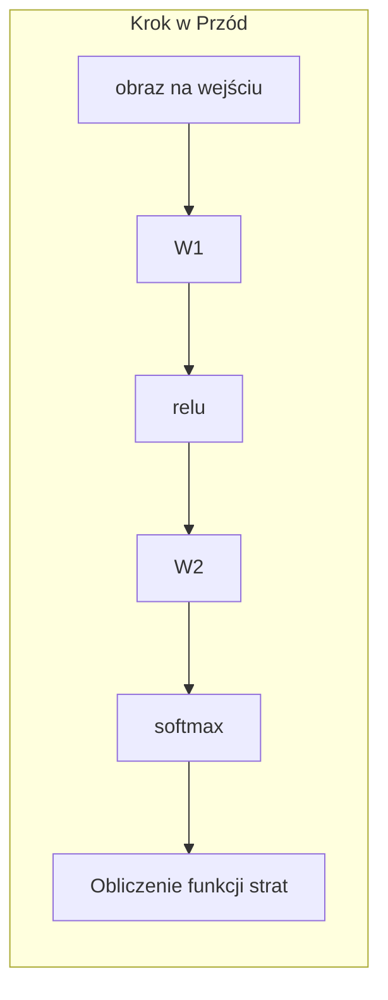
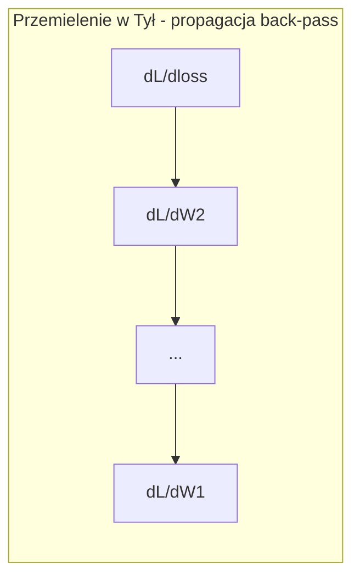

# Rachunek różniczkowy i całkowy w uczeniu maszynowym

> Pochodne wskazują Ci, która droga prowadzi w dół. To wszystko, czego sieć neuronowa potrzebuje do nauki.

**Typ:** Teoria i praktyka
**Język:** Python
**Wymagania wstępne:** Faza 1, Lekcje 01-03
**Czas:** ~60 minut

## Cele nauczania

- Obliczanie pochodnych analitycznych i numerycznych dla typowych funkcji w uczeniu maszynowym (x^2, funkcja sigmoidalna, entropia krzyżowa).
- Zaimplementowanie algorytmu spadku gradientu (gradient descent) od podstaw, w celu minimalizacji funkcji straty w 1D i 2D.
- Wyprowadzenie gradientu dla modelu regresji liniowej i wytrenowanie go poprzez ręczną aktualizację wag.
- Zrozumienie macierzy Hessego, przybliżenia szeregiem Taylora i ich związku z metodami optymalizacji.

## Problem

Masz sieć neuronową z milionami wag. Każda waga to swego rodzaju pokrętło. Musisz się dowiedzieć, w którą stronę obrócić każde pojedyncze pokrętło, aby model popełniał chociaż odrobinę mniejszy błąd. Rachunek różniczkowy wskazuje Ci ten kierunek.

Bez rachunku różniczkowego trening sieci neuronowej polegałby na testowaniu losowych zmian i liczeniu na najlepsze. Dzięki pochodnym wiesz dokładnie, jak każda waga wpływa na błąd modelu. Z każdym krokiem kręcisz każdym pokrętłem we właściwą stronę.

## Koncepcja

### Czym jest pochodna?

Pochodna mierzy tempo zmian (szybkość wzrostu lub spadku). Dla funkcji y = f(x), pochodna f'(x) odpowiada na pytanie: jeśli nieznacznie zmienisz wartość x, jak bardzo zmieni się wartość y?

Geometrycznie, pochodna to nachylenie stycznej (tangens kąta nachylenia) do wykresu funkcji w danym punkcie.

**f(x) = x^2:**

| x | f(x) | f'(x) (nachylenie) |
|-------|------|--------------|
| 0 | 0 | 0 (płasko, na samym dole) |
| 1 | 1 | 2 |
| 2 | 4 | 4 (nachylenie prostej stycznej w tym punkcie) |
| 3 | 9 | 6 |

Dla x=2 nachylenie wynosi 4. Jeśli przesuniesz x odrobinę w prawo, y wzrośnie około czterokrotnie względem zmiany x. Dla x=0 nachylenie wynosi 0. Znajdujesz się na dnie "miski".

Formalna definicja (granica ilorazu różnicowego):

```
f'(x) = lim   f(x + h) - f(x)
        h->0  -----------------
                     h
```

W kodzie zazwyczaj pomijasz granicę i po prostu używasz bardzo małej wartości h. To nazywamy pochodną numeryczną.

### Pochodne cząstkowe: jedna zmienna naraz

Większość rzeczywistych funkcji przyjmuje wiele argumentów. Błąd sieci neuronowej zależy od tysięcy wag. Pochodna cząstkowa traktuje wszystkie zmienne poza jedną jako stałe, a następnie wylicza pochodną tylko względem tej jednej wybranej zmiennej.

```
f(x, y) = x^2 + 3xy + y^2

df/dx = 2x + 3y     (traktuj y jako stałą)
df/dy = 3x + 2y     (traktuj x jako stałą)
```

Każda pochodna cząstkowa mówi nam: jeśli zmienię tylko tę jedną wagę, jak wpłynie to na wartość straty (loss)?

### Gradient: wektor wszystkich pochodnych cząstkowych

Gradient zbiera wszystkie pochodne cząstkowe w jeden wektor. Dla funkcji f(x, y, z) gradient wynosi:

```
grad f = [ df/dx, df/dy, df/dz ]
```

Gradient zawsze wskazuje kierunek największego (najstromszego) wzrostu funkcji. Aby zminimalizować funkcję, musisz podążać w kierunku dokładnie przeciwnym (przeciwnym do gradientu).

**Wykres konturowy f(x,y) = x^2 + y^2:**

Funkcja ma kształt misy, z koncentrycznymi okręgami jako liniami konturowymi. Minimum znajduje się w punkcie (0, 0).

| Punkt | grad f | -grad f (kierunek spadku) |
|-------|-------|----------------------------|
| (1, 1) | [2, 2] (wskazuje w górę, od minimum) | [-2, -2] (wskazuje w dół, ku minimum) |
| (0, 0) | [0, 0] (płasko, punkt minimalny) | [0, 0] |

To jest właśnie istota spadku wzdłuż gradientu (gradient descent) przedstawiona w obrazowy sposób: Oblicz gradient, zmień jego zwrot na przeciwny, wykonaj krok.

### Powiązanie z optymalizacją

Trening sieci neuronowej to problem optymalizacyjny. Masz funkcję straty (loss function) L(w1, w2, ..., wn), która mierzy, jak bardzo myli się Twój model. Twoim zadaniem jest znalezienie jej minimum.

```
Reguła aktualizacji w spadku gradientu (Gradient descent):

  w_new = w_old - learning_rate * dL/dw

Dla każdej wagi:
  1. Oblicz pochodną cząstkową straty względem tej wagi
  2. Odejmij jej ułamek (określony przez learning rate) od obecnej wagi
  3. Powtarzaj
```

Współczynnik uczenia (learning rate) kontroluje wielkość kroku. Jeśli jest za duży, "przeskoczysz" minimum. Jeśli za mały, nauka będzie powolna niczym czołganie się.

**Krajobraz strat (wycinek 1D):**

Funkcja straty L(w) tworzy zakrzywioną powierzchnię ze szczytami i dolinami, zależną od wag.

| Pojęcie | Opis |
|--------|------------|
| Minimum globalne | Najniższy punkt na całej krzywej – najlepsze rozwiązanie |
| Minimum lokalne | Dolina niższa od swoich bezpośrednich sąsiadów, ale nie najniższa ze wszystkich |
| Spadek | Zejście wzdłuż gradientu (Gradient descent) to podążanie w dół z jakiegokolwiek punktu startowego |

Spadek gradientu zawsze prowadzi w dół. Teoretycznie może utknąć w minimach lokalnych, ale w praktyce przy przestrzeniach wielowymiarowych (miliony wag) rzadko stanowi to istotny problem dla głębokich sieci neuronowych.

### Pochodne numeryczne vs analityczne

Istnieją dwa sposoby wyliczania pochodnych.

Analityczny: używasz matematycznych reguł różniczkowania. Dla f(x) = x^2, pochodną jest f'(x) = 2x. Obliczenia są dokładne i niezwykle szybkie.

Numeryczny: szacowanie ze wzoru definiującego (różnica skończona). Liczysz f(x+h) i f(x-h) dla małego h, a następnie wyliczasz przybliżenie ze wzoru.

```
Pochodna numeryczna (różnica centralna):

f'(x) ~= f(x + h) - f(x - h)
          -----------------------
                  2h

h = 0.0001 zazwyczaj sprawdza się dobrze w praktyce
```

Pochodne numeryczne oblicza się wolniej, ale działają dla każdej funkcji. Pochodne analityczne są bardzo szybkie, ale wymagają znajomości wzoru i jego wyprowadzenia. Frameworki głębokiego uczenia wykorzystują trzecie podejście: automatyczne różniczkowanie (autodiff), które mechanicznie i dokładnie przelicza pochodne krok po kroku na podstawie utworzonego grafu obliczeniowego (szerzej omawiane w fazie 3).

### Analityczne pochodne prostych funkcji

Oto pochodne, z którymi będziesz miał do czynienia nieustannie w ML.

```
Funkcja         Pochodna          Zastosowanie
--------        ----------       -------
f(x) = x^2     f'(x) = 2x      Funkcje straty (np. MSE)
f(x) = wx + b  f'(w) = x        Warstwa liniowa (gradient względem wagi)
                f'(b) = 1        Warstwa liniowa (gradient względem obciążenia/biasu)
                f'(x) = w        Warstwa liniowa (gradient względem wejścia)
f(x) = e^x     f'(x) = e^x     Softmax, mechanizm uwagi (attention)
f(x) = ln(x)   f'(x) = 1/x     Strata entropii krzyżowej (cross-entropy)
f(x) = 1/(1+e^-x)  f'(x) = f(x)(1-f(x))   Aktywacja sigmoidalna (sigmoid)
```

Dla f(x) = x^2:

```
f(x) = x^2    f'(x) = 2x

  x    f(x)   f'(x)   Znaczenie
  -2    4      -4      zbocze opada w lewo (funkcja maleje)
  -1    1      -2      zbocze opada w lewo (funkcja maleje)
   0    0       0      płasko (minimum!)
   1    1       2      zbocze wznosi się w prawo (funkcja rośnie)
   2    4       4      zbocze wznosi się w prawo (funkcja rośnie)
```

Dla f(w) = wx + b przy x=3, b=1:

```
f(w) = 3w + 1    f'(w) = 3

Pochodna względem wagi w to po prostu x.
Jeśli wejście x jest duże, to mała zmiana w (wagi) spowoduje znaczną zmianę na wyjściu.
```

### Reguła łańcuchowa (Chain Rule)

Gdy funkcje są złożone z wielu innych (zagnieżdżone), z pomocą przychodzi reguła łańcuchowa różniczkowania.

```
Jeśli y = f(g(x)), to dy/dx = f'(g(x)) * g'(x)

Przykład: y = (3x + 1)^2
  funkcja zewnętrzna: f(u) = u^2       f'(u) = 2u
  funkcja wewnętrzna: g(x) = 3x + 1    g'(x) = 3
  dy/dx = 2(3x + 1) * 3 = 6(3x + 1)
```

Sieci neuronowe to właśnie takie wielkie łańcuchy funkcji: wejście -> warstwa liniowa -> aktywacja -> liniowa -> aktywacja -> strata. Algorytm propagacji wstecznej (backpropagation) to nic innego jak reguła łańcuchowa, zaaplikowana iteracyjnie od wyjścia, aż z powrotem do samego wejścia. To cały ten algorytm.

### Macierz Hessego (Hesjan)

Gradient mówi Ci o nachyleniu. Hesjan mówi o krzywiźnie (zakrzywieniu) funkcji w danym punkcie.

Hesjan to po prostu macierz pochodnych cząstkowych drugiego rzędu. Dla funkcji f(x1, x2, ..., xn), komórka (i, j) w macierzy Hessego to:

```
H[i][j] = d^2f / (dx_i * dx_j)
```

Dla funkcji dwóch zmiennych f(x, y):

```
H = | d^2f/dx^2    d^2f/dxdy |
    | d^2f/dydx    d^2f/dy^2 |
```

**Co Hesjan mówi Ci w tzw. punkcie krytycznym (gdzie gradient = 0):**

| Właściwość Hesjanu | Znaczenie | Przykładowa powierzchnia |
|-----------------|--------|--------------------------------|
| Dodatnio określona (wszystkie wartości własne > 0) | Minimum lokalne | Miska skierowana ku górze |
| Ujemnie określona (wszystkie wartości własne < 0) | Maksimum lokalne | Odwrócona miska (skierowana w dół) |
| Nieokreślona (mieszane znaki wartości własnych) | Punkt siodłowy | Kształt siodła na koniu |

**Przykład:** f(x, y) = x^2 - y^2 (funkcja siodłowa)

```
df/dx = 2x       df/dy = -2y
d^2f/dx^2 = 2    d^2f/dy^2 = -2    d^2f/dxdy = 0

H = | 2   0 |
    | 0  -2 |

Wartości własne: 2 i -2 (jedna dodatnia, jedna ujemna)
--> Punkt siodłowy w (0, 0)
```

Porównajmy to z funkcją f(x, y) = x^2 + y^2 (miska):

```
H = | 2  0 |
    | 0  2 |

Wartości własne: 2 i 2 (obie dodatnie)
--> Minimum lokalne w (0, 0)
```

**Dlaczego Hesjan ma znaczenie w uczeniu maszynowym:**

Metoda Newtona (Newton's method) wykorzystuje macierz Hessego, aby stawiać znacznie lepsze i inteligentniejsze kroki optymalizacyjne niż klasyczny spadek gradientu. Zamiast ślepo podążać za nachyleniem, uwzględnia również zakrzywienie funkcji:

```
Aktualizacja kroku Newtona:    w_new = w_old - H^(-1) * gradient
Aktualizacja spadku gradientu: w_new = w_old - lr * gradient
```

Metoda Newtona zbiega do minimum znacznie szybciej, ponieważ Hesjan odpowiednio "skaluje" wektor gradientu: przy stromym, wąskim nachyleniu narzuca małe kroki (aby uniknąć przestrzelenia), a w płaskich rejonach duże.

Jest w tym jednak duży haczyk: w sieci neuronowej z N parametrami, rozmiar Hesjanu to N x N. Dla modelu mającego 1 milion parametrów wymagałoby to przechowywania i odwracania w pamięci macierzy mającej bilion elementów! Z tego powodu najczęściej stosuje się przybliżenia (aproksymacje).

| Metoda optymalizacji | Czego używa | Złożoność | Szybkość zbieżności |
|------------|------------|------|------------|
| Spadek gradientu (Gradient descent) | Tylko pierwsze pochodne (Gradient) | O(N) na krok | Wolna (liniowa) |
| Metoda Newtona | Pełny Hesjan (pochodne 2. rzędu) | O(N^3) na krok | Szybka (kwadratowa) |
| L-BFGS | Przybliżony Hesjan na bazie historii gradientów | O(N) na krok | Umiarkowanie szybka (superliniowa) |
| Adam | Adaptacyjny krok dla każdego parametru (przybliżenie diagonalne Hesjanu) | O(N) na krok | Dobra, często standardowa metoda |
| Gradient naturalny (Natural Gradient) | Macierz informacji Fishera (statystyczny odpowiednik Hesjanu) | O(N^2) na krok | Bardzo szybka |

W praktyce algorytm Adam stał się domyślnym wyborem. Przybliża on niezwykle tanio informacje drugiego rzędu poprzez śledzenie bieżącej średniej i wariancji z poprzednich gradientów dla każdej wagi.

### Rozwinięcie w szereg Taylora

Dowolną gładką funkcję (czyli mającą określone pochodne) można lokalnie (czyli blisko punktu x) przybliżyć jako wielomian z użyciem tzw. szeregu Taylora:

```
f(x + h) = f(x) + f'(x)*h + (1/2)*f''(x)*h^2 + (1/6)*f'''(x)*h^3 + ...
```

Im więcej wyrazów (pochodnych kolejnych rzędów) uwzględnisz, tym wierniejsze będzie Twoje przybliżenie – ale wciąż tylko dla pewnego otoczenia wokół wybranego punktu x.

**Dlaczego szereg Taylora ma tak ogromne znaczenie w ML:**

- **Szereg pierwszego rzędu to nic innego jak spadek wzdłuż gradientu.** Jeśli odetniemy resztę i założymy, że f(x + h) ~ f(x) + f'(x)*h, wykonujemy de facto aproksymację liniową (model liniowy krzywej z wykorzystaniem stycznej). Algorytm spadku gradientu sprowadza się do wyboru małego kroku w celu minimalizacji tego liniowego modelu na odcinku h: h = -lr * f'(x).

- **Szereg drugiego rzędu to metoda Newtona.** Używając do przybliżenia także Hesjanu: f(x + h) ~ f(x) + f'(x)*h + (1/2)*f''(x)*h^2, tworzymy przybliżenie w postaci kwadratowej paraboli (np. przypominającej misę). Jej rozwiązanie minimum analitycznego na tym małym przedziale daje poprawkę: h = -f'(x)/f''(x) – i jest to słynny krok Newtona.

- **Projektowanie i wybór funkcji straty.** Takie funkcje jak błąd średniokwadratowy (MSE) oraz entropia krzyżowa (Cross-entropy) są "gładkie". Oznacza to, że ich aproksymacje przy użyciu rozwinięcia Taylora nie dają niespodzianek, a więc optymalizacja na ich bazie jest przewidywalna.

```
Rząd przybliżenia      Co wychwytuje        Powiązana metoda optymalizacji
-------------------    -----------------   -------------------
Zerowego rzędu (stała) Jedynie wartość      Szukanie losowe (Random search)
Pierwszego (liniowa)   Nachylenie           Spadek gradientu (Gradient descent)
Drugiego (kwadratowa)  Zakrzywienie         Metoda Newtona
Wyższych rzędów        Drobniejszą strukturę Rzadko używane w optymalizacji ML
```

Główny wniosek brzmi: jakakolwiek optymalizacja gradientowa to w gruncie rzeczy iteracyjne tworzenie "lokalnego" i płaskiego (lub kwadratowego w przypadku II rzędu) przybliżenia funkcji straty poprzez pochodne i stawianie kroku na dno tego uproszczonego modelu.

### Całki w ML

Podczas gdy pochodne mierzą stopień zmiany w funkcji (lokalne nachylenie/tempo), to całki mierzą ich skumulowane efekty (pole powierzchni zawarte pod wykresem danej krzywej/funkcji w przedziale).

W inżynierii uczenia maszynowego raczej nikt nie zmusza nikogo do manualnego wyliczania analitycznych wzorów funkcji całkowych, niemniej ich koncepcja otacza nas ze wszystkich stron:

**Prawdopodobieństwo.** Dla losowej zmiennej ciągłej o tzw. funkcji gęstości prawdopodobieństwa (PDF) równej p(x):

```
P(a < X < b) = całka oznaczona z p(x) od a do b po dx
```

Innymi słowy, pole zawarte pod krzywą gęstości p(x) między punktem a i b stanowi równe prawdopodobieństwo tego, że nasza wylosowana zmienna ciągła (np. waga losowego człowieka na planecie) przybierze wynik z tego konkretnego zakresu.

**Wartość oczekiwana (Expected value).** To średnia z wszystkich możliwych wyników losowania zmiennej, odpowiednio zważona ich gęstością prawdopodobieństwa ich wystąpienia:

```
E[f(X)] = całka od f(x) * p(x) dx
```

Na przykład straty sieci oceniane na pełnej "dystrybucji danych na świecie" są de facto wartościami oczekiwanymi ukrytymi w całkowaniu nieskończonego zbioru wszystkich możliwych obrazków kotków. Model poddaje się szkoleniu i minimalizuje błędy jedynie na tzw. przybliżeniach empirycznych próbkowanych (nasz mały zbiór danych zebrany w folderze).

**Dywergencja Kullbacka-Leiblera (KL Divergence).** Stanowi matematyczną miarę, w jak wielkim stopniu rozkład prawdopodobieństwa odróżnia się od drugiego rozkładu:

```
KL(p || q) = całka po p(x) * log(p(x) / q(x)) dx
```

Ta całka stosowana jest w wariacyjnych autokoderach (VAE), transferze uczenia przy destylacji sieci z dużej na małą (knowledge distillation) oraz przy algorytmach PPO we wzmocnieniu uczącym (reinforcement learning).

**Stała normalizująca (Partition Function).** W bayesowskim podejściu do uczenia maszynowego (Bayesian Inference):

```
p(w | dane) = p(dane | w) * p(w) / całka po p(dane | w) * p(w) dw
```

Sam mianownik, czyli wspomniana "stała normalizująca", to nic innego, jak sumaryczna (całkowa) suma prawdopodobieństw zdarzenia (danych) wymnożonych przez prawdę a priori, wyliczona pod wszystkie potencjalne scenariusze ułożenia (konfiguracji) milionów badanych parametrów sieci z przedziału (-inf; +inf). Próba ręcznego przeliczenia czegoś takiego bywa często analitycznie niemożliwa lub obciążona nieludzkim kosztem (intractable). Z tego powodu na mianowniki we wnioskowaniach Bayesa rzuca się całe zestawy oszukańczych tricków przybliżających z udziałem technik takich jak tzw. próbkowanie Monte Carlo oparte na łańcuchach Markowa (MCMC - Markov Chain Monte Carlo).

| Koncepcja całkowa | Miejsce wykorzystania w ML |
|----------------|----------------------|
| Pole powierzchni pod krzywą | Modelowanie wartości prawdopodobieństwa dla zmiennych ciągłych przy użyciu gęstości prawdopodobieństwa (PDF) |
| Wartość oczekiwana | Empiryczna minimalizacja ryzyka (Loss minimization) na datasecie |
| Rozbieżność KL | Wariacyjne autokodery, destylacja modeli, optymalizowanie strategii gier w RL |
| Czynnik/Stała Normalizująca | Softmax (mianownik potęgi eulera) |
| Prawdopodobieństwo brzegowe (Marginalne) | Zestawianie różnych algorytmów na bazie współczynnika ELBO. |

### Wielowymiarowa reguła łańcuchowa na grafie obliczeniowym

Należy zrozumieć, że reguła łańcuchowa we własnej postaci bynajmniej nie dotyczy jedynie jednorodnych struktur zagnieżdżonych (skalarów na jednej prostej z funkcji złożonej). W trzewiach sieci konwolucyjnej, macierze rozpraszają się do osobnych bloków residualnych, filtrują z poolingiem, aby finalnie znów scalić się, na przykład, do jednego skalarnego wyniku funkcji wyliczającej utraconą entropię. Spójrzmy jak wygląda propagacja (strumień pochodnych) podczas prostego procesu propagacji warstwy neuronów do przodu (Forward propagation):



Gdy nadejdzie czas wygenerować pochodne (backpropagation) w kierunku odwrotnym do ułożonego łańcucha (od końca wykresu/grafu do samych wejść po lewej stronie):



Widniejące wyżej strzałki w tył nie robią absolutnie nic innego, jak jedynie każdorazowo wykonują czynność mnożenia wartości odziedziczonej od swojego poprzedniego bloku (po stronie prawej) nałożonej przez mnożenie wyliczonej lokalnie, na bieżąco, szczątkowej wartości wewnątrz pojedynczego node-a. Reguła łańcuchowa to mechaniczna propagacja wyliczonego czynnika, która pozwala powstrzymać eksplozję złożoności poprzez kumulowanie sum wartości gradientu dla konkretnego punktu stykowego.

W skrócie — czym jest tzw. "propagacja wsteczna" w nauczaniu maszyny głębokiej?  To brutalnie systematycznie powtarzająca się reguła łańcuchowa aplikowana od mianownika straty od tyłu do pierwszych powłok warstw układu tensorowego.

### Macierz Jakobiego (Jakobian)

Kiedy warstwa (np. warstwa gęsta Dense) przerzuca wektory w zupełnie osobne przestrzenie wyjściowe na nowe wektory, wyliczony zestaw gradientów jest de facto macierzą. Macierz Jakobiego (tzw. Jakobian) składa się po brzegi z absolutnie każdej pochodnej cząstkowej po każdym jednym wyjściu (output) w odniesieniu do absolutnie każdego pojedynczego parametru stanowiącego jego dane ułożone wcześniej na wejściu (input).

Zakładając, że struktura to f: R^n -> R^m (mapuje N wejść w M wyjść), zbudowany Jakobian `J` tworzy nową formę bloku w rozmiarach [m x n]:

| | x1 | x2 | ... | xn |
|---|---|---|---|---|
| f1 | df1/dx1 | df1/dx2 | ... | df1/dxn |
| f2 | df2/dx1 | df2/dx2 | ... | df2/dxn |
| ... | ... | ... | ... | ... |
| fm | dfm/dx1 | dfm/dx2 | ... | dfm/dxn |

Rozwijając model sztucznej inteligencji, nikt zdrowy na umyśle, zmuszony do samodzielnego kodowania we frameworkach pokroju Pytorcha lub Jax-a, nie analizuje samodzielnie rozmiarów matrycy owego Jakobianu. Autograd odwalił to potajemnie z tyłu. Mając na uwadze mechanikę podłoża Jakobianów jest o tyle cenna, o ile ratuje życie zrozumienie "zrzutów" wielkości rozmiaru wektora przepływających propagacji backpassingu na ekranie errorów. Przekształcenia Jakobianu potrafią narzucić wektor gradientu i wymagać transponowania rozmiarów przed przetarciem się do dalszych splotów algorytmicznych.

### Dlaczego ta wiedza to sprawa życia lub śmierci w operowaniu sieciami wielowarstwowymi?

Pojedynczy parametr operacyjny zawarty na dowolnej głębokości topologii architektonicznej sieci wymusza odpytanie i podpięcie własnego współczynnika "przesuwającego - pochodnej lokalnej" potocznie ochrzczonego terminem "gradient". Ustalenie kierunku i wymiaru ulepszenia jest na nim oparte w każdym pojedynczym stąpnięciu wyliczania spadku błędu.





Pętle poprawek polegające na zrzucie i upuszczaniu ułameczków parametrów wyliczane jako aktualizacje obciążeń wag.  
- `W1 = W1 - lr * dL/dW1`  
- `W2 = W2 - lr * dL/dW2`  

Podanie informacji na start przerabia dane do błędu wyliczanego na końcowej pętli. Propagacja powrotna nakreśla ślad poprawek po drodze na całej siatce bloków pod każdą pojedynczą stację zlokalizowaną z parametrem wag, upewniając się po wyliczeniu do końca aby powielać ucięcie błędu po malutkim kroczku. Potem ponawiać to na miliony prób ułożonych po kolei w epokach - i oto cały mechanizm uczenia głębokiego podparty twardym słupem z mechaniki rachunków różniczkowych.

## Implementacja

### Krok 1: Pochodna numeryczna od zera

```python
def numerical_derivative(f, x, h=1e-7):
    return (f(x + h) - f(x - h)) / (2 * h)

def f(x):
    return x ** 2

for x in [-2, -1, 0, 1, 2]:
    numerical = numerical_derivative(f, x)
    analytical = 2 * x
    print(f"x={x:2d}  f'(x) numeryczna={numerical:.6f}  analityczna={analytical:.1f}")
```

Pochodna numeryczna pokrywa się z dokładną wartością z wersji analitycznej bez żadnych uchybień na liczbie miejsc po przecinku.

### Krok 2: Cząstkowe i wektoryzowane stany Gradientu

```python
def numerical_gradient(f, point, h=1e-7):
    gradient = []
    for i in range(len(point)):
        point_plus = list(point)
        point_minus = list(point)
        point_plus[i] += h
        point_minus[i] -= h
        partial = (f(point_plus) - f(point_minus)) / (2 * h)
        gradient.append(partial)
    return gradient

def f_multi(point):
    x, y = point
    return x**2 + 3*x*y + y**2

grad = numerical_gradient(f_multi, [1.0, 2.0])
print(f"Gradient numeryczny dla punktu (1,2): {[f'{g:.4f}' for g in grad]}")
print(f"Gradient analityczny dla punktu (1,2): [2*1+3*2, 3*1+2*2] = [{2*1+3*2}, {3*1+2*2}]")
```

### Krok 3: Spadek gradientu redukującego funkcję  f(x) = x^2 dla 1D

```python
x = 5.0
lr = 0.1
for step in range(20):
    grad = 2 * x
    x = x - lr * grad
    print(f"krok {step:2d}  x={x:8.4f}  f(x)={x**2:10.6f}")
```

Zauważalne ściąganie startowej jednowymiarowej formy na wartości początkowej x=5, spływając wprost blisko zera u uformowanego brzuszka w minimum funkcji.

### Krok 4: Klasyczny spadek dwuwymiarowy 2D

```python
def f_2d(point):
    x, y = point
    return x**2 + y**2

point = [4.0, 3.0]
lr = 0.1
for step in range(30):
    grad = numerical_gradient(f_2d, point)
    point = [p - lr * g for p, g in zip(point, grad)]
    loss = f_2d(point)
    if step % 5 == 0 or step == 29:
        print(f"krok {step:2d}  punkt=({point[0]:7.4f}, {point[1]:7.4f})  strata f={loss:.6f}")
```

### Krok 5: Różnice między modelowaniem na styk analityczno-numeryczny

```python
import math

test_functions = [
    ("x^2",      lambda x: x**2,          lambda x: 2*x),
    ("x^3",      lambda x: x**3,          lambda x: 3*x**2),
    ("sin(x)",   lambda x: math.sin(x),   lambda x: math.cos(x)),
    ("e^x",      lambda x: math.exp(x),   lambda x: math.exp(x)),
    ("1/x",      lambda x: 1/x,           lambda x: -1/x**2),
]

x = 2.0
print(f"{'Funkcja':<12} {'Numeryczna':>12} {'Analityczna':>12} {'Margines bledu':>12}")
print("-" * 50)
for name, f, df in test_functions:
    num = numerical_derivative(f, x)
    ana = df(x)
    err = abs(num - ana)
    print(f"{name:<12} {num:12.6f} {ana:12.6f} {err:12.2e}")
```

### Krok 6: Proste szacowanie numerycznego Hesjanu

```python
def hessian_2d(f, x, y, h=1e-5):
    fxx = (f(x + h, y) - 2 * f(x, y) + f(x - h, y)) / (h ** 2)
    fyy = (f(x, y + h) - 2 * f(x, y) + f(x, y - h)) / (h ** 2)
    fxy = (f(x + h, y + h) - f(x + h, y - h) - f(x - h, y + h) + f(x - h, y - h)) / (4 * h ** 2)
    return [[fxx, fxy], [fxy, fyy]]

def saddle(x, y):
    return x ** 2 - y ** 2

def bowl(x, y):
    return x ** 2 + y ** 2

H_saddle = hessian_2d(saddle, 0.0, 0.0)
H_bowl = hessian_2d(bowl, 0.0, 0.0)
print(f"Hesjan siodłowy (saddle): {H_saddle}")  # [[2, 0], [0, -2]] -- znaki wymieszane (punkt siodłowy)
print(f"Hesjan dołu-miski (bowl):   {H_bowl}")    # [[2, 0], [0, 2]]  -- obie wartości po bokach przekątnej są rygorystycznie dodatnie
```

Macierz siodła Hessego objawi własności z obu światów - posiadając rozrzut osi ze zwrotem dodatnim względem X, a z wykresem ujemnym na ułożeniu z y osi (stąd obydwa znaki). Z kolei wersja drugiego dołu uformuje się ze sztywnym utrzymaniem po obu rogach (obie dodatnie przy minimum).

### Krok 7: Zobaczenie w akcji Taylorowego szacunku do przybliżeń

```python
import math

def taylor_approx(f, f_prime, f_double_prime, x0, h, order=2):
    result = f(x0)
    if order >= 1:
        result += f_prime(x0) * h
    if order >= 2:
        result += 0.5 * f_double_prime(x0) * h ** 2
    return result

x0 = 0.0
for h in [0.1, 0.5, 1.0, 2.0]:
    true_val = math.sin(h)
    t1 = taylor_approx(math.sin, math.cos, lambda x: -math.sin(x), x0, h, order=1)
    t2 = taylor_approx(math.sin, math.cos, lambda x: -math.sin(x), x0, h, order=2)
    print(f"h={h:.1f}  sin(h)={true_val:.4f}  I_rząd={t1:.4f}  II_rząd={t2:.4f}")
```

Dla strefy otoczenia bliskiej dla parametrów przy zerze (x0 = 0), wartość sinusa można niezwykle blisko nakreślić posługując się chociażby małym wektorem do ułatwienia obliczeniowego przy zachowaniu 1-rzędu Taylorowego dla szacowania spadu wektorów "h". Ostrzeżenie — jeżeli skoki na krzywej są ogromne i współczynnik przeskoczy rejon oznaczany na h=1.0+, załamuje to natychmiast formę przybliżenia. Dokładnie tak samo uczenie sieci jest potwornie uzależnione od drobnego ustawienia rozmiaru ułamkowego tempa uczenia (learning rate); przy każdym skoku na grafice sieci musi zgadzać się w otoczeniu liniowo zachowana gładkość do zrzucenia straty bez omyłki na manowce.

### Krok 8: Jaki sens ukryto w regułach uczących na małym prostym bloku

```python
import random

random.seed(42)

w = random.gauss(0, 1)
b = random.gauss(0, 1)
lr = 0.01

xs = [1.0, 2.0, 3.0, 4.0, 5.0]
ys = [3.0, 5.0, 7.0, 9.0, 11.0]

for epoch in range(200):
    total_loss = 0
    dw = 0
    db = 0
    for x, y in zip(xs, ys):
        pred = w * x + b
        error = pred - y
        total_loss += error ** 2
        dw += 2 * error * x
        db += 2 * error
    dw /= len(xs)
    db /= len(xs)
    total_loss /= len(xs)
    w -= lr * dw
    b -= lr * db
    if epoch % 40 == 0 or epoch == 199:
        print(f"epoka {epoch:3d}  waga w={w:.4f}  obciążenie b={b:.4f}  strata={total_loss:.6f}")

print(f"\nWyuczony model: y = {w:.2f}x + {b:.2f}")
print(f"Wynik właściwy (target): y = 2x + 1")
```

Trening ukazuje cykliczność: stwórz predykcję na x, sprawdź pomyłkę dla ujętego błędu (loss), policz poprawki po osi, spuść po wektorze błąd poprawiając układ odrobinę o próg learning rate'a, wejdź na nową pętlę dla poprawy z błędów - do wyrównania stanu w zero.

## Użycie w nowoczesnych zastosowaniach

Jeżeli połączymy biblioteki wsparcia sprzętowego jak np. NumPy, ta zawiła układanka składa się w jeden schludny zapis skryptu z podkładem macierzowym:

```python
import numpy as np

x = np.array([1, 2, 3, 4, 5], dtype=float)
y = np.array([3, 5, 7, 9, 11], dtype=float)

w, b = np.random.randn(), np.random.randn()
lr = 0.01

for epoch in range(200):
    pred = w * x + b
    error = pred - y
    loss = np.mean(error ** 2)
    dw = np.mean(2 * error * x)
    db = np.mean(2 * error)
    w -= lr * dw
    b -= lr * db

print(f"Wyuczony uklad: y = {w:.2f}x + {b:.2f}")
```

Właśnie zbudowałeś optymalizację Gradient Descent od kompletnego zera w ujęciu maszynowym na styk z algebrą macierzy! Rozwinięcia typu PyTorcha maskują pod wbudowaną auto-magią liczenie pochodnych do straty (gradient tracking), pozostawiając dokładnie identyczną strukturę dla samych operacji krokowych w aktualizacji wag w każdym skoku optymalizacji i iterowania.

## Ćwiczenia dla ugruntowania teorii

1. Dopisz wsparcie w kodzie pod ułożenie z drugą wersją szacowania pochodnych `numerical_second_derivative(f, x)`. Do przetestowania sprawdź, iż 3 pochodna x^3 przy punkcie pomiaru dla x=2 osiąga prawidłową wartość 12.
2. Zastosuj mechanizm opadania gradientu by natrafić na dolną krawędź ugięcia dla ułożonego wielomianu: f(x, y) = (x - 3)^2 + (y + 1)^2. Zezwalasz sobie na zaczątek badawczy w x=0; odpowiedź musisz zapisać celując ułamek bliski na punkt (3, -1).
3. Doimplementuj moduł bezwładności i pędu z algorytmu optymalizacyjnego np. standardowego SGD połączonego wraz z Momentum: stwórz poślizg w wektorze z nagromadzanymi pędami wektora. Postaw to obok zwykłego nagiego wariantu opadającego tylko na spadku gradientu na stacji próbnej na wzorcu funkcji f(x) = x^4 - 3x^2 by dostrzec zjawisko zbieżności i pędu.

## Kluczowe słownictwo do pamięci

| Termin | Tłumaczenie po ludzku | Dokładne pojęcie merytoryczne |
|------|----------------|----------------------|
| Pochodna (Derivative) | „Nachylenie na płaszczyźnie” | Szybkość tempa zmiany przy przyroście w określonym małym punkcie. Składa w sobie informacje, z jakim stosunkiem i zmianą z ujęcia na przyrost na x uzyskujemy przechył w na wejściu i do góry po f(x) |
| Pochodna Cząstkowa (Partial derivative) | „Wylicz dla jednej osi i wstrzymaj resztę” | Typowa wersja pochodnej dedykowanej dla określonego elementu pojedynczego argumentu w wielofunkcji z całą resztą skostniałą pod osłoną wymuszonej wartości stałej. |
| Gradient | „Kierunek z najbardziej ostrą wspinaczką pod wektor funkcji” | Utworzona po zebraniu cząstkowych kawałków pełna struktura wektorowa ukierunkowująca kąt i strzałkę wykazując wektor pędu narostu i powiększania zjawiska maksymalnego po wejściowej krzywej. |
| Spadek Gradientu (Gradient descent) | „Idź tam, gdzie opada” | Odejmowanie małego naddatku na wektorze kierunkowym proporcjonalnym po parametrze w krokach aż wygasi ujemny margines na minimum pomyłki. Święty graal metodycznej nauki całego środowiska maszyn ułożonych na warstwach sieci! |
| Krok Uczenia/Współczynnik uczenia (Learning rate) | „Wielkość suwaka przesuwanego przy wektorze ubywania z pętli” | Malutki przelicznik skalarnej regulacji odcięcia części stąpnięcia we wpadnięciu na dół dla gradientowej drogi do dołka by uniknąć wibracji poza brzegi rozstrzelonej z rozbieżnościami funkcji |
| Reguła Łańcuchowa (Chain rule) | „Wymnóż na części wszystkie sklejone pod sobą funkcje dla szukanej korelacji wycinka” | Metodologia wyprowadzenia w wyliczeniach pojęcia odłamków na potocznie zespalanych funkcyjnych modelach by złożyć wszystko poprzez sprzężenia powielenia czynników by uzbierać na wzór: df/dx = df/dg * dg/dx - dając ujęcie powrotu do zjawiska Back-propagacji! |
| Macierz Jakobiego (Jakobian) | „Ujęcie wielo-matrycy z wplecionymi na siebie gradientami we wszystkich płaszczyznach na wektory” | Przy funkcji przeliczającej paczki wieloelementowe macierz układająca pełen zakres blokowy pochodnej ujętej z każdej na cząsteczkę wyznacza ten skrupulatny układ na wzór transformacji pochodnych na całą macierz w postaci tak ujętej struktury matrycowej. |
| Numeryczna pochodna (Numerical Derivative) | „Szacunek w liczbie jako mały kwadracik różnic od małego na wprost” | Okrojenie z rygoru liczenia ze wzoru na analityce sprowadzone do sprawdzonego podstawienia 2 maleńkich ułameczków przed wektorem i wprost na punkcie by uchwycić w pomiarze kąt narzutu na zbieg. |
| Backpropagation (Propagacja wsteczna / Przebieg ubytku wstecznego) | „Auto-wyliczanie strumieni od tyłu dla gradientowych wartości poskładane w ciągi mnożeń z reguły łańcuchowej” | Sposób przekazu po siatce gradientów krokując od końca błędów po same wejścia wykorzystując potęgę złączenia łańcucha połączonego z matrycą - kręgosłup inteligencji współczesnych mechanizmów nauczania głębokiego. |
| Hesse / Hesjan (Hessian Matrix) | „Rozbicie krzywizny przestrzennej rozpisanej przez potęgę drugiego pochodnego” | Ułożenie wyliczonej matrycy ujęte z zebrania pod zestaw cząstkowych ułożonych w formie pochodnych liczonych po x do 2 poziomu - precyzuje o wypukłości/zgięciu wykresowego modelu z odcięciem lokalnego ugięcia form na minimalnym/siodełkowym punkcie zwrotnym z określonego stuku układu wektorów pochodnej równej 0. |
| Rozkład Taylorowski (Szereg Taylora) | „Aproksymacja wektorowa przez model po wielomianowej” | Nagięcie krzywej wektora na podłoże modelu w małej klatce za pomocą rozwinięć jego styków ujętych ze wsparciem z pochodnych rzędów na wylot by wytłumaczyć i nakreślić tło funkcjonowania matematyki np. opadu pod krok ze wzoru dla Newtona, ucieczki pod gładkich formach jak np. Loss Entropii po gładkich cięciach aproksymacji na brzegach! |
| Całka (Integral) | „Rozliczenie zebranego powierzchniowo placu wyrysowanego z dołu z krzywą osi” | Sumaryczne zrzuty pod kreskami pola na dystans w konkretnej odgórnej szerokości ram pomiaru w maszynowym przemyśle do obrysów wiarygodności wystąpienia statystyki na skalarach, wariancji pomyłek pod krzywą i form pod liczeniem oczekiwania czy wyliczeń po KL pod zrzuty entropijnej z wartości badanej! |

## Więcej materiałów i poszerzenie wiadomości

- [Seria YouTube - 3Blue1Brown - Zrozumienie Analizy/Rachunku (Essence of calculus) ](https://www.3blue1brown.com/topics/calculus) — rewelacyjnie zaanimowane pojęcia intuicji wizualnej dot. rozkładu pojęć z pochodnych reguł oraz samego ujęcia całek. Wzorowe źródło!
- [Klasyczny Stanford's CS231n: Wykład z Podstaw Optymalizowania z Propagacją Pomyłki ](https://cs231n.github.io/optimization-2/) — wyłożona na tacy informacja o zasadach przechodzenia z oporem prądów opadania gradientu do każdej poszlakowanej gęstwy węzłów dla wyliczenia wstecz w sztucznych sieciach!
