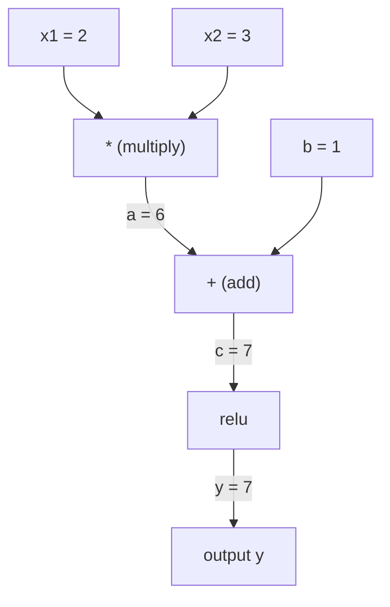
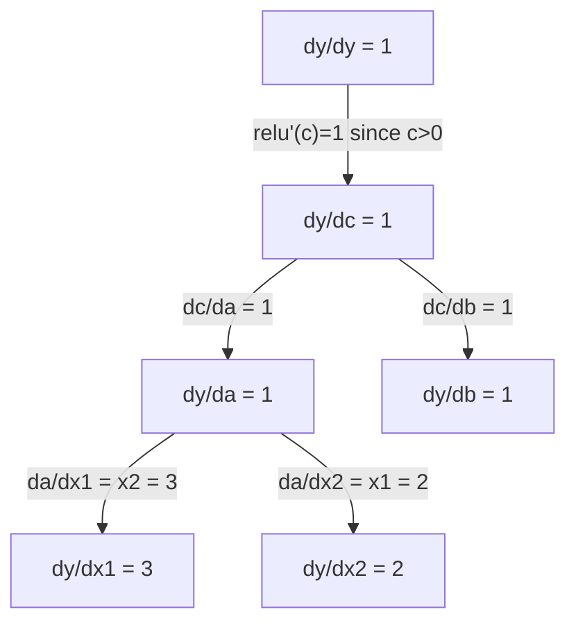

# Zasada łańcucha i automatyczne różnicowanie

> Reguła łańcucha to silnik każdej sieci neuronowej, która się uczy.

**Typ:** Kompilacja
**Język:** Python
**Wymagania wstępne:** Faza 1, lekcja 04 (Pochodne i gradienty)
**Czas:** ~90 minut

## Cele nauczania

- Zbuduj minimalny silnik autogradowania (klasa Value), który rejestruje operacje i oblicza gradienty za pomocą funkcji autodiff w trybie odwrotnym
- Implementuj przejścia do przodu i do tyłu przez wykres obliczeniowy przy użyciu sortowania topologicznego
- Skonstruuj i wytrenuj wielowarstwowy perceptron na XOR, używając wyłącznie od podstaw silnika autogradu
- Zweryfikuj poprawność automatycznej różnicy za pomocą sprawdzania gradientu względem numerycznych różnic skończonych

## Problem

Potrafisz obliczać pochodne prostych funkcji. Ale sieć neuronowa nie jest prostą funkcją. To setki funkcji złożonych razem: mnożenie macierzy, dodawanie odchylenia, zastosowanie aktywacji, ponowne mnożenie macierzy, softmax, utrata entropii krzyżowej. Dane wyjściowe są funkcją funkcji.

Aby wytrenować sieć, potrzebny jest gradient straty w odniesieniu do każdego pojedynczego ciężaru. Wykonanie tego ręcznie jest niemożliwe w przypadku milionów parametrów. Robienie tego numerycznie (różnice skończone) jest zbyt wolne.

Reguła łańcucha daje matematykę. Automatyczne różnicowanie daje algorytm. Razem umożliwiają obliczenie dokładnych gradientów poprzez dowolne kompozycje funkcji w czasie proporcjonalnym do pojedynczego przejścia do przodu.

Tak działają PyTorch, TensorFlow i JAX. Zbudujesz od podstaw miniaturową wersję.

## Koncepcja

### Zasada łańcucha

Jeżeli `y = f(g(x))`, pochodna `y` względem `x` wynosi:

```
dy/dx = dy/dg * dg/dx = f'(g(x)) * g'(x)
```

Pomnóż pochodne wzdłuż łańcucha. Każde łącze wnosi swoją lokalną pochodną.

Przykład: `y = sin(x^2)`

```
g(x) = x^2       g'(x) = 2x
f(g) = sin(g)     f'(g) = cos(g)

dy/dx = cos(x^2) * 2x
```

W przypadku głębszych kompozycji łańcuch rozciąga się:

```
y = f(g(h(x)))

dy/dx = f'(g(h(x))) * g'(h(x)) * h'(x)
```

Każda warstwa sieci neuronowej jest jednym ogniwem tego łańcucha.

### Wykresy obliczeniowe

Wykres obliczeniowy sprawia, że reguła łańcuchowa jest wizualna. Każda operacja staje się węzłem. Dane przepływają dalej przez wykres. Gradienty płyną wstecz.

**Przejście w przód (oblicz wartości):**



**Przejście wstecz (obliczenie gradientów):**



Przejście wstecz stosuje regułę łańcucha w każdym węźle, propagując gradienty od wyjścia do wejścia.

### Tryb do przodu a tryb do tyłu

Istnieją dwa sposoby zastosowania reguły łańcucha na wykresie.

**Tryb forward** rozpoczyna się od wejść i przesuwa instrumenty pochodne do przodu. Oblicza wartość `dx/dx = 1` i propaguje ją w ramach każdej operacji. Dobrze, gdy masz niewiele wejść i wiele wyjść.

```
Forward mode: seed dx/dx = 1, propagate forward

  x = 2       (dx/dx = 1)
  a = x^2     (da/dx = 2x = 4)
  y = sin(a)  (dy/dx = cos(a) * da/dx = cos(4) * 4 = -2.615)
```

**Tryb odwrotny** rozpoczyna się na wyjściu i przesuwa gradienty do tyłu. Oblicza `dy/dy = 1` i propaguje każdą operację w odwrotnej kolejności. Dobrze, gdy masz wiele wejść i niewiele wyjść.

```
Reverse mode: seed dy/dy = 1, propagate backward

  y = sin(a)  (dy/dy = 1)
  a = x^2     (dy/da = cos(a) = cos(4) = -0.654)
  x = 2       (dy/dx = dy/da * da/dx = -0.654 * 4 = -2.615)
```

Sieci neuronowe mają miliony wejść (wag) i jedno wyjście (straty). Tryb odwrotny oblicza wszystkie nachylenia w jednym przejściu wstecz. Dlatego też propagacja wsteczna wykorzystuje tryb odwrotny.

| Tryb | Nasiona | Kierunek | Najlepiej, gdy |
|------|------|-----------|----------|
| Naprzód | `dx_i/dx_i = 1` | Wejście do wyjścia | Niewiele wejść, wiele wyjść |
| Odwróć | `dy/dy = 1` | Wyjście na wejście | Wiele wejść, mało wyjść (sieci neuronowe) |

### Podwójne numery dla trybu przekazywania

Tryb przesyłania dalej można elegancko wdrożyć za pomocą podwójnych liczb. Liczba podwójna ma postać `a + b*epsilon`, gdzie `epsilon^2 = 0`.

```
Dual number: (value, derivative)

(2, 1) means: value is 2, derivative w.r.t. x is 1

Arithmetic rules:
  (a, a') + (b, b') = (a+b, a'+b')
  (a, a') * (b, b') = (a*b, a'*b + a*b')
  sin(a, a')         = (sin(a), cos(a)*a')
```

Zasiej zmienną wejściową pochodną 1. Pochodna propaguje się automatycznie podczas każdej operacji.

### Tworzenie silnika Autogradu

Silnik autogradu potrzebuje trzech rzeczy:

1. **Zawijanie wartości.** Zawijaj każdą liczbę w obiekt przechowujący jej wartość i gradient.
2. **Zapis wykresu.** Każda operacja rejestruje dane wejściowe i lokalną funkcję gradientu.
3. **Przejście wstecz.** Posortuj topologicznie graf, a następnie przejdź go w odwrotnej kolejności, stosując regułę łańcucha w każdym węźle.

Dokładnie to robi `autograd` PyTorcha. Klasa `torch.Tensor` zawija wartości, rejestruje operacje, gdy `requires_grad=True` i oblicza gradienty, gdy wywołasz `.backward()`.

### Jak PyTorch Autograd działa pod maską

Kiedy piszesz kod PyTorch:

```python
x = torch.tensor(2.0, requires_grad=True)
y = x ** 2 + 3 * x + 1
y.backward()
print(x.grad)  # 7.0 = 2*x + 3 = 2*2 + 3
```

PyTorch wewnętrznie:

1. Tworzy węzeł `Tensor` dla `x` z `requires_grad=True`
2. Każda operacja (`**`, `*`, `+`) tworzy nowy węzeł i rejestruje funkcję wstecz
3. `y.backward()` uruchamia automatyczną różnicę w trybie odwrotnym na zarejestrowanym wykresie
4. `grad_fn` każdego węzła oblicza lokalne gradienty i przekazuje je do węzłów nadrzędnych
5. Gradienty kumulują się w atrybutach `.grad` poprzez dodawanie (nie zastępowanie)

Wykres jest dynamiczny (definiowany po uruchomieniu). Przy każdym podaniu do przodu tworzony jest nowy wykres. Właśnie dlatego PyTorch obsługuje przepływ sterowania (jeśli/else, pętle) wewnątrz modeli.

## Zbuduj to

### Krok 1: Klasa Value

```python
class Value:
    def __init__(self, data, children=(), op=''):
        self.data = data
        self.grad = 0.0
        self._backward = lambda: None
        self._prev = set(children)
        self._op = op

    def __repr__(self):
        return f"Value(data={self.data:.4f}, grad={self.grad:.4f})"
```

Każdy element `Value` przechowuje swoje dane liczbowe, gradient (początkowo zero), funkcję wsteczną i wskaźniki do węzłów podrzędnych, które je wygenerowały.

### Krok 2: Operacje arytmetyczne ze śledzeniem gradientu

```python
    def __add__(self, other):
        other = other if isinstance(other, Value) else Value(other)
        out = Value(self.data + other.data, (self, other), '+')
        def _backward():
            self.grad += out.grad
            other.grad += out.grad
        out._backward = _backward
        return out

    def __mul__(self, other):
        other = other if isinstance(other, Value) else Value(other)
        out = Value(self.data * other.data, (self, other), '*')
        def _backward():
            self.grad += other.data * out.grad
            other.grad += self.data * out.grad
        out._backward = _backward
        return out

    def relu(self):
        out = Value(max(0, self.data), (self,), 'relu')
        def _backward():
            self.grad += (1.0 if out.data > 0 else 0.0) * out.grad
        out._backward = _backward
        return out
```

Każda operacja tworzy domknięcie, które wie, jak obliczyć lokalne gradienty i pomnożyć przez gradient poprzedzający (`out.grad`). `+=` obsługuje przypadek, w którym wartość jest używana w wielu operacjach.

### Krok 3: Podanie w tył

```python
    def backward(self):
        topo = []
        visited = set()
        def build_topo(v):
            if v not in visited:
                visited.add(v)
                for child in v._prev:
                    build_topo(child)
                topo.append(v)
        build_topo(self)

        self.grad = 1.0
        for v in reversed(topo):
            v._backward()
```

Sortowanie topologiczne gwarantuje, że gradient każdego węzła zostanie w pełni obliczony, zanim zostanie on rozprzestrzeniony na elementy podrzędne. Gradient nasion wynosi 1,0 (dy/dy = 1).

### Krok 4: Więcej operacji dla całego silnika

Podstawowa klasa Value obsługuje dodawanie, mnożenie i relu. Prawdziwy silnik autogradowy potrzebuje czegoś więcej. Oto operacje potrzebne do zbudowania sieci neuronowych:

```python
    def __neg__(self):
        return self * -1

    def __sub__(self, other):
        return self + (-other)

    def __radd__(self, other):
        return self + other

    def __rmul__(self, other):
        return self * other

    def __rsub__(self, other):
        return other + (-self)

    def __pow__(self, n):
        out = Value(self.data ** n, (self,), f'**{n}')
        def _backward():
            self.grad += n * (self.data ** (n - 1)) * out.grad
        out._backward = _backward
        return out

    def __truediv__(self, other):
        return self * (other ** -1) if isinstance(other, Value) else self * (Value(other) ** -1)

    def exp(self):
        import math
        e = math.exp(self.data)
        out = Value(e, (self,), 'exp')
        def _backward():
            self.grad += e * out.grad
        out._backward = _backward
        return out

    def log(self):
        import math
        out = Value(math.log(self.data), (self,), 'log')
        def _backward():
            self.grad += (1.0 / self.data) * out.grad
        out._backward = _backward
        return out

    def tanh(self):
        import math
        t = math.tanh(self.data)
        out = Value(t, (self,), 'tanh')
        def _backward():
            self.grad += (1 - t ** 2) * out.grad
        out._backward = _backward
        return out
```

**Dlaczego każda operacja ma znaczenie:**

| Operacja | Zasada odwrotna | Używany w |
|----------|-------------|--------|
| `__sub__` | Ponownie wykorzystuje dodanie + negacja | Obliczanie strat (pred - target) |
| `__pow__` | n * x^(n-1) | Aktywacje wielomianowe, MSE (błąd^2) |
| `__truediv__` | Ponowne użycie mul + pow(-1) | Normalizacja, skalowanie szybkości uczenia się |
| `exp` | exp(x) * w górę | Softmax, log wiarygodności |
| `log` | (1/x) * w górę | Strata entropii krzyżowej, logarytm prawdopodobieństwa |
| `tanh` | (1 - tanh^2) * w górę | Klasyczna funkcja aktywacji |

Sprytna część: `__sub__` i `__truediv__` są definiowane w kategoriach istniejących operacji. Otrzymują poprawne gradienty za darmo, ponieważ reguła łańcucha składa się z podstawowych operacji add/mul/pow.

### Krok 5: Mini MLP od zera

Mając pełną klasę Value, możesz zbudować sieć neuronową. Żadnego PyTorcha. Brak NumPy. Tylko wartości i zasada łańcucha.

```python
import random

class Neuron:
    def __init__(self, n_inputs):
        self.w = [Value(random.uniform(-1, 1)) for _ in range(n_inputs)]
        self.b = Value(0.0)

    def __call__(self, x):
        act = sum((wi * xi for wi, xi in zip(self.w, x)), self.b)
        return act.tanh()

    def parameters(self):
        return self.w + [self.b]

class Layer:
    def __init__(self, n_inputs, n_outputs):
        self.neurons = [Neuron(n_inputs) for _ in range(n_outputs)]

    def __call__(self, x):
        return [n(x) for n in self.neurons]

    def parameters(self):
        return [p for n in self.neurons for p in n.parameters()]

class MLP:
    def __init__(self, sizes):
        self.layers = [Layer(sizes[i], sizes[i+1]) for i in range(len(sizes)-1)]

    def __call__(self, x):
        for layer in self.layers:
            x = layer(x)
        return x[0] if len(x) == 1 else x

    def parameters(self):
        return [p for layer in self.layers for p in layer.parameters()]
```

`Neuron` oblicza `tanh(w1*x1 + w2*x2 + ... + b)`. `Layer` to lista neuronów. `MLP` układa warstwy. Każda waga to `Value`, więc wywołanie `loss.backward()` propaguje gradienty do każdego parametru.

**Szkolenie na XOR:**

```python
random.seed(42)
model = MLP([2, 4, 1])  # 2 inputs, 4 hidden neurons, 1 output

xs = [[0, 0], [0, 1], [1, 0], [1, 1]]
ys = [-1, 1, 1, -1]  # XOR pattern (using -1/1 for tanh)

for step in range(100):
    preds = [model(x) for x in xs]
    loss = sum((p - y) ** 2 for p, y in zip(preds, ys))

    for p in model.parameters():
        p.grad = 0.0
    loss.backward()

    lr = 0.05
    for p in model.parameters():
        p.data -= lr * p.grad

    if step % 20 == 0:
        print(f"step {step:3d}  loss = {loss.data:.4f}")

print("\nPredictions after training:")
for x, y in zip(xs, ys):
    print(f"  input={x}  target={y:2d}  pred={model(x).data:6.3f}")
```

To jest mikrograd. Kompletna pętla treningowa sieci neuronowej w czystym Pythonie z automatycznym różnicowaniem. Każdy komercyjny framework do głębokiego uczenia się robi to samo na masową skalę.

### Krok 6: Sprawdzanie gradientu

Skąd wiesz, że automatyczna różnica jest prawidłowa? Porównaj to z pochodnymi numerycznymi. To jest sprawdzanie gradientu.

```python
def gradient_check(build_expr, x_val, h=1e-7):
    x = Value(x_val)
    y = build_expr(x)
    y.backward()
    autodiff_grad = x.grad

    y_plus = build_expr(Value(x_val + h)).data
    y_minus = build_expr(Value(x_val - h)).data
    numerical_grad = (y_plus - y_minus) / (2 * h)

    diff = abs(autodiff_grad - numerical_grad)
    return autodiff_grad, numerical_grad, diff
```

Przetestuj to na złożonym wyrażeniu:

```python
def expr(x):
    return (x ** 3 + x * 2 + 1).tanh()

ad, num, diff = gradient_check(expr, 0.5)
print(f"Autodiff:  {ad:.8f}")
print(f"Numerical: {num:.8f}")
print(f"Difference: {diff:.2e}")
# Difference should be < 1e-5
```

Sprawdzanie gradientu jest niezbędne podczas wdrażania nowych operacji. Jeśli w Twoim przejściu do tyłu występuje błąd, kontrola numeryczna go wykryje. Każda poważna implementacja głębokiego uczenia się przeprowadza kontrolę gradientu podczas programowania.

**Kiedy używać sprawdzania gradientu:**

| Sytuacja | Czy sprawdzasz gradient? |
|----------|--------------------------------|
| Dodawanie nowej operacji do autogradu | Tak, zawsze |
| Debugowanie pętli szkoleniowej, która nie będzie zbieżna | Tak, najpierw sprawdź gradienty |
| Szkolenie produkcyjne | Nie, za wolno (2x przejścia w przód na parametr) |
| Testy jednostkowe dla kodu autogradu | Tak, zautomatyzuj to |

### Krok 7: Sprawdź w oparciu o obliczenia ręczne

```python
x1 = Value(2.0)
x2 = Value(3.0)
a = x1 * x2          # a = 6.0
b = a + Value(1.0)    # b = 7.0
y = b.relu()          # y = 7.0

y.backward()

print(f"y = {y.data}")          # 7.0
print(f"dy/dx1 = {x1.grad}")   # 3.0 (= x2)
print(f"dy/dx2 = {x2.grad}")   # 2.0 (= x1)
```

Sprawdzanie ręczne: `y = relu(x1*x2 + 1)`. Ponieważ `x1*x2 + 1 = 7 > 0`, relu oznacza tożsamość.
`dy/dx1 = x2 = 3`. `dy/dx2 = x1 = 2`. Silnik pasuje.

## Użyj tego

### Sprawdź w PyTorch

```python
import torch

x1 = torch.tensor(2.0, requires_grad=True)
x2 = torch.tensor(3.0, requires_grad=True)
a = x1 * x2
b = a + 1.0
y = torch.relu(b)
y.backward()

print(f"PyTorch dy/dx1 = {x1.grad.item()}")  # 3.0
print(f"PyTorch dy/dx2 = {x2.grad.item()}")  # 2.0
```

Te same gradienty. Twój silnik oblicza ten sam wynik co PyTorch, ponieważ matematyka jest taka sama: automatyczna różnica w trybie odwrotnym za pomocą reguły łańcuchowej.

### Bardziej złożone wyrażenie

```python
a = Value(2.0)
b = Value(-3.0)
c = Value(10.0)
f = (a * b + c).relu()  # relu(2*(-3) + 10) = relu(4) = 4

f.backward()
print(f"df/da = {a.grad}")  # -3.0 (= b)
print(f"df/db = {b.grad}")  #  2.0 (= a)
print(f"df/dc = {c.grad}")  #  1.0
```

## Wyślij to

Ta lekcja daje:
- `outputs/skill-autodiff.md` – umiejętność budowania i debugowania systemów autogradowych
- `code/autodiff.py` — minimalny silnik autogradowy, który można rozszerzyć

Zbudowana tutaj klasa Value stanowi podstawę pętli szkoleniowej sieci neuronowej w fazie 3.

## Ćwiczenia

1. Dodaj `__pow__` do klasy Value, aby móc obliczyć `x ** n`. Sprawdź, czy `d/dx(x^3)` w `x=2` równa się `12.0`.

2. Dodaj `tanh` jako funkcję aktywacji. Sprawdź, czy `tanh'(0) = 1` i `tanh'(2) = 0.0707` (w przybliżeniu).

3. Zbuduj wykres obliczeniowy dla pojedynczego neuronu: `y = relu(w1*x1 + w2*x2 + b)`. Oblicz wszystkie pięć gradientów i sprawdź w PyTorch.

4. Zaimplementuj automatyczną różnicę w trybie forward przy użyciu liczb podwójnych. Utwórz klasę `Dual` i sprawdź, czy daje ona te same pochodne, co silnik trybu odwrotnego.

## Kluczowe terminy

| Termin | Co ludzie mówią | Co to właściwie oznacza |
|------|----------------|----------------------|
| Reguła łańcucha | „Pomnóż pochodne” | Pochodna funkcji złożonych jest równa iloczynowi pochodnej lokalnej każdej funkcji, obliczonej w odpowiednim punkcie |
| Wykres obliczeniowy | „Schemat sieci” | Skierowany graf acykliczny, w którym węzły są operacjami, a krawędzie niosą wartości (do przodu) lub gradienty (do tyłu) |
| Tryb do przodu | „Wypychanie instrumentów pochodnych do przodu” | Autoróżnicowanie propagujące pochodne z wejść na wyjścia. Jedno przejście na zmienną wejściową. |
| Tryb odwrotny | „Wsteczna propagacja” | Funkcja automatycznej różnicy propagująca gradienty z wyjść na wejścia. Jedno przejście na zmienną wyjściową. |
| Autograd | „Automatyczne gradienty” | System rejestrujący operacje na wartościach, tworzący wykres i obliczający dokładne gradienty za pomocą reguły łańcuchowej |
| Liczby podwójne | „Wartość plus instrument pochodny” | Liczby w postaci a + b*epsilon (epsilon^2 = 0), które przenoszą informację o pochodnej w drodze arytmetyki |
| Sortowanie topologiczne | „Kolejność zależności” | Porządkowanie węzłów wykresu tak, aby każdy węzeł znajdował się po wszystkich swoich zależnościach. Wymagane do prawidłowej propagacji gradientu. |
| Akumulacja gradientowa | „Dodaj, nie zastępuj” | Kiedy wartość jest uwzględniana w wielu operacjach, jej gradient jest sumą wszystkich przychodzących wkładów gradientu |
| Wykres dynamiczny | „Określ według uruchomienia” | Wykres obliczeniowy przebudowany przy każdym przebiegu do przodu, umożliwiający Pythonowi przepływ kontroli wewnątrz modeli (styl PyTorch) |
| Sprawdzanie gradientu | „Weryfikacja numeryczna” | Porównanie gradientów automatycznej różnicy z numerycznymi gradientami różnic skończonych w celu sprawdzenia poprawności. Niezbędne do debugowania. |
| MLP | „Perceptron wielowarstwowy” | Sieć neuronowa z jedną lub większą liczbą ukrytych warstw neuronów. Każdy neuron oblicza sumę ważoną plus obciążenie, a następnie stosuje funkcję aktywacji. |
| Neuron | „Suma ważona + aktywacja” | Jednostka podstawowa: wyjście = aktywacja (w1*x1 + w2*x2 + ... + b). Wagi i odchylenie są parametrami, których można się nauczyć. |

## Dalsze czytanie

- [3Blue1Brown: Rachunek propagacji wstecznej](https://www.youtube.com/watch?v=tIeHLnjs5U8) -- wizualne wyjaśnienie reguły łańcucha w sieciach neuronowych
- [Mechanika PyTorch Autograd](https://pytorch.org/docs/stable/notes/autograd.html) - jak działa prawdziwy system
- [Baydin i in., Automatyczne różnicowanie w uczeniu maszynowym: ankieta](https://arxiv.org/abs/1502.05767) – obszerne odniesienia