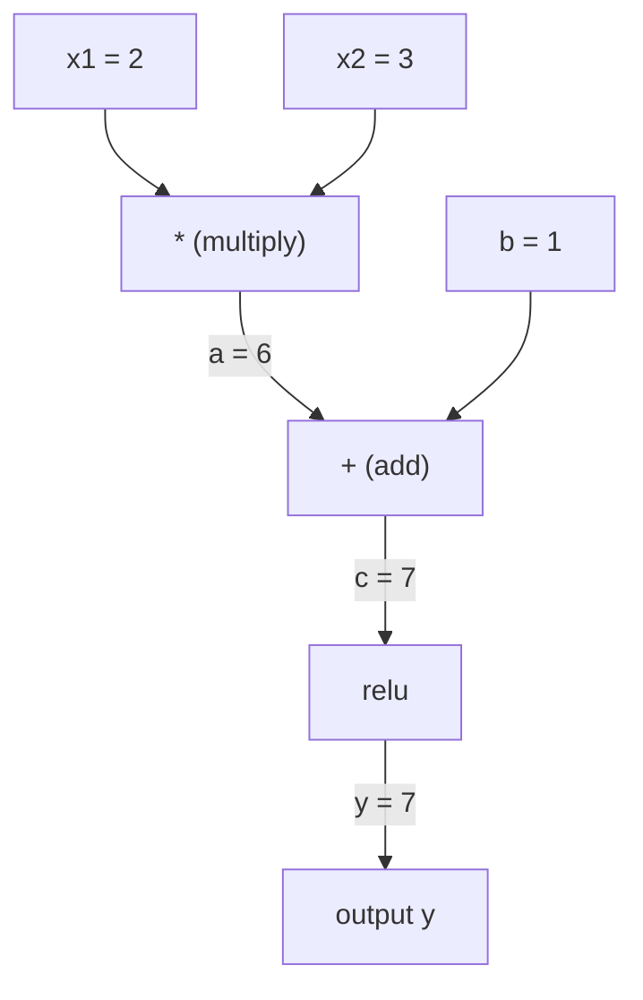
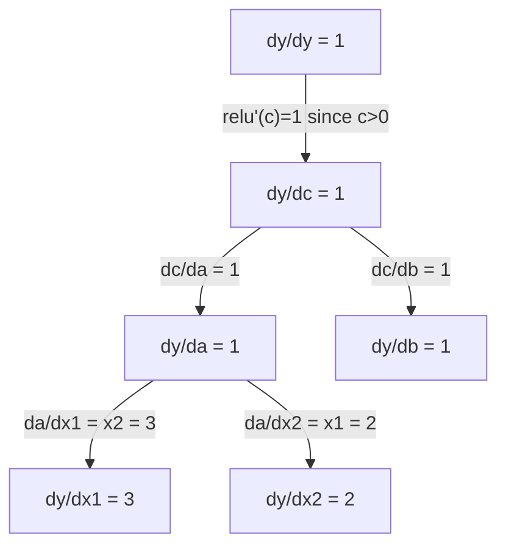

# Reguła łańcuchowa i automatyczne różniczkowanie

> Reguła łańcuchowa to silnik napędzający każdą uczącą się sieć neuronową.

**Typ:** Build
**Język:** Python
**Wymagania wstępne:** Faza 1, Lekcja 04 (Pochodne i gradienty)
**Czas:** ~90 minut

## Cele nauki

- Zbudowanie minimalnego silnika autograd (klasa Value), który zapisuje operacje i oblicza gradienty za pomocą automatycznego różniczkowania w trybie wstecznym (reverse-mode autodiff)
- Implementacja przejść w przód i w tył przez graf obliczeniowy z wykorzystaniem sortowania topologicznego
- Skonstruowanie i wytrenowanie wielowarstwowego perceptronu (MLP) na problemie XOR przy użyciu wyłącznie napisanego od podstaw silnika autograd
- Weryfikacja poprawności autodiff za pomocą sprawdzania gradientów (gradient checking) względem numerycznych różnic skończonych

## Problem

Potrafisz obliczać pochodne prostych funkcji. Ale sieć neuronowa nie jest prostą funkcją. To setki funkcji złożonych ze sobą: mnożenie macierzy, dodanie obciążenia (bias), zastosowanie funkcji aktywacji, ponowne mnożenie macierzy, softmax, funkcja straty cross-entropy. Wynik jest funkcją funkcji funkcji.

Aby wytrenować sieć, potrzebujesz gradientu funkcji straty względem każdej pojedynczej wagi. Robienie tego ręcznie jest niemożliwe dla milionów parametrów. Robienie tego numerycznie (różnice skończone) jest zbyt wolne.

Reguła łańcuchowa daje matematykę. Automatyczne różniczkowanie daje algorytm. Razem pozwalają obliczyć dokładne gradienty przez dowolne kompozycje funkcji w czasie proporcjonalnym do pojedynczego przejścia w przód.

W ten sposób działają PyTorch, TensorFlow i JAX. Zbudujesz miniaturową wersję od podstaw.

## Koncepcja

### Reguła łańcuchowa

Jeśli `y = f(g(x))`, pochodna `y` względem `x` wynosi:

```
dy/dx = dy/dg * dg/dx = f'(g(x)) * g'(x)
```

Pomnóż pochodne wzdłuż łańcucha. Każde ogniwo wnosi swoją pochodną lokalną.

Przykład: `y = sin(x^2)`

```
g(x) = x^2       g'(x) = 2x
f(g) = sin(g)     f'(g) = cos(g)

dy/dx = cos(x^2) * 2x
```

Dla głębszych kompozycji łańcuch się wydłuża:

```
y = f(g(h(x)))

dy/dx = f'(g(h(x))) * g'(h(x)) * h'(x)
```

Każda warstwa sieci neuronowej jest jednym ogniwem tego łańcucha.

### Grafy obliczeniowe

Graf obliczeniowy wizualizuje regułę łańcuchową. Każda operacja staje się węzłem. Dane przepływają przez graf w przód. Gradienty przepływają wstecz.

**Przejście w przód (obliczanie wartości):**



**Przejście wsteczne (obliczanie gradientów):**



Przejście wsteczne stosuje regułę łańcuchową w każdym węźle, propagując gradienty od wyjścia do wejść.

### Tryb forward vs tryb reverse

Istnieją dwa sposoby zastosowania reguły łańcuchowej w grafie.

**Tryb forward (forward mode)** zaczyna od wejść i przepycha pochodne do przodu. Oblicza `dx/dx = 1` i propaguje przez każdą operację. Dobry, gdy masz mało wejść i wiele wyjść.

```
Forward mode: seed dx/dx = 1, propaguj do przodu

  x = 2       (dx/dx = 1)
  a = x^2     (da/dx = 2x = 4)
  y = sin(a)  (dy/dx = cos(a) * da/dx = cos(4) * 4 = -2.615)
```

**Tryb reverse (reverse mode)** zaczyna od wyjścia i ciągnie gradienty wstecz. Oblicza `dy/dy = 1` i propaguje przez każdą operację w odwrotnej kolejności. Dobry, gdy masz wiele wejść i mało wyjść.

```
Reverse mode: seed dy/dy = 1, propaguj wstecz

  y = sin(a)  (dy/dy = 1)
  a = x^2     (dy/da = cos(a) = cos(4) = -0.654)
  x = 2       (dy/dx = dy/da * da/dx = -0.654 * 4 = -2.615)
```

Sieci neuronowe mają miliony wejść (wagi) i jedno wyjście (funkcja straty). Tryb reverse oblicza wszystkie gradienty w jednym przejściu wstecznym. Dlatego backpropagation wykorzystuje tryb reverse.

| Tryb | Seed | Kierunek | Najlepszy gdy |
|------|------|-----------|-----------|
| Forward | `dx_i/dx_i = 1` | Od wejścia do wyjścia | Mało wejść, wiele wyjść |
| Reverse | `dy/dy = 1` | Od wyjścia do wejścia | Wiele wejść, mało wyjść (sieci neuronowe) |

### Liczby dualne dla trybu forward

Tryb forward można elegancko zaimplementować za pomocą liczb dualnych (dual numbers). Liczba dualna ma postać `a + b*epsilon`, gdzie `epsilon^2 = 0`.

```
Liczba dualna: (wartość, pochodna)

(2, 1) oznacza: wartość wynosi 2, pochodna względem x wynosi 1

Reguły arytmetyczne:
  (a, a') + (b, b') = (a+b, a'+b')
  (a, a') * (b, b') = (a*b, a'*b + a*b')
  sin(a, a')         = (sin(a), cos(a)*a')
```

Zaszczep zmienną wejściową pochodną równą 1. Pochodna propaguje się automatycznie przez każdą operację.

### Budowa silnika autograd

Silnik autograd potrzebuje trzech elementów:

1. **Opakowanie wartości (Value wrapping).** Owiń każdą liczbę w obiekt, który przechowuje jej wartość i gradient.
2. **Zapis grafu (graph recording).** Każda operacja zapisuje swoje wejścia i funkcję pochodnej lokalnej.
3. **Przejście wsteczne (backward pass).** Posortuj graf topologicznie, a następnie przejdź go w odwrotnej kolejności, stosując regułę łańcuchową w każdym węźle.

Dokładnie tak działa moduł `autograd` w PyTorch. Klasa `torch.Tensor` opakowuje wartości, zapisuje operacje gdy `requires_grad=True`, i oblicza gradienty po wywołaniu `.backward()`.

### Jak działa PyTorch Autograd pod maską

Gdy piszesz kod w PyTorch:

```python
x = torch.tensor(2.0, requires_grad=True)
y = x ** 2 + 3 * x + 1
y.backward()
print(x.grad)  # 7.0 = 2*x + 3 = 2*2 + 3
```

PyTorch wewnętrznie:

1. Tworzy węzeł `Tensor` dla `x` z `requires_grad=True`
2. Każda operacja (`**`, `*`, `+`) tworzy nowy węzeł i zapisuje funkcję wsteczną
3. `y.backward()` uruchamia automatyczne różniczkowanie w trybie reverse przez zapisany graf
4. `grad_fn` każdego węzła oblicza gradienty lokalne i przekazuje je do węzłów nadrzędnych
5. Gradienty kumulują się w atrybutach `.grad` poprzez dodawanie (nie zastępowanie)

Graf jest dynamiczny (define-by-run). Nowy graf jest budowany przy każdym przejściu w przód. Dlatego PyTorch obsługuje sterowanie przepływem (if/else, pętle) wewnątrz modeli.

## Zbuduj to

### Krok 1: Klasa Value

```python
class Value:
    def __init__(self, data, children=(), op=''):
        self.data = data
        self.grad = 0.0
        self._backward = lambda: None
        self._prev = set(children)
        self._op = op

    def __repr__(self):
        return f"Value(data={self.data:.4f}, grad={self.grad:.4f})"
```

Każdy `Value` przechowuje swoje dane numeryczne, swój gradient (początkowo zero), funkcję wsteczną i wskaźniki do węzłów potomnych, które go wytworzyły.

### Krok 2: Operacje arytmetyczne ze śledzeniem gradientu

```python
    def __add__(self, other):
        other = other if isinstance(other, Value) else Value(other)
        out = Value(self.data + other.data, (self, other), '+')
        def _backward():
            self.grad += out.grad
            other.grad += out.grad
        out._backward = _backward
        return out

    def __mul__(self, other):
        other = other if isinstance(other, Value) else Value(other)
        out = Value(self.data * other.data, (self, other), '*')
        def _backward():
            self.grad += other.data * out.grad
            other.grad += self.data * out.grad
        out._backward = _backward
        return out

    def relu(self):
        out = Value(max(0, self.data), (self,), 'relu')
        def _backward():
            self.grad += (1.0 if out.data > 0 else 0.0) * out.grad
        out._backward = _backward
        return out
```

Każda operacja tworzy domknięcie (closure), które wie, jak obliczyć gradienty lokalne i pomnożyć je przez gradient nadrzędny (`out.grad`). Operator `+=` obsługuje przypadek, gdy wartość jest używana w wielu operacjach.

### Krok 3: Przejście wsteczne

```python
    def backward(self):
        topo = []
        visited = set()
        def build_topo(v):
            if v not in visited:
                visited.add(v)
                for child in v._prev:
                    build_topo(child)
                topo.append(v)
        build_topo(self)

        self.grad = 1.0
        for v in reversed(topo):
            v._backward()
```

Sortowanie topologiczne zapewnia, że gradient każdego węzła jest w pełni obliczony, zanim zostanie propagowany do jego węzłów potomnych. Gradient zalążkowy (seed) wynosi 1.0 (dy/dy = 1).

### Krok 4: Więcej operacji dla kompletnego silnika

Podstawowa klasa Value obsługuje dodawanie, mnożenie i relu. Prawdziwy silnik autograd potrzebuje więcej. Oto operacje potrzebne do budowy sieci neuronowych:

```python
    def __neg__(self):
        return self * -1

    def __sub__(self, other):
        return self + (-other)

    def __radd__(self, other):
        return self + other

    def __rmul__(self, other):
        return self * other

    def __rsub__(self, other):
        return other + (-self)

    def __pow__(self, n):
        out = Value(self.data ** n, (self,), f'**{n}')
        def _backward():
            self.grad += n * (self.data ** (n - 1)) * out.grad
        out._backward = _backward
        return out

    def __truediv__(self, other):
        return self * (other ** -1) if isinstance(other, Value) else self * (Value(other) ** -1)

    def exp(self):
        import math
        e = math.exp(self.data)
        out = Value(e, (self,), 'exp')
        def _backward():
            self.grad += e * out.grad
        out._backward = _backward
        return out

    def log(self):
        import math
        out = Value(math.log(self.data), (self,), 'log')
        def _backward():
            self.grad += (1.0 / self.data) * out.grad
        out._backward = _backward
        return out

    def tanh(self):
        import math
        t = math.tanh(self.data)
        out = Value(t, (self,), 'tanh')
        def _backward():
            self.grad += (1 - t ** 2) * out.grad
        out._backward = _backward
        return out
```

**Dlaczego każda operacja ma znaczenie:**

| Operacja | Reguła wsteczna | Używana w |
|-----------|--------------|---------|
| `__sub__` | Wykorzystuje add + neg | Obliczanie funkcji straty (pred - target) |
| `__pow__` | n * x^(n-1) | Aktywacje wielomianowe, MSE (error^2) |
| `__truediv__` | Wykorzystuje mul + pow(-1) | Normalizacja, skalowanie współczynnika uczenia |
| `exp` | exp(x) * upstream | Softmax, log-likelihood |
| `log` | (1/x) * upstream | Funkcja straty cross-entropy, logarytmy prawdopodobieństw |
| `tanh` | (1 - tanh^2) * upstream | Klasyczna funkcja aktywacji |

Sprytna część: `__sub__` i `__truediv__` są zdefiniowane w kategoriach istniejących operacji. Otrzymują poprawne gradienty za darmo, ponieważ reguła łańcuchowa składa się przez bazowe operacje add/mul/pow.

### Krok 5: Mini MLP od podstaw

Mając kompletną klasę Value, możesz zbudować sieć neuronową. Bez PyTorch. Bez NumPy. Tylko Value i reguła łańcuchowa.

```python
import random

class Neuron:
    def __init__(self, n_inputs):
        self.w = [Value(random.uniform(-1, 1)) for _ in range(n_inputs)]
        self.b = Value(0.0)

    def __call__(self, x):
        act = sum((wi * xi for wi, xi in zip(self.w, x)), self.b)
        return act.tanh()

    def parameters(self):
        return self.w + [self.b]

class Layer:
    def __init__(self, n_inputs, n_outputs):
        self.neurons = [Neuron(n_inputs) for _ in range(n_outputs)]

    def __call__(self, x):
        return [n(x) for n in self.neurons]

    def parameters(self):
        return [p for n in self.neurons for p in n.parameters()]

class MLP:
    def __init__(self, sizes):
        self.layers = [Layer(sizes[i], sizes[i+1]) for i in range(len(sizes)-1)]

    def __call__(self, x):
        for layer in self.layers:
            x = layer(x)
        return x[0] if len(x) == 1 else x

    def parameters(self):
        return [p for layer in self.layers for p in layer.parameters()]
```

`Neuron` oblicza `tanh(w1*x1 + w2*x2 + ... + b)`. `Layer` to lista neuronów. `MLP` układa warstwy w stos. Każda waga jest obiektem `Value`, więc wywołanie `loss.backward()` propaguje gradienty do każdego parametru.

**Trenowanie na XOR:**

```python
random.seed(42)
model = MLP([2, 4, 1])  # 2 wejścia, 4 neurony ukryte, 1 wyjście

xs = [[0, 0], [0, 1], [1, 0], [1, 1]]
ys = [-1, 1, 1, -1]  # wzorzec XOR (używamy -1/1 dla tanh)

for step in range(100):
    preds = [model(x) for x in xs]
    loss = sum((p - y) ** 2 for p, y in zip(preds, ys))

    for p in model.parameters():
        p.grad = 0.0
    loss.backward()

    lr = 0.05
    for p in model.parameters():
        p.data -= lr * p.grad

    if step % 20 == 0:
        print(f"step {step:3d}  loss = {loss.data:.4f}")

print("\nPredictions after training:")
for x, y in zip(xs, ys):
    print(f"  input={x}  target={y:2d}  pred={model(x).data:6.3f}")
```

To jest micrograd. Kompletna pętla treningowa sieci neuronowej w czystym Pythonie z automatycznym różniczkowaniem. Każdy komercyjny framework do uczenia głębokiego robi to samo na ogromną skalę.

### Krok 6: Sprawdzanie gradientów

Skąd wiesz, że twój autodiff jest poprawny? Porównaj go z pochodnymi numerycznymi. To jest sprawdzanie gradientów (gradient checking).

```python
def gradient_check(build_expr, x_val, h=1e-7):
    x = Value(x_val)
    y = build_expr(x)
    y.backward()
    autodiff_grad = x.grad

    y_plus = build_expr(Value(x_val + h)).data
    y_minus = build_expr(Value(x_val - h)).data
    numerical_grad = (y_plus - y_minus) / (2 * h)

    diff = abs(autodiff_grad - numerical_grad)
    return autodiff_grad, numerical_grad, diff
```

Przetestuj to na złożonym wyrażeniu:

```python
def expr(x):
    return (x ** 3 + x * 2 + 1).tanh()

ad, num, diff = gradient_check(expr, 0.5)
print(f"Autodiff:  {ad:.8f}")
print(f"Numerical: {num:.8f}")
print(f"Difference: {diff:.2e}")
# Różnica powinna być < 1e-5
```

Sprawdzanie gradientów jest niezbędne podczas implementacji nowych operacji. Jeśli twoje przejście wsteczne ma błąd, sprawdzenie numeryczne go wyłapie. Każda poważna implementacja uczenia głębokiego uruchamia sprawdzanie gradientów podczas rozwoju.

**Kiedy stosować sprawdzanie gradientów:**

| Sytuacja | Wykonać gradient check? |
|-----------|-------------------|
| Dodawanie nowej operacji do twojego autograd | Tak, zawsze |
| Debugowanie pętli treningowej, która się nie zbiega | Tak, najpierw sprawdź gradienty |
| Trening produkcyjny | Nie, zbyt wolne (2x przejść w przód na parametr) |
| Testy jednostkowe dla kodu autograd | Tak, zautomatyzuj to |

### Krok 7: Weryfikacja względem obliczeń ręcznych

```python
x1 = Value(2.0)
x2 = Value(3.0)
a = x1 * x2          # a = 6.0
b = a + Value(1.0)    # b = 7.0
y = b.relu()          # y = 7.0

y.backward()

print(f"y = {y.data}")          # 7.0
print(f"dy/dx1 = {x1.grad}")   # 3.0 (= x2)
print(f"dy/dx2 = {x2.grad}")   # 2.0 (= x1)
```

Sprawdzenie ręczne: `y = relu(x1*x2 + 1)`. Ponieważ `x1*x2 + 1 = 7 > 0`, relu jest tożsamością.
`dy/dx1 = x2 = 3`. `dy/dx2 = x1 = 2`. Silnik się zgadza.

## Użyj tego

### Weryfikacja względem PyTorch

```python
import torch

x1 = torch.tensor(2.0, requires_grad=True)
x2 = torch.tensor(3.0, requires_grad=True)
a = x1 * x2
b = a + 1.0
y = torch.relu(b)
y.backward()

print(f"PyTorch dy/dx1 = {x1.grad.item()}")  # 3.0
print(f"PyTorch dy/dx2 = {x2.grad.item()}")  # 2.0
```

Te same gradienty. Twój silnik oblicza ten sam wynik co PyTorch, ponieważ matematyka jest identyczna: automatyczne różniczkowanie w trybie reverse za pomocą reguły łańcuchowej.

### Bardziej złożone wyrażenie

```python
a = Value(2.0)
b = Value(-3.0)
c = Value(10.0)
f = (a * b + c).relu()  # relu(2*(-3) + 10) = relu(4) = 4

f.backward()
print(f"df/da = {a.grad}")  # -3.0 (= b)
print(f"df/db = {b.grad}")  #  2.0 (= a)
print(f"df/dc = {c.grad}")  #  1.0
```

## Wdróż to

Ta lekcja tworzy:
- `outputs/skill-autodiff.md` -- skill do budowania i debugowania systemów autograd
- `code/autodiff.py` -- minimalny silnik autograd, który możesz rozbudować

Klasa Value zbudowana tutaj jest fundamentem pętli treningowej sieci neuronowej w Fazie 3.

## Ćwiczenia

1. Dodaj `__pow__` do klasy Value, aby móc obliczać `x ** n`. Zweryfikuj, że `d/dx(x^3)` przy `x=2` wynosi `12.0`.

2. Dodaj `tanh` jako funkcję aktywacji. Zweryfikuj, że `tanh'(0) = 1` oraz `tanh'(2) = 0.0707` (w przybliżeniu).

3. Zbuduj graf obliczeniowy dla pojedynczego neuronu: `y = relu(w1*x1 + w2*x2 + b)`. Oblicz wszystkie pięć gradientów i zweryfikuj je względem PyTorch.

4. Zaimplementuj automatyczne różniczkowanie w trybie forward za pomocą liczb dualnych. Stwórz klasę `Dual` i sprawdź, czy daje takie same pochodne jak twój silnik w trybie reverse.

## Kluczowe pojęcia

| Termin | Co się mówi | Co to faktycznie oznacza |
|------|----------------|----------------------|
| Reguła łańcuchowa (chain rule) | "Mnożysz pochodne" | Pochodna funkcji złożonych jest równa iloczynowi pochodnych lokalnych każdej funkcji, obliczonych w odpowiednim punkcie |
| Graf obliczeniowy (computational graph) | "Diagram sieci" | Skierowany graf acykliczny, w którym węzły to operacje, a krawędzie przenoszą wartości (w przód) lub gradienty (wstecz) |
| Tryb forward (forward mode) | "Przepychanie pochodnych do przodu" | Autodiff, który propaguje pochodne od wejść do wyjść. Jedno przejście na zmienną wejściową. |
| Tryb reverse (reverse mode) | "Backpropagation" | Autodiff, który propaguje gradienty od wyjść do wejść. Jedno przejście na zmienną wyjściową. |
| Autograd | "Automatyczne gradienty" | System, który zapisuje operacje na wartościach, buduje graf i oblicza dokładne gradienty za pomocą reguły łańcuchowej |
| Liczby dualne (dual numbers) | "Wartość plus pochodna" | Liczby postaci a + b*epsilon (epsilon^2 = 0), które przenoszą informację o pochodnej przez operacje arytmetyczne |
| Sortowanie topologiczne (topological sort) | "Kolejność zależności" | Uporządkowanie węzłów grafu tak, by każdy węzeł występował po wszystkich swoich zależnościach. Wymagane dla poprawnej propagacji gradientów. |
| Akumulacja gradientu (gradient accumulation) | "Dodawaj, nie zastępuj" | Gdy wartość zasila wiele operacji, jej gradient jest sumą wszystkich przychodzących wkładów gradientu |
| Graf dynamiczny (dynamic graph) | "Define by run" | Graf obliczeniowy odbudowywany przy każdym przejściu w przód, umożliwiający użycie sterowania przepływem Pythona wewnątrz modeli (styl PyTorch) |
| Sprawdzanie gradientów (gradient checking) | "Weryfikacja numeryczna" | Porównywanie gradientów z autodiff z numerycznymi gradientami z różnic skończonych w celu weryfikacji poprawności. Niezbędne przy debugowaniu. |
| MLP | "Wielowarstwowy perceptron (multi-layer perceptron)" | Sieć neuronowa z jedną lub więcej ukrytych warstw neuronów. Każdy neuron oblicza ważoną sumę plus obciążenie (bias), a następnie stosuje funkcję aktywacji. |
| Neuron | "Ważona suma + aktywacja" | Podstawowa jednostka: output = activation(w1*x1 + w2*x2 + ... + b). Wagi i bias są parametrami uczonymi. |

## Dalsza lektura

- [3Blue1Brown: Backpropagation calculus](https://www.youtube.com/watch?v=tIeHLnjs5U8) -- wizualne wyjaśnienie reguły łańcuchowej w sieciach neuronowych
- [PyTorch Autograd mechanics](https://pytorch.org/docs/stable/notes/autograd.html) -- jak działa rzeczywisty system
- [Baydin et al., Automatic Differentiation in Machine Learning: a Survey](https://arxiv.org/abs/1502.05767) -- obszerne źródło referencyjne
