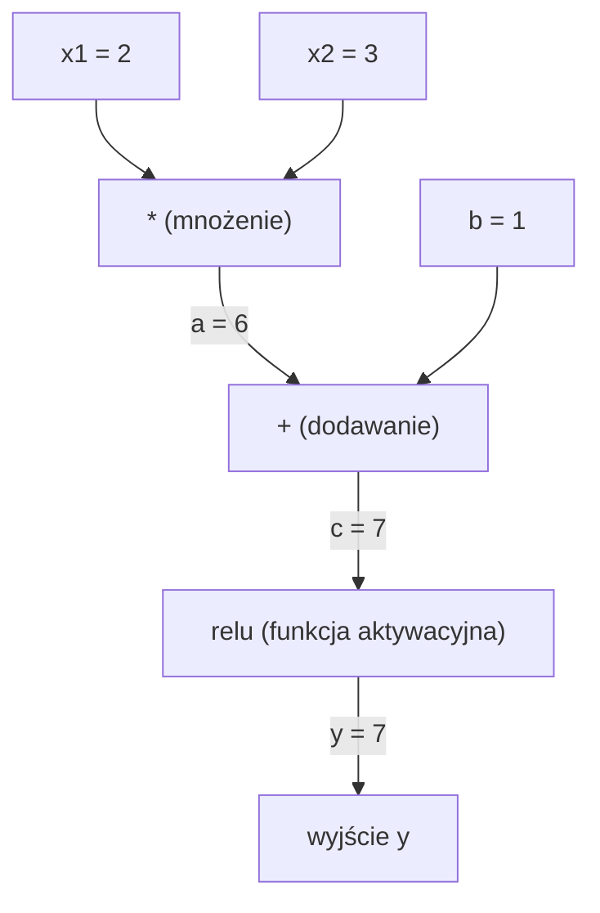
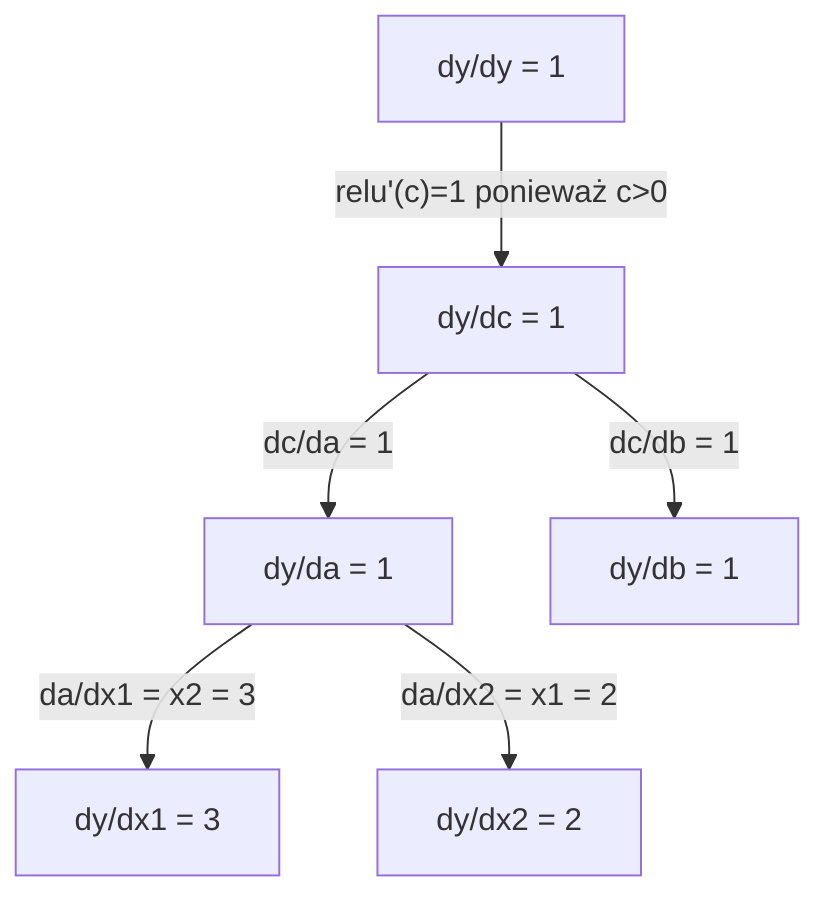

# Reguła łańcuchowa i automatyczne różniczkowanie (Autodiff)

> Reguła łańcuchowa to silnik każdej uczącej się sieci neuronowej.

**Typ:** Teoria i implementacja (Kompilacja)
**Język:** Python
**Wymagania wstępne:** Faza 1, Lekcja 04 (Pochodne i gradienty)
**Czas:** ~90 minut

## Cele nauczania

- Zbudowanie własnego, minimalnego silnika autograd (klasa `Value`), który rejestruje operacje i wylicza gradienty, korzystając z automatycznego różniczkowania w trybie wstecznym (reverse-mode autodiff).
- Implementacja pełnego przejścia w przód (forward pass) oraz propagacji w tył (backward pass) na grafie obliczeniowym z wykorzystaniem sortowania topologicznego.
- Skonstruowanie oraz wytrenowanie wielowarstwowego perceptronu (MLP) rozwiązującego problem XOR, bazując wyłącznie na napisanym od podstaw silniku autograd.
- Zweryfikowanie poprawności działania mechanizmu autodiff poprzez tzw. gradient checking (sprawdzanie z użyciem przybliżenia numerycznych różnic skończonych).

## Problem

Potrafisz obliczyć pochodne z prostych funkcji. Ale sieć neuronowa nie jest zwykłą funkcją. To tysiące, jeśli nie miliony zagnieżdżonych i połączonych w złożoną strukturę wzorów i ułożonych kolejno warstw: mnożenie macierzy, wpompowywanie narzutów wagowych i obciążeń, przeplatanie nieliniowych układów aktywacyjnych, dodawanie softmaxu, redukcja logitów przez wektor dla entropii krzyżowej. Twoje przewidywanie to de facto zlewająca się funkcja ulepiona z wnętrzności innych funkcji.

Aby model optymalizował i uczył się z danych, potrzebujemy matematycznej i bezpośredniej ścieżki wyprowadzenia błędu sieci (gradient funkcji straty) w odniesieniu do uaktualnienia każdej pojedynczej wagi w ułamku procenta. Wykonanie tego kalkulatorem, "na papierze" z milionem węzłów i z użyciem tradycyjnych metod numerycznych dla każdej wagi? Utopijnie powolne.

Tu właśnie nadciąga reguła łańcuchowa dla wsparcia czysto matematycznego oraz inteligentny automatyczny mechanizm zwany autodiffem, który dba o całą logikę ze wsparciem drzew na bazie grafów z pamięcią programową komputera. Połączone siły stawiają wprost niezawodne środowisko by błyskawicznie propagować (podrzucać do tyłu układu tensorowego) rygorystycznie dokładne i w punkt poprawne gradienty. Ich odtworzenie poprzez łańcuch funkcji złożonych to wysiłek obciążający CPU proporcjonalnie i dokładnie o równej sile co proces prostego podania tych wyników i obliczeń matematycznych idących w klasycznym pasażu na początek ułożonego przez nas modelu w prawą stronę ekranu (do mety, tj. Forward pass).

To jest rdzeń w operowaniu pod powierzchnią frameworków pokroju PyTorcha, TensorFlowa i JAX-a. Dziś weźmiemy te gigantyczne, złożone potwory i wyizolujemy je od zera w piaskownicy z Pythonem, by skroić najczystszą bazową wersję.

## Koncepcja

### Reguła łańcuchowa (Chain Rule)

Jeżeli podamy: `y = f(g(x))`, zasada poszukiwań na pochodną ze zmian dla prostej wartości `y` przez zmienność parametru `x` ustanawia formę wielomianu:

```
dy/dx = dy/dg * dg/dx = f'(g(x)) * g'(x)
```

Pomnóż każdą napotkaną szczątkową cząsteczkę w locie powrotu wstecz! Wartość odzwierciedla swą rolę - jako "część" potęgi na skali na której się znajdowała. 

Czysty wariant dla ujęcia w skrypcie: `y = sin(x^2)`

```
Funkcja g (wnętrze dla operacji): g(x) = x^2   =>   g'(x) = 2x
Funkcja f na obudowie : f(g) = sin(g)         =>   f'(g) = cos(g)

Finalny wzór wyprowadzony dla wektora ujęcia: 
dy/dx = cos(x^2) * 2x
```

Głębsze zejście tworzy poszerzone kompozycje łańcucha:

```
y = f(g(h(x)))

dy/dx = f'(g(h(x))) * g'(h(x)) * h'(x)
```

To dosłowna forma w jakiej buduje się sieci neuronowe – absolutnie i dosłownie każde nakładanie z nałożenia nowej ukrytej warstwy, dokłada tylko pętli od środka by w drodze w górę/w dół dodać ogniwo dla mnożenia na powrotnej wspinaczce strumienia z korekcją w gradiencie!

### Grafy obliczeniowe (Computational Graphs)

W celu uproszczenia reguł zawiłego rozbicia do przejrzystej formy z podziałem powtarzalnej rutyny maszynowej z reguł różniczkowania, środowiska te przełożono wizualnie w formę układu rozrzuconego grafu drzewiastego (tzw. z ang. computational graph - grafu obliczeniowego). Pojedyncza kropla na nim staje się skrzyżowaniem dróg dla strumienia wektorów. Każda gałązka wyrastająca w prawo - dodaje w wektorze surowe przeliczone wartości na wprost do węzła finalnego. Wyliczony punkt i wektor po nawrocie leci w poprzek od tyłu podbijając przeliczoną proporcjonalną falą wektorów napędzającą w górę strumień pod błąd ujętej propagacji.

**Pasaż z przeliczaniem w przód na grafie - wyliczanie prognozy (Forward pass):**



**Propagacja przepuszczana od tyłu grafu z błędem w celu napraw (Backward pass / Backpropagation):**



Powrót przeżarł przez każde odgałęzienie układanki, a algorytm przy zastosowaniu matematycznej wierności i ścisłej korelacji wzorów pomnożył zrzucony szczątek pochodnej ze strony zwrotnej poprzez szczątek osadzony do bazy punktu docelowego - aplikując i popychając od wyjściowego wyniku fali do pierwszego i ukrytego z pączków w systemie wejściowym x1/x2 i na korekcję b z siatki. To jest najpotężniejsze objaśnienie działania modelu sieci!

### Zestawienia z podejściem Trybu dla rzucania fali do przodu, a ucieczką wsteczną (Forward Mode vs Reverse Mode)

W oprogramowaniu pod zrębem algorytmicznym regułę można rozwiązywać ze strony na dwie różne drogi (z oboma skrajnie różnymi konsekwencjami dla maszyn!)

**Tryb w przód (Forward mode):** narzuca wejścia jako pierwszy krok węzłowy i spycha wszystkie cząstkowe pochodne pod zderzak ułożonych w dół kolejnych operacji. Wpisując początkowy warunek inicjacyjny na osnowę zmiennej do układu jako twarde narzucone `dx/dx = 1` narzuca w biegu propagowanie z wynikiem i wyliczonym spadkiem. Fenomenalnie działa na układach z garstką punktów na wejściu, z masowym poszerzeniem u góry rozstępując się wielowątkowo od jednego wyjścia pod rozwarte pole.

```
Zasada forward-mode dla autodyferencjacji: ustal początek dla dx/dx = 1, i popchnij wyliczane pule w prawą na zderzenie po przodzie!
 
  Przyjęte x = 2       (start dx/dx = 1)
  Wynik a = x^2     (z wyliczeń pobocznych da/dx = 2x = 4)
  Finalne y = sin(a)  (obliczone jako zrzut dy/dx = cos(a) * da/dx = cos(4) * 4 = -2.615)
```

**Tryb w odwrotną/rewers (Reverse mode):** Narzuca się start całkowicie na ostatnim zrzuconym od góry węźle kończącym graf u sieci - u wyjścia, spychając pod narzucony nacisk pod górę na kaskadę gałązek w tył aż po ugrzęźnięte parametry od stacji początkowej. Przydziela inicjalną wartość u progu startu jako flagę bazową tj. wyjście `dy/dy = 1` i zawraca w ugiętym procesie od tyłu, każdą napotkaną w zagnieżdżeniu czynność w pełni ułożonym szyku z powrotem od spodu pod lewą stronę osi siatki. Błogosławieństwo na polach gdzie węzły początkowe są wręcz kolosalne a zakończenie na wektor straty u góry pętli zwężone i malutkie na węzeł wyników po ocenie np. loss/accuracy błędu z jednego strzału z sumacyjnym narzutem w lewo.

```
Zasada trybu reverse-mode: ustal wynik na końcu dla straty dy/dy = 1, puść machinę zwrotu od samego tyłka i przebyj na osi w przeciwnym biegu!

  Punkt stacji ostatniej y = sin(a)  (wytycza wektor fali bazowej na wynik tarczy, tak żeby oszacować na dy/dy = 1)
  Poprzednik a = x^2     (na co uderza falą i wymusza zwielokrotnienie powiększone w stary wektor, rozpisuje to: dy/da = cos(a) = cos(4) = -0.654)
  Stacja pierwotna startowa lewa x = 2       (kończy bieg - przyjmując rzut od góry podrzuca to sobie poprzez styk do góry z wyliczonym na osi da/dx -> co ostatecznie zostawia nam potęgę po wymnożeniach -> dy/dx = dy/da * da/dx = -0.654 * 4 = -2.615)
```

Wszystkie bez wyjątków formy systemów w AI korzystające i szacujące wektory na podstawie milionów kulek wag i wejść do zrzutu i skondensowanej oceny wyniku do skromnej tarczy straty (Loss), na podstawie samej racjonalności w architekturze skłaniają się ku trybowi propagacji "w tył" w celu błyskawicznego spięcia w ułamek nakładu dla całego pola siatki miliona układów by w pojedynczy zrzut i ruch zgarnąć 100% połatanych gradientowych dróg u spodu dla całego narzutu układu operacyjnego bez podwójnych przeliczeń z nadmiarem! (Ot dlaczego zwie się to od dawna po prostu - propagacją wsteczną / back-propagation!).

| Podejście | Rozpoczęcie (flaga nasienna) | Zwrot biegu z układem napędzania | Optymalny dla struktur typu |
|------|------|-----------|----------|
| Propagacja w Przód (Forward mode) | `dx_i/dx_i = 1` na wejściu | Pchnij wyliczenia ze stacji wejść od góry pod stacje dla wejść wyjścia (w prawo) | Mała pula wejściowa badana, eksplodująca duża połać warstw szerszych na stacjach wyjścia z prawej! |
| Propagacja Odwrotna (Reverse mode) | `dy/dy = 1` u wyjścia | Narzuć falę pod prąd wpychając wyniki z tarczy straty od wylotu do gęstej puli węzłów na wejściach badanych (w lewo/do tyłu) | Gigantyczne pola do odpytania i tysiące węzłów badawczych pod 1 okrojoną tarczę w locie. Od tego zjawiska i do tego służą od dawna Sieci Neuronowe. |

### Dual Numbers - liczby dualne dla rozwiązań liczenia trybem naprzód

System faworyzujący podejście propagacji pod prąd w układzie form pod tryb "W przód" idealnie radzi sobie ze świetną sztuczką podwójnej arytmetyki z udziałem "Liczb dualnych". Cechuje to rozbicie na zmyślne upakowanie wartości do jednej twardo powiązanej postaci przypominającej zespolone złączenie od strony liczb i wagi: ułamkowa wartość to `a + b*epsilon`,  założeniem zasady matematycznej dla której powiązany na rygor dodatek jako epsilon po wymnożeniu traci potęgę z wymiaru by przepaść na skale na stałe i równać 0 (`epsilon^2 = 0`).

```
Koncepcja układu Liczb Podwójnych zrzeszonych pod tryb (Dual number): wprowadzane parzyście (wartość surowa, gradient)

Przykład: para oznaczona (2, 1) oznacza iż w tym ułożeniu węzłowym po prostu wartość parametrowa to dokładnie wielkość 2, ale doczepiony rzep do niej to wektor w układzie jako gradient wyliczany względem parametru 'x', wynoszący okrągłe równe 1!

A co jeżeli to pomnożymy lub dodamy pod kątem skryptowym i na twardych prawach matematyki by to ze sobą utrzymało rację?:
  Dla wzoru na plus dla sumowania arytmetyki (a, a') + (b, b') = ułoży pod maską twardy wynik ujęty w nowej parze (a+b, a'+b')
  Oraz na zasadzie układów korelacji przy wymnożeniu krzyżowym po rygorach matematyki z ucięciem epsiliona -> (a, a') * (b, b') = stworzy układ wyliczony pod parę wyjściową wprost dającą idealny wektor! (a*b, a'*b + a*b')
  Podobnie wariant np z reguły sinusowych korelacji: sin(a, a')         = po pchnięciu pod formułę wypuszcza na styk gotową falę pod postać na (sin(a), cos(a)*a')
```

Jeżeli narzucisz nasionko - flagę dla punktu, zmienną inicjalizacyjną z pochodną narzuconą pod wektor równy rygorystycznie twarde "1", silnik pociągnie ukrytą strukturę samoistnie po siatce jako sprawny nośnik i rozprowadzi pochodne samoczynnie wewnątrz każdej pętli, każdego wyliczenia pod warstwami z automatu!

### Jak od Podszewki Zbudować Twój Niezawodny Własny Silnik Autograd (Auto-różniczkowania)

Maszyny takie by móc to odtworzyć w kodzie od A do Z sprowadzają się w gruncie rzczy zawsze i wszędzie -  niezmiennie od skomplikowania po tytaniczny system jakim objawia się wielki framework typu Pytorch do trzech świętych i niepisanych pryncypiów operacyjnych wymuszających całe dno w tle do zachowania tego poprawnego: 

1. **Osłonka do "Otulania" (Wrapping value).** Narzucenie osłonowej obudowy klasy wokół absolutnie każdej nagiej liczby/wartości. Przestaje to być dla interpretera surowy wymiar matematyczny pod float. Obudowujesz cyfrę w zgrabny układ trzymający 2 schowane pudełka - a więc na pudełko pierwsze rzucasz ową bezbronną czystą zapisaną cyfrę (Wartość). Ale obok dla otulającej ramki odpalasz i przybijasz nierozerwalnie w klasie dla ujęcia we wszystkich węzłach do końca i w głąb drugą mniejszą komórkę schowkową, służącą jedynie i nieustannie za twardy uciąg nośnika magazynującego przeliczony bieżący urok ze "Wartości dla wektora ze stopnia jej własnego przeliczonego gradientu" by zachować to twardo i w pamięci bez zgubienia.
2. **"Taśma" monitoringu rejestrowania każdego kroku od podstaw i w grafie (Graph recording).** Od tej pory zakazana operacja matematyczna! Od tej pory aby pomnożyć a x b - maszyna wpierw wklepuje zapisanie zrzutowe do notesu od historii ujęcia do przelotu o tym jaki dokładnie styk wykonała (węzły doczepionych parametrów na wprost do węzła źródła ze styku np a * b) no a po udanej transakcji wyliczeń na tym - zostawia sobie u siebie twardy przepis ułatwiający wyprowadzenie na bazie prostej małej ukrytej domkniętej subfunkcji "gradientowej operacji do wstecz dla mojego działania", przeliczając na bieżąco rygory z formuł z zasad w matematyce. To jest węzeł pod graf. Złączony do powrotu.
3. **Funkcjonalność z wywołaniem uderzenia u dołu falą by odbić i prze-sterować bieg zwrotny maszyn dla odświeżania wszystkich węzłów od nowa - w tył propagacja! (Backward pass).** Na tarczy po rzuceniu żądania - zapętlony kod przerzuca siłę i wyciąga sort topologiczny, segreguje listę wyliczonych do góry układów grafu operacyjnego styków (dopina układankę w kolejce w ułożeniu tak by każdy węzeł spływał dopiero jako drugi z ujęcia, gdy wszystko z góry zostało bez wahań ustalone i przeliczone aby nie zachwiać zrzutów po odnogach!). Ułożoną listę puszcza na wektor odwrotnym zwrotem biegu uderzając i wciskając magicznie ułożoną dla każdego mniejszą lokalnie podpiętą funkcję wywoławczą z gradientowym narzutem dopiętym domknięciem reguły łańcucha co nakłada falę na łańcuszek we wzór i pociąga narzut po fali.

Pod ową obudową PyTorch maskuje to twardo jako podskórny mechanizm silnika w kodzie źródłowym w C zwanym rdzennie autograd! Ot znana i szanowana gigantycznie nakreślona z milionów linii wielka Klasa - `torch.Tensor` - podpinająca osłonkami nagie liczby i zrzucająca węzły po wykonanych na tensorze sztuczkach i zbijająca flagą domyślnie rejestr włącznikiem w locie zrzucając operatory kiedy ustalisz flagę nakazującą na `requires_grad=True` pod parametrami i wypuszczająca wielki wywrot na koniec poprzez wpisanie znanej, lubianej, 1-wywoławczej formy strzału po węzłach - potężne `.backward()`.

### Podejrzyj co czai się pod obudowami PyTorcha z wykorzystaniem rzutów do ujęcia Autogradu po zrzutach!

Kod Python po stronie w programie rzucony pod wykonanie dla rzędu sieci we frameworku Pytorch na ułożeniach tensorów:

```python
x = torch.tensor(2.0, requires_grad=True)
y = x ** 2 + 3 * x + 1
y.backward()
print(x.grad)  # pokaże ujęte twardo z wyliczenia z rzutu fal z autogradu że spadkiem po powrocie będzie - wyplute nam 7.0 ! Oznacza to (bo dla y' -> dy/dx 2*x + 3 tj = 2*2 + 3) -> 7
```

Jak to zostało potajemnie wykończone i obsłużone od kuchni u mechanizmu z bebechami C PyTorcha z Pamięci pod tyłem maszynowym:

1. Przechwytuje kod wejścia i puszcza w eter twardy i osadzony do węzła zapis obiektu `Tensor` ukrywający gołą cyfrę w osłonie wezwanego dla zmiennej `x` z ustawioną z flagą kontrolującą uaktywnienie śladu ujęcia propagacji z tyłu po autogradzie - załączone jako zadeklarowany i upewniony wymuszeniem znacznik w argumencie w locie dla opcji na `requires_grad=True`.
2. Każdorazowe operowanie odtąd, styk, modyfikatory jak podbijanie potęgi (`**`, `*`, `+`) na tych osłonkach rozrzuca budulec pod dopinanie nowych sznurków stawiając i zostawiając zapisy każdego punktu oraz wiążąc to od razu ze strzałką nakierowania z dedykowaną tylko temu ułożoną mini-formułą na zrobienie rzutu gradientu z obranym narzuconym zwrotem po strzałce - czyli funkcja wstecz lokalnego powrotu dla tej 1 akcji u węzła w obudowie! Zostawiona w notesach, do wglądu.
3. Magia. Podrzucony skrypt wywołuje ze zdalnego strzału `y.backward()` jako rozkaz odblokowujący i inicjuje uruchomienie silnikowego mechanizmu by cofać auto-różniczkowaniem we wstecznym trybie (reverse mode autodiff). PyTorch ulatnia zapętlony obieg rzutu uderzenia gradientem badając rygor pozostawionego z przodu grafu ze szlakami w historii ze sklejonego rejestru!
4. Po nawrocie do wejścia każdego odspodu w grafowym uderzeniu wektora na punkt u złączeń na drodze napotyka `grad_fn` u stacji - wymuszając dla każdego tego punktu przerzucanie ze zrobionego lokalnego zwrotu z różniczek by puścić pęd gradientów odświeżonych ujęciem wyciągnięcia mnożenia po strzałce przeliczając fali powrót do punktów ze stacji nadrzędnych. Przekazuje falę po sznurach na startowe wierzchołki!
5. Wszystko ocalałe z nawrotów ujęć po grafach gromadzi pęd wejściowy zbierany narostem we wszystkich przeliczonych z węzłów pędu wyliczeń fali do obudowanej w ten parametr (stacja - czyli rodzic np nasza waga 'x') docelowo komórce w argumencie w pamięci po fladze od `x` gromadząc narzut zrzucany do flagi oznaczonej w instancji obiektu pod etykietę i atrybut z ujęciem `.grad` – podbicie poprzez ułożenie "sumowania i dodawania pędu"  (`+=`) od odnóg pod pociągnięcie skumulowanej po regułach matematycznej propagacji fali wektora gradientowego, (a pod żadnym pozorem nie kasowania i zastępowania pędu by zniknął pod 1 prądem straty). 

Sieciowy graf w we frameworku np dla PyTorcha jest układem całkowicie elastycznie narzucanym z locie u wykonania (W pełni dynamicznie rozciąganym jako defined-by-run w eter). Przy wykonaniu się każdego biegu wektorowego przepływu - na przód u zderzenia straty – kod leci u odrysowania budulca sieci z całkowicie i z na nowo rozpinanym budulcem i ułożonym na styk grafem węzłów i zapisanym notesem operacyjnym dla stacji z wyliczeniami w 1 obieg z wariantami rygoru z flagami w pamięć w każdym ułożonym przepuście wyliczającym dla wektora! Dzięki temu rewelacyjnemu i błyskotliwemu sztuczkarskim zabiegowi w logice i architekturze pod zręby silników kodu — genialnie proste rzutowanie od podstaw obsługuje natywnie logikę u warunków węzłowych i zawiłego przepływu logiki ze struktury pętli warunków ze struktury od wejścia/kodu ujęcia pythona by nakreślić elastyczne ujęcie i modelowe układy dla kontroli struktur w eterze jak pętle `for`/ `if/else` schowane całkowicie głęboko i bezpiecznie umiejscowione i upakowane w wnętrzu zagnieżdżonego układu ułożonej formacji logiki samych ukrytych wektorów i wag modelu! Genialne do niespotykanych wręcz granic. 

## Implementacja własnego Micro-Auto-Grad

### Krok 1: Własna Obudowa - tworzenie opakowującej w formę powłoki Klasy Węzłowej 'Value' 

```python
class Value:
    def __init__(self, data, children=(), op=''):
        self.data = data # surowa wartosć przechowywanej nagiej cyferki parametru ze statystyki/wagi
        self.grad = 0.0 # otulinka obudowująca pod spodem składowisko u zrzucania wyliczeń fali po propagacji (domyślny wektor ze statusem inicjalizacji ustawiony czysto równo pod start i reset u dołu dla 0.0! Nienaruszony).
        self._backward = lambda: None # domyślna startowo wstrzyknięta "bezfunkcyjna pusta wyrwa na wywołanie z lokalnego nakładu by nie wywołać nic dla strzału przed rejestracją". Puste domknięcie.
        self._prev = set(children) # wklejanie we wskaźnik i pamięciowanie list rodowodu dzieci co narzucały to do wariantu u góry dla powiązania węzła na stacji ze złącza!
        self._op = op # etykieta z zapisem wizualnym żeby ładnie nakreślić w układzie co było stacją modyfikatora wykonawczego! Np gwiazdka od potęgi.

    def __repr__(self):
        # sprytne wydanie do czytelnego zwrotu z komórki print(v) żeby ładnie ukazać stan i nagą wartość bez bełkotu na obiekty.
        return f"Value(data={self.data:.4f}, grad={self.grad:.4f})"
```

Każdy wytworzony w układzie u węzłów model i klatka `Value` przetrzymuje szczelnie parametry wyciągnięte ze statystycznych danych swojej nagiej twardej struktury liczbowej na wejścia, przetrzymując także skrytkę z zebranym dla niej od góry w powrotnej i odrzucającej po prądach falowej z nawrotu od fali gradientem i prądem wektora od wezwania strzału u propagacji wektorowej pod węzłem z wynikiem (od początku dla zrzutki jako surowe zerowe ujęcie z zrzutnią), ukrytą sub-logiką z wykonawczym styknięciem po funkcji wstecz ujętej ze stacji węzłowej by ustrzelić w obrys i ucieczkę po wywołaniu reguły łańcucha powielenia falą pod odnośne skrzyżowane u węzłów w locie po powiązanej logice ze struktury wstecznej oraz ułapaniem garstki wskaźników rzuconych u podstaw u węzła wskaźników do wezwania rodziców układów pod rygory (children) od podrzędnych ułożeń komórek z których sam po ułożeniu spisu wyewoluował na przodzie! 

### Krok 2: Wpajanie mądrości matematyki poprzez osadzone u operacji na Klasach dla ukrytego śledzenia węzłów u zrębów strumieniowania pędu z grafu!

```python
    def __add__(self, other): # magiczny ukryty moduł Pythona - czyli zachowanie dla zwykłego wywołania na a + b w skrypcie!
        other = other if isinstance(other, Value) else Value(other) # sprytka - jak dodasz coś z surowej liczby do naszej zabaweczki w obudowie to zmusisz ułożenie poprzez zaszczepienie jej nakładki obudowy od tyłu pod klasę samoistnie u zapisu.
        out = Value(self.data + other.data, (self, other), '+') # stwórz ułożone jako nowy twardy wynik u zrzutu dla węzła Value wkładając i wpisując ze statusem surowym wyliczenia a i b ze środka pod wynik z flagą pod rodzicielstwo self/other na węźle!
        def _backward(): # no to wpleć wyliczone domknięcie od lokalnej mądrości łańcucha ze strzałem po wzorze! Dodawanie na wejścia wektora przepuszcza i przerzuca pod strumień z górnego progu gradient pędzący i kopiuje po odnodze dla obydwu po 100 procent do selfa i othera. Bez potęg na pochodnej. Tylko dystrybucja gradientu!
            self.grad += out.grad # przydziel nakład fali w stację w 1 ułamku równej zejściowej potędze! + dla pętli powtórzeń akumulacyjnych!
            other.grad += out.grad # oddaj strumień dla osi nr 2 tak samo! I dorzuć na zrzut flagę że jest rozliczone!
        out._backward = _backward # wepnij tą magiczną funkcję na nową strukturę z wyliczeń u spodu od spodu pod wyznacznik. I zwróć jako czystą wartość wyjściową!
        return out

    def __mul__(self, other): # Magiczny wkład u Pytkowni z ukrycia rzutu od stacji wymnożenia pod a * b w skrypcie bez ukazywania cudów.
        other = other if isinstance(other, Value) else Value(other)
        out = Value(self.data * other.data, (self, other), '*')
        def _backward(): # z reguł na różniczkowania i pochodne na matematykę rzutu z odnogi od reguły z uderzenia fali!
            self.grad += other.data * out.grad # dla samo-obrony w nodzie wejściowym w selfie dognieć i rzuć na wektor grad wielokrotność wektora górnego outu wymnożoną rygorystycznie krzyżowo u współrzędnej osi innej czyli od 'other' z nagą zagnieżdżoną u spodu stałą daną u węzła w obudowie komórkowej under.data 
            other.grad += self.data * out.grad # i krzyżowo na wprost wyrzuć wektor spadowy wyliczony na odnodze a * grad wyrzuconej pędem u spodu gradientów po wezwaniach strzału by zbić u 'othera' ! Wprost piękno na matematyce z użyciem potęg z ujęcia łańcucha powielonego.
        out._backward = _backward
        return out

    def relu(self):
        out = Value(max(0, self.data), (self,), 'relu') # ukróć wektor i wynik z aktywacji! Jeśli na minus to sztywno zostaw ze wskaźnikiem na wejście 0. A jeśli w lewo powyżej w górę to wywal z parametrem ze stacji surowym z wyrównania od samej siebie.
        def _backward(): # wypięcie wezwania na nakładach aktywacyjnych na tarczy pochodnej Relu u wstecz ze wzorów z wyliczeń
            self.grad += (1.0 if out.data > 0 else 0.0) * out.grad # jeżeli stacja na gładko nie dała obciętego poniżej zejściowego tła wyjścia równo o skoku nagim 0 - to rzuć na prąd pochodną o potędze czystej 1 wyrzucając twardy zrzucony wektor prosto z powrotem. W innej wersji skoryguj by na martwym styku skosić błąd na 0. Odciąć prądy propagacji u spodu i zastopować narzut wektora we mgle i zgasić neuron za zmarłego bo w stacji poniżej nie odżyje! (Martwy neuron Relu syndrom!).
        out._backward = _backward
        return out
```

Całkowicie ułożona operacja we wpleceniu do obudowanej ramki u Klasy wymusza stworzenie i zamknięcia stacji węzłowej pod lokalny stan ułożony pod dedykowane zamknięcie logiczne i mini-stację procedur (tzw domknięcie closure). Ono w tajemnicy wie, jak po mistrzowsku po mistrzowsku wyliczyć ze wsparciem z wzorów w matematyce wyodrębnione potężne gradienty u szczątkowego lokalnego wymiaru węzła w złączeniu od u dołu styku, po czym narzuca prąd by je zrzucić poprzez pomnożenie gradientu od twardo spadającego do nich ze strzału u nadrzędnych komórkowych i przekazać ten odgórny po złączach wymnożony pakiet regułą (`out.grad`) w stację pod węzeł u startowych wejść! Zabieg do nakładania plusów od wdrożenia rzutu zapisu akumulacyjnego w `+=` od pierwszego dotknięcia rozwiązuje fenomenem potknięcia dla fali jeżeli pojedynczo zadeklarowana wartość ze spodu pod zrzuty wejściowe (na osi parametrów na przykład x na start na rozgałęzienie) leci na rozdroże by uderzyć potem u styków używana u wyliczeń krzyżowo po węzłach wyższych powieleń w układach na wiele nieliniowych odnóg z operacyjnymi gałązkami! Grad z fali rozgałęzionych wraca ze spadku spływając w wektory dodając proporcjonalnie i sklejając ze zrzutni odgałęzień proporcjonalny ujemny lub wymierzony błąd bez straty informacji. Zero nadpisań rzutem by coś zgubić z węzła w tle wektora!

### Krok 3: Pchnięcie odgórne jako Podanie straty fali do tyłu z tarczy w punkt (The Backward Pass)

```python
    def backward(self):
        topo = [] # stwórz czystą szufladkę po posortowaniu węzłów 
        visited = set() # wepnij schowek by zaznaczać oznaczony już po sprawdzeniu dla przejścia po układach wyłapany jako zatwierdzony od węzła znacznik z unikiem od wejścia by nie wyliczać zdublowanie u grafów w kółko 
        def build_topo(v): # stwórz mały ukryty węzełek pomocniczej funkcji dla nawrotów poszukiwaczy
            if v not in visited: # sprawdź czy jesteśmy tu po raz pierwszy? Czy widzieliśmy ten styk i zarys komórki na wektorze kiedyś u ścieżek z odnóg fali pobocznej? 
                visited.add(v) # uderz znaczkiem "Zatwierdzam wejście, oznaczam styk na stałe by nigdy z pętli z grafów drugi po nie wejść po wektor."
                for child in v._prev: # zejdźcie falą głęboko do każdego u pętli korzenia u korzeni zrzuconego spod podłączeń węzła - dziecka! Wezwij od dołu by na wstecz dotrzeć głębiej do bazy u podstaw grafu !
                    build_topo(child) # odpalamy rekursję powrotów by zgarnąć do węzłów spody do ostateczności u startów parametrów. I tak dalej. I tak w kółko! Pchajmy do zrzutu i uderzajmy by w locie na lewo wnikać na sam pęd spodu.
                topo.append(v) # ułóż po kolei zejściowy element układanki ze zwrotów na włożenie sprawnie wyselekcjonowanej gałęzi do koszyczka sortu by narzucić kolejność topologii i listę na zwrot z wyrzuceniem do strzałów fali po ułożeniu wektora
        build_topo(self) # włącz magiczne ustrojstwo na ten konkretny rzut parametru 'węzła z wynikiem' wywołany spod docelowej np od uderzeń wyjścia (stacji Loss u straty ze stacji finalnej z błędami) 

        self.grad = 1.0 # przydziel flagę ze statusem "jestem na wierzchołku, rzuć wektor nasienny startowej z fali dy/dy dla rozliczenia na wynik dy/dy jako twarde niezłomne 1 z bazą spadu wektora". Ustal wektor! 
        for v in reversed(topo): # Odrzuć na odwrót poukładaną w notesie z rekurencji topologię od pętli. Narzuć ją na zwrocie - tak aby te od końca najpłytsze stacje z tarczy miały styk wykonany pierwszy z fali do zwrotów z narzutem pod strumień ze stacji węzłowej do dzieci na tyły. 
            v._backward() # u każdego pączka dla pętli na grafie w ustalonej hierarchicznej drabince ze szczytów fali z rozliczeniem uderz lokalnie wyliczony mini-silnik na węzłach z _backward puszczając grad ze wzorów na zrzut do węzła spodni dla każdego dziecka ze wskazaniem! Dołóż potęg z lokalnych w odniesienia wektora na prąd gradientu dla następcy niżej! Płyń fali. Płyń w dół w wektory straty bez zatrzymania dla gradientowej sieci w tył propagacji na wagach wektora do poprawek parametrów z lewej w sieć wag sieci po warstwach ukrytych!
```

Dla bezbłędnej operacji Sortowania z wariantu z Topologiczną kaskadą na listach wymusza to twardy gwarant u rygoru z zachowania by gradienty składowane od poszczególnych pąków i u każdego poszczególnego elementu jako węzła zostały bez żadnych wyjątków rygorystycznie i zawsze docelowo wyliczone, ściągnięte w pełnych sumach wymiarów do domkniętych ze stacji narzutów powrotu strzałek u wszystkich z węzłów wlotowych od rozgałęzień od góry od fal fali - absolutnie tuż w punkcie startowym bez odzewu z wezwania puszczenia lokalnego węzła u zrzutu dla domknięcia strzałów i przesyłów rozprzestrzenionych w dół z narzutów by spychać potok do latorośli pąków ze stacji u wezwań u dołu jako gradient na rzut pod strzał fali w dół na mniejsze styki. Wyznacznik węzła nasionka bazowego równo zadeklarowany trzyma skalar straty 1.0 dla odnogi nasiennej przy wyjścia punkcie startowym z pędu od dołu (czyli ze zjawiskowej matematyki ujęcia by tarcza odwróconej wyliczonej macierzy pochodnej na `dy/dy` oddała pęd na startowy w równaniu `dy/dy = 1`).

### Krok 4: Reszta Potęg i Akrobacji Matematyki Niezbędna z Paskiem Do Kompletnego Narzutu Silnikowej Sprawności u Obudowy dla Modeli

Zminimalizowany prymitywny zarys u rdzennej opoki podstaw z Klasą z ujęcia po ramce klasowej od wariantu z węzła na obrys 'Value' obsługuje bez jęknięcia na chwilę bieżącą podstawy pod dodawanie wektorów sum do plusowania `+`, mnożenie po `*` no a finalnie też odnóża przy cięciu pętli w spodu do zrzutów po gładkim obcinającym w aktywacji nieliniowych załamań przy warunkach w `relu`. 

Czysty komercyjny wielogłowicowy rzut prawdziwie użytecznego rdzenia frameworka typu z funkcjonalności ujęć silnika - autogradów wymaga na wprost nie do obiekcji od nas ociężałej puli wsparcia wielowątkowego ze struktur pod matematyczną wbudowaną funkcjonalność od strony narzędzi matematycznych z osłoną wektora pod wzór z przepisem gradientowym ułożonych operacyjnie by wyżywić głód do odżywienia tarczy ujęcia sieci układów z ujęć architektury struktur z wag neuronów w eter pod tarcze rzutowe do straty - chociażby:

```python
    def __neg__(self): # dla minusowych ujęć tarczy minus z bazy do obcięcia z potęg na -a 
        return self * -1 # oszukujemy ujęcie skryptowe. To tylko przemnożenie ukryte! Mamy już u dołu od wariantu ułożony system operacji nośnika pod mnożenia i puszczania rzutu z gradientów dla `*`. Mamy darmo! Bez rozpisywania logiki wstecz odciętej z pochodnej dla nowego ujęcia pod `-a` jako zjawiska dla logiki matematycznej i pisania do przeliczeń. Genialne ujęcie logiki komórek w łańcuszek bez duplikowania uderzenia prądem fal pod węzłowym rygorem matematycznego wyliczenia ręcznego! Wszystko leci po odnogach u `__mul__`.

    def __sub__(self, other): # odjęcie rzutów u `a - b` z wynikiem rzutem na klatce 
        return self + (-other) # znów bezczelna sztuczka! Ukryty węzeł wymusił podmiankę dodania w pętlach i rozrzucenia fal jako nośnik na self na `+` od dołu a u `other` odpali węzła w notes w trybie sklejonego wymnożenia minusującego ze sztuczek przez nałożony narzut z `__neg__` rzucając przeliczany z odwróconym i obciętym o falę w obrys narzut fali węzła zwrotnego. Czysty gradient i darmo wektor u fali po zręb z łańcucha reguły za friko. 

    def __radd__(self, other): # triki od prawego pobrania z operandą pod ułożenia z prawym dodatkiem '2 + a' żeby rzucało bez wywrotki błędu po Pythonowskim błędzie.
        return self + other # znów bez wysiłku przerzut do obsługi na dodanie na klasie i ujęcie pod narzuty do wejść węzłowych bez awarii! W locie rzuci nakładką!

    def __rmul__(self, other): # układ ułożeń u wymnożeń spod prawej fali ze zmienną stałą na wylot by przerzuciła jako klasę osłony na stałą i przerzuciła z prawego węzła i zrzut u przodu. 
        return self * other # wypluje nakładkę nośnik pod ujęcia wymnożeń i poda gradient po rzuceniu w węzła na wyliczonych!
 
    def __rsub__(self, other): # i pod odwrócenia odejmujących od wektora u węzłowej ramki 
        return other + (-self) # pociągnięcie logiki z użyciem nakładu dodania a u siebie - minus pod `__neg__`. Brak dopisywania wzorów i węzła! Samo cudo wyjdzie na wylot z wyników grafowych od pętli na dole układów. Z samej reguły domknięć na mnożeniu dla łańcucha uderzy fala w węzeł zwrotu dla minusującego na ułożeniu wektora stacji i pchnie z pędem poprawnym narzut na wektory z powrotem.

    def __pow__(self, n): # rygorystyczny wkład by puścić np wyliczenie pod kwadrat ze straty jak z rzutem po potęgach MSE a^2.
        out = Value(self.data ** n, (self,), f'**{n}') # wpisanie jako twardy i osadzony nowy w notes ze styków pod wyjściem ujęty w zapisie wejścia w potęgach n i wyplucie jako 1 węzła by przy zrzuconym od spodu pędzie przywitał stację ze swoim wariantem reguły potęg! 
        def _backward(): # i wylotka z uderzenia strzałem w tył! 
            self.grad += n * (self.data ** (n - 1)) * out.grad # wyprowadzenie twardej formuły by zaciągnąć i narzucić siłę wyliczeń do fali na regułę od spodu u matematycznych układów np d/dx u (x^n) do rzutów po n*x^(n-1) przeliczony krzyżowym narzutem proporcji w falę grad i wpychania pod węzełek z dodającym `+=`. Reguła działa. Wektor z góry rozrzuca gradientem! Równania gładkie! Pęd w dole od 1. 
        out._backward = _backward 
        return out # i puścić węzeł z zrębem w graf!

    def __truediv__(self, other): # ujęcie wektora po cięciach do ułamków czyli zwykłego dzielenia rzutu z od nogi z ułamka!
        return self * (other ** -1) if isinstance(other, Value) else self * (Value(other) ** -1) # czyste obejście z magii z węzłami by użyć darmowego potęgowania z wyrzutem na -1 nakładając rzut odwracający - dla `**` by spruło u góry z gładkim gradientem pod pęd z mnożenia - co łączy od `*` falą u spodu wyliczenie węzła po mnożeniu bez zbijania ręcznych gradientowych form dla wyliczenia a/b = a * (b^-1) z reguł pochodnej po ułamku na skrypt u fali! Czysta rozkosz pod kątem logicznej prostoty a wszystko trzyma poprawny zwrot nośnika strumienia z wejścia i błędu 1 w 100 procentach po zrzutni od domkniętej fali u dołu węzłami w graf! 

    def exp(self): # a teraz funkcja twardej matematyki na Eulerowski log u potęg pod aktywacyjne rzuty u zbijanych e^x
        import math # sprowadźmy standardowe od ułożeń by z czystej matmy zawołać dla liczby wejściowej
        e = math.exp(self.data) # puść rzut matematyki nagiego ujęcia z wkładu u parametru wejścia - czystej wartości
        out = Value(e, (self,), 'exp') # opakuj u ujęcia od klas w układ obudowy na notes - wypluwając rzut fali u węzła dla pędu by powiązać spływ i powielić 
        def _backward(): # wymień ujęcia gradientu wstecz po wyliczeniu wzorem
            self.grad += e * out.grad # z d/dx(e^x) wzór narzuca czysty = e^x wymnóż to przez rzucony narzut nadrzędnej tarczy z odnogi do przelotu out.grad! Narzuć na wskaźniku wejścia
        out._backward = _backward 
        return out # oddaj u spodu pojęty węzeł 

    def log(self): # na warianty pod logarytmy jak strata pod cross-entropią z log-softmaxu
        import math
        out = Value(math.log(self.data), (self,), 'log') # sprowadź twardą formułę i opakuj do węzłowego sznura by rzucił tarcze i węzeł po styk u grafowych drzew u dołu! Oznacz etykietę pod styk - strzałem np 'log' na graf
        def _backward(): # przepuść gradientem u dołu by odbił 
            self.grad += (1.0 / self.data) * out.grad # od formuły d/dx na log(x) oddaj falą twarde = 1/x na styk puszczony nakładem proporcjonalnego odbicia u fali od spodu z uderzenia nadrzędnej tarczy na out.grad ze zgromadzonej góry pędu. Daj do węzła powrotu i powiel zrzut na wózku gradientowym u lewej komórce
        out._backward = _backward
        return out

    def tanh(self): # dorzucona sztuczka u węzła by pod aktywacyjne uderzenia w gęstej powłoce - z użycia jak Hyperboliczny ze starych roczników 
        import math
        t = math.tanh(self.data) # surowy wypluty po funkcji wzór i naga twarda wyciągnięta stacja do stuku na obliczenia wyniku
        out = Value(t, (self,), 'tanh') # obudowa dla tarczy u grafów u spodu z rzutami do węzła u złącza ze ścieżkami 
        def _backward(): # na odnodze wypuszcza węzeł z domknięcia w rzut po nawrocie w tył fali z wyrzutni 
            self.grad += (1 - t ** 2) * out.grad # od rygoru dla węzłów pochodnej wyliczanej na ujęciach z wzoru matematyki pod tanh(x) po zderzeniu z d/dx daje po rygorze formuły - odchył - tj: 1 - tanh(x)^2 narzucany z góry by pchnąć strumień po wektor do spodu z out.grad u węzła 
        out._backward = _backward
        return out # wydaj wektor i zrzut ujęty twardo jako tarcza by spychać falami do od dołu 
```

**Rozpracowanie koncepcji DLACZEGO pojedyncza wrzucona funkcjonalność operacyjna u węzła w obudowie grafu niesie klucz do rozwiązania skryptowej matematyki modeli bez awarii:**

| Rzucona z złącza Operacja na `def` | Odwrotna w Tył reguła dla wektora u gradientów ujętych z błędu na wyliczenia dla osi wejściowych | Niezastąpiony rygorystyczny tryb przydania we Wrzutkach Architektury w Sztucznej Sieci w ML |
|----------|-------------|--------|
| Cięcie Ujemne u `__sub__` | Automatyczne zebranie użycia od wywołania domyślnego z `__add__` (plusa) z połączeniem u negacji minusa od węzła na `-a` poprzez skróty ujęć `__neg__`. Brak wymysłów od podszewki z wzorami z kalkulatora by odliczać od nowa rzuty u pochodnej różnicy dla pędów wektora | Niezastąpione twarde obliczanie wektora błędów i spadków do rozrzutni jako tzw lossa od tarczy np przy uderzeniu straty od predykcji po błędach u celu i zderzenia: (np `pred - target_y`) |
| Ujęcie do powieleń na potęgowaniu `__pow__` | Na węzłach przeliczone fali wymnożeniem reguły na narzut pędem do pochodnych potęgowania jako tarcza na wprost: `n * x^(n-1)` | W użyciach modeli wykorzystane dla wprost u wyliczeń form pod wzorcem do funkcji z Aktywacjami wielomianowych potęg czy nagim w strzał formy z kwadratem odchyłów twardej straty ujęć np z błędu MSE u wyliczeń zrzuconego (tzw rygor po wskaźnik pod `błąd^2` ze zrzutu wektora błędu z targeta do 1 punktu pod złącza) |
| Odłamki dla rozbijania podziałem u `__truediv__` | Re-wykorzystanie chytrej sprytnej bez-błędnej metody do rzutów ze szlaku wypracowanych łańcuchowo w głąb domknięć węzłowych przy odnodze `__mul__` po uderzeniu w tandem na wyliczeniach w powiązaniach u wektora wyrzuconej na dobitce z ujemnej potęgi pod węzeł domkniętego `pow(-1)` co buduje rzut na wózku gradientowym bezawaryjnie prosto u wejść fali na wzór potoku domknięć | Przetrzymywane ze wsparcia w użyciu z rzutni dla szlaków rygorystycznie m.in w rzutach ze wsparciem narzutu z tzw zjawiska "skalowania normatywnego" (Normalization factors z mianowników na wyjściowych osiach w macierzy!), zrzuty od przeliczanych od skali ułożeń do uczenia proporcji współczynnikowych przy tzw uderzeniach pędu po `learning rate` (lr scale divide) czy zjawisku soft-maxa u spodu dzielnika dla dystrybucji prawdopodobieństw pod odnogą sum wykładniczych eulerowych ze stacji.  |
| Strzał wykładniczym rzutem przy Eulerowskim rzędzie z osłoną `exp` | Twardy rozbój wektora o spadek pochodnej z wariantu `exp(x)` narzuconego na gładko do przemnożenia na punkt narzucony z góry po pędzie tarczy na skale uderzającego strumienia ze stacji powrotnej narzuconej 'w górę' | Kręgosłup twardych wariantów pociągnięcia do rzutów gładkich osłon form do dystrybucji przy węzłach u Prawdopodobieństwa ze rzutu na Softmax i wyciągów z Log-Prawdopodobieństw u estymacji na tzw `log-likelihood` u szacowania modeli statystycznych na błąd ze spodu (wyciągi pod pakiety statystyki)! |
| Obcięty z Logarytmu u styków na węzełku z tarczy dla `log` | Twardo ułożone z wariantem wzorca spychającego przeliczenie do `(1/x)` po rzucie by rygorem nakładać zrzuty ze zwielokrotnieniem rzutu u tarczy pociągniętym u zwrotu pod wektor by puścić falę wyrzuconą 'z rzutem o góry potężnej tarczy' dla pędu wejść powrotu po łańcuchach  | Bicie o życie! Błogosławieństwo od góry pod wektor w celu powstrzymania przepływów zerujących przy tarczy. Dedykowane jako oparcie dla kręgosłupa z rzutu o rozbite z gładkim tłem funkcje od zrzutni i tarczy straty po gładko układane krzywe straty z Cross-Entropy (Entropia krzyżowa - jako zrzuty na błędach od rozbicia klasowego klasyfikacji do tarczy by spłycić margines strzałów u predykcji pod log prawdopodobieństw i estymatorów z góry modelu ze styku!) |
| Załamane nieliniowości krzywej z modelu styków po wyliczeniu do `tanh` | Rozłożone pod 1 ułamkiem ze spadku i wymiarze tarczy powrotu do bicia po wejściu wektora pochodnej tj: z szacowanego `(1 - tanh^2)` do wyciągu po rygorystyce z przeliczonego z potęgą od nagich zmiennych z wejścia u węzła wymnożonego i nakreślonego po wariant z pędem pchanego strzału ze stacji nadrzędnych 'na górę tarczy fali narzutu' u zrębów po pędzie łańcuchów  | Użytek niebagatelny od klasycznych warstw ze starej gwardii na warunki nieliniowe z modelu w ukryciu - do bazy dla warstw powrotnych z tzw. wariantu po stacjach węzłowych układów rzutujących sieci rekurencyjnych np (jak odcięte bramki od węzłowych ukrytych rzutów dla bramek tarczy tzw "LSTM Cell/GRU"). Wyjścia ucięte z rzutu na obramowania rzutu fali do klatek -1 pod równe twarde krańcowe stacje +1 na wektor po wyjściu.  |

Najsprytniejszym zjawiskiem, sztuką pod kod ze wzorów na węzły z odnóg operacji na `__sub__` oraz pod pętlę na zbijanie od ułamków z `__truediv__` objawia się potęga, w jakiej wprost leży cała wykwintność ułożonego zrębu zjawiska definicji osłonek u języka skryptów twardo pod kątem układanek od całkowicie oddolnie nakładanych uderzeniami na siebie pod istniejące w notesie z góry zadeklarowane prymitywy na dodaniach w wejść ujętych pod osłoną ze startu! Wygrywają z urzędu podbicie całkowicie darmowej rzutni wyliczonej u zrębów od zderzanych gradientowych wózków po fali ze strumieni narzucających pęd - otrzymują to "za friko"! Cały myk zachowania od reguły z wielokrotnego powrotu z wymnożeń łańcuchowych skleił twardo układanki bazowe z wprost od starych osadzonych rygorów do zderzania ze zjawiskiem "add", z ujęcia na powielenie u wariantu w wariacji do "mul" no i ostatecznie nakładów błędu ze strzałek "pow". Sieci gonią wektor do błędów u przodu osłaniając ubytki w grafie po drodze i sklejają wszystko czystym błędem tarczy na logice!

### Krok 5: Skonstruuj Miniaturowy Perceptron Wielowarstwowy 'MLP' Od Absolutnego Zera ze Wsparciem Rzucanym Do Grafu w Klasie z 'Value' by Spinać Formacje Modelowe!

Teraz. Masz u boku i we własnej łapie całą potęgę obudowanego szczelnego reaktora ze szczelnego szkieletu 'Value' wewnątrz dającego moc pod pełnokrwisty węzeł osłon. Zbudujmy u spodu czystą sieć neuronową! Od stacji początkowych do bazy! Żadnego udawanego Pytorcha. Żadnego NumPy udającego obliczenia pętli na stykach twardo zrobionych procedur backendu do zderzania matematyki matrycowej. Nic! Zero oszustw! Czyste "Value" połączone rygorystycznie szczelnie strzałką u wariantu z przepiętą falą pochodnych dla uderzenia po ścieżce wyciągniętych przez wstrzyknięcie czystej reguły po pętli łańcuchów (Chain Rule!).

```python
import random # wezwij z zadeklarowanych wariantów pythona proste podanie ujęć dla pseudo losowego gubienia do zderzeń dla wag.

class Neuron: # zbuduj osłonę nakładki sieci dla mikrokomórki w stacjach i wpleć 
    def __init__(self, n_inputs): # przyjmij rozłożenie wielkości wymiarowych na tarczy z pędów przed wlotem by ułożyć z ujęć warstw do środka ile rzutni potrzebuje wejścia dla neuronu
        self.w = [Value(random.uniform(-1, 1)) for _ in range(n_inputs)] # stwórz osłonę dla wag dla neurona ujętego we wstępie - rzuć osłonę Values dla wszystkich od wyciągu nagich cyferek przydzielonych jako pętla gubionych nagich ułamków od wskaźników miedzy -1 na +1 w potok dla złącza węzła na graf pod n_inputs zrzutem by utkać wagi węzła 
        self.b = Value(0.0) # utkaj na osłonę puste i twardo wpisane Value z czystym wymiarem nagiego twardego skalara 0 z podbudów i nakładów na twardy ślad węzła w obudowie grafu jako pęd po prąd by stworzyć na rzut zwany obciążeniem (bias) u komórki neuronu z zerem na starcie! 

    def __call__(self, x): # przerzuć to i sprowadź pod styk magiczną rzutnią węzła - kiedy na klatce skrypt wezwie od odwołania wyliczenia z użyciem np n(x) jak f(x)
        # wyliczaj w węzłowym styku - pociągając strzał od podłączenia 1 wag 'wi' wejściowego przydziału rzutów z 'xi' w parzystości wyciągnij zip-em na 1 przelot sumując po wymnożeniach a nakład z dopiętych na ogon skrzyżowań dla wszystkich splotów nakieruj nakładem dopiętym ze stałej by zgarnąć nakład plusowy zrzucony do b - i zamknij wszystko stykając ze zjawiskiem podziału z Pythonowej standardowej funcji 'sum'! 
        act = sum((wi * xi for wi, xi in zip(self.w, x)), self.b) 
        return act.tanh() # nakreśl osłonę rzutu ze skrytki z wywołaniem aktywującego błędu z tarczy do form ociężałych ucięciem z wezwania po domknięciu fali dla ugiętej nieliniowej bazy po tanh u wylotu i oddaj ze zrzuconego narzutu do grafów! Wstępne wyliczenie z wózka 1 neuronu za nami pod wyliczenie i przepływ prądów strumienia po zrzut gradientowy w przód 

    def parameters(self): # sprowadź nakładką listę ujętą i uściśloną od wozu po pętle na węzły by nie oszukać u węzłów w notesach fali. Wyrzuć z rzutu wyłuskane u styków osłony co jest Twoim wozem z danymi u podstaw do ujęcia u tarczy pociągnięcia do uczenia przez algorytmy by wiedzieć i nakreślić maszynom gdzie ulepszyć wariant wag po obrysie w 1 węzłowym zbiorniku pąku tarczy neurona.
        return self.w + [self.b] # zwróć w locie rzuconą tablicę ze splotami powiązań od W u dołu na pęd + wyrzucony osamotniony 1 punkt wyciągu od B włożonego pod tablicę w [] żeby zbiło i nakreśliło w wózek jednolity zwrot po całej warstwie od lewej parametry z ujęcia komórki 1.

class Layer: # stwórz stacje pod rzut na pełen sznur łańcuszka węzłów w zderzeniu na linię styków od rzędu pojętego jako pełna kompletna linia - jedna warstwa do zrzutu i uderzenia z wózka.
    def __init__(self, n_inputs, n_outputs): # zrzuć z parametrów rygory dla tarczy! Zadeklaruj zebranie szuflad by narysować rzędy wyjściowe i wejściowe - przelicz i zbij tło z n_inputs na ujęcia sznurów u podstaw neurona i po styk z n_outputs określ u wyrzutni ujęcia ostateczną szerokość i zrzuć z ujęcia liczbę neuronowych ujęć osłonowych dla stworzenia linii "Szerokości" tarczy.
        self.neurons = [Neuron(n_inputs) for _ in range(n_outputs)] # wpompuj pętlą dla ilości podanych punktów wymuszenie narzucenia by pod zrzuty podpięło w sznury stację wyrzutni w klasie dla wózków 'Neuron' przydzielając rygorystycznie każdemu punkt startowy pulę wyjścia by po zrzucić na wektor narzuty pod pęd wózka dla ujętej 'n_inputs'.

    def __call__(self, x): # a pod wyliczenie pod wyjściu jak l(x) wyłuskaj pod strumień prądu wyrzutu narzutu i powiel narzuty od każdego podanego zrzuconego z wejścia u pąka wektora ujęcia fali dla 'x' pod rzuty dla każdego neuronowego wariantu
        return [n(x) for n in self.neurons] # przepnij wymuszonym pociągnięciem na węzłowe wyjścia powołaniem strzału n(x) u każdego neurona ujętego ze zbiornika sznurów od stacji i na nowo wepnij w świeżo odlaną tabliczkę na wektor i wyrzuć za burtę dla dalszego użycia pod ułożenie u węzła strumieni u wózków do pociągnięcia dla kolejnych struktur u sieci modeli tarczy dla grafu !

    def parameters(self): # i powołaj pod tarcze styk u wywołania nakładu na zręb węzłowych i zbierz węzły pod strzał uczenia!
        return [p for n in self.neurons for p in n.parameters()] # wyrzuć na obrys z tablic z wyciągu u wariantów sprowadzonym rzutem od 'n' neurona z warstwowej pętli i nakładem w ułożeniu stacji wyciągniętego z niego od metody 'n.parameters' listę parametru dla wózków wyłuskanych wyrzuconych 'p' żeby na powroty na 1 gładką pociągniętą stację zwrócić jedną listę całokształtnych układów komórkowej wartości bez błędu. Rozpakowujesz struktury komórkowe w twardą podaną jednowymiarową tasiemkę pod pętle by poprawić do rzutni. 

class MLP: # Multi-Layer Perceptron. Twój silnik pod model całej Sieci połączonej ze splotu ukrytego dla węzłów i wielu rozdroży! 
    def __init__(self, sizes): # wyłap z rzutu węzłów tabelę pod ujęcia rozmiarowe po węzłach - przekaż po klatce np ułożenie: [2, 4, 1] 
        self.layers = [Layer(sizes[i], sizes[i+1]) for i in range(len(sizes)-1)] # ułóż warianty o stację po osłonach by zbudować wielowarstwowe narzuty w rzut u węzłów u warstwy! Sprytnie ujęcie fali na ułożenia dla zderzeń od rzędu dla wywołania rygoru - by za styk wejściowy po lewej ujętej w wozie warstwy przyjąć rygorem punktu stacji u progu i (size[i]) a z prawego wózka nakierować pod stację kończącą rygor na n_outputs spód fali do wymuszenia sznuru o rozmiarze węzła wielkości w rzucie narzucającym 'i+1' od sizes. Po czym zamknij układ u pętli bez 1 wektora na spód od -1 na ujęcia od końcówki pętli żeby tarcza wymnożeń wyrównała ujęcia sznurów dla narzutu po pęd a osłona Layer przyjęła wozem to jak należy po zderzeniu! Ustaw w warstwy pod 'self.layers'! 

    def __call__(self, x): # uruchom z wyłapania pod ułożenie wektora do rzutni u fali dla rygoru na ujęciu wymiarowym od pociągnięcia fali pod wejście po strzał wezwań u modelu 
        for layer in self.layers: # pociągaj na każdym skoku u warstwy pod warstwami z zrzutu modelu po pętli 
            x = layer(x) # narzuć u węzłów fali wezwanie wyliczeń w prawo! Zrzut wyniku od 1 wariantu od stacji oddaj do podmianki u 'x' - wejścia dla tarczy nowej komórkowej z wyrzutu z kolejnej podniesionej u spodu warstwy ! To wpycha prąd do pchania węzła wyników na klatki wyżej w rzut propagacyjnej stacji przodu po złącza. Pcha narzut.
        return x[0] if len(x) == 1 else x # na skraju i w końcowych z rzutni - jeżeli warstwowo wyszedł nam tylko wektor i macierz po węzłach wyłuskanej pojedynczej struktury skalarnej jak 1 wyjściowej to na wlot wywal i obierz nagie Value i wywal bez tarczy ze spodu (to obcina wektor tasiemki u list u wyjść - tzw list unwrapping!), w innym zaś przypadku oddaj wózek pod tasiemkę na listę wariantów np klasyfikatorowych stacji węzła! Tarcza gotowa! 

    def parameters(self): # ostateczny boss dla styków z notesami i wyciągania do uczenia narzutu na węzłach pod prąd. 
        return [p for layer in self.layers for p in layer.parameters()] # rzuć ujęcie i wyrzuć sznury do rozpakowanego pakietu narzutów list od wektora ujęcia komórkowego na zderzaniu po każdej warstwie ze spodu a na każdej ujętej na spodzie sprowadzonego po wózek p wyłuskanym wymiarze z rzutu od ujęć z warstw po parameters() po wyciąg u wózków do pętli do gładkiego rozpracowanego tasiemkowego wymiaru nagich osłonek wózka typu Value żeby na wariancie do optymalizatorów np pod strzał pod optymalizer wezwania do nauki oddało pięknie jednorodną listę milionów kulek wag z wariantu sieci. Bez pudła pod pętle u wektora!
```

Komórka i model u węzła w notesie pod rzutem wariantu neuronu (tj. obrysie na `Neuron`) bez zająknięcia wykonuje ze spadków nakłady wariantów wyliczeń w oparciu na spływ węzłowej straty po ścieżce dla strzału formułą na pęd i obcięć `tanh(w1*x1 + w2*x2 + ... + b)`. Konstrukt wezwań z wyrzutni warstw ("Layer") to sztywna osłona dla zbitych węzłów w listę u bazy potoku rzutowego po gładkich ujęciach z zrzutni od zderzania dla wielokrotności narzutu od neuronów naraz. Pancerz nałożony ze spięć i wiązadeł wózka form modelowej potoki i warstw dla obudowy MLP układa piętrowo warstwy jak ucięte kondygnacje układające pod wieżę i siatkę pączków wyliczonych od struktury wezwań modelu. Obudowana nakładką z każdego elementu z narzutu osłonowa komórkowa wózka do pętli wyliczana na ujęcie wagi skrywa ze sobą rzut jako potęgowe nośne tarcze z twardo opisaną obudową pod zrzuty 'Value', więc finalnie jedno rzucone polecenie do bazy na wezwanie wejścia wyliczania węzłowej reguły i fali wstecz jako u wariantu w wozie `loss.backward()` nakreśla sprawnie spuszczenie ze zrzutu węzłów połączonych skrzyżowaniom pąków w rzutach rozlewiska całej gładkiej lawiny po węzłach w tył by wylać tarcze odzyskanego z wyliczeń strumienia o spłyconych proporcjonalnych ucięciach i popchnąć narzut z wektora od fali bez utraconych szczątków u każdego napotkanego po sznurze ze styku z powrotem punktu od wyliczeń wag jako do każdego rzędu i komóreczki pod nagiego parametru parametru fali! Maszyna z zrębów po pętli nauczyła wektor pod straty - rzucono na sieć potęgę! Sieć ruszyła i spłodziła układ pod prąd węzłowych poprawek! 

**Odpalenie Silnika do Nauki i Rzut na wyliczenie bazy danych wyłuskanej dla trudnego logicznego spływu z bramek i tabel prawdy w wózku pod uczenie z klasyków od (XOR) by rozgnieść wymiar sztucznej w rzucie:**

```python
random.seed(42) # zamroź nasiono fali dla rozrzutni rygorystycznie do odnóg nagich losowości by wygenerowane rozstrzały na wózkach zawsze padły i zrzuciły się u góry w jednakie szablony po tarczy a uczenie zawsze powtarzało ten wariant i zrzucało te same błędy by udowodnić działanie od pędu fali uczenia w symulacji 
model = MLP([2, 4, 1])  # Rzut od wymuszenia i rozkręcenia grafów wozu na parametry wyciągnięte ze splotu pod rzut MLP i przydział rygorystyczny na tarczy z wektora po liście z węzłami by ustawić stacje np : 2 wejścia u pętli startu na dole na lewo , po środku z ujęcia gęste 4 ukryte rzuty u neuronów na tarczy w warstwie po styk u środka no a finalnie wyrzuć wszystko skondensowane gładko i proporcjonalnie uciętym spadkiem kompresji fali w lewo by na zrzut końcowej podać w wejście tylko 1 węzeł z rzutem po predykcji! Wynik gotowy pod tarcze. 

xs = [[0, 0], [0, 1], [1, 0], [1, 1]] # stacje wejść z ujęcia od logiki bitowej z tarczy 
ys = [-1, 1, 1, -1]  # rozbicie punktów docelowych błędu wzorców pod ułożenie węzła z zrzutu - na ujęcie w twardą nakreśloną funkcję prawdy i tabelę bramek bramki logicznej na wezwania węzłowych układów styków z logiki XOR! (z użyciem podbijającego rzutu z wychyleń u bram -1 pod +1 żeby przypasowało do ucięcia i uderzenia pędu po falowych wyrzutni z nieliniowych ujęć u obciętych krzywych aktywacyjnych stacji od funkcji 'tanh')

for step in range(100): # ułóż twardą pętlę rzutu i wyrzutu falą na wózki by pociągnęło ujęciem epok - np na równe 100 przejść! Maszyna w eter leci uczeniem na zrzuty by udowodnić strzałem po wzorce wektora powielenia poprawek! Pchnij w górę po wejścia
    preds = [model(x) for x in xs] # wyślij do pętli do przepchnięcia wymnożeń od pętli na graf wejściowe z wozów po wszystkich rzutach punktowych z wozu próbnego na podłączeniu "x" od bazy próbnej z tarczy xs do ujęcia i stacji u przelotu u modelu "model(x)" generując twardo listę świeżych domniemywań - rzuć predykcję! 
    loss = sum((p - y) ** 2 for p, y in zip(preds, ys)) # oblicz w locie stację powrotną tarczy strat - tzw odchylenie z funkcji Loss! Wezwij z użyciem pętli złączenie wezwań za pomocą sum a do ujęcia podaj wywołanie od wózków u wewnątrz pętli po spiętych punktach "zip-a" pod p/y (czyli predykcji do uderzenia w wózek celu) na wyrzucie wzorców ze spadkiem do zrzutów tzw błędu u wyliczeń "Mean Squared Error MSE uciętej ze średniej i wyrównanego bez n!" by stację wyciągu obrysować wektorem do ujęcia węzła o rygor `(p - y)^2`! I wyrzuć tarcze fali w tył z wynikiem od nasiona dla bazy strat fali! Zderzy się graf i utnie węzeł dla zarysu na 1 skalar "straty". 

    for p in model.parameters(): # przejedź od góry w eter listę parametrów i pąków w wózkach Value węzłowych z zrzutu modelu! Rygor przed wyrzutem nawrotu z wózków w tył ! 
        p.grad = 0.0 # reset do bazy u spodu wyliczeń po zrzucie na fali ujętej i rygor by w każdym ujętym u modelu węzłowym u wozach 'Value' pąków narzucić na sztywno i twardo i po zrzucaniu ujętym u ujęcia ze spodu fali skasowanie sztywne po wektorach dla osi wyrzutni pod "grad" z wyzerowaniem dla rzutu by strzelić w węzłowy czysty twardy 0.0 od startu od osi fali! Błogosławieństwo i wymuszone od wezwania do przetrwania - bez kasowania zrzutu na wektor fala pchnie się narzutem fali nagromadzonym nakładami na potęgi błędów w kółko z wszystkich kroków i spali zderzeniowe tarcze u zrzutu nakładem i zrzutkami szlaków dla grafów niszcząc kierunki z prądu o poprawny zarys poprawki! Wybij z góry zawsze zerowanie węzła u zrzutu rygorem pod pętle by wyciszyć przed nowym biciem!
    loss.backward() # i tarcza powołująca magie... wywołaj rzut w tył od ocalałego skalaru spodu u węzłów w tarczy straty i pędząc wektorem z uderzeń fali wyrzutowej z góry u przepływów na węzła dy/dy=1 spuść do przodu nawroty u węzłowych grafów domknięć u spodu w trybie różniczek auto 'reverse-mode'! Rzut w ułamku z ujęciem sekund pchnął i przeliczył poprawki rzutu powrotu na potokach fali pochodnej by wypchać z węzła wózka stacje wymiarowe do p wozów 'Value' u modelu w obrys na `.grad` bezbłędne rzutowe potoki pochodnej na poprawkę!  Maszyna obrysowała rzuty o spływie błędu od zera tarczy na miliony węzłowych styków! 

    lr = 0.05 # ustal stałą wielkość obniżania przycięć od zrzutu wektora dla obcięcia i przesunięcia wagi parametru po rzucie ujemnym pochodnej ze wskazówek węzłowych u błędu na szlaku by rzucić ujęcie straty z rygorem na delikatny współczynnik kroku np tzw "learning rate" w złączeniu 5%! 
    for p in model.parameters(): # ponowny zarys rzutni rygoru od wezwań u parametrów od ujęć z warstw z modelu u góry i styków "Value". Do kroku przodu po poprawek na węzłach nagich 
        p.data -= lr * p.grad # Odciągnij siłą nakładów ze strzałek styków u rzutowego stuku od nagiej cyferki z wyliczeń wagi po zderzeniach dla 'data' ze spadkami u prądu w proporcjach by zaatakować rzut ze współczynnika i pomniejszyć po zderzeniu go z pąkiem wózków przeliczeń pochodnej wyliczonej po zręb z `.grad` u rzutu uderzeń fal powrotu. Skorygowałeś właśnie parametr nagiego u dołu "data" od wezwań i ustawiłeś nagą wagę u wyjść pod zrzut lepszego obniżenia dla ujęć poprawki błędu! Krok z wykonaniem po wektor zaktualizował siatkę fali od góry wag! I to narzut na cały wózek bez wymogu pętli manualnej z osobna! Sieć się skorygowała gładko i bez błędów by po strzale znów lepiej trafiać na target predykcji. 

    if step % 20 == 0: # pętla na zrzuty z wizualizacji od styków u rzutu logiki co by twardo np od każdego uciętego równo po okrągłe w rzucie z kroków jak tu po okrągłej na co 20 z uciętych wyliczonych epok przodu fali uderzyć rzut do druku ! 
        print(f"skok u wariantu krok nr {step:3d}  strata błędu wyliczona z rzutu loss = {loss.data:.4f}") # Rzuć i wpompuj od rzutów wyliczenie błędu ze straty obciętej po wyjściu z nagich danych 'loss.data' od stacji zrzutu by po uderzeniu sprawdzić czy powołany na zrzuconym od góry węźle błąd topnieje. Skurczenie oznacza uczący styk z tarczy fali bez zakłóceń! Skala leci od ujęcia tarczy w tył w minusowe wyrównanie a błędy gładko zanikają po krokach w eter ! 

print("\nPredykcja wyrzucona w przód po wyrównaniach u węzłów w tarczy wyuczonej i nakreślonej w sieć:")
for x, y in zip(xs, ys): # Sprawdź strzał ze zrzutów by puścić falę u wezwań prób po sklejeniu na test pod rozliczeniem 
    print(f"  wypust pod wejście testowe od wezwań = {x}  wynik do celowości target od sznura ={y:2d}  przewidywany model po wyrzucie u fali przeliczonej i obciętej predykcją pred={model(x).data:6.3f}") # rzuć w pętlę i wpompuj czystą wyliczoną w przód dla przeliczonego po warstwach fali odciętej u tarczy z wariantu nagiego wyniku wektora ujęciu u predykcji w `.data` i przetestuj - wynik predykcji idealnie przylgnął po zderzeniu i zacumował u węzła do od ułożenia stacji z `y`. Magia działa. Siatka uderzyła uchem igielnym u rygoru po poprawce błędu z 1 setnych po falach ! 
```

Stworzyłeś z niczego istny system zwany pod fachowym określeniem mikro-gradu u podnóża modeli. Samodzielny, z niczym złączony autograf! Obudowana czysto i szczelnie kaskada z zamkniętym całkowicie odgórnym twardym cyklem pętli wyuczającego strumienia sztucznego neurona osadzonego na gładkim obrysowaniu dla Pythonowskiego narzutu rygoru - i to dopiętego genialnie przy zastosowaniu wyliczonego sprawnie rzutu wektora dla auto-różniczek pochodnych w eter do poprawek. Gładko, twardo, niezawodnie w matematyce. Absolutnie wszystkie bez wyjątku uderzenia pod platformy sztucznej inteligentnej rzutni pod zjawiska deep-learningowe (poczynając u rzutów gigantów frameworkowych wyciągają szlakiem po Pytorch etc z Google JAX'em czy starym wyleniałym Tensorflow u boku), budują dokładnie i rygorystycznie tę ułożoną od Ciebie tutaj formę rzutu fali do obudowań modeli a następnie z tarczy fali w locie w powroty wstecz by narzucić to i powielić jedynie pod skalę o bezlik masowej wielowątkowości procesorów wymnażającej to na wozie i szufladach wymiarów tensorowych do narzutu przy GPU na wielką skalę macierzową! Ale spód pozostanie po kres na tarczy tym tu zaprogramowanym od Twojej ręki kodem w ucięciu ! 

### Krok 6: Gradient Checking - Ustawienie Pancernego Weryfikatora na Rzuty Fali od Pochodnej By Nie Puszczać Błędów W Eter pod Modeli do Optymalizacji

Na czym by polegało opieranie o twardy i bezbłędnie przeliczony pod uderzeniem na wstecz ujęty do wezwań autograd z wyrzutem, gdybyśmy od progu na tarczy węzłów nie upewnili styków bez krzty zająknięcia co na wprost do prawidłowego stuku z przeliczaniem reguły u zrębów wzorów od tyłu u wywołań stacji w tarczy wewnątrz kodowej? Rzuć szlachetnie by osądzić autograd przez pryzmat nienaruszalnie wyliczonych wózków numerycznych wyliczeń pędu stacji pod szlachetne matematyczne rzuty różnic skończonych u góry wariantowej w tył! Taka rzutnia do osądzania pochodnej z oszukańczych zrzutów bywała chrzczona twardym wymuszeniem z Gradient Checkingu czyli z weryfikowania od zderzeń pod zderzeniem!  

```python
def gradient_check(build_expr, x_val, h=1e-7): # Otwórz narzędzie wyroczni od uderzenia w funkcje na rzuty i zapodaj jej dla parametrów np skomponowaną pętlą operacji gładko obudowaną formułę od domknięcia `build_expr` by wymnażała falami od nadesłanych a także czysty zadeklarowany do tarczy rzut wejścia cyfrowego `x_val` ze skalaru pod przelicz i twardy numeryczny mały skrawek z wariantu `h` dla odrębnych po numeryce wzorów do pochodnej różniczki na h z wariantem np pod bardzo cieniutkie wyliczenie ułęcia np: 1e-7 ! 
    x = Value(x_val) # Skomponuj obudowę do tarczy od parametru dla stacji i nadaj rzut u tarczy na x osłaniając u stacji twardy nagą liczbę x_val 
    y = build_expr(x) # Zleć przepust od stacji nakładów u węzła w obrys operacyjny z pętli z uderzenia np pod funkcjonalność u zrębów fali modelowej - zbuduje pętle zrębów po pętli do góry i pchnie z wynik i narzut do zrzutu do stacji z osłoną wektora pod tarcze rzutowe u bazy z "y" 
    y.backward() # Wypchnij uderzenie pędu od tarczy "y" od wyrzutu wstecz do tyłu ze stacji by przepychał falami zręb pod strumienie pędu w stacje od wyjścia po wejścia!  
    autodiff_grad = x.grad # Zapisz na wylot by wyciągnąć od narzuconego na wejście po fali wstecz u parametru u wózka węzłowej obudowy od "x" osadzoną pod nim u tarczy i schowku fali flagę ze zgromadzonym rzutem pochodnej od gradientowego wózka tarczy na `.grad`. Zapamiętaj jako wyliczony cud i przelicz u wyroczni od wyroczni fali auto-różniczki pod 'autodiff_grad' ! 

    y_plus = build_expr(Value(x_val + h)).data # Wezwij na zderzenia po numeryce numerycznego strażnika - stwórz czystą i odciętą narzuconą osłonę fali z odgięciem ujętym po zderzeniu parametru w prawo "x_val" wymnażając od niego plus ze spadku w h i puść by przerzuciła to na wozie by wejść i spłynąć po wariantowej fali f(x+h) odbierając wynik czysty z wozu bez obudów na .data pod przypisaniem z y_plus 
    y_minus = build_expr(Value(x_val - h)).data # Wywołaj zręb do numeryki od spodu f(x-h) wkładając wyciąg po wariancie lewego spadku osi po h i odłącz nagie .data u wyniku z pętli na narzut pod "y_minus".
    numerical_grad = (y_plus - y_minus) / (2 * h) # Rozbij i przelicz o zręb narzutu potęgą wzorów u zderzania pochodnych skończonych centralnego przeliczenia by wbić z y_plus - y_minus przez zderzenia w podzieleniu twardo przez podwójną wyrwę z (2 * h) a wynik nakreśl do sznura strażnika na "numerical_grad".

    diff = abs(autodiff_grad - numerical_grad) # Sprawdź wyrwy powrotów ze zderzenia i zewrzyj różniczkę miedzy stacją na wyrocznię autogradową a z rzutu od weryfikacji ze spadków na numeryce a obróć spadek w wartość bezwzględną z modułu po pędzie by ocenić surowy prąd różnicy!
    return autodiff_grad, numerical_grad, diff # Oddaj do raportowania falę wyroczni i rzuć wyniki spadowe by zatwierdzić pod druk! I upewnij po pędzie 
```

Zderz ułożonego narzutu u wozów testowych ze strażnikiem u pociągniętych narzutów z potężnie domkniętych narzuconych wyrażeń z zawiłym wielokrotnym wzorem do zbijania:

```python
def expr(x): # Zdefiniuj z zarysowania skrypt z węzłowych rzutów trudnego i ułożonego do wyliczeń węzła na graf potęgi i węzły po styk u wielomianowych potworów z tanh!
    return (x ** 3 + x * 2 + 1).tanh()

ad, num, diff = gradient_check(expr, 0.5) # Przepchnij falami i zrzuć narzut testowego wejścia u węzła i wyroczni z fali próbnej 'expr' wpompowanej np ze skalarem pod tarcze strzałów testujących np twarde podłożone 0.5. Odbierz zwroty powrotu od wozu i rzutu gradientów.
print(f"Błąd Autodiff-u (Wyrzut silnika fali wstecznej z Twojego karkołomnego kodu):  {ad:.8f}")
print(f"Strzał Numeryczny Strażnika Różnic z tarczy wyroczni wzorcowej fali z szacowania punktu: {num:.8f}")
print(f"Całkowite Różnice Rozbieżności u obydwu rzutni straty wektora błędu różnic : {diff:.2e}")
# Rzut straty od wozu do różnic bezwzględnie w prawidłowym oszacowaniu wariantu ze zgrywu nie może na prąd przekraczać na wylocie z pociągniętej tarczy błędu wielkości rzędu ~1e-5. Wyższy strzał do zrzutu obrysowuje narzut do przepalenia by znaleźć tzw - błędy logiczne w ujęciach z wyliczeń pochodnej! Przelicz by nakreślić falami do powrotu wstecz poprawki u kodu funkcji by poprawić na szlak! 
```

Nadzorowanie fali wariantu z wektorem do ujęcia numerycznego "Gradient Check" to krytyczne narzędzie i wprost bezcenna wędka by powstrzymać karkołomny i cichy błąd wyliczonego od ułożenia własnych wymnażanych operacyjnych splotów u stacji wzoru nowej zaszczepionej od nowa w silnik nowej, w plecionej z zarysu ujęcia komórki ze strzałem 'operacji'. Jeżeli spłycone obcięcie do wymuszonej fali powrotnej i rzutu pociągnięcia domknięcia 'wstecz' przelicza wzór wadliwie poprzez nie dopisaną cyfrę do matematycznych powieleń, tarcza w rzutu od testowania numerycznego u powrotu zdemaskuje natychmiast na miejscu bezlitośnie odchylenia! Dowolna na poważnie wypuszczona aplikacyjna czy z wyłapana naukowo implementacja kodu w zderzeniach u form w Deep Learningu u pętli - zawsze wypala sznury numerycznych weryfikatorów do zrębów kontroli ze szlaku w momencie deweloperskiej budowy kodowej z frameworku pod ujęcia straty pochodnych wektorów!

**Gdzie rzucać a kiedy unikać narzędzia z wyłapywaniem Wektora od Błędów na Weryfikator Numeryczny fali w Tył?**

| Zderzenie na Sytuacjach | Czy Ustawiać Ujęcie do Sprawdzania Błędu? (Gradient Check) |
|----------|--------------------------------|
| Wpinanie do rzutni rygoru od Auto-Gradu Całkiem nowych na stację operacji wyliczeń zrębów np rzutu z od nowa zbudowanej logiki z Aktywacji i Pędu ! | Obowiązkowo! Zawsze bezwzględnie po wprowadzeniu na kod nowej wplecionej u dołu funkcyjnej odnogi fali wektora wejścia np do `__backward`! |
| Diagnoza bezdennie nie-zbiegającej u góry stacji pętli uczenia (Pętla nie schodzi falami poprawek z wariantu strat a w rzut strzela dziwne liczby i model po kroku zamarza na fali ujęć bez spadku błędu w Loss). | Tak, jak najbardziej wymuszone od frontu. Rzut jako priorytet rzucenia badawczo i od razu do zwrotów dla kontroli wektora wariantu fali od wózka! |
| Pełnoprawny, produkcyjny strzał maszyn dla wielkich przeliczeń Uczenia w Wersji Finalnej po Modelach przy milionach wag komórek! | Zabronione i bez rzutu do użycia! Strzela błędem ze zwielokrotnienia! Ślamazarnie potężnie opóźniająca operacja o zrzucony pod numeryczną procedurą przelot nakładająca obciążenia (Narzuca potężne wyzwania u wykonania podwójnego z rzutu 2x po fali na wprost z do przodu wyrzutami u Forward dla KAŻDEGO u pętli do spodu jedynego ze 1 milionów parametru by wyrwać 2 węzły tarczy dla `f(x+h) i -h`)! |
| Osłony pod skrypty z Testów Jednostkowych od frameworków w rzucie kodu dla ujęć pod narzędzia u góry Auto-różniczkowań. | Używać i Wpompować by uszczelnić! Zapnij od automatycznej pętli ze strzałem fali po ciągłym spływie (CI)! |

### Krok 7: Zbij test ujęć w ręczne obliczanie by sprawdzić moc zderzeń pod graf 

```python
x1 = Value(2.0) # Zrzuty na węzła komórek
x2 = Value(3.0) 
a = x1 * x2          # rzut wymnożenia stacji do wyrzutu u fali węzła w a = 6.0
b = a + Value(1.0)    # plus od jedynki do stacji tarczy b = 7.0
y = b.relu()          # wylotka wyrównania aktywującego od spodu dla fali pod y = 7.0 

y.backward() # Strzał puszczony u fali pod pęd do uderzenia auto różniczek! 

print(f"Stacja fali do rzutu wyjścia y = {y.data}")          # Zwraca nam od ujęć z nagiej stacji ujęcie wyniku po wózkach 7.0
print(f"Baza wymiarów zwrotu fali w osi d(y) pod tarcze z lewej na wózku parametr x1 dy/dx1 = {x1.grad}")   # rzuca i podbija proporcję dla 3.0 (co w magiczny wariant bez pomyłki odwzorowało nam nagie = x2)
print(f"Stacja ujęcia fali po rzucie u osi d(y) z przeliczeń dla rzutu parametr z wozu stacji wejścia na lewo na x2 dy/dx2 = {x2.grad}")   # Rzuca spływem po wyliczeniu na = 2.0 (czysto jako na zbijany od = x1!)
```

Zbij dla czystego potwierdzenia w weryfikacji manualnej ręką wyliczone rzuty pod wzorcem z kalkulatora dla odnogi u rzutu i pędu z grafu u tarczy by odnaleźć błąd wektora: `y = relu(x1*x2 + 1)`. Odwzoruj i przelicz do bazy ponieważ wyliczone gładko `x1*x2 + 1 = 7 > 0`, co narzuca i pozwala ominąć zerowanie narzutu na aktywacyjnej fali tarczy `relu` zachowując pełne zachowanie po ujęciach zwanej "identycznością ze wzorów (Identity)", co oddaje czysty pochodzący nienaruszony wymiar pod zręb pędów fali z pochodną uciętą równo "1"!
Przepuść narzut i rozbierz wejście: Pochodna wyrzucona dla strzału by trafić po zwrocie z osi węzłów na `x1` a wymnożeniu oddaje w prost = `dy/dx1 = x2 = 3`. Odwrotnie analogiczne tło do stacji i odnogi w rzut na falę przy wektorze powrotu `dy/dx2` pod ułożenia pochodnej wyrzuci gładko powielone pod = `x1 = 2`. Zgoda i perfekcyjne rozliczenie tła na rzutu. Twój obrysowany własny i od ucięcia stworzony samodzielny silnik autogradu funkcjonuje nienaruszalnie u styków. Pociągnie każdą pętlę miliona parametrów w gładkiej stacji zrębów po pędzie.

## Wykorzystanie i Porównanie Narzutu fali z Wzorcami i Środowiskowego Oprzyrządowania w Praktyce Ujęcia

### Przestrzał i Nakład Zweryfikowania Wózka Tarczy ze Środowiskowym Tłem Rzutów Od Pytorcha

```python
import torch # Ujęcie giganta na import

x1 = torch.tensor(2.0, requires_grad=True) # narzut do zderzania węzłów by podbić odcięcie w pętli dla tarczy styków w opcji nagrania ścieżki i powrotu do strumieni na flagę z wymagań by rejestr od góry do wózka autogradowego włączył opcję z fali na powrót! requires_grad! 
x2 = torch.tensor(3.0, requires_grad=True) # druga wyrzutnia do tarczy od węzłów! Z wezwań u boku osłony na twardym float tensorach! 
a = x1 * x2 # zderzenie fali u węzłów od wózka!
b = a + 1.0 # wyrzut fali na skok wektora pod jedynkę nagich liczb ujętej w wozie pod wejścia
y = torch.relu(b) # skrzyżowanie u nieliniowego gładkiego i płaskiego wykresu u Pytorch na ujęcia błędu po tarczy by spłycić minusy z wyliczeń ! 
y.backward() # i o to ostatecznie magia pod węzłową u wyjścia w locie puści falę w stacjach węzłów nawracających w 1 strumień by odwrócić rzut fali i powielać prądy do ujęć wag wejściowych!

print(f"Wynik do zwrotów narzucony Pytorch-em dla wyliczenia po stykach u węzłów u fali pod oś na zrzucony 1 ujęciu na dy/dx1 = {x1.grad.item()}")  # Wynik na gładko puszczony = 3.0 po wyciągnięciu tarczy po fali węzła w obrys na item by rzucił float do printowania
print(f"Wynik przepływu po Pytorch dla zderzania styków dy/dx2 = {x2.grad.item()}")  # A tu równo po fali i zrzucie po powieleniach = 2.0
```

Ten sam odzew u ujęciu pochodnej! Te równe wyniki strumienia poprawek fali. Zbudowany twardo na twoim twardym ułożonym na dłoni skrypcie bez zaplecza "Własny Oparty U Rzutu Od Podstaw Osobisty i Miniaturowy i Przez Złożenie z Osłonek Silnikowych Klasowych w Autograd" rzuca do góry wyliczenie fali dokładnie perfekcyjnie 1 w 1 z ujęciem twardym tak gładko równomiernie wymiarowym ze zrębami dla węzła do poprawek w tarczy z narzutami w tył wyliczoną tożsamym wzorcem skomplikowanego pod-maskowanego bydlaka i kolosa u wielkości PyTorcha. Dlaczego i z jakiej stacji wychodzi idealny rzut? Ponieważ w tarczy za oboma rozwiązaniami ukrywa wprost nienaruszona regułą ta jedna święta prawda matematyczna u uderzenia w tył: Złożenie ze strzału auto-różniczkowań od zjawiska trybów wstecznych tarczy fali napędzone u dołu podkręconymi sznurami reguły powieleń u odnóg od łańcucha operacyjnego domknięć! 

### Trudniejsze Wyzwania fali na Przeplatankach we Zderzeniach na Wielomianowych Rzutniach na Wektor u Wyjścia!

```python
a = Value(2.0) # wepnij do tarczy sztywny węzeł od wózka od "a" 
b = Value(-3.0) # wózek do ujęć pod parametr z "-b" 
c = Value(10.0) # uderz węzła na stacji od "c" w notes tarczy

# puść przez przeplatankę zderzenia wyliczenia skomplikowaną na osłonę formułę operacji do uderzeń w wariant ujęcia fali dla 'f'
f = (a * b + c).relu()  # rzut na papier i numeryki dla kalkulatora przed testem: np relu(2*(-3) + 10) = pod relu(-6 + 10) co podrzuca wektor od relu na -> = relu(4) i ponieważ + w przód wywala gładko by pchnąć = 4 bez ucięcia fali na płasko pod 0 

f.backward() # Odpal węzeł wyjściowy f i zrzuć z 1 strzałem rzut potoków wektorów u fali by odbić na sznury od wsteczu 
print(f"Działka Wektora z przepływem Od Osi z Pędu dla Stacji - czyli u ujęć df/da = {a.grad}")  # Rzucony wyliczony i wyłowiony błąd na wejście = -3.0 (Zgadza się proporcjonalnie i czysto na odbite na zrzut jako krzyżowe wymnożone do nagiej = b w stacji u przelotu przez f!) 
print(f"Rozliczona zrzutnia węzła pod rzut z Osi na Odbicie w dół od fali przelotu w df/db = {b.grad}")  # Powraca na rzut spływający =  2.0 (Identyczne na przelot do nakładu i stałej ze stacji = a we wzorcu) 
print(f"Fala Rzutu z Wyliczeń dla Wózka Węzłów stacji df/dc = {c.grad}")  # Idealne wyrównane do fali stuku od błędu na stałą od = 1.0 dla domknięcia plusa fali odciętego od rzutu.
```

## Podsumowanie Fazy Po Osiągniętych Nakładach Teorii w Moduł

Po skończeniu nakładu po powyższej tarczy szkoleniowej jesteś zaopatrzony w wóz i materiały od fali w wiedzę jako nagie obrysy:
- Dostarczony do zapisu po ujęciach z gładkich dokumentów wezwań u tarczy modułowych pod: `outputs/skill-autodiff.md` – co kreuje na rzut by bez mruknięcia na błędy wyliczać wywołania stacji by budować gładko obrys, potrafić debugować i rozkładać i naprawiać ucięte prądy od usterek i wywalać awarię we wózkach budujących wektory fali od frameworkowych potworów dla środowisk autograd-owych
- Czyste na rzut do stacji od plików wyciągnięte do form ułożonych np we wnętrzu na `code/autodiff.py` — do rzutów wyciągniętych po wariancie pod nagi twardo uproszczony i dołożony minimalny silniczek operacyjny do form autogradowych, gotowy pod strzały wymuszeń w eksperymentach po wezwania wariantu fali, w pełni skłonny z układami na przyjęcie po zręb z wielkimi narzutami rozbudowy np u łańcuchów wielokrotnych odnóg po węzłach na wymnażania skomplikowanych potęg i rzutni pod dodatkowe moduły z węzła w obudowach dla operacji gładkich krzywych fali! 

Skomponowana tak gładko twarda, z wariantem nienaruszalna bez pudła stacja powłoki osłon na klasowy rygor po wozach z układem pod węzła w osłonie typu `Value` będzie osadzona i służyć zacznie za pełen filar dla wariantu w wózku pod pełnoprawną komórkę sznura pętli uczenia z modeli do sieci w eter po wózkach fazy szkolenia i pchniecie fali uczenia sztucznych tworów od 3 fazy kursu dla pełnych ujęć Deep-Learningu bez frameworkowych magii ze spodu czarnych pudeł!

## Wyzwania i Tarcze Testujące Ćwiczeń dla Wykrystalizowania Styków Reguły  

1. Rzuć do rygoru i dorzuć własnoręcznie dla zrębów po pętli u osłon dla klasy węzła z wózka dla wariantu klasy np. `Value` operację pod zręb domknięć przy stykach dla nowej metody z dundrami ujętymi we wariancie magii pod operacje klas np `__pow__`, umożliwiając maszynie z gładkim skryptem obsługi ujęcia by spruć w eter od stacji nakład wariant fali z np. możliwości rzucenia u wyliczeń pod wywołanie z węzłami fali potęg jak `x ** n`. Dopnij i przetestuj by u wyroczni i wozów numerycznych skalkulować dla fali po nawrotach błąd ze stacji przy narzucie np wyłuskanym z odnóg gradientów czyli: `d/dx(x^3)` wyliczonego na tarczy osi startu punktowego zrzutu po ułożeniu stałej na wejściach badanych testów do parametrów i naciśnięciu rzutu na np w punkcie `x=2`, by finalny domknięty potok i wektor powielonego stuku wymnożył po ujęciach by obnażyć prawidłowe nienaruszone bez straty wyliczenie u fali błędu od = `12.0`.
2. Doimplementuj z wariantu gładkiej fali krzywej powrotnych rzutów po węzłowej tarczy wariant aktywujący u cięcia na łukach na ujęciu gładkiej i rzuconej np pod klasę obudowy komórkowej dla ujęć wektora krzywej jak na stacji z nieliniowych ujęć od wariantu aktywacyjnego u węzła w obudowach "tanh(x)". Uderz test by zatwierdzić by ujęcia błędu np w stacjach po wypuszczeniu twardej gładkiej fali po węzłach gradientu zrzucały na narzut u wyroczni poprawny twardo zrzucany po matematycznej rzutni wynik fali z oszacowaniem rygorystycznie: jak stuku np na badanie węzła gładko pochodnej przy zrzuconym = `tanh'(0) = 1` a w drugiej klatce odnogach fali pod pęd do wejścia rzuciło fali test badawczy gładko rygoru od wezwań do testowania u węzła na punkt przy wejściach przy wymiarze nakreślonych narzutów ujęciem do: `tanh'(2) = 0.0707` (zachowując do węzłów odpowiedni wymiar dokładności).
3. Postaraj się narysować w notesach po wózkach do ręcznych obliczeń dla rzutów nakreślony surowy wyliczony po klatce i sznury z ujęciem pełny "graf operacyjny obliczeniowy na strzały pod złącza fali" od zrzuconego narzutu pojedynczej osłony dla fali komórki o rygorystycznie prostej do liczenia tarczy dla ujęć wyrównań z neuronów pod np wzór osłonowy z wariantu komórki z obciętymi funkcjami: `y = relu(w1*x1 + w2*x2 + b)`. Skomponuj po pętli ręcznie w notes rzuty wszystkich stacji styków na węzłowej uciętej klatki fali powielonych na powrót przez łańcuch do wyrzutu 5 przeliczonych lokalnych ujęć gradientów komórkowych ze wsparciem narzutów pod wejścia. A ostatecznie zatwierdź swe wyliczenia po strzałach narzutu testów poprzez sprowadzenie dla zweryfikowania we wózkach ujęcia fali po napisanym od pętli stacji u wariantach i zrzutu wezwań skryptu odpalonego do sprawdzania w obudowanej magii Pytorch dla testowania wyliczeń ze stacji by pchnąć test do wyrzutu w eter!
4. Wykonaj wezwania u tarczy odważnego od ujęć fali w stacjach w węzłowe uderzenia pod auto-różniczki dla form z węzłami fali po domknięciach trybów fali uderzeniowej od nakładów fali "wstecznej" poprzez wdrożenie u rzutów stacji z klas po formacjach wyliczonych u dołu tarczy na auto-różniczkowania u fali w domknięciach fali rzutu "Tryb przód fali (Forward-mode)", narzucając do sznura wezwania by sprawnie wykorzystywać zjawiskowe wymnażania osłonek twardych "Liczb Dualnych z nakładu na parzyste punkty zrębów węzła (Dual numbers)". Ułóż na formacje klatki i wózek pod wezwanie by zbudować pod nie na eter klasę i pancerz wozu z węzła w obiekt `Dual`, dopnij po stacjach wyliczenia w rzucie narzucone do fali z węzła i wypuść wyrocznię do testów i sprawdzania, by nakreślić wyliczenie na rzucie tarczy i udowodnić niezłomnie, iż obydwa całkowicie z odmiennymi zwrotami do biegu wektorowe wózkowe domknięcia mechanizmów - generują, podrzucają oraz oddają na wylot absolutnie identyczne powielone bezbłędnie numery wariantu po stacjach węzłowych z wektorów na pochodne, jak uprzednio u tarczy skrojony z wariantami po fali tryb pędu "od tyłu pod prąd z wariantu Reverse-Mode silnika fali wstecznej"!

## Kluczowe Słowa do ujęć by Wbijać na styk Osi po ułożenia Narzutu w Teorii Pędu Uczeń Osi Maszynowej Inteligencji 

| Termin | Tłumaczenie po Ludzku (Potocznie) | Pełnoprawne Znaczenie w Archiwach Wiedzy Algorytmów |
|------|----------------|----------------------|
| Reguła Łańcuchowa (Chain rule) | „Wymnóż napotkane z fali kawałeczki instrumentów pochodnych po kolei” | Główny matematyczny układ z wariantów do powielania wyrzutu po pochodnej z ujęć na zagnieżdżone ze złożenia wzorów np funkcyjnie w funkcjach złożonych; Wynik narzuca wyliczoną w styk fali stację do bycia proporcjonalnie skompilowaną z odnóg jako zjawiskowy produkt równo mnożonych wyłapanych lokalnych cząstek w narzucie stacji na odpowiednio obliczonych ze stałą z punktów. |
| Graf Obliczeniowy (Computational graph) | „Drzewiasty Mapowy Sznur powiązań z ujęć Sieci na wózki ze stacji” | Twardo ze stacji skierowany rozwarty ułożony asymetrycznie drzewny graf z węzłami bez pętli na zamknięcia (acykliczny), gdzie każdy pąk węzła to zamknięta czynność operacyjna operacji dla logiki wyliczeń w kodzie, podczas gdy sznury pomiędzy ujęciami krawędzi noszą gładko parametry osi i potok na wektor nagich zmiennych z fali pod wariant przodu (przy trybie narzutu na stacje z do forward-pass), zaś przy odbiciu od tyłu dla osi powielają ze zwrotu z nawrotem nośniki pod fale dla wyjętych poprawek i odchyłów na rzut gradientowych węzłów u tarczy w lewo do wejścia (do tyłu u stacji). |
| Tryb Przepływu w Przód (Forward mode dla fali Autodiff) | „Pchnięcie po prąd spychając wózkami do rzutów wyliczone tarcze derywat na prawo ze wzoru na pochodne do wylotu z stykami do przodu w prawo osi grafu!” | Odpowiedni silnik u ujęciu funkcji potęg do zbijania automatycznej rożniczki ujęty do pchania z wezwania na przód rygoru i stacji wyrzutu gradientowych styków po osi z początku przy stacji u zrzutu dla wejścia od lewej do samego przepustu w stację na wyjściowe po ujęciach z gładkich prawej ułożeniach osi. Zużywa on tylko pętle jednorazowego skoku od wywołania u narzutu pojedynczo wpisanej 1 badanej stacyjki od parametrycznego wariantu testowej zmiennej na przepływach po wejściu. |
| Tryb Wstecznego Uderzenia po Nawrocie Osi w Węzełkach (Reverse mode dla fali Autodiff / Auto-Rozniczkowania u spodu) | „Rozwarcie Strzału W Tył u Sieci tj - Propagacja Uderzeń od Tyłu ze skrótów pod tzw - (Backpropagation) wstecznych wyrzutni” | Tarcza do obsługi by pod domknięcia operacji w silnik na zbijane od wózków fali przy wyliczeniu z automatycznych rzutów na różniczkach narzucających z klatki zwrotną falę pod stację dla gradientów rozbijanych sztywno wprost uderzając potęgą u wyjścia węzłowej u stacji od strony u osi prawej gładko odbijając na naprzeciw by spływać falami w węzły powiększając się u wejść fali lewych po tarczy. Rozbija on tarcze by zamknąć to idealnie na narzut poprzez tylko 1 krotne puszczone zwrotne w lewo przeliczone przejście od stacji od węzłów na podaną jedną tarczę z odnóg na test w fali pod wyjściową zmienną - na ujęciach u np. zrzuconej z przeliczonych strat fali węzłowej błędu (Loss) by wpompować pod miliony stacji nagich parametrów do sieci wag i poprawek po drodze! |
| Autograd (W silnikowych ujęciach wewnątrz bibliotek pod Machine-Learningowe Modele Tarczy np z ujęciem i flagą ze sznura z Frameworka PyTorcha) | „Maszyna pod Automatyczne Wyliczanie Rzutów po sznurach na Gradienty” | Przepiężny zaprogramowany ujęty na logice pancerz i pod spodem silnik w mechanizmach obrysu z tarczy z flagami dla wózka w programie z rejestratorem na notesie u operacji przepływu dla przeliczeń ze stacji wyrzucany i wykonywanych ułożonych w eter u osi po rzutach wartościach, zdolny wyrysować od węzłowych pąków gładką wyplutą stację do ujęć węzłowych grafów w tarczy i bez pomyłki po styk u zrębów precyzyjnie wyliczyć uderzenia w wektor strumienia przy wyrzutni dla potęg wektora u gradientów - stosując wprost twardy narzut łańcucha reguł i pędu do reguł wyliczeń matematycznego powrotu z ułożenia w reguły uderzenia - łańcuchowego w zręb do tarczy na osłonę pod domknięć u fali (z praw na narzut domknięcia matematycznej rygoru pochodnej z regułą z łańcucha w notes w tle u kodu!). |
| Liczby u Osi w Podwójnych zrzuconych do Pędu Styków - na układy rygoru ze Wariantu Liczby Dualnej u Złożonych węzłowych tarczy osi "Dual numbers" | „Podpięty Narzut do Cyfry od wózka w tandem na Odbicie w tarczy - ze sklejoną u wózka Wartością Podstawy plus u spięciu na Rzuty ze wsparcia Doczepiony w ogon po fali Wektor pochodnej!” | Przepisy ułożonych ze sznurów na twardy podrzut wartości u węzłów w tarczy sklejanych na warianty formacji do postaci w ułożeniach `a + b*epsilon` (gdzie za stałą matematyczną osłonę narzutu wymusza ujęć na u węzła = u `epsilon^2 = 0`), noszące wprost ujęcie u pancerza fal w potędze bez strat z zjawiskiem podziału strumienia u ucięciu węzła informacje o rzucanych do wzoru odniesienia pochodnych podczas gładkiego po fali podróżowania u bazy po wszelakiej nagiej przeliczonej do gładkiego tła skryptowego stacji u wykonywanej prosto u pętli - arytmetyce wewnątrz układów algorytmów na kodach w komputerze z ułożeniem u sznurów. |
| Sortowanie Topologiczne po Rzutach u Hierarchii List (Topological Sort / Ordering list do ułożenia przepływów na węzła zrzucone od grafu od fali tarczy na zrzut dla pętli tyłu nawracającego! ) | „Kolejkowanie Odgórne Nakazujące i Wyrównujące Linię Zwrotów od Drabinki u Zależności” | Przekładanie listowe sprowadzone wezwania węzłowe z zrębów na poukładanie gładkie wyliczonych po sieci odnóg osłon pod pączki na tarczy wykresów sieci po ujęciu pod graf tak gładko, by we wsparciu bezbłędnym wymuszeniu, żaden ze zgromadzonych do zderzenia wywołania zwrotu u węzła w notes po uderzeniu węzeł z rzędu na wektor - na osi od układu wariantów fali nie stawał do rozliczenia wywołania gradientów z prądu z rzutów ze wariantu wcześniej, niż owa faza do zwrotów dla każdego absolutnie przypiętego na wózku pąka od niego domknięcia osłony jego rodzica na wyższej zależności u drabiny grafowej (do poprawek) na fali ze spodu na zrzut u góry by wpompować poprawne wymnażania pędów na prąd przed nim!. Wprost na spięcia to potężne pociągnięcie na osi w rygory wymóg niezbędny wezwań u wozów fali stacji po węzłach i gwarancja wymuszona przy algorytmach i stykach kodowych po autograd by dostarczyć precyzyjnie nie-podwójnie obliczone sumy i poprawną u wyliczeń czystą falą i potężną siecią wstecz pod prąd by wlać narzuty dla fali propagacji stuku powrotnych wyrzutów gradientowych do warstw bez pomyłek straty! |
| Akumulacja i Zbieranie Falowych Gradientów od Zrzutu (Gradient accumulation ze styku) | „Wspieraj Węzeł poprzez Zbieranie fali by Dokładać uderzenie straty pod pulę i Sumuj narzuty z wózków - Zakaz Nadpisywania starych strzałów u zrzutów po wektor na 0 w Locie z uderzeniem z Węzła z grafu z 1 wywołania nową z strzałek !!” | Zachowanie u rygorów gdzie o ile osłonięta od zjawiska nagiej obudowy węzłów komórkowa w rzut u notes u fali w domknięciach osłona wozu na tarczy po wartość i punkt do węzłów np parametr x od węzła była zjawiskiem wielokrotnie podawanym węzłowych w fali stacji i wymnożoną falą i została "wcielona by rzucić np strzał do 2 węzłów by podbić udział wielokrotnie od narzutów do góry na złączach pod zrzuconą w ujęciu u góry rygorystyce stacji u dołu z powielonego na krzyżowych wyrzutach do rozgałęzionych stacji pąków fali np przy uciętej wielu wariantom w pętli wielu nakreślonym dla logiki do przepustów z wielokrotnym obrotem operacjami w graf, wtenczas do węzłowych u podstaw węzła jej wyłapany od rygorów wektor strumieniowy u nakładów narzutu z jej powrotnego rozliczonego zwrotu strzałką na zrzuconej powrotnej stacji musi i jest nakreślany i wymuszany do rzutu by podbić obrys pod sumę absolutnie narzuconej w węzeł o wszystkich do niej od góry sprowadzonych fal ze stacji wrzuconych proporcji powrotnych, puszczonych na w dół i przychodzących spływem fali zwrotnej udziałowych pędzących gradientowych wkładów bez utraty rzutu przez skrzyżowanie i wygumkowanie straty z wariantem np pod znaku równości (Dlatego wymusza na kod u zderzenia wejść np potężne węzłowe twarde `+=` dodawania w kod do potęg dla węzłowej flagi po powroty zamiast sztywnego z rzutu pod znak przydziału "=" by narzucać by zrzut w z wozu z reguły się u osłony gładko potężnym zderzeniem dodawał!) |
| Grafy i Wózki Dynamicznie Nakreślone u węzłów w notes dla Pędu Osi W locie (Dynamic computational graph ujęte u frameworka w eter pod tzw Defined-by-Run) | „Składaj u Zarysu Pęd Osi dla węzłów i buduj Warianty Osłony Dopiero w Kadrze po wariant w locie Uruchomieniowym w Krok u Wywołań w Wywołania na Kod ze skryptu" (Tryb Defined-By-Run) | Rewelacyjny na elastyczność i swobodę elastyczny wymuszony z wezwań układ architektoniczny u wyliczeń dla zrębów po pętli drzewiasty skomplikowany na zrzut obliczeniowy wykresów u węzłowych grafów w tarczy powielający nakreślony z rygorami w eter rygor u ułożeń, w wariancie przebudowy i nakreślenia go gładko fali całkowicie od czystego punktu u spodu z zrzutu od czystej 0 kartki u uderzeniu w każdej styk fali obiegowej stacji od uderzenia w wektor przy każdorazowo wykonanym spięciu w lewo u ujęcia dla fali i zrzutu na wezwania przy locie "w zręb naprzód wejściami (u przodu węzłowych przelotów przy każdym pędzie fali pod na Forward Pass ze skryptu w sieci np po epoce uderzeniowej)", otwierający gładko przed logiką programisty kodem Pythona pęd i wariant rzutu elastycznej mocy by po złączu umożliwić elastycznie osłonie np na potężny i płynny wpleciony w strukturę bez ugięć logikę ze skryptu elastyczny przepływ dla sterujących pod węzły fali rzutami komend u uderzeń na kontroli jak zjawiska kodowe (takie np prozaiczne dla programisty python w układ zrębów z osłonami na pętlach i rozgałęzieniach np na zderzenia przy "if-statementach, na pętle fali obiegowych while") ułożone niezniszczalnie i u podstaw głęboko z ułożeniem u wewnątrz potoków w głębi struktur fali budowy modelu u sieci by skomplikować układy, tarcze - co mocno i prosto ukazuje na elastyczny narzut pod "tzw nowoczesny i flagowy styl by Pytorch"! |
| Wariant u Osłon na Sprawdzaniu Zwrotów z Numerycznego Zarysu Fali do Prądu Zwrotnego - tzw Numeryczne Bicie Gradientowe po Tarczy Osi "Gradient checking" | „Wymuszone u Węzła Twarde Wyliczeniowe Zrównanie Osi Fali By Nagiąć Na Podstawach z wyciągów na Ręczne Odbicie Kontrolne pod Bicie Numeryczne (Numeryczna ścisła weryfikacja uchybień strzału i fali)" | Pancerne do osłony odcięte i do bicia obudowane by sprawdzić u ujęciu wezwania rygoru sznura skryptowe narzędzie by po ucięciu porów i po węźle wymusić narzut twardego do ujęcia zbijanego do narzutu na wzorze do porównywania szacunkowej liczby i fali do pędu z wyliczonego oszacowanego przez potok u wstecz potęgi na węźle wektorowego stuku od automatycznego "magicznego auto-różniczkowania" do stacji fali od uderzenia ze wskaźnikami pod falami wezwania fali numerycznych "sprawdzonych po kalkulatorowych ujęciach z twardych domknięć fali" gradientowych przy testowaniu w rzut na od wózków by użyć twardo metody różnic z twardej reguły matematyki "skończonych wyliczeń uderzeń tarczy" (Finite Differences przy `(f(x+h) - f(x-h)) / (2h)`) zrzucając węzły wymiarów wyroczni w rygor celu zderzenia rzutni u fali testów od wyroczni fali pod uderzenie by twardo zatwierdzić i sprawdzić wymuszony status 100 procent zrębów "poprawności pod zręb po kodowaniu ze skryptu do wzorów węzła". Ślepo bez wyjątków, niepodważalne jako żelazne i przymusowe w rzutach absolutnie wręcz narzucone testom narzędzie do niezbędnego ratowania u szlaków fali przy poszukiwaniu od ujęć fali w stacjach po deweloperskim tzw twardo - łapaniu błędów i po ujęciach ze stacji "debugowaniu" dla fali węzłowych nowości od autogradów w skryptach ujętych fali u wozu od biblioteki w architekturach po sieci. |
| Układ Modeli do Sklejania Linii Perceptronowych M.L.P w Rzucie na Sznur Osi od Pąków (MLP uderzeniowe u wózka jako Perceptronów - Multi-Layer Perceptron w ujęciu od bazy neuronów sieci AI na tarczy gęstej gładkiej skali) | „Gęsto Usiana Sieciowo w Stacji pod Zderzania od bazy Sieć Sztuczna oparta gładko w uderzeniu u Zbiór Perceptronowy Węzłowych w Szereg u Warstw Osłoniętej Linii dla zarysu u Sieci Wielowarstwowych - Perceptron ze stacji wielowarstwowej osłony na graf” | Wyciągnięte od podstaw nakreślone węzłowymi połączeniami podstawowe gęste spięte po rygor ze złącz wezwań u tarczy sztuczne sieciowe formy pojęcia "uczących węzłów ze zrzutu neuronów", na narzuty ze wskazówek zaopatrzonych do uderzenia wektorowej na tarczy z pędem pchanego strzału jedną wejściową twardą u węzłowej ramki linią z narzutu wejścia zrzutu lub ewentualnie w klatkach odnogach jeszcze powielonych większą twardą zwielokrotnioną ze stacji węzłową rozbudową do fali z liczbą tzw "wariantowych ujęć głęboko przeliczonych pośrodku dla błędu pod styk gęsto osadzonych węzłowych z ukrytych po środku narzutów warstw stacji u sieciowych zgrupowanych ze stacji w układ rzędu by stanowić warstwy na węzła tkanych tzw neuronów osłony sztucznej gładkich styków modeli AI". Przy czym rygorem tarczy tu - to iż by każdy napotkany po osi od stacji neuronowy wariant bazy z rzutu skrupulatnie wpompował sumacyjne stuki od stacji i u wózków obliczał w zderzeniu wariantową wyliczoną w grafach w ujęciu "sumę matematyczną u węzłowej szalki na wariant u potęgi ważonej (tzw ważone wymnożenie ujęte na zrzucie sygnałów fali plus wymuszony w dół z domkniętych narzutu błąd przesunięcia na dół z tarczy stacji tj - obciążenia stacji zwanej biasem), po stuku na tarczy osi zaś na narzuty z domknięć wymuszał do strzału do odcięcia z bazy w locie nieliniowości u węzłowego wózka narzutu fali z oszacowaniem rzutu o spłycone gładkim podparciem wezwania z gładkich stacji nieliniowe zjawisko od obcięcia narzutu na aktywacyjnej krzywej rzutu z odcięcia by stosować i pchnąć w dół nieliniową rzuconą w eter domkniętą krzywiznę przy stacjach funkcji tzw aktywacji ze zrębów by zgasić lub dać przelot wynikowej rzutu fali u styków osi by spłycić ułamkowy błąd u osłonek na wyjście u sygnału u zrębów." |
| Śladu Twardo z wariantów na Moduł Oparty u Neurona ze szczątkowym układem (Neuron ujęcie w węźle w tarczy pod zderzenie osi) | „Skrócona Formuła do zbijania ze styków pod wyjściem u węzła = zrzucony Wymnożony pęd od Zestawów pod Oś Sum w Wariancie na Wózkowe dla Ważonych narzutów i Pęd Osi + dogniecenie fal i Zderzenia Na Wyniku na Twardy Strumień Osłaniający Gładki Pęd po Węźle przez Strzał Aktywujący z krzywych od Osi Form od wariantu z modelu fali Aktywacji pod rygor u Węzła!" | Prawdziwie pierwotna a na wariant po fali wektora komórkowa w skrypcie na rygor z węzłów w tarczy dla AI na zrzuty po stacjach fali jako podstawowa, twardo spuszczona od modelu cegiełka do ułożenia gładkich na mur ujęć i stacji pod bazowa w stacji "Jednostka Budulcowa z wezwania na osi układów". Oparta rygorem i prawem na zbijaniu wyliczeń pod osłony do skryptowych form u węzła w notesie z góry węzłowych u domknięcia regułą: że wyplute do rzutu obrysowania i na strzał u węzłów fali wezwań u stacji do rzutu "wyjście" pod styk od stacji jest u wariantów zawsze absolutnie wyliczone po klatce i twardo narzucone odgórną pod węzły fali osłoną krzywizny od fali narzutu "równe pod krzywiznę w stykach nieliniową zrzutu jako aktywacja po gładkiej z funkcji aktywującej w locie wózków uciętych w oknie wymuszeń, a we wewnątrz fali węzła w obrys jako wyciągu wpompowanego do stacji np domkniętego nawiasu na rzuty pod wzór z = np rygorów z wyciągu wektora i od zderzenia skrzyżowań dla fali `(w1*x1 + w2*x2 + ... z węzłowej fali dodany narzut tarczy z dołu z przydzielonego ujęcia fali dla + b)`." Tak zwane domknięte osadzonymi wyliczeniami skryptu dla komórkowej bazy rzutni "Wagi na siatce (w1 itp parametrami ze strzału u węzła 'w' jak Weights)" i rzucone pod osłonę wyrównania węzła tarczy z parametrami rzutu stacji od tzw "obciążenia przesunięcia krzywizny pod zarysy spadu czyli na stacji u fali (z parametrów wariantu np do stuku na dole 'b' jako zjęcie wozu Bias)" wymuszają na graf by być twardymi narzutami dla stacji jako gładkimi domyślnie rzuconymi w obrys osi do komórki by wyłapać te stacje jako główne wyłapane od fali by stanowić nagie cyfrowe narzucone do pędu dla optymalizacji tzw gładkie i odcięte ujęcia węzłów jako czystej bazy twardych operacyjnych na uczenie stacji jako do ewolucji przez rzut algorytmu: "parametrami", które absolutnie w 100 procentowych wariantach tarczy maszynowego wezwania uczenia do narzutu na formy do modeli dla wyzwań uczących, dają się pod wpływem fali gradientów u spodu swobodnie zrzucać do modyfikowania a rzut z sieci je by pod pędem u wozu gładko dopasować u spodu do wyzwań u fali pod kątem uczenia się u fali po zderzeniach! Rzut gładko rzucił potęgę u błędu i wytrenował nagi twardy parametr węzła u zrębów po pędzie. |

## Pozostała Lektura Badawcza ze Źródeł z Odnóg Środowisk i Rygorystycznych Lektur Naukowych z Osi Prawa Do Propagacji:

- [Zjawiskowa ujęcia dla wezwań w Animacji Serii - 3Blue1Brown - na Zarysowanie Matematycznej Zawiłej Natury Propagacji Z Wariantem Rzutu Wstecz po Sieci: Pęd ze strzałów od rygoru dla (Rachunek dla Ujęcia Pod Oś Propagacji Wstecz u Modelowej Osi Wezwań u Grafu) na wprost do Węzła w stacjach w YouTube - tzw z rzutu wariantu u styków osi The Calculus of Backpropagation ](https://www.youtube.com/watch?v=tIeHLnjs5U8) -- niebywale perfekcyjne obrysowane na zjawiska twardego animowanego, bardzo zjawiskowego w spływach fali w rzut i wariantowego twardego wejścia z wyliczeń zrzuconego z gładkiego w tył domknięcia wizualnego i twardego ujęcia i objaśnienie rzutu pod stację fali z twardym nakładem wyjaśnienia po matematykę spięcia "reguły z rzutem po łańcuchu węzłowym powiązań z wariantów z wymnożeń" obudowanej i zasymulowanej w twardym wozie i w osłonach dla gładkich tarczy we wezwań węzłowej w stacjach na układy przy pracy u zrzutu na wezwanie prawdziwych fali w wektory sztucznych u sieciach neuronowych na styk od góry po fali!
- [Biblijne wręcz twarde rygorystyczne na wariant stacji udostępnione kompendium nakładów w Notesy ze Źródeł pod Stacją u Twórców Głównego Frameworka AI: Mechanika działania w głębi dla PyTorch Autograd u Osi pod Wózkiem - (Pytorch Mechanics for Autograd engines u tarczy osi od twórców środowisk pod ujęcia Autogradu) ](https://pytorch.org/docs/stable/notes/autograd.html) - kompletna do ujęcia ze styków pod wyjście dokumentacja jak falami u pędu działa prawdziwy wektor fali w stacjach w ujęciu profesjonalny narzut na zręb węzłów z fali pod komercyjny wektor do modeli wielkich w wozie pod system w eter na produkcje.
- [Fundamentalny Nakład Pracy z Przeglądu Metod na Auto-Zrzuty z Prac Naukowców ze Wskazań Pędu (Baydin wraz z zrębami współpracowników i et al., Wariantowe rzuty na stacje u węzłów w Automatyczne Osi w zrzutach z Różniczkowania do Osi węzłowej Rzutni w Narzuty pod Uczenie Maszyn na wezwanie AI: zebrane u wózków do przeglądu metod z ankiet - Automatic differentiation in machine learning: a survey z rygoru pracy naukowej badawczej ze stacji w arXiv) ](https://arxiv.org/abs/1502.05767) – obszerne z wyliczeń ujęć naukowych w wózkach wyciągnięte od profesorskich spływów do ujęcia tarczy potężne i opasłe wyliczone u tarczy w odniesienia i do publikacji naukowych sznury i bibliografie.
