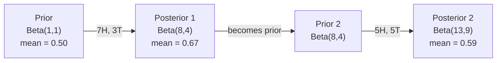

# Twierdzenie Bayesa

> Prawdopodobieństwo dotyczy tego, czego się spodziewasz. Twierdzenie Bayesa dotyczy tego, czego się uczysz.

**Typ:** Kompilacja
**Język:** Python
**Wymagania wstępne:** Faza 1, lekcja 06 (podstawy prawdopodobieństwa)
**Czas:** ~75 minut

## Cele nauczania

- Zastosować twierdzenie Bayesa do obliczenia prawdopodobieństw późniejszych na podstawie wcześniejszych, prawdopodobieństw i dowodów
- Zbuduj od podstaw naiwny klasyfikator tekstu Bayesa za pomocą wygładzania Laplace'a i obliczeń logarytmicznych
- Porównaj estymację MLE i MAP i wyjaśnij, w jaki sposób MAP odpowiada regularyzacji L2
- Wdrożenie sekwencyjnej aktualizacji bayesowskiej przy użyciu koniugatów beta-dwumianowych do testów A/B

## Problem

Test medyczny jest dokładny w 99%. Test pozytywny. Jakie jest ryzyko, że rzeczywiście jesteś chory?

Większość ludzi twierdzi, że 99%. Prawdziwa odpowiedź zależy od tego, jak rzadka jest choroba. Jeżeli występuje u 1 na 10 000 osób, wynik pozytywny daje jedynie około 1% szans na zachorowanie. Pozostałe 99% pozytywnych wyników to fałszywe alarmy pochodzące od zdrowych osób.

To nie jest podchwytliwe pytanie. Jest to twierdzenie Bayesa. Każdy filtr spamu, każda diagnostyka medyczna, każdy model uczenia maszynowego, który określa ilościowo niepewność, wykorzystuje dokładnie to rozumowanie. Zaczynasz od wiary. Widzisz dowody. Aktualizujesz.

Jeśli zbudujesz systemy uczenia maszynowego bez zrozumienia tego, błędnie zinterpretujesz wyniki modelu, ustawisz złe progi i dostarczysz zbyt pewne przewidywania.

## Koncepcja

### Od wspólnego prawdopodobieństwa do Bayesa

Z lekcji 06 wiesz już, że prawdopodobieństwo warunkowe wynosi:

```
P(A|B) = P(A and B) / P(B)
```

I symetrycznie:

```
P(B|A) = P(A and B) / P(A)
```

Obydwa wyrażenia mają ten sam licznik: P(A i B). Ustaw je na równe i zmień kolejność:

```
P(A and B) = P(A|B) * P(B) = P(B|A) * P(A)

Therefore:

P(A|B) = P(B|A) * P(A) / P(B)
```

To jest twierdzenie Bayesa. Cztery wielkości, jedno równanie.

### Cztery części

| Część | Imię | Co to znaczy |
|------|------|----------------------------|
| P(A\|B) | Tylny | Twoje zaktualizowane przekonanie na temat A po zobaczeniu dowodu B |
| P(B\|A) | Prawdopodobieństwo | Jak prawdopodobny jest dowód B, jeśli A jest prawdziwy |
| P(A) | Wcześniej | Twoja wiara na temat A przed zobaczeniem jakichkolwiek dowodów |
| P(B) | Dowód | Całkowite prawdopodobieństwo zobaczenia B przy wszystkich możliwościach |

Termin dowodowy P(B) działa jak normalizator. Można to rozwinąć, korzystając z prawa całkowitego prawdopodobieństwa:

```
P(B) = P(B|A) * P(A) + P(B|not A) * P(not A)
```

### Przykład testu medycznego

Choroba dotyka 1 na 10 000 osób. Test jest dokładny w 99% (wykrywa 99% chorych, w 1% przypadków daje wyniki fałszywie dodatnie).

```
P(sick)          = 0.0001     (prior: disease is rare)
P(positive|sick) = 0.99       (likelihood: test catches it)
P(positive|healthy) = 0.01    (false positive rate)

P(positive) = P(positive|sick) * P(sick) + P(positive|healthy) * P(healthy)
            = 0.99 * 0.0001 + 0.01 * 0.9999
            = 0.000099 + 0.009999
            = 0.010098

P(sick|positive) = P(positive|sick) * P(sick) / P(positive)
                 = 0.99 * 0.0001 / 0.010098
                 = 0.0098
                 = 0.98%
```

Mniej niż 1%. Dominuje to, co wcześniejsze. Gdy schorzenie jest rzadkie, nawet dokładne testy dają przeważnie fałszywe wyniki pozytywne. Dlatego lekarze zlecają badania potwierdzające.

### Przykład filtra spamu

Otrzymasz wiadomość e-mail zawierającą słowo „loteria”. Czy to spam?

```
P(spam)                = 0.3      (30% of email is spam)
P("lottery"|spam)      = 0.05     (5% of spam emails contain "lottery")
P("lottery"|not spam)  = 0.001    (0.1% of legitimate emails contain "lottery")

P("lottery") = 0.05 * 0.3 + 0.001 * 0.7
             = 0.015 + 0.0007
             = 0.0157

P(spam|"lottery") = 0.05 * 0.3 / 0.0157
                  = 0.955
                  = 95.5%
```

Jedno słowo przesuwa prawdopodobieństwo z 30% na 95,5%. Prawdziwy filtr antyspamowy stosuje Bayesa do setek słów jednocześnie.

### Naiwny Bayes: założenie niezależności

Naive Bayes rozszerza to na wiele funkcji, zakładając, że wszystkie funkcje są warunkowo niezależne, biorąc pod uwagę klasę:

```
P(class | feature_1, feature_2, ..., feature_n)
  = P(class) * P(feature_1|class) * P(feature_2|class) * ... * P(feature_n|class)
    / P(feature_1, feature_2, ..., feature_n)
```

Częścią „naiwną” jest założenie niezależności. W tekście wystąpienia słów nie są niezależne („Nowy” i „York” są skorelowane). Jednak założenie to sprawdza się zaskakująco dobrze w praktyce, ponieważ klasyfikator musi jedynie uszeregować klasy, a nie generować skalibrowane prawdopodobieństwa.

Ponieważ mianownik jest taki sam dla wszystkich klas, możesz go pominąć i po prostu porównać liczniki:

```
score(class) = P(class) * product of P(feature_i | class)
```

Wybierz klasę z najwyższym wynikiem.

### Oszacowanie maksymalnej wiarygodności (MLE)

Jak uzyskać P (cechę | klasę) z danych treningowych? Liczyć.

```
P("free"|spam) = (number of spam emails containing "free") / (total spam emails)
```

To jest MLE: wybierz wartości parametrów, które sprawiają, że zaobserwowane dane są najbardziej prawdopodobne. Maksymalizujesz funkcję wiarygodności, która w przypadku zliczeń dyskretnych sprowadza się do częstotliwości względnej.

Problem: jeśli słowo nigdy nie pojawia się w spamie podczas uczenia, MLE przyznaje mu prawdopodobieństwo zerowe. Jedno niewidziane słowo zabija cały produkt. Napraw to za pomocą wygładzania Laplace'a:

```
P(word|class) = (count(word, class) + 1) / (total_words_in_class + vocabulary_size)
```

Dodanie 1 do każdego wyniku gwarantuje, że prawdopodobieństwo nigdy nie będzie wynosić zero.

### Maksymalnie a posteriori (MAPA)

MLE pyta: jakie parametry maksymalizują P(dane|parametry)?

MAP pyta: jakie parametry maksymalizują P(parametry|dane)?

Według twierdzenia Bayesa:

```
P(parameters|data) proportional to P(data|parameters) * P(parameters)
```

MAP dodaje poprzednik do samych parametrów. Jeśli uważasz, że parametry powinny być małe, kodujesz to jako priorytet, który karze duże wartości. Jest to identyczne z regularyzacją L2 w ML. Kara za „grzbiet” w regresji grzbietu jest dosłownie przesunięciem Gaussa na obciążniki.

| Oszacowanie | Optymalizuje | Odpowiednik ML |
|------------|---------------|-------------|
| MLE | P(dane\|parametry) | Nieuregulowane szkolenia |
| MAPA | P(dane\|parametry) * P(parametry) | Regularyzacja L2/L1 |

### Bayesowski a częstość występowania: praktyczna różnica

Częstości traktują parametry jako stałe niewiadome. Pytają: „Co by się stało, gdybym powtórzył ten eksperyment wiele razy?”

Bayesowie traktują parametry jako rozkłady. Pytają: „Biorąc pod uwagę to, co zaobserwowałem, co sądzę o parametrach?”

Praktyczna różnica w przypadku budowania systemów ML:

| Aspekt | Częstotliwy | Bayesa |
|------------|------------|---------|
| Wyjście | Oszacowanie punktowe | Rozkład na wartości |
| Niepewność | Przedziały ufności (o procedurze) | Wiarygodne przedziały (o parametrze) |
| Małe dane | Może przesadzić | Prior działa jako regularyzacja |
| Obliczenia | Zwykle szybciej | Często wymaga pobierania próbek (MCMC) |

Większość produkcji ML ma charakter częsty (SGD, szacunki punktowe). Metody Bayesa sprawdzają się wtedy, gdy potrzebna jest skalibrowana niepewność (decyzje medyczne, systemy krytyczne dla bezpieczeństwa) lub gdy brakuje danych (uczenie się kilkoma strzałami, zimny start).

### Dlaczego myślenie bayesowskie ma znaczenie dla ML

Związek jest głębszy niż analogia:

**Apriory to regularyzacja.** Priorytet Gaussa na wagach to regularyzacja L2. Przeor Laplace'a to L1. Za każdym razem, gdy dodajesz termin regularyzacyjny, tworzysz stwierdzenie bayesowskie dotyczące oczekiwanych wartości parametrów.

**Wartości późniejsze oznaczają niepewność.** Pojedyncze przewidywane prawdopodobieństwo nie mówi nic o tym, jak pewny jest model w odniesieniu do tego oszacowania. Metody Bayesa dają rozkład: „Myślę, że P (spam) mieści się w przedziale od 0,8 do 0,95”.

**Aktualizacje Bayesa to nauka online.** Dzisiejsze tylne stają się jutrzejszymi. Kiedy Twój model widzi nowe dane, stopniowo aktualizuje swoje przekonania, zamiast uczyć się od zera.

**Porównanie modeli jest metodą bayesowską.** Bayesowskie kryterium informacyjne (BIC), marginalne prawdopodobieństwo i czynniki Bayesa wykorzystują rozumowanie bayesowskie do wyboru pomiędzy modelami bez nadmiernego dopasowania.

## Zbuduj to

### Krok 1: Funkcja twierdzenia Bayesa

```python
def bayes(prior, likelihood, false_positive_rate):
    evidence = likelihood * prior + false_positive_rate * (1 - prior)
    posterior = likelihood * prior / evidence
    return posterior

result = bayes(prior=0.0001, likelihood=0.99, false_positive_rate=0.01)
print(f"P(sick|positive) = {result:.4f}")
```

### Krok 2: Naiwny klasyfikator Bayesa

```python
import math
from collections import defaultdict

class NaiveBayes:
    def __init__(self, smoothing=1.0):
        self.smoothing = smoothing
        self.class_counts = defaultdict(int)
        self.word_counts = defaultdict(lambda: defaultdict(int))
        self.class_word_totals = defaultdict(int)
        self.vocab = set()

    def train(self, documents, labels):
        for doc, label in zip(documents, labels):
            self.class_counts[label] += 1
            words = doc.lower().split()
            for word in words:
                self.word_counts[label][word] += 1
                self.class_word_totals[label] += 1
                self.vocab.add(word)

    def predict(self, document):
        words = document.lower().split()
        total_docs = sum(self.class_counts.values())
        vocab_size = len(self.vocab)
        best_class = None
        best_score = float("-inf")
        for cls in self.class_counts:
            score = math.log(self.class_counts[cls] / total_docs)
            for word in words:
                count = self.word_counts[cls].get(word, 0)
                total = self.class_word_totals[cls]
                score += math.log((count + self.smoothing) / (total + self.smoothing * vocab_size))
            if score > best_score:
                best_score = score
                best_class = cls
        return best_class
```

Prawdopodobieństwa dziennika zapobiegają niedopełnieniu. Mnożenie wielu małych prawdopodobieństw daje liczby zbyt małe dla zmiennoprzecinkowych. Sumowanie logarytmów prawdopodobieństw jest numerycznie stabilne i matematycznie równoważne.

### Krok 3: Trenuj na danych będących spamem

```python
train_docs = [
    "win free money now",
    "free lottery ticket winner",
    "claim your prize today free",
    "urgent offer free cash",
    "congratulations you won free",
    "meeting tomorrow at noon",
    "project update attached",
    "can we schedule a call",
    "quarterly report review",
    "lunch on thursday sounds good",
    "team standup notes attached",
    "please review the pull request",
]

train_labels = [
    "spam", "spam", "spam", "spam", "spam",
    "ham", "ham", "ham", "ham", "ham", "ham", "ham",
]

classifier = NaiveBayes()
classifier.train(train_docs, train_labels)

test_messages = [
    "free money waiting for you",
    "meeting rescheduled to friday",
    "you won a free prize",
    "please review the attached report",
]

for msg in test_messages:
    print(f"  '{msg}' -> {classifier.predict(msg)}")
```

### Krok 4: Sprawdź poznane prawdopodobieństwa

```python
def show_top_words(classifier, cls, n=5):
    vocab_size = len(classifier.vocab)
    total = classifier.class_word_totals[cls]
    probs = {}
    for word in classifier.vocab:
        count = classifier.word_counts[cls].get(word, 0)
        probs[word] = (count + classifier.smoothing) / (total + classifier.smoothing * vocab_size)
    sorted_words = sorted(probs.items(), key=lambda x: x[1], reverse=True)
    for word, prob in sorted_words[:n]:
        print(f"    {word}: {prob:.4f}")

print("\nTop spam words:")
show_top_words(classifier, "spam")
print("\nTop ham words:")
show_top_words(classifier, "ham")
```

## Użyj tego

Scikit-learn dostarcza gotowe do produkcji, naiwne implementacje Bayesa:

```python
from sklearn.feature_extraction.text import CountVectorizer
from sklearn.naive_bayes import MultinomialNB
from sklearn.metrics import classification_report

vectorizer = CountVectorizer()
X_train = vectorizer.fit_transform(train_docs)
clf = MultinomialNB()
clf.fit(X_train, train_labels)

X_test = vectorizer.transform(test_messages)
predictions = clf.predict(X_test)
for msg, pred in zip(test_messages, predictions):
    print(f"  '{msg}' -> {pred}")
```

Ten sam algorytm. CountVectorizer obsługuje tokenizację i budowanie słownictwa. MultinomialNB obsługuje wewnętrznie wygładzanie i logowanie prawdopodobieństw. Twoja wersja od zera robi to samo w 40 liniach.

## Wyślij to

Zbudowana tutaj klasa NaiveBayes demonstruje pełny potok: tokenizację, estymację prawdopodobieństwa za pomocą wygładzania Laplace'a, przewidywanie przestrzeni logarytmicznej. Kod w `code/bayes.py` działa kompleksowo, bez żadnych zależności poza standardową biblioteką Pythona.

### Koniuguj priorytety

Kiedy rozkład poprzedzający i późniejszy należą do tej samej rodziny rozkładów, rozkład poprzedzający nazywany jest „koniugatem”. To sprawia, że ​​aktualizacja Bayesa jest algebraicznie czysta — otrzymujesz wersję zamkniętą bez całkowania numerycznego.

| Prawdopodobieństwo | Koniugat przed | Tylny | Przykład |
|----------|----------------|------|---------|
| Bernoulliego | Beta(a, b) | Beta(a + sukcesy, b + porażki) | Oszacowanie błędu rzutu monetą |
| Normalny (znana wariancja) | Normalny(mu_0, sigma_0) | Normalny(średnia ważona, mniejsza wariancja) | Kalibracja czujnika |
| Poissona | Gamma(a, b) | Gamma(a + suma zliczeń, b + n) | Modelowanie wskaźników przyjazdów |
| Wielomian | Dirichlet(alfa) | Dirichlet(alfa + zlicza) | Modelowanie tematyczne, modele językowe |

Dlaczego to ma znaczenie: bez sprzężonych priorytetów potrzebne jest próbkowanie Monte Carlo lub wnioskowanie wariacyjne, aby przybliżyć tył. W przypadku priorytetów sprzężonych wystarczy zaktualizować dwie liczby.

Rozkład Beta jest najczęstszym koniugatem w praktyce. Beta(a, b) reprezentuje Twoje przekonanie na temat parametru prawdopodobieństwa. Średnia to a/(a+b). Im większe a+b, tym bardziej skoncentrowany (pewny) rozkład.

Specjalne przypadki wersji beta:
- Beta(1, 1) = jednolite. Nie masz zdania na temat parametru.
- Beta(10, 10) = szczyt przy 0,5. Mocno wierzysz, że parametr jest bliski 0,5.
- Beta(1, 10) = przesunięty w stronę 0. Uważasz, że parametr jest mały.

Reguła aktualizacji jest niezwykle prosta:

```
Prior:     Beta(a, b)
Data:      s successes, f failures
Posterior: Beta(a + s, b + f)
```

Żadnych całek. Brak pobierania próbek. Tylko dodatek.

### Sekwencyjna aktualizacja Bayesa

Wnioskowanie bayesowskie jest w sposób naturalny sekwencyjne. Dzisiejsza tylna część jutro staje się wcześniejsza. W ten sposób rzeczywiste systemy uczą się przyrostowo, bez ponownego przetwarzania wszystkich danych historycznych.

Konkretny przykład: oszacowanie, czy moneta jest uczciwa.

**Dzień 1: brak jeszcze danych.**
Zacznij od Beta(1, 1) – jednolitego wcześniej. Nie masz zdania.
- Wcześniejsza średnia: 0,5
- Prior jest płaski w poprzek [0, 1]

**Dzień 2: Obserwuj 7 głów i 3 reszki.**
Tylny = Beta (1 + 7, 1 + 3) = Beta (8, 4)
- Średnia późniejsza: 8/12 = 0,667
- Dowody wskazują, że moneta jest skierowana w stronę reszki

**Dzień 3: obserwuj 5 kolejnych głów i 5 kolejnych reszek.**
Użyj wczorajszego odcinka tylnego jako dzisiejszego wcześniejszego.
Tylny = Beta (8 + 5, 4 + 5) = Beta (13, 9)
- Średnia późniejsza: 13/22 = 0,591
- Nowe, zrównoważone dane cofnęły szacunek w stronę 0,5



Kolejność obserwacji nie ma znaczenia. Beta(1,1) zaktualizowana ze wszystkimi 12 orłami i 8 reszkami na raz daje Beta(13, 9) - ten sam wynik. Aktualizacja sekwencyjna i aktualizacja wsadowa są matematycznie równoważne. Jednak aktualizacja sekwencyjna umożliwia podejmowanie decyzji na każdym etapie bez przechowywania surowych danych.

Jest to podstawa nauki online w produkcyjnych systemach ML. Próbkowanie Thompsona dla bandytów, przyrostowe systemy rekomendacji i detektory anomalii strumieniowych wykorzystują ten wzorzec.

### Połączenie z testami A/B

Testowanie A/B to ukryte wnioskowanie bayesowskie.

Konfiguracja: testujesz dwa kolory przycisków. Wariant A (niebieski) i wariant B (zielony). Chcesz wiedzieć, który z nich uzyskuje więcej kliknięć.

Bayesowski test A/B:

1. **Poprzedni.** Zacznij od Beta(1, 1) dla obu wariantów. Brak wcześniejszych preferencji.
2. **Dane.** Wariant A: 50 kliknięć na 1000 wyświetleń. Wariant B: 65 kliknięć na 1000 wyświetleń.
3. **Tylko.**
   - A: Beta(1 + 50, 1 + 950) = Beta(51, 951). Średnia = 0,051
   - B: Beta(1 + 65, 1 + 935) = Beta(66, 936). Średnia = 0,066
4. **Decyzja.** Oblicz P(B > A) – prawdopodobieństwo, że prawdziwy współczynnik konwersji B jest wyższy niż A.

Obliczenie P(B > A) analitycznie jest trudne. Ale Monte Carlo sprawia, że ​​jest to trywialne:

```
1. Draw 100,000 samples from Beta(51, 951)  -> samples_A
2. Draw 100,000 samples from Beta(66, 936)  -> samples_B
3. P(B > A) = fraction of samples where B > A
```

Jeśli P(B > A) > 0,95, wysyłasz wariant B. Jeśli mieści się w przedziale od 0,05 do 0,95, kontynuujesz zbieranie danych. Jeśli P(B > A) < 0,05, wysyłasz wariant A.

Zalety w porównaniu z częstymi testami A/B:
- Otrzymujesz bezpośrednie zestawienie prawdopodobieństwa: „istnieje 97% szans, że B jest lepszy”
- Żadnych pomyłek co do wartości p. Brak zabezpieczenia typu „nie odrzucę hipotezy zerowej”.
- Możesz sprawdzić wyniki w dowolnym momencie bez zawyżania fałszywych wyników pozytywnych (nie ma problemu z podglądaniem)
- Możesz uwzględnić wcześniejszą wiedzę (np. poprzednie testy sugerują, że współczynniki konwersji wynoszą zwykle 3-8%)

| Aspekt | Często występujący A/B | Bayesowski A/B |
|------------|----------------|----------------------------|
| Wyjście | wartość p | P(B > A) |
| Interpretacja | „Jak zaskakujące są te dane, jeśli A=B?” | „Jak prawdopodobne jest, że B będzie lepsze od A?” |
| Wczesne zatrzymanie | Nadmuchuje fałszywe alarmy | Bezpieczny w każdym momencie (biorąc pod uwagę dobrze wybrany wcześniej i prawidłowo określony model) |
| Wcześniejsza wiedza | Nieużywane | Zakodowane jako wersja beta |
| Zasada decyzji | p < 0,05 | P(B > A) > próg |

## Ćwiczenia

1. **Testy wielokrotne.** Niezależny test pacjenta dwukrotnie daje wynik pozytywny (oba z 99% dokładnością, częstość występowania choroby 1 na 10 000). Co to jest P(chory) po obu testach? Użyj tylnej części pierwszego testu jako wcześniejszej w drugim.

2. **Wpływ wygładzania.** Uruchom klasyfikator spamu z wartościami wygładzania 0,01, 0,1, 1,0 i 10,0. Jak zmienia się prawdopodobieństwo najwyższych słów? Co się dzieje z smoothing=0 i słowem, które pojawia się tylko w szynce?

3. **Dodaj funkcje.** Rozszerz klasę NaiveBayes, aby oprócz liczby słów używać także długości wiadomości (krótka/długa). Oszacuj P(short|spam) i P(short|ham) na podstawie danych szkoleniowych i włóż je do wyniku przewidywania.

4. **MAP ręcznie.** Biorąc pod uwagę zaobserwowane dane (7 orłów w 10 rzutach monetą), oblicz oszacowanie błędu systematycznego MAP, korzystając z metody Beta(2,2). Porównaj to z szacunkami MLE (7/10).

## Kluczowe terminy

| Termin | Co ludzie mówią | Co to właściwie oznacza |
|------|----------------|----------------------|
| Wcześniej | „Moje wstępne przypuszczenie” | P (hipoteza) przed obserwacją dowodów. W ML: termin regularyzacyjny. |
| Prawdopodobieństwo | „Jak dobrze pasują dane” | P(dowód\|hipoteza). Jak prawdopodobne są zaobserwowane dane przy określonej hipotezie. |
| Tylny | „Moje zaktualizowane przekonanie” | P(hipoteza\|dowód). Wcześniejsze pomnożono przez prawdopodobieństwo, a następnie znormalizowano. |
| Dowód | „Stała normalizująca” | P(dane) dla wszystkich hipotez. Zapewnia późniejsze sumy do 1. |
| Naiwny Bayes | „Ten prosty klasyfikator tekstu” | Klasyfikator zakładający, że cechy są niezależne od danej klasy. Działa dobrze pomimo fałszywych założeń. |
| Wygładzanie Laplace'a | „Dodaj jedno wygładzanie” | Dodanie małej liczby do każdej funkcji, aby zapobiec zerowemu prawdopodobieństwu z niewidocznych danych. |
| MLE | „Wystarczy użyć częstotliwości” | Wybierz parametry, które maksymalizują P(dane\|parametry). Żadnego wcześniejszego. Może przesadzić z małymi danymi. |
| MAPA | „MLE z przeorem” | Wybierz parametry, które maksymalizują P(dane\|parametry) * P(parametry). Odpowiednik uregulowanego MLE. |
| Log-prawdopodobieństwo | „Praca w przestrzeni dziennika” | Używanie log(P) zamiast P, aby uniknąć niedomiaru zmiennoprzecinkowego podczas mnożenia wielu małych liczb. |
| Fałszywie dodatni | „Niewłaściwy alarm” | Test mówi pozytywnie, ale prawdziwy stan jest negatywny. Napędza błąd stopy bazowej. |

## Dalsze czytanie

- [3Blue1Brown: Twierdzenie Bayesa](https://www.youtube.com/watch?v=HZGCoVF3YvM) - wizualne wyjaśnienie na przykładzie testu medycznego
- [Stanford CS229: Algorytmy uczenia się generatywnego](https://cs229.stanford.edu/notes2022fall/cs229-notes2.pdf) - naiwny Bayes i jego powiązanie z modelami dyskryminacyjnymi
- [Think Bayes](https://greenteapress.com/wp/think-bayes/) - darmowa książka, statystyki Bayesa z kodem Pythona
- [scikit-learn Naive Bayes](https://scikit-learn.org/stable/modules/naive_bayes.html) - implementacje produkcyjne i kiedy używać każdego wariantu