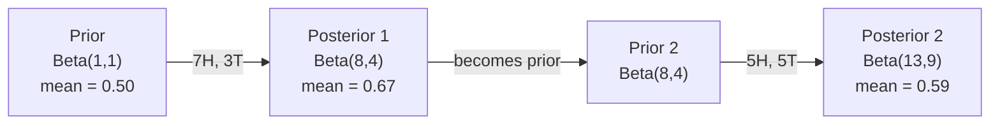

# Twierdzenie Bayesa

> Prawdopodobieństwo dotyczy tego, czego oczekujesz. Twierdzenie Bayesa dotyczy tego, czego się uczysz.

**Typ:** Build
**Język:** Python
**Wymagania wstępne:** Faza 1, Lekcja 06 (Podstawy prawdopodobieństwa)
**Czas:** ~75 minut

## Cele nauki

- Zastosowanie twierdzenia Bayesa do obliczania prawdopodobieństw a posteriori na podstawie prior, likelihood i evidence
- Zbudowanie od podstaw klasyfikatora tekstu Naive Bayes ze wygładzaniem Laplace'a i obliczeniami w przestrzeni logarytmicznej
- Porównanie estymacji MLE i MAP oraz wyjaśnienie, jak MAP odpowiada regularyzacji L2
- Implementacja sekwencyjnej aktualizacji bayesowskiej z wykorzystaniem sprzężonych priorów Beta-Binomial dla testów A/B

## Problem

Test medyczny ma 99% dokładności. Wynik jest pozytywny. Jakie jest prawdopodobieństwo, że faktycznie jesteś chory?

Większość ludzi powie 99%. Prawdziwa odpowiedź zależy od tego, jak rzadka jest choroba. Jeśli choruje 1 osoba na 10 000, pozytywny wynik daje tylko około 1% szans na to, że jesteś chory. Pozostałe 99% pozytywnych wyników to fałszywe alarmy u zdrowych osób.

To nie jest pytanie podchwytliwe. To twierdzenie Bayesa. Każdy filtr antyspamowy, każda diagnostyka medyczna, każdy model uczenia maszynowego, który kwantyfikuje niepewność, wykorzystuje dokładnie to samo rozumowanie. Zaczynasz z pewnym przekonaniem. Widzisz dowód. Aktualizujesz przekonanie.

Jeśli budujesz systemy ML bez zrozumienia tego mechanizmu, będziesz błędnie interpretować wyniki modeli, ustawiać złe progi i wypuszczać przesadnie pewne siebie predykcje.

## Koncepcja

### Od prawdopodobieństwa łącznego do twierdzenia Bayesa

Z Lekcji 06 wiesz już, że prawdopodobieństwo warunkowe wyraża się jako:

```
P(A|B) = P(A and B) / P(B)
```

I symetrycznie:

```
P(B|A) = P(A and B) / P(A)
```

Oba wyrażenia mają ten sam licznik: P(A and B). Przyrównaj je i przekształć:

```
P(A and B) = P(A|B) * P(B) = P(B|A) * P(A)

Therefore:

P(A|B) = P(B|A) * P(A) / P(B)
```

To jest twierdzenie Bayesa. Cztery wielkości, jedno równanie.

### Cztery elementy

| Część | Nazwa | Co oznacza |
|------|------|---------------|
| P(A\|B) | Posterior (a posteriori) | Twoje zaktualizowane przekonanie o A po zaobserwowaniu dowodu B |
| P(B\|A) | Likelihood (wiarygodność) | Jak prawdopodobny jest dowód B, jeśli A jest prawdziwe |
| P(A) | Prior (a priori) | Twoje przekonanie o A przed zaobserwowaniem jakiegokolwiek dowodu |
| P(B) | Evidence (dowód) | Całkowite prawdopodobieństwo zaobserwowania B przy wszystkich możliwościach |

Wyraz evidence P(B) działa jako normalizator. Możesz go rozwinąć, korzystając z prawa całkowitego prawdopodobieństwa:

```
P(B) = P(B|A) * P(A) + P(B|not A) * P(not A)
```

### Przykład testu medycznego

Choroba dotyka 1 osobę na 10 000. Test ma 99% dokładności (wykrywa 99% chorych osób, daje fałszywe pozytywy w 1% przypadków).

```
P(sick)          = 0.0001     (prior: disease is rare)
P(positive|sick) = 0.99       (likelihood: test catches it)
P(positive|healthy) = 0.01    (false positive rate)

P(positive) = P(positive|sick) * P(sick) + P(positive|healthy) * P(healthy)
            = 0.99 * 0.0001 + 0.01 * 0.9999
            = 0.000099 + 0.009999
            = 0.010098

P(sick|positive) = P(positive|sick) * P(sick) / P(positive)
                 = 0.99 * 0.0001 / 0.010098
                 = 0.0098
                 = 0.98%
```

Mniej niż 1%. Prior dominuje. Gdy stan jest rzadki, nawet dokładne testy generują głównie fałszywe pozytywy. Dlatego lekarze zlecają testy potwierdzające.

### Przykład filtra antyspamowego

Otrzymujesz e-mail zawierający słowo "lottery" (loteria). Czy to spam?

```
P(spam)                = 0.3      (30% of email is spam)
P("lottery"|spam)      = 0.05     (5% of spam emails contain "lottery")
P("lottery"|not spam)  = 0.001    (0.1% of legitimate emails contain "lottery")

P("lottery") = 0.05 * 0.3 + 0.001 * 0.7
             = 0.015 + 0.0007
             = 0.0157

P(spam|"lottery") = 0.05 * 0.3 / 0.0157
                  = 0.955
                  = 95.5%
```

Jedno słowo zmienia prawdopodobieństwo z 30% na 95,5%. Prawdziwy filtr antyspamowy stosuje twierdzenie Bayesa jednocześnie do setek słów.

### Naive Bayes: założenie niezależności

Naive Bayes rozszerza to podejście na wiele cech, zakładając, że wszystkie cechy są warunkowo niezależne dla danej klasy:

```
P(class | feature_1, feature_2, ..., feature_n)
  = P(class) * P(feature_1|class) * P(feature_2|class) * ... * P(feature_n|class)
    / P(feature_1, feature_2, ..., feature_n)
```

"Naiwna" część to właśnie założenie niezależności. W tekście wystąpienia słów nie są niezależne ("New" i "York" są skorelowane). Mimo to założenie sprawdza się w praktyce zaskakująco dobrze, ponieważ klasyfikator musi tylko uszeregować klasy, a nie produkować skalibrowanych prawdopodobieństw.

Ponieważ mianownik jest taki sam dla wszystkich klas, można go pominąć i porównywać same liczniki:

```
score(class) = P(class) * product of P(feature_i | class)
```

Wybierz klasę o najwyższym wyniku.

### Estymacja maksymalnej wiarygodności (MLE)

Skąd wziąć P(feature|class) z danych treningowych? Zliczając.

```
P("free"|spam) = (number of spam emails containing "free") / (total spam emails)
```

To jest MLE: wybierasz takie wartości parametrów, które czynią zaobserwowane dane najbardziej prawdopodobnymi. Maksymalizujesz funkcję wiarygodności (likelihood), która dla zliczeń dyskretnych sprowadza się do częstości względnej.

Problem: jeśli słowo nigdy nie pojawia się w spamie podczas treningu, MLE nadaje mu prawdopodobieństwo zero. Jedno niewidziane słowo zeruje cały iloczyn. Naprawia to wygładzanie Laplace'a:

```
P(word|class) = (count(word, class) + 1) / (total_words_in_class + vocabulary_size)
```

Dodanie 1 do każdego zliczenia gwarantuje, że żadne prawdopodobieństwo nigdy nie wynosi zero.

### Maksimum a posteriori (MAP)

MLE pyta: jakie parametry maksymalizują P(data|parameters)?

MAP pyta: jakie parametry maksymalizują P(parameters|data)?

Z twierdzenia Bayesa:

```
P(parameters|data) proportional to P(data|parameters) * P(parameters)
```

MAP dodaje prior na sam wektor parametrów. Jeśli wierzysz, że parametry powinny być małe, kodujesz to jako prior, który karze duże wartości. Jest to identyczne z regularyzacją L2 w ML. Kara "ridge" w regresji grzbietowej (ridge regression) jest dosłownie priorem gaussowskim na wagi.

| Estymacja | Optymalizuje | Odpowiednik w ML |
|------------|-----------|---------------|
| MLE | P(data\|params) | Trening bez regularyzacji |
| MAP | P(data\|params) * P(params) | Regularyzacja L2 / L1 |

### Bayesowskie kontra frekwencyjne (frequentist): praktyczna różnica

Podejście frekwencyjne traktuje parametry jako stałe, nieznane wartości. Pyta: "Gdybym powtórzył ten eksperyment wiele razy, co by się stało?"

Podejście bayesowskie traktuje parametry jako rozkłady. Pyta: "Biorąc pod uwagę to, co zaobserwowałem, w co wierzę na temat parametrów?"

Praktyczna różnica przy budowaniu systemów ML:

| Aspekt | Frekwencyjne (frequentist) | Bayesowskie |
|--------|-------------|----------|
| Wynik | Estymata punktowa | Rozkład wartości |
| Niepewność | Przedziały ufności (dotyczące procedury) | Przedziały wiarygodności (dotyczące parametru) |
| Mała ilość danych | Może prowadzić do przeuczenia | Prior działa jako regularyzacja |
| Obliczenia | Zwykle szybsze | Często wymagają próbkowania (MCMC) |

Większość produkcyjnego ML jest frekwencyjna (SGD, estymaty punktowe). Metody bayesowskie błyszczą tam, gdzie potrzebna jest skalibrowana niepewność (decyzje medyczne, systemy krytyczne dla bezpieczeństwa) lub gdy danych jest mało (uczenie z kilku przykładów - few-shot learning, cold start).

### Dlaczego myślenie bayesowskie ma znaczenie dla ML

Związek jest głębszy niż zwykła analogia:

**Priory to regularyzacja.** Prior gaussowski na wagach to regularyzacja L2. Prior Laplace'a to L1. Za każdym razem, gdy dodajesz człon regularyzacyjny, formułujesz bayesowskie stwierdzenie o tym, jakich wartości parametrów się spodziewasz.

**Posteriory to niepewność.** Pojedyncze przewidywane prawdopodobieństwo nic nie mówi o tym, jak bardzo model jest pewny tej estymaty. Metody bayesowskie dają rozkład: "Sądzę, że P(spam) mieści się między 0,8 a 0,95."

**Aktualizacje bayesowskie to uczenie online.** Dzisiejszy posterior staje się jutrzejszym priorem. Gdy model widzi nowe dane, aktualizuje swoje przekonania przyrostowo, zamiast trenować od zera.

**Porównanie modeli jest bayesowskie.** Bayesowskie kryterium informacyjne (BIC), wiarygodność brzegowa (marginal likelihood) i czynniki Bayesa (Bayes factors) - wszystkie wykorzystują rozumowanie bayesowskie do wyboru między modelami bez przeuczenia.

## Zbuduj to

### Krok 1: Funkcja twierdzenia Bayesa

```python
def bayes(prior, likelihood, false_positive_rate):
    evidence = likelihood * prior + false_positive_rate * (1 - prior)
    posterior = likelihood * prior / evidence
    return posterior

result = bayes(prior=0.0001, likelihood=0.99, false_positive_rate=0.01)
print(f"P(sick|positive) = {result:.4f}")
```

### Krok 2: Klasyfikator Naive Bayes

```python
import math
from collections import defaultdict

class NaiveBayes:
    def __init__(self, smoothing=1.0):
        self.smoothing = smoothing
        self.class_counts = defaultdict(int)
        self.word_counts = defaultdict(lambda: defaultdict(int))
        self.class_word_totals = defaultdict(int)
        self.vocab = set()

    def train(self, documents, labels):
        for doc, label in zip(documents, labels):
            self.class_counts[label] += 1
            words = doc.lower().split()
            for word in words:
                self.word_counts[label][word] += 1
                self.class_word_totals[label] += 1
                self.vocab.add(word)

    def predict(self, document):
        words = document.lower().split()
        total_docs = sum(self.class_counts.values())
        vocab_size = len(self.vocab)
        best_class = None
        best_score = float("-inf")
        for cls in self.class_counts:
            score = math.log(self.class_counts[cls] / total_docs)
            for word in words:
                count = self.word_counts[cls].get(word, 0)
                total = self.class_word_totals[cls]
                score += math.log((count + self.smoothing) / (total + self.smoothing * vocab_size))
            if score > best_score:
                best_score = score
                best_class = cls
        return best_class
```

Logarytmy prawdopodobieństw zapobiegają niedomiarowi (underflow). Mnożenie wielu małych prawdopodobieństw daje liczby zbyt małe dla zmiennoprzecinkowej reprezentacji. Sumowanie log-prawdopodobieństw jest numerycznie stabilne i matematycznie równoważne.

### Krok 3: Trening na danych spamowych

```python
train_docs = [
    "win free money now",
    "free lottery ticket winner",
    "claim your prize today free",
    "urgent offer free cash",
    "congratulations you won free",
    "meeting tomorrow at noon",
    "project update attached",
    "can we schedule a call",
    "quarterly report review",
    "lunch on thursday sounds good",
    "team standup notes attached",
    "please review the pull request",
]

train_labels = [
    "spam", "spam", "spam", "spam", "spam",
    "ham", "ham", "ham", "ham", "ham", "ham", "ham",
]

classifier = NaiveBayes()
classifier.train(train_docs, train_labels)

test_messages = [
    "free money waiting for you",
    "meeting rescheduled to friday",
    "you won a free prize",
    "please review the attached report",
]

for msg in test_messages:
    print(f"  '{msg}' -> {classifier.predict(msg)}")
```

### Krok 4: Sprawdź wyuczone prawdopodobieństwa

```python
def show_top_words(classifier, cls, n=5):
    vocab_size = len(classifier.vocab)
    total = classifier.class_word_totals[cls]
    probs = {}
    for word in classifier.vocab:
        count = classifier.word_counts[cls].get(word, 0)
        probs[word] = (count + classifier.smoothing) / (total + classifier.smoothing * vocab_size)
    sorted_words = sorted(probs.items(), key=lambda x: x[1], reverse=True)
    for word, prob in sorted_words[:n]:
        print(f"    {word}: {prob:.4f}")

print("\nTop spam words:")
show_top_words(classifier, "spam")
print("\nTop ham words:")
show_top_words(classifier, "ham")
```

## Wykorzystaj to

Scikit-learn dostarcza gotowe do produkcji implementacje naive Bayes:

```python
from sklearn.feature_extraction.text import CountVectorizer
from sklearn.naive_bayes import MultinomialNB
from sklearn.metrics import classification_report

vectorizer = CountVectorizer()
X_train = vectorizer.fit_transform(train_docs)
clf = MultinomialNB()
clf.fit(X_train, train_labels)

X_test = vectorizer.transform(test_messages)
predictions = clf.predict(X_test)
for msg, pred in zip(test_messages, predictions):
    print(f"  '{msg}' -> {pred}")
```

Ten sam algorytm. CountVectorizer obsługuje tokenizację i budowę słownika. MultinomialNB obsługuje wewnętrznie wygładzanie i log-prawdopodobieństwa. Twoja wersja napisana od podstaw robi to samo w 40 liniach.

## Wypuść to

Klasa NaiveBayes zbudowana w tej lekcji demonstruje pełny pipeline: tokenizację, estymację prawdopodobieństw z wygładzaniem Laplace'a, predykcję w przestrzeni logarytmicznej. Kod w `code/bayes.py` działa od początku do końca bez żadnych zależności poza biblioteką standardową Pythona.

### Sprzężone priory (Conjugate Priors)

Gdy prior i posterior należą do tej samej rodziny rozkładów, prior nazywamy "sprzężonym" (conjugate). Dzięki temu aktualizacja bayesowska jest algebraicznie czysta -- otrzymujesz posterior w postaci zamkniętej, bez całkowania numerycznego.

| Likelihood | Prior sprzężony | Posterior | Przykład |
|-----------|----------------|-----------|---------|
| Bernoulli | Beta(a, b) | Beta(a + successes, b + failures) | Estymacja obciążenia monety |
| Normalny (znana wariancja) | Normal(mu_0, sigma_0) | Normal(weighted mean, smaller variance) | Kalibracja czujnika |
| Poissona | Gamma(a, b) | Gamma(a + sum of counts, b + n) | Modelowanie częstości zdarzeń |
| Wielomianowy (Multinomial) | Dirichlet(alpha) | Dirichlet(alpha + counts) | Modelowanie tematów, modele językowe |

Dlaczego to ważne: bez sprzężonych priorów potrzebujesz próbkowania Monte Carlo lub wnioskowania wariacyjnego, by aproksymować posterior. Ze sprzężonymi priorami wystarczy zaktualizować dwie liczby.

Rozkład Beta jest najczęściej spotykanym sprzężonym priorem w praktyce. Beta(a, b) reprezentuje twoje przekonanie o parametrze będącym prawdopodobieństwem. Wartość oczekiwana wynosi a/(a+b). Im większe a+b, tym bardziej skoncentrowany (pewny) jest rozkład.

Szczególne przypadki priora Beta:
- Beta(1, 1) = rozkład jednostajny. Nie masz żadnej opinii na temat parametru.
- Beta(10, 10) = szczyt w 0,5. Silnie wierzysz, że parametr jest bliski 0,5.
- Beta(1, 10) = przesunięty w stronę 0. Wierzysz, że parametr jest mały.

Reguła aktualizacji jest prosta jak budowa cepa:

```
Prior:     Beta(a, b)
Data:      s successes, f failures
Posterior: Beta(a + s, b + f)
```

Żadnych całek. Żadnego próbkowania. Tylko dodawanie.

### Sekwencyjna aktualizacja bayesowska

Wnioskowanie bayesowskie jest naturalnie sekwencyjne. Dzisiejszy posterior staje się jutrzejszym priorem. Tak właśnie prawdziwe systemy uczą się przyrostowo, bez ponownego przetwarzania całej historii danych.

Konkretny przykład: szacowanie, czy moneta jest uczciwa.

**Dzień 1: Brak danych.**
Zacznij od Beta(1, 1) -- rozkładu jednostajnego. Nie masz żadnej opinii.
- Średnia priora: 0,5
- Prior jest płaski na przedziale [0, 1]

**Dzień 2: Obserwujesz 7 orłów, 3 reszki.**
Posterior = Beta(1 + 7, 1 + 3) = Beta(8, 4)
- Średnia posteriora: 8/12 = 0,667
- Dowody sugerują, że moneta jest obciążona w stronę orła

**Dzień 3: Obserwujesz kolejne 5 orłów, 5 reszek.**
Wykorzystaj wczorajszy posterior jako dzisiejszy prior.
Posterior = Beta(8 + 5, 4 + 5) = Beta(13, 9)
- Średnia posteriora: 13/22 = 0,591
- Zbalansowane nowe dane przyciągnęły estymatę z powrotem w stronę 0,5



Kolejność obserwacji nie ma znaczenia. Beta(1,1) zaktualizowane od razu o wszystkie 12 orłów i 8 reszek daje Beta(13, 9) -- ten sam wynik. Aktualizacja sekwencyjna i wsadowa są matematycznie równoważne. Jednak aktualizacja sekwencyjna pozwala podejmować decyzje na każdym kroku bez przechowywania surowych danych.

To podstawa uczenia online w produkcyjnych systemach ML. Próbkowanie Thompsona dla bandytów (Thompson sampling for bandits), przyrostowe systemy rekomendacji oraz strumieniowe detektory anomalii -- wszystkie wykorzystują ten wzorzec.

### Związek z testami A/B

Test A/B to wnioskowanie bayesowskie w przebraniu.

Sytuacja: testujesz dwa kolory przycisku. Wariant A (niebieski) i wariant B (zielony). Chcesz wiedzieć, który generuje więcej kliknięć.

Bayesowski test A/B:

1. **Prior.** Zacznij od Beta(1, 1) dla obu wariantów. Brak preferencji a priori.
2. **Dane.** Wariant A: 50 kliknięć na 1000 wyświetleń. Wariant B: 65 kliknięć na 1000 wyświetleń.
3. **Posteriory.**
   - A: Beta(1 + 50, 1 + 950) = Beta(51, 951). Średnia = 0,051
   - B: Beta(1 + 65, 1 + 935) = Beta(66, 936). Średnia = 0,066
4. **Decyzja.** Oblicz P(B > A) -- prawdopodobieństwo, że rzeczywisty współczynnik konwersji B jest wyższy niż A.

Obliczenie P(B > A) analitycznie jest trudne. Ale Monte Carlo czyni to trywialnym:

```
1. Draw 100,000 samples from Beta(51, 951)  -> samples_A
2. Draw 100,000 samples from Beta(66, 936)  -> samples_B
3. P(B > A) = fraction of samples where B > A
```

Jeśli P(B > A) > 0,95, wdrażasz wariant B. Jeśli mieści się między 0,05 a 0,95, kontynuujesz zbieranie danych. Jeśli P(B > A) < 0,05, wdrażasz wariant A.

Zalety w porównaniu z frekwencyjnym testem A/B:
- Otrzymujesz bezpośrednie stwierdzenie probabilistyczne: "istnieje 97% szans, że B jest lepszy"
- Brak dezorientacji związanej z p-value. Brak wykrętnego "nie udało się odrzucić hipotezy zerowej".
- Możesz sprawdzać wyniki w dowolnym momencie bez zwiększania odsetka fałszywych pozytywów (brak "problemu podglądania" - peeking problem)
- Możesz uwzględnić wiedzę a priori (np. poprzednie testy sugerują, że współczynniki konwersji wynoszą zwykle 3-8%)

| Aspekt | Frekwencyjny test A/B | Bayesowski test A/B |
|--------|----------------|--------------|
| Wynik | p-value | P(B > A) |
| Interpretacja | "Jak zaskakujące są te dane, jeśli A=B?" | "Jak prawdopodobne jest, że B jest lepszy?" |
| Wczesne zatrzymanie | Zwiększa odsetek fałszywych pozytywów | Bezpieczne w dowolnym momencie (przy dobrze dobranym priorze i poprawnie określonym modelu) |
| Wiedza a priori | Nie jest wykorzystywana | Kodowana jako prior Beta |
| Reguła decyzyjna | p < 0,05 | P(B > A) > próg |

## Ćwiczenia

1. **Wielokrotne testy.** Pacjent dwukrotnie uzyskuje wynik pozytywny w niezależnych testach (oba o dokładności 99%, częstość występowania choroby 1 na 10 000). Jakie jest P(sick) po obu testach? Wykorzystaj posterior z pierwszego testu jako prior dla drugiego.

2. **Wpływ wygładzania.** Uruchom klasyfikator spamu z wartościami wygładzania 0,01, 0,1, 1,0 oraz 10,0. Jak zmieniają się prawdopodobieństwa najważniejszych słów? Co się dzieje przy smoothing=0 i słowie, które występuje wyłącznie w ham?

3. **Dodaj cechy.** Rozszerz klasę NaiveBayes, aby oprócz zliczeń słów wykorzystywała również długość wiadomości (krótka/długa) jako cechę. Oszacuj P(short|spam) oraz P(short|ham) na podstawie danych treningowych i włącz to do wyniku predykcji.

4. **MAP ręcznie.** Mając zaobserwowane dane (7 orłów w 10 rzutach monetą), oblicz estymatę MAP obciążenia monety, wykorzystując prior Beta(2,2). Porównaj z estymatą MLE (7/10).

## Kluczowe pojęcia

| Termin | Co mówią ludzie | Co to naprawdę oznacza |
|------|----------------|----------------------|
| Prior (a priori) | "Moje wstępne przypuszczenie" | P(hypothesis) przed zaobserwowaniem dowodu. W ML: człon regularyzacyjny. |
| Likelihood (wiarygodność) | "Jak dobrze dane pasują" | P(evidence\|hypothesis). Jak prawdopodobne są zaobserwowane dane przy danej hipotezie. |
| Posterior (a posteriori) | "Moje zaktualizowane przekonanie" | P(hypothesis\|evidence). Prior pomnożony przez likelihood, a następnie znormalizowany. |
| Evidence (dowód) | "Stała normalizująca" | P(data) sumowane po wszystkich hipotezach. Zapewnia, że posterior sumuje się do 1. |
| Naive Bayes | "Ten prosty klasyfikator tekstu" | Klasyfikator zakładający, że cechy są niezależne przy danej klasie. Działa dobrze mimo fałszywego założenia. |
| Wygładzanie Laplace'a | "Wygładzanie dodaj-jeden" | Dodanie małej liczby do każdej cechy, aby zapobiec zerowym prawdopodobieństwom dla niewidzianych danych. |
| MLE | "Po prostu użyj częstości" | Wybierz parametry maksymalizujące P(data\|parameters). Brak priora. Może prowadzić do przeuczenia przy małych danych. |
| MAP | "MLE z priorem" | Wybierz parametry maksymalizujące P(data\|parameters) * P(parameters). Odpowiednik regularyzowanego MLE. |
| Log-prawdopodobieństwo | "Pracuj w przestrzeni logarytmicznej" | Użycie log(P) zamiast P, aby uniknąć niedomiaru zmiennoprzecinkowego przy mnożeniu wielu małych liczb. |
| Fałszywy pozytyw | "Błędny alarm" | Test wskazuje pozytywny, ale prawdziwy stan jest negatywny. Napędza błąd bazowej częstości (base rate fallacy). |

## Dalsza lektura

- [3Blue1Brown: Bayes' theorem](https://www.youtube.com/watch?v=HZGCoVF3YvM) - wizualne wyjaśnienie z przykładem testu medycznego
- [Stanford CS229: Generative Learning Algorithms](https://cs229.stanford.edu/notes2022fall/cs229-notes2.pdf) - naive Bayes i jego związek z modelami dyskryminacyjnymi
- [Think Bayes](https://greenteapress.com/wp/think-bayes/) - darmowa książka, statystyka bayesowska z kodem w Pythonie
- [scikit-learn Naive Bayes](https://scikit-learn.org/stable/modules/naive_bayes.html) - implementacje produkcyjne i kiedy stosować poszczególne warianty
