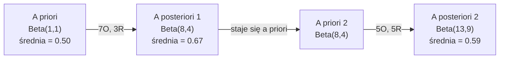

# Twierdzenie Bayesa

> Prawdopodobieństwo dotyczy tego, czego się spodziewasz. Twierdzenie Bayesa dotyczy tego, jak się uczysz z nowych danych.

**Typ:** Kompilacja
**Język:** Python
**Wymagania wstępne:** Faza 1, Lekcja 06 (Podstawy prawdopodobieństwa)
**Czas:** ~75 minut

## Cele nauczania

- Zastosowanie twierdzenia Bayesa do obliczania prawdopodobieństw a posteriori na podstawie prawdopodobieństw a priori, wiarygodności (likelihood) i dowodów.
- Zbudowanie od podstaw naiwnego klasyfikatora bayesowskiego dla tekstu, wykorzystując wygładzanie Laplace'a i obliczenia na logarytmach prawdopodobieństw.
- Porównanie estymacji MLE (Maximum Likelihood Estimation) i MAP (Maximum A Posteriori) oraz wyjaśnienie, w jaki sposób MAP odpowiada regularyzacji L2.
- Zaimplementowanie sekwencyjnej aktualizacji bayesowskiej przy użyciu sprzężonych rozkładów beta-dwumianowych do testów A/B.

## Problem

Test medyczny jest dokładny w 99%. Twój wynik jest pozytywny. Jakie jest prawdopodobieństwo, że rzeczywiście jesteś chory?

Większość ludzi odpowiada, że 99%. Prawdziwa odpowiedź zależy od tego, jak rzadka jest choroba. Jeśli dotyka ona 1 na 10 000 osób, wynik pozytywny daje ci zaledwie około 1% szans na bycie chorym. Pozostałe 99% pozytywnych wyników to fałszywe alarmy u zdrowych osób.

To nie jest podchwytliwe pytanie. To po prostu twierdzenie Bayesa. Każdy filtr spamu, każdy system diagnostyki medycznej, każdy model uczenia maszynowego, który kwantyfikuje niepewność, wykorzystuje dokładnie ten sam tok rozumowania. Zaczynasz od początkowego przekonania. Obserwujesz dowody. Aktualizujesz swoje przekonanie.

Jeśli będziesz budować systemy uczenia maszynowego bez zrozumienia tego mechanizmu, będziesz błędnie interpretować wyniki modeli, ustawiać złe progi decyzyjne i tworzyć systemy o nieuzasadnionej pewności (overconfident).

## Koncepcja

### Od prawdopodobieństwa łącznego do Bayesa

Z Lekcji 06 wiesz już, że prawdopodobieństwo warunkowe definiujemy jako:

```text
P(A|B) = P(A i B) / P(B)
```

I symetrycznie:

```text
P(B|A) = P(A i B) / P(A)
```

Oba wyrażenia mają ten sam licznik: P(A i B). Przyrównaj je do siebie i przekształć:

```text
P(A i B) = P(A|B) * P(B) = P(B|A) * P(A)

Zatem:

P(A|B) = P(B|A) * P(A) / P(B)
```

To jest właśnie twierdzenie Bayesa. Cztery wartości, jedno równanie.

### Cztery części

| Część | Nazwa | Znaczenie |
|------|------|----------------------------|
| P(A\|B) | A posteriori (Posterior) | Zaktualizowane prawdopodobieństwo zdarzenia A po zaobserwowaniu dowodu B |
| P(B\|A) | Wiarygodność (Likelihood) | Jak prawdopodobny jest dowód B, przy założeniu, że A jest prawdziwe |
| P(A) | A priori (Prior) | Twoje przekonanie o A przed zaobserwowaniem jakichkolwiek dowodów |
| P(B) | Dowód (Evidence) | Całkowite prawdopodobieństwo zaobserwowania B po uwzględnieniu wszystkich możliwości |

Mianownik P(B) działa jako czynnik normalizujący. Można go rozpisać korzystając z prawa całkowitego prawdopodobieństwa:

```text
P(B) = P(B|A) * P(A) + P(B|nie A) * P(nie A)
```

### Przykład testu medycznego

Choroba dotyka 1 na 10 000 osób. Test ma skuteczność na poziomie 99% (wykrywa 99% chorych, w 1% przypadków daje wyniki fałszywie dodatnie dla zdrowych osób).

```text
P(chory)          = 0.0001    (prior: choroba jest rzadka)
P(pozytywny|chory) = 0.99     (wiarygodność: test wykrywa chorobę)
P(pozytywny|zdrowy) = 0.01    (odsetek wyników fałszywie dodatnich)

P(pozytywny) = P(pozytywny|chory) * P(chory) + P(pozytywny|zdrowy) * P(zdrowy)
             = 0.99 * 0.0001 + 0.01 * 0.9999
             = 0.000099 + 0.009999
             = 0.010098

P(chory|pozytywny) = P(pozytywny|chory) * P(chory) / P(pozytywny)
                   = 0.99 * 0.0001 / 0.010098
                   = 0.0098
                   = 0.98%
```

Mniej niż 1%. Prawdopodobieństwo a priori całkowicie dominuje. Kiedy choroba jest rzadka, nawet bardzo dokładne testy generują w większości wyniki fałszywie dodatnie (false positives). Dlatego lekarze zlecają badania potwierdzające.

### Przykład filtra spamu

Otrzymujesz e-mail zawierający słowo „loteria”. Czy to spam?

```text
P(spam)                   = 0.3      (30% e-maili to spam)
P("loteria"|spam)         = 0.05     (5% spamu zawiera słowo "loteria")
P("loteria"|nie spam)     = 0.001    (0.1% normalnych e-maili zawiera "loteria")

P("loteria") = 0.05 * 0.3 + 0.001 * 0.7
             = 0.015 + 0.0007
             = 0.0157

P(spam|"loteria") = 0.05 * 0.3 / 0.0157
                  = 0.955
                  = 95.5%
```

Jedno słowo przesuwa prawdopodobieństwo z 30% na 95.5%. Prawdziwy filtr antyspamowy używa Bayesa do analizy setek słów jednocześnie.

### Naiwny klasyfikator bayesowski: założenie o niezależności

Naiwny klasyfikator bayesowski (Naive Bayes) rozszerza ten koncept na wiele cech (features), przyjmując założenie, że pod warunkiem danej klasy, wszystkie cechy są wzajemnie niezależne (warunkowa niezależność):

```text
P(klasa | cecha_1, cecha_2, ..., cecha_n)
  = P(klasa) * P(cecha_1|klasa) * P(cecha_2|klasa) * ... * P(cecha_n|klasa)
    / P(cecha_1, cecha_2, ..., cecha_n)
```

„Naiwność” tego modelu polega na przyjęciu tak silnego założenia o niezależności. W prawdziwym tekście występowanie słów wcale nie jest niezależne („Nowy” i „Jork” są bardzo skorelowane). O dziwo, to założenie sprawdza się w praktyce bardzo dobrze, ponieważ klasyfikator zazwyczaj potrzebuje jedynie poprawnie uszeregować prawdopodobieństwa klas, a nie generować ich idealnie skalibrowane wartości.

Z uwagi na to, że mianownik (dowód) jest wspólny dla wszystkich klas, można go całkowicie pominąć i po prostu porównać liczniki poszczególnych klas:

```text
wynik(klasa) = P(klasa) * iloczyn z P(cecha_i | klasa)
```

Wybieramy klasę z najwyższym wynikiem.

### Estymacja Największej Wiarygodności (MLE)

Jak uzyskać wartości `P(cecha | klasa)` z danych treningowych? Zliczając wystąpienia.

```text
P("darmowy"|spam) = (liczba spamów zawierających "darmowy") / (całkowita liczba spamów)
```

To jest właśnie metoda Maximum Likelihood Estimation (MLE): wybierasz wartości parametrów (prawdopodobieństw), które sprawiają, że zaobserwowane dane są najbardziej prawdopodobne. Maksymalizujesz funkcję wiarygodności, która dla zliczeń dyskretnych sprowadza się do częstotliwości względnej (relative frequency).

Problem: Jeśli dane słowo nigdy nie wystąpiło w wiadomościach typu spam podczas treningu, metoda MLE przypisze mu zerowe prawdopodobieństwo. Wówczas zaledwie jedno nieznane słowo w nowej wiadomości wyzeruje cały iloczyn. Rozwiązaniem jest wygładzanie Laplace'a (Laplace smoothing):

```text
P(słowo|klasa) = (liczba_wystąpień(słowo, klasa) + 1) / (całkowita_liczba_słów_w_klasie + rozmiar_słownika)
```

Dodanie wartości 1 do każdego licznika gwarantuje, że prawdopodobieństwo nigdy nie wyniesie idealnego zera.

### Maksimum A Posteriori (MAP)

Metoda MLE odpowiada na pytanie: Jakie parametry maksymalizują `P(dane|parametry)`?

Metoda MAP odpowiada na pytanie: Jakie parametry maksymalizują `P(parametry|dane)`?

Zgodnie z twierdzeniem Bayesa:

```text
P(parametry|dane) jest proporcjonalne do P(dane|parametry) * P(parametry)
```

MAP uwzględnia rozkład a priori (prior) narzucony na same parametry. Jeśli uważasz, że wagi (parametry) powinny przyjmować małe wartości, wyrażasz to jako prior, który karze za duże wartości. Jest to matematycznie równoważne z nałożeniem regularyzacji L2 w uczeniu maszynowym. Kara stosowana w regresji grzbietowej (Ridge) to dosłownie nałożenie prioru w kształcie rozkładu Gaussa na wartości wag modelu.

| Estymacja | Co optymalizuje | Odpowiednik w ML |
|------------|---------------|-------------|
| MLE | P(dane\|parametry) | Uczenie bez regularyzacji |
| MAP | P(dane\|parametry) * P(parametry) | Regularyzacja L2/L1 |

### Podejście częstościowe a bayesowskie: praktyczna różnica

Podejście częstościowe (Frequentist) traktuje parametry modelu jako stałe, z góry ustalone, ale nieznane wartości. Pytają: „Czego byśmy oczekiwali, gdybyśmy wielokrotnie potarzali ten eksperyment?”

Podejście bayesowskie (Bayesian) traktuje parametry jako zmienne losowe, dla których istnieją rozkłady prawdopodobieństwa. Pytają: „Biorąc pod uwagę zaobserwowane dane, co mogę wywnioskować na temat moich parametrów?”

Praktyczna różnica przy budowaniu systemów ML:

| Cecha | Częstościowe (Frequentist) | Bayesowskie (Bayesian) |
|------------|------------|---------|
| Wynik | Estymata punktowa (jedna wartość) | Rozkład wartości a posteriori |
| Niepewność | Przedziały ufności (dotyczące procedury losowania) | Przedziały wiarygodności (dotyczące samych parametrów) |
| Mało danych | Modele mogą łatwo ulegać przetrenowaniu (overfitting) | Prior działa jako naturalna regularyzacja |
| Obliczenia | Zazwyczaj szybsze | Często wymagają złożonego próbkowania (np. MCMC) |

Większość produkcyjnych systemów ML opiera się na podejściu częstościowym (metody takie jak stochastyczny spadek wzdłuż gradientu, zwracanie pojedynczych predykcji). Metody bayesowskie doskonale sprawdzają się w sytuacjach, gdy niezwykle ważna jest kalibracja niepewności (np. medycyna, autonomiczne pojazdy) oraz gdy danych jest mało (few-shot learning, problem zimnego startu).

### Dlaczego myślenie bayesowskie ma znaczenie w ML

Związek jest znacznie głębszy niż zwykła analogia:

**Priory to regularyzacja.** Gaussowski prior nałożony na wagi modelu to z matematycznego punktu widzenia regularyzacja L2. Prior Laplace'a odpowiada regularyzacji L1. Za każdym razem, gdy dodajesz karę regularyzacyjną do swojego modelu, implicite formułujesz bayesowskie założenia o tym, jakich wartości parametrów się spodziewasz.

**Wartości a posteriori odzwierciedlają niepewność.** Pojedyncze przewidywane prawdopodobieństwo wyrzucone z modelu niewiele mówi o pewności samego modelu względem tej predykcji. Metody bayesowskie mogą dostarczyć pełny rozkład z wnioskiem w stylu: „Uważam, że P(spam) mieści się w granicach od 0.8 do 0.95”.

**Aktualizacja bayesowska to nauka online.** Dzisiejszy rozkład a posteriori staje się jutrzejszym rozkładem a priori. Kiedy twój model otrzymuje porcję nowych danych, może po prostu inkrementalnie zaktualizować swoje przekonania, zamiast zaczynać proces uczenia od całkowitego zera.

**Porównywanie modeli to zadanie o naturze bayesowskiej.** Kryteria takie jak Bayesowskie Kryterium Informacyjne (BIC), marginalne prawdopodobieństwa oraz czynniki Bayesa (Bayes factors) wprost używają wnioskowania bayesowskiego do dokonywania wyboru pomiędzy modelami bez problemu przetrenowania.

## Zbuduj to

### Krok 1: Funkcja Twierdzenia Bayesa

```python
def bayes(prior, likelihood, false_positive_rate):
    evidence = likelihood * prior + false_positive_rate * (1 - prior)
    posterior = likelihood * prior / evidence
    return posterior

result = bayes(prior=0.0001, likelihood=0.99, false_positive_rate=0.01)
print(f"P(chory|pozytywny) = {result:.4f}")
```

### Krok 2: Naiwny Klasyfikator Bayesowski

```python
import math
from collections import defaultdict

class NaiveBayes:
    def __init__(self, smoothing=1.0):
        self.smoothing = smoothing
        self.class_counts = defaultdict(int)
        self.word_counts = defaultdict(lambda: defaultdict(int))
        self.class_word_totals = defaultdict(int)
        self.vocab = set()

    def train(self, documents, labels):
        for doc, label in zip(documents, labels):
            self.class_counts[label] += 1
            words = doc.lower().split()
            for word in words:
                self.word_counts[label][word] += 1
                self.class_word_totals[label] += 1
                self.vocab.add(word)

    def predict(self, document):
        words = document.lower().split()
        total_docs = sum(self.class_counts.values())
        vocab_size = len(self.vocab)
        best_class = None
        best_score = float("-inf")
        
        for cls in self.class_counts:
            # Prawdopodobieństwo a priori dla klasy
            score = math.log(self.class_counts[cls] / total_docs)
            
            # Wkład każdego ze słów
            for word in words:
                count = self.word_counts[cls].get(word, 0)
                total = self.class_word_totals[cls]
                # Prawdopodobieństwo z wygładzaniem Laplace'a
                score += math.log((count + self.smoothing) / (total + self.smoothing * vocab_size))
                
            if score > best_score:
                best_score = score
                best_class = cls
        return best_class
```

Logarytmy prawdopodobieństw (log-probabilities) zapobiegają niedomiarowi (underflow). Mnożenie bardzo wielu małych prawdopodobieństw prowadzi do powstawania wartości zbyt małych, by mogły zostać obsłużone przez standardowe typy zmiennoprzecinkowe (float). Dodawanie logarytmów prawdopodobieństw jest numerycznie w pełni stabilne i matematycznie jednoznacznie równoważne.

### Krok 3: Trening na danych typu Spam i Ham

```python
train_docs = [
    "win free money now",
    "free lottery ticket winner",
    "claim your prize today free",
    "urgent offer free cash",
    "congratulations you won free",
    "meeting tomorrow at noon",
    "project update attached",
    "can we schedule a call",
    "quarterly report review",
    "lunch on thursday sounds good",
    "team standup notes attached",
    "please review the pull request",
]

train_labels = [
    "spam", "spam", "spam", "spam", "spam",
    "ham", "ham", "ham", "ham", "ham", "ham", "ham",
]

classifier = NaiveBayes()
classifier.train(train_docs, train_labels)

test_messages = [
    "free money waiting for you",
    "meeting rescheduled to friday",
    "you won a free prize",
    "please review the attached report",
]

for msg in test_messages:
    print(f"  '{msg}' -> {classifier.predict(msg)}")
```

### Krok 4: Sprawdź nauczone prawdopodobieństwa

```python
def show_top_words(classifier, cls, n=5):
    vocab_size = len(classifier.vocab)
    total = classifier.class_word_totals[cls]
    probs = {}
    for word in classifier.vocab:
        count = classifier.word_counts[cls].get(word, 0)
        probs[word] = (count + classifier.smoothing) / (total + classifier.smoothing * vocab_size)
    sorted_words = sorted(probs.items(), key=lambda x: x[1], reverse=True)
    for word, prob in sorted_words[:n]:
        print(f"    {word}: {prob:.4f}")

print("\nNajbardziej spamerskie słowa:")
show_top_words(classifier, "spam")
print("\nNajbardziej normalne słowa (ham):")
show_top_words(classifier, "ham")
```

## Zastosuj w praktyce

Biblioteka Scikit-learn oferuje gotowe do wdrożenia na produkcję implementacje algorytmu Naive Bayes:

```python
from sklearn.feature_extraction.text import CountVectorizer
from sklearn.naive_bayes import MultinomialNB

vectorizer = CountVectorizer()
X_train = vectorizer.fit_transform(train_docs)

clf = MultinomialNB()
clf.fit(X_train, train_labels)

X_test = vectorizer.transform(test_messages)
predictions = clf.predict(X_test)
for msg, pred in zip(test_messages, predictions):
    print(f"  '{msg}' -> {pred}")
```

W gruncie rzeczy jest to całkowicie ten sam algorytm. Moduł `CountVectorizer` załatwia sprawę tokenizacji tekstu i budowania słownika. Z kolei funkcja `MultinomialNB` przejmuje proces logarytmowania i wygładzania prawdopodobieństw w sposób całkowicie niewidoczny dla użytkownika. Skrypt przygotowany wcześniej od podstaw robi jednak dokładnie to samo i to przy zaledwie 40 liniach kodu Pythona.

## Wdrożenie

Klasa `NaiveBayes` zbudowana w tym dokumencie realizuje pełny cykl maszynowego uczenia: od tokenizacji przez estymację za pomocą wygładzania Laplace'a aż do samej klasyfikacji z użyciem logarytmów w fazie predykcyjnej. Została ona zoptymalizowana i napisana bez użycia jakichkolwiek zewnętrznych bibliotek.

### Priory sprzężone (Conjugate Priors)

Kiedy rozkład a priori i a posteriori należą do tej samej rodziny rozkładów, prior taki nazywany jest "sprzężonym". Dzięki temu aktualizacja prawdopodobieństw z pomocą twierdzenia Bayesa przebiega bez żadnych problemów algebraicznych — i pozwala obliczyć prawdopodobieństwo za pomocą jednego wzoru. Zapobiega to potrzebie jakiegokolwiek całkowania na drodze numerycznej.

| Prawdopodobieństwo | Prior sprzężony | Rozkład a posteriori (Posterior) | Przykład zastosowania |
|----------|----------------|------|---------|
| Bernoulliego | Beta(a, b) | Beta(a + sukcesy, b + porażki) | Estymacja fałszowania monety |
| Normalny (znana wariancja) | Normalny(mu_0, sigma_0) | Normalny(średnia ważona, mniejsza wariancja) | Kalibracja czujników i pomiarów |
| Poissona | Gamma(a, b) | Gamma(a + liczba zdarzeń, b + n) | Modelowanie natężenia nadejścia w jednostce czasu |
| Wielomianowy | Dirichleta(alfa) | Dirichleta(alfa + zliczenia) | Modele językowe, algorytmy modelowania tematów |

Zrozumienie zjawiska priorytetów sprzężonych to spory atut w dziedzinie sztucznej inteligencji. W razie wykluczenia możliwości użycia rozkładu sprzężonego zaistnieje potrzeba odpalenia MCMC (Markov chain Monte Carlo) na wielkiej siatce pomiarów próbkowania. Sprzężone priory potrafią sprowadzić ten ciężki i skomplikowany problem numeryczny do zaktualizowania zaledwie 2 parametrów danego rozkładu.

W uczeniu maszynowym najczęściej spotykanym rozkładem bywa zazwyczaj `Beta`. Prior zapisywany mianem `Beta(a, b)` w sposób jasny określa twoją wiarę na temat parametru reprezentującego jakieś szanse. Wzór na średnią tego zjawiska oblicza się jako wartość `a / (a+b)`. Zależność jest niezwykle łatwa – im ostateczna wartość równania `a+b` okaże się być wyższa, tym bardziej ukierunkowany będzie wynik, bo i ufność rozkładu rośnie.

Skrajne konfiguracje rozkładu powiązanego z wersją beta mogą ujawniać specyficzne nastawienie do sytuacji na wejściu:
- `Beta(1, 1)` = Rozkład jednostajny. Płaski prior. Wskazuje, że z braku opinii masz całkowitą ignorancję przed jakimikolwiek badaniami, stawiając 50 na 50 %.
- `Beta(10, 10)` = Wykres skupia się mocno na wartości 0.5 i mocno daje do zrozumienia, że twoja dotychczasowa wiedza jest przekonana o bezstronności danego zjawiska.
- `Beta(1, 10)` = Rozkład przesunięty w stronę zera, wyraźnie faworyzujący wyniki zerowe. Uważasz odgórnie, że badana wielkość czy prawdopodobieństwo na pewno jest wyjątkowo niskie.

Proces uaktualniania to czysta matematyka:

```text
Prior:           Beta(a, b)
Dane wejściowe:  s sukcesów, f porażek
A posteriori:    Beta(a + s, b + f)
```

Żadnych skomplikowanych matematycznie całek. Totalny brak konieczności symulowania wielokrotnych pomiarów Monte Carlo i zbierania wyników z losowań prób. Cały mechanizm można bez problemu oprzeć na dodawaniu odpowiednich proporcji do siebie.

### Sekwencyjna aktualizacja bayesowska

Wnioskowanie z Bayesa jest bardzo intuicyjne i doskonale wpisuje się w naturę uczenia się sekwencyjnego. Własność sprzężenia (conjugate property) jest wręcz naturalnie z nim zintegrowana: wczorajszy wniosek zapisany na koncie prawdopodobieństw a posteriori (posterior) bez żadnych problemów wciela się w najnowsze założenia rozkładu dzisiejszych apriory (prior) dla nowej porcji świeżych weryfikowalnych danych. Właśnie dzięki temu współczesne systemy potrafią przetwarzać wielkie pule i wolumeny narastających z każdą sekundą informacji i w czasie bieżącym modyfikować zaktualizowane opinie.

Uczmy się o monecie.

**Dzień 1: brak jakichkolwiek początkowych pomiarów czy danych.**
Algorytm musi wystartować z wartości konfiguracyjnych reprezentujących szczyt ignorancji: Beta(1, 1). To jednolite pojęcie wstępne zakłada, że dla wszystkich przedziałów na planszy 0 - 1 wartość posiada jednolity, płaski jak deska priorytet.
- Średnia a priori (prior): 0.5

**Dzień 2: Zbieramy pierwsze dane próbne. Zebraliśmy 7 Orłów i 3 Reszki.**
Do wzoru wprowadzamy wynik z wczoraj. Wynikiem dla nowej wersji beta to wynik po zsumowaniu z poszczególnymi próbkami dla a i b. A posteriori z dzisiaj = `Beta(1 + 7, 1 + 3)` = `Beta(8, 4)`
- Wyliczona dzisiaj po wykonaniu zrzutu średnia a posteriori: 8/12 = 0.667.
- Dowody wskazują, że moneta rzuca wyraźnie więcej "Orłów".

**Dzień 3: Na licznik wpadło znowu 5 nowych Orłów i aż 5 kolejnych Reszek.**
Rozpoczynamy od nowej aktualizacji z nową wersją poprzednią: a posteriori z wczoraj stanowi naszą dotychczasową wiedzę. Zatem w dzisiejszy dzień wpadamy wprost z opcją a priori = `Beta(8, 4)`. A posteriori po dzisiejszych danych = `Beta(8 + 5, 4 + 5)` = `Beta(13, 9)`
- Obliczona dzisiejsza średnia a posteriori po drugiej aktualizacji danych wynosi obecnie: 13 / 22 = 0.591.
- Najwyraźniej najświeższe wyniki powoli ściągają szalone odchylenie zaobserwowane we wczesnej fazie testu. Wynik ściągany jest spowrotem do środka równowagi na 0.5.



Niewielkie porcje danych, na których trenowany jest nasz wskaźnik można przetwarzać absolutnie sekwencyjnie – wrzucać każdą jednorazowo z każdą świeżo napływającą daną wejściową, bez konieczności robienia z tego jakiegokolwiek potężnego batchowania wszystkich elementów jednocześnie. Obliczany przez obie formy wynik będzie zawsze w pełni spójny ze wszystkimi pomiarami – w powyższym kodzie zrzucenie wszystkich 20 prób z Orłami i Reszkami jako jeden batch po dodaniu do zera wyniesie absolutnie tyle samo, mianowicie wartość `Beta(13, 9)`. Tego typu inkrementalna analiza (incremental analysis) to kamień węgielny wszelkiego rodzaju analityki strumieni danych, uczących się systemów decyzyjnych oraz testów A/B opartych na multi-armed bandits.

### Połączenie z testami A/B

Testowanie A/B to świetny przypadek zastosowania wnioskowania bayesowskiego.

Konfiguracja: Testujemy nową kolorystykę przycisków wywołujących akcje sprzedażową w e-sklepie. Zastanawiamy się, co wzbudzi większe zaangażowanie u internautów na naszej ofercie sprzedażowej. Porównywana jest stara wersja kolorystyczna A o barwie niebieskiej i całkowicie świeży projekt wariantu B, oparty o kolor zielony.

Wdrożenie testowania A/B opartego o techniki analizy Bayesa:

1. **A priori (Prior).** Jako punkt wyjścia inicjujemy proces bez jakiegokolwiek uprzedzenia lub wiedzy na temat ewentualnego zachowania testowanego przycisku na wejściu w sklepach klientów. Dla wariantu A i wariantu B ładujemy wersje a priori o wyzerowanej strukturze z parametryzacją `Beta(1, 1)`.
2. **Rejestrowanie spływających danych z prób.** Na każde badane i udokumentowane testowo 1000 otwarć i odsłon, niebieski Wariant A otrzymał pozytywnie ocenione 50 trafień konwersyjnych (0.05). Z kolei świeży design w postaci zielonego Wariantu B doczekał się podbicia licznika konwersji wycenionego sumą 65 zatwierdzeń, również dla zbadanych statystycznie próbek zebranych na populacji wynoszącej 1000 wywołań.
3. **Analiza wyliczonych wariancji a posteriori.** Obliczamy, który parametr posiada teraz mocniejszy wskaźnik szansy wygrania:
   - Wynik a posteriori opcji A: zaktualizowany na wartości `Beta(1 + 50, 1 + 950)` równy `Beta(51, 951)`. Oszacowana średnia: ~0.051
   - Wynik a posteriori opcji B: po podsumowaniu wartości to `Beta(1 + 65, 1 + 935)` i finalnie `Beta(66, 936)`. Oszacowana średnia oscyluje wokół wartości: ~0.066
4. **Decyzja ostateczna.** Zbuduj rozwiązanie dla odnalezienia opinii mówiącej, jaka właściwie szansa na sukces dzieli rozkład szans między grupami? Poszukiwana opcja to obliczenie prawdopodobieństwa wyższości parametru współczynnika trafień (konwersji) B nad wynikiem trafień (konwersją) w wariancie A. Pytamy w tym wypadku wprost o zmienną i parametr o symbolu matematycznym `P(B > A)`.

Chociaż formalny, analityczny, skomplikowany wzór z zawiłymi całkami opisujący ostateczną różnicę dystrybucyjną dwóch wariantów dla wartości a posteriori bywa z zasady ciężkim do rozwiązania tematem analitycznym, możemy po prostu puścić wielokrotny strumień uderzeń próbkowania Monte Carlo w celu znalezienia odpowiedniej skali:

```text
1. Wygeneruj około 100 000 prób losowych z wyliczonego rozkładu opcji A (ze zbioru Beta(51, 951)) -> samples_A
2. Ściągnij losowo ze wszystkich symulacji około 100 000 próbek wygenerowanych na bazie zbiorów wywodzących się dla punktu B (ze zbioru Beta(66, 936)) -> samples_B
3. Oblicz statystykę w pytaniu P(B > A): podsumuj procent we wszystkich zarejestrowanych zjawiskach pobrań próbek, gdzie wyciągnięte dane punktu B wykraczały wynikiem obok punktu z serii zdarzeń z pakietu A.
```

Jeżeli końcowe prawdopodobieństwo osiągnięcia przez punkt B lepszych ostatecznych rezutatów przekroczy np limit 95% (otrzymujesz wartość `P(B > A) > 0.95`), spokojnie wprowadź zielony wariant B na produkcję. Jeżeli szansa na ten scenariusz znajdzie się w niewygodnym lub mało oczywistym dla oceny "limbo", czyli od 5% do 95%, zachowaj wstrzemięźliwość, i kontynuuj agregację i rejestrację zachowań użytkowników dla obydwu grup. Decydując o ostatecznym wyniku – jeżeli zielona ikona spadnie w testach do wyniku `P(B > A) < 0.05` to na środowisku produkcyjnym uruchomić możesz bezpiecznie zwycięzcę tego A/B testowania czyli wariant A, a odrzucić ze stołu odrzuconą statystycznie nową modyfikację zieloną w wariancie B.

Zalety w stosunku do klasycznego testowania A/B (opartego na statystyce częstościowej):
- Otrzymujesz na koniec dnia zrozumiały i łatwy do przyswojenia komunikat wywołujący konkretną statystykę, wyrażaną na zasadzie „Jest aż 97% szans, że wdrażana świeża, najnowsza odsłona platformy na wariancie B zadziała o wiele trafniej na klienta i konwersję”.
- Eliminujesz skomplikowane dylematy matematyczne z interpretowaniem wskaźnika "p-value", brakuje tu wbudowanych statystycznie mechanizmów wymuszających rygor w postaci uciążliwych i uciążliwych pułapek polegających na stwierdzeniach w stylu "Niestety ale z powodu zawiłości analizy, nie udało mi się w pełni i odrzucić poprawnie zerowej z założenia hipotezy na starcie testów.".
- Metoda Bayesowska absolutnie zapobiega podbiciu wartości rzekomo fałszywych wniosków w tzw. "peeking problem", pozwalając i dając wręcz swobodną przepustkę na podglądanie statystyczne zgromadzonych próbek bez nadmiernego wplatania błędu fałszywych dodatnich założeń po wczesnym zatrzymaniu eksperymentu.
- Bardzo prosta i intuicyjna obsługa uprzedniej historycznej bazy statystycznej o konkretnych zdarzeniach na własnym koncie, wyrażona łatwym osadzeniem szans w proporcjach beta na samym końcu procesu z definicją `Beta(x, y)` i określoną historyczną wariancją opinii na wczesnym i startowym etapie analiz.

| Aspekt | Częstościowe A/B (Frequentist) | Bayesowskie A/B (Bayesian) |
|------------|----------------|----------------------------|
| Wynik końcowy | p-value | Prawdopodobieństwo P(B > A) |
| Interpretacja | „Jak zaskakujące są zebrane dane, zakładając, że B = A?” | „Jakie jest całkowite prawdopodobieństwo, że nowa próba B jest lepsza od A?” |
| Wcześniejsze zakończenie testu | Problem tzw. "peekingu" - ryzyko znaczącego nadmuchania uchybienia wynikiem Fałszywie Dodatnim (False Positive). | Pełne bezpieczeństwo sprawdzania aktualnego stanu o dowolnej porze testowania na żywo. |
| Wykorzystanie doświadczeń z przed startu (Prior) | Ignorowane na wejściu i niemożliwe do zastosowania. | Włączone od samego zarania w cały model poprzez osadzony rozkład funkcji rozkładu Beta na wejściu. |
| Mechanizm decyzyjny z testów | Jeśli wskaźnik uśrednianej analizy p < 0.05 odrzuć zerową hipotezę. | Jeśli procent wskaźnika prawdopodobieństwa w wariancji wejściowej dla parametru P(B > A) > próg wdrożenia. |

## Ćwiczenia

1. **Wielokrotne testowanie.** Niezależny test medyczny pewnego pacjenta wykrył i pokazał wynik pozytywny powtórnie: aż dwukrotnie (obydwa testy diagnostyczne dają pełne 99% dokładności wskazań bezbłędnych detekcji, przy wcześniejszym założeniu z wiedzy ogólnej na temat populacji mówiącej, że choroba dotyka dokładnie 1 osobę z pośród 10 000). Jaki jest oszacowany próg szans i docelowego zdiagnozowanego prawdopodobieństwa wystąpienia P(chorego) na nowo zarejestrowanym etapie statystycznym tuż za przeprowadzonym eksperymencie oznaczonym drugą wartością pozytywną na wyniku obu badających pacjenta testów po dwóch próbach powtórzonych po kolei z tak silnym natężeniem z obu badań? Tip: w drugim eksperymencie testowym w roli opinii początkowej a priori nałożony zostaje punkt wejściowy bazujący w głównej mierze bezpośrednio z oszacowanego rozkładu opcji wynikowych a posteriori otrzymanego tuż i wyliczonego w fazie prób z pierwszym w kolejności teście u badanego pacjenta.
2. **Wpływ parametru wygładzania na jakość rozpoznania słów.** Skompiluj, przeładuj i przetestuj wyuczonego dla Ciebie klasyfikatora spam dla opcji wygładzania o konkretnie narzuconych stawkach wartości wynoszących odpowiednio dla wejściowego zestawu dla wartości mianowicie z pulą 0.01, 0.1, 1.0 oraz dla mocnej 10.0. Udziel odpowiedzi na zagadnienia i zaobserwuj zachowania z wariancją odchylenia rozłożenia topowych, najwyżej postawionych w tabeli poszczególnych słówek filtru? Odpowiedz też z czego to wynika. Oprócz tego na koniec zadaj swojemu procesorowi zagadkę do oceny, co konkretnie stałoby się ze słownictwem jeśli wartość parametru użytego dla algorytmu smoothing została sztywno ustalona by uderzyć tylko w jedyne i odizolowane od zjawiska w zaledwie pojedynczej w skali zestawienia wariacji ham.
3. **Powiększ analizę słownikowych ulepszonych skanerów Bayes'owskich.** Rozwiń i zrób małą rozbudowę w funkcjach zaprogramowanej do analiz zestawu reguł dedykowanych klasie NaiveBayes. Zaprogramuj i zainicjuj ją, wymuszając by od teraz przy ocenie tekstu skupiona została również dedykowanie na parametrach związanych ze wskaźnikami pomiaru bazującej dla zbadanych statystyk w wariancie rozmiaru z doliczeniem wielkości wejściowych znaków testowanej w procesie wiadomości w kategoriach (wiadomość mała lub duża), co powinno być uzupełnieniem już funkcjonującego algorytmu opartego bazowo na pomiarze wskaźnika częstości używanych w nich konkretnych wyselekcjonowanych zwrotów i wpisanych z fraz po słowniku na tokenizator. Następnie przećwicz go testowo z zestawieniem do poszukiwań by dokonać predykcji precyzyjnie dla szacowanych wyników pod kątami `P(short|spam)` (zestaw do oceny prawdopodobieństw małych i krotkich plików ze SPAMEM), oraz również ocenić i wydedukować oszacowania docelowe statystyczne wartości ukrytej pod szansą wykrycia w nim na punkcie `P(short|ham)`. Wpleć na zakończenie ten oszacowany na boku estymator jako główną zmienną w funkcję dla wyniku bazowego na system przewidywacza do modelu oceniającego docelowe wyjścia na system oceniający punktację klasyfikatora na punkt z oceną score prediction final dla całego silnika do testowania słów spamu z klasyfikatora NaiveBayes model predictions score class na złączenie cech długość-słownictwo.
4. **Rozliczenie na piechotę manualnym licznikiem parametru wyniku algorytmu pod Maximum A Posteriori (MAP).** Załóżmy scenariusz pobrania statystycznej wprost na zebranych i zweryfikowanych zaobserwowanych próbnie odczytach prób losowego rzutu, a mianowicie podglądane przez badacza dane wskazały docelowo aż zebrane 7 trafień wyniku Reszka na rzucone w puli z zebrane 10 obrotów z losowań. Przećwicz algorytmy estymujące na MAP ułożone docelowo by odczytały prawidłowo parametr ukształtowania z uprzedzeniami tzw. parametru obciążającego "bias". Posłuż się przygotowanym na starcie narzuconym do góry, stałym priorem ukierunkowującym i sterowanym z wgraną na stałe i predefiniowaną rozłożeniem na opcję opisaną za pomocą i bazującą wokół opcji `Beta(2,2)`. Dokonaj zderzenia, zbadania i precyzyjnego oszacowania różnicy docelowych predykcji po wyniku analiz pomiędzy policzonym z modelu dla wyniku Maximum A Posteriori estymowanego MAP score dla zbadanego zjawiska z klasycznym przeliczeniowym docelowym surowym uśrednionym modelem oszacowanym przyrządem liczącym z wzoru Maximum Likelihood Estimation i zanotowanym MLE. Wytłumacz sobie jak i skąd ta zaszłość uderzyła po różnicy proporcji ocen we wskaźnik wyników docelowych na statystyce (który i dlaczego pokazał to wynoszące na uśrednione z licznika ok. 7/10 wskaźnika różnic).

## Kluczowe terminy

| Termin | Co ludzie mówią | Co to właściwie oznacza |
|------|----------------|----------------------|
| A priori (Prior) | „Moje wstępne przypuszczenie” | P(hipoteza) przed obserwacją dowodów. W ML często pełni rolę regularyzacji. |
| Wiarygodność (Likelihood) | „Jak dobrze model pasuje do danych” | P(dowód\|hipoteza). Jak prawdopodobne są zaobserwowane dane, zakładając prawdziwość danej hipotezy. |
| A posteriori (Posterior) | „Moje zaktualizowane przekonanie” | P(hipoteza\|dowód). Prawdopodobieństwo a priori pomnożone przez wiarygodność, a następnie znormalizowane. |
| Dowód (Evidence) | „Stała normalizująca” | Całkowite prawdopodobieństwo P(dane) dla wszystkich możliwych hipotez. Zapewnia, że rozkład a posteriori sumuje się do 1. |
| Naiwny Bayes (Naive Bayes) | „Ten prosty klasyfikator tekstu” | Model klasyfikujący zakładający pełną niezależność cech pod warunkiem zadanej klasy. Mimo niespełnionych założeń zazwyczaj spisuje się znakomicie. |
| Wygładzanie Laplace'a | „Dodaj jeden (add-one smoothing)” | Metoda polegająca na dodaniu niewielkiej stałej do liczników, zapobiegająca zerowym prawdopodobieństwom w obliczeniach z niewidzianych danych. |
| MLE (Maximum Likelihood Estimation) | „Po prostu weź częstości” | Wybór takich parametrów, by zoptymalizować do maksimum wskaźnik wartości P(dane\|parametry). Pomija założenia a priori. Często owocuje na małych danych wyuczonymi na pamięć modelami overfitting model. |
| MAP (Maximum A Posteriori) | „Model z użyciem MLE przypięty priorami na parametrach” | Znalezienie parametrów optymalizujących maksymalnie wynik P(dane\|parametry) * P(parametry). Równoznaczne ze zoptymalizowanym estymatorem na metodologii MLE powiązanym pod uregulowany wariant o opcje dodatkowo stuningowanego narzutem modelu pod formą regularyzacji. |
| Log-likelihood (Log-prawdopodobieństwo) | „Działaj w przestrzeni algorytmów operujących na wektorach pod logarytmem (log-space)” | Korzystanie i konwertowanie do skali z użyciem formy z matematycznego dopasowania pod formę z rzędu z wartości `log(P)` zamiast tradycyjnego modelu w zapisie `P`, stosowane tylko żeby oddzielić kłopoty związane z zanikiem niedomiaru obcięcia w liczbach skrajnych u małych zapisów w floating-point na skali zmiennoprzecinkowych pod czas dokonywania tysięcy mnożeń podczas długich obciążeń na estymacji p-procentowych w kodzie. |
| False Positive (Wynik Fałszywie Dodatni) | „Zły odczyt (fałszywy alarm)” | Analizator wydał diagnozę jako pozytywny detektor, kiedy tak realny prawdziwy bazowy ostateczny na świecie pomiar od dawna klasyfikuje te zjawisko za nie mające miejsca, czyli fałszywe lub zwykłe negatywne. Najważniejszy inicjator potężnych dewiacji prowadzący w ślepy zaułek tak zwany potocznie problemem lub zjawiskiem pod określeniami base-rate fallacy problem z fałszywą percepcją założeń przyrządów nad odczytem skromnych statystyk. |

## Dalsze czytanie

- [3Blue1Brown: Twierdzenie Bayesa](https://www.youtube.com/watch?v=HZGCoVF3YvM) - świetne wizualne wytłumaczenie twierdzenia na klasycznym przykładzie błędu ze zdiagnozowanych badań od testu medycznego w przychodni z analiz.
- [Stanford CS229: Algorytmy uczenia generatywnego](https://cs229.stanford.edu/notes2022fall/cs229-notes2.pdf) - notatki z modelu o klasyfikatorach pod analizą z Naive Bayes i na jego wdrożeniu oraz podpięciach matematycznego na temat powiązań we wspomnianym powiązanym w dyskryminacyjnym temacie w rodzinie na podstawniki pod modele dyskryminacyjnych.
- [Think Bayes (Myśl po Bayesowsku)](https://greenteapress.com/wp/think-bayes/) - bardzo świetna z otwarto wydanym pakietem całkowicie darmowa cyfrowo do pobrania otwarta publikacyjnie w formie na pdf e-książka. Doskonała encyklopedia objaśniająca bardzo dogłębnie statystyczne analizowanie pod okiem Bayesa z implementacją z dużą paczką pod kod napisany we wstawkach Pythonowych skryptów.
- [scikit-learn Naive Bayes](https://scikit-learn.org/stable/modules/naive_bayes.html) - oficjalny przewodnik programisty w oparciu od sprawdzonego frameworka programistycznego o dedykowanych profesjonalnie w modelowaniu kompilacji z rodziny Bayesowskich klasyfikatorów opisujący również na bardzo dogłębnych zbadanych na podstawie wyśmienitych produkcyjnych wdrażanych rozwiązaniach na co komu jak do konkretnego momentu należy i pasowałoby idealnie do dobrych projektów je powybierać stosując je do rozwiązań z dobrym smakiem dla do poszczególnego odpowiedniego optymalnego pod wymagania danego dobranego idealnie poszukiwanego od do projektowych z góry do potrzeb dobranych do idealnego narzuconego na docelowo do docelowych wymagań wariantów i konkretnego każdego ze z wariantów estymacji ze statystycznej w analizach w zależności od zastosowań docelowych poszczególnego wyselekcjonowanego wariantu tego modelu estymującego.
