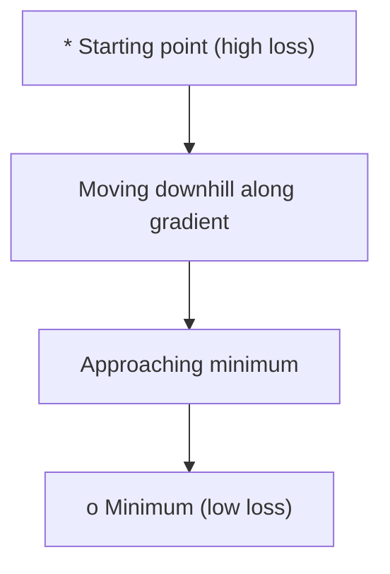
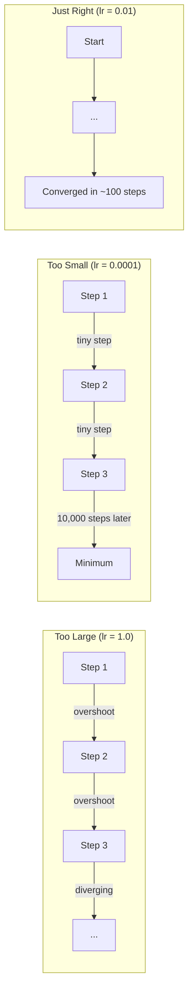
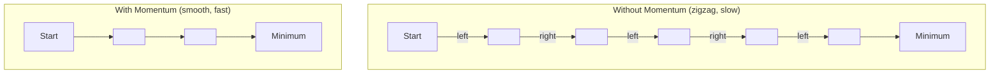
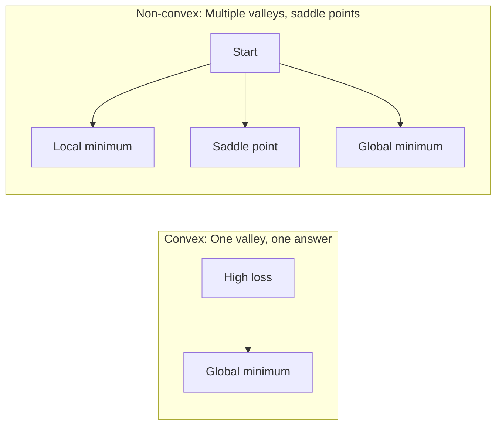
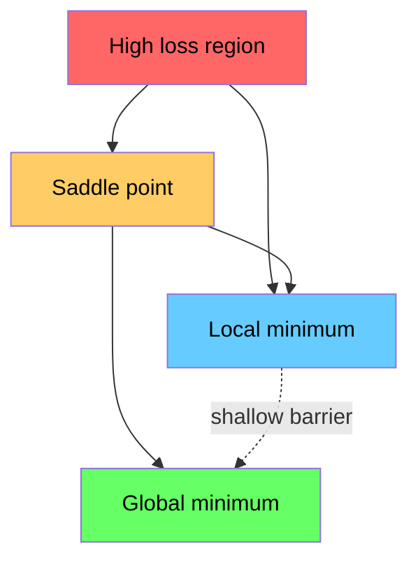

# Optymalizacja

> Trenowanie sieci neuronowej to nic innego jak szukanie dna doliny.

**Typ:** Build
**Język:** Python
**Wymagania wstępne:** Faza 1, Lekcje 04-05 (Pochodne, Gradienty)
**Czas:** ~75 minut

## Cele nauki

- Zaimplementuj od podstaw zwykły spadek gradientowy (gradient descent), SGD z momentum oraz Adam
- Porównaj zbieżność optymalizatorów na funkcji Rosenbrocka i wyjaśnij, dlaczego Adam dostosowuje współczynniki uczenia per-waga
- Odróżnij wypukłe (convex) krajobrazy straty od niewypukłych (non-convex) i wyjaśnij rolę punktów siodłowych w wysokich wymiarach
- Skonfiguruj harmonogramy współczynnika uczenia (step decay, cosine annealing, warmup) dla stabilności treningu

## Problem

Masz funkcję straty (loss function). Mówi ci, jak bardzo myli się twój model. Masz gradienty. Mówią ci, w którym kierunku strata rośnie. Teraz potrzebujesz strategii schodzenia w dół.

Naiwne podejście jest proste: poruszaj się w kierunku przeciwnym do gradientu. Skaluj krok pewną liczbą zwaną współczynnikiem uczenia (learning rate). Powtarzaj. To jest spadek gradientowy (gradient descent) i działa. Ale "działa" ma swoje zastrzeżenia. Zbyt duży współczynnik uczenia i całkowicie przeskakujesz dolinę, odbijając się między ścianami. Zbyt mały i pełzniesz w stronę odpowiedzi przez tysiące zbędnych kroków. Trafisz na punkt siodłowy (saddle point) i przestajesz się poruszać, mimo że nie znalazłeś minimum.

Każdy optymalizator w deep learningu jest odpowiedzią na to samo pytanie: jak dotrzeć do dna doliny szybciej i bardziej niezawodnie?

## Koncepcja

### Co oznacza optymalizacja

Optymalizacja to znajdowanie wartości wejściowych, które minimalizują (lub maksymalizują) funkcję. W uczeniu maszynowym tą funkcją jest strata (loss). Wejściami są wagi modelu. Trening to optymalizacja.

```
minimize L(w) where:
  L = loss function
  w = model weights (could be millions of parameters)
```

### Spadek gradientowy (zwykły)

Najprostszy optymalizator. Oblicz gradient straty względem każdej wagi. Przesuń każdą wagę w kierunku przeciwnym do jej gradientu. Skaluj krok przez współczynnik uczenia.

```
w = w - lr * gradient
```

To cały algorytm. Jedna linijka.



### Współczynnik uczenia: najważniejszy hiperparametr

Współczynnik uczenia (learning rate) kontroluje rozmiar kroku. Decyduje o wszystkim, jeśli chodzi o zbieżność.



Nie istnieje wzór na właściwy współczynnik uczenia. Znajdujesz go eksperymentalnie. Typowe punkty startowe: 0.001 dla Adama, 0.01 dla SGD z momentum.

### SGD vs batch vs mini-batch

Zwykły spadek gradientowy oblicza gradient na całym zbiorze danych przed wykonaniem jednego kroku. Nazywa się to batch gradient descent. Jest stabilny, ale wolny.

Stochastyczny spadek gradientowy (SGD - stochastic gradient descent) oblicza gradient na pojedynczej, losowej próbce i natychmiast wykonuje krok. Jest szumiący (noisy), ale szybki.

Mini-batch gradient descent jest kompromisem pomiędzy nimi. Oblicz gradient na małej partii (32, 64, 128, 256 próbek), a następnie wykonaj krok. To właśnie z tego korzysta się w praktyce.

| Wariant | Rozmiar batcha | Jakość gradientu | Szybkość na krok | Szum |
|---------|-----------|-----------------|---------------|-------|
| Batch GD | Cały zbiór danych | Dokładny | Wolny | Brak |
| SGD | 1 próbka | Bardzo szumiący | Szybki | Wysoki |
| Mini-batch | 32-256 | Dobre oszacowanie | Zrównoważony | Umiarkowany |

Szum w SGD i mini-batch nie jest błędem. Pomaga uciec z płytkich minimów lokalnych i punktów siodłowych.

### Momentum: kula tocząca się w dół

Zwykły spadek gradientowy bierze pod uwagę tylko bieżący gradient. Jeśli gradient zygzakuje (powszechne w wąskich dolinach), postęp jest powolny. Momentum naprawia to, akumulując poprzednie gradienty w postaci wektora prędkości (velocity).

```
v = beta * v + gradient
w = w - lr * v
```

Analogia: kula tocząca się w dół. Nie zatrzymuje się i nie startuje od nowa przy każdej nierówności. Nabiera prędkości w spójnych kierunkach i tłumi oscylacje.



`beta` (zwykle 0.9) kontroluje, ile historii zachować. Wyższa wartość beta oznacza więcej momentum, gładsze trajektorie, ale wolniejszą reakcję na zmiany kierunku.

### Adam: adaptacyjne współczynniki uczenia

Różne wagi potrzebują różnych współczynników uczenia. Waga, która rzadko otrzymuje duże gradienty, powinna wykonywać większe kroki, gdy w końcu to się zdarzy. Waga, która stale otrzymuje ogromne gradienty, powinna wykonywać mniejsze kroki.

Adam (Adaptive Moment Estimation) śledzi dwie wielkości dla każdej wagi:

1. Pierwszy moment (m): średnia krocząca gradientów (jak momentum)
2. Drugi moment (v): średnia krocząca kwadratów gradientów (wielkość gradientu)

```
m = beta1 * m + (1 - beta1) * gradient
v = beta2 * v + (1 - beta2) * gradient^2

m_hat = m / (1 - beta1^t)    bias correction
v_hat = v / (1 - beta2^t)    bias correction

w = w - lr * m_hat / (sqrt(v_hat) + epsilon)
```

Dzielenie przez `sqrt(v_hat)` to kluczowa idea. Wagi z dużymi gradientami zostają podzielone przez dużą liczbę (mały efektywny krok). Wagi z małymi gradientami zostają podzielone przez małą liczbę (duży efektywny krok). Każda waga otrzymuje swój własny adaptacyjny współczynnik uczenia.

Domyślne hiperparametry: `lr=0.001, beta1=0.9, beta2=0.999, epsilon=1e-8`. Te wartości domyślne sprawdzają się dobrze w większości problemów.

### Harmonogramy współczynnika uczenia

Stały współczynnik uczenia jest kompromisem. Na początku treningu chcesz dużych kroków, by szybko robić postępy. Pod koniec treningu chcesz małych kroków, by precyzyjnie dostroić się w pobliżu minimum.

Popularne harmonogramy:

| Harmonogram | Wzór | Zastosowanie |
|----------|---------|----------|
| Step decay | lr = lr * factor every N epochs | Prosty, ręczna kontrola |
| Exponential decay | lr = lr_0 * decay^t | Płynna redukcja |
| Cosine annealing | lr = lr_min + 0.5 * (lr_max - lr_min) * (1 + cos(pi * t / T)) | Transformery, nowoczesny trening |
| Warmup + decay | Liniowy wzrost, a następnie zanik | Duże modele, zapobiega niestabilności na początku |

### Convex vs non-convex

Funkcja wypukła (convex) ma jedno minimum. Spadek gradientowy zawsze je znajduje. Funkcja kwadratowa, np. `f(x) = x^2`, jest wypukła.

Funkcje straty sieci neuronowych są niewypukłe (non-convex). Mają wiele minimów lokalnych, punktów siodłowych i płaskich obszarów.



W praktyce minima lokalne w wysokowymiarowych sieciach neuronowych rzadko stanowią problem. Większość minimów lokalnych ma wartości straty bliskie minimum globalnemu. Prawdziwą przeszkodą są punkty siodłowe (płaskie w niektórych kierunkach, zakrzywione w innych). Momentum oraz szum z mini-batchy pomagają z nich uciec.

### Wizualizacja krajobrazu straty

Strata jest funkcją wszystkich wag. Dla modelu z 1 milionem wag krajobraz straty (loss landscape) istnieje w przestrzeni 1 000 001-wymiarowej. Wizualizujemy go, wybierając dwa losowe kierunki w przestrzeni wag i wykreślając stratę wzdłuż tych kierunków, co daje powierzchnię 2D.



Ostre minima (sharp minima) generalizują słabo. Płaskie minima (flat minima) generalizują dobrze. To jeden z powodów, dla których SGD z momentum często przewyższa Adama pod względem końcowej dokładności na zbiorze testowym: jego szum zapobiega osadzaniu się w ostrych minimach.

## Zbuduj to

### Krok 1: Zdefiniuj funkcję testową

Funkcja Rosenbrocka jest klasycznym benchmarkiem optymalizacyjnym. Jej minimum znajduje się w punkcie (1, 1) wewnątrz wąskiej, zakrzywionej doliny, którą łatwo znaleźć, ale trudno śledzić.

```
f(x, y) = (1 - x)^2 + 100 * (y - x^2)^2
```

```python
def rosenbrock(params):
    x, y = params
    return (1 - x) ** 2 + 100 * (y - x ** 2) ** 2

def rosenbrock_gradient(params):
    x, y = params
    df_dx = -2 * (1 - x) + 200 * (y - x ** 2) * (-2 * x)
    df_dy = 200 * (y - x ** 2)
    return [df_dx, df_dy]
```

### Krok 2: Zwykły spadek gradientowy

```python
class GradientDescent:
    def __init__(self, lr=0.001):
        self.lr = lr

    def step(self, params, grads):
        return [p - self.lr * g for p, g in zip(params, grads)]
```

### Krok 3: SGD z momentum

```python
class SGDMomentum:
    def __init__(self, lr=0.001, momentum=0.9):
        self.lr = lr
        self.momentum = momentum
        self.velocity = None

    def step(self, params, grads):
        if self.velocity is None:
            self.velocity = [0.0] * len(params)
        self.velocity = [
            self.momentum * v + g
            for v, g in zip(self.velocity, grads)
        ]
        return [p - self.lr * v for p, v in zip(params, self.velocity)]
```

### Krok 4: Adam

```python
class Adam:
    def __init__(self, lr=0.001, beta1=0.9, beta2=0.999, epsilon=1e-8):
        self.lr = lr
        self.beta1 = beta1
        self.beta2 = beta2
        self.epsilon = epsilon
        self.m = None
        self.v = None
        self.t = 0

    def step(self, params, grads):
        if self.m is None:
            self.m = [0.0] * len(params)
            self.v = [0.0] * len(params)

        self.t += 1

        self.m = [
            self.beta1 * m + (1 - self.beta1) * g
            for m, g in zip(self.m, grads)
        ]
        self.v = [
            self.beta2 * v + (1 - self.beta2) * g ** 2
            for v, g in zip(self.v, grads)
        ]

        m_hat = [m / (1 - self.beta1 ** self.t) for m in self.m]
        v_hat = [v / (1 - self.beta2 ** self.t) for v in self.v]

        return [
            p - self.lr * mh / (vh ** 0.5 + self.epsilon)
            for p, mh, vh in zip(params, m_hat, v_hat)
        ]
```

### Krok 5: Uruchom i porównaj

```python
def optimize(optimizer, func, grad_func, start, steps=5000):
    params = list(start)
    history = [params[:]]
    for _ in range(steps):
        grads = grad_func(params)
        params = optimizer.step(params, grads)
        history.append(params[:])
    return history

start = [-1.0, 1.0]

gd_history = optimize(GradientDescent(lr=0.0005), rosenbrock, rosenbrock_gradient, start)
sgd_history = optimize(SGDMomentum(lr=0.0001, momentum=0.9), rosenbrock, rosenbrock_gradient, start)
adam_history = optimize(Adam(lr=0.01), rosenbrock, rosenbrock_gradient, start)

for name, history in [("GD", gd_history), ("SGD+M", sgd_history), ("Adam", adam_history)]:
    final = history[-1]
    loss = rosenbrock(final)
    print(f"{name:6s} -> x={final[0]:.6f}, y={final[1]:.6f}, loss={loss:.8f}")
```

Oczekiwany wynik: Adam zbiega się najszybciej. SGD z momentum podąża gładszą ścieżką. Zwykły GD czyni powolne postępy wzdłuż wąskiej doliny.

## Zastosuj to

W praktyce używaj optymalizatorów PyTorch lub JAX. Obsługują one grupy parametrów, weight decay, gradient clipping oraz akcelerację GPU.

```python
import torch

model = torch.nn.Linear(784, 10)

sgd = torch.optim.SGD(model.parameters(), lr=0.01, momentum=0.9)
adam = torch.optim.Adam(model.parameters(), lr=0.001)
adamw = torch.optim.AdamW(model.parameters(), lr=0.001, weight_decay=0.01)

scheduler = torch.optim.lr_scheduler.CosineAnnealingLR(adam, T_max=100)
```

Reguły praktyczne:

- Zacznij od Adama (lr=0.001). Działa dla większości problemów bez dostrajania.
- Przejdź na SGD z momentum (lr=0.01, momentum=0.9), gdy potrzebujesz najlepszej końcowej dokładności i możesz pozwolić sobie na więcej dostrajania.
- Używaj AdamW (Adam z odsprzężonym weight decay) dla transformerów.
- Zawsze stosuj harmonogram współczynnika uczenia dla treningów dłuższych niż kilka epok.
- Jeśli trening jest niestabilny, zmniejsz współczynnik uczenia. Jeśli trening jest zbyt wolny, zwiększ go.

## Wypuść to

Ta lekcja tworzy prompt do wyboru właściwego optymalizatora. Zobacz `outputs/prompt-optimizer-guide.md`.

Klasy optymalizatorów zbudowane tutaj pojawią się ponownie w Fazie 3, gdy będziemy trenować sieć neuronową od podstaw.

## Ćwiczenia

1. **Przegląd współczynnika uczenia.** Uruchom zwykły spadek gradientowy na funkcji Rosenbrocka ze współczynnikami uczenia [0.0001, 0.0005, 0.001, 0.005, 0.01]. Wykreśl lub wypisz końcową stratę po 5000 krokach dla każdego z nich. Znajdź największy współczynnik uczenia, dla którego nadal następuje zbieżność.

2. **Porównanie momentum.** Uruchom SGD z momentum o wartościach [0.0, 0.5, 0.9, 0.99] na funkcji Rosenbrocka. Śledź stratę przy każdym kroku. Która wartość momentum zbiega się najszybciej? Która powoduje przeskoczenie (overshoot)?

3. **Ucieczka z punktu siodłowego.** Zdefiniuj funkcję `f(x, y) = x^2 - y^2` (punkt siodłowy w początku układu współrzędnych). Zacznij od (0.01, 0.01). Porównaj zachowanie zwykłego GD, SGD z momentum oraz Adama. Który z nich ucieka z punktu siodłowego?

4. **Zaimplementuj zanik współczynnika uczenia.** Dodaj harmonogram zaniku wykładniczego do klasy GradientDescent: `lr = lr_0 * 0.999^step`. Porównaj zbieżność z zanikiem i bez niego na funkcji Rosenbrocka.

## Kluczowe pojęcia

| Pojęcie | Co się o nim mówi | Co to faktycznie oznacza |
|------|----------------|----------------------|
| Gradient descent | "Idź w dół" | Aktualizacja wag poprzez odjęcie gradientu przeskalowanego przez współczynnik uczenia. Najbardziej podstawowy optymalizator. |
| Learning rate | "Rozmiar kroku" | Skalar kontrolujący, jak daleko każda aktualizacja przesuwa wagi. Zbyt duży powoduje rozbieżność (divergence). Zbyt mały marnuje moc obliczeniową. |
| Momentum | "Tocz się dalej" | Akumulacja poprzednich gradientów w wektor prędkości (velocity). Tłumi oscylacje i przyspiesza ruch w spójnych kierunkach. |
| SGD | "Losowe próbkowanie" | Stochastyczny spadek gradientowy. Oblicza gradient na losowym podzbiorze zamiast na całym zbiorze danych. W praktyce niemal zawsze oznacza mini-batch SGD. |
| Mini-batch | "Kawałek danych" | Mały podzbiór danych treningowych (32-256 próbek) używany do oszacowania gradientu. Równoważy szybkość i dokładność gradientu. |
| Adam | "Domyślny optymalizator" | Adaptive Moment Estimation. Śledzi dla każdej wagi kroczące średnie gradientów i kwadratów gradientów, aby nadać każdej wadze własny współczynnik uczenia. |
| Bias correction | "Napraw zimny start" | Pierwszy i drugi moment Adama są inicjalizowane zerami. Korekta obciążenia dzieli przez (1 - beta^t), aby skompensować to we wczesnych krokach. |
| Learning rate schedule | "Zmieniaj lr w czasie" | Funkcja, która dostosowuje współczynnik uczenia podczas treningu. Duże kroki na początku, małe kroki pod koniec. |
| Convex function | "Jedna dolina" | Funkcja, w której każde minimum lokalne jest minimum globalnym. Spadek gradientowy zawsze je znajduje. Funkcje straty sieci neuronowych nie są wypukłe. |
| Saddle point | "Płasko, ale to nie minimum" | Punkt, w którym gradient wynosi zero, ale jest on minimum w jednych kierunkach, a maksimum w innych. Powszechny w wysokich wymiarach. |
| Loss landscape | "Teren" | Funkcja straty wykreślona w przestrzeni wag. Wizualizowana poprzez przekrój wzdłuż dwóch losowych kierunków. |
| Convergence | "Dotarcie do celu" | Optymalizator osiągnął punkt, w którym kolejne kroki nie redukują już znacząco straty. |

## Dalsza lektura

- [Sebastian Ruder: An overview of gradient descent optimization algorithms](https://ruder.io/optimizing-gradient-descent/) - obszerny przegląd wszystkich głównych optymalizatorów
- [Why Momentum Really Works (Distill)](https://distill.pub/2017/momentum/) - interaktywna wizualizacja dynamiki momentum
- [Adam: A Method for Stochastic Optimization (Kingma & Ba, 2014)](https://arxiv.org/abs/1412.6980) - oryginalny artykuł o Adamie, czytelny i krótki
- [Visualizing the Loss Landscape of Neural Nets (Li et al., 2018)](https://arxiv.org/abs/1712.09913) - artykuł, który pokazał ostre vs płaskie minima
