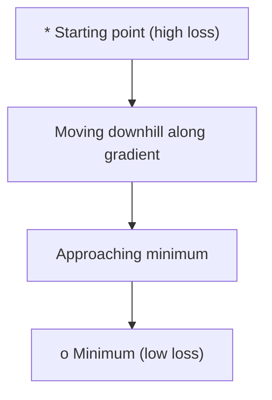
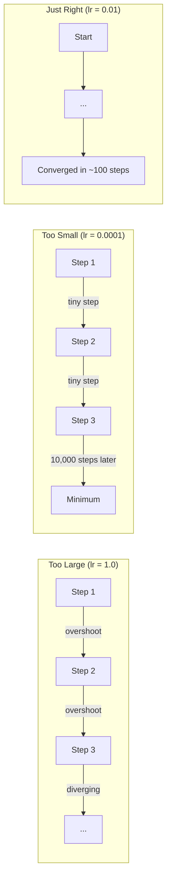
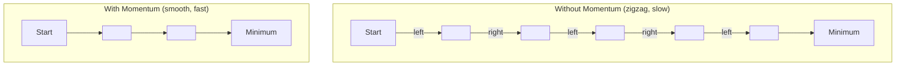
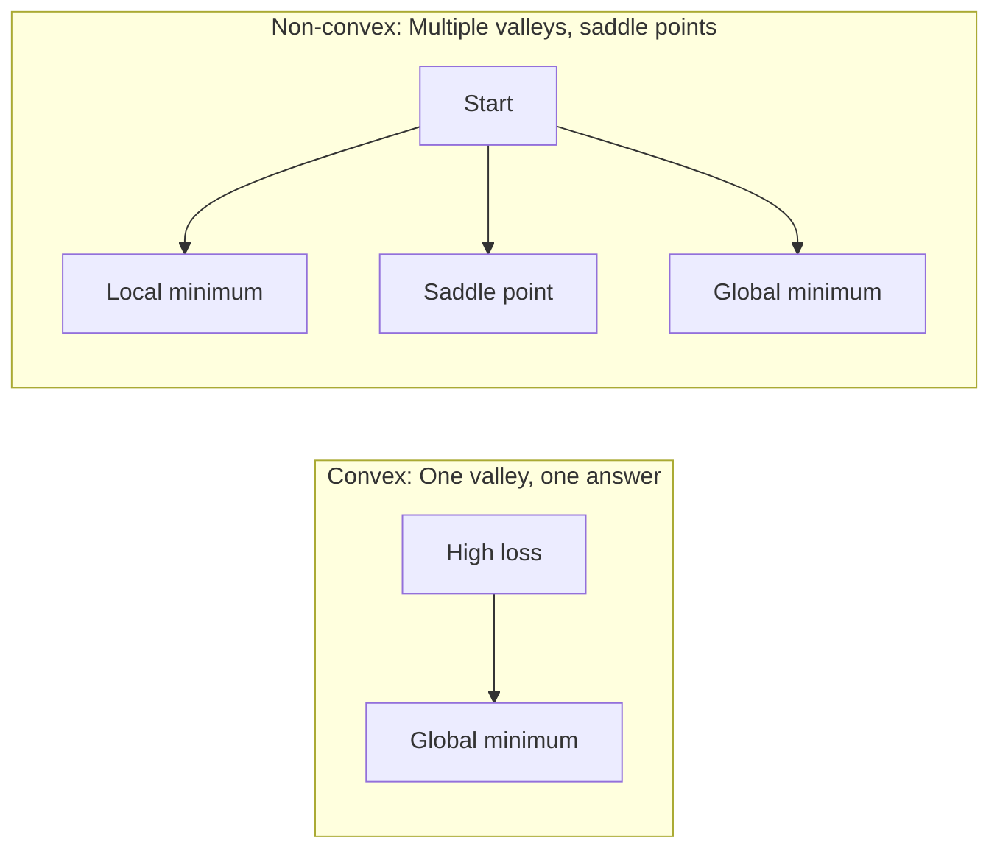
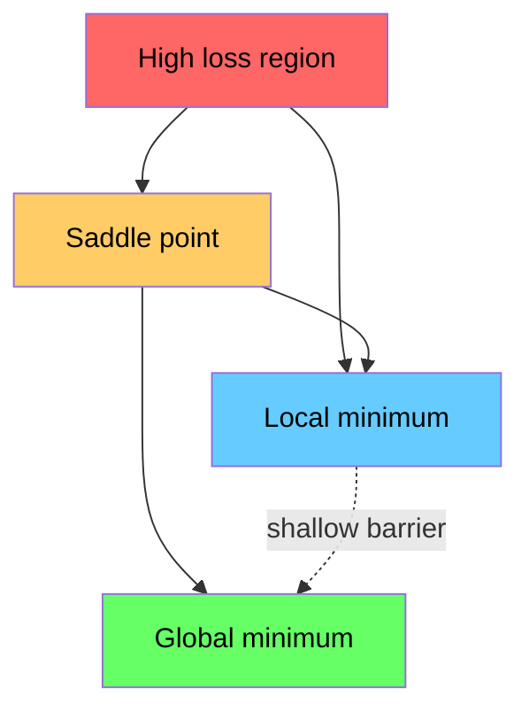

# Optymalizacja

> Trening sieci neuronowej to nic innego jak znalezienie dna doliny.

**Typ:** Kompilacja
**Język:** Python
**Wymagania wstępne:** Faza 1, Lekcje 04-05 (Instrumenty pochodne, Gradienty)
**Czas:** ~75 minut

## Cele nauczania

- Zaimplementuj zejście z gradientem waniliowym, SGD z impetem i Adama od zera
- Porównaj zbieżność optymalizatora w funkcji Rosenbrocka i wyjaśnij, dlaczego Adam dostosowuje współczynniki uczenia się według wagi
- Odróżniać wypukłe od niewypukłych krajobrazów strat i wyjaśniać rolę punktów siodłowych w dużych wymiarach
- Skonfiguruj harmonogramy szybkości uczenia się (zanik krokowy, wyżarzanie cosinusowe, rozgrzewka) w celu zapewnienia stabilności treningu

## Problem

Masz funkcję straty. Mówi ci, jak błędny jest twój model. Masz gradienty. Mówią ci, w którym kierunku strata jest większa. Teraz potrzebujesz strategii schodzenia w dół.

Naiwne podejście jest proste: poruszaj się przeciwnie do gradientu. Skaluj krok według pewnej liczby zwanej szybkością uczenia się. Powtarzać. To jest zejście gradientowe i działa. Ale „działa” ma zastrzeżenia. Zbyt duża szybkość uczenia się powoduje całkowite przekroczenie doliny, odbijanie się między ścianami. Zbyt mały i czołgasz się w stronę odpowiedzi po tysiącach niepotrzebnych kroków. Uderz w punkt siodłowy i przestaniesz się poruszać, nawet jeśli nie znalazłeś minimum.

Każdy optymalizator w głębokim uczeniu się jest odpowiedzią na to samo pytanie: jak szybciej i pewniej dotrzeć na dno doliny?

## Koncepcja

### Co oznacza optymalizacja

Optymalizacja polega na znalezieniu wartości wejściowych, które minimalizują (lub maksymalizują) funkcję. W uczeniu maszynowym funkcją jest strata. Dane wejściowe to wagi modelu. Trening to optymalizacja.

```
minimize L(w) where:
  L = loss function
  w = model weights (could be millions of parameters)
```

### Zejście gradientowe (waniliowy)

Najprostszy optymalizator. Oblicz gradient straty w odniesieniu do każdego ciężaru. Przesuń każdy ciężarek w kierunku przeciwnym do jego nachylenia. Skaluj krok według szybkości uczenia się.

```
w = w - lr * gradient
```

To jest cały algorytm. Jedna linia.



### Szybkość uczenia się: najważniejszy hiperparametr

Szybkość uczenia się kontroluje wielkość kroku. Determinuje wszystko, jeśli chodzi o zbieżność.



Nie ma przepisu na właściwą szybkość uczenia się. Znajdziesz to poprzez eksperyment. Typowe punkty początkowe: 0,001 dla Adama, 0,01 dla SGD z impetem.

### SGD vs partia vs mini-partia

Zniżanie gradientu waniliowego oblicza gradient w całym zestawie danych przed wykonaniem jednego kroku. Nazywa się to opadaniem gradientowym wsadowym. Jest stabilny, ale powolny.

Stochastyczne opadanie gradientu (SGD) oblicza gradient na pojedynczej losowej próbce i natychmiast wykonuje kroki. Jest głośno, ale szybko.

Zejście gradientowe w mini-partiach dzieli różnicę. Oblicz gradient dla małej partii (32, 64, 128, 256 próbek), a następnie wykonaj krok. Tak naprawdę wszyscy z tego korzystają.

| Wariant | Wielkość partii | Jakość gradientu | Prędkość na krok | Hałas |
|--------|-------|----------------|--------------|-------|
| Partia GD | Cały zbiór danych | Dokładnie | Powolny | Brak |
| SGD | 1 próbka | Bardzo głośno | Szybki | Wysoki |
| Mini-partia | 32-256 | Dobra ocena | Zrównoważony | Umiarkowany |

Hałas w SGD i mini-partiach nie jest błędem. Pomaga uniknąć płytkich lokalnych minimów i punktów siodłowych.

### Momentum: piłka toczy się w dół

Zejście gradientu waniliowego uwzględnia tylko bieżący gradient. Jeśli gradient jest zygzakowaty (często w wąskich dolinach), postęp jest powolny. Momentum rozwiązuje ten problem, gromadząc przeszłe gradienty w członie prędkości.

```
v = beta * v + gradient
w = w - lr * v
```

Analogia: piłka tocząca się w dół. Nie zatrzymuje się i nie uruchamia ponownie przy każdym uderzeniu. Zwiększa prędkość w stałych kierunkach i tłumi drgania.



`beta` (zwykle 0,9) kontroluje ilość przechowywanej historii. Wyższa beta oznacza większy pęd, gładsze ścieżki, ale wolniejszą reakcję na zmiany kierunku.

### Adam: adaptacyjne tempo uczenia się

Różne wagi wymagają różnych szybkości uczenia się. Waga, która rzadko doświadcza dużych wzniesień, powinna podjąć większe kroki, gdy w końcu to nastąpi. Ciężar, który stale doświadcza ogromnych wzniesień, powinien wykonywać mniejsze kroki.

Adam (Adaptive Moment Estimation) śledzi dwie rzeczy na wagę:

1. Pierwszy moment (m): średnia ruchoma gradientów (np. pęd)
2. Drugi moment (v): średnia krocząca kwadratów gradientów (wielkość gradientu)

```
m = beta1 * m + (1 - beta1) * gradient
v = beta2 * v + (1 - beta2) * gradient^2

m_hat = m / (1 - beta1^t)    bias correction
v_hat = v / (1 - beta2^t)    bias correction

w = w - lr * m_hat / (sqrt(v_hat) + epsilon)
```

Kluczowym spostrzeżeniem jest podział przez `sqrt(v_hat)`. Wagi z dużymi gradientami są dzielone przez dużą liczbę (mały efektywny krok). Wagi z małymi gradientami są dzielone przez małą liczbę (duży efektywny krok). Każda waga ma własną adaptacyjną szybkość uczenia się.

Domyślne hiperparametry: `lr=0.001, beta1=0.9, beta2=0.999, epsilon=1e-8`. Te ustawienia domyślne sprawdzają się w przypadku większości problemów.

### Harmonogramy kursów nauki

Stała stopa uczenia się jest kompromisem. Na początku treningu chcesz robić duże kroki, aby robić szybkie postępy. Na późnym etapie treningu chcesz dostroić się do minimum małymi krokami.

Wspólne harmonogramy:

| Harmonogram | Formuła | Przypadek użycia |
|---------|---------|---------|
| Zanik krokowy | lr = lr * współczynnik co N epok | Proste, ręczne sterowanie |
| Rozpad wykładniczy | lr = lr_0 * rozpad^t | Płynna redukcja |
| Wyżarzanie cosinusowe | lr = lr_min + 0,5 * (lr_max - lr_min) * (1 + cos(pi * t / T)) | Transformatory, nowoczesne szkolenie |
| Rozgrzewka + zanik | Liniowy wzrost, a następnie zanik | Duże modele, zapobiegają wczesnej niestabilności |

### Wypukłe i niewypukłe

Funkcja wypukła ma jedno minimum. Zejście gradientowe zawsze je znajduje. Funkcja kwadratowa taka jak `f(x) = x^2` jest wypukła.

Funkcje strat sieci neuronowej nie są wypukłe. Mają wiele lokalnych minimów, punktów siodłowych i obszarów płaskich.



W praktyce minima lokalne w wielowymiarowych sieciach neuronowych rzadko stanowią problem. Większość minimów lokalnych ma wartości strat zbliżone do minimum globalnego. Prawdziwą przeszkodą są punkty siodłowe (płaskie w niektórych kierunkach, zakrzywione w innych). Pęd i hałas wytwarzany przez mini-partie pomagają im uciec.

### Wizualizacja krajobrazu strat

Strata jest funkcją wszystkich wag. W przypadku modelu o masie 1 miliona ciężarów krajobraz strat mieści się w przestrzeni 1 000 001-wymiarowej. Wizualizujemy to, wybierając dwa losowe kierunki w przestrzeni wagowej i wykreślając stratę wzdłuż tych kierunków, tworząc powierzchnię 2D.



Ostre minima słabo generalizują. Płaskie minima dobrze uogólniają. Jest to jeden z powodów, dla których SGD z pędem często przewyższa Adama pod względem dokładności testu końcowego: jego szum zapobiega osadzaniu się w ostrych minimach.

## Zbuduj to

### Krok 1: Zdefiniuj funkcję testową

Funkcja Rosenbrocka jest klasycznym benchmarkiem optymalizacyjnym. Jego minimum znajduje się w (1, 1) wewnątrz wąskiej, zakrzywionej doliny, którą łatwo znaleźć, ale trudno nią podążać.

```
f(x, y) = (1 - x)^2 + 100 * (y - x^2)^2
```

```python
def rosenbrock(params):
    x, y = params
    return (1 - x) ** 2 + 100 * (y - x ** 2) ** 2

def rosenbrock_gradient(params):
    x, y = params
    df_dx = -2 * (1 - x) + 200 * (y - x ** 2) * (-2 * x)
    df_dy = 200 * (y - x ** 2)
    return [df_dx, df_dy]
```

### Krok 2: Zejście gradientowe waniliowe

```python
class GradientDescent:
    def __init__(self, lr=0.001):
        self.lr = lr

    def step(self, params, grads):
        return [p - self.lr * g for p, g in zip(params, grads)]
```

### Krok 3: SGD z impetem

```python
class SGDMomentum:
    def __init__(self, lr=0.001, momentum=0.9):
        self.lr = lr
        self.momentum = momentum
        self.velocity = None

    def step(self, params, grads):
        if self.velocity is None:
            self.velocity = [0.0] * len(params)
        self.velocity = [
            self.momentum * v + g
            for v, g in zip(self.velocity, grads)
        ]
        return [p - self.lr * v for p, v in zip(params, self.velocity)]
```

### Krok 4: Adam

```python
class Adam:
    def __init__(self, lr=0.001, beta1=0.9, beta2=0.999, epsilon=1e-8):
        self.lr = lr
        self.beta1 = beta1
        self.beta2 = beta2
        self.epsilon = epsilon
        self.m = None
        self.v = None
        self.t = 0

    def step(self, params, grads):
        if self.m is None:
            self.m = [0.0] * len(params)
            self.v = [0.0] * len(params)

        self.t += 1

        self.m = [
            self.beta1 * m + (1 - self.beta1) * g
            for m, g in zip(self.m, grads)
        ]
        self.v = [
            self.beta2 * v + (1 - self.beta2) * g ** 2
            for v, g in zip(self.v, grads)
        ]

        m_hat = [m / (1 - self.beta1 ** self.t) for m in self.m]
        v_hat = [v / (1 - self.beta2 ** self.t) for v in self.v]

        return [
            p - self.lr * mh / (vh ** 0.5 + self.epsilon)
            for p, mh, vh in zip(params, m_hat, v_hat)
        ]
```

### Krok 5: Uruchom i porównaj

```python
def optimize(optimizer, func, grad_func, start, steps=5000):
    params = list(start)
    history = [params[:]]
    for _ in range(steps):
        grads = grad_func(params)
        params = optimizer.step(params, grads)
        history.append(params[:])
    return history

start = [-1.0, 1.0]

gd_history = optimize(GradientDescent(lr=0.0005), rosenbrock, rosenbrock_gradient, start)
sgd_history = optimize(SGDMomentum(lr=0.0001, momentum=0.9), rosenbrock, rosenbrock_gradient, start)
adam_history = optimize(Adam(lr=0.01), rosenbrock, rosenbrock_gradient, start)

for name, history in [("GD", gd_history), ("SGD+M", sgd_history), ("Adam", adam_history)]:
    final = history[-1]
    loss = rosenbrock(final)
    print(f"{name:6s} -> x={final[0]:.6f}, y={final[1]:.6f}, loss={loss:.8f}")
```

Oczekiwany wynik: Adam osiąga zbieżność najszybciej. SGD z impetem podąża gładszą ścieżką. Vanilla GD powoli posuwa się wzdłuż wąskiej doliny.

## Użyj tego

W praktyce korzystaj z optymalizatorów PyTorch lub JAX. Obsługują grupy parametrów, zanik masy, obcinanie gradientów i przyspieszanie GPU.

```python
import torch

model = torch.nn.Linear(784, 10)

sgd = torch.optim.SGD(model.parameters(), lr=0.01, momentum=0.9)
adam = torch.optim.Adam(model.parameters(), lr=0.001)
adamw = torch.optim.AdamW(model.parameters(), lr=0.001, weight_decay=0.01)

scheduler = torch.optim.lr_scheduler.CosineAnnealingLR(adam, T_max=100)
```

Praktyczne zasady:

- Zacznij od Adama (lr=0,001). Działa w przypadku większości problemów bez strojenia.
- Przełącz na SGD z pędem (lr=0,01, pęd=0,9), gdy potrzebujesz najlepszej ostatecznej dokładności i możesz sobie pozwolić na większe dostrojenie.
- Użyj AdamW (Adam z oddzielonym zanikiem masy) dla transformatorów.
- Zawsze używaj harmonogramu szybkości uczenia się w przypadku przebiegów szkoleniowych dłuższych niż kilka epok.
- Jeśli trening jest niestabilny, zmniejsz tempo uczenia się. Jeśli trening jest zbyt wolny, zwiększ go.

## Wyślij to

Podczas tej lekcji wyświetlony zostanie monit dotyczący wyboru odpowiedniego optymalizatora. Zobacz `outputs/prompt-optimizer-guide.md`.

Zbudowane tutaj klasy optymalizatorów pojawiają się ponownie w fazie 3, kiedy uczymy sieć neuronową od podstaw.

## Ćwiczenia

1. **Przemiatanie szybkości uczenia się.** Przeprowadź proste opadanie gradientowe w funkcji Rosenbrocka z szybkościami uczenia się [0,0001, 0,0005, 0,001, 0,005, 0,01]. Narysuj lub wydrukuj ostateczną stratę po 5000 krokach dla każdego. Znajdź największy współczynnik uczenia się, który nadal jest zbieżny.

2. **Porównanie pędu.** Uruchom SGD z wartościami pędu [0,0, 0,5, 0,9, 0,99] w funkcji Rosenbrocka. Śledź stratę na każdym kroku. Która wartość pędu zbiega się najszybciej? Które przekroczenia?

3. **Ucieczka od punktu siodłowego.** Zdefiniuj funkcję `f(x, y) = x^2 - y^2` (punkt siodłowy w początku układu współrzędnych). Zacznij od (0,01, 0,01). Porównaj zachowanie wanilii GD, SGD z pędem i Adama. Który wymyka się punktowi siodłowemu?

4. **Zaimplementuj spadek szybkości uczenia się.** Dodaj harmonogram zaniku wykładniczego do klasy GradientDescent: `lr = lr_0 * 0.999^step`. Porównaj zbieżność z rozpadem i bez rozpadu funkcji Rosenbrocka.

## Kluczowe terminy

| Termin | Co ludzie mówią | Co to właściwie oznacza |
|------|----------------|----------------------|
| Zejście gradientowe | „Idź w dół” | Zaktualizuj wagi, odejmując gradient skalowany przez szybkość uczenia się. Najbardziej podstawowy optymalizator. |
| Szybkość uczenia się | „Rozmiar kroku” | Skalar kontrolujący, jak daleko każda aktualizacja przesuwa wagi. Zbyt duża powoduje rozbieżności. Zbyt małe straty obliczeniowe. |
| Pęd | „Ruszaj dalej” | Gromadź przeszłe gradienty w wektorze prędkości. Tłumi drgania i przyspiesza ruch w stałych kierunkach. |
| SGD | „Losowe pobieranie próbek” | Stochastyczne zejście gradientowe. Oblicz gradient na losowym podzbiorze zamiast na pełnym zbiorze danych. W praktyce prawie zawsze oznacza to mini-partię SGD. |
| Mini-partia | „Kawałek danych” | Mały podzbiór danych szkoleniowych (32–256 próbek) użyty do oszacowania gradientu. Równoważy prędkość i dokładność gradientu. |
| Adama | „Domyślny optymalizator” | Adaptacyjne oszacowanie momentu. Śledzi średnie bieżące gradienty i kwadraty gradientów na wagę, aby nadać każdemu ciężarowi własne tempo uczenia się. |
| Korekta odchylenia | „Napraw zimny start” | Pierwszy i drugi moment Adama są inicjalizowane zerem. Korekta odchylenia jest dzielona przez (1 - beta^t), aby skompensować to na wczesnych etapach. |
| Harmonogram kursów nauki | „Zmień lr w czasie” | Funkcja regulująca tempo uczenia się podczas treningu. Duże kroki wcześnie, małe kroki później. |
| Funkcja wypukła | „Jedna dolina” | Funkcja, w której dowolne minimum lokalne jest minimum globalnym. Zejście gradientowe zawsze je znajduje. Straty sieci neuronowej nie są wypukłe. |
| Punkt siodłowy | „Mieszkanie, ale nie minimum” | Punkt, w którym gradient wynosi zero, ale w niektórych kierunkach jest minimalny, a w innych maksymalny. Powszechne w dużych wymiarach. |
| Krajobraz strat | „Teren” | Funkcja straty wykreślona w przestrzeni wag. Wizualizowane poprzez przecięcie wzdłuż dwóch losowych kierunków. |
| Konwergencja | „Dotarcie tam” | Optymalizator osiągnął punkt, w którym dalsze kroki nie zmniejszają znacząco straty. |

## Dalsze czytanie

- [Sebastian Ruder: Przegląd algorytmów optymalizacji gradientu descent](https://ruder.io/optimizing-gradient-descent/) - kompleksowy przegląd wszystkich głównych optymalizatorów
- [Dlaczego Momentum naprawdę działa (destylacja)](https://distill.pub/2017/momentum/) - interaktywna wizualizacja dynamiki pędu
- [Adam: A Method for Stochastic Optimization (Kingma & Ba, 2014)](https://arxiv.org/abs/1412.6980) - oryginalna praca Adama, czytelna i krótka
- [Visualizing the Loss Landscape of Neural Nets (Li et al., 2018)](https://arxiv.org/abs/1712.09913) – artykuł pokazujący minima ostre i płaskie