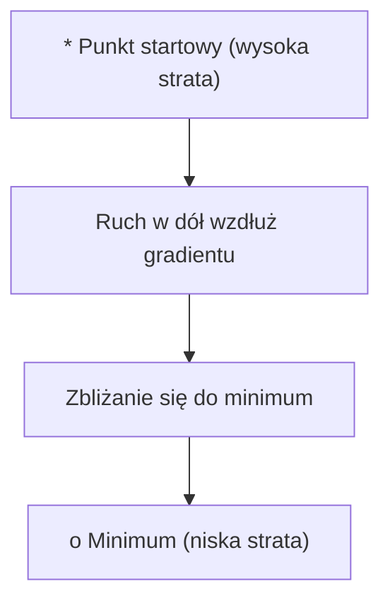
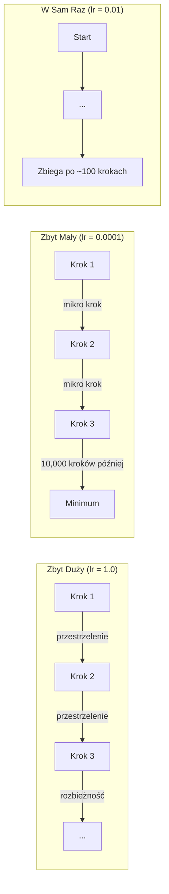
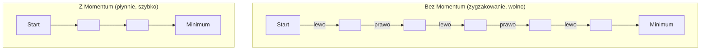
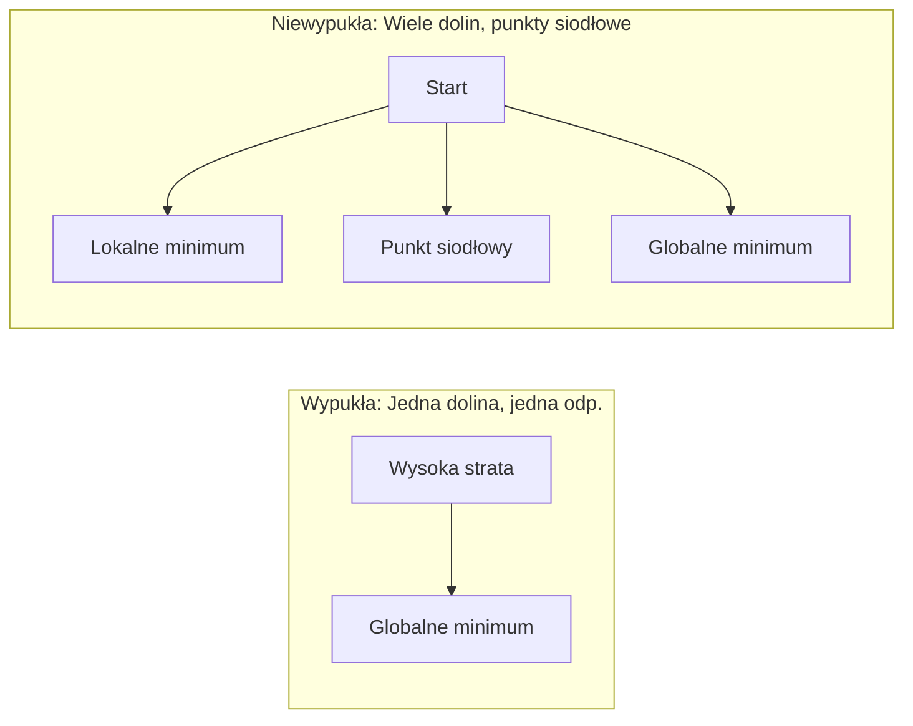
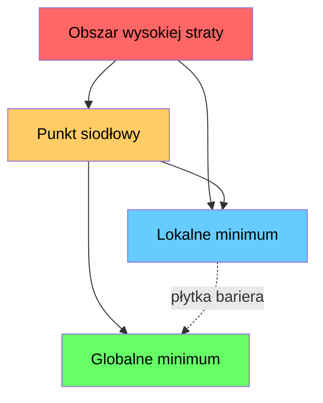

# Optymalizacja

> Trenowanie sieci neuronowej to nic innego jak poszukiwanie dna doliny.

**Typ:** Kompilacja
**Język:** Python
**Wymagania wstępne:** Faza 1, Lekcje 04-05 (Pochodne, Gradienty)
**Czas:** ~75 minut

## Cele nauczania

- Zaimplementować od zera standardowy spadek wzdłuż gradientu (vanilla gradient descent), SGD z momentum i optymalizator Adam.
- Porównać zbieżność optymalizatorów na funkcji Rosenbrocka i wyjaśnić, dlaczego Adam adaptuje współczynniki uczenia się (learning rates) dla każdej wagi osobno.
- Rozróżniać wypukłe i niewypukłe krajobrazy funkcji straty oraz wyjaśniać rolę punktów siodłowych w przestrzeniach wielowymiarowych.
- Konfigurować harmonogramy współczynnika uczenia się (step decay, cosine annealing, warmup) w celu zapewnienia stabilności treningu.

## Problem

Masz funkcję straty. Mówi ci ona, jak bardzo myli się twój model. Masz gradienty. Wskazują one, w którym kierunku strata jest większa. Teraz potrzebujesz strategii, aby zejść w dół.

Naiwne podejście jest proste: poruszaj się w kierunku przeciwnym do gradientu. Skaluj każdy krok o pewną stałą zwaną współczynnikiem uczenia (learning rate). Powtarzaj. To jest metoda spadku wzdłuż gradientu i ona działa. Ale to „działa” ma pewne haczyki. Zbyt duży współczynnik uczenia się sprawia, że całkowicie przeskakujesz dno doliny, odbijając się od jej ścian. Zbyt mały, a będziesz pełzał w stronę odpowiedzi przez tysiące niepotrzebnych kroków. Trafisz w punkt siodłowy, a przestaniesz się poruszać, nawet jeśli jeszcze nie znalazłeś minimum.

Każdy optymalizator w głębokim uczeniu (deep learning) jest odpowiedzią na to samo pytanie: jak dotrzeć na dno doliny szybciej i pewniej?

## Koncepcja

### Co oznacza optymalizacja

Optymalizacja polega na znalezieniu wartości wejściowych, które minimalizują (lub maksymalizują) daną funkcję. W uczeniu maszynowym tą funkcją jest funkcja straty (loss function). Danymi wejściowymi są wagi modelu. Trening jest procesem optymalizacji.

```text
minimalizuj L(w) gdzie:
  L = funkcja straty
  w = wagi modelu (mogą to być miliony parametrów)
```

### Standardowy spadek wzdłuż gradientu (Vanilla Gradient Descent)

Najprostszy optymalizator. Oblicz gradient straty w stosunku do każdej wagi. Przesuń każdą wagę w kierunku przeciwnym do jej gradientu. Przeskaluj krok za pomocą współczynnika uczenia się.

```text
w = w - lr * gradient
```

To jest cały algorytm. Jedna linia.



### Współczynnik uczenia (Learning rate): najważniejszy hiperparametr

Współczynnik uczenia się kontroluje wielkość kroku. W kwestii zbieżności determinuje on wszystko.



Nie ma magicznego wzoru na właściwy współczynnik uczenia się. Odnajduje się go poprzez eksperymenty. Typowe punkty startowe: 0.001 dla Adama, 0.01 dla SGD z momentum.

### Batch vs SGD vs Mini-batch

Metoda Vanilla Gradient Descent oblicza gradient na całym zbiorze danych przed wykonaniem jednego kroku. Nazywa się to wsadowym spadkiem wzdłuż gradientu (Batch Gradient Descent). Jest stabilny, ale powolny.

Stochastyczny spadek wzdłuż gradientu (SGD) oblicza gradient na podstawie pojedynczej, losowej próbki i od razu wykonuje krok. Jest bardzo zaszumiony, ale błyskawiczny.

Spadek wzdłuż gradientu z mini-paczkami (Mini-batch gradient descent) to idealny kompromis. Oblicza gradient dla niewielkiej "paczki" danych (np. 32, 64, 128, 256 próbek), a następnie wykonuje krok. W praktyce wszyscy używają tego podejścia.

| Wariant | Rozmiar paczki (Batch size) | Jakość gradientu | Szybkość kroku | Szum |
|--------|-------|----------------|--------------|-------|
| Batch GD | Cały zbiór danych | Dokładny | Wolny | Brak |
| SGD | 1 próbka | Bardzo zaszumiony | Bardzo szybki | Wysoki |
| Mini-batch | 32-256 | Dobre przybliżenie | Zbalansowany | Umiarkowany |

Szum w metodzie SGD i mini-batch nie jest błędem projektowym (bugiem) — jest funkcjonalnością (feature). Pomaga uniknąć uwięzienia w płytkich minimach lokalnych i wyrwania się z punktów siodłowych.

### Momentum: kula tocząca się w dół

Standardowy spadek wzdłuż gradientu bierze pod uwagę tylko obecny gradient. Jeśli gradient zygzakuje (co często ma miejsce w wąskich dolinach), postęp optymalizacji jest powolny. Momentum (pęd) rozwiązuje ten problem, akumulując historię gradientów z przeszłości w składniku prędkości (velocity).

```text
v = beta * v + gradient
w = w - lr * v
```

Analogia: wyobraź sobie kulę toczącą się w dół wzgórza. Nie zatrzymuje się i nie rusza na nowo na każdej wyboistej przeszkodzie. Buduje prędkość w stałych kierunkach i tłumi wibracje.



Współczynnik `beta` (zwykle 0.9) kontroluje, jak dużo historii uwzględniamy. Wyższa wartość beta oznacza większy pęd, gładszą ścieżkę, ale potencjalnie wolniejszą reakcję na nagłe zmiany kierunku.

### Adam: adaptacyjny współczynnik uczenia

Różne wagi modelu wymagają różnych współczynników uczenia się. Waga, która rzadko doświadcza dużych gradientów, powinna stawiać większe kroki, gdy te w końcu nadejdą. Waga, która nieustannie notuje potężne gradienty, powinna poruszać się ostrożniej i stawiać mniejsze kroki.

Optymalizator Adam (Adaptive Moment Estimation) dla każdej wagi śledzi dwie rzeczy:

1. Pierwszy moment (m): średnia krocząca gradientów (podobnie jak momentum)
2. Drugi moment (v): średnia krocząca kwadratów gradientów (rozmiar/wielkość gradientu)

```text
m = beta1 * m + (1 - beta1) * gradient
v = beta2 * v + (1 - beta2) * gradient^2

m_hat = m / (1 - beta1^t)    korekta obciążenia (bias correction)
v_hat = v / (1 - beta2^t)    korekta obciążenia

w = w - lr * m_hat / (sqrt(v_hat) + epsilon)
```

Głównym założeniem jest podzielenie przez `sqrt(v_hat)`. Wagi o dużych wartościach gradientów są dzielone przez wielką liczbę (dając mały efektywny krok uczenia). Wagi z małymi gradientami są dzielone przez małą liczbę (duży efektywny krok uczenia). W ten sposób każdy parametr posiada własny i adaptujący się współczynnik uczenia.

Domyślne hiperparametry to `lr=0.001, beta1=0.9, beta2=0.999, epsilon=1e-8`. Parametry te spisują się wręcz niesamowicie dobrze dla przytłaczającej większości problemów z obszaru uczenia maszynowego.

### Harmonogramy współczynnika uczenia (Learning Rate Schedulers)

Utrzymywanie stałego współczynnika uczenia się przez cały czas to kompromis. Na początku procesu trenowania pożądane są duże kroki dla wykonania silnego postępu. Z kolei podczas końcowych faz, celem powinno być subtelne precyzyjne dostrajanie optymalnego minimum za pomocą bardzo malutkich kroków.

Popularne mechanizmy harmonogramowania (schedulery):

| Harmonogram | Formuła | Scenariusz użycia |
|---------|---------|---------|
| Skokowy spadek (Step decay) | lr = lr * factor co każdą partię N epok | Prosta kontrola manualna |
| Spadek wykładniczy (Exponential decay) | lr = lr_0 * decay^t | Bardzo gładka redukcja |
| Wyżarzanie kosinusowe (Cosine annealing) | lr = lr_min + 0.5 * (lr_max - lr_min) * (1 + cos(pi * t / T)) | Transformery, współczesne szkolenia deep learning |
| Rozgrzewka (Warmup) + Spadek (Decay) | Liniowy przyrost od 0, a następnie spadek | Zastrzeżone do potężnych modeli dla prewencji startowej niestabilności optymalizatorów. |

### Wypukłe i niewypukłe (Convex vs Non-convex)

Funkcja wypukła (convex) posiada absolutnie jedno wyłączne minimum. Rozwiązanie takie odnajduje się za pomocą gładkiego zbiegnięcia gradientem bez jakichkolwiek problemów. Formuła kwadratowa taka jak `f(x) = x^2` jest doskonałym odzwierciedleniem klasycznej wypukłości.

Niemniej jednak, funkcje straty używane przy potężnych sieciach neuronowych są zawsze niewypukłe. Zawierają one multum lokalnych minimów, skomplikowanych punktów siodłowych oraz rozciągających się, bardzo płaskich płaskowyżów.



W zastosowaniach praktycznych, istnienie dołów jako minimów lokalnych rzadko stanowi dla sieci we współczesnym Deep Learningu realne niebezpieczeństwo. Zwykle straty w minimach lokalnych oferują niemal identyczne do wyników z minimum globalnego estymacje i marginesy błędu. Przeszkodą prawdziwą są z kolei punkty siodłowe. Obszary siodłowe są idealnie płaskie w niektórych swoich kierunkach wektorowych wymiarów, a jednocześnie całkowicie zakrzywione w przeciwnych orientacjach. Składnik pędu z momentum oraz zakłócenia dostarczane przy przetwarzaniu za pomocą mini-batchy, wyśmienicie pozwalają na wyzwolenie optymalizatorów z więzienia takich punktów.

### Wizualizacja krajobrazu funkcji straty (Loss Landscape)

Funkcja straty rozkłada się jako wektor wyników dla absolutnie każdego ze zgromadzonych w architekturze wag. Sieć złożona tylko z 1 miliona wariantów parametrów formuje teren funkcji o łącznej przestrzeni do przebrnięcia równej 1,000,001 wymiarów. Skuteczna percepcja wizualna na tych wykresach uzyskiwana jest ze zwykłego selektywnego pobrania zaledwie 2 kierunkowych wektorów przestrzennych z całej populacji wag, umożliwiając stworzenie 2-wymiarowej siatki pokazującej kształt krzywizn na klasycznej i zrzutowanej do postaci 2D mapy ukształtowania wzniesień.



Minima cechujące się mocną, smukłą "ostrością" najzwyczajniej zniekształcają generalizację i mają na zewnątrz słabsze wyniki. Z kolei minima o bardzo łagodnej strukturze i ukształtowaniu (płaskie) oferują fantastyczną generalizację pod dane zewnętrzne (out-of-box). Odkryto w taki sposób jedną z teorii tłumaczących jak i dla kogo metoda opierająca optymalizację algorytmem SGD + momentum tak powszechnie i nieznacznie deklasuje sławnego rywala o tytule optymalizatora Adama. Ten specyficzny wprowadzany na surowo u niego hałas uniemożliwia wchodzenie i zadomowianie w niezwykle wąskie strefy gęstych punktów minimalnych.

## Zbuduj to

### Krok 1: Zdefiniuj funkcję testową

Słynna ze świata obliczeń funkcja Rosenbrocka służy w dzisiejszych analizach jako kluczowy standard w świecie testów dla walidacji efektywności każdego silnika z narzędzi pod optymalizację. Funkcja posiada minimum skupione dla osi lokalizujących układ dla `(1, 1)` a jej wnęki to nieustannie meandrujące doliny bardzo często niezwykle ciężkie z uwagi na budowę do pokonania i utrzymania równego trajektorium dla większości prymitywnych form estymacji z matematyki.

```text
f(x, y) = (1 - x)^2 + 100 * (y - x^2)^2
```

```python
def rosenbrock(params):
    x, y = params
    return (1 - x) ** 2 + 100 * (y - x ** 2) ** 2

def rosenbrock_gradient(params):
    x, y = params
    df_dx = -2 * (1 - x) + 200 * (y - x ** 2) * (-2 * x)
    df_dy = 200 * (y - x ** 2)
    return [df_dx, df_dy]
```

### Krok 2: Spadek wzdłuż gradientu (Vanilla GD)

```python
class GradientDescent:
    def __init__(self, lr=0.001):
        self.lr = lr

    def step(self, params, grads):
        return [p - self.lr * g for p, g in zip(params, grads)]
```

### Krok 3: SGD z momentum

```python
class SGDMomentum:
    def __init__(self, lr=0.001, momentum=0.9):
        self.lr = lr
        self.momentum = momentum
        self.velocity = None

    def step(self, params, grads):
        if self.velocity is None:
            self.velocity = [0.0] * len(params)
        self.velocity = [
            self.momentum * v + g
            for v, g in zip(self.velocity, grads)
        ]
        return [p - self.lr * v for p, v in zip(params, self.velocity)]
```

### Krok 4: Adam

```python
class Adam:
    def __init__(self, lr=0.001, beta1=0.9, beta2=0.999, epsilon=1e-8):
        self.lr = lr
        self.beta1 = beta1
        self.beta2 = beta2
        self.epsilon = epsilon
        self.m = None
        self.v = None
        self.t = 0

    def step(self, params, grads):
        if self.m is None:
            self.m = [0.0] * len(params)
            self.v = [0.0] * len(params)

        self.t += 1

        self.m = [
            self.beta1 * m + (1 - self.beta1) * g
            for m, g in zip(self.m, grads)
        ]
        self.v = [
            self.beta2 * v + (1 - self.beta2) * g ** 2
            for v, g in zip(self.v, grads)
        ]

        m_hat = [m / (1 - self.beta1 ** self.t) for m in self.m]
        v_hat = [v / (1 - self.beta2 ** self.t) for v in self.v]

        return [
            p - self.lr * mh / (vh ** 0.5 + self.epsilon)
            for p, mh, vh in zip(params, m_hat, v_hat)
        ]
```

### Krok 5: Uruchom i porównaj

```python
def optimize(optimizer, func, grad_func, start, steps=5000):
    params = list(start)
    history = [params[:]]
    for _ in range(steps):
        grads = grad_func(params)
        params = optimizer.step(params, grads)
        history.append(params[:])
    return history

start = [-1.0, 1.0]

gd_history = optimize(GradientDescent(lr=0.0005), rosenbrock, rosenbrock_gradient, start)
sgd_history = optimize(SGDMomentum(lr=0.0001, momentum=0.9), rosenbrock, rosenbrock_gradient, start)
adam_history = optimize(Adam(lr=0.01), rosenbrock, rosenbrock_gradient, start)

for name, history in [("GD", gd_history), ("SGD+M", sgd_history), ("Adam", adam_history)]:
    final = history[-1]
    loss = rosenbrock(final)
    print(f"{name:6s} -> x={final[0]:.6f}, y={final[1]:.6f}, strata (loss)={loss:.8f}")
```

Oczekiwany rezultat: Optymalizator Adam najszybciej znajduje i osiada na oczekiwanym punkcie minimalnym dla problemu. Algorytm w konfiguracji wspieranej modułem SGD plus mechanizmem momentum śmiało zasuwa najwygodniej spływającą wzdłuż z najmniejszymi stratami prostą ścieżką do celu bez większych oscylacji i falowań z wyznaczanym azymutem wektorowym. Podstawowy Vanilla Gradient Descent to powolne wleczenie przez najdrobniejsze niuanse ze zwężającego dna w labiryncie funkcji doliny.

## Wdrożenie

W środowisku docelowym będziesz nieodłącznie korzystać z zoptymalizowanych pod biblioteki natywne frameworków PyTorch i JAX. Oprócz wydajności odciągną i zdejmą one nie tylko żmudną ręczną potrzebę manualnego implementowania na każdą z warstw pod grupowe i selektywne przypięcie hiper-parametryzowania dla odpowiednich grup współczynników, mechanizmy odcinania wybuchowych skoków na gradientach zjawiska clipping gradient ale dodadzą z potężnym odblokowaniem przepustkę do wsparcia wyliczeń prosto ze sterowników pod wykorzystanie na ogromnych wielowątkowych blokach kart z serii akceleratorów pod instrukcję z bibliotek GPU.

```python
import torch

model = torch.nn.Linear(784, 10)

sgd = torch.optim.SGD(model.parameters(), lr=0.01, momentum=0.9)
adam = torch.optim.Adam(model.parameters(), lr=0.001)
adamw = torch.optim.AdamW(model.parameters(), lr=0.001, weight_decay=0.01)

scheduler = torch.optim.lr_scheduler.CosineAnnealingLR(adam, T_max=100)
```

Złote reguły prosto z rzemiosła (rules of thumb):

- Jeśli stoisz w punkcie zero to zaufaj opcji z optymalizatorem Adam ucinając parametry z ustawioną z góry poprzeczką i limitem narzuconego na bezpieczny margines startowy okna `lr=0.001`. Jest najbardziej elastyczny i powszechnie dowozi projekt pomimo zaprzestania jakichkolwiek manewrów na ustawieniach w najróżniejszym i na wejściu od rzutu okiem zupełnie niewinnym bez obciążeniowym spektrum na projekty uczeniowe ML z niemal pudełka.
- Poza testowymi przebiegami spróbuj pokusić się o uruchomienie SGD wraz nałożonym pędem do wsparcia `(lr=0.01, momentum=0.9)`, przy warunkowym postawieniu sobie i spełnieniu kryterium dążenia do absolutnego podbicia od sztywnego maksimum statystyki z najwyższej i wymaksowanej do precyzji wariancji oceny jakości i rzutu, przy zważeniu że gotów byłbyś do nadkładania sporych porcji wolnego okienka przeznaczonego czasowo i poświęconego dodatkowo i do zacięcia na finezyjnym masterowaniu przy dostrajaniu i dokręcaniu silnika na precyzyjnych śrubkach.
- Przy każdym dotknięciu architektury pochodzącej ze szlachetnej krwi na drzewie architektonicznym z modelu transformer, to wymogiem bywa narzucenie do prac wykorzystania specyficznego odpowiednika pod postacią optymalizatora AdamW (Jest to standardowy klasyczny Adam ulepszony inżyniersko o zdekompilowany na twardo spadek na obciążnikach / decoupled weight decay).
- Niejawną dla każdego architekta zaszytą we krwioobiegu dla poprawności rzemieślniczej i profesjonalnej na trenowaniu projektów, obowiązkiem bezkompromisowym jest rygor zawsze egzekwowanego doposażenia algorytmiki uczenia i estymowania o nałożony bezwarunkowo harmonogram do kalibracji wspołczynnika kroku postępu, w testach wykraczających objętościowo ramy kilku jednorazowych, najkrótszych, płytkich iteracji z kilkoma naście czy w parunastu pojedynczych, rzuconych przebiegach na szybkim okienku liczby epok testowych.
- Maszyna zaczyna wyrzucać ostrzeżenia podczas optymalizacji, a straty skaczą szaleńczo po osi wykresów - bez zwłoki i drastycznie redukuj okienko do estymacji przytępiając jego szybkość współczynnika. Analizowana strata toczy kroki naprzód, a wykres drgnie ale zbyt oszczędnie z każdą przebiegniętą o minione metry próbą badawczą dla epoki — obróć strategię z wektorem akcji odwrotną i z wyczuciem przywróć otwarte granice zwiększając próg uśrednionego współczynnika rzędu `lr`.

## Wdrożenie

Podczas tej lekcji wyświetlony zostanie poradnik (prompt) dotyczący wyboru odpowiedniego optymalizatora w zależności od napotkanego scenariusza. Zobacz plik `outputs/prompt-optimizer-guide_pl.md`.

Zbudowane tutaj od podstaw klasy optymalizatorów pojawią się ponownie w Fazie 3, kiedy będziemy budować własną sieć neuronową od zera do bohatera (from scratch).

## Ćwiczenia

1. **Przeszukiwanie siatki dla współczynnika uczenia się.** Przeprowadź standardowy spadek wzdłuż gradientu (Gradient Descent) na funkcji Rosenbrocka dla różnych współczynników uczenia się: `[0.0001, 0.0005, 0.001, 0.005, 0.01]`. Narysuj wykres lub wydrukuj w konsoli stratę docelową uzyskaną po wykonaniu okrągłych testowych uderzeniach z pakietem 5000 iteracyjnych cykli w testowanej probówce z algorytmiką prób badawczych w każdej opcji parametru dla szybkości `lr` by uśrednić je. Sprawdź organoleptycznie i podejmij z analiz odpowiednią próbę wskazania odnalezionej absolutnie najwyższej zaobserwowanej skutecznie wybranej szybkości parametru z uczenia zachowującego mimo to stałość przybliżenia w testach pod minimalny wierzchołek punktacji z wariacją i konwergencją opartą z optymalnym rozwiązaniem.
2. **Siła wsparcia przez momentum.** Odpal przebiegi SGD naprzemiennie na modyfikowanym testowo zaaplikowanym czynniku pędu (momentum) oscylując po liście wartości rzędu z progu z listy wynoszących np.: `[0.0, 0.5, 0.9, 0.99]` nad modelem obciążeń optymalizacji pod wektor na płaszczyznach Rosenbrocka. Skrupulatnie kataloguj pomiary o zachowaniu spadków funkcji optymalizowanych w wyliczonym biegu nad utratą punktacji optymalizacyjnej `loss` mierzonej krok w krok pod testowy obieg każdej iteracji. Wykaż konkretnie na analizach - jak oszacowana modyfikacja na momentum przyspiesza konwergencję do wyników do stacji końcowej jako absolutnie na pierwszym oszacowanym pomiarze kończąc i zaliczając zadanie z wyznacznikiem z najniższym i najrzadszym błędem obciążeń w teście konwergencyjnym oraz który ze wspieranych testów pędu prześciga dno doliny i rażąco wylatuje poza trajektorię (tzw. zjawisko z ang.: overshoot).
3. **Ucieczka z mackami po za punkt na siodle.** Zainicjuj ukształtowanie dla nowego i sztucznie wgranego terenu wygenerowanego i opisanego poprzez równanie jako na przykład: `f(x, y) = x^2 - y^2` (posiadającej punkt z zakrzywionym ekstremum lokalnym, znanym w branży punktem w postaci i lokalizacji ulokowanej po siodle centralnie o obszarze dokładnie równym umiejscowieniu z 0 współrzędnymi wokół przestrzeni osiowej z parametrem wprost w początku i źródle pomiarowego z ukształtowaniem ze współrzędnych osiowych `[0,0]`). Postaw punkt zaczepienia badającego podróżnego startera statystycznego obok w sąsiedztwie tego dołka pod wariant oszacowanej koordynacji umiejscowiony dokładnie dla przestrzennego wektora rzutowania 2-osiowej planszy dla punktu z wartości i umiejscowienia z wektorowym rzuceniem opcji obok pod wspołrzedne opisane wygenerowanym pozycjonowaniem: `(0.01, 0.01)`. Prześledź, obserwuj i spisz z wyłapaną percepcją i różnicą i zestaw po wszystkim wnioski po zebraniu różnic zachowawczych zaobserwowanych przy zachowaniach na starych wariantach Vanilla GD, wraz ze wsparciem dodanym przez silny optymalizator testowy dla parametru SGD wyposażonym z asystentem w pędzie pędu na momentum we wzorcu i test opcji wspierającej z wyśmienitym standardowym i docelowym faworytem z wytycznymi na wejście po algorytm klasycznego sprawdzonego estymującego i wygładzonego badawczego od modela o tytułowej nazwie do optymalizatora jako Adam. Zdiagnozuj z dokładną i nieomylną skrupulatnością który optymalizator bezproblemowo wylewa się na bok, spadając skutecznie staczając się ze żlebu grawitacyjnego tego kłopotliwego z definicji na mapach przestrzeni dla testów obszaru o niejednorodnym pochyleniu na powierzchni dla dołujących punktów powiązanych i uwięzionych na punkcie siodłowym.
4. **Własna domowa implementacja osłabianego modułu rozkładów i stępionego tempa.** Wyciągnij w celach przeróbek obiekt w kodzie powiązanego ściśle w implementację GradientDescent a następnie wepnij go i dobuduj logikę, która pozwala operacyjnie dorzucić na plecy funkcji implementacji dodatek wzbogacający proces badawczy z wplecionym pod niego ze zwykłym skryptem planującym by po nim opadać krzywą statystyczną poprzez obniżanie systematyczne wyjściowego startowego parametru w oparciu na wykładnicze ubywanie siły (tzw z branży - exponential decay) na skrypt opisywanego modelu przy pomocy i posługując się wykreowanym dopisanym modyfikatorem funkcji wejściowej skryptu algorytmu jako dodany wskaźnik i narzucony nowy limit o wyliczanej docelowej narzucanej regule aktualizacyjnej liczonej wzorem na postawie skryptowanej prostej linijki algorytmu: `lr = lr_0 * 0.999^step`. Poczuj po załączonych raportach statystycznych do wpięcia, namacalne różnice z widocznie uwidocznioną zbieżnością w optymalizatorze bez i z doczepionym zjawiskiem "rozpadu / osłabienia", zaobserwowanym ze wglądów przy obserwacji postępów statystycznych zachowań w przypadku z testowanym obciążeniem podczas analizy wykresów spadkowych testowanego standardu rynkowego od trudnego w diagnozowaniu, wielopoziomowego zadania i problemu na płaszczyznach punktowych testowanych po rozpisanej funkcji z modelu opisanego mianem matematycznego wyzwania od wielkiego badacza o nazwie Rosenbrocka.

## Kluczowe terminy

| Termin | Co ludzie mówią | Co to właściwie oznacza |
|------|----------------|----------------------|
| Spadek wzdłuż gradientu (Gradient Descent) | „Idź w dół” | Iteracyjne aktualizowanie wag, odejmując od nich wektor gradientu przeskalowany o rozmiar współczynnika uczenia. Podstawa niemal każdego silnika optymalizującego. |
| Współczynnik uczenia się (Learning Rate) | „Rozmiar kroku” | Skalar definiujący, jak bardzo każda z podjętych prób pcha wagi na drodze testowania do stacji końcowej. Ustawienie parametru ze zbyt rozszalałą pewnością napędza całkowitą utratę optymalnej konwergencji rozbieżności. Okienka wyznaczane drastycznie małymi i ostrożnie niepewnymi szacowaniami powoduje żmudną obciążającą bezcelowo w badaniach dla maszyn po bezbrzeżnym ugrzęźnięciu i trwonieniu prądu i wirtualnie liczonej mocy z prądem w węzłach marnując procesorową architekturę do zbędnych obliczeń nad nic nie znaczącą do przodu matematyką. |
| Pęd (Momentum) | „Rozpędź się i jedź” | Narzutowa warstwa zapamiętująca przeszłość spływów na krzywych oszacowanych wektorowo pod gradientem skumulowanych w paczkach jako wartość wektora nadającym dodatkowy przyspieszający parametr o typowej klasie jak "velocity". Rewelacyjnie kasuje, minimalizuje oraz likwiduje trzęsawki powstrzymując denerwujące wężykowate, wibracyjne uciążliwe rzucanie pomiaru kierunku i napędza do zwiększenia docelowych ruchów pchając go szybciej po konkretnych w miare płaskich ukształtowaniach na wyprofilowanych rynienkach bez większych kłopotów do przodu we wskazanych obieranych jednolitych ukierunkowaniach wektora przy docelowym poruszaniu gładką masą we właściwy cel pomiarów. |
| SGD (Stochastyczny spadek wzdłuż gradientu) | „Losowe strzelanie” | Przeobrażona z klasycznych narzędzi sprytna i potężna odmiana klasycznego spadku GD, nie pożerająca całego narzuconego na niego zbioru podczas jednorazowych, pożerających wielkie wolumeny i terabajty w RAM z wejścia za jeden test. Przelicza od teraz gradient tylko celując test po oszacowanym w miarę reprezentatywnym podzbiorze, bez uwzględnienia totalnej próbki o całych danych pobranych z plików. Od teraz dla wszystkich modeli produkcyjnych utarło się, by w domyśle jako "SGD" mieć docelowo wyłączne i całkowicie sklasyfikowane rynkowo znaczenie pod dedykowanym na małe partie silnikiem znanym fachowo mianem Mini-batch SGD. |
| Mini-paczka (Mini-batch) | „Garstka danych” | Pudełko skompresowanych pobranych na test do maszyny z drobnym udziałem od ogólnych zebranych przez badaczy masowych wyników wielkich tabel dla danych z bazy pomiarowej i trenowanych z zebranym rzędu najczęściej od 32 do max 256 spakowanych jako plik danych służących próbnie pod wsad z jednorazowego szybkiego precyzyjnie wykonanego pchnięcia oszacowania obciążeń kierunkowych z narzuconego dla wektora ze współczynnikiem na optymalizowanym nachyleniu pod gradientem. Przejmuje to co rewelacyjne pomiędzy wyścigową szybką estymacją i rewelacyjnie dokręca wiarygodną dokładność trafionych estymat z jakościowo odrzucanym głośnym tłem zakłóceń dla wzniesień. |
| Adam | „Domyślny gość od uczenia” | Wariant rozbudowanego narzuconego asystenta dopasowania parametrów ze standardu znanego w nazwie jako pełnowymiarowo do ujęcia (Adaptive Moment Estimation). Buduje zaplecze szpiegujące pod zbierane pomiary dla śledzenia we wskazaniach z wykresami jako notowane estymatory pod uśrednione zliczone wyliczone przebiegi dla klasycznych spadających z gradientami zachowań by uściślić po nich i potęgując je w wielkich liczbowo pod wyliczone kwadraty rzędu na wektorowych wstrząsach po badaniach zaobserwowanych przy szacowaniach pod każdy wchodzący test i oddzielnie precyzyjnie nadaną każdej testowanej i sprawdzanej badawczo wadze sieci w systemach do uczenia. Od tych rzutów to ten genialny system asystencki nada dla optymalizowanych parametrów samodzielnie pod jego wejścia ukształtowany idealnie, wymodelowany autorski dedykowany osobiście uderzony po wymiarowej miarce celujący z odpowiednim przydziałem w wyznaczone tempo docelowego współczynnika uczącego nad modelem dla sieci dla testów pod obciążenia poszczególnych pod-wskaźników i punktów w warstwach by dopieścić ich w zjawiskowo uśrednioną estymatą uczeniową i szybko dowożąc je z konwergencją do bazy. |
| Bias correction (Korekta dla obciążenia przy zerowym odpaleniu) | „Recepta z ubezpieczenia pod zimny start” | Parametr opisujący tzw na pomiarze "Moment Pierwszy i Drugi" badanych wartości dla silnika modelu od sławnego Optymalizatora Adam, jest w algorytmach od momentu samego wgrania pliku sztywno dla wejścia zainicjalizowany rzędem zer. Poprawka (Bias correction) o wskaźnik jako współczynnik podzielony wynikiem otrzymanym z równania rozpisanego mianem algorytmu do `(1 - beta^t)` służy rygorystycznie i pozwala systemowo jako kompensator o stabilizację drgania wykrzywień podczas tych niespokojnych na początku pierwszych minut, czy z dziesiątek wstępnych próbnych wejść na surowo na rozkręcane ze startowego piku przy odpalaniu z zerowej bariery w modelach do oszacowania wstępnych prób by wczesne fazy z uczenia ustawiły poprawną bezpieczną formę zachowań nie wysadzając od samego rozpoczęcia i przed zniszczeniem pod optymalizator wyuczenia testowego całej maszyny do analiz i w modelu badawczym. |
| Harmonogram do estymaty w optymalizacji (Learning rate scheduler) | „Regulator zmian na dynamikę w parametrach docelowego testowania lr w trakcie rozbiegu z epokami” | Moduł wprowadzany funkcyjnie pod oszacowanie i dynamiczne dokręcanie dla precyzyjnego spowalniania narzuconych szacunków optymalnego tempa dla wspołczynnika kroczącego na testowanej bazie danych przy trenowaniu i ewolucji oznaczonych wskaźnikami pod uczącą algorytmikę. Rewelacyjne i ogromne drastyczne i odważne skoki z kroków pośpiesznych z nałożonym zrzucaniem balastu w celu odpalenia wyników i przyspieszenia uczenia nad epoką początkową do przeskoczeń a z nastaniem u kresu zaawansowania cyklu, uderzanie i zmiana do przejścia już po skokach opieranych dla drobnych milimetrowych ostrożnych prób podczas późniejszej końcowej wyregulowanej fazy stabilizacji dla optymalnego znalezienia idealnego w gęstwinie dłubanych mikroskopijnie drobiazgowo punktów minimów pod wyniki testowe sieci. |
| Wypukła struktura pod ukształtowanie dla straty z testów w architekturach badawczych | „Klasyczna dolina punktowa z miską” | Równanie opisujące strukturę architektoniczną w wyliczonym i badanym rejonie powierzchni opisywanym przez równanie f(x), dla jakiej na wykresie każdorazowo odnalezione dno na docelowym i najniżej zapisanym umiejscowionym rzędzie wyników minimalizowanych do najniższej wyłapanej bazy - minimum - opisanego pod minimalne z estymacji lokalnej jest równe, i potwierdzone bycia tym bez-apelnacyjnym głównym, powołanym na mapę w odczytach wyśnionym mianem globalnego optimum do dolnego pułapu wyników na najniższych minimalizacjach w badaniach z ukształtowania z funkcji przestrzeni i na jej wynikowej architekturze obciążeń. Standardowy klasyczny prosty silnik dla Vanilla ze spadku gradientem (Gradient Descent) bezkompromisowo za absolutnie zawsze każdego przetestowanego wejścia skutecznie je lokalizuje do spodu na zrzuceniu błędu. Odmiennie, uwarunkowania co do testów budowy na mapowaniu funkcji błędu od zbadanych modeli testowych i ze strat od pomiaru badawczych potężnie i skomplikowanie tworzonych po Deep Learning pod zróżnicowanych zawiłościach rzeźby budowanych potężnych węzłów połączonych Sieci Neuronowych NIE klasyfikują się pod ramy do założeń co do idealnie regularnego zjawiska funkcji klasycznych, ułożonych, i w testowanych mapach powszechnie uznawanego z map rzędnych po wykresach z rzeźbą dla terenu na parametr matematyczny idealnie i całkowicie - od wypukłych form pod funkcje gładkie. |
| Punkt na rozkładach siodła (Saddle point) | „Zwodniczy płaskowyż dający błędne iluzje i odczucia pozornego dotarcia i zadomowienia w dnie lokalnym” | Charakterystyczne po badaniach zakrzywienie w wielowymiarowej przestrzeni obarczonej punktacyjnym miejscem zwodniczego wygaszania pomiarowych wyników docelowych strat o gradientach zamrożonych o rzędnej pod wynik docelowy na wyzerowanych z wektora = zero - sprawiający poczucie złapania zbadanego punktu rzekomego w minimum błędu. W badanych poszczególnych wyliczanych ukształtowaniach na punktach wektorowych ze składowych wymiarów rzuca złudne pożądane przez analityków statystycznie wypłaszczone zagłębienie o naturze ze szczytu na płasko od wylewu docelowego minimów - a obróciwszy o krzywizny osi do odwróconych odwrotnie do przodu kierunków o kierunki przeciwnie w analizach punktuje ucieczkę po zakrzywieniu uwarunkowanym na krzywej wypukłościami do kształtu na maksimum i skaczącymi gwałtownie zboczami ku krawędziom z wzniesień. Klasyczny zwiastun rzeźbiący potężne zatory i kłopoty napotykane dla uwięzionych silników na klasycznych przestrzeniach w operacjach wymierzanych nad analizą wielo i bogato set-wymiarowych obszarów obliczeniowych z modeli o badaniach AI. |
| Krajobraz ukształtowany w ubytkach / loss architecture (Loss landscape) | „Rzeźba grawitacyjna na tereny wyznaczające punkty szczytów z karotowania ukształtowania dla dolin punktacji od błędów ze straty badawczej” | Niesamowita graficznie rozłożona ukształtowanym rysunkiem obrysowana gładkim rzeźbieniem do zobrazowania i naniesiona z wynikiem precyzyjnie matematycznie, mapowana wykresem architektoniczna bryła w terenie ze strat wewnątrz całego wolumenowo zapisanego trójwymiarowego i testowanego skompilowanego wolumenu obciążeń dla poszukiwań bazy danych wszystkich przeliczonych kombinacji ze wszystkich zarejestrowanych wag przy modelowaniu dla optymalizacji po punktację testową w Sieci. Obrazowana pod kątem poznania map poprzez weryfikujące poprzeczne cięcie ze zrzutu wektorowego naniesionego na wektory pod dwa losowe, docelowo wymuszone dla analiz badanych wektorów losowo wybranych odczytów by utworzyć wyliczone wzdłuż punktów kierunkowych krzywych przekrojów. |
| Ostateczna testowana konwergencja i skupienie błędów pod zbieżnością w wynikach (Convergence) | „Finał przy mecie podróżnika ze statystyką w teście analiz po wdrożeniach badawczych” | Silnik dla procedury docelowej na analizie z wykorzystania estymat i uruchomionych algorytmicznie testowo pakietów dla analiz od modelu Optymalizatora przebił i szczęśliwie przedarł docelowy wierzchołek punktacyjny - udowadniając zatrzymanie i potwierdzone przybycie modelu do testowanej optymalizowanej bazy i punktu na mapie o predykcjach, pod którym żadne więcej wysilone do bólu napędzające i z wykrwawieniem kolejne testowane kroki w bieżących pętlach i estymatorach obciążeń nie napędzają do zbicia wyliczonych z modelu punktów straty z licznika poniżej testów w widoczny i znaczący wysoce procentowym postępem poprawy skok uśrednionego spadkowego rzędu testowego straty, informując o zamknięciu etapu z optymalizacjami na testowanej bryle badawczej u celu poszukiwań. |

## Dalsze czytanie

- [Sebastian Ruder: Bardzo obszerny dokument o Przeglądzie ze Świata Pod Algorytmy na Użyciu w Optymalizacjach dla Rozszerzeń z Gradient Descent i Ich Pochodnych w ML](https://ruder.io/optimizing-gradient-descent/) - fantastyczny i merytorycznie napakowany wybornym profesjonalnym po brzegi wyliczeniem, potężny z inżynierskiego widzenia dokumentowy artykuł po analizie wszystkich szerokich, klasycznych jako głównych oraz tych wysoce i silnie rozwiniętych do kompilowania rozwiązań optymalizatorów dla środowisk analityków baz i systemów badawczych AI.
- [Why Momentum Really Works (Rozpracowane do podstaw wytłumaczenie zasady wsparcia od silnego Pędu na artykule z Distill.pub)](https://distill.pub/2017/momentum/) - perfekcyjna wizualnie i wysoce wbudowana do artykułu interaktywna po mistrzowsku symulowana strona edukacyjna o mechanice napędzającej dynamikę powiązaną w napędzie wektorów dla dodania i wprowadzania parametru Momentum na testowanych estymatorach w wykresach sieci badawczych.
- [Adam: Wprowadzenie Metodyki dedykowanej Optymalizacjom ze Zjawiskami opartymi o Zbiory z Losowym Stochastycznym w Użyciu (Publikacja by badacze Kingma & Ba, wydana w 2014 r.)](https://arxiv.org/abs/1412.6980) - wyjściowa pierwotna praca badawcza przedstawiająca narodziny na publikacji z wejściowym zarysem architektury budującego rewolucyjnego dla ML klasyka jakim został słynny współczesny docelowo Optymalizator do Sieci znany szeroko po pseudonimem "Adam". Artykuł jest zaskakująco czytelnie spisanym projektem, zrozumiale opublikowanym oraz skrótowo napakowanym rzetelną bazą dla wglądów wejściowych informacji co do wskaźnika pod nową technologię.
- [Visualizing the Loss Landscape of Neural Nets (Publikacja naukowa wydana od Li i inni z zespołu badawczego z 2018 r.)](https://arxiv.org/abs/1712.09913) – profesjonalny artykuł o badawczym narzucie naukowym o potężnym i wizualnym namacalnym i obrazującym testowanym zestawieniu i prezentowaniu wizualnych wglądów przy obserwacji jak i powiązaniach miedzy ostrzejszymi i rzadziej w kłopotach o łagodnie występujących wygładzeniach i płaskich rozłożeniach rzeźby terenowej na badanych i wychwytanych do analiz dołkach minimów z terenu architektur SI.
