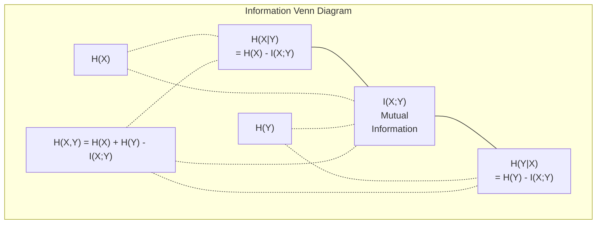

# Teoria informacji

> Teoria informacji mierzy zaskoczenie. Funkcje straty są na niej zbudowane.

**Typ:** Nauka
**Język:** Python
**Wymagania wstępne:** Faza 1, Lekcja 06 (Prawdopodobieństwo)
**Czas:** ~60 minut

## Cele nauki

- Obliczyć entropię, cross-entropy i dywergencję KL od podstaw oraz wyjaśnić ich wzajemne relacje
- Wyprowadzić, dlaczego minimalizacja funkcji straty cross-entropy jest równoważna maksymalizacji log-likelihood
- Obliczyć informację wzajemną (mutual information) między cechami i zmienną docelową, aby ocenić ważność cech
- Wyjaśnić perplexity jako efektywny rozmiar słownika, z którego model językowy wybiera

## Problem

Wywołujesz `CrossEntropyLoss()` w każdym trenowanym modelu klasyfikacyjnym. Widzisz "perplexity" w każdej pracy o modelach językowych. Czytasz o dywergencji KL w VAE, dystylacji i RLHF. To nie są niezależne koncepcje. To wszystko ten sam pomysł w różnych przebraniach.

Teoria informacji daje ci język do rozumowania o niepewności, kompresji i predykcji. Claude Shannon wynalazł ją w 1948 roku, aby rozwiązać problemy komunikacyjne. Okazuje się, że trenowanie sieci neuronowej jest problemem komunikacyjnym: model próbuje przekazać poprawną etykietę przez zaszumiony kanał wyuczonych wag.

Ta lekcja buduje każdy wzór od podstaw, żebyś widział, skąd się bierze i dlaczego działa.

## Koncepcja

### Treść informacyjna (zaskoczenie)

Kiedy zdarza się coś mało prawdopodobnego, niesie to więcej informacji. Wypadnięcie orła na monecie? Niezbyt zaskakujące. Wygrana na loterii? Bardzo zaskakująca.

Treść informacyjna zdarzenia o prawdopodobieństwie p wynosi:

```
I(x) = -log(p(x))
```

Użycie logarytmu o podstawie 2 daje bity. Użycie logarytmu naturalnego daje naty. Ten sam pomysł, różne jednostki.

```
Event              Probability    Surprise (bits)
Fair coin heads    0.5            1.0
Rolling a 6        0.167          2.58
1-in-1000 event    0.001          9.97
Certain event      1.0            0.0
```

Zdarzenia pewne niosą zerową informację. Już wiedziałeś, że nastąpią.

### Entropia (średnie zaskoczenie)

Entropia to oczekiwane zaskoczenie po wszystkich możliwych wynikach rozkładu.

```
H(P) = -sum( p(x) * log(p(x)) )  for all x
```

Sprawiedliwa moneta ma maksymalną entropię dla zmiennej binarnej: 1 bit. Niesprawiedliwa moneta (99% orzeł) ma niską entropię: 0,08 bita. Już wiesz, co się wydarzy, więc każdy rzut mówi ci niewiele.

```
Fair coin:    H = -(0.5 * log2(0.5) + 0.5 * log2(0.5)) = 1.0 bit
Biased coin:  H = -(0.99 * log2(0.99) + 0.01 * log2(0.01)) = 0.08 bits
```

Entropia mierzy nieredukowalną niepewność rozkładu. Nie można skompresować poniżej tej wartości.

### Cross-entropy (funkcja straty, którą używasz codziennie)

Cross-entropy mierzy średnie zaskoczenie, gdy używasz rozkładu Q do kodowania zdarzeń, które w rzeczywistości pochodzą z rozkładu P.

```
H(P, Q) = -sum( p(x) * log(q(x)) )  for all x
```

P to prawdziwy rozkład (etykiety). Q to predykcje twojego modelu. Jeśli Q idealnie odpowiada P, cross-entropy równa się entropii. Każda niezgodność zwiększa tę wartość.

W klasyfikacji P jest wektorem one-hot (prawdziwa klasa ma prawdopodobieństwo 1, wszystkie pozostałe 0). To upraszcza cross-entropy do:

```
H(P, Q) = -log(q(true_class))
```

To jest cały wzór funkcji straty cross-entropy dla klasyfikacji. Maksymalizuj przewidywane prawdopodobieństwo poprawnej klasy.

### Dywergencja KL (odległość między rozkładami)

Dywergencja KL mierzy, ile dodatkowego zaskoczenia otrzymujesz, używając Q zamiast P.

```
D_KL(P || Q) = sum( p(x) * log(p(x) / q(x)) )  for all x
             = H(P, Q) - H(P)
```

Cross-entropy to entropia plus dywergencja KL. Ponieważ entropia prawdziwego rozkładu jest stała w trakcie treningu, minimalizacja cross-entropy jest tym samym co minimalizacja dywergencji KL. Przesuwasz rozkład swojego modelu w kierunku prawdziwego rozkładu.

Dywergencja KL nie jest symetryczna: D_KL(P || Q) != D_KL(Q || P). Nie jest to prawdziwa metryka odległości.

### Informacja wzajemna

Informacja wzajemna mierzy, ile znajomość jednej zmiennej mówi ci o drugiej.

```
I(X; Y) = H(X) - H(X|Y)
        = H(X) + H(Y) - H(X, Y)
```

Jeśli X i Y są niezależne, informacja wzajemna jest zerowa. Znajomość jednej nie mówi ci nic o drugiej. Jeśli są idealnie skorelowane, informacja wzajemna jest równa entropii którejkolwiek zmiennej.

W selekcji cech wysoka informacja wzajemna między cechą i zmienną docelową oznacza, że cecha jest użyteczna. Niska informacja wzajemna oznacza, że jest to szum.

### Entropia warunkowa

H(Y|X) mierzy, ile niepewności o Y pozostaje po zaobserwowaniu X.

```
H(Y|X) = H(X,Y) - H(X)
```

Dwa ekstrema:
- Jeśli X całkowicie determinuje Y, to H(Y|X) = 0. Znajomość X eliminuje całą niepewność o Y. Przykład: X = temperatura w stopniach Celsjusza, Y = temperatura w stopniach Fahrenheita.
- Jeśli X nie mówi ci nic o Y, to H(Y|X) = H(Y). Znajomość X nie zmniejsza twojej niepewności wcale. Przykład: X = rzut monetą, Y = pogoda na jutro.

Entropia warunkowa jest zawsze nieujemna i nigdy nie przekracza H(Y):

```
0 <= H(Y|X) <= H(Y)
```

W uczeniu maszynowym entropia warunkowa pojawia się w drzewach decyzyjnych. Przy każdym podziale algorytm wybiera cechę X, która minimalizuje H(Y|X) -- cechę, która usuwa najwięcej niepewności o etykiecie Y.

### Entropia łączna

H(X,Y) to entropia łącznego rozkładu X i Y razem.

```
H(X,Y) = -sum sum p(x,y) * log(p(x,y))   for all x, y
```

Kluczowa właściwość:

```
H(X,Y) <= H(X) + H(Y)
```

Równość zachodzi, gdy X i Y są niezależne. Jeśli współdzielą informację, entropia łączna jest mniejsza niż suma entropii pojedynczych. "Brakująca" entropia to właśnie informacja wzajemna.



Relacje:
- H(X,Y) = H(X) + H(Y|X) = H(Y) + H(X|Y)
- I(X;Y) = H(X) - H(X|Y) = H(Y) - H(Y|X)
- H(X,Y) = H(X) + H(Y) - I(X;Y)

### Informacja wzajemna (głębsze spojrzenie)

Informacja wzajemna I(X;Y) określa, jak bardzo znajomość jednej zmiennej redukuje niepewność o drugiej.

```
I(X;Y) = H(X) - H(X|Y)
       = H(Y) - H(Y|X)
       = H(X) + H(Y) - H(X,Y)
       = sum sum p(x,y) * log(p(x,y) / (p(x) * p(y)))
```

Właściwości:
- I(X;Y) >= 0 zawsze. Nigdy nie tracisz informacji, obserwując coś.
- I(X;Y) = 0 wtedy i tylko wtedy, gdy X i Y są niezależne.
- I(X;Y) = I(Y;X). Jest symetryczna, w przeciwieństwie do dywergencji KL.
- I(X;X) = H(X). Zmienna współdzieli całą swoją informację ze sobą samą.

**Informacja wzajemna do selekcji cech.** W ML chcesz cech, które są informatywne względem zmiennej docelowej. Informacja wzajemna daje ci zasadny sposób rankingowania cech:

1. Dla każdej cechy X_i oblicz I(X_i; Y), gdzie Y jest zmienną docelową.
2. Uszereguj cechy według wyniku MI.
3. Zachowaj k najlepszych cech.

Działa to dla każdej relacji między cechą a celem -- liniowej, nieliniowej, monotonicznej lub innej. Korelacja wychwytuje tylko relacje liniowe. MI wychwytuje wszystko.

| Method | Detects | Computational cost | Handles categorical? |
|--------|---------|-------------------|---------------------|
| Pearson correlation | Linear relationships | O(n) | No |
| Spearman correlation | Monotonic relationships | O(n log n) | No |
| Mutual information | Any statistical dependency | O(n log n) with binning | Yes |

### Label smoothing i cross-entropy

Standardowa klasyfikacja używa twardych etykiet (hard targets): [0, 0, 1, 0]. Prawdziwa klasa ma prawdopodobieństwo 1, wszystkie pozostałe 0. Label smoothing zastępuje je miękkimi etykietami (soft targets):

```
soft_target = (1 - epsilon) * hard_target + epsilon / num_classes
```

Z epsilon = 0,1 i 4 klasami:
- Hard target:  [0, 0, 1, 0]
- Soft target:  [0.025, 0.025, 0.925, 0.025]

Z perspektywy teorii informacji label smoothing zwiększa entropię rozkładu docelowego. Twarde etykiety one-hot mają entropię 0 -- nie ma niepewności. Miękkie etykiety mają entropię większą od zera.

Dlaczego to pomaga:
- Zapobiega doprowadzaniu logitów przez model do wartości ekstremalnych (idealne dopasowanie do etykiety one-hot pod cross-entropy wymagałoby nieskończonych logitów)
- Działa jako regularyzacja: model nie może być w 100% pewny
- Poprawia kalibrację: przewidywane prawdopodobieństwa lepiej odzwierciedlają prawdziwą niepewność
- Zmniejsza różnicę między zachowaniem podczas treningu i wnioskowania (inference)

Funkcja straty cross-entropy z label smoothing staje się:

```
L = (1 - epsilon) * CE(hard_target, prediction) + epsilon * H_uniform(prediction)
```

Drugi człon karze predykcje, które są dalekie od rozkładu jednorodnego -- bezpośrednia regularyzacja pewności modelu.

### Dlaczego cross-entropy jest TĄ funkcją straty klasyfikacji

Trzy perspektywy, ten sam wniosek.

**Perspektywa teorii informacji.** Cross-entropy mierzy, ile bitów tracisz, używając rozkładu swojego modelu zamiast prawdziwego rozkładu. Minimalizacja tej wartości sprawia, że twój model staje się najbardziej efektywnym koderem rzeczywistości.

**Perspektywa maksymalnej wiarygodności (maximum likelihood).** Dla N próbek treningowych z prawdziwymi klasami y_i:

```
Likelihood     = product( q(y_i) )
Log-likelihood = sum( log(q(y_i)) )
Negative log-likelihood = -sum( log(q(y_i)) )
```

Ta ostatnia linia to funkcja straty cross-entropy. Minimalizacja cross-entropy = maksymalizacja wiarygodności danych treningowych w ramach twojego modelu.

**Perspektywa gradientu.** Gradient cross-entropy względem logitów to po prostu (predicted - true). Czysty, stabilny i szybki do obliczenia. To właśnie dlatego idealnie współpracuje z softmax.

### Bity vs naty

Jedyna różnica to podstawa logarytmu.

```
log base 2   -> bits      (information theory tradition)
log base e   -> nats      (machine learning convention)
log base 10  -> hartleys  (rarely used)
```

1 nat = 1/ln(2) bita = 1,4427 bita. PyTorch i TensorFlow domyślnie używają logarytmu naturalnego (natów).

### Perplexity

Perplexity to wykładnicza funkcja cross-entropy. Mówi ci, jaka jest efektywna liczba równie prawdopodobnych opcji, między którymi model jest niezdecydowany.

```
Perplexity = 2^H(P,Q)   (if using bits)
Perplexity = e^H(P,Q)   (if using nats)
```

Model językowy o perplexity 50 jest, średnio, tak zdezorientowany, jak gdyby musiał wybierać jednostajnie z 50 możliwych kolejnych tokenów. Mniej znaczy lepiej.

GPT-2 osiągnął perplexity ~30 na popularnych benchmarkach. Współczesne modele mają wartości jednocyfrowe dla dobrze reprezentowanych domen.

## Zbuduj to

### Krok 1: Treść informacyjna i entropia

```python
import math

def information_content(p, base=2):
    if p <= 0 or p > 1:
        return float('inf') if p <= 0 else 0.0
    return -math.log(p) / math.log(base)

def entropy(probs, base=2):
    return sum(
        p * information_content(p, base)
        for p in probs if p > 0
    )

fair_coin = [0.5, 0.5]
biased_coin = [0.99, 0.01]
fair_die = [1/6] * 6

print(f"Fair coin entropy:   {entropy(fair_coin):.4f} bits")
print(f"Biased coin entropy: {entropy(biased_coin):.4f} bits")
print(f"Fair die entropy:    {entropy(fair_die):.4f} bits")
```

### Krok 2: Cross-entropy i dywergencja KL

```python
def cross_entropy(p, q, base=2):
    total = 0.0
    for pi, qi in zip(p, q):
        if pi > 0:
            if qi <= 0:
                return float('inf')
            total += pi * (-math.log(qi) / math.log(base))
    return total

def kl_divergence(p, q, base=2):
    return cross_entropy(p, q, base) - entropy(p, base)

true_dist = [0.7, 0.2, 0.1]
good_model = [0.6, 0.25, 0.15]
bad_model = [0.1, 0.1, 0.8]

print(f"Entropy of true dist:     {entropy(true_dist):.4f} bits")
print(f"CE (good model):          {cross_entropy(true_dist, good_model):.4f} bits")
print(f"CE (bad model):           {cross_entropy(true_dist, bad_model):.4f} bits")
print(f"KL divergence (good):     {kl_divergence(true_dist, good_model):.4f} bits")
print(f"KL divergence (bad):      {kl_divergence(true_dist, bad_model):.4f} bits")
```

### Krok 3: Cross-entropy jako funkcja straty klasyfikacji

```python
def softmax(logits):
    max_logit = max(logits)
    exps = [math.exp(z - max_logit) for z in logits]
    total = sum(exps)
    return [e / total for e in exps]

def cross_entropy_loss(true_class, logits):
    probs = softmax(logits)
    return -math.log(probs[true_class])

logits = [2.0, 1.0, 0.1]
true_class = 0

probs = softmax(logits)
loss = cross_entropy_loss(true_class, logits)

print(f"Logits:      {logits}")
print(f"Softmax:     {[f'{p:.4f}' for p in probs]}")
print(f"True class:  {true_class}")
print(f"Loss:        {loss:.4f} nats")
print(f"Perplexity:  {math.exp(loss):.2f}")
```

### Krok 4: Cross-entropy jest równa negative log-likelihood

```python
import random

random.seed(42)

n_samples = 1000
n_classes = 3
true_labels = [random.randint(0, n_classes - 1) for _ in range(n_samples)]
model_logits = [[random.gauss(0, 1) for _ in range(n_classes)] for _ in range(n_samples)]

ce_loss = sum(
    cross_entropy_loss(label, logits)
    for label, logits in zip(true_labels, model_logits)
) / n_samples

nll = -sum(
    math.log(softmax(logits)[label])
    for label, logits in zip(true_labels, model_logits)
) / n_samples

print(f"Cross-entropy loss:      {ce_loss:.6f}")
print(f"Negative log-likelihood: {nll:.6f}")
print(f"Difference:              {abs(ce_loss - nll):.2e}")
```

### Krok 5: Informacja wzajemna

```python
def mutual_information(joint_probs, base=2):
    rows = len(joint_probs)
    cols = len(joint_probs[0])

    margin_x = [sum(joint_probs[i][j] for j in range(cols)) for i in range(rows)]
    margin_y = [sum(joint_probs[i][j] for i in range(rows)) for j in range(cols)]

    mi = 0.0
    for i in range(rows):
        for j in range(cols):
            pxy = joint_probs[i][j]
            if pxy > 0:
                mi += pxy * math.log(pxy / (margin_x[i] * margin_y[j])) / math.log(base)
    return mi

independent = [[0.25, 0.25], [0.25, 0.25]]
dependent = [[0.45, 0.05], [0.05, 0.45]]

print(f"MI (independent): {mutual_information(independent):.4f} bits")
print(f"MI (dependent):   {mutual_information(dependent):.4f} bits")
```

## Zastosuj to

Te same koncepcje przy użyciu NumPy, w sposób, w jaki będziesz ich używać w praktyce:

```python
import numpy as np

def np_entropy(p):
    p = np.asarray(p, dtype=float)
    mask = p > 0
    result = np.zeros_like(p)
    result[mask] = p[mask] * np.log(p[mask])
    return -result.sum()

def np_cross_entropy(p, q):
    p, q = np.asarray(p, dtype=float), np.asarray(q, dtype=float)
    mask = p > 0
    return -(p[mask] * np.log(q[mask])).sum()

def np_kl_divergence(p, q):
    return np_cross_entropy(p, q) - np_entropy(p)

true = np.array([0.7, 0.2, 0.1])
pred = np.array([0.6, 0.25, 0.15])
print(f"Entropy:    {np_entropy(true):.4f} nats")
print(f"Cross-ent:  {np_cross_entropy(true, pred):.4f} nats")
print(f"KL div:     {np_kl_divergence(true, pred):.4f} nats")
```

Zbudowałeś od podstaw to, co `torch.nn.CrossEntropyLoss()` robi wewnętrznie. Teraz wiesz, dlaczego strata spada w trakcie treningu: rozkład przewidywany przez twój model zbliża się do prawdziwego rozkładu, mierzony w natach utraconej informacji.

## Ćwiczenia

1. Oblicz entropię alfabetu angielskiego, zakładając rozkład jednorodny (26 liter). Następnie oszacuj ją, korzystając z rzeczywistych częstotliwości liter. Która wartość jest wyższa i dlaczego?

2. Model zwraca logity [5.0, 2.0, 0.5] dla próbki o prawdziwej klasie 1. Oblicz funkcję straty cross-entropy ręcznie, a następnie zweryfikuj wynik za pomocą swojej funkcji `cross_entropy_loss`. Jakie logity dałyby zerową stratę?

3. Pokaż, że dywergencja KL nie jest symetryczna. Wybierz dwa rozkłady P i Q i oblicz D_KL(P || Q) oraz D_KL(Q || P). Wyjaśnij, dlaczego się różnią.

4. Zbuduj funkcję, która oblicza perplexity dla sekwencji predykcji tokenów. Mając listę par (true_token_index, predicted_logits), zwróć perplexity tej sekwencji.

## Kluczowe terminy

| Term | What people say | What it actually means |
|------|----------------|----------------------|
| Information content | "Surprise" | The number of bits (or nats) needed to encode an event: -log(p) |
| Entropy | "Randomness" | The average surprise across all outcomes of a distribution. Measures irreducible uncertainty. |
| Cross-entropy | "The loss function" | Average surprise when using model distribution Q to encode events from true distribution P. |
| KL divergence | "Distance between distributions" | Extra bits wasted by using Q instead of P. Equals cross-entropy minus entropy. Not symmetric. |
| Mutual information | "How related are X and Y" | Reduction in uncertainty about X from knowing Y. Zero means independent. |
| Softmax | "Turn logits into probabilities" | Exponentiate and normalize. Maps any real-valued vector to a valid probability distribution. |
| Perplexity | "How confused the model is" | Exponential of cross-entropy. The effective vocabulary size the model is choosing from at each step. |
| Bits | "Shannon's unit" | Information measured with log base 2. One bit resolves one fair coin flip. |
| Nats | "ML's unit" | Information measured with natural log. Used by PyTorch and TensorFlow by default. |
| Negative log-likelihood | "NLL loss" | Identical to cross-entropy loss for one-hot labels. Minimizing it maximizes the probability of correct predictions. |

## Dalsza lektura

- [Shannon 1948: A Mathematical Theory of Communication](https://people.math.harvard.edu/~ctm/home/text/others/shannon/entropy/entropy.pdf) - oryginalna praca, wciąż warta przeczytania
- [Visual Information Theory (Chris Olah)](https://colah.github.io/posts/2015-09-Visual-Information/) - najlepsze wizualne wyjaśnienie entropii i dywergencji KL
- [PyTorch CrossEntropyLoss docs](https://pytorch.org/docs/stable/generated/torch.nn.CrossEntropyLoss.html) - jak framework implementuje to, co właśnie zbudowałeś
