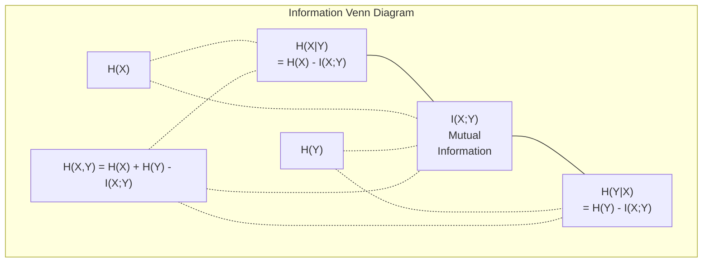

# Teoria informacji

> Teoria informacji mierzy zaskoczenie. Na nim zbudowane są funkcje straty.

**Typ:** Ucz się
**Język:** Python
**Wymagania wstępne:** Faza 1, lekcja 06 (Prawdopodobieństwo)
**Czas:** ~60 minut

## Cele nauczania

- Oblicz od podstaw entropię, entropię krzyżową i dywergencję KL i wyjaśnij ich związek
- Wyprowadź, dlaczego minimalizacja strat entropii krzyżowej jest równoznaczna z maksymalizacją logarytmu wiarygodności
- Oblicz wzajemne informacje między funkcjami a celem, aby uszeregować znaczenie funkcji
- Wyjaśnij zakłopotanie jako efektywny rozmiar słownictwa wybierany przez model języka

## Problem

Wywołujesz `CrossEntropyLoss()` w każdym trenowanym modelu klasyfikacji. W każdym dokumencie dotyczącym modelu językowego widać „zakłopotanie”. Czytasz o rozbieżnościach KL w VAE, destylacji i RLHF. Nie są to pojęcia rozłączne. Wszyscy mają ten sam pomysł, noszą różne kapelusze.

Teoria informacji dostarcza języka umożliwiającego rozumowanie niepewności, kompresji i przewidywania. Claude Shannon wynalazł go w 1948 roku, aby rozwiązać problemy komunikacyjne. Okazuje się, że uczenie sieci neuronowej stanowi problem komunikacyjny: model próbuje przesłać poprawną etykietę przez zaszumiony kanał o wyuczonych wagach.

W tej lekcji każda formuła zostanie zbudowana od podstaw, dzięki czemu zobaczysz, skąd pochodzą i dlaczego działają.

## Koncepcja

### Treść informacyjna (niespodzianka)

Kiedy dzieje się coś mało prawdopodobnego, niesie ze sobą więcej informacji. Głowy lądujące na monetach? Nic dziwnego. Wygrana na loterii? Bardzo zaskakujące.

Treść informacyjna zdarzenia z prawdopodobieństwem p wynosi:

```
I(x) = -log(p(x))
```

Użycie podstawy dziennika 2 daje bity. Korzystanie z dziennika naturalnego daje nat. Ten sam pomysł, różne jednostki.

```
Event              Probability    Surprise (bits)
Fair coin heads    0.5            1.0
Rolling a 6        0.167          2.58
1-in-1000 event    0.001          9.97
Certain event      1.0            0.0
```

Niektóre zdarzenia niosą ze sobą zero informacji. Wiedziałeś już, że tak się stanie.

### Entropia (średnia niespodzianka)

Entropia to oczekiwana niespodzianka we wszystkich możliwych wynikach rozkładu.

```
H(P) = -sum( p(x) * log(p(x)) )  for all x
```

Uczciwa moneta ma maksymalną entropię dla zmiennej binarnej: 1 bit. Moneta stronnicza (99% orłów) ma niską entropię: 0,08 bita. Wiesz już, co się stanie, więc każdy obrót nie mówi ci prawie nic.

```
Fair coin:    H = -(0.5 * log2(0.5) + 0.5 * log2(0.5)) = 1.0 bit
Biased coin:  H = -(0.99 * log2(0.99) + 0.01 * log2(0.01)) = 0.08 bits
```

Entropia mierzy nieredukowalną niepewność rozkładu. Poniżej nie można kompresować.

### Cross-Entropia (funkcja straty, której używasz na co dzień)

Entropia krzyżowa mierzy średnią niespodziankę, gdy używasz rozkładu Q do kodowania zdarzeń, które faktycznie pochodzą z rozkładu P.

```
H(P, Q) = -sum( p(x) * log(q(x)) )  for all x
```

P to prawdziwy rozkład (etykiety). Q to przewidywania Twojego modelu. Jeśli Q idealnie pasuje do P, entropia krzyżowa jest równa entropii. Wszelkie niedopasowania powodują, że jest on większy.

W klasyfikacji P jest wektorem jednogorącym (prawdziwa klasa ma prawdopodobieństwo 1, wszystko inne 0). Upraszcza to entropię krzyżową do:

```
H(P, Q) = -log(q(true_class))
```

To jest cały wzór na stratę krzyżową entropii do klasyfikacji. Maksymalizuj przewidywane prawdopodobieństwo właściwej klasy.

### Rozbieżność KL (odległość między rozkładami)

Rozbieżność KL mierzy, ile dodatkowej niespodzianki uzyskasz, używając Q zamiast P.

```
D_KL(P || Q) = sum( p(x) * log(p(x) / q(x)) )  for all x
             = H(P, Q) - H(P)
```

Entropia krzyżowa to entropia plus dywergencja KL. Ponieważ entropia prawdziwego rozkładu jest stała podczas uczenia, minimalizowanie entropii krzyżowej jest tym samym, co minimalizowanie rozbieżności KL. Popychasz rozkład swojego modelu w stronę rozkładu prawdziwego.

Rozbieżność KL nie jest symetryczna: D_KL(P || Q) != D_KL(Q || P). To nie jest prawdziwy miernik odległości.

### Wzajemne informacje

Wzajemne informacje mierzą, ile znajomość jednej zmiennej mówi o drugiej.

```
I(X; Y) = H(X) - H(X|Y)
        = H(X) + H(Y) - H(X, Y)
```

Jeśli X i Y są niezależne, wzajemna informacja wynosi zero. Znajomość jednego nie mówi nic o drugim. Jeśli są one doskonale skorelowane, wzajemne informacje są równe entropii którejkolwiek ze zmiennych.

Przy wyborze cech wysoki poziom wzajemnej informacji między cechą a celem oznacza, że ​​cecha jest użyteczna. Niski poziom wzajemnej informacji oznacza, że ​​jest to hałas.

### Entropia warunkowa

H(Y|X) mierzy, jak duża niepewność pozostaje co do Y po zaobserwowaniu X.

```
H(Y|X) = H(X,Y) - H(X)
```

Dwie skrajności:
- Jeśli X całkowicie określa Y, to H(Y|X) = 0. Znajomość X eliminuje wszelką niepewność dotyczącą Y. Przykład: X = temperatura w stopniach Celsjusza, Y = temperatura w stopniach Fahrenheita.
- Jeśli X nie mówi nic o Y, to H(Y|X) = H(Y). Znajomość X wcale nie zmniejsza Twojej niepewności. Przykład: X = rzut monetą, Y = pogoda na jutro.

Entropia warunkowa jest zawsze nieujemna i nigdy nie przekracza H(Y):

```
0 <= H(Y|X) <= H(Y)
```

W uczeniu maszynowym entropia warunkowa pojawia się w drzewach decyzyjnych. Przy każdym podziale algorytm wybiera cechę X, która minimalizuje H(Y|X) — cechę, która usuwa największą niepewność co do etykiety Y.

### Wspólna entropia

H(X,Y) to entropia łącznego rozkładu X i Y.

```
H(X,Y) = -sum sum p(x,y) * log(p(x,y))   for all x, y
```

Kluczowa właściwość:

```
H(X,Y) <= H(X) + H(Y)
```

Równość zachodzi, gdy X i Y są niezależne. Jeśli dzielą się informacjami, łączna entropia jest mniejsza niż suma poszczególnych entropii. „Brakująca” entropia jest dokładnie wzajemną informacją.



Relacje:
- H(X,Y) = H(X) + H(Y|X) = H(Y) + H(X|Y)
- I(X;Y) = H(X) - H(X|Y) = H(Y) - H(Y|X)
- H(X,Y) = H(X) + H(Y) - I(X;Y)

### Wzajemne informacje (głębokie nurkowanie)

Wzajemna informacja I(X;Y) określa ilościowo, w jakim stopniu znajomość jednej zmiennej zmniejsza niepewność co do drugiej.

```
I(X;Y) = H(X) - H(X|Y)
       = H(Y) - H(Y|X)
       = H(X) + H(Y) - H(X,Y)
       = sum sum p(x,y) * log(p(x,y) / (p(x) * p(y)))
```

Właściwości:
- I(X;Y) >= 0 zawsze. Nigdy nie tracisz informacji, obserwując coś.
- I(X;Y) = 0 wtedy i tylko wtedy, gdy X i Y są niezależne.
- I(X;Y) = I(Y;X). Jest symetryczna, w przeciwieństwie do rozbieżności KL.
- I(X;X) = H(X). Zmienna dzieli się ze sobą wszystkimi informacjami.

**Wzajemne informacje dotyczące wyboru funkcji.** W ML potrzebne są funkcje informujące o celu. Wzajemne informacje pozwalają w prosty sposób oceniać funkcje:

1. Dla każdej cechy X_i oblicz I(X_i; Y), gdzie Y jest zmienną docelową.
2. Uszereguj funkcje według wyniku MI.
3. Zachowaj najlepsze funkcje.

Działa to w przypadku każdej relacji między cechą a celem – liniowej, nieliniowej, monotonicznej lub nie. Korelacja obejmuje jedynie zależności liniowe. MI łapie wszystko.

| Metoda | Wykrywa | Koszt obliczeniowy | Odnosi się kategorycznie? |
|--------|---------|--------------------------------|----------------------------------|
| Korelacja Pearsona | Zależności liniowe | O(n) | Nie |
| Korelacja Spearmana | Relacje monotoniczne | O(n log n) | Nie |
| Wzajemne informacje | Dowolna zależność statystyczna | O(n log n) z kategoryzacją | Tak |

### Wygładzanie etykiet i entropia krzyżowa

Klasyfikacja standardowa wykorzystuje cele twarde: [0, 0, 1, 0]. Prawdziwa klasa otrzymuje prawdopodobieństwo 1, wszystko inne otrzymuje 0. Wygładzanie etykiet zastępuje je miękkimi celami:

```
soft_target = (1 - epsilon) * hard_target + epsilon / num_classes
```

Z epsilon = 0,1 i 4 klasami:
- Trudny cel: [0, 0, 1, 0]
- Miękki cel: [0,025, 0,025, 0,925, 0,025]

Z punktu widzenia teorii informacji wygładzanie etykiet zwiększa entropię rozkładu docelowego. Twarde, jednogorące cele mają entropię 0 – nie ma niepewności. Miękkie cele mają dodatnią entropię.

Dlaczego to pomaga:
- Zapobiega doprowadzaniu logitów do ekstremalnych wartości przez model (potrzebne byłyby nieskończone logity, aby idealnie dopasować jeden gorący cel w warunkach entropii krzyżowej)
- Działa jak regularyzacja: model nie może być w 100% pewny
- Poprawia kalibrację: przewidywane prawdopodobieństwa lepiej odzwierciedlają rzeczywistą niepewność
- Zmniejsza różnicę między zachowaniem szkoleniowym a wnioskowanym

Utrata entropii krzyżowej przy wygładzaniu etykiet staje się:

```
L = (1 - epsilon) * CE(hard_target, prediction) + epsilon * H_uniform(prediction)
```

Drugi termin penalizuje przewidywania, które są dalekie od jednolitych – bezpośrednie uregulowanie zaufania.

### Dlaczego entropia krzyżowa jest stratą w klasyfikacji

Trzy perspektywy, ten sam wniosek.

**Widok teorii informacji.** Entropia krzyżowa mierzy, ile bitów marnujesz, korzystając z rozkładu modelu zamiast rozkładu prawdziwego. Minimalizowanie go sprawia, że ​​Twój model staje się najskuteczniejszym koderem rzeczywistości.

**Widok największej wiarygodności.** Dla N próbek uczących z prawdziwymi klasami y_i:

```
Likelihood     = product( q(y_i) )
Log-likelihood = sum( log(q(y_i)) )
Negative log-likelihood = -sum( log(q(y_i)) )
```

Ostatnia linia to utrata entropii krzyżowej. Minimalizowanie entropii krzyżowej = maksymalizacja prawdopodobieństwa danych szkoleniowych w ramach modelu.

**Widok gradientowy.** Gradient entropii krzyżowej w odniesieniu do logitów jest po prostu (przewidywany – prawdziwy). Czysty, stabilny i szybki w obliczeniach. Dlatego idealnie komponuje się z softmaxem.

### Bitsy kontra Naty

Jedyną różnicą jest podstawa z bali.

```
log base 2   -> bits      (information theory tradition)
log base e   -> nats      (machine learning convention)
log base 10  -> hartleys  (rarely used)
```

1 nat = 1/ln(2) bitów = 1,4427 bitów. PyTorch i TensorFlow domyślnie używają dziennika naturalnego (nats).

### Zakłopotanie

Zakłopotanie jest wykładnikiem entropii krzyżowej. Informuje o efektywnej liczbie równie prawdopodobnych wyborów, pomiędzy którymi model nie jest pewien.

```
Perplexity = 2^H(P,Q)   (if using bits)
Perplexity = e^H(P,Q)   (if using nats)
```

Model językowy z zakłopotaniem 50 jest średnio tak zagmatwany, jak gdyby musiał jednolicie wybierać spośród 50 możliwych kolejnych tokenów. Niżej jest lepiej.

GPT-2 osiągnął poziom zakłopotania ~30 w typowych testach porównawczych. Nowoczesne modele są jednocyfrowe dla dobrze reprezentowanych domen.

## Zbuduj to

### Krok 1: Treść informacji i entropia

```python
import math

def information_content(p, base=2):
    if p <= 0 or p > 1:
        return float('inf') if p <= 0 else 0.0
    return -math.log(p) / math.log(base)

def entropy(probs, base=2):
    return sum(
        p * information_content(p, base)
        for p in probs if p > 0
    )

fair_coin = [0.5, 0.5]
biased_coin = [0.99, 0.01]
fair_die = [1/6] * 6

print(f"Fair coin entropy:   {entropy(fair_coin):.4f} bits")
print(f"Biased coin entropy: {entropy(biased_coin):.4f} bits")
print(f"Fair die entropy:    {entropy(fair_die):.4f} bits")
```

### Krok 2: Entropia krzyżowa i dywergencja KL

```python
def cross_entropy(p, q, base=2):
    total = 0.0
    for pi, qi in zip(p, q):
        if pi > 0:
            if qi <= 0:
                return float('inf')
            total += pi * (-math.log(qi) / math.log(base))
    return total

def kl_divergence(p, q, base=2):
    return cross_entropy(p, q, base) - entropy(p, base)

true_dist = [0.7, 0.2, 0.1]
good_model = [0.6, 0.25, 0.15]
bad_model = [0.1, 0.1, 0.8]

print(f"Entropy of true dist:     {entropy(true_dist):.4f} bits")
print(f"CE (good model):          {cross_entropy(true_dist, good_model):.4f} bits")
print(f"CE (bad model):           {cross_entropy(true_dist, bad_model):.4f} bits")
print(f"KL divergence (good):     {kl_divergence(true_dist, good_model):.4f} bits")
print(f"KL divergence (bad):      {kl_divergence(true_dist, bad_model):.4f} bits")
```

### Krok 3: Entropia krzyżowa jako utrata klasyfikacji

```python
def softmax(logits):
    max_logit = max(logits)
    exps = [math.exp(z - max_logit) for z in logits]
    total = sum(exps)
    return [e / total for e in exps]

def cross_entropy_loss(true_class, logits):
    probs = softmax(logits)
    return -math.log(probs[true_class])

logits = [2.0, 1.0, 0.1]
true_class = 0

probs = softmax(logits)
loss = cross_entropy_loss(true_class, logits)

print(f"Logits:      {logits}")
print(f"Softmax:     {[f'{p:.4f}' for p in probs]}")
print(f"True class:  {true_class}")
print(f"Loss:        {loss:.4f} nats")
print(f"Perplexity:  {math.exp(loss):.2f}")
```

### Krok 4: Entropia krzyżowa równa się ujemnemu logarytmowi wiarygodności

```python
import random

random.seed(42)

n_samples = 1000
n_classes = 3
true_labels = [random.randint(0, n_classes - 1) for _ in range(n_samples)]
model_logits = [[random.gauss(0, 1) for _ in range(n_classes)] for _ in range(n_samples)]

ce_loss = sum(
    cross_entropy_loss(label, logits)
    for label, logits in zip(true_labels, model_logits)
) / n_samples

nll = -sum(
    math.log(softmax(logits)[label])
    for label, logits in zip(true_labels, model_logits)
) / n_samples

print(f"Cross-entropy loss:      {ce_loss:.6f}")
print(f"Negative log-likelihood: {nll:.6f}")
print(f"Difference:              {abs(ce_loss - nll):.2e}")
```

### Krok 5: Wzajemna informacja

```python
def mutual_information(joint_probs, base=2):
    rows = len(joint_probs)
    cols = len(joint_probs[0])

    margin_x = [sum(joint_probs[i][j] for j in range(cols)) for i in range(rows)]
    margin_y = [sum(joint_probs[i][j] for i in range(rows)) for j in range(cols)]

    mi = 0.0
    for i in range(rows):
        for j in range(cols):
            pxy = joint_probs[i][j]
            if pxy > 0:
                mi += pxy * math.log(pxy / (margin_x[i] * margin_y[j])) / math.log(base)
    return mi

independent = [[0.25, 0.25], [0.25, 0.25]]
dependent = [[0.45, 0.05], [0.05, 0.45]]

print(f"MI (independent): {mutual_information(independent):.4f} bits")
print(f"MI (dependent):   {mutual_information(dependent):.4f} bits")
```

## Użyj tego

Te same koncepcje przy użyciu NumPy, sposób, w jaki będziesz z nich korzystać w praktyce:

```python
import numpy as np

def np_entropy(p):
    p = np.asarray(p, dtype=float)
    mask = p > 0
    result = np.zeros_like(p)
    result[mask] = p[mask] * np.log(p[mask])
    return -result.sum()

def np_cross_entropy(p, q):
    p, q = np.asarray(p, dtype=float), np.asarray(q, dtype=float)
    mask = p > 0
    return -(p[mask] * np.log(q[mask])).sum()

def np_kl_divergence(p, q):
    return np_cross_entropy(p, q) - np_entropy(p)

true = np.array([0.7, 0.2, 0.1])
pred = np.array([0.6, 0.25, 0.15])
print(f"Entropy:    {np_entropy(true):.4f} nats")
print(f"Cross-ent:  {np_cross_entropy(true, pred):.4f} nats")
print(f"KL div:     {np_kl_divergence(true, pred):.4f} nats")
```

Zbudowałeś od podstaw to, co `torch.nn.CrossEntropyLoss()` robi wewnętrznie. Teraz już wiesz, dlaczego strata maleje podczas uczenia: rozkład przewidywany przez Twój model zbliża się do rozkładu prawdziwego, mierzonego w natach zmarnowanych informacji.

## Ćwiczenia

1. Oblicz entropię alfabetu angielskiego przy założeniu równomiernego rozkładu (26 liter). Następnie oszacuj to, używając rzeczywistych częstotliwości liter. Co jest wyższe i dlaczego?

2. Model wyprowadza logity [5,0, 2,0, 0,5] dla próbki z prawdziwą klasą 1. Oblicz ręcznie stratę entropijną, a następnie sprawdź ją za pomocą funkcji `cross_entropy_loss`. Jakie logity dałyby zero strat?

3. Pokaż, że rozbieżność KL nie jest symetryczna. Wybierz dwa rozkłady P i Q i oblicz D_KL(P || Q) i D_KL(Q || P). Wyjaśnij, dlaczego się różnią.

4. Zbuduj funkcję obliczającą złożoność sekwencji przewidywań tokenów. Biorąc pod uwagę listę par (true_token_index, przewidywane_logits), zwróć złożoność sekwencji.

## Kluczowe terminy

| Termin | Co ludzie mówią | Co to właściwie oznacza |
|------|----------------|----------------------|
| Treść informacyjna | „Niespodzianka” | Liczba bitów (lub NAT) potrzebnych do zakodowania zdarzenia: -log(p) |
| Entropia | „Losowość” | Średnia niespodzianka dla wszystkich wyników dystrybucji. Mierzy nieredukowalną niepewność. |
| Entropia krzyżowa | „Funkcja straty” | Średnie zaskoczenie przy wykorzystaniu rozkładu modelu Q do kodowania zdarzeń z rozkładu prawdziwego P. |
| Rozbieżność KL | „Odległość między rozkładami” | Dodatkowe bity marnowane przy użyciu Q zamiast P. Równa się entropii krzyżowej minus entropia. Nie symetryczny. |
| Wzajemne informacje | „Jak powiązane są X i Y” | Zmniejszenie niepewności co do X poprzez poznanie Y. Zero oznacza niezależność. |
| Softmax | „Zamień logity na prawdopodobieństwa” | Potęguj i normalizuj. Odwzorowuje dowolny wektor o wartościach rzeczywistych na prawidłowy rozkład prawdopodobieństwa. |
| Zakłopotanie | „Jak zdezorientowany jest model” | Wykładniczy entropii krzyżowej. Efektywny rozmiar słownictwa, który model wybiera na każdym etapie. |
| Bity | „Jednostka Shannona” | Informacje mierzone przy użyciu logarytmu o podstawie 2. Jeden bit rozstrzyga jeden uczciwy rzut monetą. |
| Naty | „Jednostka ML” | Informacje mierzone logiem naturalnym. Domyślnie używane przez PyTorch i TensorFlow. |
| Ujemny log wiarygodności | „Strata NLL” | Identyczne jak utrata entropii krzyżowej w przypadku etykiet typu one-hot. Minimalizowanie go maksymalizuje prawdopodobieństwo trafnych przewidywań. |

## Dalsze czytanie

- [Shannon 1948: A Mathematical Theory of Communication](https://people.math.harvard.edu/~ctm/home/text/others/shannon/entropy/entropy.pdf) - oryginalna praca, wciąż czytelna
- [Teoria informacji wizualnej (Chris Olah)](https://colah.github.io/posts/2015-09-Visual-Information/) - najlepsze wizualne wyjaśnienie entropii i rozbieżności KL
- [dokumentacja PyTorch CrossEntropyLoss](https://pytorch.org/docs/stable/generated/torch.nn.CrossEntropyLoss.html) - jak framework implementuje to, co właśnie zbudowałeś